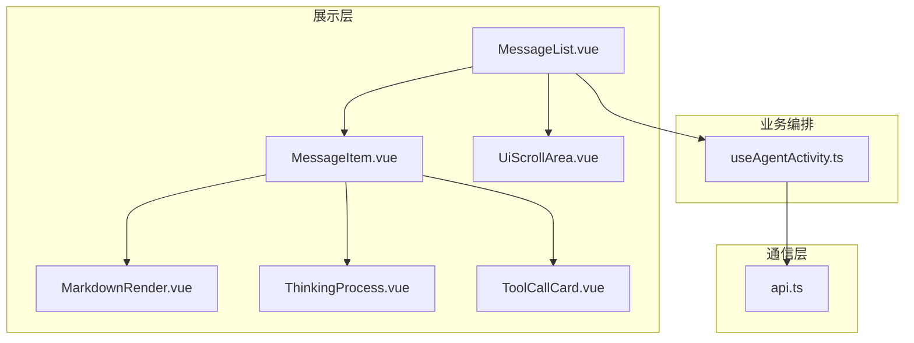
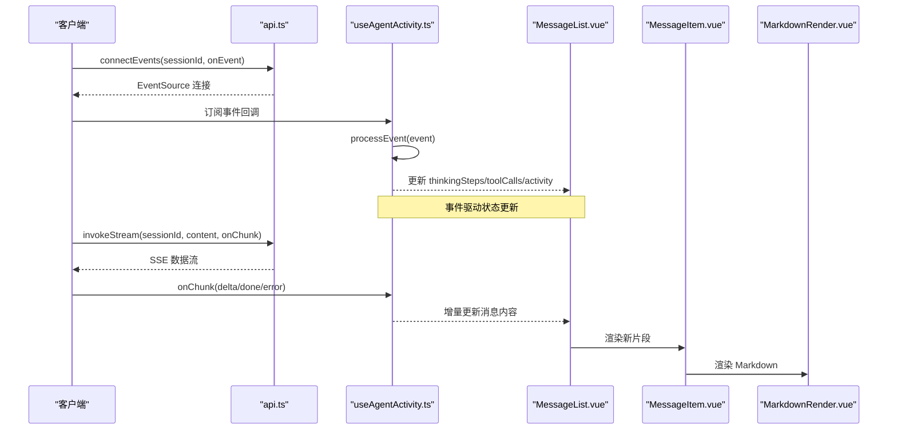
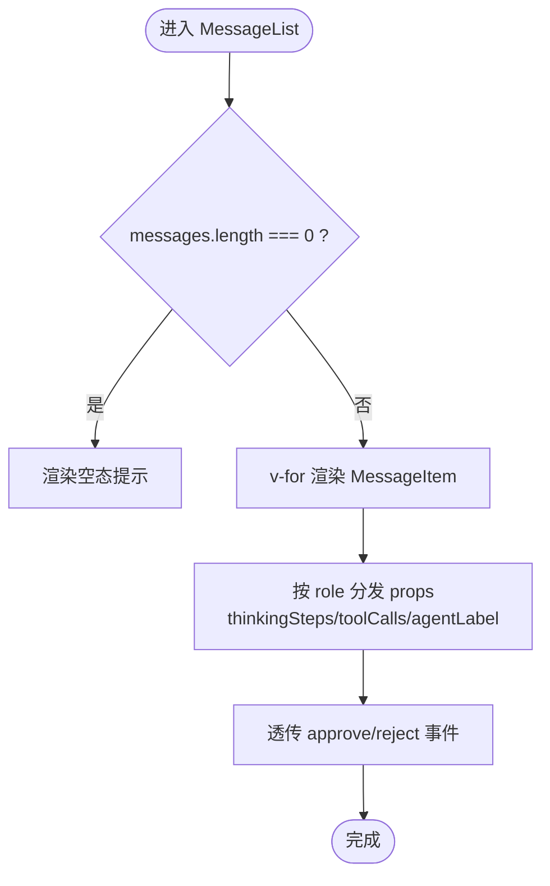
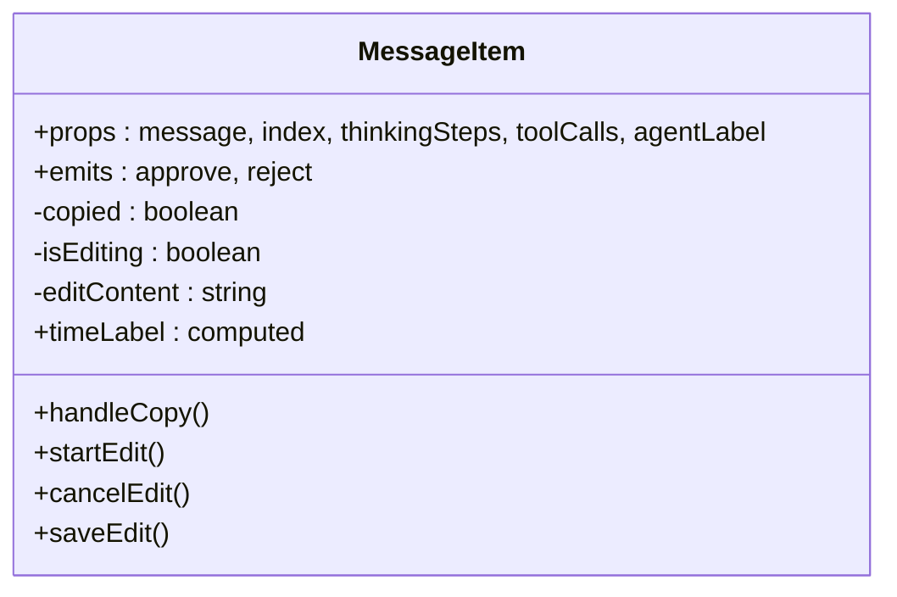
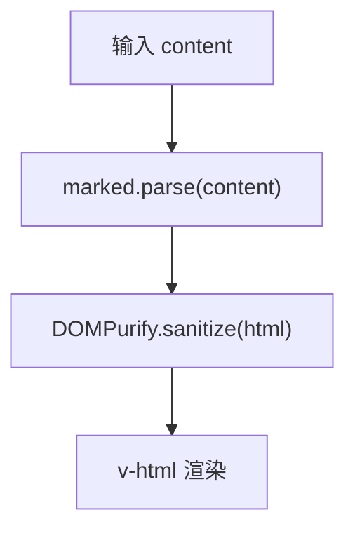
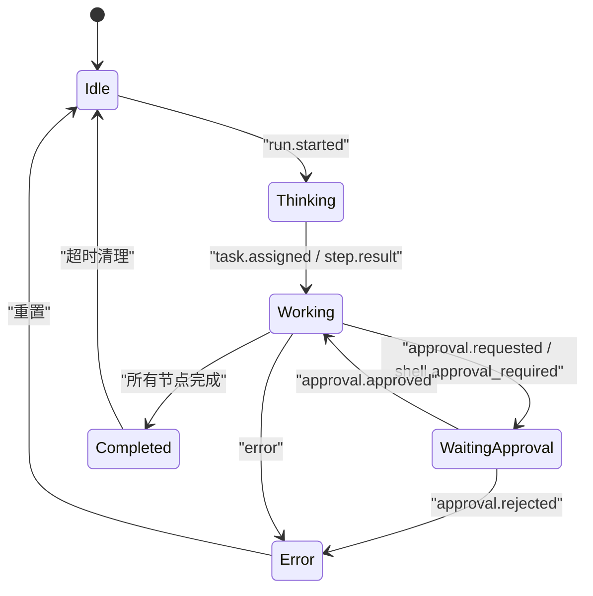
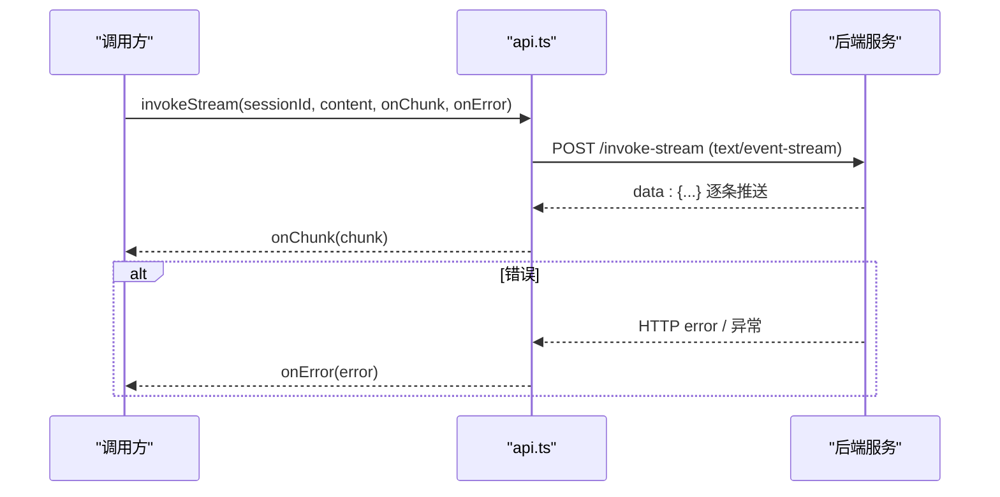
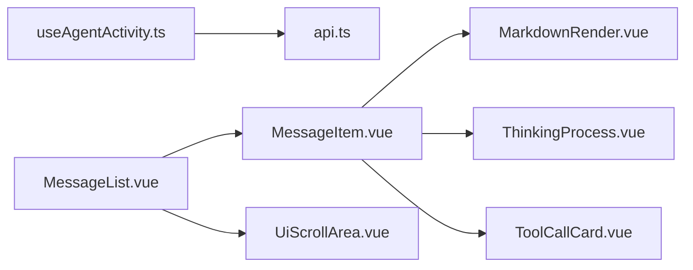

# 消息系统核心

<cite>
**本文引用的文件**   
- [MessageItem.vue](file://apps/desktop/src/components/MessageItem.vue)
- [MessageList.vue](file://apps/desktop/src/components/MessageList.vue)
- [MarkdownRender.vue](file://apps/desktop/src/components/MarkdownRender.vue)
- [useAgentActivity.ts](file://apps/desktop/src/composables/useAgentActivity.ts)
- [api.ts](file://apps/desktop/src/api.ts)
- [scroll-area.vue](file://apps/desktop/src/components/ui/scroll-area.vue)
- [ThinkingProcess.vue](file://apps/desktop/src/components/chat/ThinkingProcess.vue)
- [ToolCallCard.vue](file://apps/desktop/src/components/chat/ToolCallCard.vue)
</cite>

## 目录
1. [简介](#简介)
2. [项目结构](#项目结构)
3. [核心组件](#核心组件)
4. [架构总览](#架构总览)
5. [详细组件分析](#详细组件分析)
6. [依赖关系分析](#依赖关系分析)
7. [性能考量](#性能考量)
8. [故障排查指南](#故障排查指南)
9. [结论](#结论)
10. [附录](#附录)

## 简介
本文件围绕消息系统的核心组件，系统性阐述 MessageItem 与 MessageList 的实现原理与交互流程，覆盖消息渲染、流式响应处理、Markdown 格式化、代码高亮与链接处理、消息状态管理、事件处理机制与性能优化策略。同时给出虚拟滚动实现思路、内存管理与大数据集处理方案，并提供自定义消息类型扩展、样式定制与主题适配指南，以及错误处理、重试机制与离线支持建议。

## 项目结构
消息系统相关代码集中在桌面应用前端模块中，采用 Vue 单文件组件与组合式 API 组织：
- 展示层：MessageList（列表容器）、MessageItem（单条消息）、MarkdownRender（Markdown 渲染）
- 业务编排：useAgentActivity（事件驱动的状态机与数据聚合）
- 通信层：api.ts（REST/SSE/EventSource）
- UI 基础：UiScrollArea（滚动容器）
- 辅助卡片：ThinkingProcess（思考过程）、ToolCallCard（工具调用卡片）

图表来源 
- [MessageList.vue:1-61](file://apps/desktop/src/components/MessageList.vue#L1-L61)
- [MessageItem.vue:1-138](file://apps/desktop/src/components/MessageItem.vue#L1-L138)
- [MarkdownRender.vue:1-22](file://apps/desktop/src/components/MarkdownRender.vue#L1-L22)
- [useAgentActivity.ts:1-697](file://apps/desktop/src/composables/useAgentActivity.ts#L1-L697)
- [api.ts:997-1330](file://apps/desktop/src/api.ts#L997-L1330)
- [scroll-area.vue:1-18](file://apps/desktop/src/components/ui/scroll-area.vue#L1-L18)
- [ThinkingProcess.vue:1-343](file://apps/desktop/src/components/chat/ThinkingProcess.vue#L1-L343)
- [ToolCallCard.vue:1-413](file://apps/desktop/src/components/chat/ToolCallCard.vue#L1-L413)

章节来源
- [MessageList.vue:1-61](file://apps/desktop/src/components/MessageList.vue#L1-L61)
- [MessageItem.vue:1-138](file://apps/desktop/src/components/MessageItem.vue#L1-L138)
- [MarkdownRender.vue:1-22](file://apps/desktop/src/components/MarkdownRender.vue#L1-L22)
- [useAgentActivity.ts:1-697](file://apps/desktop/src/composables/useAgentActivity.ts#L1-L697)
- [api.ts:997-1330](file://apps/desktop/src/api.ts#L997-L1330)
- [scroll-area.vue:1-18](file://apps/desktop/src/components/ui/scroll-area.vue#L1-L18)

## 核心组件
- MessageList：消息流容器，负责渲染消息列表、空态提示与滚动区域；将 thinkingSteps、toolCalls、agentLabel 等上下文按角色分发到子项。
- MessageItem：单条消息渲染，区分用户与助手消息；助手消息包含 Agent 标签、时间戳、思考过程、工具调用卡片与 Markdown 内容；用户消息提供复制与编辑操作。
- MarkdownRender：基于 marked 解析 Markdown，使用 DOMPurify 进行安全清洗后以 v-html 渲染。
- useAgentActivity：通过 EventSource 订阅后端事件，维护运行状态、工具调用、思考步骤、进度事件与代理状态；在收到特定事件时刷新工具执行时间线。
- api.ts：封装 REST 请求与 SSE/EventSource 连接，提供 invokeStream（SSE 流式调用）与 connectEvents（事件订阅）。

章节来源
- [MessageList.vue:1-61](file://apps/desktop/src/components/MessageList.vue#L1-L61)
- [MessageItem.vue:1-138](file://apps/desktop/src/components/MessageItem.vue#L1-L138)
- [MarkdownRender.vue:1-22](file://apps/desktop/src/components/MarkdownRender.vue#L1-L22)
- [useAgentActivity.ts:1-697](file://apps/desktop/src/composables/useAgentActivity.ts#L1-L697)
- [api.ts:997-1330](file://apps/desktop/src/api.ts#L997-L1330)

## 架构总览
消息系统由“事件驱动 + 流式渲染”构成：
- 事件通道：connectEvents 建立 EventSource，统一分派 run.started、task_graph.created、task.assigned、step.result.created、supervision.checked、context.pack.created、approval.requested/rejected、tool.shell.approval_required、message.created 等事件。
- 状态机：useAgentActivity 根据事件更新 activity、thinkingSteps、toolCalls、agentStates、progressEvents，并在完成或错误时清理。
- 渲染链路：MessageList 接收 messages/thinkingSteps/toolCalls/agentLabel，MessageItem 渲染具体消息，MarkdownRender 渲染富文本。
- 流式调用：invokeStream 通过 SSE 推送 ModelStreamChunkDto，上层可据此增量更新消息内容。

图表来源 
- [api.ts:1257-1328](file://apps/desktop/src/api.ts#L1257-L1328)
- [useAgentActivity.ts:490-530](file://apps/desktop/src/composables/useAgentActivity.ts#L490-L530)
- [MessageList.vue:24-46](file://apps/desktop/src/components/MessageList.vue#L24-L46)
- [MessageItem.vue:66-136](file://apps/desktop/src/components/MessageItem.vue#L66-L136)
- [MarkdownRender.vue:10-21](file://apps/desktop/src/components/MarkdownRender.vue#L10-L21)

## 详细组件分析

### MessageList 组件
- 职责：承载消息流容器，使用 UiScrollArea 提供滚动能力；遍历 messages 渲染 MessageItem；当无消息时显示空态提示。
- 数据分发：根据 message.role 决定传递 thinkingSteps、toolCalls、agentLabel 给助手消息；用户消息不携带这些上下文。
- 事件透传：approve/reject 事件从 ToolCallCard 冒泡至父级，供上层审批逻辑处理。

章节来源
- [MessageList.vue:1-61](file://apps/desktop/src/components/MessageList.vue#L1-L61)
- [scroll-area.vue:1-18](file://apps/desktop/src/components/ui/scroll-area.vue#L1-L18)

### MessageItem 组件
- 角色分支：assistant 渲染 Agent 标签、时间、思考过程、工具调用卡片与 Markdown；user 渲染气泡与操作按钮（复制、编辑）。
- 交互：复制使用 navigator.clipboard；编辑为本地状态切换，保存暂留 TODO。
- 元信息：created_at 格式化为本地时间字符串，异常捕获保证健壮性。

图表来源 
- [MessageItem.vue:11-64](file://apps/desktop/src/components/MessageItem.vue#L11-L64)
- [MessageItem.vue:66-136](file://apps/desktop/src/components/MessageItem.vue#L66-L136)

章节来源
- [MessageItem.vue:1-138](file://apps/desktop/src/components/MessageItem.vue#L1-L138)

### MarkdownRender 组件
- 解析：marked.parse(content, { breaks: true, gfm: true }) 生成 HTML。
- 安全：DOMPurify.sanitize(rawHtml) 过滤危险脚本与属性。
- 渲染：v-html 输出 sanitized HTML。

图表来源 
- [MarkdownRender.vue:10-16](file://apps/desktop/src/components/MarkdownRender.vue#L10-L16)

章节来源
- [MarkdownRender.vue:1-22](file://apps/desktop/src/components/MarkdownRender.vue#L1-L22)

### ThinkingProcess 组件
- 功能：折叠面板展示思考步骤，支持展开/收起动画；不同 step.type 映射图标与颜色；显示时间、耗时、严重级别等元信息。
- 数据：ThinkingStep[]，包含 id、type、title、description、timestamp、durationMs、severity 等。

章节来源
- [ThinkingProcess.vue:1-343](file://apps/desktop/src/components/chat/ThinkingProcess.vue#L1-L343)

### ToolCallCard 组件
- 功能：展示工具调用卡片，含图标、标题、参数摘要、状态徽章、耗时；高风险标记；等待审批时显示批准/拒绝按钮；详情区展示结果摘要与证据列表。
- 状态映射：pending/running/completed/failed/waiting_approval。

章节来源
- [ToolCallCard.vue:1-413](file://apps/desktop/src/components/chat/ToolCallCard.vue#L1-L413)

### useAgentActivity 组合式函数
- 状态模型：activity、toolCalls、thinkingSteps、agentStates、progressEvents。
- 事件处理：processRunStarted、processTaskGraphCreated、processTaskAssigned、processStepResult、processSupervision、processContextPack、processApprovalRequested/Decided、processShellApprovalRequired、processMessageCreated。
- 数据同步：refreshToolExecutions 拉取工具执行时间线并排序；enrichFromOrchestration 合并编排快照。
- 生命周期：watch sessionId 自动重连；onUnmounted 清理资源；完成后定时清理活动状态。

图表来源 
- [useAgentActivity.ts:97-107](file://apps/desktop/src/composables/useAgentActivity.ts#L97-L107)
- [useAgentActivity.ts:215-488](file://apps/desktop/src/composables/useAgentActivity.ts#L215-L488)
- [useAgentActivity.ts:532-538](file://apps/desktop/src/composables/useAgentActivity.ts#L532-L538)

章节来源
- [useAgentActivity.ts:1-697](file://apps/desktop/src/composables/useAgentActivity.ts#L1-L697)

### api.ts 通信层
- REST：request 统一封装 fetch，错误提取 extractErrorMessage，返回结构化错误。
- SSE 流式：invokeStream 使用 ReadableStream 读取 text/event-stream，按行解析 data: JSON 块，回调 onChunk。
- 事件订阅：connectEvents 建立 EventSource，注册多类事件监听器，统一转发 to onEvent。

图表来源 
- [api.ts:1257-1308](file://apps/desktop/src/api.ts#L1257-L1308)

章节来源
- [api.ts:945-995](file://apps/desktop/src/api.ts#L945-L995)
- [api.ts:1257-1328](file://apps/desktop/src/api.ts#L1257-L1328)

## 依赖关系分析
- 组件耦合：MessageList 依赖 MessageItem 与 UiScrollArea；MessageItem 依赖 MarkdownRender、ThinkingProcess、ToolCallCard。
- 数据流向：useAgentActivity 通过事件驱动更新状态，MessageList 消费状态渲染；MessageItem 消费单条消息与上下文。
- 外部依赖：marked、DOMPurify、@lucide/vue 图标库、vue-i18n 国际化。

图表来源 
- [MessageList.vue:1-61](file://apps/desktop/src/components/MessageList.vue#L1-L61)
- [MessageItem.vue:1-138](file://apps/desktop/src/components/MessageItem.vue#L1-L138)
- [MarkdownRender.vue:1-22](file://apps/desktop/src/components/MarkdownRender.vue#L1-L22)
- [useAgentActivity.ts:1-697](file://apps/desktop/src/composables/useAgentActivity.ts#L1-L697)
- [api.ts:997-1330](file://apps/desktop/src/api.ts#L997-L1330)

章节来源
- [MessageList.vue:1-61](file://apps/desktop/src/components/MessageList.vue#L1-L61)
- [MessageItem.vue:1-138](file://apps/desktop/src/components/MessageItem.vue#L1-L138)
- [useAgentActivity.ts:1-697](file://apps/desktop/src/composables/useAgentActivity.ts#L1-L697)
- [api.ts:997-1330](file://apps/desktop/src/api.ts#L997-L1330)

## 性能考量
当前实现要点与建议：
- 渲染性能
  - 当前 MessageList 使用 v-for 全量渲染，适合中小规模消息；大数据集建议引入虚拟滚动（仅渲染可视区域），减少 DOM 节点数量与重排重绘。
  - MarkdownRender 每次变更都会重新解析与清洗，建议在 content 未变化时使用 computed 缓存，避免重复计算。
- 内存管理
  - progressEvents 限制长度（slice(-20)），防止无限增长；thinkingSteps/toolCalls 应结合会话生命周期做清理。
  - EventSource 与定时器需在 onUnmounted 中释放，避免泄漏。
- 流式处理
  - invokeStream 使用 TextDecoder 与缓冲拼接，注意断点续传与乱码处理；对大段 delta 可考虑节流合并渲染。
- 网络与事件
  - connectEvents 的 onEvent 回调应避免阻塞主线程；refreshToolExecutions 限频或去抖，避免频繁拉取。
- 主题与样式
  - 使用 CSS 变量（如 --border-muted、--bg-secondary、--accent-*）便于主题切换；避免硬编码颜色。

[本节为通用指导，不直接分析具体文件]

## 故障排查指南
- 网络连接失败
  - 现象：invokeStream/connectEvents 无法建立连接或报错。
  - 排查：检查 gatewayUrl 配置、CORS、后端服务可用性；查看 request 的错误提取逻辑。
- 事件丢失或顺序错乱
  - 现象：thinkingSteps/toolCalls 不完整或顺序异常。
  - 排查：确认 EventSource 事件监听是否完整；检查 refreshToolExecutions 的排序逻辑（seq）。
- 审批流程卡住
  - 现象：waiting_approval 状态不推进。
  - 排查：确认 approve/reject 事件是否触发；检查 ToolCallCard 的事件冒泡与父级处理。
- Markdown 渲染异常
  - 现象：HTML 被过滤或脚本被拦截。
  - 排查：检查 DOMPurify 配置；确保 content 合法；必要时放宽白名单。
- 内存占用过高
  - 现象：长时间运行后页面卡顿。
  - 排查：检查 progressEvents/thinkingSteps/toolCalls 长度限制；确认定时器与 EventSource 已释放。

章节来源
- [api.ts:945-995](file://apps/desktop/src/api.ts#L945-L995)
- [useAgentActivity.ts:540-565](file://apps/desktop/src/composables/useAgentActivity.ts#L540-L565)
- [ToolCallCard.vue:108-120](file://apps/desktop/src/components/chat/ToolCallCard.vue#L108-L120)
- [MarkdownRender.vue:10-16](file://apps/desktop/src/components/MarkdownRender.vue#L10-L16)

## 结论
消息系统以事件驱动为核心，结合流式响应与 Markdown 渲染，实现了实时、安全的对话体验。通过 useAgentActivity 统一管理状态与事件，MessageList/MessageItem 专注渲染与交互，MarkdownRender 保障内容与安全性。未来可在大数据集场景引入虚拟滚动、优化流式合并渲染、增强错误恢复与离线缓存，进一步提升性能与鲁棒性。

[本节为总结性内容，不直接分析具体文件]

## 附录

### 自定义消息类型扩展
- 扩展 MessageDto 的 role 字段，或在 MessageItem 中新增分支渲染逻辑。
- 在 useAgentActivity 中新增事件处理器，将新事件映射到 thinkingSteps/toolCalls/progressEvents。
- 在 MessageList 中按新 role 分发上下文。

章节来源
- [MessageItem.vue:66-136](file://apps/desktop/src/components/MessageItem.vue#L66-L136)
- [useAgentActivity.ts:490-530](file://apps/desktop/src/composables/useAgentActivity.ts#L490-L530)
- [MessageList.vue:28-38](file://apps/desktop/src/components/MessageList.vue#L28-L38)

### 样式定制与主题适配
- 使用 CSS 变量统一色彩与间距，便于暗色/亮色主题切换。
- 为 MessageItem/MessageList/ToolCallCard/ThinkingProcess 定义可覆盖的样式类。
- 避免内联样式，优先使用 scoped 样式与 Tailwind 类名。

章节来源
- [MessageItem.vue:66-136](file://apps/desktop/src/components/MessageItem.vue#L66-L136)
- [ToolCallCard.vue:140-413](file://apps/desktop/src/components/chat/ToolCallCard.vue#L140-L413)
- [ThinkingProcess.vue:126-343](file://apps/desktop/src/components/chat/ThinkingProcess.vue#L126-L343)

### 错误处理与重试机制
- 网络错误：在 request/invokeStream/connectEvents 中捕获并上报；提供用户可见的错误提示。
- 重试策略：对可重试错误（如 5xx）实施指数退避重试；对 AbortError 不做重试。
- 离线支持：缓存最近的消息与状态；在网络恢复后增量同步。

章节来源
- [api.ts:945-995](file://apps/desktop/src/api.ts#L945-L995)
- [api.ts:1257-1308](file://apps/desktop/src/api.ts#L1257-L1308)

### 虚拟滚动与大数据集处理
- 推荐方案：使用基于窗口索引的虚拟滚动（仅渲染可视区间），配合固定高度或估算高度。
- 实现要点：维护 visibleRange、itemHeight、scrollTop 与 resizeObserver；对动态高度内容使用占位与测量。
- 内存优化：复用组件实例、延迟加载图片与代码高亮、按需渲染复杂卡片。

[本节为通用指导，不直接分析具体文件]

### 流式响应处理最佳实践
- 合并增量：对连续 delta 进行节流合并，降低渲染频率。
- 错误恢复：遇到中断或乱码时尝试重建缓冲区；记录错误上下文。
- 取消控制：使用 AbortController 支持用户主动停止流式请求。

章节来源
- [api.ts:1257-1308](file://apps/desktop/src/api.ts#L1257-L1308)