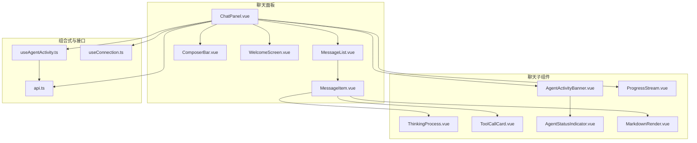
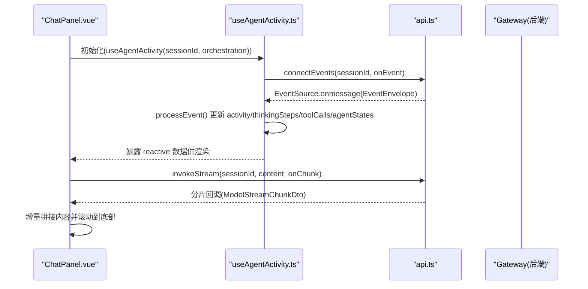
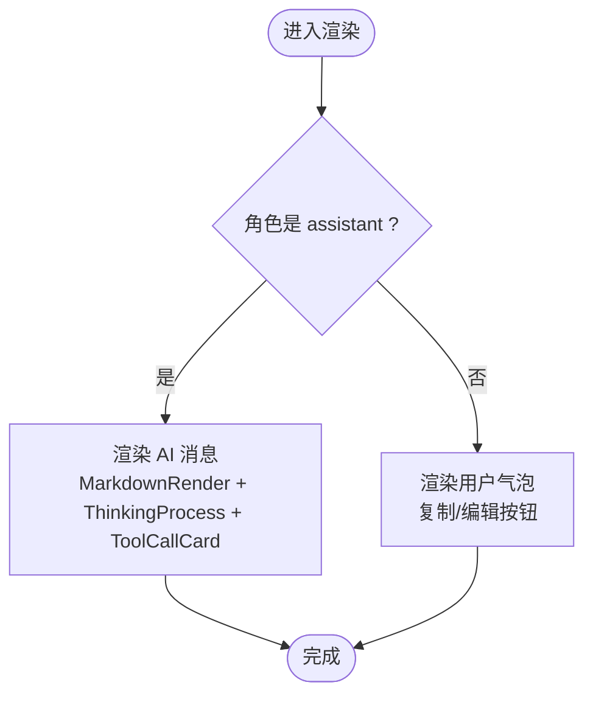
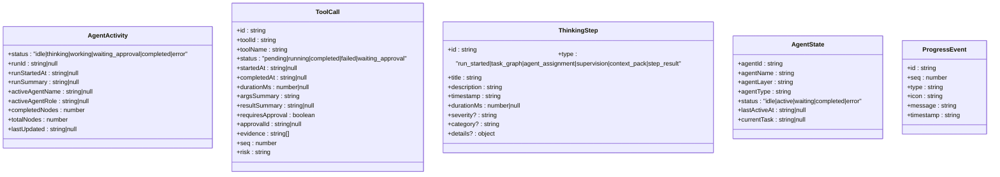
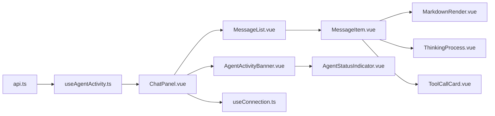

# 聊天界面系统

<cite>
**本文引用的文件**   
- [ChatPanel.vue](file://apps/desktop/src/components/ChatPanel.vue)
- [MessageList.vue](file://apps/desktop/src/components/MessageList.vue)
- [MessageItem.vue](file://apps/desktop/src/components/MessageItem.vue)
- [AgentActivityBanner.vue](file://apps/desktop/src/components/chat/AgentActivityBanner.vue)
- [ThinkingProcess.vue](file://apps/desktop/src/components/chat/ThinkingProcess.vue)
- [ProgressStream.vue](file://apps/desktop/src/components/chat/ProgressStream.vue)
- [ToolCallCard.vue](file://apps/desktop/src/components/chat/ToolCallCard.vue)
- [AgentStatusIndicator.vue](file://apps/desktop/src/components/chat/AgentStatusIndicator.vue)
- [useAgentActivity.ts](file://apps/desktop/src/composables/useAgentActivity.ts)
- [api.ts](file://apps/desktop/src/api.ts)
- [MarkdownRender.vue](file://apps/desktop/src/components/MarkdownRender.vue)
- [format.ts](file://apps/desktop/src/format.ts)
- [useConnection.ts](file://apps/desktop/src/composables/useConnection.ts)
</cite>

## 目录
1. [简介](#简介)
2. [项目结构](#项目结构)
3. [核心组件](#核心组件)
4. [架构总览](#架构总览)
5. [详细组件分析](#详细组件分析)
6. [依赖关系分析](#依赖关系分析)
7. [性能与内存优化](#性能与内存优化)
8. [故障排查指南](#故障排查指南)
9. [结论](#结论)
10. [附录：API 与数据模型](#附录api-与数据模型)

## 简介
本文件为聊天界面系统的组件文档，聚焦以下能力：
- 消息渲染（用户/AI 双态、Markdown 安全渲染）
- 流式响应处理（SSE 增量输出）
- Agent 活动状态显示（运行进度、智能体分配、审批等待）
- Thinking Process 可视化（思考步骤时间线）
- 实时通信机制（SSE 事件订阅）、消息持久化（会话/消息 API）、搜索过滤（工具目录搜索）
- 自定义样式、主题适配与多语言支持
- 性能优化策略（虚拟滚动、节流更新、内存管理）

## 项目结构
聊天界面位于桌面应用前端模块中，采用 Vue 单文件组件组织。关键目录与职责：
- components/chat：聊天相关子组件（活动横幅、思考过程、工具调用卡片、进度流等）
- composables：组合式逻辑（Agent 活动状态、连接健康检查等）
- api：HTTP/SSE 客户端封装与类型定义
- MarkdownRender：Markdown 渲染与安全清洗

**图表来源** 
- [ChatPanel.vue:1-107](file://apps/desktop/src/components/ChatPanel.vue#L1-L107)
- [MessageList.vue:1-61](file://apps/desktop/src/components/MessageList.vue#L1-L61)
- [MessageItem.vue:1-138](file://apps/desktop/src/components/MessageItem.vue#L1-L138)
- [AgentActivityBanner.vue:1-515](file://apps/desktop/src/components/chat/AgentActivityBanner.vue#L1-L515)
- [ThinkingProcess.vue:1-343](file://apps/desktop/src/components/chat/ThinkingProcess.vue#L1-L343)
- [ProgressStream.vue:1-216](file://apps/desktop/src/components/chat/ProgressStream.vue#L1-L216)
- [ToolCallCard.vue:1-413](file://apps/desktop/src/components/chat/ToolCallCard.vue#L1-L413)
- [AgentStatusIndicator.vue:1-204](file://apps/desktop/src/components/chat/AgentStatusIndicator.vue#L1-L204)
- [useAgentActivity.ts:1-697](file://apps/desktop/src/composables/useAgentActivity.ts#L1-L697)
- [api.ts:997-1330](file://apps/desktop/src/api.ts#L997-L1330)
- [useConnection.ts:1-138](file://apps/desktop/src/composables/useConnection.ts#L1-L138)

**章节来源**
- [ChatPanel.vue:1-107](file://apps/desktop/src/components/ChatPanel.vue#L1-L107)
- [MessageList.vue:1-61](file://apps/desktop/src/components/MessageList.vue#L1-L61)
- [MessageItem.vue:1-138](file://apps/desktop/src/components/MessageItem.vue#L1-L138)
- [api.ts:997-1330](file://apps/desktop/src/api.ts#L997-L1330)

## 核心组件
- ChatPanel：页面级容器，负责欢迎页/活跃聊天面板切换、透传 Agent 活动数据、派发事件（发送、审批、模式/权限变更）。
- MessageList：消息列表容器，使用滚动区域承载 MessageItem，空态提示。
- MessageItem：单条消息渲染，区分 user/assistant；支持复制、编辑、嵌入 ThinkingProcess 与 ToolCallCard。
- AgentActivityBanner：Agent 运行状态横幅，展示运行摘要、耗时、节点进度、规划/执行层智能体网格。
- ThinkingProcess：思考过程时间线，按步骤类型着色并展示时间、时长、严重级别。
- ProgressStream：实时活动流，限制可见条目数，支持展开/收起。
- ToolCallCard：工具调用卡片，支持状态、风险标签、证据列表、审批操作。
- AgentStatusIndicator：单个智能体状态指示器（角色层、当前任务、状态点动画）。
- MarkdownRender：Markdown 渲染 + DOMPurify 安全清洗。

**章节来源**
- [ChatPanel.vue:1-107](file://apps/desktop/src/components/ChatPanel.vue#L1-L107)
- [MessageList.vue:1-61](file://apps/desktop/src/components/MessageList.vue#L1-L61)
- [MessageItem.vue:1-138](file://apps/desktop/src/components/MessageItem.vue#L1-L138)
- [AgentActivityBanner.vue:1-515](file://apps/desktop/src/components/chat/AgentActivityBanner.vue#L1-L515)
- [ThinkingProcess.vue:1-343](file://apps/desktop/src/components/chat/ThinkingProcess.vue#L1-L343)
- [ProgressStream.vue:1-216](file://apps/desktop/src/components/chat/ProgressStream.vue#L1-L216)
- [ToolCallCard.vue:1-413](file://apps/desktop/src/components/chat/ToolCallCard.vue#L1-L413)
- [AgentStatusIndicator.vue:1-204](file://apps/desktop/src/components/chat/AgentStatusIndicator.vue#L1-L204)
- [MarkdownRender.vue:1-22](file://apps/desktop/src/components/MarkdownRender.vue#L1-L22)

## 架构总览
聊天界面通过 SSE 订阅后端事件，驱动 Agent 活动状态、思考步骤、工具调用与消息的实时更新；同时提供流式调用接口用于增量文本输出。

**图表来源** 
- [useAgentActivity.ts:640-685](file://apps/desktop/src/composables/useAgentActivity.ts#L640-L685)
- [api.ts:1257-1328](file://apps/desktop/src/api.ts#L1257-L1328)
- [ChatPanel.vue:1-107](file://apps/desktop/src/components/ChatPanel.vue#L1-L107)

## 详细组件分析

### MessageItem
- 属性
  - message: MessageDto（id、role、content、created_at）
  - index: number
  - thinkingSteps?: ThinkingStep[]
  - toolCalls?: ToolCall[]
  - agentLabel?: string | null
- 事件
  - approve(approvalId: string)
  - reject(approvalId: string)
- 行为
  - 复制内容到剪贴板
  - 编辑模式（textarea + 保存/取消）
  - 渲染 ThinkingProcess 与 ToolCallCard
  - 时间戳本地化显示

**图表来源** 
- [MessageItem.vue:1-138](file://apps/desktop/src/components/MessageItem.vue#L1-L138)
- [MarkdownRender.vue:1-22](file://apps/desktop/src/components/MarkdownRender.vue#L1-L22)

**章节来源**
- [MessageItem.vue:1-138](file://apps/desktop/src/components/MessageItem.vue#L1-L138)

### MessageList
- 属性
  - messages: MessageDto[]
  - thinkingSteps?: ThinkingStep[]
  - toolCalls?: ToolCall[]
  - agentLabel?: string | null
- 事件
  - approve(approvalId: string)
  - reject(approvalId: string)
- 行为
  - 使用 UiScrollArea 包裹消息列表
  - 空态提示“准备就绪”
  - 将 thinkingSteps/toolCalls/agentLabel 仅传递给 assistant 消息

**章节来源**
- [MessageList.vue:1-61](file://apps/desktop/src/components/MessageList.vue#L1-L61)

### AgentActivityBanner
- 属性
  - activity: AgentActivity
  - agentStates: Record<string, AgentState>
- 行为
  - 根据 status 计算图标、标签、颜色与动画
  - 计算已耗时、开始时间、节点进度百分比
  - 展开/收起详情，展示规划层/执行层智能体网格
  - 空状态提示“正在等待智能体分配...”

**章节来源**
- [AgentActivityBanner.vue:1-515](file://apps/desktop/src/components/chat/AgentActivityBanner.vue#L1-L515)

### ThinkingProcess
- 属性
  - steps: ThinkingStep[]
- 行为
  - 按 type 映射图标与颜色标签
  - 格式化时间与持续时间
  - 支持展开/收起，显示严重级别标签

**章节来源**
- [ThinkingProcess.vue:1-343](file://apps/desktop/src/components/chat/ThinkingProcess.vue#L1-L343)

### ProgressStream
- 属性
  - events: ProgressEvent[]
- 行为
  - 默认显示最近 5 条，可展开全部
  - 每条事件含图标、消息、时间戳
  - 使用 TransitionGroup 平滑插入/移除

**章节来源**
- [ProgressStream.vue:1-216](file://apps/desktop/src/components/chat/ProgressStream.vue#L1-L216)

### ToolCallCard
- 属性
  - toolCall: ToolCall
- 事件
  - approve(approvalId: string)
  - reject(approvalId: string)
- 行为
  - 根据 toolId 推断图标
  - 状态徽章（待执行/执行中/已完成/失败/等待审批）
  - 高风险标记、证据列表、结果摘要
  - 审批区直接触发 approve/reject

**章节来源**
- [ToolCallCard.vue:1-413](file://apps/desktop/src/components/chat/ToolCallCard.vue#L1-L413)

### AgentStatusIndicator
- 属性
  - agent: AgentState
- 行为
  - 显示名称、层级标签（规划层/执行层）、状态点与动画
  - 当前任务截断显示

**章节来源**
- [AgentStatusIndicator.vue:1-204](file://apps/desktop/src/components/chat/AgentStatusIndicator.vue#L1-L204)

### useAgentActivity（核心状态机）
- 状态
  - activity: AgentActivity（运行状态、摘要、节点进度、最后更新时间）
  - toolCalls: ToolCall[]（工具调用时间线）
  - thinkingSteps: ThinkingStep[]（思考步骤）
  - agentStates: Record<string, AgentState>（智能体状态）
  - progressEvents: ProgressEvent[]（实时活动流）
- 事件处理
  - run.started / task_graph.created / task.assigned / step.result.created / supervision.checked / context.pack.created / approval.requested / approval.approved / approval.rejected / tool.shell.approval_required / message.created
- 外部数据
  - 通过 connectEvents 订阅 SSE 事件
  - 通过 enrichFromOrchestration 同步编排快照
  - 定时刷新工具执行记录（limit=20）

**图表来源** 
- [useAgentActivity.ts:9-96](file://apps/desktop/src/composables/useAgentActivity.ts#L9-L96)

**章节来源**
- [useAgentActivity.ts:1-697](file://apps/desktop/src/composables/useAgentActivity.ts#L1-L697)

### ChatPanel（容器）
- 属性
  - messages/sessions/projects/currentSession/currentProject/selectedProjectId/modelName/orchestration/busy/draft/mode/permission
  - thinkingSteps/toolCalls/agentLabel（由父级传入）
  - panelStyle/panelDataAttrs（面板样式透传）
- 事件
  - update:draft/update:mode/update:permission/send/welcome-send/create-project/select-project/approve/reject
- 行为
  - 根据 messages 长度切换 WelcomeScreen/活跃面板
  - 透传 Agent 活动数据给 MessageList
  - 转发 approve/reject 事件

**章节来源**
- [ChatPanel.vue:1-107](file://apps/desktop/src/components/ChatPanel.vue#L1-L107)

## 依赖关系分析
- 组件耦合
  - ChatPanel 聚合 MessageList/ComposerBar/WelcomeScreen，并向下透传 Agent 活动数据
  - MessageList 仅负责滚动与空态，具体渲染在 MessageItem
  - MessageItem 依赖 MarkdownRender、ThinkingProcess、ToolCallCard
  - AgentActivityBanner 依赖 AgentStatusIndicator
- 数据流
  - api.ts 提供 HTTP 与 SSE 客户端
  - useAgentActivity.ts 订阅事件并维护状态，供组件消费
  - useConnection.ts 提供连接健康监控（启动屏遮罩）

**图表来源** 
- [api.ts:997-1330](file://apps/desktop/src/api.ts#L997-L1330)
- [useAgentActivity.ts:1-697](file://apps/desktop/src/composables/useAgentActivity.ts#L1-L697)
- [ChatPanel.vue:1-107](file://apps/desktop/src/components/ChatPanel.vue#L1-L107)
- [MessageList.vue:1-61](file://apps/desktop/src/components/MessageList.vue#L1-L61)
- [MessageItem.vue:1-138](file://apps/desktop/src/components/MessageItem.vue#L1-L138)
- [MarkdownRender.vue:1-22](file://apps/desktop/src/components/MarkdownRender.vue#L1-L22)
- [ThinkingProcess.vue:1-343](file://apps/desktop/src/components/chat/ThinkingProcess.vue#L1-L343)
- [ToolCallCard.vue:1-413](file://apps/desktop/src/components/chat/ToolCallCard.vue#L1-L413)
- [AgentActivityBanner.vue:1-515](file://apps/desktop/src/components/chat/AgentActivityBanner.vue#L1-L515)
- [AgentStatusIndicator.vue:1-204](file://apps/desktop/src/components/chat/AgentStatusIndicator.vue#L1-L204)
- [useConnection.ts:1-138](file://apps/desktop/src/composables/useConnection.ts#L1-L138)

**章节来源**
- [api.ts:997-1330](file://apps/desktop/src/api.ts#L997-L1330)
- [useAgentActivity.ts:1-697](file://apps/desktop/src/composables/useAgentActivity.ts#L1-L697)

## 性能与内存优化
- 虚拟滚动
  - 使用 UiScrollArea 包裹消息列表，避免一次性渲染大量 DOM
  - 建议结合长列表虚拟化库（如 vue-virtual-scroller）进一步降低首屏压力
- 增量渲染
  - 流式响应通过 invokeStream 分片回调，按需追加内容，避免整段重绘
- 事件节流与限流
  - ProgressStream 默认仅保留最近 5 条，ThinkingProcess/AgentActivityBanner 仅在需要时展开
  - useAgentActivity 对工具执行记录拉取设置 limit=20，避免过大负载
- 内存管理
  - useAgentActivity 在组件卸载时断开 EventSource 并清理定时器
  - 活动状态在完成后延迟 30s 自动重置，释放内存
- 渲染优化
  - Markdown 渲染配合 DOMPurify 安全清洗，减少不必要的解析开销
  - 时间/时长格式化函数尽量复用，避免重复计算

[本节为通用指导，不直接分析具体文件]

## 故障排查指南
- 连接问题
  - 使用 useConnection 的状态机（connecting/connected/timeout/disconnected）判断后端可达性
  - 若超时或断开，可通过 retryConnection 重试
- 事件未更新
  - 确认 sessionId 变化会触发 disconnect/connect
  - 检查 api.connectEvents 是否正确注册事件监听
- 流式中断
  - invokeStream 返回 AbortController，可在异常或用户取消时主动中止
- 审批卡住
  - 观察 ToolCallCard 的 waiting_approval 状态与 approvalId
  - 通过 decideApproval API 提交 approved/rejected 决策

**章节来源**
- [useConnection.ts:1-138](file://apps/desktop/src/composables/useConnection.ts#L1-L138)
- [useAgentActivity.ts:640-685](file://apps/desktop/src/composables/useAgentActivity.ts#L640-L685)
- [api.ts:1257-1328](file://apps/desktop/src/api.ts#L1257-L1328)

## 结论
聊天界面以组件化与组合式为核心，借助 SSE 实现高实时性的 Agent 活动与消息流展示。通过 ThinkingProcess、AgentActivityBanner、ToolCallCard 等组件，用户可清晰感知智能体的思考路径与执行状态。结合流式渲染与合理的内存管理策略，系统在大规模对话场景下仍保持流畅体验。后续可引入更完善的虚拟滚动与错误边界，进一步提升健壮性与性能。

[本节为总结，不直接分析具体文件]

## 附录：API 与数据模型
- 消息与会话
  - listMessages/getOrchestrationSnapshot/listToolExecutions
- 流式调用
  - invokeStream：SSE 增量输出，回调 ModelStreamChunkDto
- 事件订阅
  - connectEvents：EventSource 订阅多种业务事件（run.started、task.assigned、message.created 等）
- 工具搜索
  - searchTools：支持 query/domain/source/risk/limit 参数

**章节来源**
- [api.ts:1017-1033](file://apps/desktop/src/api.ts#L1017-L1033)
- [api.ts:1131-1140](file://apps/desktop/src/api.ts#L1131-L1140)
- [api.ts:1257-1328](file://apps/desktop/src/api.ts#L1257-L1328)