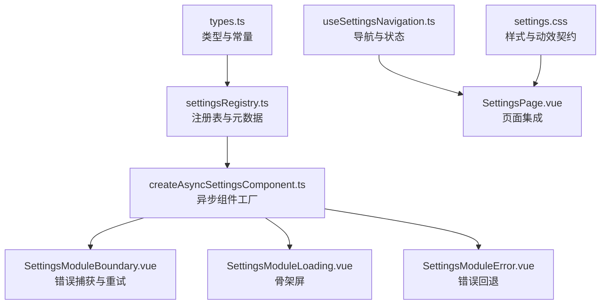
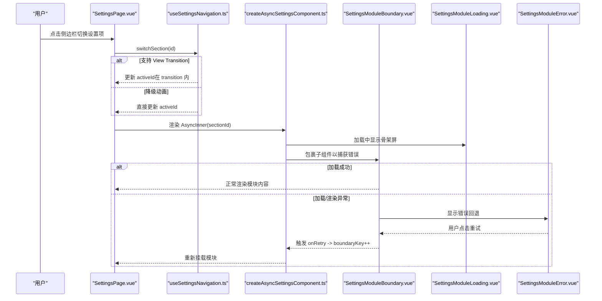
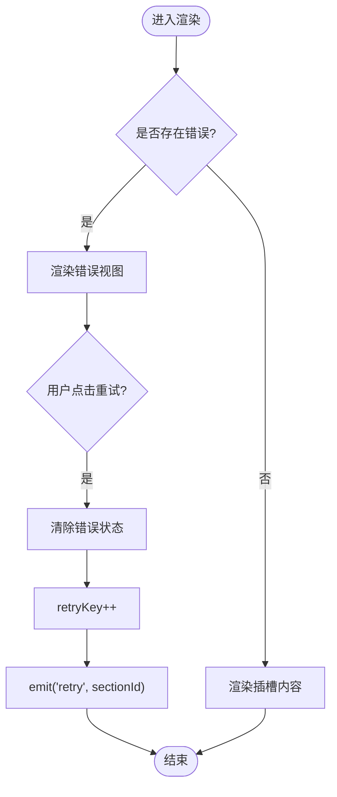
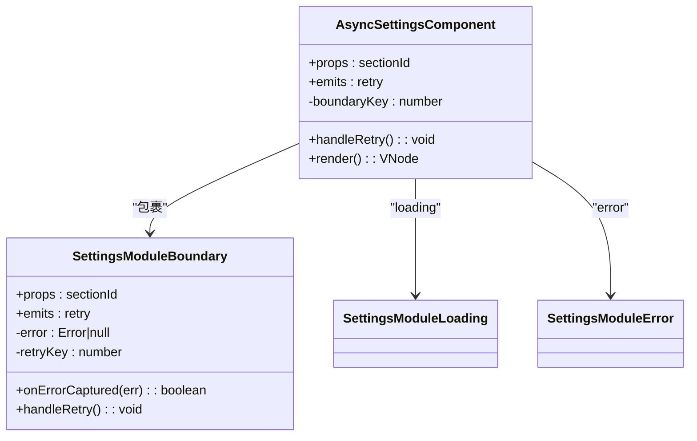
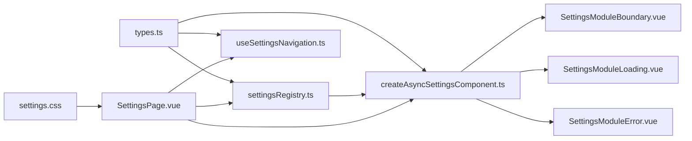

# 设置系统

<cite>
**本文引用的文件**   
- [types.ts](file://apps/desktop/src/settings/types.ts)
- [settingsRegistry.ts](file://apps/desktop/src/settings/settingsRegistry.ts)
- [createAsyncSettingsComponent.ts](file://apps/desktop/src/settings/createAsyncSettingsComponent.ts)
- [SettingsModuleBoundary.vue](file://apps/desktop/src/settings/components/SettingsModuleBoundary.vue)
- [SettingsModuleError.vue](file://apps/desktop/src/settings/components/SettingsModuleError.vue)
- [SettingsModuleLoading.vue](file://apps/desktop/src/settings/components/SettingsModuleLoading.vue)
- [useSettingsNavigation.ts](file://apps/desktop/src/settings/useSettingsNavigation.ts)
- [SettingsPage.vue](file://apps/desktop/src/pages/SettingsPage.vue)
- [settings.css](file://apps/desktop/src/settings/settings.css)
- [settingsCssContract.test.ts](file://apps/desktop/src/settings/settingsCssContract.test.ts)
- [SettingsModuleBoundary.test.ts](file://apps/desktop/src/settings/SettingsModuleBoundary.test.ts)
</cite>

## 目录
1. [简介](#简介)
2. [项目结构](#项目结构)
3. [核心组件](#核心组件)
4. [架构总览](#架构总览)
5. [详细组件分析](#详细组件分析)
6. [依赖关系分析](#依赖关系分析)
7. [性能考量](#性能考量)
8. [故障排查指南](#故障排查指南)
9. [结论](#结论)
10. [附录](#附录)

## 简介
本文件为“设置系统”的组件级文档，聚焦于设置的注册、验证、持久化与同步机制，并详细说明 SettingsModuleBoundary、SettingsModuleError、SettingsModuleLoading 等组件的职责与用法。同时覆盖动态模块加载、表单校验、数据迁移与备份恢复策略、设置项定义与默认值管理、用户偏好存储、导入导出、云端同步以及版本兼容性策略等主题。

## 项目结构
设置系统位于桌面应用前端（Vue 3 + TypeScript），采用“按功能域组织”的结构：
- 类型与契约：types.ts
- 注册表与元数据：settingsRegistry.ts
- 异步组件工厂：createAsyncSettingsComponent.ts
- 边界与错误处理组件：components/*
- 导航与状态：useSettingsNavigation.ts
- 页面集成与业务逻辑：pages/SettingsPage.vue
- 样式与动效契约：settings.css 及对应测试

**图表来源** 
- [types.ts:1-67](file://apps/desktop/src/settings/types.ts#L1-L67)
- [settingsRegistry.ts:1-40](file://apps/desktop/src/settings/settingsRegistry.ts#L1-L40)
- [createAsyncSettingsComponent.ts:1-71](file://apps/desktop/src/settings/createAsyncSettingsComponent.ts#L1-L71)
- [SettingsModuleBoundary.vue:1-58](file://apps/desktop/src/settings/components/SettingsModuleBoundary.vue#L1-L58)
- [SettingsModuleLoading.vue:1-15](file://apps/desktop/src/settings/components/SettingsModuleLoading.vue#L1-L15)
- [SettingsModuleError.vue:1-32](file://apps/desktop/src/settings/components/SettingsModuleError.vue#L1-L32)
- [useSettingsNavigation.ts:1-118](file://apps/desktop/src/settings/useSettingsNavigation.ts#L1-L118)
- [SettingsPage.vue:1-800](file://apps/desktop/src/pages/SettingsPage.vue#L1-L800)
- [settings.css:1-200](file://apps/desktop/src/settings/settings.css#L1-L200)

**章节来源**
- [types.ts:1-67](file://apps/desktop/src/settings/types.ts#L1-L67)
- [settingsRegistry.ts:1-40](file://apps/desktop/src/settings/settingsRegistry.ts#L1-L40)
- [createAsyncSettingsComponent.ts:1-71](file://apps/desktop/src/settings/createAsyncSettingsComponent.ts#L1-L71)
- [useSettingsNavigation.ts:1-118](file://apps/desktop/src/settings/useSettingsNavigation.ts#L1-L118)
- [SettingsPage.vue:1-800](file://apps/desktop/src/pages/SettingsPage.vue#L1-L800)
- [settings.css:1-200](file://apps/desktop/src/settings/settings.css#L1-L200)

## 核心组件
- SettingsModuleBoundary：子树错误捕获、失败回退、重试触发与重新挂载，隔离兄弟边界互不影响。
- SettingsModuleError：展示错误信息与重试按钮，使用 i18n 文案。
- SettingsModuleLoading：显示骨架屏占位，提升感知性能。
- createAsyncSettingsComponent：基于 Vue defineAsyncComponent 的动态加载器，结合 Boundary 实现错误恢复与 key 驱动的重载。
- useSettingsNavigation：维护 activeId、visitedIds、failedIds、revisions、motionMode，支持 View Transition 或降级动画。
- settingsRegistry：集中声明各设置项的 id、图标、labelKey，并提供 loader 映射生成注册表。
- types：统一类型与常量（如 SETTINGS_IDS、SettingsLoader、SettingsNavigation 等）。

**章节来源**
- [SettingsModuleBoundary.vue:1-58](file://apps/desktop/src/settings/components/SettingsModuleBoundary.vue#L1-L58)
- [SettingsModuleError.vue:1-32](file://apps/desktop/src/settings/components/SettingsModuleError.vue#L1-L32)
- [SettingsModuleLoading.vue:1-15](file://apps/desktop/src/settings/components/SettingsModuleLoading.vue#L1-L15)
- [createAsyncSettingsComponent.ts:1-71](file://apps/desktop/src/settings/createAsyncSettingsComponent.ts#L1-L71)
- [useSettingsNavigation.ts:1-118](file://apps/desktop/src/settings/useSettingsNavigation.ts#L1-L118)
- [settingsRegistry.ts:1-40](file://apps/desktop/src/settings/settingsRegistry.ts#L1-L40)
- [types.ts:1-67](file://apps/desktop/src/settings/types.ts#L1-L67)

## 架构总览
设置系统的运行时流程如下：
- 注册阶段：通过 settingsRegistry 将每个设置项的元数据与懒加载函数绑定。
- 渲染阶段：页面根据 activeId 选择对应模块；createAsyncSettingsComponent 负责按需加载模块，并在加载中/错误时分别渲染 Loading/Error 组件。
- 错误恢复：Boundary 捕获子树异常，切换到 Error 视图；用户点击重试后，通过 boundaryKey/retryKey 变更触发重新挂载。
- 导航与动效：useSettingsNavigation 管理切换逻辑，优先使用 View Transition，否则回退到 Vue 过渡或减少动效模式。

**图表来源** 
- [SettingsPage.vue:1-800](file://apps/desktop/src/pages/SettingsPage.vue#L1-L800)
- [useSettingsNavigation.ts:1-118](file://apps/desktop/src/settings/useSettingsNavigation.ts#L1-L118)
- [createAsyncSettingsComponent.ts:1-71](file://apps/desktop/src/settings/createAsyncSettingsComponent.ts#L1-L71)
- [SettingsModuleBoundary.vue:1-58](file://apps/desktop/src/settings/components/SettingsModuleBoundary.vue#L1-L58)
- [SettingsModuleLoading.vue:1-15](file://apps/desktop/src/settings/components/SettingsModuleLoading.vue#L1-L15)
- [SettingsModuleError.vue:1-32](file://apps/desktop/src/settings/components/SettingsModuleError.vue#L1-L32)

## 详细组件分析

### SettingsModuleBoundary 组件
- 职责：捕获子树错误、展示错误回退、提供重试能力、通过 key 变化强制重新挂载。
- 关键点：
  - 使用 onErrorCaptured 捕获渲染期与 setup 期异常。
  - 内部 error ref 控制是否显示错误视图。
  - retryKey 用于 slot 的 key 变更，确保重新挂载。
  - 不向父级传播错误，保证边界隔离。

**图表来源** 
- [SettingsModuleBoundary.vue:1-58](file://apps/desktop/src/settings/components/SettingsModuleBoundary.vue#L1-L58)

**章节来源**
- [SettingsModuleBoundary.vue:1-58](file://apps/desktop/src/settings/components/SettingsModuleBoundary.vue#L1-L58)
- [SettingsModuleBoundary.test.ts:1-194](file://apps/desktop/src/settings/SettingsModuleBoundary.test.ts#L1-L194)

### SettingsModuleError 与 SettingsModuleLoading
- SettingsModuleError：展示国际化错误提示与重试按钮，触发上层重试逻辑。
- SettingsModuleLoading：骨架屏占位，避免布局抖动，提升感知性能。

**章节来源**
- [SettingsModuleError.vue:1-32](file://apps/desktop/src/settings/components/SettingsModuleError.vue#L1-L32)
- [SettingsModuleLoading.vue:1-15](file://apps/desktop/src/settings/components/SettingsModuleLoading.vue#L1-L15)

### createAsyncSettingsComponent 工厂
- 职责：封装 defineAsyncComponent，提供 loading/error 组件、延迟策略与错误处理。
- 关键点：
  - 支持 ES Module 与 { default } 两种导出形式。
  - 错误由外部 Boundary 处理，内部仅 fail()。
  - 通过 boundaryKey 变更触发重新挂载，实现重试。

**图表来源** 
- [createAsyncSettingsComponent.ts:1-71](file://apps/desktop/src/settings/createAsyncSettingsComponent.ts#L1-L71)
- [SettingsModuleBoundary.vue:1-58](file://apps/desktop/src/settings/components/SettingsModuleBoundary.vue#L1-L58)
- [SettingsModuleLoading.vue:1-15](file://apps/desktop/src/settings/components/SettingsModuleLoading.vue#L1-L15)
- [SettingsModuleError.vue:1-32](file://apps/desktop/src/settings/components/SettingsModuleError.vue#L1-L32)

**章节来源**
- [createAsyncSettingsComponent.ts:1-71](file://apps/desktop/src/settings/createAsyncSettingsComponent.ts#L1-L71)

### 设置注册表与元数据
- 通过 SETTINGS_METADATA 集中声明所有设置项的 id、图标、labelKey。
- createSettingsRegistry 将 loaders 映射合并为最终注册表，供页面渲染与路由使用。

**章节来源**
- [settingsRegistry.ts:1-40](file://apps/desktop/src/settings/settingsRegistry.ts#L1-L40)
- [types.ts:1-67](file://apps/desktop/src/settings/types.ts#L1-L67)

### 设置导航与动效
- useSettingsNavigation 维护 activeId、visitedIds、failedIds、revisions、motionMode。
- 优先使用 document.startViewTransition 进行原生过渡，否则回退到 Vue 过渡或 reduced motion。
- cacheKey 基于 revisions 生成，便于缓存失效与重试。

**章节来源**
- [useSettingsNavigation.ts:1-118](file://apps/desktop/src/settings/useSettingsNavigation.ts#L1-L118)

### 页面集成与业务逻辑
- SettingsPage.vue 整合了设置页的所有业务逻辑，包括：
  - 网关配置读取、校验、保存与重启提示。
  - 模型中心、代理中心、工具层、提示词工程、外观、语言、API 文档、关于等面板的数据加载与交互。
  - 通知系统与用户反馈。
  - 背景与面板材质效果的全局同步。

**章节来源**
- [SettingsPage.vue:1-800](file://apps/desktop/src/pages/SettingsPage.vue#L1-L800)

## 依赖关系分析
- 类型与契约被注册表、导航、异步组件工厂广泛引用。
- 页面依赖导航与注册表，并通过异步组件工厂渲染具体模块。
- 样式与动效契约由 CSS 与测试共同约束，确保视觉一致性。

**图表来源** 
- [types.ts:1-67](file://apps/desktop/src/settings/types.ts#L1-L67)
- [settingsRegistry.ts:1-40](file://apps/desktop/src/settings/settingsRegistry.ts#L1-L40)
- [useSettingsNavigation.ts:1-118](file://apps/desktop/src/settings/useSettingsNavigation.ts#L1-L118)
- [createAsyncSettingsComponent.ts:1-71](file://apps/desktop/src/settings/createAsyncSettingsComponent.ts#L1-L71)
- [SettingsModuleBoundary.vue:1-58](file://apps/desktop/src/settings/components/SettingsModuleBoundary.vue#L1-L58)
- [SettingsModuleLoading.vue:1-15](file://apps/desktop/src/settings/components/SettingsModuleLoading.vue#L1-L15)
- [SettingsModuleError.vue:1-32](file://apps/desktop/src/settings/components/SettingsModuleError.vue#L1-L32)
- [SettingsPage.vue:1-800](file://apps/desktop/src/pages/SettingsPage.vue#L1-L800)
- [settings.css:1-200](file://apps/desktop/src/settings/settings.css#L1-L200)

**章节来源**
- [settingsCssContract.test.ts:1-547](file://apps/desktop/src/settings/settingsCssContract.test.ts#L1-L547)

## 性能考量
- 动态加载：模块按需加载，减少首屏体积。
- 骨架屏：Loading 组件避免布局抖动。
- 错误隔离：Boundary 防止单点失败影响整体。
- 动效优化：优先使用 View Transition，必要时降级至 CSS 过渡或关闭动效。
- 缓存键：基于 revisions 的 cacheKey 确保缓存正确失效。

[本节为通用指导，无需特定文件来源]

## 故障排查指南
- 常见问题定位：
  - 模块加载失败：检查 loader 路径与返回模块格式（default 导出或命名导出）。
  - 渲染期异常：查看 Boundary 的错误捕获与重试流程。
  - 动效异常：确认 prefers-reduced-motion 与 View Transition 支持情况。
- 调试建议：
  - 使用浏览器控制台观察错误堆栈。
  - 通过测试用例验证行为（如 Boundary 的单元测试）。
  - 检查 CSS 契约是否符合预期（如 settingsCssContract.test.ts）。

**章节来源**
- [SettingsModuleBoundary.test.ts:1-194](file://apps/desktop/src/settings/SettingsModuleBoundary.test.ts#L1-L194)
- [settingsCssContract.test.ts:1-547](file://apps/desktop/src/settings/settingsCssContract.test.ts#L1-L547)

## 结论
设置系统通过清晰的类型契约、注册表与异步加载机制，实现了高内聚、低耦合的设置模块管理。Boundary 与错误/加载组件提供了健壮的用户体验，导航与动效兼顾性能与可访问性。页面集成层承载丰富的业务逻辑，配合样式契约保障一致的视觉表现。

[本节为总结，无需特定文件来源]

## 附录

### 设置项定义与默认值管理
- 设置项 ID 集合与类型：SETTINGS_IDS 与 SettingsId。
- 元数据：id、icon、labelKey。
- 默认值：建议在具体模块内初始化，或通过全局配置注入。

**章节来源**
- [types.ts:1-67](file://apps/desktop/src/settings/types.ts#L1-L67)
- [settingsRegistry.ts:1-40](file://apps/desktop/src/settings/settingsRegistry.ts#L1-L40)

### 用户偏好存储
- 语言偏好：localStorage 中存储 tinadec-locale。
- 其他偏好：可在模块内自行实现持久化（如 IndexedDB、Electron 存储等）。

**章节来源**
- [SettingsPage.vue:1-800](file://apps/desktop/src/pages/SettingsPage.vue#L1-L800)

### 设置导入导出
- 建议实现 JSON 序列化/反序列化的导入导出接口。
- 提供批量导出与增量导入，支持冲突解决策略（覆盖/合并/跳过）。

[本节为通用指导，无需特定文件来源]

### 云端同步与版本兼容性
- 云端同步：通过 API 拉取/推送设置快照，支持多端一致。
- 版本兼容：引入 schema 版本字段，升级时执行迁移脚本，保留旧版兼容。

[本节为通用指导，无需特定文件来源]

### 数据迁移与备份恢复
- 迁移：在应用启动时检测版本差异，执行迁移任务。
- 备份：定期导出当前设置快照，支持一键恢复。

[本节为通用指导，无需特定文件来源]

### 表单验证
- 输入校验：对 URL、必填字段、格式等进行即时校验。
- 错误提示：与通知系统集成，提供明确的用户反馈。

**章节来源**
- [SettingsPage.vue:1-800](file://apps/desktop/src/pages/SettingsPage.vue#L1-L800)

### 样式与动效契约
- 关键类名与过渡：.settings-page、.settings-nav、.settings-content、section-fade、settings-module-*。
- 减少动效：prefers-reduced-motion 下禁用动画。
- Material 表面：统一使用 --surface-* 变量，避免硬编码颜色。

**章节来源**
- [settings.css:1-200](file://apps/desktop/src/settings/settings.css#L1-L200)
- [settingsCssContract.test.ts:1-547](file://apps/desktop/src/settings/settingsCssContract.test.ts#L1-L547)