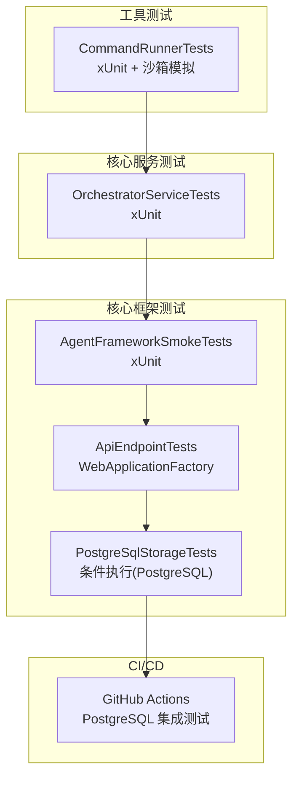
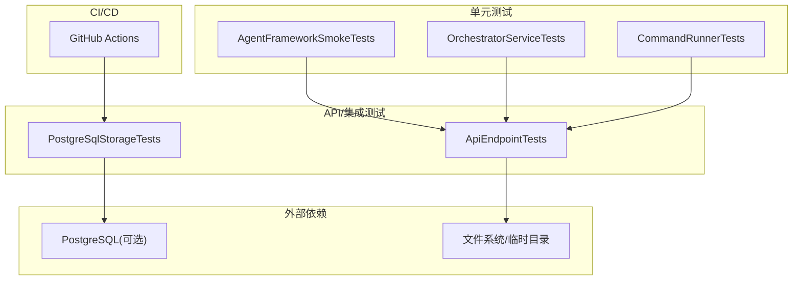
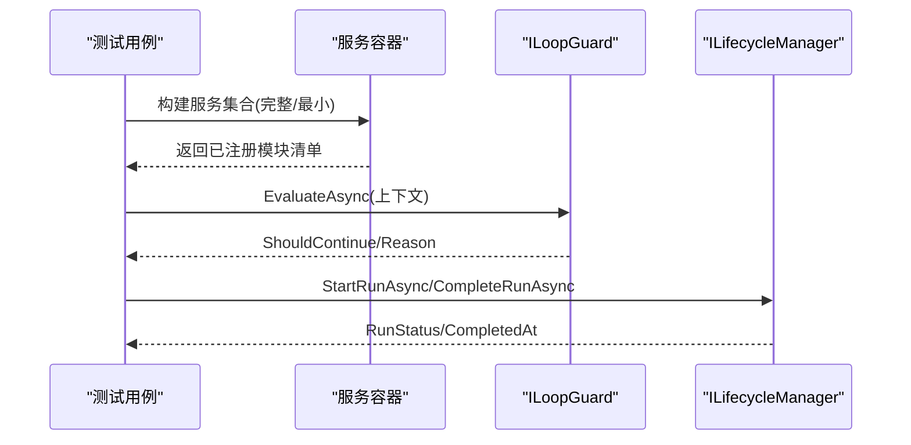
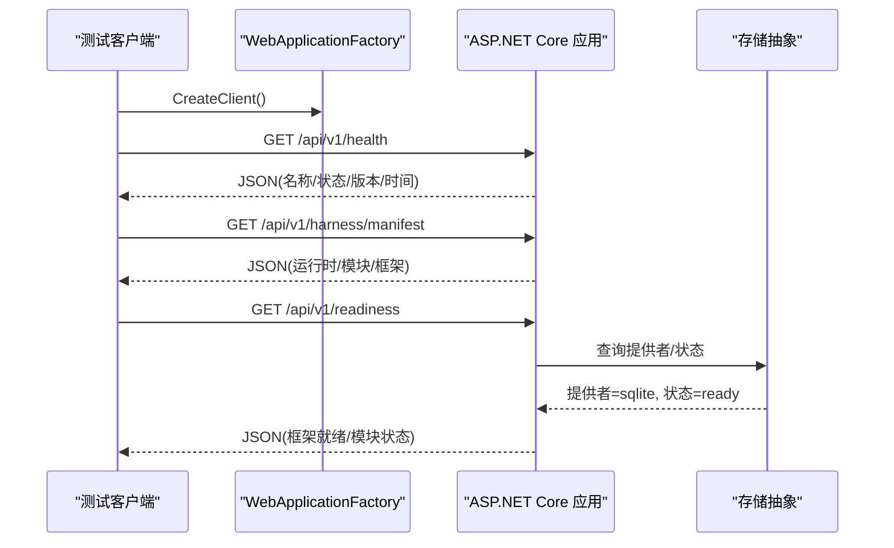
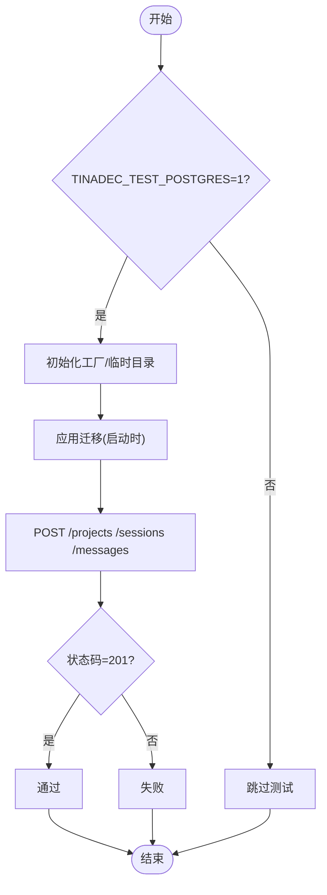
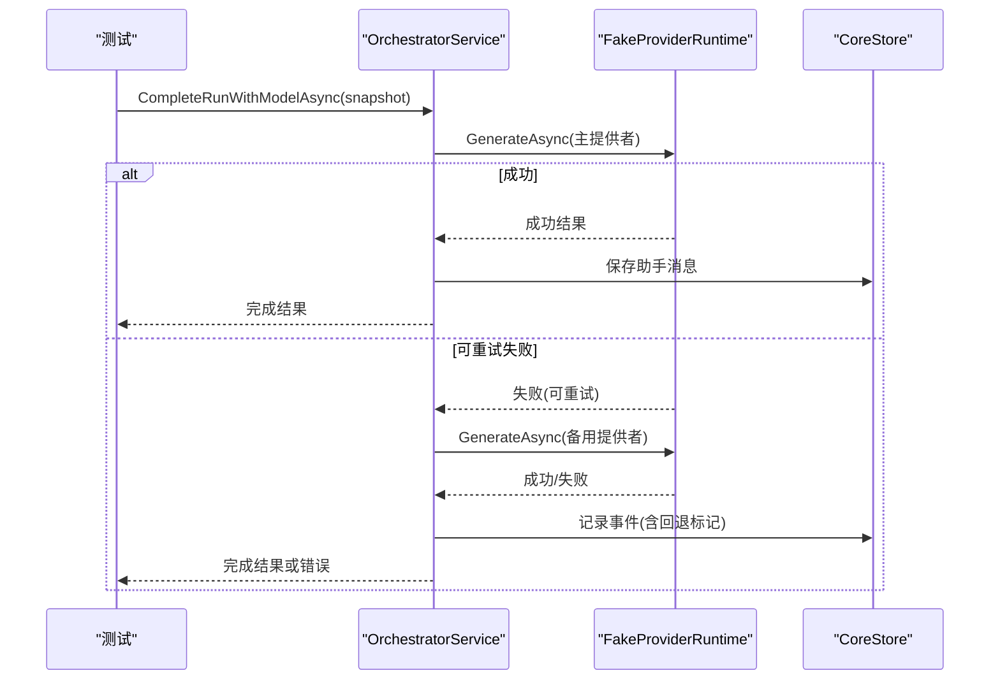
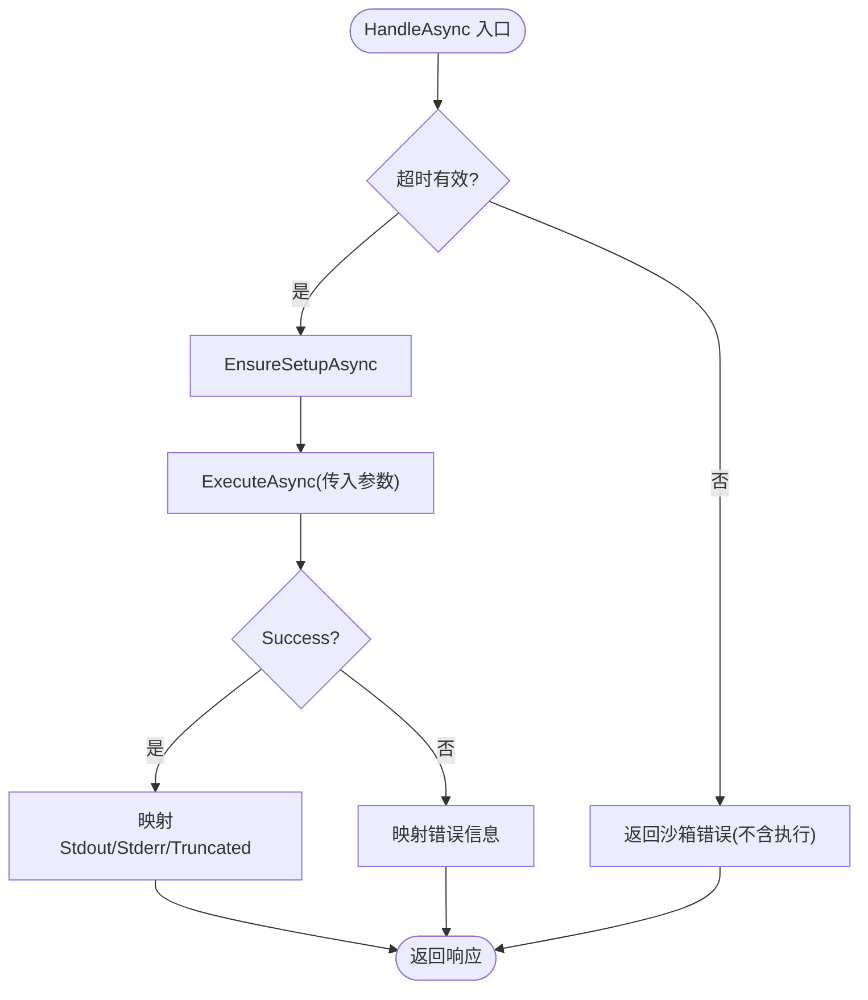
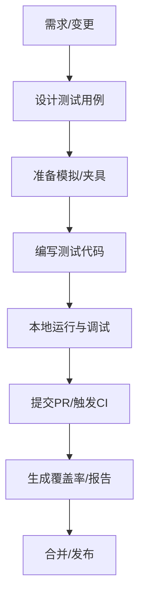
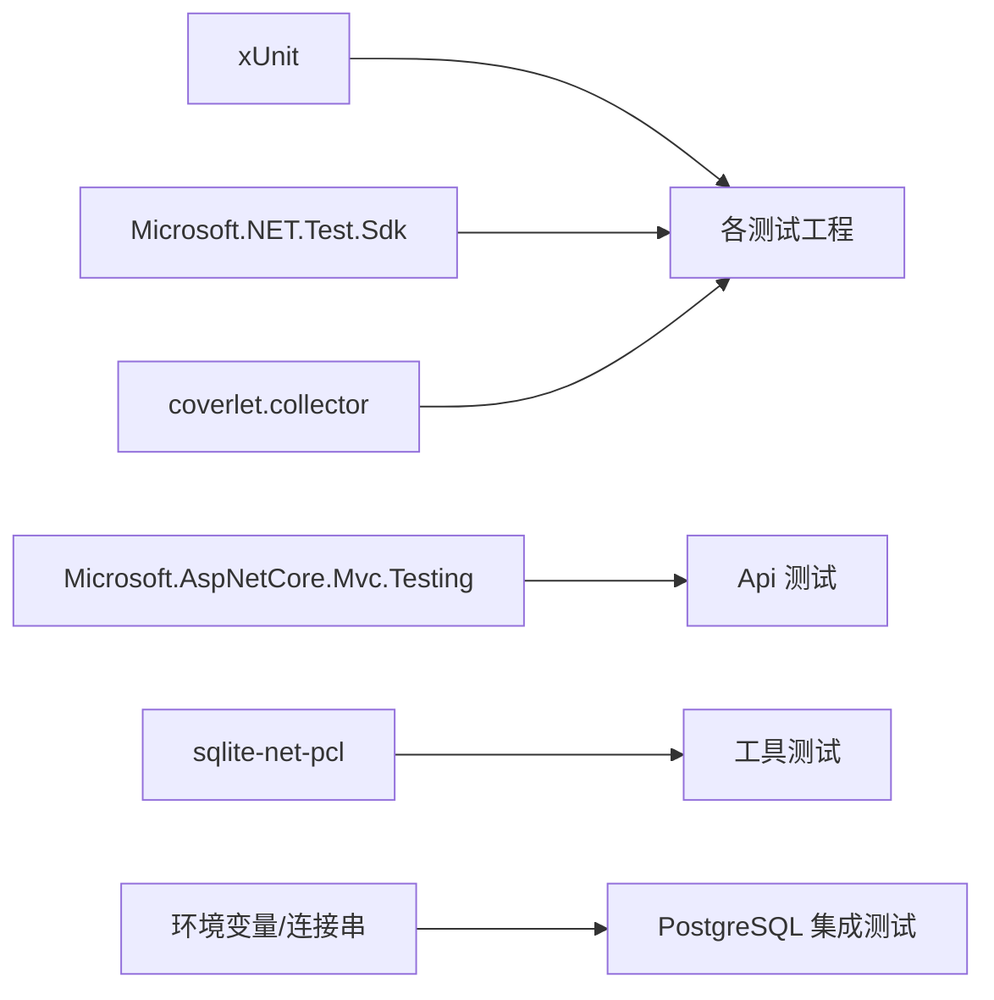

# 测试策略

<cite>
**本文引用的文件**   
- [AgentFrameworkSmokeTests.cs](file://TinadecCore/tests/TinadecCore.AgentFramework.Tests/AgentFrameworkSmokeTests.cs)
- [TinadecCore.AgentFramework.Tests.csproj](file://TinadecCore/tests/TinadecCore.AgentFramework.Tests/TinadecCore.AgentFramework.Tests.csproj)
- [ApiEndpointTests.cs](file://TinadecCore/tests/TinadecCore.Api.Tests/ApiEndpointTests.cs)
- [PostgreSqlStorageTests.cs](file://TinadecCore/tests/TinadecCore.Api.Tests/PostgreSqlStorageTests.cs)
- [core-storage-postgres.yml](file://.github/workflows/core-storage-postgres.yml)
- [OrchestratorServiceTests.cs](file://tests/TinadecCore.Tests/OrchestratorServiceTests.cs)
- [CommandRunnerTests.cs](file://tests/TinadecTools.Tests/CommandRunnerTests.cs)
- [TinadecCore.Tests.csproj](file://tests/TinadecCore.Tests/TinadecCore.Tests.csproj)
- [TinadecCore.Api.Tests.csproj](file://TinadecCore/tests/TinadecCore.Api.Tests/TinadecCore.Api.Tests.csproj)
- [TinadecTools.Tests.csproj](file://tests/TinadecTools.Tests/TinadecTools.Tests.csproj)
</cite>

## 目录
1. [简介](#简介)
2. [项目结构](#项目结构)
3. [核心组件](#核心组件)
4. [架构总览](#架构总览)
5. [详细组件分析](#详细组件分析)
6. [依赖分析](#依赖分析)
7. [性能考虑](#性能考虑)
8. [故障排查指南](#故障排查指南)
9. [结论](#结论)
10. [附录](#附录)

## 简介
本测试策略文档面向 TinadecOffice 项目的单元测试、集成测试与端到端测试，覆盖测试框架选择、测试数据管理、模拟策略、覆盖率要求、命名约定与最佳实践，并提供新模块的测试编写指南。同时包含性能测试、负载测试与安全测试的方法建议，以及 CI/CD 中的测试集成与报告生成流程。

## 项目结构
仓库采用多语言、多工程组织：
- .NET 层（C#/F#）：核心框架、API、工具链与测试工程位于 TinadecCore、tests 等目录
- Node/TypeScript 层：Gateway 与桌面/Web 应用位于 TinadecGateway、apps 等目录
- 测试工程按功能域划分，使用 xUnit + Coverlet 进行单元测试与覆盖率收集；API 测试使用 WebApplicationFactory 进行内存宿主测试；部分集成测试通过环境变量驱动真实数据库执行

图表来源
- [AgentFrameworkSmokeTests.cs:1-188](file://TinadecCore/tests/TinadecCore.AgentFramework.Tests/AgentFrameworkSmokeTests.cs#L1-L188)
- [ApiEndpointTests.cs:1-184](file://TinadecCore/tests/TinadecCore.Api.Tests/ApiEndpointTests.cs#L1-L184)
- [PostgreSqlStorageTests.cs:1-73](file://TinadecCore/tests/TinadecCore.Api.Tests/PostgreSqlStorageTests.cs#L1-L73)
- [OrchestratorServiceTests.cs:1-324](file://tests/TinadecCore.Tests/OrchestratorServiceTests.cs#L1-L324)
- [CommandRunnerTests.cs:1-111](file://tests/TinadecTools.Tests/CommandRunnerTests.cs#L1-L111)
- [core-storage-postgres.yml:1-40](file://.github/workflows/core-storage-postgres.yml#L1-L40)

章节来源
- [TinadecCore.AgentFramework.Tests.csproj:1-33](file://TinadecCore/tests/TinadecCore.AgentFramework.Tests/TinadecCore.AgentFramework.Tests.csproj#L1-L33)
- [TinadecCore.Api.Tests.csproj:1-26](file://TinadecCore/tests/TinadecCore.Api.Tests/TinadecCore.Api.Tests.csproj#L1-L26)
- [TinadecCore.Tests.csproj:1-27](file://tests/TinadecCore.Tests/TinadecCore.Tests.csproj#L1-L27)
- [TinadecTools.Tests.csproj:1-32](file://tests/TinadecTools.Tests/TinadecTools.Tests.csproj#L1-L32)

## 核心组件
- 测试框架与工具
  - xUnit：所有 C# 测试统一使用 xUnit 作为测试运行器与断言库
  - Coverlet：覆盖率采集，配合 Visual Studio 与 CI 输出覆盖率报告
  - Microsoft.NET.Test.Sdk：测试基础设施与发现
  - Microsoft.AspNetCore.Mvc.Testing：API 内存宿主测试，避免启动真实 HTTP 服务器
- 测试类型与范围
  - 单元测试：针对服务、策略、工具函数与边界逻辑
  - 集成测试：验证 API 契约、存储迁移、向量存储持久化
  - 端到端测试：以最小可用组合验证模块注册、生命周期与循环守卫
- 模拟与隔离
  - FakeChatClient：无外部模型访问的聊天客户端模拟
  - FakeProviderRuntime：模拟模型提供者运行时，支持成功/失败/重试场景
  - FakeSandboxBackend：命令沙箱后端模拟，用于隔离系统调用
  - NullCredentialResolver/EmptyToolRegistry：最小化依赖注入配置

章节来源
- [AgentFrameworkSmokeTests.cs:1-188](file://TinadecCore/tests/TinadecCore.AgentFramework.Tests/AgentFrameworkSmokeTests.cs#L1-L188)
- [OrchestratorServiceTests.cs:1-324](file://tests/TinadecCore.Tests/OrchestratorServiceTests.cs#L1-L324)
- [CommandRunnerTests.cs:1-111](file://tests/TinadecTools.Tests/CommandRunnerTests.cs#L1-L111)

## 架构总览
下图展示测试在系统中的位置与交互关系：单元测试直接作用于服务与策略；API 测试通过内存宿主发起 HTTP 请求；集成测试在受控环境中执行数据库迁移与持久化；CI 触发特定测试集并产出覆盖率报告。

图表来源
- [ApiEndpointTests.cs:1-184](file://TinadecCore/tests/TinadecCore.Api.Tests/ApiEndpointTests.cs#L1-L184)
- [PostgreSqlStorageTests.cs:1-73](file://TinadecCore/tests/TinadecCore.Api.Tests/PostgreSqlStorageTests.cs#L1-L73)
- [core-storage-postgres.yml:1-40](file://.github/workflows/core-storage-postgres.yml#L1-L40)

## 详细组件分析

### AgentFramework 冒烟测试（单元/最小集成）
- 目标：验证最小与完整模块注册、LoopGuard 决策、Lifecycle 状态流转
- 关键断言：
  - 完整组合注册 10 个模块，最小组合仅注册必要模块
  - LoopGuard 在迭代限制下停止继续执行
  - Lifecycle 启动/完成运行并记录时间戳
- 模拟策略：FakeChatClient 提供固定响应，避免外部模型依赖

图表来源
- [AgentFrameworkSmokeTests.cs:1-188](file://TinadecCore/tests/TinadecCore.AgentFramework.Tests/AgentFrameworkSmokeTests.cs#L1-L188)

章节来源
- [AgentFrameworkSmokeTests.cs:1-188](file://TinadecCore/tests/TinadecCore.AgentFramework.Tests/AgentFrameworkSmokeTests.cs#L1-L188)

### API 端点测试（HTTP 契约）
- 目标：健康检查、清单、就绪状态等 API 契约稳定
- 关键断言：
  - /api/v1/health 返回兼容结构与版本信息
  - /api/v1/harness/manifest 字段齐全且模块数量正确
  - /api/v1/readiness 框架就绪、模块状态与存储提供者一致
- 实现方式：WebApplicationFactory 启动内存宿主，无需真实网络

图表来源
- [ApiEndpointTests.cs:1-184](file://TinadecCore/tests/TinadecCore.Api.Tests/ApiEndpointTests.cs#L1-L184)

章节来源
- [ApiEndpointTests.cs:1-184](file://TinadecCore/tests/TinadecCore.Api.Tests/ApiEndpointTests.cs#L1-L184)

### PostgreSQL 存储集成测试（条件执行）
- 目标：验证 Provider 特定的迁移与存储契约
- 执行条件：环境变量 TINADEC_TEST_POSTGRES=1 时启用
- 配置方式：自定义 WebApplicationFactory 注入连接字符串与迁移开关
- 步骤：创建项目/会话/消息，确保 API 返回正确状态码

图表来源
- [PostgreSqlStorageTests.cs:1-73](file://TinadecCore/tests/TinadecCore.Api.Tests/PostgreSqlStorageTests.cs#L1-L73)

章节来源
- [PostgreSqlStorageTests.cs:1-73](file://TinadecCore/tests/TinadecCore.Api.Tests/PostgreSqlStorageTests.cs#L1-L73)

### Orchestrator 服务测试（编排与容错）
- 目标：模型选择、回退、错误记录与事件完整性
- 关键场景：
  - 健康提供者优先选择并保存助手响应
  - 可重试失败时自动回退到备用提供者
  - 失败调用记录安全错误且不泄露敏感信息
  - 路由、模型、错误类别写入事件
- 模拟策略：FakeProviderRuntime 映射提供者实例 ID 到成功/失败响应

图表来源
- [OrchestratorServiceTests.cs:1-324](file://tests/TinadecCore.Tests/OrchestratorServiceTests.cs#L1-L324)

章节来源
- [OrchestratorServiceTests.cs:1-324](file://tests/TinadecCore.Tests/OrchestratorServiceTests.cs#L1-L324)

### 命令沙箱测试（隔离执行）
- 目标：命令参数转发、超时校验、输出截断提示
- 模拟策略：FakeSandboxBackend 拦截执行，返回预设结果
- 关键点：无效超时不触发执行；输出截断标志正确传递

图表来源
- [CommandRunnerTests.cs:1-111](file://tests/TinadecTools.Tests/CommandRunnerTests.cs#L1-L111)

章节来源
- [CommandRunnerTests.cs:1-111](file://tests/TinadecTools.Tests/CommandRunnerTests.cs#L1-L111)

### 概念性概览（通用工作流）
以下流程图描述新增模块测试的通用路径：从需求到用例设计、模拟依赖、编写断言、本地验证与 CI 集成。

[此图为概念性流程，不直接映射具体源码]

## 依赖分析
- 测试工程依赖
  - xUnit、Microsoft.NET.Test.Sdk、coverlet.collector 为统一基础
  - API 测试额外依赖 Microsoft.AspNetCore.Mvc.Testing
  - 工具测试依赖 sqlite-net-pcl 与 fixtures（如 MCP mock server）
- 外部依赖与环境变量
  - PostgreSQL 集成测试通过 TINADEC_TEST_POSTGRES 与连接字符串控制
  - 临时目录用于 SQLite 与文件操作隔离

图表来源
- [TinadecCore.AgentFramework.Tests.csproj:1-33](file://TinadecCore/tests/TinadecCore.AgentFramework.Tests/TinadecCore.AgentFramework.Tests.csproj#L1-L33)
- [TinadecCore.Api.Tests.csproj:1-26](file://TinadecCore/tests/TinadecCore.Api.Tests/TinadecCore.Api.Tests.csproj#L1-L26)
- [TinadecCore.Tests.csproj:1-27](file://tests/TinadecCore.Tests/TinadecCore.Tests.csproj#L1-L27)
- [TinadecTools.Tests.csproj:1-32](file://tests/TinadecTools.Tests/TinadecTools.Tests.csproj#L1-L32)

章节来源
- [TinadecCore.AgentFramework.Tests.csproj:1-33](file://TinadecCore/tests/TinadecCore.AgentFramework.Tests/TinadecCore.AgentFramework.Tests.csproj#L1-L33)
- [TinadecCore.Api.Tests.csproj:1-26](file://TinadecCore/tests/TinadecCore.Api.Tests/TinadecCore.Api.Tests.csproj#L1-L26)
- [TinadecCore.Tests.csproj:1-27](file://tests/TinadecCore.Tests/TinadecCore.Tests.csproj#L1-L27)
- [TinadecTools.Tests.csproj:1-32](file://tests/TinadecTools.Tests/TinadecTools.Tests.csproj#L1-L32)

## 性能考虑
- 测试隔离与并行
  - 使用临时目录与内存宿主避免共享状态
  - 对需要顺序执行的测试使用测试集合禁用并行（如沙箱相关）
- 资源开销控制
  - 避免在单元测试中启动真实进程或数据库
  - 使用最小依赖注入配置减少启动时间
- 基准与负载
  - 对关键路径（如模型调用、向量检索）可引入轻量基准测试
  - 负载测试建议在独立环境执行，避免影响开发体验

[本节为通用指导，不直接分析具体文件]

## 故障排查指南
- 常见问题
  - 环境变量未设置导致 PostgreSQL 测试被跳过
  - 连接字符串缺失或格式不正确导致迁移失败
  - 沙箱后端未初始化导致命令执行失败
- 定位方法
  - 查看测试日志与异常堆栈
  - 确认环境变量与配置文件注入
  - 使用最小复现实例逐步缩小问题范围

章节来源
- [PostgreSqlStorageTests.cs:1-73](file://TinadecCore/tests/TinadecCore.Api.Tests/PostgreSqlStorageTests.cs#L1-L73)
- [CommandRunnerTests.cs:1-111](file://tests/TinadecTools.Tests/CommandRunnerTests.cs#L1-L111)

## 结论
本策略基于 xUnit 与 Coverlet 构建了清晰的测试分层：单元、API/集成与条件化的数据库集成测试。通过丰富的模拟与夹具，测试具备高稳定性与可维护性。建议在持续集成中扩展覆盖率阈值与更多数据库变体，确保质量基线持续提升。

[本节为总结，不直接分析具体文件]

## 附录

### 测试框架与工具选型
- 单元测试：xUnit + coverlet.collector
- API 测试：Microsoft.AspNetCore.Mvc.Testing
- 集成测试：环境变量驱动的 PostgreSQL 测试
- 覆盖率：Coverlet 生成 XML/HTML 报告

章节来源
- [TinadecCore.AgentFramework.Tests.csproj:1-33](file://TinadecCore/tests/TinadecCore.AgentFramework.Tests/TinadecCore.AgentFramework.Tests.csproj#L1-L33)
- [TinadecCore.Api.Tests.csproj:1-26](file://TinadecCore/tests/TinadecCore.Api.Tests/TinadecCore.Api.Tests.csproj#L1-L26)
- [TinadecCore.Tests.csproj:1-27](file://tests/TinadecCore.Tests/TinadecCore.Tests.csproj#L1-L27)
- [TinadecTools.Tests.csproj:1-32](file://tests/TinadecTools.Tests/TinadecTools.Tests.csproj#L1-L32)

### 测试数据管理与模拟策略
- 数据管理
  - 临时目录隔离 SQLite 与文件操作
  - 内存配置注入替代外部配置
- 模拟策略
  - FakeChatClient/FakeProviderRuntime/FakeSandboxBackend
  - Null 解析器与空工具注册表最小化依赖

章节来源
- [AgentFrameworkSmokeTests.cs:1-188](file://TinadecCore/tests/TinadecCore.AgentFramework.Tests/AgentFrameworkSmokeTests.cs#L1-L188)
- [OrchestratorServiceTests.cs:1-324](file://tests/TinadecCore.Tests/OrchestratorServiceTests.cs#L1-L324)
- [CommandRunnerTests.cs:1-111](file://tests/TinadecTools.Tests/CommandRunnerTests.cs#L1-L111)

### 覆盖率要求与报告生成
- 覆盖率采集：coverlet.collector
- 报告输出：XML/HTML 供 CI 聚合与可视化
- 建议阈值：根据模块成熟度设定最低覆盖率门槛

[本节为通用指导，不直接分析具体文件]

### 测试命名约定与最佳实践
- 命名约定
  - 测试类与方法使用清晰语义，如“CanCreateFakeChatClient”“Health_Returns200_WithLegacyCompatibleStructure”
  - 场景描述使用下划线分隔，便于筛选与阅读
- 最佳实践
  - 每个测试只验证一个行为
  - 使用夹具与工厂复用初始化逻辑
  - 避免硬编码路径，使用临时目录

章节来源
- [AgentFrameworkSmokeTests.cs:1-188](file://TinadecCore/tests/TinadecCore.AgentFramework.Tests/AgentFrameworkSmokeTests.cs#L1-L188)
- [ApiEndpointTests.cs:1-184](file://TinadecCore/tests/TinadecCore.Api.Tests/ApiEndpointTests.cs#L1-L184)

### 新模块测试编写指南与示例
- 步骤
  - 明确被测接口/服务与依赖
  - 设计单测用例（正常/异常/边界）
  - 准备模拟对象与夹具
  - 编写断言并本地验证
  - 如需集成测试，添加环境变量控制与配置注入
- 参考示例
  - 冒烟测试：模块注册与生命周期
  - API 测试：健康/清单/就绪端点
  - 集成测试：PostgreSQL 迁移与存储契约

章节来源
- [AgentFrameworkSmokeTests.cs:1-188](file://TinadecCore/tests/TinadecCore.AgentFramework.Tests/AgentFrameworkSmokeTests.cs#L1-L188)
- [ApiEndpointTests.cs:1-184](file://TinadecCore/tests/TinadecCore.Api.Tests/ApiEndpointTests.cs#L1-L184)
- [PostgreSqlStorageTests.cs:1-73](file://TinadecCore/tests/TinadecCore.Api.Tests/PostgreSqlStorageTests.cs#L1-L73)

### 性能测试、负载测试与安全测试方法
- 性能测试
  - 对关键路径引入基准测试（如模型调用、向量检索）
  - 监控 CPU/内存/IO 指标
- 负载测试
  - 使用独立环境与并发工具模拟用户负载
  - 关注错误率与延迟分布
- 安全测试
  - 验证敏感信息不泄露（如凭证、原始提示）
  - 权限与能力策略校验（只读模式、审批要求）

[本节为通用指导，不直接分析具体文件]

### CI/CD 中的测试集成与报告生成
- GitHub Actions
  - 触发条件：PR/Push 涉及 TinadecCore 与工作流文件
  - 服务：PostgreSQL 容器与健康检查
  - 步骤：恢复依赖、运行指定过滤测试集
- 报告
  - 使用 coverlet 生成覆盖率报告
  - 将报告上传至 CI 工件以便查看

章节来源
- [core-storage-postgres.yml:1-40](file://.github/workflows/core-storage-postgres.yml#L1-L40)