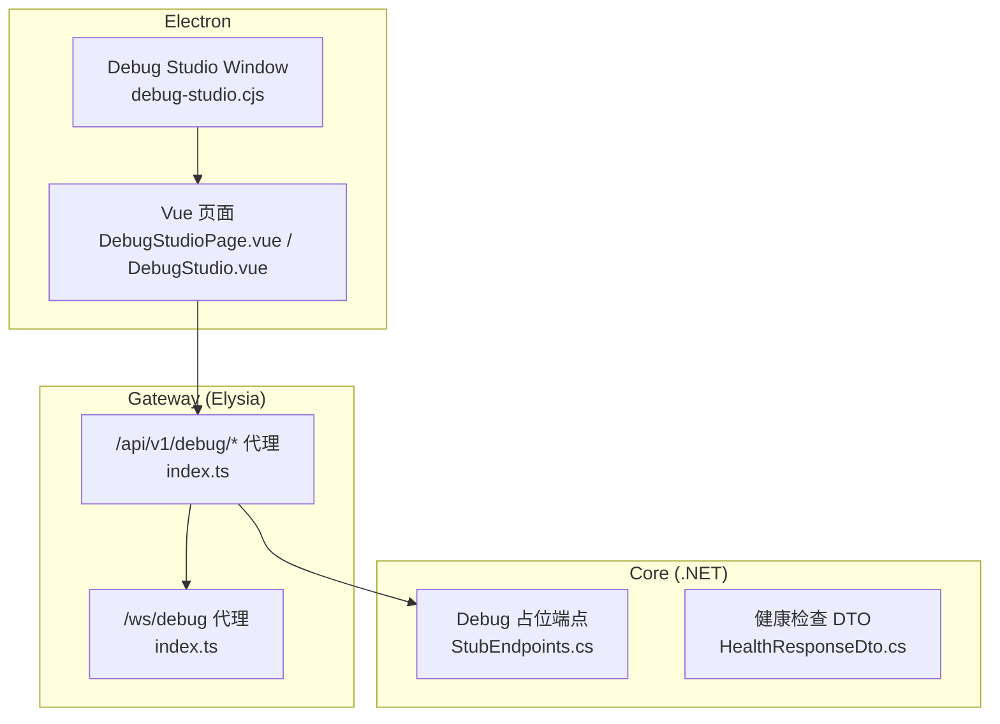
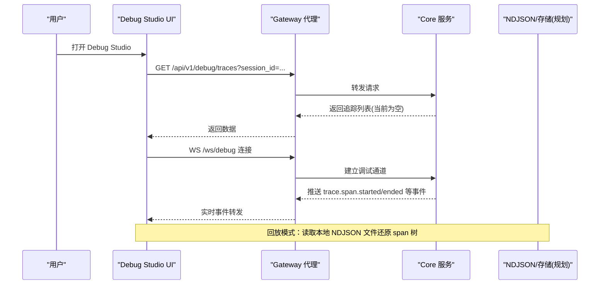
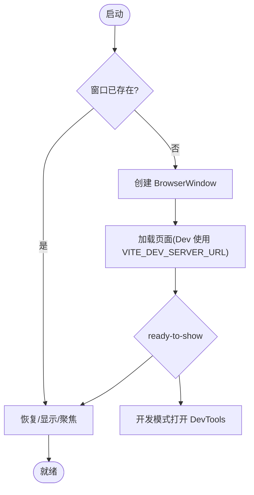
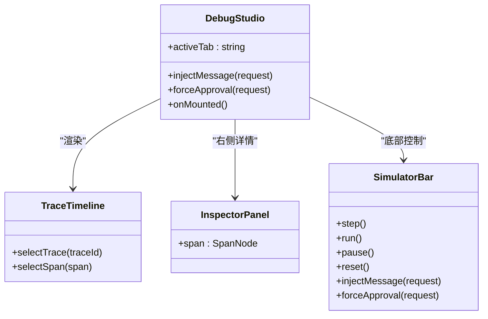
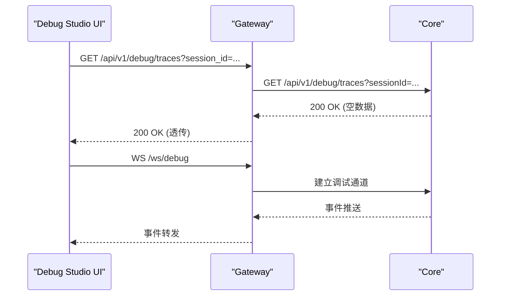
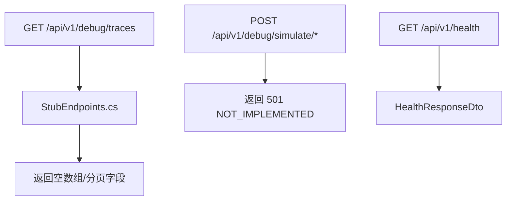
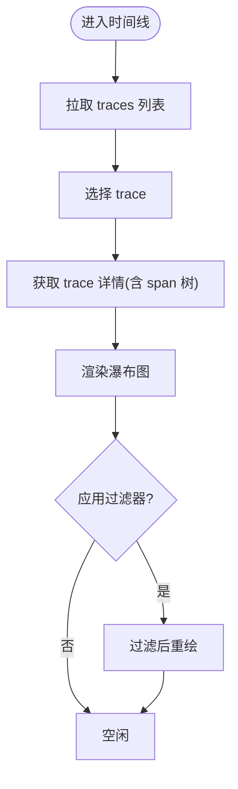
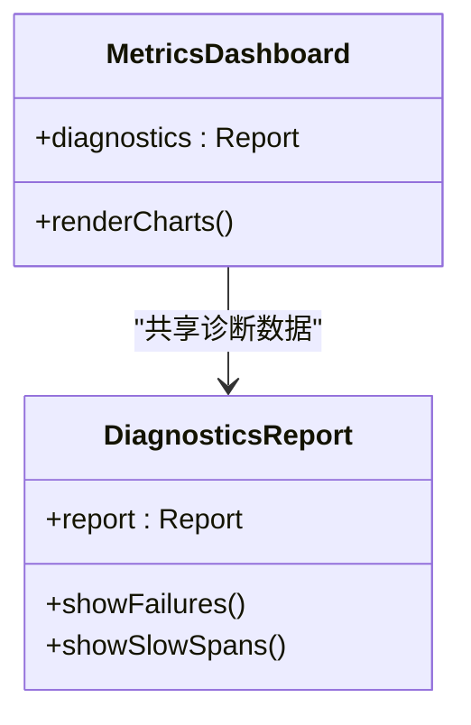
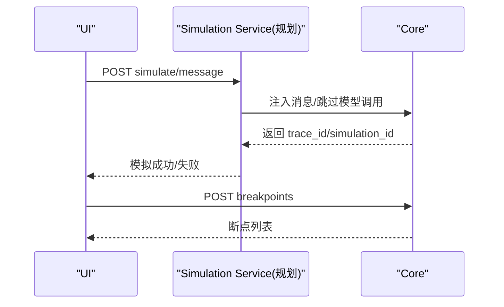
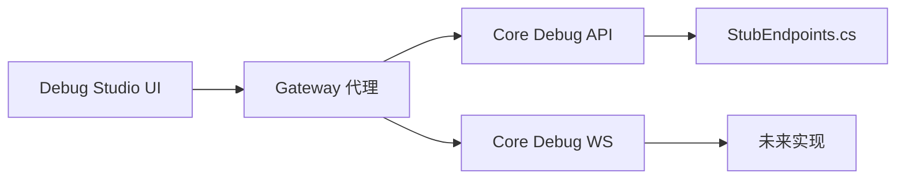

# 调试与监控

<cite>
**本文引用的文件**   
- [agent-debug-studio-plan.md](file://docs/agent-debug-studio-plan.md)
- [DebugStudioPage.vue](file://apps/desktop/src/pages/DebugStudioPage.vue)
- [DebugStudio.vue](file://apps/desktop/src/debug/DebugStudio.vue)
- [debug-studio.cjs](file://apps/desktop/electron/debug-studio.cjs)
- [index.ts](file://TinadecGateway/src/index.ts)
- [StubEndpoints.cs](file://TinadecCore/Api/Endpoints/StubEndpoints.cs)
- [HealthResponseDto.cs](file://TinadecCore/Contracts/Dtos/HealthResponseDto.cs)
</cite>

## 目录
1. [简介](#简介)
2. [项目结构](#项目结构)
3. [核心组件](#核心组件)
4. [架构总览](#架构总览)
5. [详细组件分析](#详细组件分析)
6. [依赖关系分析](#依赖关系分析)
7. [性能考量](#性能考量)
8. [故障排查指南](#故障排查指南)
9. [结论](#结论)
10. [附录](#附录)

## 简介
本文件面向 TinadecOffice 的调试与监控能力，聚焦 Agent Debug Studio 的功能、界面操作与调试技巧，覆盖追踪可视化、日志收集、性能分析与健康检查。文档同时给出实时监控指标、告警配置思路与故障诊断流程，并说明分布式追踪、链路跟踪与性能瓶颈分析方法。内容基于仓库中的设计规划与现有实现（含占位端点与代理路由），为后续完整落地提供统一参考。

## 项目结构
Agent Debug Studio 由三部分构成：
- Electron 独立窗口：负责启动与承载 Debug Studio UI
- Vue 前端：提供追踪时间线、Agent 拓扑、指标看板、诊断报告与模拟器
- Gateway 代理：将 /api/v1/debug/* 请求转发到 Core，并提供 WebSocket 代理

**图表来源** 
- [debug-studio.cjs:1-96](file://apps/desktop/electron/debug-studio.cjs#L1-L96)
- [DebugStudioPage.vue:1-8](file://apps/desktop/src/pages/DebugStudioPage.vue#L1-L8)
- [DebugStudio.vue:1-303](file://apps/desktop/src/debug/DebugStudio.vue#L1-L303)
- [index.ts:720-919](file://TinadecGateway/src/index.ts#L720-L919)
- [StubEndpoints.cs:210-242](file://TinadecCore/Api/Endpoints/StubEndpoints.cs#L210-L242)
- [HealthResponseDto.cs:1-13](file://TinadecCore/Contracts/Dtos/HealthResponseDto.cs#L1-L13)

**章节来源**
- [debug-studio.cjs:1-96](file://apps/desktop/electron/debug-studio.cjs#L1-L96)
- [DebugStudioPage.vue:1-8](file://apps/desktop/src/pages/DebugStudioPage.vue#L1-L8)
- [DebugStudio.vue:1-303](file://apps/desktop/src/debug/DebugStudio.vue#L1-L303)
- [index.ts:720-919](file://TinadecGateway/src/index.ts#L720-L919)
- [StubEndpoints.cs:210-242](file://TinadecCore/Api/Endpoints/StubEndpoints.cs#L210-L242)
- [HealthResponseDto.cs:1-13](file://TinadecCore/Contracts/Dtos/HealthResponseDto.cs#L1-L13)

## 核心组件
- Electron 窗口管理：创建独立的 “Agent Debug Studio” BrowserWindow，隔离主窗口上下文，启用 DevTools 便于开发期调试
- Vue 前端：以标签页组织“时间线、Agent 图、指标、诊断、预览”五大视图；底部集成模拟器控制条
- Gateway 代理：统一暴露 /api/v1/debug/* REST 接口与 /ws/debug WebSocket，透传到 Core
- Core 占位端点：提供调试相关端点的契约骨架（当前返回空数据或 501）
- 健康检查：Core 提供标准健康响应 DTO，用于服务可用性探测

**章节来源**
- [debug-studio.cjs:1-96](file://apps/desktop/electron/debug-studio.cjs#L1-L96)
- [DebugStudio.vue:1-303](file://apps/desktop/src/debug/DebugStudio.vue#L1-L303)
- [index.ts:720-919](file://TinadecGateway/src/index.ts#L720-L919)
- [StubEndpoints.cs:210-242](file://TinadecCore/Api/Endpoints/StubEndpoints.cs#L210-L242)
- [HealthResponseDto.cs:1-13](file://TinadecCore/Contracts/Dtos/HealthResponseDto.cs#L1-L13)

## 架构总览
下图展示从用户交互到后端数据的端到端路径，以及实时与回放两种模式的数据流。

**图表来源** 
- [index.ts:720-919](file://TinadecGateway/src/index.ts#L720-L919)
- [StubEndpoints.cs:210-242](file://TinadecCore/Api/Endpoints/StubEndpoints.cs#L210-L242)
- [agent-debug-studio-plan.md:168-184](file://docs/agent-debug-studio-plan.md#L168-L184)

## 详细组件分析

### Electron 窗口：Agent Debug Studio
- 独立 BrowserWindow，隐藏菜单栏，设置最小尺寸与深色主题
- 开发模式下自动打开 DevTools，渲染进程异常时销毁窗口
- 通过 preload 脚本暴露 tinadec.* IPC 方法供 UI 调用（最小化/最大化/关闭）

**图表来源** 
- [debug-studio.cjs:1-96](file://apps/desktop/electron/debug-studio.cjs#L1-L96)

**章节来源**
- [debug-studio.cjs:1-96](file://apps/desktop/electron/debug-studio.cjs#L1-L96)

### Vue 前端：Debug Studio 主布局与交互
- 顶部标题栏：会话选择器、Live/Replay 切换、WebSocket 状态指示
- 标签页：时间线、Agent 图、指标、诊断、预览
- 底部模拟器：步进、运行、暂停、重置、注入消息/工具结果、强制审批、断点
- 生命周期：挂载时建立 WebSocket、拉取追踪与诊断数据

**图表来源** 
- [DebugStudio.vue:1-303](file://apps/desktop/src/debug/DebugStudio.vue#L1-L303)

**章节来源**
- [DebugStudioPage.vue:1-8](file://apps/desktop/src/pages/DebugStudioPage.vue#L1-L8)
- [DebugStudio.vue:1-303](file://apps/desktop/src/debug/DebugStudio.vue#L1-L303)

### Gateway 代理：REST 与 WebSocket
- REST：将 /api/v1/debug/* 参数映射并转发到 Core，保持查询参数一致
- WebSocket：/ws/debug 作为调试通道代理，透传消息至 Core
- 错误处理：根据下游响应设置状态码并回传前端

**图表来源** 
- [index.ts:720-919](file://TinadecGateway/src/index.ts#L720-L919)

**章节来源**
- [index.ts:720-919](file://TinadecGateway/src/index.ts#L720-L919)

### Core 占位端点与健康检查
- 占位端点：/api/v1/debug/* 目前返回空数据或 501，用于契约对齐与前端联调
- 健康检查：/api/v1/health 返回标准 HealthResponseDto，包含 name/status/version/time

**图表来源** 
- [StubEndpoints.cs:210-242](file://TinadecCore/Api/Endpoints/StubEndpoints.cs#L210-L242)
- [HealthResponseDto.cs:1-13](file://TinadecCore/Contracts/Dtos/HealthResponseDto.cs#L1-L13)

**章节来源**
- [StubEndpoints.cs:210-242](file://TinadecCore/Api/Endpoints/StubEndpoints.cs#L210-L242)
- [HealthResponseDto.cs:1-13](file://TinadecCore/Contracts/Dtos/HealthResponseDto.cs#L1-L13)

### 追踪可视化与回放
- 时间线瀑布图：按 span 层级绘制，颜色编码不同阶段（推理、工具执行、审批等待等）
- 回放模式：读取 NDJSON 追踪文件，还原 span 树并渲染
- 过滤器：按 agent_type、status、最小耗时过滤

**图表来源** 
- [agent-debug-studio-plan.md:457-486](file://docs/agent-debug-studio-plan.md#L457-L486)
- [agent-debug-studio-plan.md:168-184](file://docs/agent-debug-studio-plan.md#L168-L184)

**章节来源**
- [agent-debug-studio-plan.md:457-486](file://docs/agent-debug-studio-plan.md#L457-L486)
- [agent-debug-studio-plan.md:168-184](file://docs/agent-debug-studio-plan.md#L168-L184)

### 指标看板与诊断报告
- 指标看板：聚合 Agent Turn、工具执行、Model API、Token 用量、审批等待、错误率等
- 诊断报告：失败模式聚类、慢 span 统计、最近错误与警告事件

**图表来源** 
- [agent-debug-studio-plan.md:540-561](file://docs/agent-debug-studio-plan.md#L540-L561)
- [agent-debug-studio-plan.md:692-756](file://docs/agent-debug-studio-plan.md#L692-L756)

**章节来源**
- [agent-debug-studio-plan.md:540-561](file://docs/agent-debug-studio-plan.md#L540-L561)
- [agent-debug-studio-plan.md:692-756](file://docs/agent-debug-studio-plan.md#L692-L756)

### 模拟器与断点
- 模拟器：注入消息、模型响应、工具结果、强制审批决策、状态补丁
- 断点：按工具调用、审批、Agent 错误、Token 预算、状态变更、子 Agent 生成等条件触发

**图表来源** 
- [agent-debug-studio-plan.md:758-800](file://docs/agent-debug-studio-plan.md#L758-L800)
- [StubEndpoints.cs:230-239](file://TinadecCore/Api/Endpoints/StubEndpoints.cs#L230-L239)

**章节来源**
- [agent-debug-studio-plan.md:758-800](file://docs/agent-debug-studio-plan.md#L758-L800)
- [StubEndpoints.cs:230-239](file://TinadecCore/Api/Endpoints/StubEndpoints.cs#L230-L239)

## 依赖关系分析
- 前端依赖 Gateway 提供的 REST 与 WebSocket 接口
- Gateway 依赖 Core 的 /api/v1/debug/* 与 /ws/debug
- Core 当前以占位端点满足契约，后续替换为真实实现
- 健康检查 DTO 被上层用于服务可用性判断

**图表来源** 
- [index.ts:720-919](file://TinadecGateway/src/index.ts#L720-L919)
- [StubEndpoints.cs:210-242](file://TinadecCore/Api/Endpoints/StubEndpoints.cs#L210-L242)

**章节来源**
- [index.ts:720-919](file://TinadecGateway/src/index.ts#L720-L919)
- [StubEndpoints.cs:210-242](file://TinadecCore/Api/Endpoints/StubEndpoints.cs#L210-L242)

## 性能考量
- 追踪导出：建议采用批写与轮转策略（如 NDJSON 文件分片），避免阻塞主流程
- 指标采样：对高频指标进行采样聚合，降低存储与传输开销
- 前端渲染：时间线虚拟化渲染，按需加载 span 详情，减少首屏压力
- 网络层：Gateway 代理应缓存热点查询，缩短延迟

[本节为通用指导，不直接分析具体文件]

## 故障排查指南
- 连接问题：确认 Gateway 是否可访问，WebSocket 是否成功升级
- 数据为空：Core 占位端点尚未实现，需等待真实后端接入
- 健康检查：调用 /api/v1/health 验证 Core 状态
- 日志定位：结合 Gateway 代理日志与 Core 输出，定位请求链路

**章节来源**
- [index.ts:720-919](file://TinadecGateway/src/index.ts#L720-L919)
- [HealthResponseDto.cs:1-13](file://TinadecCore/Contracts/Dtos/HealthResponseDto.cs#L1-L13)

## 结论
Agent Debug Studio 已具备完整的 UI 框架与 Gateway 代理通道，Core 侧占位端点确保前后端契约对齐。下一步重点在于实现 Core 端的追踪采集、指标聚合、诊断分析与模拟器逻辑，并通过 NDJSON 持久化与 WebSocket 实时推送打通全链路可观测性。

[本节为总结，不直接分析具体文件]

## 附录
- 设计规划参考：详见 docs/agent-debug-studio-plan.md，涵盖 Span 定义、指标清单、NDJSON 格式、API 契约与前端组件树
- 关键路径：
  - 前端入口：apps/desktop/src/pages/DebugStudioPage.vue
  - 主布局：apps/desktop/src/debug/DebugStudio.vue
  - Electron 窗口：apps/desktop/electron/debug-studio.cjs
  - Gateway 代理：TinadecGateway/src/index.ts
  - Core 占位端点：TinadecCore/Api/Endpoints/StubEndpoints.cs
  - 健康检查 DTO：TinadecCore/Contracts/Dtos/HealthResponseDto.cs

**章节来源**
- [agent-debug-studio-plan.md:1-1130](file://docs/agent-debug-studio-plan.md#L1-L1130)
- [DebugStudioPage.vue:1-8](file://apps/desktop/src/pages/DebugStudioPage.vue#L1-L8)
- [DebugStudio.vue:1-303](file://apps/desktop/src/debug/DebugStudio.vue#L1-L303)
- [debug-studio.cjs:1-96](file://apps/desktop/electron/debug-studio.cjs#L1-L96)
- [index.ts:720-919](file://TinadecGateway/src/index.ts#L720-L919)
- [StubEndpoints.cs:210-242](file://TinadecCore/Api/Endpoints/StubEndpoints.cs#L210-L242)
- [HealthResponseDto.cs:1-13](file://TinadecCore/Contracts/Dtos/HealthResponseDto.cs#L1-L13)