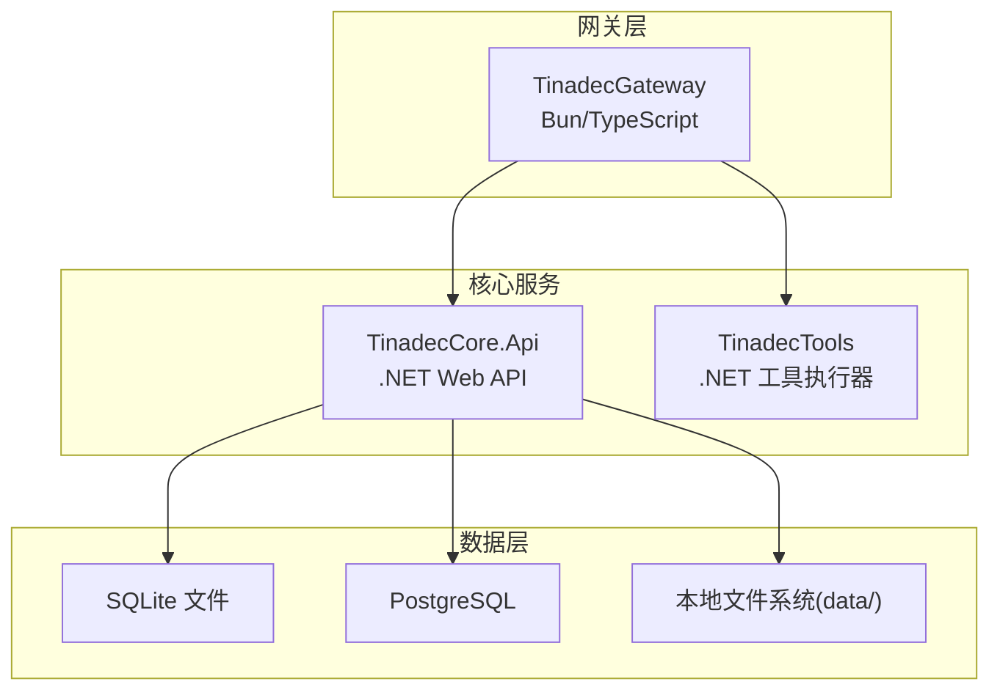
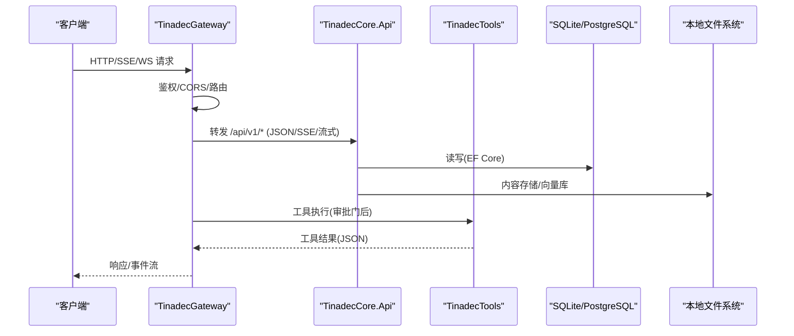
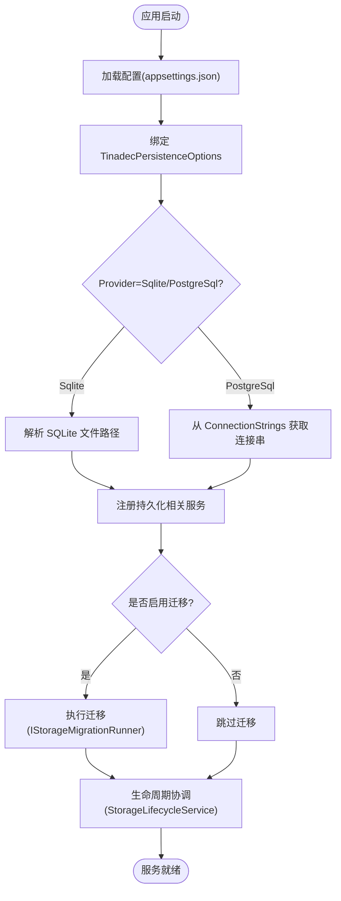
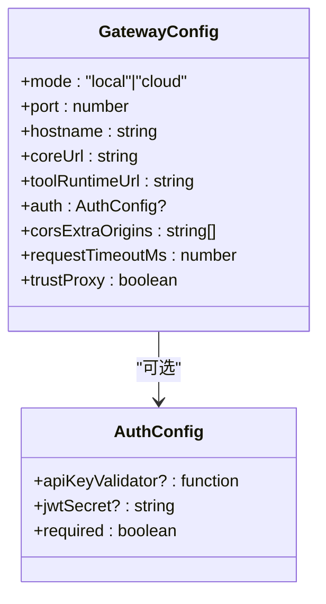
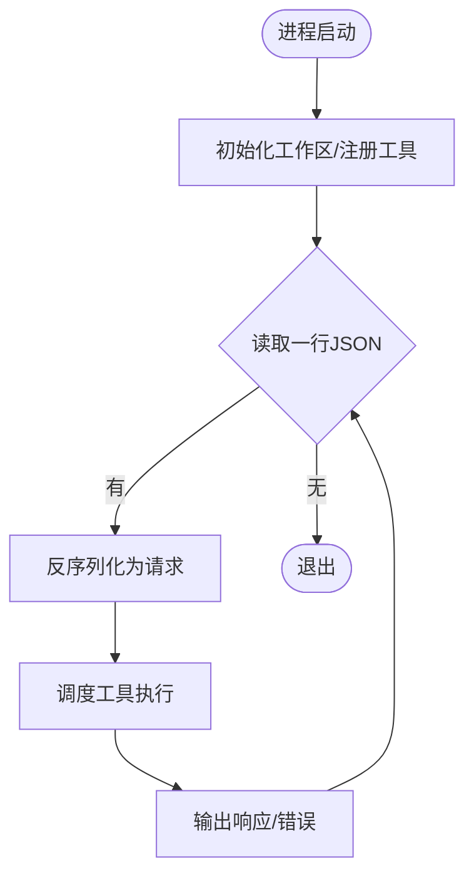
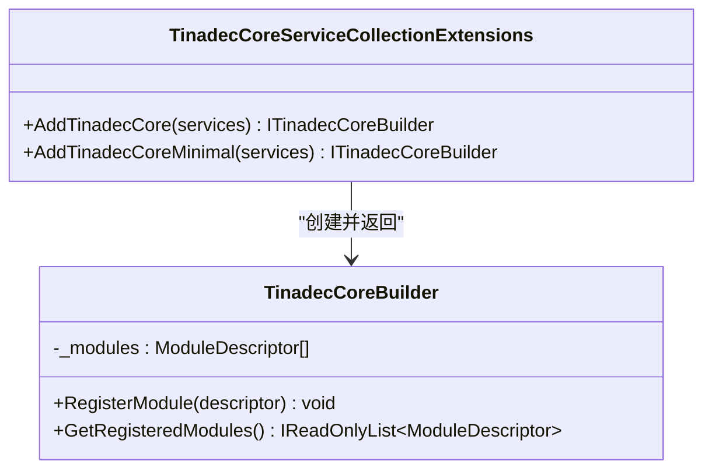
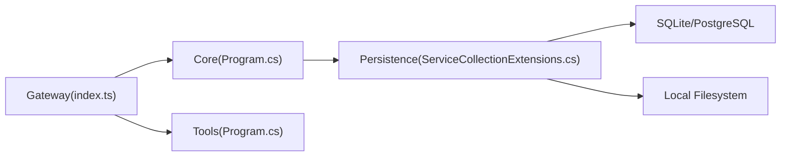

# 部署与配置

<cite>
**本文引用的文件**   
- [TinadecCore\Api\appsettings.json](file://TinadecCore\Api\appsettings.json)
- [TinadecCore\Api\Program.cs](file://TinadecCore\Api\Program.cs)
- [TinadecCore\Persistence\TinadecPersistenceOptions.cs](file://TinadecCore\Persistence\TinadecPersistenceOptions.cs)
- [TinadecCore\Persistence\ServiceCollectionExtensions.cs](file://TinadecCore\Persistence\ServiceCollectionExtensions.cs)
- [TinadecCore\Runtime\TinadecCoreBuilder.cs](file://TinadecCore\Runtime\TinadecCoreBuilder.cs)
- [TinadecCore\Runtime\TinadecCoreServiceCollectionExtensions.cs](file://TinadecCore\Runtime\TinadecCoreServiceCollectionExtensions.cs)
- [TinadecGateway\src\config.ts](file://TinadecGateway\src\config.ts)
- [TinadecGateway\src\index.ts](file://TinadecGateway\src\index.ts)
- [TinadecTools\Program.cs](file://TinadecTools\Program.cs)
- [.github\workflows\core-storage-postgres.yml](file://.github\workflows\core-storage-postgres.yml)
</cite>

## 目录
1. [简介](#简介)
2. [项目结构](#项目结构)
3. [核心组件](#核心组件)
4. [架构总览](#架构总览)
5. [详细组件分析](#详细组件分析)
6. [依赖关系分析](#依赖关系分析)
7. [性能考虑](#性能考虑)
8. [故障排查指南](#故障排查指南)
9. [结论](#结论)
10. [附录](#附录)

## 简介
本指南面向生产环境部署 TinadecOffice，覆盖环境准备、服务部署、容器化方案、配置文件结构与环境变量、数据库与存储后端选择、备份策略、监控与日志、安全加固、自动化构建与持续集成等。文档基于仓库中的实际代码与配置进行说明，确保可操作性和一致性。

## 项目结构
TinadecOffice 由三个主要运行时组成：
- Core（.NET）：提供 API、持久化、生命周期、模型、会话、技能、向量存储等能力。
- Gateway（Bun/TypeScript）：薄代理 BFF，统一鉴权、协议转换、SSE/WebSocket/流式转发。
- Tools（.NET）：沙箱工具执行器，通过标准输入输出与上层交互。

**图表来源** 
- [TinadecCore\Api\Program.cs:1-181](file://TinadecCore\Api\Program.cs#L1-L181)
- [TinadecGateway\src\index.ts:1-800](file://TinadecGateway\src\index.ts#L1-L800)
- [TinadecTools\Program.cs:1-68](file://TinadecTools\Program.cs#L1-L68)
- [TinadecCore\Persistence\ServiceCollectionExtensions.cs:1-122](file://TinadecCore\Persistence\ServiceCollectionExtensions.cs#L1-L122)

**章节来源**
- [TinadecCore\Api\Program.cs:1-181](file://TinadecCore\Api\Program.cs#L1-L181)
- [TinadecGateway\src\index.ts:1-800](file://TinadecGateway\src\index.ts#L1-L800)
- [TinadecTools\Program.cs:1-68](file://TinadecTools\Program.cs#L1-L68)

## 核心组件
- Core API：启动 ASP.NET Core 应用，注册持久化与模块，暴露健康检查、就绪性、清单等端点，并在启动时执行迁移与生命周期协调。
- Gateway：基于 Elysia 的轻量网关，支持本地/云端模式、CORS、认证、SSE/WebSocket/流式转发、审批门与 Code Tool 执行编排。
- Tools：以控制台进程运行，循环读取 JSON 请求并调用工具注册表，返回结果；在 Windows 上支持沙箱初始化与运行模式。

关键职责与入口：
- Core 启动与迁移：见 Program 中 AddTinadecPersistence、AddTinadecCore、IStorageMigrationRunner.RunAsync、StorageLifecycleService.ReconcileAsync。
- Gateway 配置加载：从环境变量加载部署模式、端口、主机名、Core/Tool Runtime URL、认证参数、CORS、超时与反向代理信任。
- Tools 主循环：读取行、反序列化、调度工具、输出响应、异常处理、MCP 资源释放。

**章节来源**
- [TinadecCore\Api\Program.cs:1-181](file://TinadecCore\Api\Program.cs#L1-L181)
- [TinadecGateway\src\config.ts:1-115](file://TinadecGateway\src\config.ts#L1-L115)
- [TinadecTools\Program.cs:1-68](file://TinadecTools\Program.cs#L1-L68)

## 架构总览
下图展示了请求从客户端到 Gateway、Core、Tools 以及数据存储的完整路径，包括 SSE/WS 流式转发与审批门流程。

**图表来源** 
- [TinadecGateway\src\index.ts:1-800](file://TinadecGateway\src\index.ts#L1-L800)
- [TinadecCore\Api\Program.cs:1-181](file://TinadecCore\Api\Program.cs#L1-L181)
- [TinadecTools\Program.cs:1-68](file://TinadecTools\Program.cs#L1-L68)
- [TinadecCore\Persistence\ServiceCollectionExtensions.cs:1-122](file://TinadecCore\Persistence\ServiceCollectionExtensions.cs#L1-L122)

## 详细组件分析

### Core 服务：配置与持久化
- 配置文件 appsettings.json 包含 Logging、AllowedHosts、ConnectionStrings、TinadecPersistence、TinadecIdentity 等键。
- TinadecPersistenceOptions 定义 Provider（Sqlite/PostgreSql）、DataRoot、ApplyMigrationsOnStartup、ProbeTimeoutSeconds 等选项。
- ServiceCollectionExtensions.AddTinadecPersistence 绑定配置、解析连接信息、注册 IContentStore、ProjectVectorDatabase、SecretStore、StorageMigrationRunner 等。
- Program 启动时根据配置决定是否运行迁移与生命周期协调。

**图表来源** 
- [TinadecCore\Api\appsettings.json:1-31](file://TinadecCore\Api\appsettings.json#L1-L31)
- [TinadecCore\Persistence\TinadecPersistenceOptions.cs:1-48](file://TinadecCore\Persistence\TinadecPersistenceOptions.cs#L1-L48)
- [TinadecCore\Persistence\ServiceCollectionExtensions.cs:1-122](file://TinadecCore\Persistence\ServiceCollectionExtensions.cs#L1-L122)
- [TinadecCore\Api\Program.cs:1-181](file://TinadecCore\Api\Program.cs#L1-L181)

**章节来源**
- [TinadecCore\Api\appsettings.json:1-31](file://TinadecCore\Api\appsettings.json#L1-L31)
- [TinadecCore\Persistence\TinadecPersistenceOptions.cs:1-48](file://TinadecCore\Persistence\TinadecPersistenceOptions.cs#L1-L48)
- [TinadecCore\Persistence\ServiceCollectionExtensions.cs:1-122](file://TinadecCore\Persistence\ServiceCollectionExtensions.cs#L1-L122)
- [TinadecCore\Api\Program.cs:1-181](file://TinadecCore\Api\Program.cs#L1-L181)

### Gateway：部署模式与认证
- 配置加载函数 loadConfig 从环境变量读取部署模式、端口、主机名、Core/Tool Runtime URL、认证参数、CORS、超时与反向代理信任。
- index.ts 实现 CORS、认证中间件、健康检查、SSE/WS/流式转发、审批门与 Code Tool 执行编排。

**图表来源** 
- [TinadecGateway\src\config.ts:1-115](file://TinadecGateway\src\config.ts#L1-L115)

**章节来源**
- [TinadecGateway\src\config.ts:1-115](file://TinadecGateway\src\config.ts#L1-L115)
- [TinadecGateway\src\index.ts:1-800](file://TinadecGateway\src\index.ts#L1-L800)

### Tools：工具执行器
- 主循环读取 JSON 请求，反序列化为 ToolCallRequest，调用 ToolRegistry.DispatchAsync，输出 ToolCallResponse 或错误响应。
- Windows 平台支持沙箱初始化与运行模式，最后释放 MCP 资源。

**图表来源** 
- [TinadecTools\Program.cs:1-68](file://TinadecTools\Program.cs#L1-L68)

**章节来源**
- [TinadecTools\Program.cs:1-68](file://TinadecTools\Program.cs#L1-L68)

### 模块注册与最小化组合
- TinadecCoreServiceCollectionExtensions 提供全量与最小化模块注册方法，便于裁剪运行时依赖。
- TinadecCoreBuilder 收集模块描述符并委托 DI 注册。

**图表来源** 
- [TinadecCore\Runtime\TinadecCoreServiceCollectionExtensions.cs:1-61](file://TinadecCore\Runtime\TinadecCoreServiceCollectionExtensions.cs#L1-L61)
- [TinadecCore\Runtime\TinadecCoreBuilder.cs:1-31](file://TinadecCore\Runtime\TinadecCoreBuilder.cs#L1-L31)

**章节来源**
- [TinadecCore\Runtime\TinadecCoreServiceCollectionExtensions.cs:1-61](file://TinadecCore\Runtime\TinadecCoreServiceCollectionExtensions.cs#L1-L61)
- [TinadecCore\Runtime\TinadecCoreBuilder.cs:1-31](file://TinadecCore\Runtime\TinadecCoreBuilder.cs#L1-L31)

## 依赖关系分析
- Core 依赖 EF Core 与 SQLite/PostgreSQL 驱动，使用 ServiceCollectionExtensions 注入持久化能力。
- Gateway 依赖 Elysia，并通过 coreClient/toolRuntimeClient 转发请求至 Core 与 Tools。
- Tools 依赖 NLog 与沙箱子系统（Windows），通过标准 IO 与上层通信。

**图表来源** 
- [TinadecGateway\src\index.ts:1-800](file://TinadecGateway\src\index.ts#L1-L800)
- [TinadecCore\Api\Program.cs:1-181](file://TinadecCore\Api\Program.cs#L1-L181)
- [TinadecCore\Persistence\ServiceCollectionExtensions.cs:1-122](file://TinadecCore\Persistence\ServiceCollectionExtensions.cs#L1-L122)
- [TinadecTools\Program.cs:1-68](file://TinadecTools\Program.cs#L1-L68)

**章节来源**
- [TinadecGateway\src\index.ts:1-800](file://TinadecGateway\src\index.ts#L1-L800)
- [TinadecCore\Api\Program.cs:1-181](file://TinadecCore\Api\Program.cs#L1-L181)
- [TinadecCore\Persistence\ServiceCollectionExtensions.cs:1-122](file://TinadecCore\Persistence\ServiceCollectionExtensions.cs#L1-L122)
- [TinadecTools\Program.cs:1-68](file://TinadecTools\Program.cs#L1-L68)

## 性能考虑
- 数据库探针超时：TinadecPersistenceOptions.ProbeTimeoutSeconds 控制就绪性探测超时，建议设置为 1-30 秒之间，避免误判。
- 迁移策略：SQLite 默认本地启动即迁移；PostgreSQL 需显式启用 ApplyMigrationsOnStartup，防止多实例并发冲突。
- 流式转发：Gateway 对 SSE/WS/流式 HTTP 进行透传，注意设置合适的 requestTimeoutMs 与反向代理缓冲头（如 x-accel-buffering）。
- 最小化模块：使用 AddTinadecCoreMinimal 减少运行时依赖，降低内存占用与冷启动时间。

[本节为通用指导，不直接分析具体文件]

## 故障排查指南
- 健康检查：访问 /api/v1/health 与 /api/v1/readiness，确认 Core 与 Gateway 状态。
- 数据库连通性：检查 ConnectionStrings 名称与值是否正确，SQLite 文件路径是否存在且可写。
- 迁移失败：查看日志级别与输出，确认 ApplyMigrationsOnStartup 与权限。
- 认证失败：在云端模式下检查 TINADEC_GATEWAY_AUTH_REQUIRED、TINADEC_GATEWAY_JWT_SECRET、TINADEC_GATEWAY_API_KEY。
- 工具执行异常：查看 Tools 进程的日志与异常输出，确认沙箱初始化成功。

**章节来源**
- [TinadecCore\Api\Program.cs:1-181](file://TinadecCore\Api\Program.cs#L1-L181)
- [TinadecGateway\src\index.ts:1-800](file://TinadecGateway\src\index.ts#L1-L800)
- [TinadecTools\Program.cs:1-68](file://TinadecTools\Program.cs#L1-L68)

## 结论
本指南基于仓库实际代码与配置，提供了 TinadecOffice 的生产部署要点：Core 的持久化与迁移、Gateway 的认证与流式转发、Tools 的沙箱执行、CI 示例与最佳实践。按此指南实施可确保系统稳定、安全、可扩展。

[本节为总结，不直接分析具体文件]

## 附录

### 环境变量与配置项速查
- Core（appsettings.json）
  - ConnectionStrings.TinadecCore：PostgreSQL 连接串名称与值
  - TinadecPersistence.Enabled/Provider/DataRoot/ApplyMigrationsOnStartup/ProbeTimeoutSeconds
  - TinadecPersistence.Sqlite.DatabasePath
  - TinadecPersistence.PostgreSql.ConnectionStringName
  - TinadecIdentity.*（开发身份开关与租户/工作区标识）
- Gateway（环境变量）
  - TINADEC_GATEWAY_MODE：local/cloud
  - TINADEC_GATEWAY_PORT：监听端口
  - TINADEC_GATEWAY_HOSTNAME：监听地址（cloud 时为 0.0.0.0）
  - TINADEC_CORE_URL：Core 服务地址
  - TINADEC_TOOL_RUNTIME_URL：Tool Runtime 地址
  - TINADEC_GATEWAY_AUTH_REQUIRED：是否强制认证
  - TINADEC_GATEWAY_JWT_SECRET：JWT 密钥
  - TINADEC_GATEWAY_API_KEY：API Key
  - TINADEC_GATEWAY_CORS_ORIGINS：额外允许的源（逗号分隔）
  - TINADEC_GATEWAY_TIMEOUT_MS：请求超时毫秒
  - trustProxy：云端模式自动启用

**章节来源**
- [TinadecCore\Api\appsettings.json:1-31](file://TinadecCore\Api\appsettings.json#L1-L31)
- [TinadecCore\Persistence\TinadecPersistenceOptions.cs:1-48](file://TinadecCore\Persistence\TinadecPersistenceOptions.cs#L1-L48)
- [TinadecGateway\src\config.ts:1-115](file://TinadecGateway\src\config.ts#L1-L115)

### 数据库与存储后端选择
- SQLite：适合本地桌面与单实例部署，数据库文件位于 data/tinadec.db（相对 content root 解析）。
- PostgreSQL：适合多实例与高可用部署，需在 ConnectionStrings 中配置连接串名称。
- 本地文件系统：Core 将 session/event/task/artifact 等文件存储在 DataRoot 目录下。

**章节来源**
- [TinadecCore\Persistence\ServiceCollectionExtensions.cs:1-122](file://TinadecCore\Persistence\ServiceCollectionExtensions.cs#L1-L122)
- [TinadecCore\Persistence\TinadecPersistenceOptions.cs:1-48](file://TinadecCore\Persistence\TinadecPersistenceOptions.cs#L1-L48)

### 备份策略建议
- SQLite：定期拷贝 data/tinadec.db 文件，建议在停机或只读状态下进行一致性备份。
- PostgreSQL：使用 pg_dump 或云厂商快照，结合事务日志进行增量备份。
- 文件系统：对 data/ 目录进行增量备份，确保与数据库一致时间点。

[本节为通用指导，不直接分析具体文件]

### 监控与日志管理
- Core：使用 Microsoft.Extensions.Logging，默认 LogLevel.Information，可根据需要调整。
- Gateway：Elysia 中间件与日志可通过框架扩展接入集中式日志系统。
- Tools：NLog 配置用于结构化日志输出，建议对接日志采集服务。

**章节来源**
- [TinadecCore\Api\appsettings.json:1-31](file://TinadecCore\Api\appsettings.json#L1-L31)
- [TinadecTools\Program.cs:1-68](file://TinadecTools\Program.cs#L1-L68)

### 安全加固建议
- 云端模式启用认证：设置 TINADEC_GATEWAY_AUTH_REQUIRED=true，配置 JWT Secret 或 API Key。
- CORS 白名单：仅允许必要的 origin，避免通配符滥用。
- 反向代理：启用 trustProxy，正确传递 X-Forwarded-* 头。
- 最小权限：Core 与 Tools 进程以受限用户运行，限制文件系统与网络访问。

**章节来源**
- [TinadecGateway\src\config.ts:1-115](file://TinadecGateway\src\config.ts#L1-L115)
- [TinadecGateway\src\index.ts:1-800](file://TinadecGateway\src\index.ts#L1-L800)

### 自动化构建与持续集成示例
- GitHub Actions：core-storage-postgres.yml 演示了 PostgreSQL 测试环境的搭建与测试执行。
- 步骤要点：
  - 使用 postgres:16 镜像作为服务，设置健康检查。
  - 设置 TINADEC_TEST_POSTGRES 与连接串环境变量。
  - 安装 .NET SDK，恢复依赖并执行过滤测试。

**章节来源**
- [.github\workflows\core-storage-postgres.yml:1-40](file://.github\workflows\core-storage-postgres.yml#L1-L40)