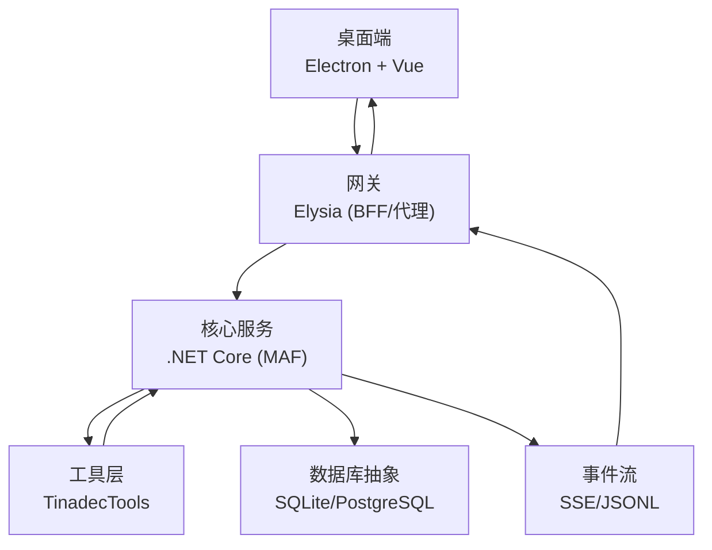
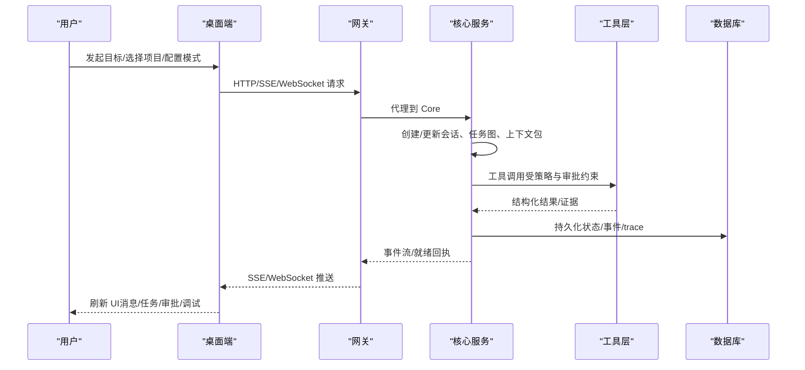
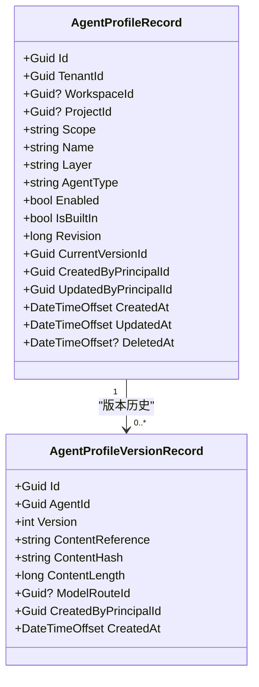
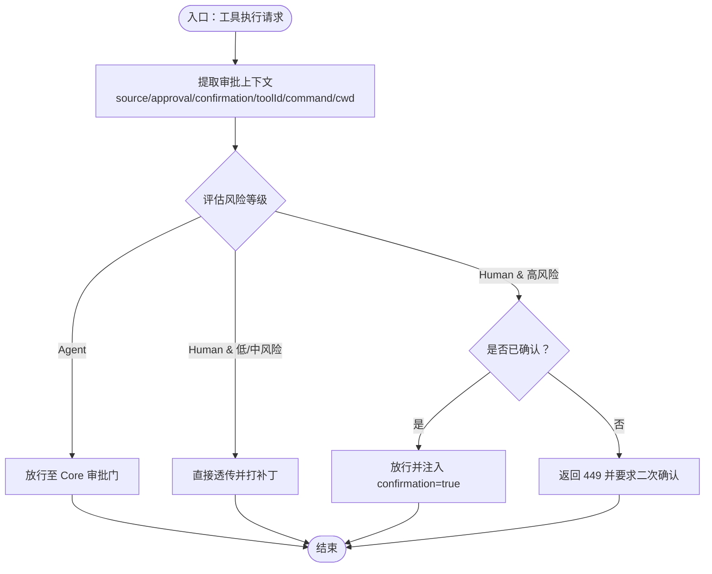
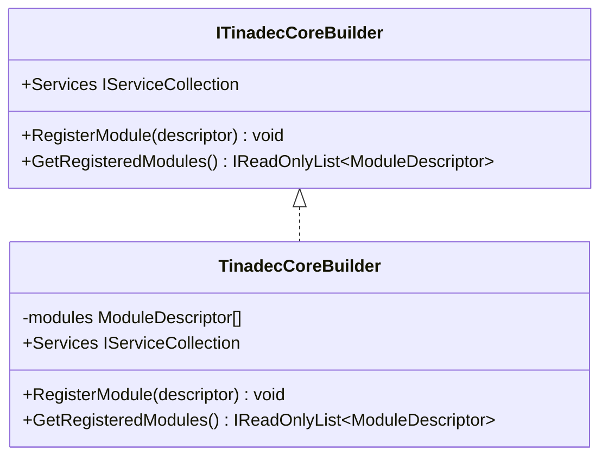
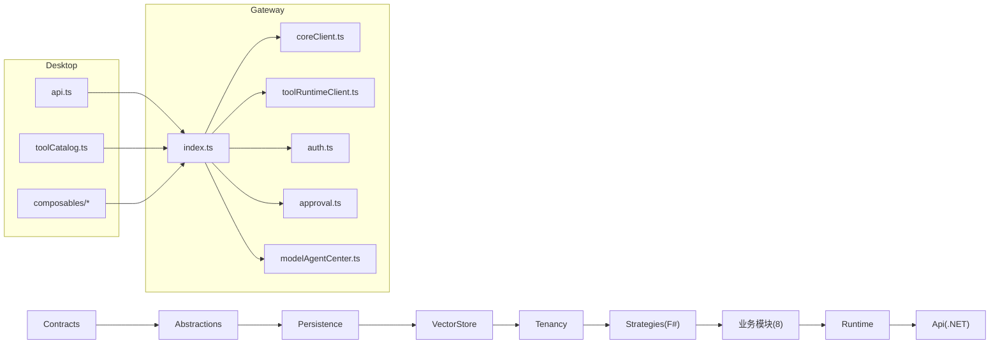

# 产品定位与价值

<cite>
**本文引用的文件**   
- [README.md](file://README.md)
- [AGENTS.md](file://AGENTS.md)
- [agent-harness-product-model.zh-CN.md](file://docs/agent-harness-product-model.zh-CN.md)
- [architecture.md](file://docs/architecture.md)
- [TinadecCoreBuilder.cs](file://TinadecCore/Runtime/TinadecCoreBuilder.cs)
- [index.ts](file://TinadecGateway/src/index.ts)
- [approval.ts](file://TinadecGateway/src/approval.ts)
- [AgentControlDbContext.cs](file://TinadecCore/DmaEA/AgentControlDbContext.cs)
</cite>

## 目录
1. [引言](#引言)
2. [项目结构](#项目结构)
3. [核心组件](#核心组件)
4. [架构总览](#架构总览)
5. [详细组件分析](#详细组件分析)
6. [依赖关系分析](#依赖关系分析)
7. [性能考量](#性能考量)
8. [故障排查指南](#故障排查指南)
9. [结论](#结论)
10. [附录](#附录)

## 引言
TinadecOffice 是一个面向 AI 智能体协作的 Agent 工作空间。它以“通用智能体编排”为核心，将 Core（可复用的 agent harness）、Tool layer（审批感知的工具执行能力）与 Desktop（交互呈现层）解耦为三层职责，通过双层智能体编排与审批门控机制，解决复杂开发场景中的“意图到执行”的可控、可审计、可追溯问题。

核心价值主张：
- 以 Core 为唯一状态权威，确保会话、任务图、事件流、模型路由、工具策略与审批决策的一致性。
- 以 Tool layer 提供可发现、可审批、可执行的工具能力，使高风险操作具备人类检查点。
- 以 Desktop 降低认知成本，让编排状态、工具结果与风险控制可视化、可操作。
- 以双层智能体（规划层 + 执行层）分离“思考监督”和“执行取证”，提升安全与可解释性。

目标用户群体：
- 开发者与团队：在本地或云端使用智能体进行代码生成、调试、Git 协作、环境搭建等。
- 技术负责人与安全合规人员：需要可审计、可回滚、可审批的智能体执行过程。
- 平台与产品团队：复用 Core 作为通用 agent harness，构建自有工作台或集成到 IDE/CLI。

使用场景举例：
- 需求到 PR：规划层拆解任务，执行层调用 Git/文件/命令工具，所有写操作经审批门；Desktop 展示任务图与审批面板。
- 调试与复盘：SSE 事件流回放、Trace/Metrics 可视化，快速定位问题根因。
- 多模型编排：Model Center/Agent Center 聚合视图，统一路由与就绪回执，避免前端重复计算风险。

竞争优势：
- 明确的三层边界与“Core 是唯一状态权威”的设计原则，避免状态分散与逻辑漂移。
- 审批门控与二次确认机制，兼顾自动化效率与人工控制。
- 双层智能体编排，天然支持“主动监督 + 被动执行”的安全模式。
- 统一的 readiness 回执与 BFF 组合视图，便于上层无状态消费。

章节来源
- [README.md:1-120](file://README.md#L1-L120)
- [AGENTS.md:19-120](file://AGENTS.md#L19-L120)
- [agent-harness-product-model.zh-CN.md:1-127](file://docs/agent-harness-product-model.zh-CN.md#L1-L127)

## 项目结构
- Desktop（Electron + Vue 3 + Vite）：UI 呈现、聊天、任务图、审批、可分离面板、Debug Studio。
- Gateway（Elysia + TypeScript）：薄 BFF/代理，暴露 /api/v1/*，转发 SSE/WebSocket/流式 HTTP。
- Core（.NET 10 + ASP.NET Core + MAF）：唯一状态权威，编排、工具策略、模型路由、持久化、就绪回执。
- TinadecTools（原型工具层）：文件/命令/Git/MCP 等工具实现，支持静态注册与审批标记。

图表来源
- [README.md:17-43](file://README.md#L17-L43)
- [architecture.md:1-17](file://docs/architecture.md#L1-L17)

章节来源
- [README.md:17-73](file://README.md#L17-L73)
- [AGENTS.md:34-120](file://AGENTS.md#L34-L120)

## 核心组件
- Core 模块化单体（MAF）：Contracts/Abstractions/Persistence/VectorStore/Tenancy/Strategies/Modules/Runtime/Api。
- Gateway 薄代理：CORS、鉴权（云端模式）、协议转换、SSE/WebSocket/流式转发、Model/Agent Center 聚合视图。
- Desktop 渲染器：只调 Gateway，不存业务状态；提供 Chat、TaskGraph、Approval、ToolCatalog、Debug Studio。
- TinadecTools：[ToolFunction] 静态注册、审批标记、MCP pass-through、沙箱执行、Git/文件/搜索工具集。

章节来源
- [AGENTS.md:159-189](file://AGENTS.md#L159-L189)
- [architecture.md:19-45](file://docs/architecture.md#L19-L45)

## 架构总览
- 设计原则：Core 是唯一状态权威；Desktop 仅调 Gateway；写操作必须经过审批门；API 契约统一 snake_case；Code 是 Tool layer 内置套件而非独立层。
- 数据流：Desktop → Gateway → Core → Tool layer → Core（状态/事件/trace）→ Gateway（SSE/WebSocket）→ Desktop。

图表来源
- [AGENTS.md:87-118](file://AGENTS.md#L87-L118)
- [architecture.md:51-68](file://docs/architecture.md#L51-L68)

章节来源
- [README.md:25-43](file://README.md#L25-L43)
- [AGENTS.md:87-120](file://AGENTS.md#L87-L120)

## 详细组件分析

### 双层智能体编排（Planning + Execution）
- Planning layer：主动规划、监督质量、提出演进建议。
- Execution layer：在明确任务节点与权限边界下完成具体工作。
- 数据模型：AgentProfile 与版本记录由 Core 持久化，支撑双层编排与审计。

图表来源
- [AgentControlDbContext.cs:1-28](file://TinadecCore/DmaEA/AgentControlDbContext.cs#L1-L28)

章节来源
- [agent-harness-product-model.zh-CN.md:88-106](file://docs/agent-harness-product-model.zh-CN.md#L88-L106)
- [AGENTS.md:16-28](file://AGENTS.md#L16-L28)

### 审批门控机制（Gateway 拦截 + 二次确认）
- 人类请求需携带 approval=true；高风险工具触发 confirmation 二次确认。
- 规则：Agent 请求不拦截（交由 Core 审批门），人类低风险/中风险直接透传，高风险需确认。
- 响应码 449 表示需要二次确认，Desktop 据此弹出警告。

图表来源
- [approval.ts:1-235](file://TinadecGateway/src/approval.ts#L1-L235)
- [index.ts:350-400](file://TinadecGateway/src/index.ts#L350-L400)

章节来源
- [approval.ts:1-235](file://TinadecGateway/src/approval.ts#L1-L235)
- [index.ts:350-400](file://TinadecGateway/src/index.ts#L350-L400)

### 工具层与 Code 套件（TinadecTools）
- 静态注册：[ToolFunction] + Source Generator 生成注册表，支持 RequiresApproval 标记。
- MCP pass-through：list/search/invoke，默认读取 mcp_servers.json 或通过环境变量覆盖。
- 沙箱执行：Windows Job Object 隔离、ACL 临时授权、超时终止进程树。
- Git/文件/搜索：完整只读面与受限写入，路径越界拒绝，二进制/重命名按完整路径处理。

章节来源
- [AGENTS.md:138-141](file://AGENTS.md#L138-L141)
- [AGENTS.md:225-256](file://AGENTS.md#L225-L256)

### 核心服务装配（Core Builder）
- ITinadecCoreBuilder 收集 ModuleDescriptor，统一 DI 注册。
- Runtime 提供 AddTinadecCore() 全量与 AddTinadecCoreMinimal() 裁剪版。

图表来源
- [TinadecCoreBuilder.cs:1-31](file://TinadecCore/Runtime/TinadecCoreBuilder.cs#L1-L31)

章节来源
- [TinadecCoreBuilder.cs:1-31](file://TinadecCore/Runtime/TinadecCoreBuilder.cs#L1-L31)

### 网关 API 与 BFF 组合
- 健康/就绪/诊断：/health、/readiness、/model-readiness、/tool-layer-readiness。
- 会话/事件：/sessions、/events（SSE）、/invoke-stream。
- 工具/审批：/tools、/approvals、/code/tools/:id/execute。
- Model/Agent Center：/model-center/overview、/agent-center/overview。

章节来源
- [index.ts:156-349](file://TinadecGateway/src/index.ts#L156-L349)
- [architecture.md:19-45](file://docs/architecture.md#L19-L45)

## 依赖关系分析
- Core 模块依赖：Contracts → Abstractions → Persistence → VectorStore → Tenancy → Strategies → 8 个业务模块 → Runtime → Api。
- Gateway 依赖：coreClient（HTTP/SSE）、toolRuntimeClient（工具执行）、auth（鉴权）、approval（审批门）、modelAgentCenter（BFF 聚合）。
- Desktop 依赖：api.ts（DTO 镜像）、toolCatalog（工具目录）、composables（主题/面板样式/通知）。

图表来源
- [AGENTS.md:159-189](file://AGENTS.md#L159-L189)
- [index.ts:1-80](file://TinadecGateway/src/index.ts#L1-L80)

章节来源
- [AGENTS.md:159-189](file://AGENTS.md#L159-L189)

## 性能考量
- 事件流优先使用 SSE，减少轮询开销；大文件/日志采用流式 HTTP。
- 数据库默认 SQLite 本地文件，启动自动迁移；生产可选 PostgreSQL，按需启用迁移以避免多实例竞争。
- VectorStore 按租户/工作区/项目分库存储，语义检索与嵌入请求由 Core 统一编排。
- Gateway 保持无状态，横向扩展友好；Desktop 仅做呈现，避免缓存不一致。

章节来源
- [AGENTS.md:82-96](file://AGENTS.md#L82-L96)
- [architecture.md:70-78](file://docs/architecture.md#L70-L78)

## 故障排查指南
- 连接与端口：确认 Gateway(48730)、Core(48731)、Vite(5173) 正常监听；查看 /health 与 /readiness。
- 事件回放：通过 /events SSE 订阅，过滤 session_id 与 seq，核对 JSONL 完整性。
- 审批失败：检查 449 响应与 confirmation_required；确认 human 请求包含 approval=true。
- 工具执行：校验 toolId 是否存在、高风险工具是否需要二次确认；查看 Tool Runtime 返回的结构化错误。
- 数据库：SQLite 路径与迁移状态；PostgreSQL 连接字符串与 ApplyMigrationsOnStartup 开关。

章节来源
- [index.ts:156-193](file://TinadecGateway/src/index.ts#L156-L193)
- [approval.ts:203-235](file://TinadecGateway/src/approval.ts#L203-L235)
- [AGENTS.md:388-391](file://AGENTS.md#L388-L391)

## 结论
TinadecOffice 以“Core 唯一状态权威 + Tool layer 审批感知 + Desktop 可操作呈现”的三层架构，结合双层智能体编排与审批门控，为 AI 智能体协作提供了安全、可控、可审计的工作空间。其清晰的职责边界、统一的 API 契约与就绪回执，使得上层应用无需关心底层实现细节，即可构建高效、可靠的智能体工作流。

## 附录
- 常用命令：npm run dev（同时启动 Core + Gateway + Desktop）；dev:core/dev:gateway/dev:desktop 单独启动。
- 文档导航：产品模型、架构、参考项目映射、启动手册、安全。

章节来源
- [README.md:85-95](file://README.md#L85-L95)
- [README.md:107-116](file://README.md#L107-L116)