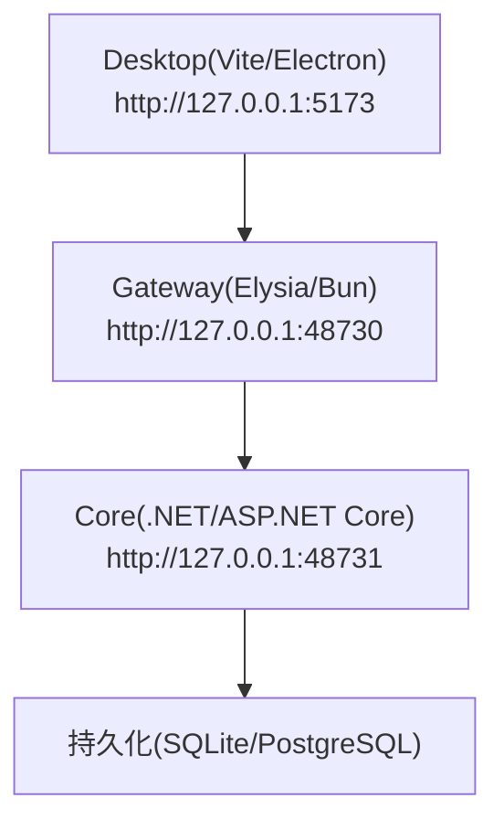
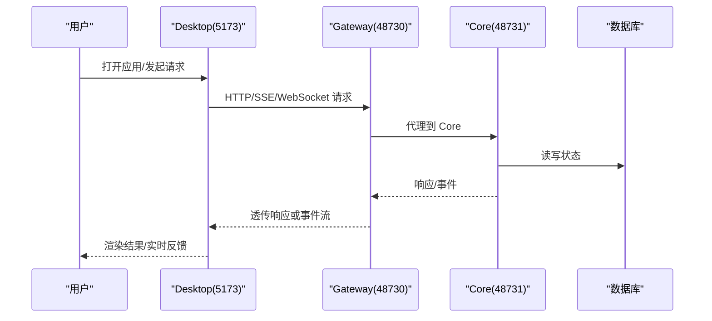
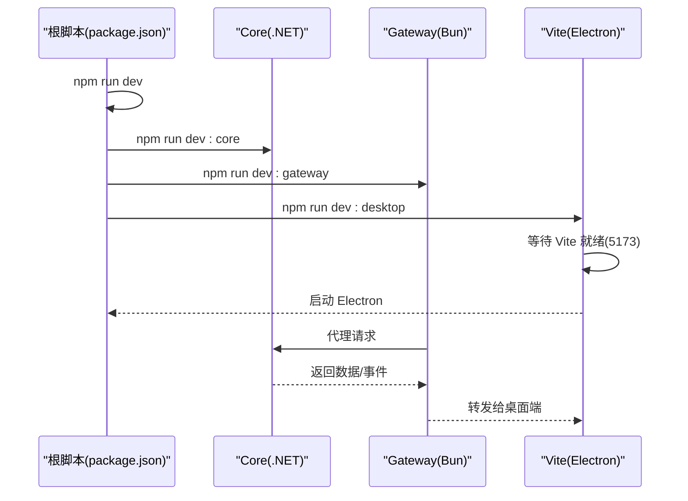
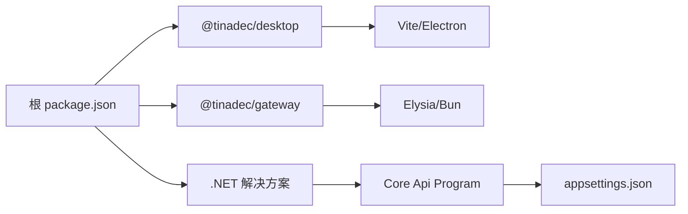

# 快速开始

<cite>
**本文引用的文件**   
- [README.md](file://README.md)
- [package.json](file://package.json)
- [apps/desktop/package.json](file://apps/desktop/package.json)
- [TinadecGateway/package.json](file://TinadecGateway/package.json)
- [scripts/setup-dotnet-env.ps1](file://scripts/setup-dotnet-env.ps1)
- [docs/startup.md](file://docs/startup.md)
- [TinadecCore/Api/appsettings.json](file://TinadecCore/Api/appsettings.json)
- [TinadecCore/Api/Program.cs](file://TinadecCore/Api/Program.cs)
- [TinadecGateway/src/config.ts](file://TinadecGateway/src/config.ts)
- [TinadecGateway/src/index.ts](file://TinadecGateway/src/index.ts)
- [apps/desktop/vite.config.ts](file://apps/desktop/vite.config.ts)
- [apps/desktop/scripts/dev.mjs](file://apps/desktop/scripts/dev.mjs)
</cite>

## 目录
1. [简介](#简介)
2. [项目结构](#项目结构)
3. [核心组件](#核心组件)
4. [架构总览](#架构总览)
5. [详细组件分析](#详细组件分析)
6. [依赖分析](#依赖分析)
7. [性能注意事项](#性能注意事项)
8. [故障排除指南](#故障排除指南)
9. [结论](#结论)
10. [附录](#附录)

## 简介
本快速开始指南帮助你在最短时间内完成 TinadecOffice 的环境准备、依赖安装、克隆与启动，并掌握常用命令、端口与服务地址。你将依次启动 Core（状态权威）、Gateway（薄代理/BFF）和 Desktop（Electron + Vite UI），并通过健康检查验证服务可用性。

## 项目结构
- 根工作区通过 npm workspaces 管理前端子包；.NET 解决方案位于 TinadecCore 与根解决方案中。
- 三个主要进程：
  - Desktop（Vite/Electron）：本地开发端口 5173
  - Gateway（Bun/Elysia）：本地默认端口 48730，提供 Swagger 文档于 /docs
  - Core（.NET 10 + ASP.NET Core）：默认端口 48731，唯一状态权威

图表来源 
- [README.md](file://README.md)
- [apps/desktop/vite.config.ts](file://apps/desktop/vite.config.ts)
- [TinadecGateway/src/config.ts](file://TinadecGateway/src/config.ts)
- [TinadecCore/Api/appsettings.json](file://TinadecCore/Api/appsettings.json)

章节来源
- [README.md](file://README.md)
- [package.json](file://package.json)

## 核心组件
- Core：.NET 10 + Microsoft Agent Framework，暴露健康、就绪、清单等 API，负责编排、工具策略、模型路由与持久化。
- Gateway：Elysia + TypeScript，作为薄代理/BFF，统一鉴权、协议转换、流式转发与审批门控。
- Desktop：Electron + Vue 3 + Vite + Tailwind，提供聊天、任务图、审批、可分离面板与 Debug Studio 等界面能力。

章节来源
- [README.md](file://README.md)
- [TinadecCore/Api/Program.cs](file://TinadecCore/Api/Program.cs)
- [TinadecGateway/src/index.ts](file://TinadecGateway/src/index.ts)

## 架构总览
- 设计原则
  - Core 是唯一状态权威；Gateway 与 Desktop 不保存业务状态
  - Desktop 仅调用 Gateway，不直接调用 Core
  - 写操作必须经过审批门
  - API 契约统一 snake_case

图表来源 
- [TinadecGateway/src/index.ts](file://TinadecGateway/src/index.ts)
- [TinadecCore/Api/Program.cs](file://TinadecCore/Api/Program.cs)
- [TinadecCore/Api/appsettings.json](file://TinadecCore/Api/appsettings.json)

## 详细组件分析

### 环境准备
- 必需环境
  - Node.js 与 npm（用于工作区脚本与前端构建）
  - Bun（用于 Gateway 开发与运行）
  - .NET SDK 10（用于 Core 构建与运行）
- 可选环境
  - PostgreSQL（如需使用 PG 存储，需配置连接串）
  - Electron 原生模块重建工具（仅在需要时执行）

章节来源
- [scripts/setup-dotnet-env.ps1](file://scripts/setup-dotnet-env.ps1)
- [TinadecCore/Api/appsettings.json](file://TinadecCore/Api/appsettings.json)

### 依赖安装
- 在仓库根目录执行以下命令安装所有依赖：
  - 安装 Node 依赖并触发 postinstall 钩子
  - 还原 .NET 包（Core 与解决方案）

示例命令
- npm install
- npm run restore:dotnet

章节来源
- [package.json](file://package.json)

### 项目克隆与启动
- 克隆仓库后，进入根目录执行一键启动：
  - npm run dev
- 该命令会并行启动 Core、Gateway 与 Desktop（Vite）。

章节来源
- [README.md](file://README.md)
- [package.json](file://package.json)

### 常用命令与参数
- 全栈开发
  - npm run dev
- 单独启动
  - npm run dev:core（Core 默认 http://127.0.0.1:48731）
  - npm run dev:gateway（Gateway 默认 http://127.0.0.1:48730）
  - npm run dev:desktop（Desktop/Vite 默认 http://127.0.0.1:5173）
- 构建与测试
  - npm run build
  - npm test
- .NET 子方案
  - dotnet restore/build/test（通过 setup-dotnet-env.ps1 包装）

章节来源
- [package.json](file://package.json)
- [docs/startup.md](file://docs/startup.md)

### 端口说明与服务地址
- Desktop（Vite）：http://127.0.0.1:5173
- Gateway API/Docs：http://127.0.0.1:48730/docs
- Core：http://127.0.0.1:48731

章节来源
- [README.md](file://README.md)
- [apps/desktop/vite.config.ts](file://apps/desktop/vite.config.ts)
- [TinadecGateway/src/config.ts](file://TinadecGateway/src/config.ts)

### 基本操作与验证
- 健康检查
  - Core：GET /api/v1/health
  - Gateway：GET /api/v1/health
- 查看内置智能体（经 Gateway）
  - GET /api/v1/agents

章节来源
- [docs/startup.md](file://docs/startup.md)
- [TinadecCore/Api/Program.cs](file://TinadecCore/Api/Program.cs)
- [TinadecGateway/src/index.ts](file://TinadecGateway/src/index.ts)

### 启动流程时序

图表来源 
- [package.json](file://package.json)
- [apps/desktop/scripts/dev.mjs](file://apps/desktop/scripts/dev.mjs)
- [TinadecGateway/src/index.ts](file://TinadecGateway/src/index.ts)

## 依赖分析
- 工作区依赖
  - 根 package.json 定义 scripts 与工作区，协调 Core/Gateway/Desktop 的启动与构建
  - Desktop 子包包含 Vite/Electron 相关依赖与脚本
  - Gateway 子包基于 Elysia，使用 Bun 运行
  - Core 通过 .NET 解决方案组织，使用 appsettings.json 配置持久化与身份

图表来源 
- [package.json](file://package.json)
- [apps/desktop/package.json](file://apps/desktop/package.json)
- [TinadecGateway/package.json](file://TinadecGateway/package.json)
- [TinadecCore/Api/Program.cs](file://TinadecCore/Api/Program.cs)
- [TinadecCore/Api/appsettings.json](file://TinadecCore/Api/appsettings.json)

章节来源
- [package.json](file://package.json)
- [apps/desktop/package.json](file://apps/desktop/package.json)
- [TinadecGateway/package.json](file://TinadecGateway/package.json)
- [TinadecCore/Api/appsettings.json](file://TinadecCore/Api/appsettings.json)

## 性能注意事项
- 开发阶段建议保持单实例 Gateway 与 Core，避免端口冲突
- SQLite 默认本地文件路径由配置控制，适合本地调试；生产建议使用 PostgreSQL
- 流式接口（SSE/WebSocket）由 Gateway 转发至 Core，注意超时与缓冲设置

[本节为通用指导，无需特定文件引用]

## 故障排除指南
- 常见问题定位
  - 端口占用：确认 5173、48730、48731 未被占用
  - Core 未就绪：访问 /api/v1/health 与 /api/v1/readiness 检查状态
  - Gateway 无法代理：检查 TINADEC_CORE_URL 与网络连通性
  - 设置页无智能体：刷新页面并确保 Core/Gateway 均健康
- .NET 环境问题
  - 清理环境变量 Version 与 Ice-Version 后再运行 dotnet
  - 若输出被锁定，停止旧进程或更改输出目录
- 前端问题
  - Vite 启动失败：检查 node_modules 与缓存，必要时重新安装
  - Electron 无法连接 Vite：确保 VITE_DEV_SERVER_URL 指向 5173

章节来源
- [docs/startup.md](file://docs/startup.md)
- [scripts/setup-dotnet-env.ps1](file://scripts/setup-dotnet-env.ps1)
- [apps/desktop/scripts/dev.mjs](file://apps/desktop/scripts/dev.mjs)

## 结论
通过本指南，你已了解 TinadecOffice 的整体架构、启动流程与常用命令。建议在本地先以 SQLite 模式快速验证功能，再按需切换至 PostgreSQL 进行更贴近生产的调试。如遇问题，优先检查端口、健康检查与环境变量。

[本节为总结性内容，无需特定文件引用]

## 附录

### 环境变量与配置要点
- Gateway 配置（本地/云端模式）
  - 模式：TINADEC_GATEWAY_MODE（local/cloud）
  - 端口：TINADEC_GATEWAY_PORT（默认 48730）
  - Core URL：TINADEC_CORE_URL（默认 http://127.0.0.1:48731）
  - Tool Runtime URL：TINADEC_TOOL_RUNTIME_URL（默认 http://127.0.0.1:48732）
  - 认证：TINADEC_GATEWAY_AUTH_REQUIRED、TINADEC_GATEWAY_JWT_SECRET、TINADEC_GATEWAY_API_KEY
  - CORS：TINADEC_GATEWAY_CORS_ORIGINS
  - 超时：TINADEC_GATEWAY_TIMEOUT_MS
- Core 持久化
  - Provider：Sqlite（默认）或 PostgreSql
  - SQLite 路径：data/tinadec.db
  - PostgreSQL 连接串名称：TinadecCore

章节来源
- [TinadecGateway/src/config.ts](file://TinadecGateway/src/config.ts)
- [TinadecCore/Api/appsettings.json](file://TinadecCore/Api/appsettings.json)

### 快速验证命令
- 检查端口监听
  - Windows PowerShell：Get-NetTCPConnection -LocalPort 48731,48730
- 健康检查
  - Core：Invoke-RestMethod http://127.0.0.1:48731/api/v1/health
  - Gateway：Invoke-RestMethod http://127.0.0.1:48730/api/v1/health
- 获取内置智能体列表
  - Invoke-RestMethod http://127.0.0.1:48730/api/v1/agents

章节来源
- [docs/startup.md](file://docs/startup.md)