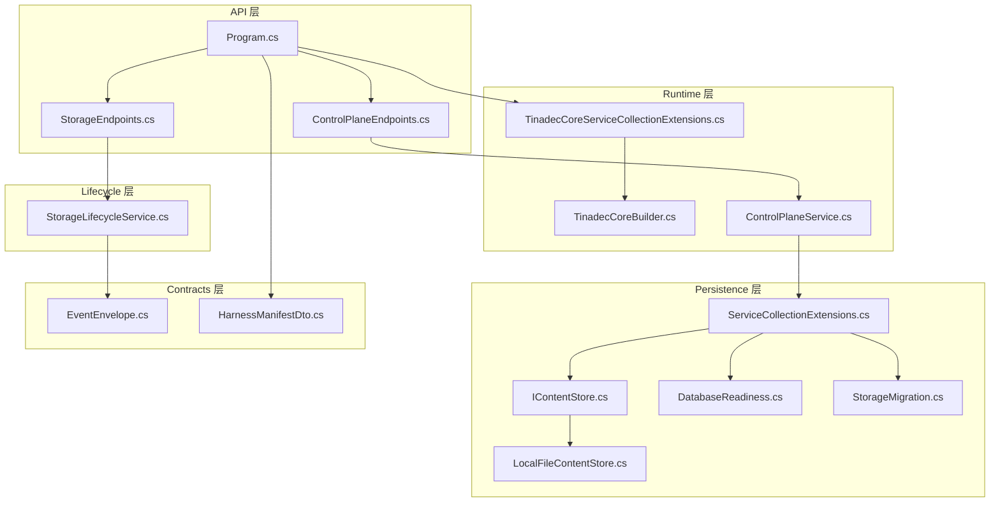
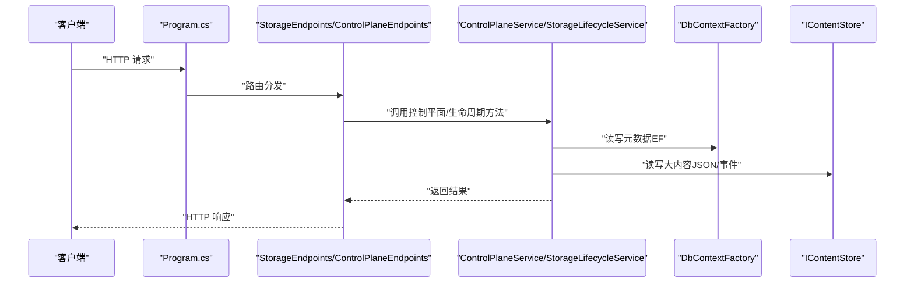
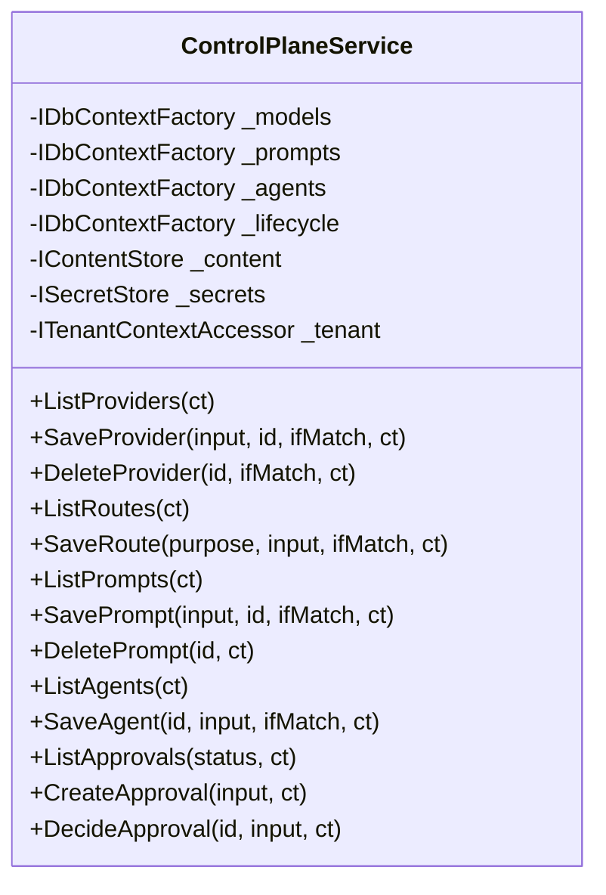
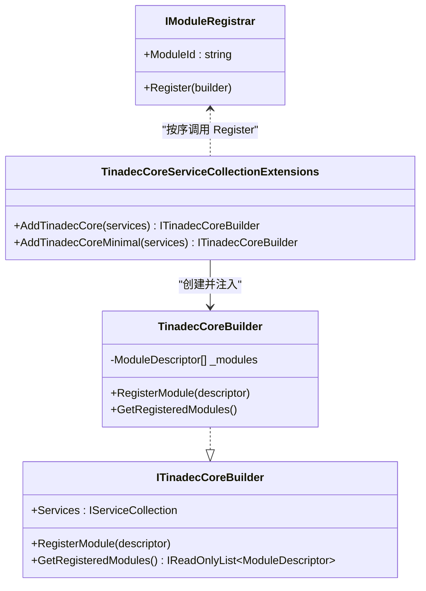
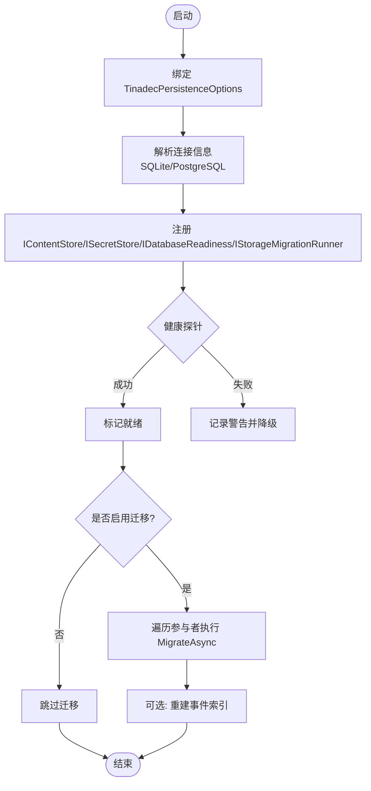
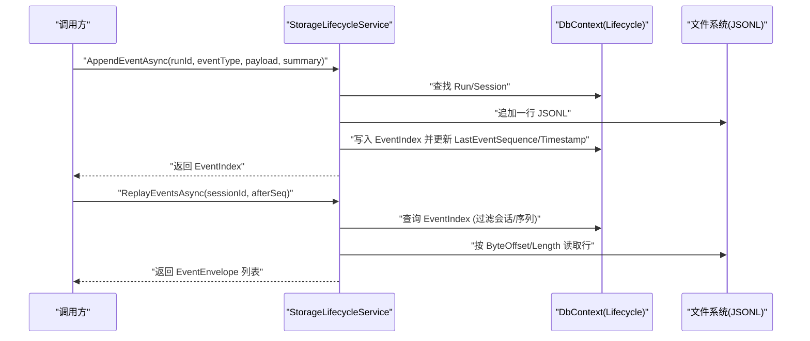
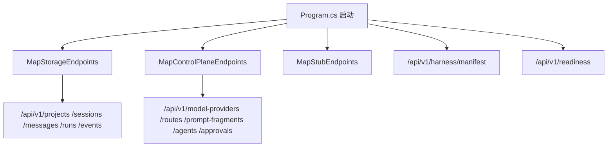
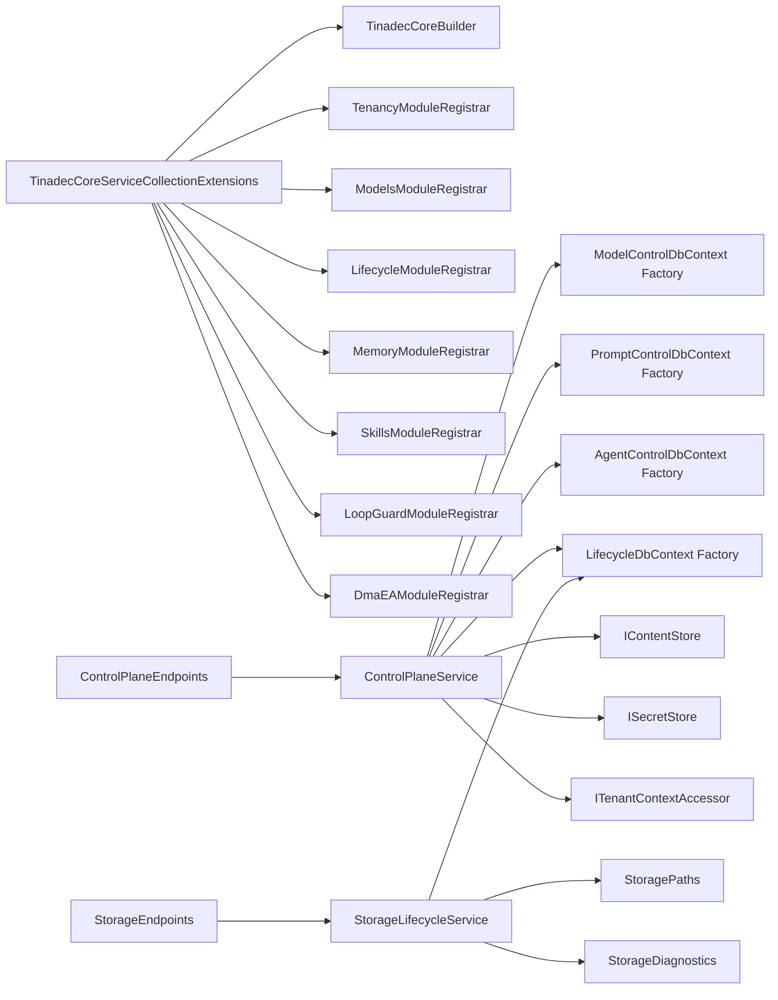

# Core 核心层

<cite>
**本文引用的文件**   
- [Program.cs](file://TinadecCore\Api\Program.cs)
- [StorageEndpoints.cs](file://TinadecCore\Api\Endpoints\StorageEndpoints.cs)
- [ControlPlaneEndpoints.cs](file://TinadecCore\Api\Endpoints\ControlPlaneEndpoints.cs)
- [ControlPlaneService.cs](file://TinadecCore\Runtime\ControlPlaneService.cs)
- [TinadecCoreBuilder.cs](file://TinadecCore\Runtime\TinadecCoreBuilder.cs)
- [TinadecCoreServiceCollectionExtensions.cs](file://TinadecCore\Runtime\TinadecCoreServiceCollectionExtensions.cs)
- [IModuleRegistrar.cs](file://TinadecCore\Abstractions\IModuleRegistrar.cs)
- [ServiceCollectionExtensions.cs](file://TinadecCore\Persistence\ServiceCollectionExtensions.cs)
- [IContentStore.cs](file://TinadecCore\Persistence\IContentStore.cs)
- [LocalFileContentStore.cs](file://TinadecCore\Persistence\LocalFileContentStore.cs)
- [DatabaseReadiness.cs](file://TinadecCore\Persistence\DatabaseReadiness.cs)
- [StorageMigration.cs](file://TinadecCore\Persistence\StorageMigration.cs)
- [EventEnvelope.cs](file://TinadecCore\Contracts\Events\EventEnvelope.cs)
- [HarnessManifestDto.cs](file://TinadecCore\Contracts\Dtos\HarnessManifestDto.cs)
- [StorageLifecycleService.cs](file://TinadecCore\Lifecycle\StorageLifecycleService.cs)
</cite>

## 目录
1. [简介](#简介)
2. [项目结构](#项目结构)
3. [核心组件](#核心组件)
4. [架构总览](#架构总览)
5. [详细组件分析](#详细组件分析)
6. [依赖关系分析](#依赖关系分析)
7. [性能考量](#性能考量)
8. [故障排查指南](#故障排查指南)
9. [结论](#结论)
10. [附录](#附录)

## 简介
本文件面向初学者与有经验的开发者，系统性阐述 TinadecOffice 的 Core 核心层设计。该核心层基于 .NET 与 Microsoft Agent Framework（MAF），采用“唯一状态权威”的设计理念：所有会话、运行、任务、审批、事件与追踪等关键状态均由 Core 统一维护；Gateway 仅作为薄代理；桌面端为纯展示层。核心层通过控制平面服务暴露模型提供者、路由、提示词片段、Agent 配置与审批等管理能力；通过运行时管理器与模块注册机制实现可插拔的业务能力；通过数据库抽象层、持久化策略与安全机制提供稳定可靠的存储与访问能力；并通过事件驱动架构记录与回放系统行为。

## 项目结构
Core 核心层以模块化方式组织，API 层负责 HTTP 端点，Runtime 层负责运行时装配与控制平面服务，Persistence 层提供数据库抽象、内容存储、迁移与健康检查，Contracts 定义跨进程边界的数据契约（如事件信封、清单 DTO）。

图表来源
- [Program.cs:1-181](file://TinadecCore\Api\Program.cs#L1-L181)
- [StorageEndpoints.cs:1-101](file://TinadecCore\Api\Endpoints\StorageEndpoints.cs#L1-L101)
- [ControlPlaneEndpoints.cs:1-46](file://TinadecCore\Api\Endpoints\ControlPlaneEndpoints.cs#L1-L46)
- [TinadecCoreBuilder.cs:1-31](file://TinadecCore\Runtime\TinadecCoreBuilder.cs#L1-L31)
- [TinadecCoreServiceCollectionExtensions.cs:1-61](file://TinadecCore\Runtime\TinadecCoreServiceCollectionExtensions.cs#L1-L61)
- [ControlPlaneService.cs:1-71](file://TinadecCore\Runtime\ControlPlaneService.cs#L1-L71)
- [ServiceCollectionExtensions.cs:1-122](file://TinadecCore\Persistence\ServiceCollectionExtensions.cs#L1-L122)
- [IContentStore.cs:1-20](file://TinadecCore\Persistence\IContentStore.cs#L1-L20)
- [LocalFileContentStore.cs:1-68](file://TinadecCore\Persistence\LocalFileContentStore.cs#L1-L68)
- [DatabaseReadiness.cs:1-123](file://TinadecCore\Persistence\DatabaseReadiness.cs#L1-L123)
- [StorageMigration.cs:1-41](file://TinadecCore\Persistence\StorageMigration.cs#L1-L41)
- [EventEnvelope.cs:1-33](file://TinadecCore\Contracts\Events\EventEnvelope.cs#L1-L33)
- [HarnessManifestDto.cs:1-53](file://TinadecCore\Contracts\Dtos\HarnessManifestDto.cs#L1-L53)
- [StorageLifecycleService.cs:1-291](file://TinadecCore\Lifecycle\StorageLifecycleService.cs#L1-L291)

章节来源
- [Program.cs:1-181](file://TinadecCore\Api\Program.cs#L1-L181)
- [TinadecCoreServiceCollectionExtensions.cs:1-61](file://TinadecCore\Runtime\TinadecCoreServiceCollectionExtensions.cs#L1-L61)

## 核心组件
- 控制平面服务：集中管理模型提供者、路由、提示词片段、Agent 配置与审批请求，提供版本化与一致性保障（If-Match/Revision）。
- 运行时管理器与模块注册：通过 ITinadecCoreBuilder 收集模块描述符，按依赖顺序注册各业务模块，支持全量与最小集装配。
- 数据库抽象层与持久化策略：统一的连接信息解析、EF 配置器、健康探针、内容存储（本地文件）与向量数据库接口、密钥存储（平台安全或环境变量）。
- 事件驱动架构：事件追加到 JSONL 文件，索引写入数据库，支持按会话重放与增量回放。
- 生命周期与运行管理：启动/完成运行、事件追加、快照与恢复、迁移参与者协调。

章节来源
- [ControlPlaneService.cs:1-71](file://TinadecCore\Runtime\ControlPlaneService.cs#L1-L71)
- [TinadecCoreBuilder.cs:1-31](file://TinadecCore\Runtime\TinadecCoreBuilder.cs#L1-L31)
- [TinadecCoreServiceCollectionExtensions.cs:1-61](file://TinadecCore\Runtime\TinadecCoreServiceCollectionExtensions.cs#L1-L61)
- [ServiceCollectionExtensions.cs:1-122](file://TinadecCore\Persistence\ServiceCollectionExtensions.cs#L1-L122)
- [StorageLifecycleService.cs:1-291](file://TinadecCore\Lifecycle\StorageLifecycleService.cs#L1-L291)

## 架构总览
Core 核心层遵循“单一状态权威”原则，API 层仅做路由与参数校验，业务逻辑由 ControlPlaneService 与 StorageLifecycleService 等承载，数据持久化通过 EF + 文件存储组合实现，健康检查与迁移在启动阶段执行。

图表来源
- [Program.cs:1-181](file://TinadecCore\Api\Program.cs#L1-L181)
- [StorageEndpoints.cs:1-101](file://TinadecCore\Api\Endpoints\StorageEndpoints.cs#L1-L101)
- [ControlPlaneEndpoints.cs:1-46](file://TinadecCore\Api\Endpoints\ControlPlaneEndpoints.cs#L1-L46)
- [ControlPlaneService.cs:1-71](file://TinadecCore\Runtime\ControlPlaneService.cs#L1-L71)
- [StorageLifecycleService.cs:1-291](file://TinadecCore\Lifecycle\StorageLifecycleService.cs#L1-L291)
- [ServiceCollectionExtensions.cs:1-122](file://TinadecCore\Persistence\ServiceCollectionExtensions.cs#L1-L122)

## 详细组件分析

### 控制平面服务（ControlPlaneService）
- 职责：提供模型提供者、路由、提示词片段、Agent 配置与审批的 CRUD 能力，保证版本一致性与权限隔离（租户/工作区）。
- 关键点：
  - 使用 If-Match 头与 Revision 字段实现乐观并发控制。
  - 将大对象（配置、提示词、Agent 配置）通过 IContentStore 持久化，数据库仅保留引用与哈希。
  - 通过 IDbContextFactory 获取 DbContext 实例，避免长生命周期上下文。
  - 审批流程支持创建、查询与决策，限制过期与状态机约束。

图表来源
- [ControlPlaneService.cs:1-71](file://TinadecCore\Runtime\ControlPlaneService.cs#L1-L71)

章节来源
- [ControlPlaneService.cs:1-71](file://TinadecCore\Runtime\ControlPlaneService.cs#L1-L71)

### 运行时管理与模块注册（TinadecCoreBuilder / Extensions）
- 职责：构建 DI 容器并收集模块描述符，按依赖顺序注册模块，支持全量与最小集装配。
- 关键点：
  - ITinadecCoreBuilder 聚合 IServiceCollection 与 ModuleDescriptor 列表。
  - AddTinadecCore/AddTinadecCoreMinimal 明确列出模块注册顺序，便于裁剪与调试。
  - IModuleRegistrar 强制显式注册，避免反射扫描带来的不确定性与性能问题。

图表来源
- [TinadecCoreBuilder.cs:1-31](file://TinadecCore\Runtime\TinadecCoreBuilder.cs#L1-L31)
- [TinadecCoreServiceCollectionExtensions.cs:1-61](file://TinadecCore\Runtime\TinadecCoreServiceCollectionExtensions.cs#L1-L61)
- [IModuleRegistrar.cs:1-17](file://TinadecCore\Abstractions\IModuleRegistrar.cs#L1-L17)

章节来源
- [TinadecCoreBuilder.cs:1-31](file://TinadecCore\Runtime\TinadecCoreBuilder.cs#L1-L31)
- [TinadecCoreServiceCollectionExtensions.cs:1-61](file://TinadecCore\Runtime\TinadecCoreServiceCollectionExtensions.cs#L1-L61)
- [IModuleRegistrar.cs:1-17](file://TinadecCore\Abstractions\IModuleRegistrar.cs#L1-L17)

### 数据库抽象层与持久化策略（Persistence）
- 职责：统一连接信息解析、EF 配置、健康探针、内容存储、密钥存储与迁移编排。
- 关键点：
  - AddTinadecPersistence 绑定配置、注册 IDatabaseConnectionInfo、ITinadecDatabaseConfigurer、IDatabaseReadiness、IContentStore、IProjectVectorDatabase、ISecretStore、IStorageMigrationRunner。
  - UseTinadecDatabase 扩展用于模块 DbContext 的统一配置。
  - LocalFileContentStore 实现不可变内容存储，计算 SHA256 并原子移动临时文件。
  - DatabaseReadiness 对 SQLite/PostgreSQL 进行 SELECT 1 探测，支持超时与诊断。
  - StorageMigrationRunner 协调各模块的 MigrateAsync，支持条件启用与 PostgreSQL 启动迁移开关。

图表来源
- [ServiceCollectionExtensions.cs:1-122](file://TinadecCore\Persistence\ServiceCollectionExtensions.cs#L1-L122)
- [DatabaseReadiness.cs:1-123](file://TinadecCore\Persistence\DatabaseReadiness.cs#L1-L123)
- [StorageMigration.cs:1-41](file://TinadecCore\Persistence\StorageMigration.cs#L1-L41)
- [LocalFileContentStore.cs:1-68](file://TinadecCore\Persistence\LocalFileContentStore.cs#L1-L68)

章节来源
- [ServiceCollectionExtensions.cs:1-122](file://TinadecCore\Persistence\ServiceCollectionExtensions.cs#L1-L122)
- [DatabaseReadiness.cs:1-123](file://TinadecCore\Persistence\DatabaseReadiness.cs#L1-L123)
- [StorageMigration.cs:1-41](file://TinadecCore\Persistence\StorageMigration.cs#L1-L41)
- [LocalFileContentStore.cs:1-68](file://TinadecCore\Persistence\LocalFileContentStore.cs#L1-L68)

### 事件驱动架构（Event Envelope + Lifecycle）
- 职责：以事件追加模式记录运行期行为，提供按会话重放与增量回放能力。
- 关键点：
  - EventEnvelope 定义版本化事件信封，API 边界使用 snake_case。
  - StorageLifecycleService.AppendEventAsync 对每个 run 加锁，确保顺序与幂等；事件体写入 JSONL，索引写入数据库。
  - ReplayEventsAsync 根据索引读取对应行，组装 EventEnvelope 序列。
  - ReconcileAsync 扫描现有 JSONL 重建缺失索引，容忍不完整尾行与畸形记录。

图表来源
- [EventEnvelope.cs:1-33](file://TinadecCore\Contracts\Events\EventEnvelope.cs#L1-L33)
- [StorageLifecycleService.cs:1-291](file://TinadecCore\Lifecycle\StorageLifecycleService.cs#L1-L291)

章节来源
- [EventEnvelope.cs:1-33](file://TinadecCore\Contracts\Events\EventEnvelope.cs#L1-L33)
- [StorageLifecycleService.cs:1-291](file://TinadecCore\Lifecycle\StorageLifecycleService.cs#L1-L291)

### API 端点与清单/就绪性
- 清单端点：/api/v1/harness/manifest 返回框架信息与已注册模块清单，体现“core-authoritative”所有权模型与 MAF 基础能力。
- 就绪性端点：/api/v1/readiness 综合模块配置状态与数据库健康探针结果，输出 ready/warning 状态。
- 存储端点：项目、会话、消息、运行与事件流（SSE）等。
- 控制平面端点：模型提供者、路由、提示词片段、Agent 配置与审批。

图表来源
- [Program.cs:1-181](file://TinadecCore\Api\Program.cs#L1-L181)
- [StorageEndpoints.cs:1-101](file://TinadecCore\Api\Endpoints\StorageEndpoints.cs#L1-L101)
- [ControlPlaneEndpoints.cs:1-46](file://TinadecCore\Api\Endpoints\ControlPlaneEndpoints.cs#L1-L46)
- [HarnessManifestDto.cs:1-53](file://TinadecCore\Contracts\Dtos\HarnessManifestDto.cs#L1-L53)

章节来源
- [Program.cs:1-181](file://TinadecCore\Api\Program.cs#L1-L181)
- [StorageEndpoints.cs:1-101](file://TinadecCore\Api\Endpoints\StorageEndpoints.cs#L1-L101)
- [ControlPlaneEndpoints.cs:1-46](file://TinadecCore\Api\Endpoints\ControlPlaneEndpoints.cs#L1-L46)
- [HarnessManifestDto.cs:1-53](file://TinadecCore\Contracts\Dtos\HarnessManifestDto.cs#L1-L53)

## 依赖关系分析
- 模块装配：TinadecCoreServiceCollectionExtensions 按依赖顺序调用各模块的 IModuleRegistrar.Register，确保 Tenancy、Models、Lifecycle、Memory、Skills、LoopGuard、DmaEA 等正确初始化。
- 控制平面：ControlPlaneEndpoints 依赖 ControlPlaneService，后者依赖多个 IDbContextFactory 与 IContentStore/ISecretStore/ITenantContextAccessor。
- 存储与迁移：StorageEndpoints 依赖 ProjectSessionStore 与 StorageLifecycleService；迁移由 StorageMigrationRunner 协调各参与者。

图表来源
- [TinadecCoreServiceCollectionExtensions.cs:1-61](file://TinadecCore\Runtime\TinadecCoreServiceCollectionExtensions.cs#L1-L61)
- [ControlPlaneEndpoints.cs:1-46](file://TinadecCore\Api\Endpoints\ControlPlaneEndpoints.cs#L1-L46)
- [StorageEndpoints.cs:1-101](file://TinadecCore\Api\Endpoints\StorageEndpoints.cs#L1-L101)
- [ControlPlaneService.cs:1-71](file://TinadecCore\Runtime\ControlPlaneService.cs#L1-L71)
- [StorageLifecycleService.cs:1-291](file://TinadecCore\Lifecycle\StorageLifecycleService.cs#L1-L291)

章节来源
- [TinadecCoreServiceCollectionExtensions.cs:1-61](file://TinadecCore\Runtime\TinadecCoreServiceCollectionExtensions.cs#L1-L61)
- [ControlPlaneService.cs:1-71](file://TinadecCore\Runtime\ControlPlaneService.cs#L1-L71)
- [StorageLifecycleService.cs:1-291](file://TinadecCore\Lifecycle\StorageLifecycleService.cs#L1-L291)

## 性能考量
- 事件追加：对每个 run 使用信号量串行写入，避免竞争；JSONL 追加写盘后刷新，确保持久化。
- 内容存储：LocalFileContentStore 使用流式写入与增量哈希，减少内存占用；原子替换临时文件提升可靠性。
- 数据库健康探针：针对 SQLite/PostgreSQL 分别优化连接与命令超时，避免启动阻塞。
- 模块装配：显式注册避免反射扫描，降低启动开销与不确定性。
- 建议：
  - 高并发场景下评估事件写入吞吐，必要时引入批处理或异步队列。
  - 大内容存储考虑分布式对象存储后端替换 IContentStore。
  - 数据库连接池与 EF 查询按需使用 AsNoTracking 减少跟踪开销。

[本节为通用指导，不直接分析具体文件]

## 故障排查指南
- 数据库不可用：
  - 检查 TinadecPersistenceOptions.Enabled 与 Provider 配置；查看 DatabaseReadiness.ProbeAsync 的诊断信息。
  - 确认 SQLite 文件路径存在且可写；PostgreSQL 连接字符串有效。
- 迁移未执行：
  - 确认 StorageMigrationRunner 的条件（Provider=Sqlite 或 ApplyMigrationsOnStartup=true for Postgres）。
  - 检查各模块是否实现 IStorageMigrationParticipant 并在启动时调用。
- 事件回放异常：
  - 检查 JSONL 文件完整性与索引一致性；必要时运行 ReconcileAsync 重建索引。
  - 关注日志中的畸形记录与不完整尾行提示。
- 控制平面并发冲突：
  - 若出现 412 状态码，检查 If-Match 头与 Revision 值是否匹配。
  - 内置资源（提示词片段/Agent）只读保护会返回冲突。

章节来源
- [DatabaseReadiness.cs:1-123](file://TinadecCore\Persistence\DatabaseReadiness.cs#L1-L123)
- [StorageMigration.cs:1-41](file://TinadecCore\Persistence\StorageMigration.cs#L1-L41)
- [StorageLifecycleService.cs:1-291](file://TinadecCore\Lifecycle\StorageLifecycleService.cs#L1-L291)
- [ControlPlaneService.cs:1-71](file://TinadecCore\Runtime\ControlPlaneService.cs#L1-L71)

## 结论
Core 核心层通过“唯一状态权威”的设计，结合 MAF 的基础能力，构建了可扩展、可观测、可治理的 Agent 运行时。控制平面服务提供稳定的管理能力，持久化层提供可靠的数据与内容存储，事件驱动架构确保可追溯与可回放。模块注册机制使系统具备高度的可插拔性与裁剪能力，适合在不同部署环境中灵活装配。

[本节为总结性内容，不直接分析具体文件]

## 附录
- .NET 与 MAF 概念简介：
  - .NET：现代跨平台应用框架，提供 DI、配置、Web 服务器、EF Core 等基础设施。
  - MAF（Microsoft Agent Framework）：提供 agent、workflow、context、memory、skills、loop、approval、session、checkpoint 等原语，支撑多智能体编排与协作。
- 扩展点说明：
  - 新增模块：实现 IModuleRegistrar，在 AddTinadecCore 中按依赖顺序注册。
  - 自定义内容存储：实现 IContentStore，替换默认 LocalFileContentStore。
  - 自定义密钥存储：实现 ISecretStore，适配平台安全特性。
  - 自定义迁移参与者：实现 IStorageMigrationParticipant，参与启动迁移流程。

[本节为概念性内容，不直接分析具体文件]