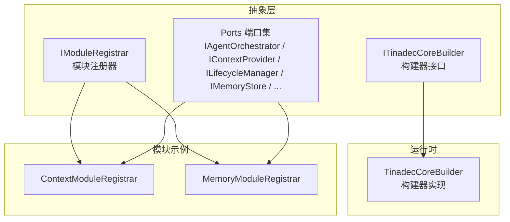
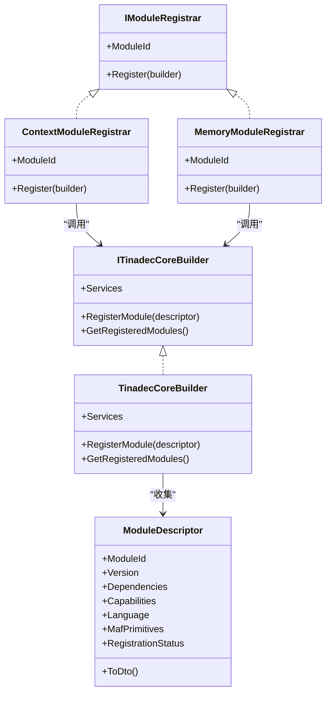
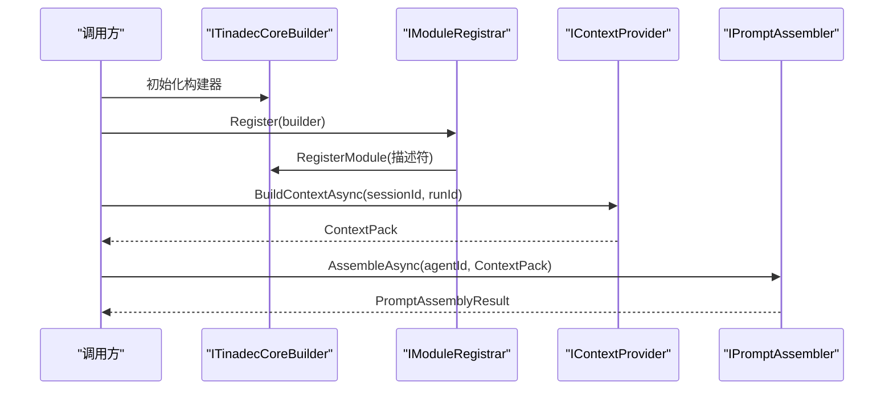
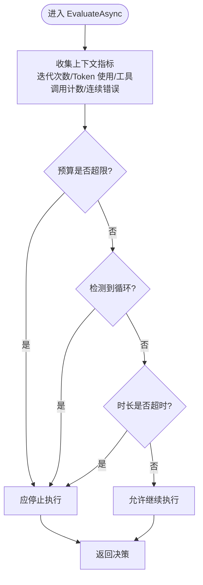
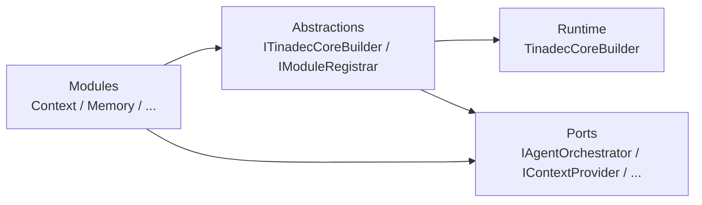

# 抽象层与接口

<cite>
**本文引用的文件**   
- [ITinadecCoreBuilder.cs](file://TinadecCore/Abstractions/ITinadecCoreBuilder.cs)
- [IModuleRegistrar.cs](file://TinadecCore/Abstractions/IModuleRegistrar.cs)
- [IAgentOrchestrator.cs](file://TinadecCore/Abstractions/Ports/IAgentOrchestrator.cs)
- [IContextProvider.cs](file://TinadecCore/Abstractions/Ports/IContextProvider.cs)
- [ILifecycleManager.cs](file://TinadecCore/Abstractions/Ports/ILifecycleManager.cs)
- [IMemoryStore.cs](file://TinadecCore/Abstractions/Ports/IMemoryStore.cs)
- [IPromptAssembler.cs](file://TinadecCore/Abstractions/Ports/IPromptAssembler.cs)
- [ISessionLocator.cs](file://TinadecCore/Abstractions/Ports/ISessionLocator.cs)
- [ISkillProvider.cs](file://TinadecCore/Abstractions/Ports/ISkillProvider.cs)
- [ITenantContextAccessor.cs](file://TinadecCore/Abstractions/Ports/ITenantContextAccessor.cs)
- [IVectorStore.cs](file://TinadecCore/Abstractions/Ports/IVectorStore.cs)
- [IModelProvider.cs](file://TinadecCore/Abstractions/Ports/IModelProvider.cs)
- [ILoopGuard.cs](file://TinadecCore/Abstractions/Ports/ILoopGuard.cs)
- [ContextModuleRegistrar.cs](file://TinadecCore/Context/ContextModuleRegistrar.cs)
- [MemoryModuleRegistrar.cs](file://TinadecCore/Memory/MemoryModuleRegistrar.cs)
- [TinadecCoreBuilder.cs](file://TinadecCore/Runtime/TinadecCoreBuilder.cs)
</cite>

## 目录
1. [简介](#简介)
2. [项目结构](#项目结构)
3. [核心组件](#核心组件)
4. [架构总览](#架构总览)
5. [详细组件分析](#详细组件分析)
6. [依赖分析](#依赖分析)
7. [性能考虑](#性能考虑)
8. [故障排查指南](#故障排查指南)
9. [结论](#结论)
10. [附录](#附录)

## 简介
本章节聚焦 Core 核心层的抽象层设计，围绕构建器接口 ITinadecCoreBuilder、模块注册器 IModuleRegistrar 以及 Ports 目录下的核心端口（如 IAgentOrchestrator、IContextProvider、ILifecycleManager、IMemoryStore 等）进行系统化说明。文档从接口设计理念、依赖倒置模式实现、扩展点定义入手，结合具体使用示例与实现指南，帮助开发者理解如何扩展现有能力或新增模块。

## 项目结构
Core 抽象层位于 TinadecCore/Abstractions，包含：
- 构建器与模块注册：ITinadecCoreBuilder、IModuleRegistrar
- 运行时构建器实现：TinadecCoreBuilder
- 端口（Ports）：面向外部能力与跨模块边界的契约集合
- 模块示例：Context 与 Memory 模块的注册器，展示插件化装配方式

图表来源
- [ITinadecCoreBuilder.cs:1-52](file://TinadecCore/Abstractions/ITinadecCoreBuilder.cs#L1-L52)
- [IModuleRegistrar.cs:1-17](file://TinadecCore/Abstractions/IModuleRegistrar.cs#L1-L17)
- [TinadecCoreBuilder.cs:1-31](file://TinadecCore/Runtime/TinadecCoreBuilder.cs#L1-L31)
- [ContextModuleRegistrar.cs:1-52](file://TinadecCore/Context/ContextModuleRegistrar.cs#L1-L52)
- [MemoryModuleRegistrar.cs:1-58](file://TinadecCore/Memory/MemoryModuleRegistrar.cs#L1-L58)

章节来源
- [ITinadecCoreBuilder.cs:1-52](file://TinadecCore/Abstractions/ITinadecCoreBuilder.cs#L1-L52)
- [IModuleRegistrar.cs:1-17](file://TinadecCore/Abstractions/IModuleRegistrar.cs#L1-L17)
- [TinadecCoreBuilder.cs:1-31](file://TinadecCore/Runtime/TinadecCoreBuilder.cs#L1-L31)

## 核心组件
本节概述抽象层的关键构件及其职责边界：
- ITinadecCoreBuilder：用于将各模块以声明式方式组合进 DI 容器，并维护模块描述符清单，便于编排与可视化。
- IModuleRegistrar：每个业务模块通过实现该接口显式注册服务与模块描述符，避免反射扫描，保证可追踪性与确定性。
- Ports 端口：定义跨模块与外部能力的稳定契约，遵循依赖倒置原则，使核心层不依赖具体实现。

章节来源
- [ITinadecCoreBuilder.cs:1-52](file://TinadecCore/Abstractions/ITinadecCoreBuilder.cs#L1-L52)
- [IModuleRegistrar.cs:1-17](file://TinadecCore/Abstractions/IModuleRegistrar.cs#L1-L17)

## 架构总览
下图展示了构建器、模块注册器与端口之间的协作关系，体现“以接口为中心”的插件化架构。

图表来源
- [ITinadecCoreBuilder.cs:1-52](file://TinadecCore/Abstractions/ITinadecCoreBuilder.cs#L1-L52)
- [IModuleRegistrar.cs:1-17](file://TinadecCore/Abstractions/IModuleRegistrar.cs#L1-L17)
- [TinadecCoreBuilder.cs:1-31](file://TinadecCore/Runtime/TinadecCoreBuilder.cs#L1-L31)
- [ContextModuleRegistrar.cs:1-52](file://TinadecCore/Context/ContextModuleRegistrar.cs#L1-L52)
- [MemoryModuleRegistrar.cs:1-58](file://TinadecCore/Memory/MemoryModuleRegistrar.cs#L1-L58)

## 详细组件分析

### 构建器接口与实现：ITinadecCoreBuilder 与 TinadecCoreBuilder
- 设计理念
  - 以“构建器+描述符”的方式组织模块装配，避免隐式发现带来的不确定性。
  - 提供统一的 IServiceCollection 入口，让模块在 Register 中完成服务注册。
  - 通过 ModuleDescriptor 暴露模块元数据，支撑运行期清单与诊断。
- 关键职责
  - 聚合模块描述符，支持查询已注册模块。
  - 将自身注入 DI，供端点等上层组件获取模块清单。
- 扩展点
  - 新增模块只需实现 IModuleRegistrar，并在应用启动时调用 builder.RegisterModule(...)。

章节来源
- [ITinadecCoreBuilder.cs:1-52](file://TinadecCore/Abstractions/ITinadecCoreBuilder.cs#L1-L52)
- [TinadecCoreBuilder.cs:1-31](file://TinadecCore/Runtime/TinadecCoreBuilder.cs#L1-L31)

### 模块注册器：IModuleRegistrar 插件化架构
- 设计理念
  - 显式注册、无反射扫描，确保依赖关系清晰、可测试、可审计。
  - 每个模块自描述（ModuleId、版本、依赖、能力），便于编排与治理。
- 典型用法
  - 在 Register 中将端口实现注册到 DI，并调用 builder.RegisterModule(...) 登记模块描述符。
  - 示例：Context 模块注册 IContextProvider；Memory 模块注册 ISessionLocator 与 IMemoryStore。

章节来源
- [IModuleRegistrar.cs:1-17](file://TinadecCore/Abstractions/IModuleRegistrar.cs#L1-L17)
- [ContextModuleRegistrar.cs:1-52](file://TinadecCore/Context/ContextModuleRegistrar.cs#L1-L52)
- [MemoryModuleRegistrar.cs:1-58](file://TinadecCore/Memory/MemoryModuleRegistrar.cs#L1-L58)

### 端口：IAgentOrchestrator（Agent 编排器）
- 职责
  - 提供双层级 Agent 编排：规划层（主动计划与监督）与执行层（被动任务执行）。
  - 负责动态创建、任务分发、协作调度与结果聚合。
- 输入输出
  - 输入：会话标识、用户目标、取消令牌。
  - 输出：编排结果（运行标识、成功标志、摘要、警告列表）。
- 使用示例
  - 在编排流程中调用 OrchestrateAsync，根据返回结果驱动 UI 或后续处理。

章节来源
- [IAgentOrchestrator.cs:1-24](file://TinadecCore/Abstractions/Ports/IAgentOrchestrator.cs#L1-L24)

### 端口：IContextProvider（上下文提供者）
- 职责
  - 为给定会话与运行生成 ContextPack，包含证据、来源与 Token 预算。
  - 不组装最终系统提示，保持关注点分离。
- 数据结构
  - ContextPack：会话/运行标识、Token 预算、预估 Token、证据列表。
  - ContextEvidence：来源、内容、预估 Token、元数据。
- 使用示例
  - 在提示组装前调用 BuildContextAsync，将证据与预算传递给提示组装器。

章节来源
- [IContextProvider.cs:1-37](file://TinadecCore/Abstractions/Ports/IContextProvider.cs#L1-L37)

### 端口：ILifecycleManager（生命周期管理器）
- 职责
  - 管理运行/任务/代理/工具/审批状态与审计事件。
  - 接收 MAF 中间件、工作流事件、会话/检查点与取消信号。
  - 核心层拥有状态权威，MAF 会话/检查点仅作为执行态。
- 关键方法
  - StartRunAsync、CompleteRunAsync、GetRunStateAsync。
- 使用示例
  - 在编排开始与结束时分别调用 Start/Complete，期间可查询 RunState。

章节来源
- [ILifecycleManager.cs:1-41](file://TinadecCore/Abstractions/Ports/ILifecycleManager.cs#L1-L41)

### 端口：IMemoryStore（内存存储）
- 职责
  - 管理 Agent 记忆作用域、保留策略与溯源信息。
  - 封装 MAF AgentSession 序列化与 ChatHistoryProvider。
- 关键方法
  - RetrieveAsync：按会话与查询检索记忆条目。
  - StoreAsync：持久化记忆条目。
- 使用示例
  - 在对话过程中按需存储与检索记忆，配合向量存储实现语义检索。

章节来源
- [IMemoryStore.cs:1-31](file://TinadecCore/Abstractions/Ports/IMemoryStore.cs#L1-L31)

### 端口：IPromptAssembler（提示组装器）
- 职责
  - 确定性地将提示片段、Agent 指令、技能贡献与 ContextPack 组装为 MAF ChatOptions.Instructions/AIContext。
  - 完整提示内容仅在预览 UI 与内存调用中使用。
- 使用示例
  - 传入 agentId 与 ContextPack，得到 Instructions、预估 Token、片段 ID 与警告。

章节来源
- [IPromptAssembler.cs:1-23](file://TinadecCore/Abstractions/Ports/IPromptAssembler.cs#L1-L23)

### 端口：ISessionLocator（会话定位器）
- 职责
  - 最小化的跨模块查找，用于校验生命周期所有权边界。
- 使用示例
  - 在生命周期管理中验证会话归属，防止越权访问。

章节来源
- [ISessionLocator.cs:1-10](file://TinadecCore/Abstractions/Ports/ISessionLocator.cs#L1-L10)

### 端口：ISkillProvider（技能提供者）
- 职责
  - 通过 MAF AgentSkillsProvider 提供 Agent 技能，支持文件/类/内联技能与 SKILL.md 格式。
  - 脚本执行委托给 TinadecTools，所有写入需经 Core 审批。
- 使用示例
  - 列出可用技能并按需获取技能详情，结合审批流程执行敏感操作。

章节来源
- [ISkillProvider.cs:1-28](file://TinadecCore/Abstractions/Ports/ISkillProvider.cs#L1-L28)

### 端口：ITenantContextAccessor（租户上下文访问器）
- 职责
  - 解析当前请求的 Actor 与隔离边界（租户、工作区、主体、角色、开发标记）。
- 使用示例
  - 在各模块中读取 Current 以进行权限与多租户隔离控制。

章节来源
- [ITenantContextAccessor.cs:1-15](file://TinadecCore/Abstractions/Ports/ITenantContextAccessor.cs#L1-L15)

### 端口：IVectorStore（向量存储）
- 职责
  - 提供核心拥有的语义索引与检索能力。
- 关键方法
  - IndexAsync：对内容进行分块与索引。
  - SearchAsync：基于查询进行相似度检索。
  - DeleteSourceAsync：删除指定来源的索引。
- 使用示例
  - 在记忆与提示组装阶段使用向量检索增强上下文质量。

章节来源
- [IVectorStore.cs:1-59](file://TinadecCore/Abstractions/Ports/IVectorStore.cs#L1-L59)

### 端口：IModelProvider 与 IEmbeddingProvider（模型与嵌入）
- 职责
  - IModelProvider：管理模型提供者实例、凭据、路由、能力、错误归一化与就绪性检查。
  - IEmbeddingProvider：在不暴露凭据的前提下解析嵌入路由并生成向量。
- 使用示例
  - 在编排与提示组装前调用 CheckReadiness 确保模型可用；使用 Embedding 生成向量用于检索。

章节来源
- [IModelProvider.cs:1-51](file://TinadecCore/Abstractions/Ports/IModelProvider.cs#L1-L51)

### 端口：ILoopGuard（循环守卫）
- 职责
  - 检测循环与预算限制，结合 MAF LoopAgent/LoopEvaluator 与 F# 策略（重复调用指纹、无进展、预算检查）。
- 使用示例
  - 在迭代循环中评估是否继续执行，必要时中止并记录警告。

章节来源
- [ILoopGuard.cs:1-38](file://TinadecCore/Abstractions/Ports/ILoopGuard.cs#L1-L38)

### 模块注册器示例：Context 与 Memory
- ContextModuleRegistrar
  - 注册 IContextProvider，声明能力 context_pack/evidence_gathering/token_budget。
  - 初始状态 NotConfigured，待配置后启用。
- MemoryModuleRegistrar
  - 注册 ISessionLocator 与 IMemoryStore，声明能力 session_serialization/chat_history/retention_policy/provenance。
  - 初始状态 Registered，表示已装配。

章节来源
- [ContextModuleRegistrar.cs:1-52](file://TinadecCore/Context/ContextModuleRegistrar.cs#L1-L52)
- [MemoryModuleRegistrar.cs:1-58](file://TinadecCore/Memory/MemoryModuleRegistrar.cs#L1-L58)

### 序列图：上下文构建与提示组装流程

图表来源
- [ITinadecCoreBuilder.cs:1-52](file://TinadecCore/Abstractions/ITinadecCoreBuilder.cs#L1-L52)
- [IModuleRegistrar.cs:1-17](file://TinadecCore/Abstractions/IModuleRegistrar.cs#L1-L17)
- [IContextProvider.cs:1-37](file://TinadecCore/Abstractions/Ports/IContextProvider.cs#L1-L37)
- [IPromptAssembler.cs:1-23](file://TinadecCore/Abstractions/Ports/IPromptAssembler.cs#L1-L23)

### 流程图：循环守卫决策

图表来源
- [ILoopGuard.cs:1-38](file://TinadecCore/Abstractions/Ports/ILoopGuard.cs#L1-L38)

## 依赖分析
- 松耦合与高内聚
  - 核心层仅依赖端口接口，具体实现由模块注册器注入。
  - 模块间通过 DI 与描述符解耦，避免直接引用。
- 依赖方向
  - 构建器与模块注册器向上暴露装配能力，向下依赖端口契约。
  - 模块实现依赖持久化、向量存储、模型提供者等外部能力。

图表来源
- [ITinadecCoreBuilder.cs:1-52](file://TinadecCore/Abstractions/ITinadecCoreBuilder.cs#L1-L52)
- [IModuleRegistrar.cs:1-17](file://TinadecCore/Abstractions/IModuleRegistrar.cs#L1-L17)
- [TinadecCoreBuilder.cs:1-31](file://TinadecCore/Runtime/TinadecCoreBuilder.cs#L1-L31)

章节来源
- [ITinadecCoreBuilder.cs:1-52](file://TinadecCore/Abstractions/ITinadecCoreBuilder.cs#L1-L52)
- [IModuleRegistrar.cs:1-17](file://TinadecCore/Abstractions/IModuleRegistrar.cs#L1-L17)

## 性能考虑
- Token 预算与估计
  - 通过 ContextPack 与 PromptAssemblyResult 的 EstimatedTokens 控制提示大小，避免超出模型限制。
- 循环与资源保护
  - ILoopGuard 通过迭代上限、工具调用上限、时长与预算检查，防止无限循环与资源耗尽。
- 向量检索优化
  - 合理设置 Limit 与 MinimumScore，减少不必要的数据加载与计算开销。
- 异步与取消
  - 所有端口方法均支持 CancellationToken，确保长时间操作可被及时中断。

[本节为通用指导，不直接分析具体文件]

## 故障排查指南
- 模块未生效
  - 检查 IModuleRegistrar.Register 是否调用 builder.RegisterModule(...)，确认 ModuleDescriptor 的 RegistrationStatus。
- 上下文为空或 Token 预算不足
  - 核查 IContextProvider 的实现是否正确填充 Evidence 与 TokenBudget。
- 循环或超时
  - 查看 ILoopGuard 的决策原因与警告列表，调整 MaxIterations、MaxToolCalls、MaxDuration 等阈值。
- 向量检索结果为空
  - 确认 IndexAsync 是否成功，SearchAsync 的 Query、Limit、MinimumScore 是否合理。

章节来源
- [ContextModuleRegistrar.cs:1-52](file://TinadecCore/Context/ContextModuleRegistrar.cs#L1-L52)
- [MemoryModuleRegistrar.cs:1-58](file://TinadecCore/Memory/MemoryModuleRegistrar.cs#L1-L58)
- [ILoopGuard.cs:1-38](file://TinadecCore/Abstractions/Ports/ILoopGuard.cs#L1-L38)

## 结论
Core 抽象层通过构建器与模块注册器实现了清晰的插件化架构，并以端口契约实现依赖倒置。开发者可在不侵入核心逻辑的前提下，扩展 Agent 编排、上下文构建、记忆存储、提示组装、向量检索、模型接入与循环保护等能力。建议遵循显式注册、最小接口、强类型描述符的原则，确保系统的可维护性与可扩展性。

[本节为总结性内容，不直接分析具体文件]

## 附录
- 快速上手步骤
  - 实现 IModuleRegistrar，在 Register 中注册端口实现与模块描述符。
  - 在应用启动时调用 builder.RegisterModule(...) 完成装配。
  - 通过 DI 解析端口接口，按用例调用相应方法。
- 最佳实践
  - 明确模块依赖与能力声明，避免隐式耦合。
  - 充分利用 Token 预算与循环守卫，保障稳定性。
  - 使用向量存储与记忆机制提升上下文质量与可追溯性。

[本节为补充说明，不直接分析具体文件]