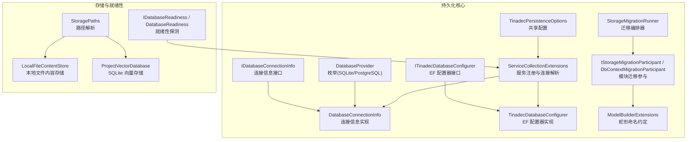
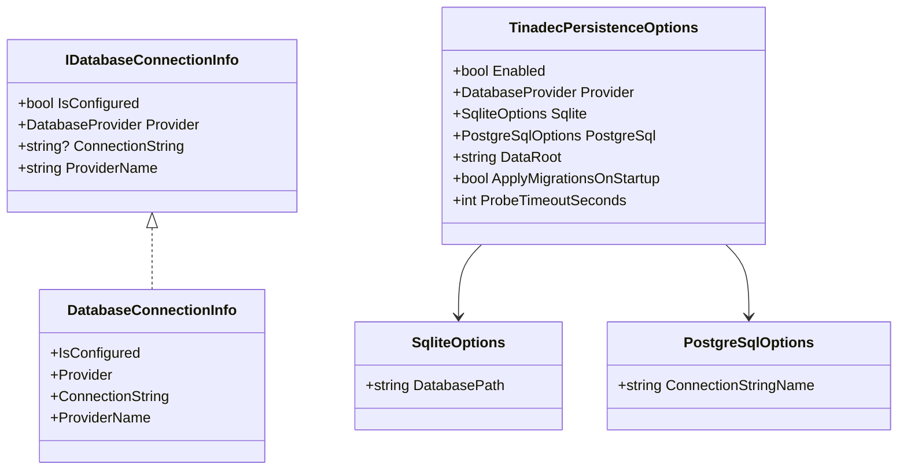
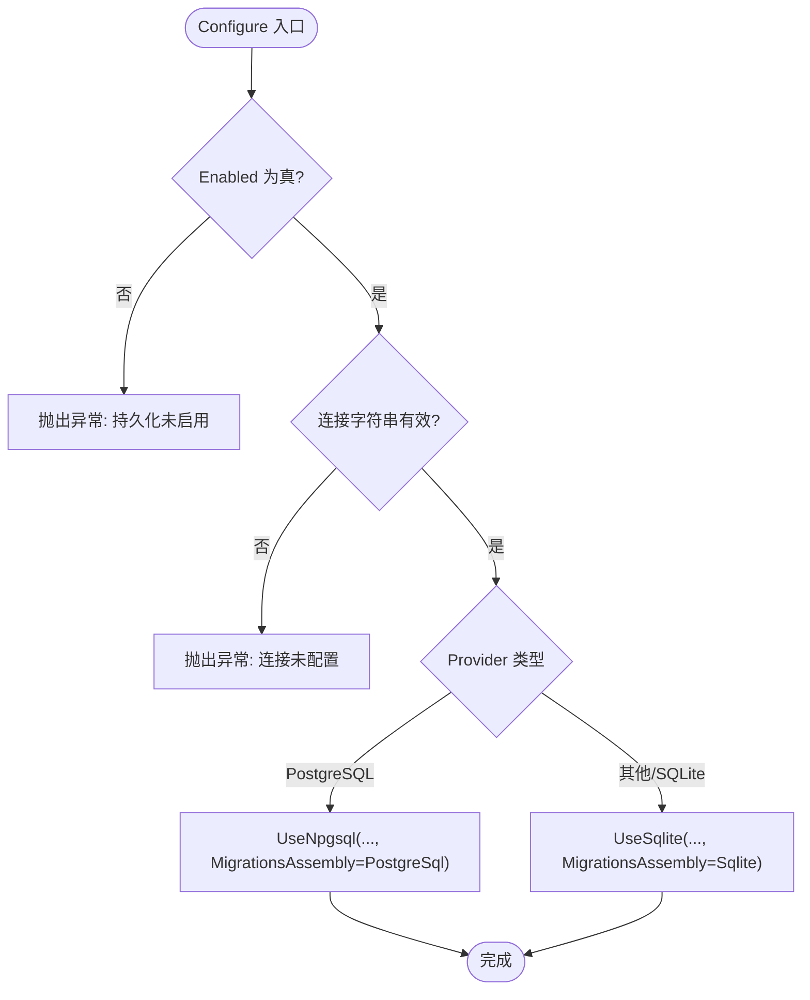
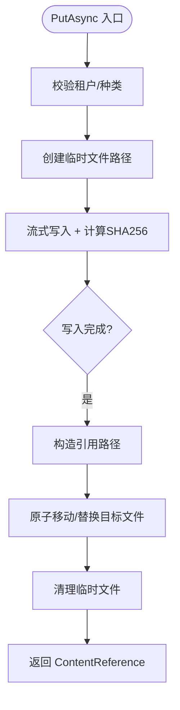
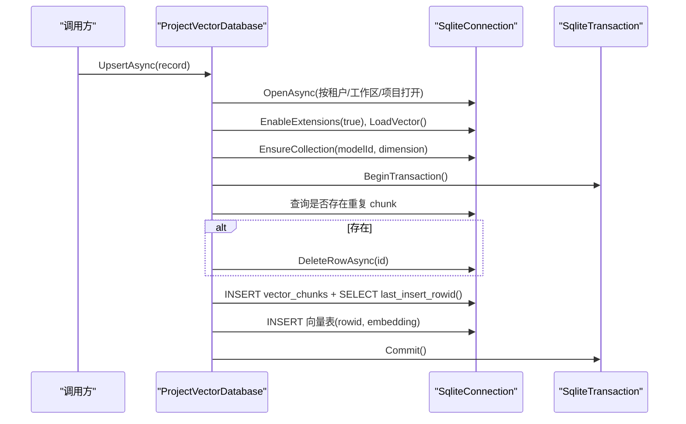
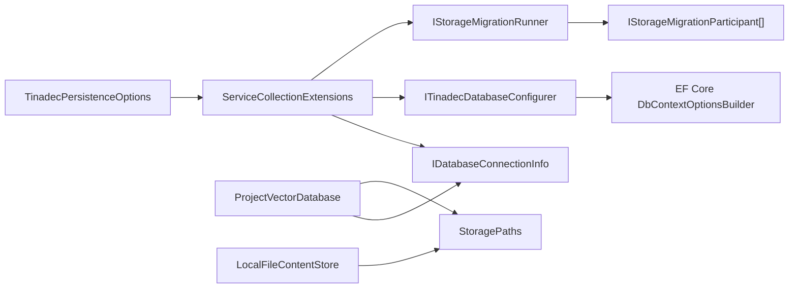

# 持久化层

<cite>
**本文引用的文件**   
- [IDatabaseConnectionInfo.cs](file://TinadecCore\Persistence\IDatabaseConnectionInfo.cs)
- [DatabaseProvider.cs](file://TinadecCore\Persistence\DatabaseProvider.cs)
- [DatabaseConnectionInfo.cs](file://TinadecCore\Persistence\DatabaseConnectionInfo.cs)
- [TinadecPersistenceOptions.cs](file://TinadecCore\Persistence\TinadecPersistenceOptions.cs)
- [ITinadecDatabaseConfigurer.cs](file://TinadecCore\Persistence\ITinadecDatabaseConfigurer.cs)
- [TinadecDatabaseConfigurer.cs](file://TinadecCore\Persistence\TinadecDatabaseConfigurer.cs)
- [ServiceCollectionExtensions.cs](file://TinadecCore\Persistence\ServiceCollectionExtensions.cs)
- [StorageMigration.cs](file://TinadecCore\Persistence\StorageMigration.cs)
- [DbContextMigrationParticipant.cs](file://TinadecCore\Persistence\DbContextMigrationParticipant.cs)
- [ModelBuilderExtensions.cs](file://TinadecCore\Persistence\ModelBuilderExtensions.cs)
- [StoragePaths.cs](file://TinadecCore\Persistence\StoragePaths.cs)
- [LocalFileContentStore.cs](file://TinadecCore\Persistence\LocalFileContentStore.cs)
- [ProjectVectorDatabase.cs](file://TinadecCore\Persistence\ProjectVectorDatabase.cs)
- [appsettings.json](file://TinadecCore\Api\appsettings.json)
</cite>

## 目录
1. [简介](#简介)
2. [项目结构](#项目结构)
3. [核心组件](#核心组件)
4. [架构总览](#架构总览)
5. [详细组件分析](#详细组件分析)
6. [依赖关系分析](#依赖关系分析)
7. [性能与优化](#性能与优化)
8. [故障排查指南](#故障排查指南)
9. [结论](#结论)
10. [附录：配置与切换指南](#附录配置与切换指南)

## 简介
本章节面向初学者，系统性地介绍 Core 核心层的持久化子系统。该子系统基于 Entity Framework Core 构建数据库抽象层，统一了 SQLite 与 PostgreSQL 两种后端；提供连接信息解析、迁移编排、就绪性探测、向量存储与本地文件内容存储等能力。通过统一的配置与扩展点，业务模块可以以 Provider 无关的方式使用 EF Core LINQ 查询与事务，同时保持对底层存储的透明切换。

## 项目结构
持久化子系统位于 TinadecCore\Persistence 命名空间下，围绕“连接信息—提供者配置—迁移编排—就绪性—数据访问”形成清晰分层。此外，向量存储与本地文件存储作为补充能力，为检索与内容管理提供支撑。



**图表来源** 
- [IDatabaseConnectionInfo.cs:1-18](file://TinadecCore\Persistence\IDatabaseConnectionInfo.cs#L1-L18)
- [DatabaseProvider.cs:1-11](file://TinadecCore\Persistence\DatabaseProvider.cs#L1-L11)
- [DatabaseConnectionInfo.cs:1-23](file://TinadecCore\Persistence\DatabaseConnectionInfo.cs#L1-L23)
- [TinadecPersistenceOptions.cs:1-48](file://TinadecCore\Persistence\TinadecPersistenceOptions.cs#L1-L48)
- [ITinadecDatabaseConfigurer.cs:1-17](file://TinadecCore\Persistence\ITinadecDatabaseConfigurer.cs#L1-L17)
- [TinadecDatabaseConfigurer.cs:1-48](file://TinadecCore\Persistence\TinadecDatabaseConfigurer.cs#L1-L48)
- [ServiceCollectionExtensions.cs:1-122](file://TinadecCore\Persistence\ServiceCollectionExtensions.cs#L1-L122)
- [StorageMigration.cs:1-41](file://TinadecCore\Persistence\StorageMigration.cs#L1-L41)
- [DbContextMigrationParticipant.cs:1-37](file://TinadecCore\Persistence\DbContextMigrationParticipant.cs#L1-L37)
- [ModelBuilderExtensions.cs:1-31](file://TinadecCore\Persistence\ModelBuilderExtensions.cs#L1-L31)
- [StoragePaths.cs:1-64](file://TinadecCore\Persistence\StoragePaths.cs#L1-L64)
- [LocalFileContentStore.cs:1-68](file://TinadecCore\Persistence\LocalFileContentStore.cs#L1-L68)
- [ProjectVectorDatabase.cs:1-174](file://TinadecCore\Persistence\ProjectVectorDatabase.cs#L1-L174)

**章节来源**
- [ServiceCollectionExtensions.cs:1-122](file://TinadecCore\Persistence\ServiceCollectionExtensions.cs#L1-L122)
- [TinadecPersistenceOptions.cs:1-48](file://TinadecCore\Persistence\TinadecPersistenceOptions.cs#L1-L48)

## 核心组件
- IDatabaseConnectionInfo：描述当前活动提供程序的连接信息（是否已配置、提供程序类型、连接字符串、提供程序名称）。
- DatabaseProvider：支持的数据库后端枚举（SQLite、PostgreSQL），默认 SQLite。
- DatabaseConnectionInfo：IDatabaseConnectionInfo 的具体实现，负责 ProviderName 映射与 IsConfigured 判断。
- TinadecPersistenceOptions：共享配置项，包含启用开关、Provider、各 Provider 子配置、DataRoot、启动时迁移开关、就绪探针超时等。
- ITinadecDatabaseConfigurer/TinadecDatabaseConfigurer：将当前 Provider 与连接字符串应用到 EF Core DbContextOptionsBuilder，并指定对应迁移程序集。
- ServiceCollectionExtensions：集中注册选项、连接信息、配置器、就绪性、路径解析、内容存储、向量存储、迁移编排器等服务；并提供 UseTinadecDatabase 扩展用于模块 DbContext 注册。
- StorageMigrationRunner/IStorageMigrationParticipant：启动时按参与者顺序执行迁移；支持跳过或按需开启。
- DbContextMigrationParticipant<TContext>：为每个业务 DbContext 提供迁移参与能力，优先运行 EF 迁移，若无则生成脚本确保表存在。
- ModelBuilderExtensions：为所有实体属性应用 snake_case 列名约定，保证跨库一致性。
- StoragePaths：安全解析 Core 拥有的文件路径（会话、任务快照、事件日志、工件、向量库等），防止路径逃逸。
- LocalFileContentStore：本地文件内容存储，流式写入、SHA256 校验、原子移动、异步读取。
- ProjectVectorDatabase：基于 SQLite + vec0 扩展的项目级向量存储，支持 Upsert、Search、DeleteSource。

**章节来源**
- [IDatabaseConnectionInfo.cs:1-18](file://TinadecCore\Persistence\IDatabaseConnectionInfo.cs#L1-L18)
- [DatabaseProvider.cs:1-11](file://TinadecCore\Persistence\DatabaseProvider.cs#L1-L11)
- [DatabaseConnectionInfo.cs:1-23](file://TinadecCore\Persistence\DatabaseConnectionInfo.cs#L1-L23)
- [TinadecPersistenceOptions.cs:1-48](file://TinadecCore\Persistence\TinadecPersistenceOptions.cs#L1-L48)
- [ITinadecDatabaseConfigurer.cs:1-17](file://TinadecCore\Persistence\ITinadecDatabaseConfigurer.cs#L1-L17)
- [TinadecDatabaseConfigurer.cs:1-48](file://TinadecCore\Persistence\TinadecDatabaseConfigurer.cs#L1-L48)
- [ServiceCollectionExtensions.cs:1-122](file://TinadecCore\Persistence\ServiceCollectionExtensions.cs#L1-L122)
- [StorageMigration.cs:1-41](file://TinadecCore\Persistence\StorageMigration.cs#L1-L41)
- [DbContextMigrationParticipant.cs:1-37](file://TinadecCore\Persistence\DbContextMigrationParticipant.cs#L1-L37)
- [ModelBuilderExtensions.cs:1-31](file://TinadecCore\Persistence\ModelBuilderExtensions.cs#L1-L31)
- [StoragePaths.cs:1-64](file://TinadecCore\Persistence\StoragePaths.cs#L1-L64)
- [LocalFileContentStore.cs:1-68](file://TinadecCore\Persistence\LocalFileContentStore.cs#L1-L68)
- [ProjectVectorDatabase.cs:1-174](file://TinadecCore\Persistence\ProjectVectorDatabase.cs#L1-L174)

## 架构总览
下图展示了从配置到 EF 配置、再到迁移执行的端到端流程，以及向量与文件存储的协作关系。

```mermaid
sequenceDiagram
participant App as "应用启动"
participant DI as "服务容器"
participant Opt as "TinadecPersistenceOptions"
participant Conn as "IDatabaseConnectionInfo"
participant Cfg as "ITinadecDatabaseConfigurer"
participant DB as "EF DbContext"
participant Mig as "IStorageMigrationRunner"
participant Part as "IStorageMigrationParticipant[]"
App->>DI : AddTinadecPersistence(configuration, contentRootPath)
DI->>Opt : 绑定配置节
DI->>Conn : ResolveConnectionInfo(options, configuration, root)
App->>DB : 模块 DbContext 注册 UseTinadecDatabase(serviceProvider)
DB->>Cfg : Configure(DbContextOptionsBuilder)
Cfg-->>DB : 设置 UseSqlite/UseNpgsql 与迁移程序集
App->>Mig : RunAsync()
Mig->>Part : 遍历调用 MigrateAsync()
Part-->>Mig : 完成迁移或确保表存在
Note over App,DB : 就绪性检查由 IDatabaseReadiness 在启动后执行
```

**图表来源** 
- [ServiceCollectionExtensions.cs:15-49](file://TinadecCore\Persistence\ServiceCollectionExtensions.cs#L15-L49)
- [ServiceCollectionExtensions.cs:54-62](file://TinadecCore\Persistence\ServiceCollectionExtensions.cs#L54-L62)
- [ServiceCollectionExtensions.cs:64-79](file://TinadecCore\Persistence\ServiceCollectionExtensions.cs#L64-L79)
- [TinadecDatabaseConfigurer.cs:19-46](file://TinadecCore\Persistence\TinadecDatabaseConfigurer.cs#L19-L46)
- [StorageMigration.cs:27-39](file://TinadecCore\Persistence\StorageMigration.cs#L27-L39)
- [DbContextMigrationParticipant.cs:12-23](file://TinadecCore\Persistence\DbContextMigrationParticipant.cs#L12-L23)

## 详细组件分析

### 连接信息与提供程序
- IDatabaseConnectionInfo 暴露 IsConfigured、Provider、ConnectionString、ProviderName。
- DatabaseConnectionInfo 根据 Provider 返回标准化 ProviderName（sqlite/postgresql），并通过 ConnectionString 是否为空判定 IsConfigured。
- ServiceCollectionExtensions.ResolveConnectionInfo 根据 TinadecPersistenceOptions 与 IConfiguration 解析具体连接字符串：
  - SQLite：拼接绝对路径并生成连接字符串。
  - PostgreSQL：从 ConnectionStrings[ConnectionStringName] 获取。



**图表来源** 
- [IDatabaseConnectionInfo.cs:1-18](file://TinadecCore\Persistence\IDatabaseConnectionInfo.cs#L1-L18)
- [DatabaseConnectionInfo.cs:1-23](file://TinadecCore\Persistence\DatabaseConnectionInfo.cs#L1-L23)
- [TinadecPersistenceOptions.cs:1-48](file://TinadecCore\Persistence\TinadecPersistenceOptions.cs#L1-L48)

**章节来源**
- [IDatabaseConnectionInfo.cs:1-18](file://TinadecCore\Persistence\IDatabaseConnectionInfo.cs#L1-L18)
- [DatabaseConnectionInfo.cs:1-23](file://TinadecCore\Persistence\DatabaseConnectionInfo.cs#L1-L23)
- [ServiceCollectionExtensions.cs:64-120](file://TinadecCore\Persistence\ServiceCollectionExtensions.cs#L64-L120)

### EF 配置器与模块集成
- ITinadecDatabaseConfigurer.Configure 会校验 Enabled 与连接字符串有效性，然后按 Provider 选择 UseSqlite 或 UseNpgsql，并指定相应迁移程序集。
- 模块 DbContext 通过 UseTinadecDatabase(serviceProvider) 接入统一配置。



**图表来源** 
- [TinadecDatabaseConfigurer.cs:19-46](file://TinadecCore\Persistence\TinadecDatabaseConfigurer.cs#L19-L46)

**章节来源**
- [ITinadecDatabaseConfigurer.cs:1-17](file://TinadecCore\Persistence\ITinadecDatabaseConfigurer.cs#L1-L17)
- [TinadecDatabaseConfigurer.cs:1-48](file://TinadecCore\Persistence\TinadecDatabaseConfigurer.cs#L1-L48)
- [ServiceCollectionExtensions.cs:54-62](file://TinadecCore\Persistence\ServiceCollectionExtensions.cs#L54-L62)

### 迁移管理与自动迁移
- StorageMigrationRunner.RunAsync 依据 Options.Enabled 与 ApplyMigrationsOnStartup（PostgreSQL 需显式开启）决定是否执行迁移。
- 依次调用各 IStorageMigrationParticipant.MigrateAsync。
- DbContextMigrationParticipant<TContext> 优先执行 EF 迁移；若无迁移，则生成建表脚本并确保表存在（IF NOT EXISTS 策略）。

```mermaid
sequenceDiagram
participant Runner as "StorageMigrationRunner"
participant Participant as "DbContextMigrationParticipant<T>"
participant DB as "DbContext"
participant Boot as "DbContextSchemaBootstrapper"
Runner->>Participant : MigrateAsync()
alt 存在迁移
Participant->>DB : GetMigrations()
DB-->>Participant : 迁移列表
Participant->>DB : MigrateAsync()
else 无迁移
Participant->>Boot : EnsureTablesAsync(db)
Boot->>DB : GenerateCreateScript()
Boot->>DB : ExecuteSqlRawAsync(IF NOT EXISTS)
end
```

**图表来源** 
- [StorageMigration.cs:27-39](file://TinadecCore\Persistence\StorageMigration.cs#L27-L39)
- [DbContextMigrationParticipant.cs:12-23](file://TinadecCore\Persistence\DbContextMigrationParticipant.cs#L12-L23)
- [DbContextMigrationParticipant.cs:28-35](file://TinadecCore\Persistence\DbContextMigrationParticipant.cs#L28-L35)

**章节来源**
- [StorageMigration.cs:1-41](file://TinadecCore\Persistence\StorageMigration.cs#L1-L41)
- [DbContextMigrationParticipant.cs:1-37](file://TinadecCore\Persistence\DbContextMigrationParticipant.cs#L1-L37)

### 模型约定与命名规范
- ModelBuilderExtensions.UseTinadecSnakeCase 将所有实体属性转换为 snake_case 列名，提升跨数据库兼容性。

**章节来源**
- [ModelBuilderExtensions.cs:1-31](file://TinadecCore\Persistence\ModelBuilderExtensions.cs#L1-L31)

### 本地文件内容存储
- LocalFileContentStore 提供 PutAsync/OpenReadAsync/ExistsAsync/DeleteAsync。
- 写入流程：临时文件流式写入 + SHA256 计算 → 目标路径原子移动 → 清理临时文件。
- StoragePaths 保障路径安全（相对路径、前缀校验、非法字符过滤）。



**图表来源** 
- [LocalFileContentStore.cs:11-49](file://TinadecCore\Persistence\LocalFileContentStore.cs#L11-L49)
- [StoragePaths.cs:34-53](file://TinadecCore\Persistence\StoragePaths.cs#L34-L53)

**章节来源**
- [LocalFileContentStore.cs:1-68](file://TinadecCore\Persistence\LocalFileContentStore.cs#L1-L68)
- [StoragePaths.cs:1-64](file://TinadecCore\Persistence\StoragePaths.cs#L1-L64)

### 项目级向量存储（SQLite + vec0）
- ProjectVectorDatabase 仅支持 SQLite（PostgreSQL 尚未实现）。
- 关键操作：UpsertAsync（去重插入 + 向量表维护）、SearchAsync（相似度搜索，限制与最低分数过滤）、DeleteSourceAsync（按源删除）。
- 内部使用 vec0 虚拟表进行向量检索，按 model_id 与维度动态创建集合表。



**图表来源** 
- [ProjectVectorDatabase.cs:20-60](file://TinadecCore\Persistence\ProjectVectorDatabase.cs#L20-L60)
- [ProjectVectorDatabase.cs:109-122](file://TinadecCore\Persistence\ProjectVectorDatabase.cs#L109-L122)
- [ProjectVectorDatabase.cs:124-141](file://TinadecCore\Persistence\ProjectVectorDatabase.cs#L124-L141)

**章节来源**
- [ProjectVectorDatabase.cs:1-174](file://TinadecCore\Persistence\ProjectVectorDatabase.cs#L1-L174)

## 依赖关系分析
- 服务注册依赖 IConfiguration 与 IOptions<TinadecPersistenceOptions>。
- 配置器依赖 IDatabaseConnectionInfo 与 EF Core。
- 迁移编排依赖 IEnumerable<IStorageMigrationParticipant>。
- 向量存储依赖 IDatabaseConnectionInfo 与 StoragePaths。
- 文件存储依赖 StoragePaths。



**图表来源** 
- [ServiceCollectionExtensions.cs:23-48](file://TinadecCore\Persistence\ServiceCollectionExtensions.cs#L23-L48)
- [TinadecDatabaseConfigurer.cs:8-17](file://TinadecCore\Persistence\TinadecDatabaseConfigurer.cs#L8-L17)
- [StorageMigration.cs:14-25](file://TinadecCore\Persistence\StorageMigration.cs#L14-L25)
- [ProjectVectorDatabase.cs:14-18](file://TinadecCore\Persistence\ProjectVectorDatabase.cs#L14-L18)
- [LocalFileContentStore.cs:6-9](file://TinadecCore\Persistence\LocalFileContentStore.cs#L6-L9)

**章节来源**
- [ServiceCollectionExtensions.cs:1-122](file://TinadecCore\Persistence\ServiceCollectionExtensions.cs#L1-L122)

## 性能与优化
- SQLite 模式
  - 使用 WriteThrough 与异步流写入，减少内存占用与阻塞。
  - 向量检索借助 vec0 虚拟表，按维度建立独立集合表，避免跨模型干扰。
  - 建议合理设置 ProbeTimeoutSeconds，避免就绪检查过长影响启动。
- PostgreSQL 模式
  - 多实例部署需关闭 ApplyMigrationsOnStartup，避免并发迁移竞争。
  - 连接池与命令超时应结合生产环境调优（由上层应用控制）。
- 通用建议
  - 使用 UseTinadecSnakeCase 统一列名，降低跨库差异带来的额外转换成本。
  - 对大对象写入采用流式处理，避免一次性加载至内存。
  - 向量搜索 Limit 上限受代码内 Clamp 限制，避免过大结果集。

[本节为通用指导，不直接分析具体文件]

## 故障排查指南
- 持久化未启用
  - 现象：调用 Configure 抛出“持久化未启用”。
  - 处理：确认 TinadecPersistence:Enabled=true。
- 连接未配置
  - SQLite：未设置 DatabasePath 或为空。
  - PostgreSQL：未设置 ConnectionStrings[TinadecCore] 或为空。
- 启动迁移被跳过
  - PostgreSQL 默认不在启动时执行迁移，需设置 ApplyMigrationsOnStartup=true。
- 路径越界
  - StoragePaths 会拒绝超出 DataRoot 的路径，检查传入的相对路径是否正确。
- 向量维度不一致
  - 当 model_id 对应的维度发生变化时会抛出异常，需重建集合或调整模型。

**章节来源**
- [TinadecDatabaseConfigurer.cs:23-35](file://TinadecCore\Persistence\TinadecDatabaseConfigurer.cs#L23-L35)
- [ServiceCollectionExtensions.cs:69-79](file://TinadecCore\Persistence\ServiceCollectionExtensions.cs#L69-L79)
- [StorageMigration.cs:29-33](file://TinadecCore\Persistence\StorageMigration.cs#L29-L33)
- [StoragePaths.cs:44-53](file://TinadecCore\Persistence\StoragePaths.cs#L44-L53)
- [ProjectVectorDatabase.cs:124-131](file://TinadecCore\Persistence\ProjectVectorDatabase.cs#L124-L131)

## 结论
持久化层通过清晰的抽象与扩展点，将 EF Core 的使用统一到 Provider 无关的配置与迁移框架中。SQLite 适合桌面与单机场景，PostgreSQL 适合多实例与高可用部署。配合向量存储与文件内容存储，Core 能够覆盖从结构化数据到非结构化内容的完整数据生命周期。

[本节为总结，不直接分析具体文件]

## 附录：配置与切换指南

### 配置文件示例（JSON）
- 位置：TinadecCore\Api\appsettings.json
- 关键键：
  - TinadecPersistence:Enabled
  - TinadecPersistence:Provider（Sqlite/PostgreSql）
  - TinadecPersistence:Sqlite:DatabasePath
  - TinadecPersistence:PostgreSql:ConnectionStringName
  - ConnectionStrings:TinadecCore（PostgreSQL 连接串）
  - TinadecPersistence:ApplyMigrationsOnStartup
  - TinadecPersistence:ProbeTimeoutSeconds

**章节来源**
- [appsettings.json:9-22](file://TinadecCore\Api\appsettings.json#L9-L22)

### 切换到 PostgreSQL
- 步骤
  1) 在 appsettings.json 中设置 Provider=PostgreSql，并配置 ConnectionStrings:TinadecCore。
  2) 如需启动时自动迁移，设置 ApplyMigrationsOnStartup=true（多实例建议手动迁移）。
  3) 确保模块 DbContext 注册使用了 UseTinadecDatabase(serviceProvider)。
  4) 启动应用，验证 IDatabaseReadiness 就绪检查通过。

**章节来源**
- [ServiceCollectionExtensions.cs:103-120](file://TinadecCore\Persistence\ServiceCollectionExtensions.cs#L103-L120)
- [TinadecDatabaseConfigurer.cs:39-44](file://TinadecCore\Persistence\TinadecDatabaseConfigurer.cs#L39-L44)

### 切换到 SQLite
- 步骤
  1) 设置 Provider=Sqlite，并配置 Sqlite:DatabasePath（相对路径将相对于 content root 解析）。
  2) 默认 ApplyMigrationsOnStartup=true，启动时将执行迁移。
  3) 确保模块 DbContext 注册使用了 UseTinadecDatabase(serviceProvider)。

**章节来源**
- [ServiceCollectionExtensions.cs:81-101](file://TinadecCore\Persistence\ServiceCollectionExtensions.cs#L81-L101)
- [TinadecDatabaseConfigurer.cs:42-44](file://TinadecCore\Persistence\TinadecDatabaseConfigurer.cs#L42-L44)

### 为模块 DbContext 注册提供程序
- 在模块的 DbContext 注册处调用 UseTinadecDatabase(serviceProvider)，即可自动应用当前 Provider 与连接字符串。

**章节来源**
- [ServiceCollectionExtensions.cs:54-62](file://TinadecCore\Persistence\ServiceCollectionExtensions.cs#L54-L62)

### 最佳实践（EF Core 使用）
- 使用 UseTinadecSnakeCase 统一列名。
- 通过 IDbContextFactory<TContext> 创建上下文，便于迁移与测试。
- 对长事务与批量写入使用显式事务与流式处理。
- 在生产环境谨慎开启启动迁移，避免并发冲突。

**章节来源**
- [ModelBuilderExtensions.cs:8-17](file://TinadecCore\Persistence\ModelBuilderExtensions.cs#L8-L17)
- [DbContextMigrationParticipant.cs:8-11](file://TinadecCore\Persistence\DbContextMigrationParticipant.cs#L8-L11)