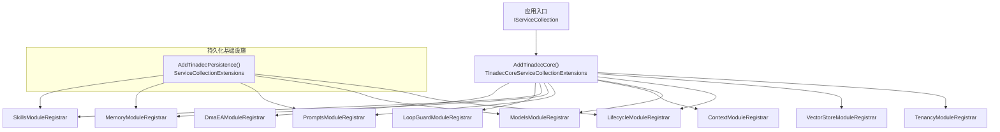
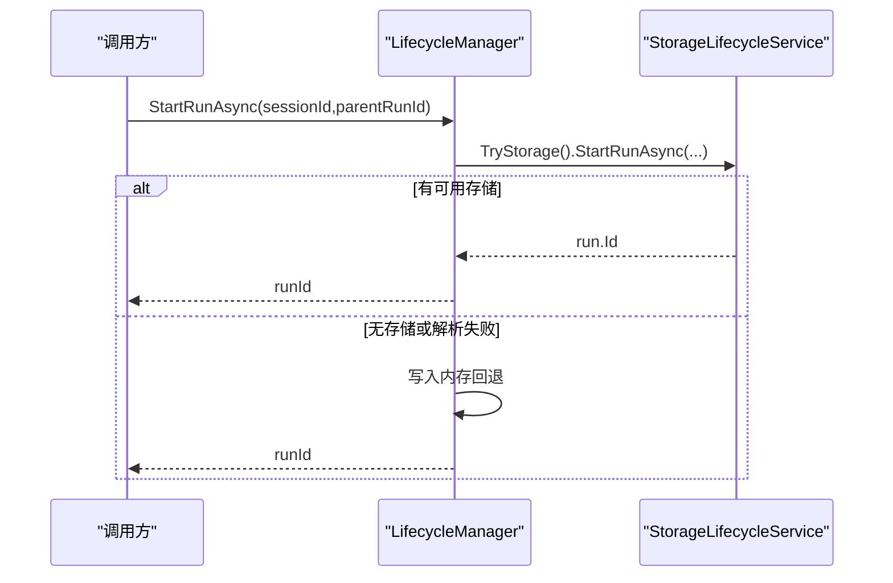
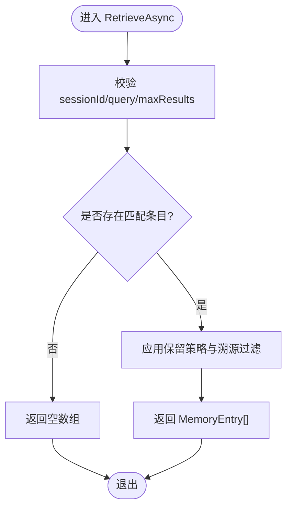
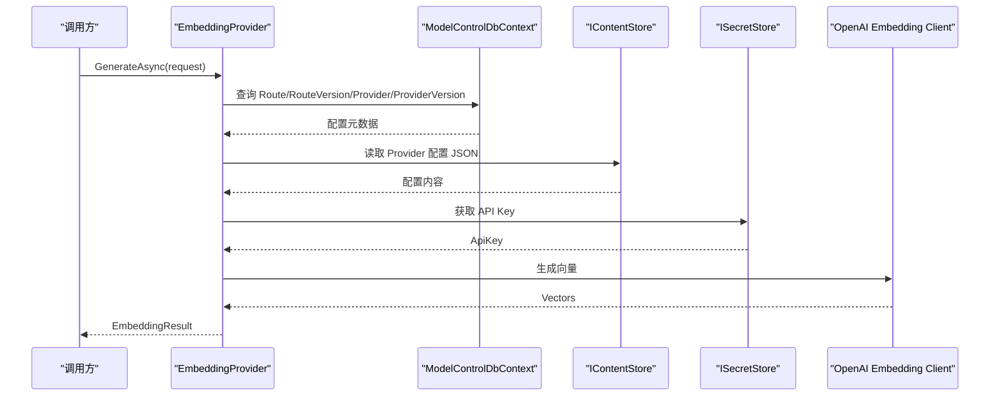
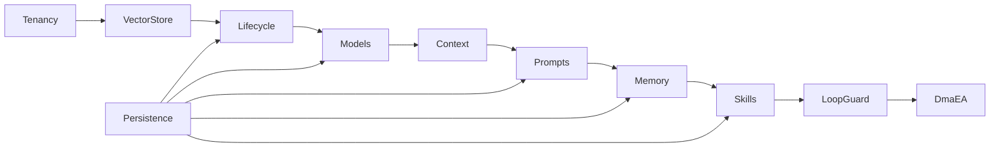

# 核心模块

<cite>
**本文引用的文件**
- [IModuleRegistrar.cs](file://TinadecCore/Abstractions/IModuleRegistrar.cs)
- [ITinadecCoreBuilder.cs](file://TinadecCore/Abstractions/ITinadecCoreBuilder.cs)
- [TinadecCoreBuilder.cs](file://TinadecCore/Runtime/TinadecCoreBuilder.cs)
- [TinadecCoreServiceCollectionExtensions.cs](file://TinadecCore/Runtime/TinadecCoreServiceCollectionExtensions.cs)
- [ServiceCollectionExtensions.cs](file://TinadecCore/Persistence/ServiceCollectionExtensions.cs)
- [ILifecycleManager.cs](file://TinadecCore/Abstractions/Ports/ILifecycleManager.cs)
- [LifecycleModuleRegistrar.cs](file://TinadecCore/Lifecycle/LifecycleModuleRegistrar.cs)
- [IMemoryStore.cs](file://TinadecCore/Abstractions/Ports/IMemoryStore.cs)
- [MemoryModuleRegistrar.cs](file://TinadecCore/Memory/MemoryModuleRegistrar.cs)
- [IModelProvider.cs](file://TinadecCore/Abstractions/Ports/IModelProvider.cs)
- [ModelsModuleRegistrar.cs](file://TinadecCore/Models/ModelsModuleRegistrar.cs)
- [IPromptAssembler.cs](file://TinadecCore/Abstractions/Ports/IPromptAssembler.cs)
- [PromptsModuleRegistrar.cs](file://TinadecCore/Prompts/PromptsModuleRegistrar.cs)
- [ISkillProvider.cs](file://TinadecCore/Abstractions/Ports/ISkillProvider.cs)
- [SkillsModuleRegistrar.cs](file://TinadecCore/Skills/SkillsModuleRegistrar.cs)
</cite>

## 目录
1. [简介](#简介)
2. [项目结构](#项目结构)
3. [核心组件](#核心组件)
4. [架构总览](#架构总览)
5. [详细组件分析](#详细组件分析)
6. [依赖关系分析](#依赖关系分析)
7. [性能考量](#性能考量)
8. [故障排查指南](#故障排查指南)
9. [结论](#结论)
10. [附录：模块开发指南与扩展点](#附录模块开发指南与扩展点)

## 简介
本文件面向 Core 核心层的模块化架构，系统性阐述生命周期管理、会话记忆、模型管理、提示词组装、技能系统等关键模块的设计与实现。文档覆盖模块注册机制、依赖声明、初始化流程、模块间通信方式（通过 DI 与端口接口）、配置管理与迁移参与点，并提供可操作的模块开发与扩展指南，帮助开发者快速理解并安全地扩展或替换现有行为。

## 项目结构
Core 层采用“按功能域划分”的模块化组织方式，每个模块提供独立的 ModuleRegistrar，负责向统一构建器注册服务与模块描述符。运行时通过统一的扩展方法完成所有模块的装配，同时支持最小化装配以裁剪体积。

图表来源
- [TinadecCoreServiceCollectionExtensions.cs:25-43](file://TinadecCore/Runtime/TinadecCoreServiceCollectionExtensions.cs#L25-L43)
- [ServiceCollectionExtensions.cs:15-49](file://TinadecCore/Persistence/ServiceCollectionExtensions.cs#L15-L49)

章节来源
- [TinadecCoreServiceCollectionExtensions.cs:25-43](file://TinadecCore/Runtime/TinadecCoreServiceCollectionExtensions.cs#L25-L43)
- [ServiceCollectionExtensions.cs:15-49](file://TinadecCore/Persistence/ServiceCollectionExtensions.cs#L15-L49)

## 核心组件
- 模块注册抽象与构建器
  - IModuleRegistrar：定义模块唯一标识与 Register(builder) 方法，禁止反射扫描，强调显式注册。
  - ITinadecCoreBuilder：暴露 IServiceCollection 与 RegisterModule(descriptor)/GetRegisteredModules()，用于收集模块描述符。
  - TinadecCoreBuilder：默认实现，维护已注册模块列表，并将自身注入容器以便端点解析。
- 运行时装配
  - AddTinadecCore()：按依赖顺序注册全部模块；AddTinadecCoreMinimal()：仅注册必要模块，便于裁剪。
- 持久化基础设施
  - AddTinadecPersistence()：注册连接信息、数据库配置器、就绪检查、内容存储、向量库、密钥存储、迁移运行器等；UseTinadecDatabase() 将当前 Provider 应用到各 DbContext。

章节来源
- [IModuleRegistrar.cs:9-16](file://TinadecCore/Abstractions/IModuleRegistrar.cs#L9-L16)
- [ITinadecCoreBuilder.cs:10-19](file://TinadecCore/Abstractions/ITinadecCoreBuilder.cs#L10-L19)
- [TinadecCoreBuilder.cs:11-30](file://TinadecCore/Runtime/TinadecCoreBuilder.cs#L11-L30)
- [TinadecCoreServiceCollectionExtensions.cs:25-59](file://TinadecCore/Runtime/TinadecCoreServiceCollectionExtensions.cs#L25-L59)
- [ServiceCollectionExtensions.cs:15-62](file://TinadecCore/Persistence/ServiceCollectionExtensions.cs#L15-L62)

## 架构总览
Core 的核心思想是“端口 + 模块注册 + DI 装配”。每个业务模块通过 IModuleRegistrar 声明能力、依赖与 MAF 原语，并通过 builder.Services 注册具体实现。模块之间不直接耦合，而是通过 Abstractions.Ports 中的接口进行交互。

```mermaid
classDiagram
class IModuleRegistrar {
+string ModuleId
+Register(builder) void
}
class ITinadecCoreBuilder {
+Services : IServiceCollection
+RegisterModule(descriptor) void
+GetRegisteredModules() IReadOnlyList~ModuleDescriptor~
}
class TinadecCoreBuilder {
-_modules : ModuleDescriptor[]
+RegisterModule(descriptor) void
+GetRegisteredModules() IReadOnlyList~ModuleDescriptor~
}
class ILifecycleManager {
+StartRunAsync(sessionId,parentRunId,cancel) Task~string~
+CompleteRunAsync(runId,cancel) Task
+GetRunStateAsync(runId,cancel) Task~RunState~
}
class IMemoryStore {
+RetrieveAsync(sessionId,query,maxResults,cancel) Task~MemoryEntry[]~
+StoreAsync(sessionId,entry,cancel) Task
}
class IModelProvider {
+GetChatClientAsync(routeId,cancel) Task~IChatClient?~
+CheckReadinessAsync(cancel) Task~ModelReadiness~
}
class IEmbeddingProvider {
+GenerateAsync(request,cancel) Task~EmbeddingResult~
}
class IPromptAssembler {
+AssembleAsync(agentId,contextPack,cancel) Task~PromptAssemblyResult~
}
class ISkillProvider {
+ListSkillsAsync(agentId,cancel) Task~SkillDescriptor[]~
+GetSkillAsync(skillId,cancel) Task~SkillDescriptor?~
}
TinadecCoreBuilder ..|> ITinadecCoreBuilder
LifecycleManager ..|> ILifecycleManager
MemoryStore ..|> IMemoryStore
ModelProvider ..|> IModelProvider
EmbeddingProvider ..|> IEmbeddingProvider
PromptAssembler ..|> IPromptAssembler
SkillProvider ..|> ISkillProvider
```

图表来源
- [IModuleRegistrar.cs:9-16](file://TinadecCore/Abstractions/IModuleRegistrar.cs#L9-L16)
- [ITinadecCoreBuilder.cs:10-44](file://TinadecCore/Abstractions/ITinadecCoreBuilder.cs#L10-L44)
- [TinadecCoreBuilder.cs:11-30](file://TinadecCore/Runtime/TinadecCoreBuilder.cs#L11-L30)
- [ILifecycleManager.cs:8-22](file://TinadecCore/Abstractions/Ports/ILifecycleManager.cs#L8-L22)
- [IMemoryStore.cs:7-19](file://TinadecCore/Abstractions/Ports/IMemoryStore.cs#L7-L19)
- [IModelProvider.cs:10-26](file://TinadecCore/Abstractions/Ports/IModelProvider.cs#L10-L26)
- [IPromptAssembler.cs:8-14](file://TinadecCore/Abstractions/Ports/IPromptAssembler.cs#L8-L14)
- [ISkillProvider.cs:8-17](file://TinadecCore/Abstractions/Ports/ISkillProvider.cs#L8-L17)

## 详细组件分析

### 生命周期管理（Lifecycle）
- 职责
  - 统一管理 Run/Task/Agent/Tool/Approval 状态与审计事件；MAF 的 session/checkpoint 仅作为执行期状态。
- 关键类型
  - ILifecycleManager：启动/完成/查询运行状态。
  - LifecycleManager：内存回退 + 可选持久化（StorageLifecycleService）。
- 注册要点
  - 注册 DbContextFactory、诊断、迁移参与者、ILifecycleManager。
  - 声明能力：run_management、task_state、agent_state、tool_state、approval_state、audit_events。
- 数据流
  - StartRunAsync：优先走持久化存储，失败回退到内存字典。
  - CompleteRunAsync：更新状态为 Completed。
  - GetRunStateAsync：从持久化或内存读取，缺失时返回 Pending。

图表来源
- [LifecycleModuleRegistrar.cs:17-34](file://TinadecCore/Lifecycle/LifecycleModuleRegistrar.cs#L17-L34)
- [LifecycleModuleRegistrar.cs:42-99](file://TinadecCore/Lifecycle/LifecycleModuleRegistrar.cs#L42-L99)
- [ILifecycleManager.cs:8-22](file://TinadecCore/Abstractions/Ports/ILifecycleManager.cs#L8-L22)

章节来源
- [LifecycleModuleRegistrar.cs:17-34](file://TinadecCore/Lifecycle/LifecycleModuleRegistrar.cs#L17-L34)
- [LifecycleModuleRegistrar.cs:42-99](file://TinadecCore/Lifecycle/LifecycleModuleRegistrar.cs#L42-L99)
- [ILifecycleManager.cs:8-22](file://TinadecCore/Abstractions/Ports/ILifecycleManager.cs#L8-L22)

### 会话记忆（Memory）
- 职责
  - 管理 Agent 会话序列化、聊天历史、保留策略与溯源（provenance）。
- 关键类型
  - IMemoryStore：检索与存储 MemoryEntry。
  - ProjectSessionStore：会话定位（ISessionLocator）。
  - MemoryStore：骨架实现（当前返回空结果，预留扩展点）。
- 注册要点
  - 注册 DbContextFactory、ProjectSessionStore、ISessionLocator、迁移参与者、IMemoryStore。
  - 声明能力：session_serialization、chat_history、retention_policy、provenance。

图表来源
- [MemoryModuleRegistrar.cs:15-32](file://TinadecCore/Memory/MemoryModuleRegistrar.cs#L15-L32)
- [IMemoryStore.cs:7-19](file://TinadecCore/Abstractions/Ports/IMemoryStore.cs#L7-L19)

章节来源
- [MemoryModuleRegistrar.cs:15-32](file://TinadecCore/Memory/MemoryModuleRegistrar.cs#L15-L32)
- [IMemoryStore.cs:7-19](file://TinadecCore/Abstractions/Ports/IMemoryStore.cs#L7-L19)

### 模型管理（Models）
- 职责
  - 管理模型提供者实例、凭据引用、路由、能力、错误归一化与就绪性；基于 IChatClient/ChatClientAgent 作为入口。
- 关键类型
  - IModelProvider：获取 ChatClient、检查就绪。
  - IEmbeddingProvider：生成嵌入向量，内部解析路由、Provider 版本、Secret 与 OpenAI 兼容客户端。
- 注册要点
  - 注册 DbContextFactory、迁移参与者、IModelProvider、IEmbeddingProvider。
  - 声明能力：provider_management、model_routing、credential_references、error_normalization、readiness、embedding_generation。
- 嵌入流程
  - 根据租户/工作区解析 Route -> RouteVersion -> Provider -> ProviderVersion -> ContentReference -> SecretStore -> OpenAI Embedding Client。

图表来源
- [ModelsModuleRegistrar.cs:20-36](file://TinadecCore/Models/ModelsModuleRegistrar.cs#L20-L36)
- [ModelsModuleRegistrar.cs:70-158](file://TinadecCore/Models/ModelsModuleRegistrar.cs#L70-L158)
- [IModelProvider.cs:10-26](file://TinadecCore/Abstractions/Ports/IModelProvider.cs#L10-L26)

章节来源
- [ModelsModuleRegistrar.cs:20-36](file://TinadecCore/Models/ModelsModuleRegistrar.cs#L20-L36)
- [ModelsModuleRegistrar.cs:70-158](file://TinadecCore/Models/ModelsModuleRegistrar.cs#L70-L158)
- [IModelProvider.cs:10-26](file://TinadecCore/Abstractions/Ports/IModelProvider.cs#L10-L26)

### 提示词管理（Prompts）
- 职责
  - 确定性地将片段、Agent 指令、技能贡献与 ContextPack 组装为 ChatOptions.Instructions / AIContext。
- 关键类型
  - IPromptAssembler：AssembleAsync(agentId, contextPack)。
  - PromptAssembler：骨架实现，返回空 Instructions 与警告。
- 注册要点
  - 注册 DbContextFactory、迁移参与者、IPromptAssembler。
  - 声明能力：fragment_assembly、agent_instructions、skill_contributions、deterministic_assembly。

章节来源
- [PromptsModuleRegistrar.cs:16-31](file://TinadecCore/Prompts/PromptsModuleRegistrar.cs#L16-L31)
- [IPromptAssembler.cs:8-14](file://TinadecCore/Abstractions/Ports/IPromptAssembler.cs#L8-L14)

### 技能系统（Skills）
- 职责
  - 通过 MAF AgentSkillsProvider 提供技能，支持文件/类/内联技能与 SKILL.md；脚本执行委托给 TinadecTools，写操作经 Core 审批。
- 关键类型
  - ISkillProvider：ListSkillsAsync、GetSkillAsync。
  - SkillProvider：骨架实现，返回空集合。
- 注册要点
  - 注册 DbContextFactory、迁移参与者、ISkillProvider。
  - 声明能力：file_skills、class_skills、inline_skills、skill_md、sep_2640、extension_installations、mcp_acp_integrations。

章节来源
- [SkillsModuleRegistrar.cs:16-31](file://TinadecCore/Skills/SkillsModuleRegistrar.cs#L16-L31)
- [ISkillProvider.cs:8-17](file://TinadecCore/Abstractions/Ports/ISkillProvider.cs#L8-L17)

## 依赖关系分析
- 模块依赖与能力声明
  - 每个 ModuleRegistrar 在 Register 中通过 builder.RegisterModule(new ModuleDescriptor{...}) 声明依赖与能力，供编排与清单输出使用。
- 运行时装配顺序
  - AddTinadecCore() 按固定顺序注册模块，确保依赖先于消费者加载。
- 持久化依赖
  - 多数模块依赖 UseTinadecDatabase() 与迁移参与者 IStorageMigrationParticipant，由 Persistence 层统一提供。

图表来源
- [TinadecCoreServiceCollectionExtensions.cs:31-40](file://TinadecCore/Runtime/TinadecCoreServiceCollectionExtensions.cs#L31-L40)
- [ServiceCollectionExtensions.cs:15-49](file://TinadecCore/Persistence/ServiceCollectionExtensions.cs#L15-L49)

章节来源
- [TinadecCoreServiceCollectionExtensions.cs:31-40](file://TinadecCore/Runtime/TinadecCoreServiceCollectionExtensions.cs#L31-L40)
- [ServiceCollectionExtensions.cs:15-49](file://TinadecCore/Persistence/ServiceCollectionExtensions.cs#L15-L49)

## 性能考量
- 数据库访问
  - 各模块使用 IDbContextFactory<T> 按需创建上下文，避免长生命周期连接占用。
- 内存回退
  - Lifecycle 在无持久化时回退到 ConcurrentDictionary，降低冷启动开销。
- 异步与取消
  - 所有 IO 操作均支持 CancellationToken，便于超时与取消。
- 最小化装配
  - 使用 AddTinadecCoreMinimal() 减少不必要的模块加载，降低内存与启动时间。

[本节为通用指导，不直接分析具体文件]

## 故障排查指南
- 模型不可用
  - 检查路由/版本/Provider/Secret 是否齐全；EmbeddingProvider 会返回 IsAvailable=false 与 Detail 说明。
- 提示词为空
  - 骨架状态下 PromptAssembler 返回空 Instructions 与警告，需补充片段注册。
- 技能为空
  - 骨架状态下 SkillProvider 返回空集合，需实现技能发现与加载逻辑。
- 生命周期状态异常
  - 若持久化不可用，LifecycleManager 回退到内存；确认 StorageLifecycleService 可用性。

章节来源
- [ModelsModuleRegistrar.cs:70-158](file://TinadecCore/Models/ModelsModuleRegistrar.cs#L70-L158)
- [PromptsModuleRegistrar.cs:38-54](file://TinadecCore/Prompts/PromptsModuleRegistrar.cs#L38-L54)
- [SkillsModuleRegistrar.cs:38-53](file://TinadecCore/Skills/SkillsModuleRegistrar.cs#L38-L53)
- [LifecycleModuleRegistrar.cs:94-99](file://TinadecCore/Lifecycle/LifecycleModuleRegistrar.cs#L94-L99)

## 结论
Core 核心层通过清晰的模块边界、显式注册与端口抽象，实现了高内聚、低耦合的可插拔架构。生命周期、记忆、模型、提示词与技能等模块各司其职，借助 DI 与持久化基础设施协同工作。开发者可按需扩展或替换模块实现，保持系统稳定与可演进性。

## 附录：模块开发指南与扩展点
- 新增模块步骤
  1. 在 Abstractions/Ports 下定义接口（如 IMyService）。
  2. 新建模块目录与 MyModuleRegistrar，实现 IModuleRegistrar：
     - 设置 ModuleId。
     - 在 Register 中通过 builder.Services.AddSingleton/AddScoped/Transient 注册实现。
     - 调用 builder.RegisterModule(new ModuleDescriptor{...}) 声明依赖、能力、语言、MAF 原语与状态。
  3. 如需数据库，使用 AddDbContextFactory<MyDbContext>((sp, options) => options.UseTinadecDatabase(sp))。
  4. 如需迁移，实现 IStorageMigrationParticipant 并注册。
  5. 在宿主中通过 AddTinadecCore() 或自定义装配顺序包含该模块。
- 扩展点
  - 替换实现：保持接口不变，替换 DI 注册即可（如 IMemoryStore、IModelProvider、IPromptAssembler、ISkillProvider）。
  - 持久化接入：实现 IStorageMigrationParticipant，配合 UseTinadecDatabase()。
  - 配置与就绪：通过 Options 与 Readiness 接口暴露健康检查。
- 最佳实践
  - 避免跨模块直接依赖，始终通过 Ports 接口通信。
  - 所有 IO 操作支持取消令牌与异常归一化。
  - 明确声明依赖与能力，便于编排与诊断。

章节来源
- [IModuleRegistrar.cs:9-16](file://TinadecCore/Abstractions/IModuleRegistrar.cs#L9-L16)
- [ITinadecCoreBuilder.cs:10-44](file://TinadecCore/Abstractions/ITinadecCoreBuilder.cs#L10-L44)
- [ServiceCollectionExtensions.cs:54-62](file://TinadecCore/Persistence/ServiceCollectionExtensions.cs#L54-L62)