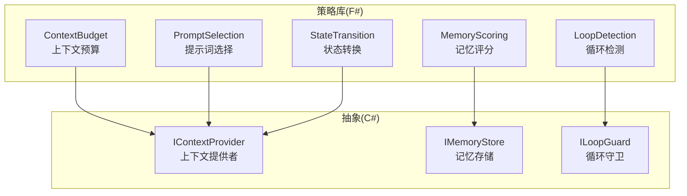
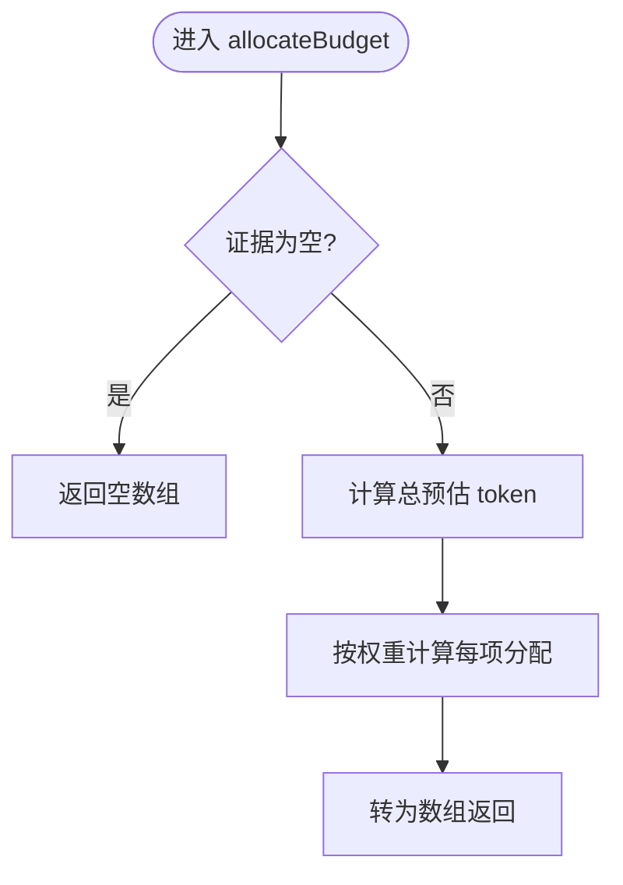
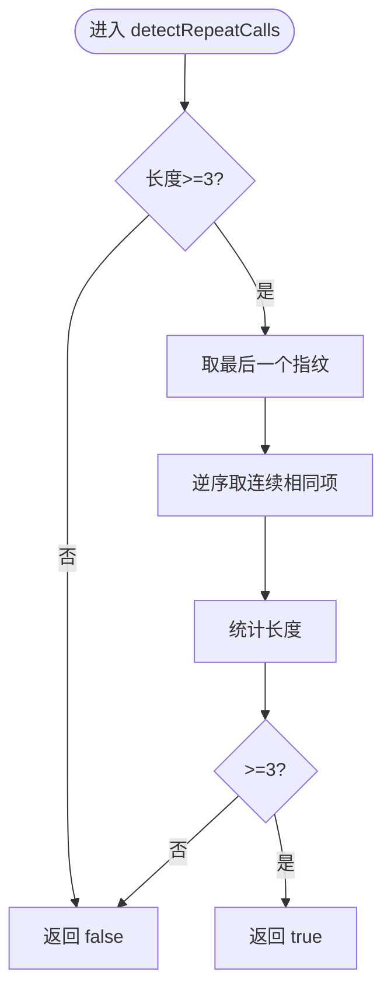
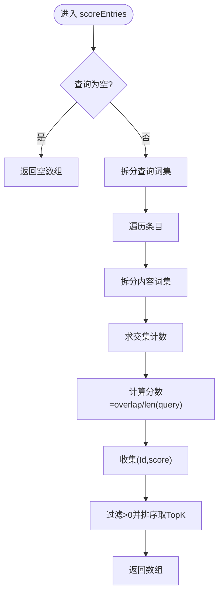
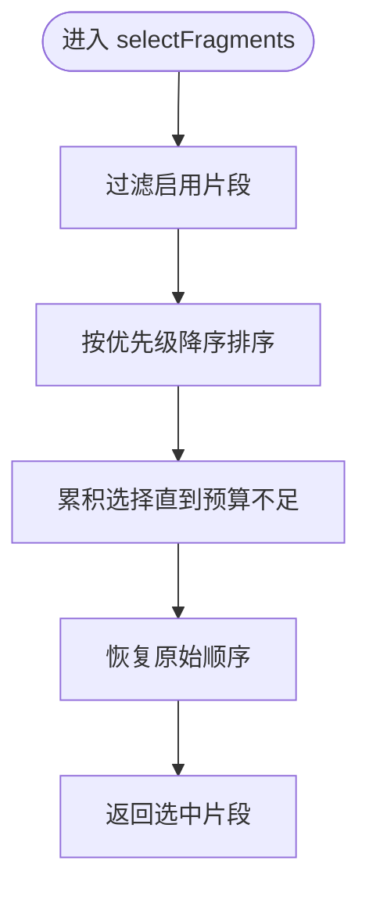
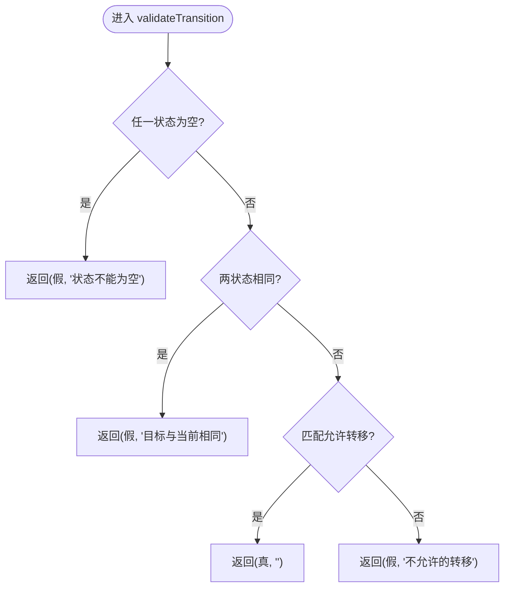
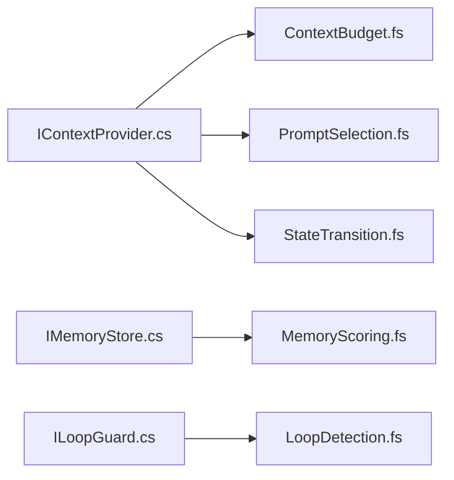

# 策略层

<cite>
**本文引用的文件**   
- [TinadecCore.Strategies.fsproj](file://TinadecCore/Strategies/TinadecCore.Strategies.fsproj)
- [ContextBudget.fs](file://TinadecCore/Strategies/ContextBudget.fs)
- [LoopDetection.fs](file://TinadecCore/Strategies/LoopDetection.fs)
- [MemoryScoring.fs](file://TinadecCore/Strategies/MemoryScoring.fs)
- [PromptSelection.fs](file://TinadecCore/Strategies/PromptSelection.fs)
- [StateTransition.fs](file://TinadecCore/Strategies/StateTransition.fs)
- [IContextProvider.cs](file://TinadecCore/Abstractions/Ports/IContextProvider.cs)
- [IMemoryStore.cs](file://TinadecCore/Abstractions/Ports/IMemoryStore.cs)
- [ILoopGuard.cs](file://TinadecCore/Abstractions/Ports/ILoopGuard.cs)
- [FSharpInteropTests.cs](file://TinadecCore/tests/TinadecCore.AgentFramework.Tests/FSharpInteropTests.cs)
</cite>

## 目录
1. [简介](#简介)
2. [项目结构](#项目结构)
3. [核心组件](#核心组件)
4. [架构总览](#架构总览)
5. [详细组件分析](#详细组件分析)
6. [依赖关系分析](#依赖关系分析)
7. [性能考量](#性能考量)
8. [故障排查指南](#故障排查指南)
9. [结论](#结论)
10. [附录](#附录)

## 简介
本章节面向 Core 核心层的策略系统，聚焦 F# 实现的纯函数算法与 C# 抽象接口的互操作。策略层提供上下文预算分配、循环检测、记忆评分、提示词选择与状态转换验证等关键能力，贯穿智能体的决策与控制流。通过“策略模式”将算法与运行时解耦，便于参数调优、替换实现与扩展自定义策略。

## 项目结构
策略模块以 F# 库形式组织，所有算法均为纯函数，无副作用，便于测试与组合。C# 侧通过 Abstractions 定义数据契约与端口接口，F# 策略直接消费这些类型，保证跨语言互操作的稳定性。



图表来源 
- [TinadecCore.Strategies.fsproj:1-27](file://TinadecCore/Strategies/TinadecCore.Strategies.fsproj#L1-L27)
- [IContextProvider.cs:1-37](file://TinadecCore/Abstractions/Ports/IContextProvider.cs#L1-L37)
- [IMemoryStore.cs:1-31](file://TinadecCore/Abstractions/Ports/IMemoryStore.cs#L1-L31)
- [ILoopGuard.cs:1-38](file://TinadecCore/Abstractions/Ports/ILoopGuard.cs#L1-L38)

章节来源
- [TinadecCore.Strategies.fsproj:1-27](file://TinadecCore/Strategies/TinadecCore.Strategies.fsproj#L1-L27)

## 核心组件
- 上下文预算管理(ContextBudget)：按证据项的预估 token 比例分配预算，支持超预算判断与利用率计算。
- 循环检测(LoopDetection)：基于工具调用指纹连续重复、迭代上限、token 预算耗尽、工具调用次数上限、连续错误数等条件判定是否继续。
- 记忆评分(MemoryScoring)：基于关键词重叠度对记忆条目打分并返回 Top-K。
- 提示词选择(PromptSelection)：在 token 预算内按优先级贪心选择启用的提示片段。
- 状态转换(StateTransition)：校验状态迁移是否合法，返回布尔与原因。

章节来源
- [ContextBudget.fs:1-36](file://TinadecCore/Strategies/ContextBudget.fs#L1-L36)
- [LoopDetection.fs:1-46](file://TinadecCore/Strategies/LoopDetection.fs#L1-L46)
- [MemoryScoring.fs:1-46](file://TinadecCore/Strategies/MemoryScoring.fs#L1-L46)
- [PromptSelection.fs:1-38](file://TinadecCore/Strategies/PromptSelection.fs#L1-L38)
- [StateTransition.fs:1-26](file://TinadecCore/Strategies/StateTransition.fs#L1-L26)

## 架构总览
策略层作为“纯函数内核”，被上层编排器或守护器（如 LoopGuard）组合使用。C# 侧通过接口暴露数据模型与行为，F# 策略仅依赖不可变数据结构与纯函数，确保可预测性与易测试性。

```mermaid
sequenceDiagram
participant Caller as "调用方(C#)"
participant Guard as "循环守卫(ILoopGuard)"
participant Budget as "上下文预算(ContextBudget)"
participant Loop as "循环检测(LoopDetection)"
participant Mem as "记忆评分(MemoryScoring)"
participant Prompt as "提示词选择(PromptSelection)"
participant State as "状态转换(StateTransition)"
Caller->>Guard : EvaluateAsync(context)
Guard->>Loop : detectRepeatCalls(fingerprints)
Guard->>Loop : isOverIterationLimit(iteration, max)
Guard->>Loop : isTokenBudgetExhausted(tokensUsed, budget)
Guard->>Loop : isToolCallLimitExceeded(count, max)
Guard->>Loop : hasTooManyConsecutiveErrors(errors, max)
alt 需要上下文
Guard->>Budget : allocateBudget(budget, evidence)
Budget-->>Guard : int[]
end
alt 需要记忆
Guard->>Mem : scoreEntries(query, entries)
Mem-->>Guard : (id,score)[]
end
alt 需要提示
Guard->>Prompt : selectFragments(budget, fragments)
Prompt-->>Guard : PromptFragment[]
end
Guard->>State : validateTransition(current, target)
State-->>Guard : (bool, reason)
Guard-->>Caller : LoopGuardDecision
```

图表来源 
- [ILoopGuard.cs:1-38](file://TinadecCore/Abstractions/Ports/ILoopGuard.cs#L1-L38)
- [ContextBudget.fs:1-36](file://TinadecCore/Strategies/ContextBudget.fs#L1-L36)
- [LoopDetection.fs:1-46](file://TinadecCore/Strategies/LoopDetection.fs#L1-L46)
- [MemoryScoring.fs:1-46](file://TinadecCore/Strategies/MemoryScoring.fs#L1-L46)
- [PromptSelection.fs:1-38](file://TinadecCore/Strategies/PromptSelection.fs#L1-L38)
- [StateTransition.fs:1-26](file://TinadecCore/Strategies/StateTransition.fs#L1-L26)

## 详细组件分析

### 上下文预算管理(ContextBudget)
- 目标：在证据集合上按比例分配 token 预算，避免超出限制。
- 输入：总预算、证据列表（含预估 token）。
- 输出：每个证据项分配的整数预算数组。
- 关键点：
  - 空输入返回空数组；权重计算时最小值为 1，防止除零。
  - 利用率 ratio = used / budget，budget<=0 时返回 1.0。
- 复杂度：O(n)，n 为证据数量。
- 适用场景：构建 ContextPack 后，依据证据内容大小动态切分预算。



图表来源 
- [ContextBudget.fs:11-24](file://TinadecCore/Strategies/ContextBudget.fs#L11-L24)

章节来源
- [ContextBudget.fs:1-36](file://TinadecCore/Strategies/ContextBudget.fs#L1-L36)
- [IContextProvider.cs:21-36](file://TinadecCore/Abstractions/Ports/IContextProvider.cs#L21-L36)

### 循环检测(LoopDetection)
- 目标：在多轮交互中识别“死循环”或“无进展”情况，及时终止或告警。
- 触发条件：
  - 连续相同工具调用指纹出现≥3次。
  - 迭代次数达到上限。
  - token 预算耗尽。
  - 工具调用次数达到上限。
  - 连续错误数达到上限。
- 复杂度：指纹检测 O(k)，k 为最近指纹长度。
- 适用场景：LoopGuard 评估上下文，决定是否继续执行。



图表来源 
- [LoopDetection.fs:11-21](file://TinadecCore/Strategies/LoopDetection.fs#L11-L21)

章节来源
- [LoopDetection.fs:1-46](file://TinadecCore/Strategies/LoopDetection.fs#L1-L46)
- [ILoopGuard.cs:17-30](file://TinadecCore/Abstractions/Ports/ILoopGuard.cs#L17-L30)

### 记忆评分(MemoryScoring)
- 目标：根据查询与记忆内容的关键词重叠度打分，返回 Top-K 结果。
- 输入：查询字符串、记忆条目列表（含 Content）。
- 输出：(Id, Score) 数组，分数为重叠词数除以查询词数。
- 关键点：
  - 忽略空白字符，统一小写。
  - 过滤分数≤0 的结果并按分数降序截取。
- 复杂度：O(n·m)，n 为条目数，m 为平均词数。



图表来源 
- [MemoryScoring.fs:11-32](file://TinadecCore/Strategies/MemoryScoring.fs#L11-L32)
- [MemoryScoring.fs:37-45](file://TinadecCore/Strategies/MemoryScoring.fs#L37-L45)

章节来源
- [MemoryScoring.fs:1-46](file://TinadecCore/Strategies/MemoryScoring.fs#L1-L46)
- [IMemoryStore.cs:21-30](file://TinadecCore/Abstractions/Ports/IMemoryStore.cs#L21-L30)

### 提示词选择(PromptSelection)
- 目标：在 token 预算内，按优先级从高到低贪心选择启用的提示片段。
- 输入：token 预算、片段列表（含 Id、Priority、EstimatedTokens、Enabled）。
- 输出：选中的片段数组。
- 关键点：
  - 仅考虑 Enabled=true 的片段。
  - 按 Priority 降序，累加 EstimatedTokens 直到无法容纳。
- 复杂度：O(n log n) 排序 + O(n) 扫描。



图表来源 
- [PromptSelection.fs:22-37](file://TinadecCore/Strategies/PromptSelection.fs#L22-L37)

章节来源
- [PromptSelection.fs:1-38](file://TinadecCore/Strategies/PromptSelection.fs#L1-L38)
- [IContextProvider.cs:21-28](file://TinadecCore/Abstractions/Ports/IContextProvider.cs#L21-L28)

### 状态转换(StateTransition)
- 目标：校验从当前状态到目标状态的迁移是否允许。
- 输入：当前状态、目标状态。
- 输出：(是否合法, 原因)。
- 规则示例：pending→running、running→completed/failed/cancelled、pending→cancelled、failed→pending、cancelled→pending 等。
- 复杂度：O(1)。



图表来源 
- [StateTransition.fs:10-26](file://TinadecCore/Strategies/StateTransition.fs#L10-L26)

章节来源
- [StateTransition.fs:1-26](file://TinadecCore/Strategies/StateTransition.fs#L1-L26)

## 依赖关系分析
- F# 策略仅依赖 C# 抽象层的数据类型（如 ContextEvidence、MemoryEntry），不依赖具体实现，保持低耦合。
- LoopGuard 作为协调者，组合多个策略进行决策。
- 测试覆盖跨语言互操作，确保 F# 函数对外暴露的类型为 C# 兼容类型。



图表来源 
- [IContextProvider.cs:1-37](file://TinadecCore/Abstractions/Ports/IContextProvider.cs#L1-L37)
- [IMemoryStore.cs:1-31](file://TinadecCore/Abstractions/Ports/IMemoryStore.cs#L1-L31)
- [ILoopGuard.cs:1-38](file://TinadecCore/Abstractions/Ports/ILoopGuard.cs#L1-L38)
- [ContextBudget.fs:1-36](file://TinadecCore/Strategies/ContextBudget.fs#L1-L36)
- [MemoryScoring.fs:1-46](file://TinadecCore/Strategies/MemoryScoring.fs#L1-L46)
- [LoopDetection.fs:1-46](file://TinadecCore/Strategies/LoopDetection.fs#L1-L46)
- [PromptSelection.fs:1-38](file://TinadecCore/Strategies/PromptSelection.fs#L1-L38)
- [StateTransition.fs:1-26](file://TinadecCore/Strategies/StateTransition.fs#L1-L26)

章节来源
- [FSharpInteropTests.cs:1-118](file://TinadecCore/tests/TinadecCore.AgentFramework.Tests/FSharpInteropTests.cs#L1-L118)

## 性能考量
- 时间复杂度
  - ContextBudget.allocateBudget：O(n)
  - LoopDetection.detectRepeatCalls：O(k)
  - MemoryScoring.scoreEntries：O(n·m)
  - PromptSelection.selectFragments：O(n log n)
  - StateTransition.validateTransition：O(1)
- 空间复杂度
  - 各函数均返回新数组/元组，内存占用与输入规模线性相关。
- 优化建议
  - 对高频调用路径缓存排序结果（如固定优先级的片段集）。
  - 对 MemoryScoring 的词表构建可引入预分词与索引。
  - 对 LoopDetection 的指纹滑动窗口可采用环形缓冲减少分配。

[本节为通用指导，不直接分析具体文件]

## 故障排查指南
- 常见问题
  - 预算分配异常：检查证据 EstimatedTokens 是否为正数，避免除零或负权重。
  - 循环误判：确认指纹生成逻辑稳定，避免随机噪声导致连续重复。
  - 记忆评分过低：检查分词与大小写处理是否与业务一致。
  - 提示词未入选：核对 Enabled 标志与 EstimatedTokens 估算准确性。
  - 状态转换失败：核对状态机规则，确保初始状态与目标状态符合允许转移。
- 定位方法
  - 使用单元测试断言边界条件（空输入、单元素、最大值）。
  - 在 LoopGuard 评估链路中打印中间变量（iteration、tokensUsed、toolCallCount、consecutiveErrors）。
  - 对 MemoryScoring 输出调试分数分布，必要时调整分词策略。

章节来源
- [FSharpInteropTests.cs:14-116](file://TinadecCore/tests/TinadecCore.AgentFramework.Tests/FSharpInteropTests.cs#L14-L116)
- [ILoopGuard.cs:17-30](file://TinadecCore/Abstractions/Ports/ILoopGuard.cs#L17-L30)

## 结论
策略层以 F# 纯函数为核心，结合 C# 抽象接口，形成高内聚、低耦合的智能决策内核。通过清晰的职责划分与严格的类型契约，既保证了算法的可测试性与可替换性，也为上层编排提供了稳定的扩展点。建议在业务演进中持续完善策略配置与参数调优机制，并补充更多端到端用例以验证复杂场景下的稳定性。

[本节为总结性内容，不直接分析具体文件]

## 附录
- 策略配置与参数调优
  - 上下文预算：合理设置总预算与证据预估 token，避免过度裁剪或溢出。
  - 循环检测：根据任务特性调整 MaxIterations、MaxToolCalls、MaxConsecutiveErrors。
  - 记忆评分：调整分词粒度与阈值，平衡召回率与准确率。
  - 提示词选择：校准优先级与 EstimatedTokens，确保关键信息不被丢弃。
  - 状态转换：维护清晰的状态机图，新增状态需同步更新规则。
- 自定义策略开发指南
  - 保持纯函数风格，避免副作用与全局状态。
  - 输入输出使用 C# 兼容类型（数组、基本类型、记录）。
  - 编写单元测试覆盖边界与典型路径。
  - 在 LoopGuard 或编排器中组合新策略，保持可扩展性。

[本节为通用指导，不直接分析具体文件]