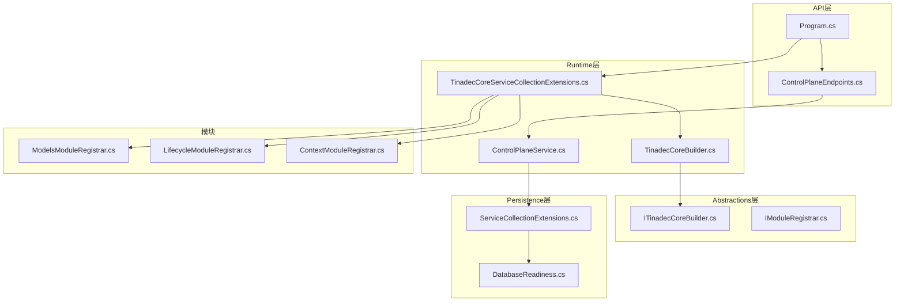
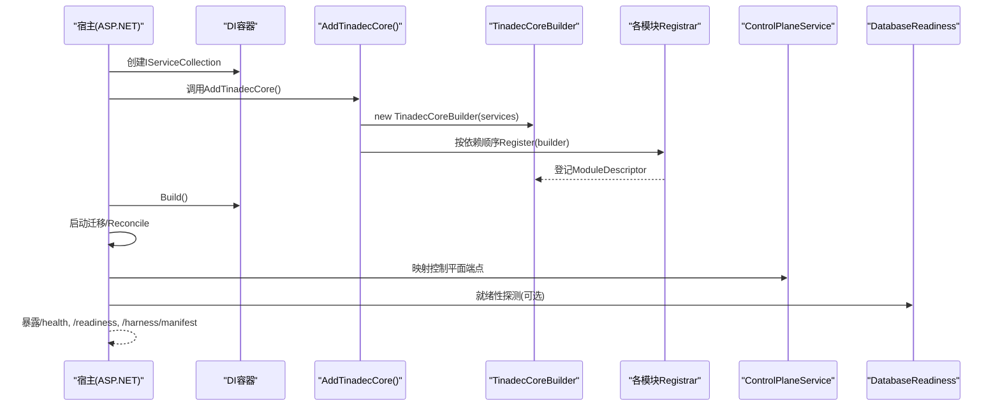
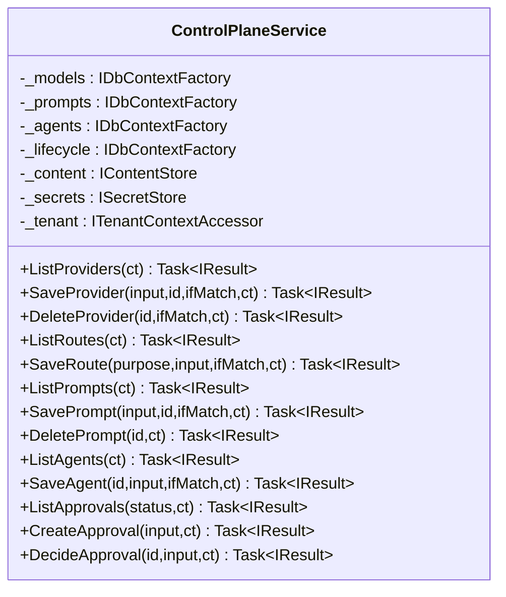
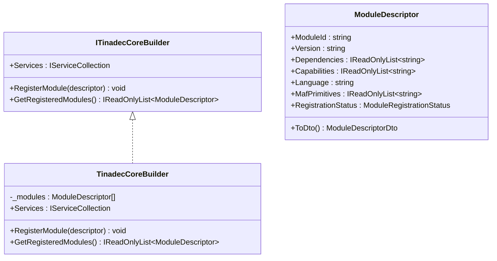
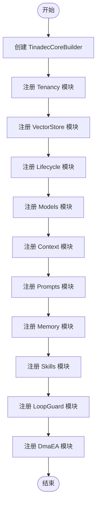
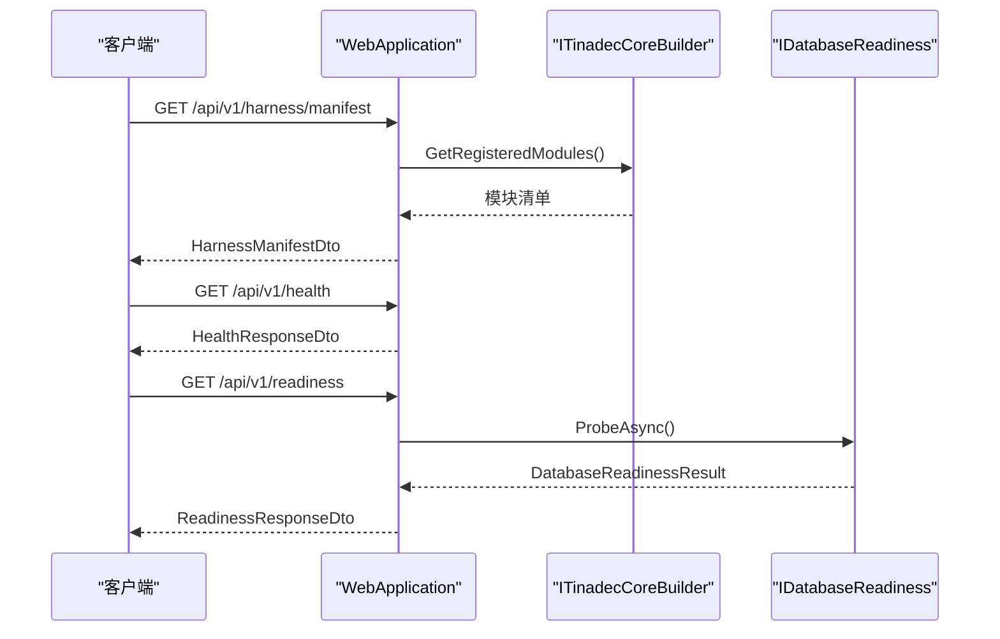
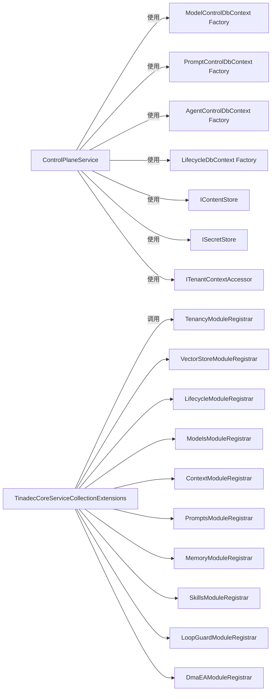

# 运行时管理

<cite>
**本文引用的文件**
- [ControlPlaneService.cs](file://TinadecCore/Runtime/ControlPlaneService.cs)
- [TinadecCoreBuilder.cs](file://TinadecCore/Runtime/TinadecCoreBuilder.cs)
- [ITinadecCoreBuilder.cs](file://TinadecCore/Abstractions/ITinadecCoreBuilder.cs)
- [IModuleRegistrar.cs](file://TinadecCore/Abstractions/IModuleRegistrar.cs)
- [TinadecCoreServiceCollectionExtensions.cs](file://TinadecCore/Runtime/TinadecCoreServiceCollectionExtensions.cs)
- [ContextModuleRegistrar.cs](file://TinadecCore/Context/ContextModuleRegistrar.cs)
- [LifecycleModuleRegistrar.cs](file://TinadecCore/Lifecycle/LifecycleModuleRegistrar.cs)
- [ModelsModuleRegistrar.cs](file://TinadecCore/Models/ModelsModuleRegistrar.cs)
- [ServiceCollectionExtensions.cs](file://TinadecCore/Persistence/ServiceCollectionExtensions.cs)
- [DatabaseReadiness.cs](file://TinadecCore/Persistence/DatabaseReadiness.cs)
- [HealthResponseDto.cs](file://TinadecCore/Contracts/Dtos/HealthResponseDto.cs)
- [Program.cs](file://TinadecCore/Api/Program.cs)
- [ControlPlaneEndpoints.cs](file://TinadecCore/Api/Endpoints/ControlPlaneEndpoints.cs)
</cite>

## 目录
1. [简介](#简介)
2. [项目结构](#项目结构)
3. [核心组件](#核心组件)
4. [架构总览](#架构总览)
5. [详细组件分析](#详细组件分析)
6. [依赖关系分析](#依赖关系分析)
7. [性能考量](#性能考量)
8. [故障排查指南](#故障排查指南)
9. [结论](#结论)
10. [附录：扩展与自定义示例](#附录扩展与自定义示例)

## 简介
本章节面向初学者与中高级开发者，系统化阐述 Core 核心层的“运行时管理系统”。重点包括：
- ControlPlaneService 控制平面服务的职责边界、生命周期与对外 API 能力
- ITinadecCoreBuilder 构建器与 Fluent API 的模块注册机制
- 服务发现、健康检查、启动顺序控制等运行时特性
- .NET DI 容器与 MAF（Microsoft Agent Framework）集成方式
- 如何扩展和自定义运行时行为（新增模块、替换实现、调整启动流程）

## 项目结构
运行时相关代码主要分布在 TinadecCore 工程下：
- Abstractions：定义构建器接口、模块注册器接口、端口抽象
- Runtime：构建器实现、服务集合扩展、控制平面服务
- Persistence：数据库连接、就绪性探测、内容存储与密钥存储抽象及默认实现
- Api：Web 应用入口、端点映射、健康与就绪性端点
- 各业务模块（如 Models、Lifecycle、Context 等）通过 IModuleRegistrar 声明式注册

图表来源
- [Program.cs](file://TinadecCore/Api/Program.cs)
- [ControlPlaneEndpoints.cs](file://TinadecCore/Api/Endpoints/ControlPlaneEndpoints.cs)
- [TinadecCoreBuilder.cs](file://TinadecCore/Runtime/TinadecCoreBuilder.cs)
- [ITinadecCoreBuilder.cs](file://TinadecCore/Abstractions/ITinadecCoreBuilder.cs)
- [IModuleRegistrar.cs](file://TinadecCore/Abstractions/IModuleRegistrar.cs)
- [TinadecCoreServiceCollectionExtensions.cs](file://TinadecCore/Runtime/TinadecCoreServiceCollectionExtensions.cs)
- [ServiceCollectionExtensions.cs](file://TinadecCore/Persistence/ServiceCollectionExtensions.cs)
- [DatabaseReadiness.cs](file://TinadecCore/Persistence/DatabaseReadiness.cs)
- [ModelsModuleRegistrar.cs](file://TinadecCore/Models/ModelsModuleRegistrar.cs)
- [LifecycleModuleRegistrar.cs](file://TinadecCore/Lifecycle/LifecycleModuleRegistrar.cs)
- [ContextModuleRegistrar.cs](file://TinadecCore/Context/ContextModuleRegistrar.cs)

章节来源
- [Program.cs:1-181](file://TinadecCore/Api/Program.cs#L1-L181)
- [TinadecCoreServiceCollectionExtensions.cs:1-61](file://TinadecCore/Runtime/TinadecCoreServiceCollectionExtensions.cs#L1-L61)

## 核心组件
- ControlPlaneService：控制平面服务，提供模型提供者、路由、提示词片段、智能体配置与审批请求等管理能力；通过多 DbContextFactory 访问不同领域数据，并借助内容存储与密钥存储完成版本化与敏感信息管理。
- ITinadecCoreBuilder / TinadecCoreBuilder：Fluent 构建器，收集模块描述符并委托 DI 进行服务注册；暴露 GetRegisteredModules 用于服务发现与清单生成。
- IModuleRegistrar：模块注册器契约，每个业务模块实现该接口以声明自身能力、依赖与 MAF 原语，并以显式顺序调用 Register(builder)。
- 持久化扩展 AddTinadecPersistence：统一注入数据库连接信息、内容存储、密钥存储、迁移运行器等基础设施。
- DatabaseReadiness：数据库就绪性探测，支持 SQLite/PostgreSQL 探针，为就绪性端点提供状态。

章节来源
- [ControlPlaneService.cs:14-71](file://TinadecCore/Runtime/ControlPlaneService.cs#L14-L71)
- [ITinadecCoreBuilder.cs:10-52](file://TinadecCore/Abstractions/ITinadecCoreBuilder.cs#L10-L52)
- [TinadecCoreBuilder.cs:11-31](file://TinadecCore/Runtime/TinadecCoreBuilder.cs#L11-L31)
- [IModuleRegistrar.cs:9-17](file://TinadecCore/Abstractions/IModuleRegistrar.cs#L9-L17)
- [ServiceCollectionExtensions.cs:15-49](file://TinadecCore/Persistence/ServiceCollectionExtensions.cs#L15-L49)
- [DatabaseReadiness.cs:24-73](file://TinadecCore/Persistence/DatabaseReadiness.cs#L24-L73)

## 架构总览
下图展示从 Web 应用启动到模块注册、控制平面服务暴露 API、以及健康与就绪性检查的整体流程。

图表来源
- [Program.cs:23-39](file://TinadecCore/Api/Program.cs#L23-L39)
- [TinadecCoreServiceCollectionExtensions.cs:25-43](file://TinadecCore/Runtime/TinadecCoreServiceCollectionExtensions.cs#L25-L43)
- [TinadecCoreBuilder.cs:15-20](file://TinadecCore/Runtime/TinadecCoreBuilder.cs#L15-L20)
- [DatabaseReadiness.cs:24-73](file://TinadecCore/Persistence/DatabaseReadiness.cs#L24-L73)

## 详细组件分析

### ControlPlaneService 控制平面服务
职责与能力
- 模型提供者管理：列出/保存/删除 Provider，版本化配置，关联 Secret 存储，返回启用状态与能力摘要。
- 路由管理：按 Purpose 维护路由版本，绑定 Provider 实例与 Model。
- 提示词片段管理：CRUD 与版本化，内置片段只读保护。
- 智能体配置：Profile 版本化，包含模式、工具白名单、能力、系统提示等。
- 审批流：创建/查询/决策审批请求，带过期策略与审计记录。

关键设计要点
- 使用 IDbContextFactory<T> 按需创建 DbContext，避免长生命周期上下文带来的并发问题。
- 通过 IContentStore 持久化 JSON 配置，结合 ISecretStore 管理敏感信息。
- 基于 If-Match 头实现乐观并发控制（Revision）。
- 租户与工作区隔离：所有查询均按 TenantId/WorkspaceId 过滤。

图表来源
- [ControlPlaneService.cs:14-71](file://TinadecCore/Runtime/ControlPlaneService.cs#L14-L71)

章节来源
- [ControlPlaneService.cs:36-70](file://TinadecCore/Runtime/ControlPlaneService.cs#L36-L70)

### ITinadecCoreBuilder 构建器与 Fluent API
设计模式
- 构建器模式：集中收集 ModuleDescriptor，延迟执行 DI 注册。
- Fluent API：通过 AddTinadecCore/AddTinadecCoreMinimal 链式注册模块，便于最小化或全量装配。
- 服务发现：GetRegisteredModules 暴露已注册模块清单，供 /harness/manifest 端点消费。

图表来源
- [ITinadecCoreBuilder.cs:10-44](file://TinadecCore/Abstractions/ITinadecCoreBuilder.cs#L10-L44)
- [TinadecCoreBuilder.cs:11-31](file://TinadecCore/Runtime/TinadecCoreBuilder.cs#L11-L31)

章节来源
- [ITinadecCoreBuilder.cs:10-52](file://TinadecCore/Abstractions/ITinadecCoreBuilder.cs#L10-L52)
- [TinadecCoreBuilder.cs:11-31](file://TinadecCore/Runtime/TinadecCoreBuilder.cs#L11-L31)

### 模块注册机制与启动顺序
- 显式注册：无反射扫描，依赖顺序由 AddTinadecCore 内部调用顺序决定。
- 典型顺序：Tenancy → VectorStore → Lifecycle → Models → Context → Prompts → Memory → Skills → LoopGuard → DmaEA。
- 每个模块在 Register 中：
  - 向 IServiceCollection 注册服务（如 DbContextFactory、单例服务等）
  - 向 builder.RegisterModule 登记 ModuleDescriptor（含依赖、能力、MAF 原语、状态）

图表来源
- [TinadecCoreServiceCollectionExtensions.cs:25-43](file://TinadecCore/Runtime/TinadecCoreServiceCollectionExtensions.cs#L25-L43)

章节来源
- [TinadecCoreServiceCollectionExtensions.cs:25-43](file://TinadecCore/Runtime/TinadecCoreServiceCollectionExtensions.cs#L25-L43)
- [LifecycleModuleRegistrar.cs:17-35](file://TinadecCore/Lifecycle/LifecycleModuleRegistrar.cs#L17-L35)
- [ModelsModuleRegistrar.cs:20-36](file://TinadecCore/Models/ModelsModuleRegistrar.cs#L20-L36)
- [ContextModuleRegistrar.cs:14-27](file://TinadecCore/Context/ContextModuleRegistrar.cs#L14-L27)

### 服务发现与健康检查
- 服务发现：/api/v1/harness/manifest 返回框架信息与 Modules 清单（来自 builder.GetRegisteredModules）。
- 健康检查：/api/v1/health 返回兼容旧版结构的 HealthResponseDto。
- 就绪性检查：/api/v1/readiness 聚合模块状态与数据库就绪性（DatabaseReadiness.ProbeAsync），输出 warning/ready。

图表来源
- [Program.cs:58-117](file://TinadecCore/Api/Program.cs#L58-L117)
- [Program.cs:122-164](file://TinadecCore/Api/Program.cs#L122-L164)
- [DatabaseReadiness.cs:24-73](file://TinadecCore/Persistence/DatabaseReadiness.cs#L24-L73)

章节来源
- [Program.cs:44-53](file://TinadecCore/Api/Program.cs#L44-L53)
- [Program.cs:58-117](file://TinadecCore/Api/Program.cs#L58-L117)
- [Program.cs:122-164](file://TinadecCore/Api/Program.cs#L122-L164)
- [HealthResponseDto.cs:6-12](file://TinadecCore/Contracts/Dtos/HealthResponseDto.cs#L6-L12)

### 启动顺序控制与迁移
- 启动阶段：先 AddTinadecPersistence，再 AddTinadecCore，随后根据配置运行迁移与 Reconcile。
- 迁移参与者：StorageMigrationRunner 与 StorageLifecycleService.ReconcileAsync 确保数据一致。
- 就绪性探针：DatabaseReadiness 对 SQLite/PostgreSQL 执行 SELECT 1 探测，超时受配置限制。

章节来源
- [Program.cs:21-39](file://TinadecCore/Api/Program.cs#L21-L39)
- [ServiceCollectionExtensions.cs:15-49](file://TinadecCore/Persistence/ServiceCollectionExtensions.cs#L15-L49)
- [DatabaseReadiness.cs:24-73](file://TinadecCore/Persistence/DatabaseReadiness.cs#L24-L73)

## 依赖关系分析
- 控制平面服务依赖多个 DbContextFactory、IContentStore、ISecretStore、ITenantContextAccessor。
- 模块注册器依赖各自领域的 DbContext 与基础设施（如 Persistence）。
- 构建器依赖 IServiceCollection，并通过扩展方法串联模块注册。

图表来源
- [ControlPlaneService.cs:14-27](file://TinadecCore/Runtime/ControlPlaneService.cs#L14-L27)
- [TinadecCoreServiceCollectionExtensions.cs:25-43](file://TinadecCore/Runtime/TinadecCoreServiceCollectionExtensions.cs#L25-L43)

章节来源
- [ControlPlaneService.cs:14-27](file://TinadecCore/Runtime/ControlPlaneService.cs#L14-L27)
- [TinadecCoreServiceCollectionExtensions.cs:25-43](file://TinadecCore/Runtime/TinadecCoreServiceCollectionExtensions.cs#L25-L43)

## 性能考量
- DbContextFactory：按需创建上下文，避免长生命周期导致的内存与锁竞争。
- 内容存储与密钥存储：大对象（JSON）走 IContentStore 流式读写，减少内存峰值。
- 就绪性探针：设置合理超时，避免阻塞启动。
- 模块最小化：AddTinadecCoreMinimal 仅注册必要模块，降低编译裁剪与运行时开销。

[本节为通用指导，不直接分析具体文件]

## 故障排查指南
- 健康检查失败：确认 /api/v1/health 是否返回 ok，检查日志与依赖服务可用性。
- 就绪性警告：/api/v1/readiness 显示 not_configured 或 unavailable 时，检查数据库连接与配置。
- 控制平面写入冲突：If-Match 不匹配将返回 412，需获取最新 Revision 后重试。
- 内置资源只读：内置提示词片段与智能体不可直接修改，需克隆后再编辑。

章节来源
- [Program.cs:44-53](file://TinadecCore/Api/Program.cs#L44-L53)
- [Program.cs:122-164](file://TinadecCore/Api/Program.cs#L122-L164)
- [ControlPlaneService.cs:44-60](file://TinadecCore/Runtime/ControlPlaneService.cs#L44-L60)

## 结论
运行时管理系统通过构建器与模块注册器实现了高内聚、低耦合的装配体系；控制平面服务提供了统一的配置与管理面；健康与就绪性检查保障可观测性与稳定性。通过显式注册与 Fluent API，既保证了启动顺序与依赖正确性，又为扩展与定制提供了清晰路径。

[本节为总结，不直接分析具体文件]

## 附录：扩展与自定义示例
- 新增模块
  - 实现 IModuleRegistrar，在 Register 中注册服务并调用 builder.RegisterModule。
  - 在 AddTinadecCore 或自定义扩展中按依赖顺序调用新模块的 Register。
- 替换实现
  - 通过 Services.AddSingleton/Replace 替换 IModelProvider、IEmbeddingProvider、IContentStore、ISecretStore 等接口实现。
- 调整启动流程
  - 在 Program 中 AddTinadecPersistence 之后、AddTinadecCore 之前插入自定义初始化逻辑。
  - 使用 IStorageMigrationParticipant 参与迁移钩子。
- 集成 MAF
  - 在 ModuleDescriptor.MafPrimitives 中声明所需原语（如 context、session、checkpoint），以便上层编排识别。

章节来源
- [IModuleRegistrar.cs:9-17](file://TinadecCore/Abstractions/IModuleRegistrar.cs#L9-L17)
- [TinadecCoreServiceCollectionExtensions.cs:25-43](file://TinadecCore/Runtime/TinadecCoreServiceCollectionExtensions.cs#L25-L43)
- [ServiceCollectionExtensions.cs:15-49](file://TinadecCore/Persistence/ServiceCollectionExtensions.cs#L15-L49)
- [Program.cs:21-39](file://TinadecCore/Api/Program.cs#L21-L39)