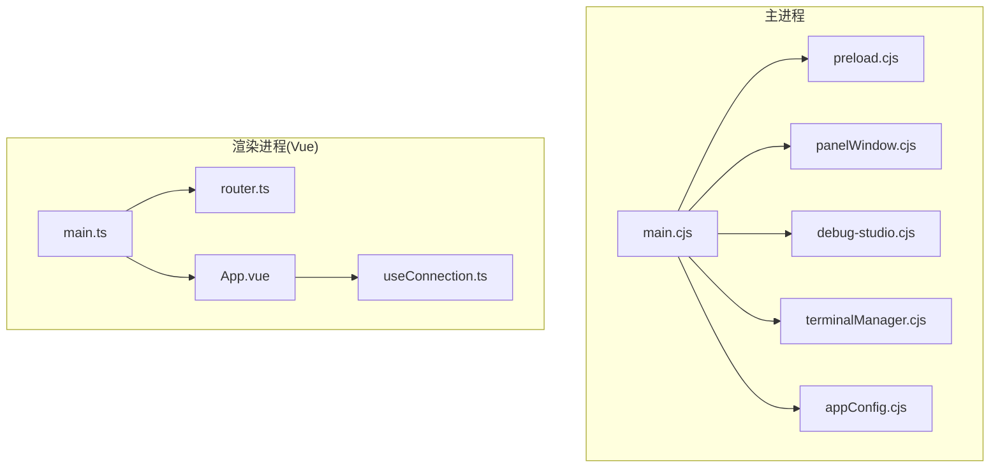
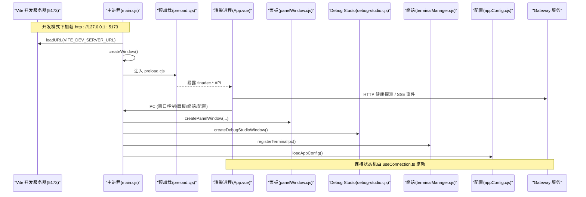
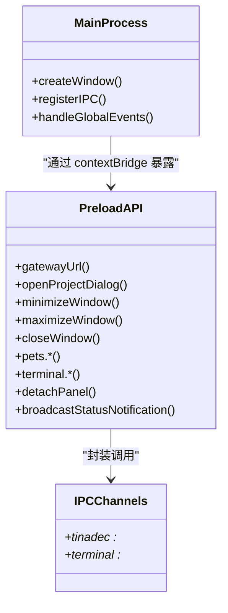
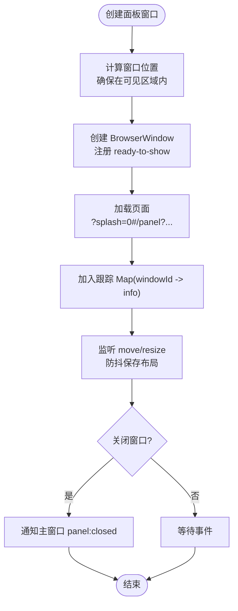
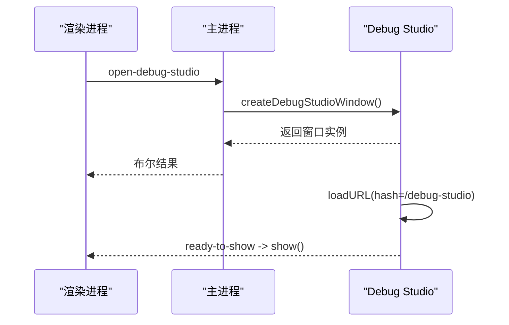
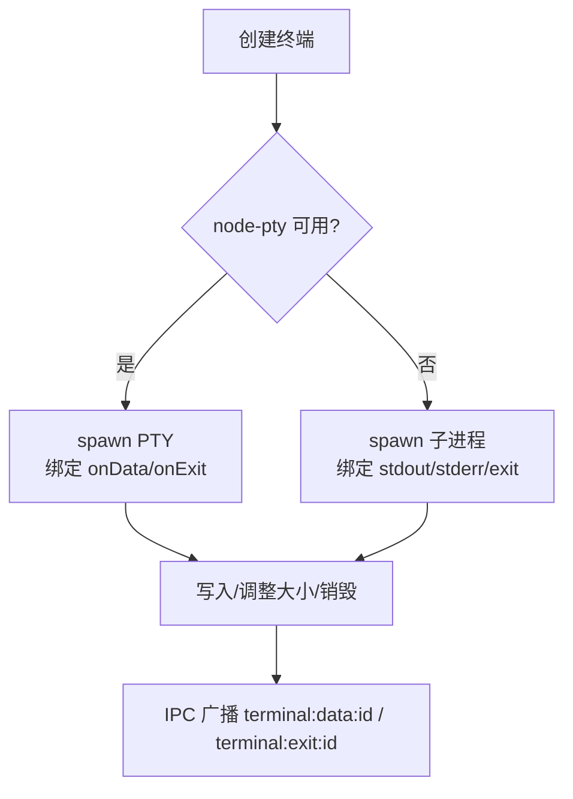
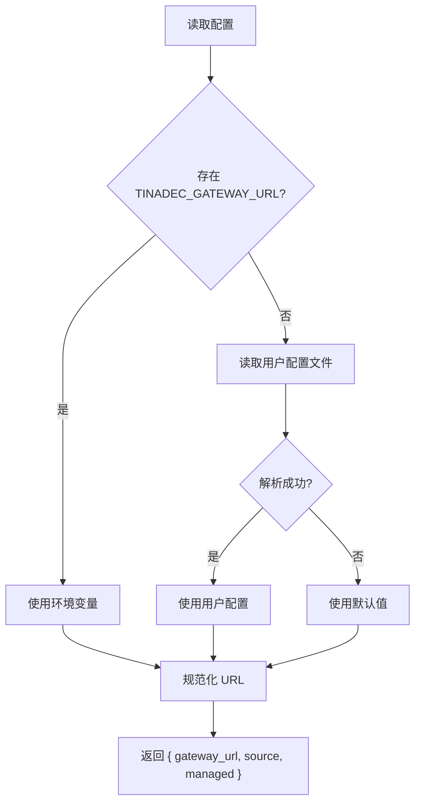
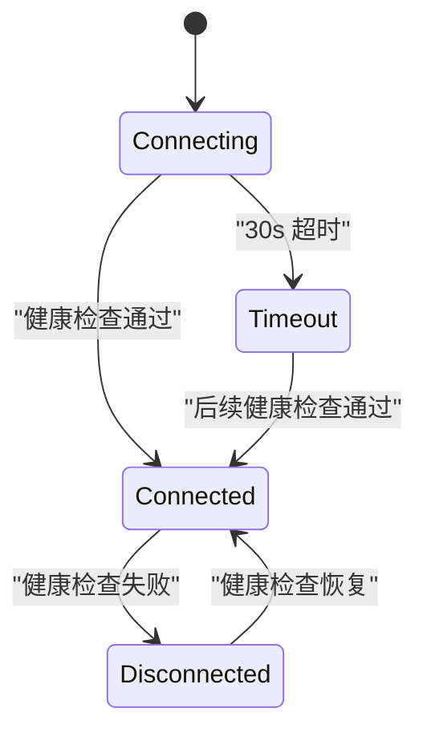
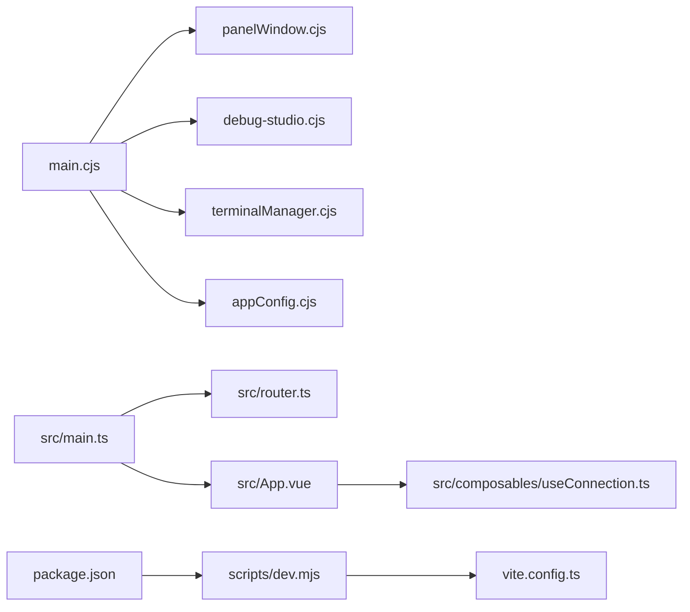

# Desktop 桌面层

<cite>
**本文引用的文件**   
- [apps/desktop/package.json](file://apps/desktop/package.json)
- [apps/desktop/vite.config.ts](file://apps/desktop/vite.config.ts)
- [apps/desktop/scripts/dev.mjs](file://apps/desktop/scripts/dev.mjs)
- [apps/desktop/electron/main.cjs](file://apps/desktop/electron/main.cjs)
- [apps/desktop/electron/preload.cjs](file://apps/desktop/electron/preload.cjs)
- [apps/desktop/electron/panelWindow.cjs](file://apps/desktop/electron/panelWindow.cjs)
- [apps/desktop/electron/debug-studio.cjs](file://apps/desktop/electron/debug-studio.cjs)
- [apps/desktop/electron/appConfig.cjs](file://apps/desktop/electron/appConfig.cjs)
- [apps/desktop/electron/terminalManager.cjs](file://apps/desktop/electron/terminalManager.cjs)
- [apps/desktop/src/main.ts](file://apps/desktop/src/main.ts)
- [apps/desktop/src/router.ts](file://apps/desktop/src/router.ts)
- [apps/desktop/src/App.vue](file://apps/desktop/src/App.vue)
- [apps/desktop/src/composables/useConnection.ts](file://apps/desktop/src/composables/useConnection.ts)
</cite>

## 目录
1. [简介](#简介)
2. [项目结构](#项目结构)
3. [核心组件](#核心组件)
4. [架构总览](#架构总览)
5. [详细组件分析](#详细组件分析)
6. [依赖关系分析](#依赖关系分析)
7. [性能考量](#性能考量)
8. [故障排查指南](#故障排查指南)
9. [结论](#结论)
10. [附录](#附录)

## 简介
本章节面向初学者与有经验的开发者，系统性阐述 TinadecOffice 的 Desktop 桌面层：基于 Electron + Vue 3 的架构、主进程与渲染进程的通信机制、窗口管理与面板系统、Agent Debug Studio 独立 BrowserWindow 设计、Electron preload API 的安全隔离、以及桌面应用与 Gateway 服务的 HTTP/SSE 通信模式。同时涵盖端口配置（开发服务器 5173）、开发环境搭建与构建打包流程。

## 项目结构
Desktop 子工程位于 apps/desktop，采用“主进程（Electron）+ 渲染进程（Vue 3 + Vite）”的经典双进程架构：
- 主进程入口：electron/main.cjs
- 预加载脚本：electron/preload.cjs
- 窗口管理：electron/panelWindow.cjs、electron/debug-studio.cjs
- 终端管理：electron/terminalManager.cjs
- 应用配置：electron/appConfig.cjs
- 前端入口：src/main.ts、路由：src/router.ts、根组件：src/App.vue
- 构建与开发：vite.config.ts、scripts/dev.mjs、package.json

图表来源
- [apps/desktop/electron/main.cjs:1-120](file://apps/desktop/electron/main.cjs#L1-L120)
- [apps/desktop/electron/preload.cjs:1-112](file://apps/desktop/electron/preload.cjs#L1-L112)
- [apps/desktop/electron/panelWindow.cjs:1-120](file://apps/desktop/electron/panelWindow.cjs#L1-L120)
- [apps/desktop/electron/debug-studio.cjs:1-96](file://apps/desktop/electron/debug-studio.cjs#L1-L96)
- [apps/desktop/electron/terminalManager.cjs:1-60](file://apps/desktop/electron/terminalManager.cjs#L1-L60)
- [apps/desktop/electron/appConfig.cjs:1-74](file://apps/desktop/electron/appConfig.cjs#L1-L74)
- [apps/desktop/src/main.ts:1-24](file://apps/desktop/src/main.ts#L1-L24)
- [apps/desktop/src/router.ts:1-45](file://apps/desktop/src/router.ts#L1-L45)
- [apps/desktop/src/App.vue:1-182](file://apps/desktop/src/App.vue#L1-L182)
- [apps/desktop/src/composables/useConnection.ts:1-138](file://apps/desktop/src/composables/useConnection.ts#L1-L138)

章节来源
- [apps/desktop/package.json:1-69](file://apps/desktop/package.json#L1-L69)
- [apps/desktop/vite.config.ts:1-37](file://apps/desktop/vite.config.ts#L1-L37)
- [apps/desktop/scripts/dev.mjs:1-98](file://apps/desktop/scripts/dev.mjs#L1-L98)

## 核心组件
- 主进程（main.cjs）：创建主窗口、注册 IPC、启动 Dev Server 或加载 dist、恢复面板布局、处理全局事件（最小化/最大化/关闭等）。
- 预加载（preload.cjs）：通过 contextBridge 暴露安全 API 给渲染进程，屏蔽 Node 直接访问，实现最小权限原则。
- 面板系统（panelWindow.cjs）：管理独立浮动面板窗口，支持拖拽分离、位置持久化、主题广播、重附着回主窗口。
- Agent Debug Studio（debug-studio.cjs）：独立的 BrowserWindow，复用相同 preload 与安全策略，使用 hash 路由进入调试页面。
- 终端管理器（terminalManager.cjs）：基于 node-pty（优先）或 child_process.spawn（降级），跨窗口广播数据与退出事件。
- 应用配置（appConfig.cjs）：Gateway URL 的来源优先级（环境变量 > 用户配置 > 默认值），并做严格校验。
- 前端（Vue）：main.ts 初始化应用；router.ts 定义页面路由；App.vue 控制连接状态机与背景层；useConnection.ts 负责健康探测与重试。

章节来源
- [apps/desktop/electron/main.cjs:1-120](file://apps/desktop/electron/main.cjs#L1-L120)
- [apps/desktop/electron/preload.cjs:1-112](file://apps/desktop/electron/preload.cjs#L1-L112)
- [apps/desktop/electron/panelWindow.cjs:120-303](file://apps/desktop/electron/panelWindow.cjs#L120-L303)
- [apps/desktop/electron/debug-studio.cjs:1-96](file://apps/desktop/electron/debug-studio.cjs#L1-L96)
- [apps/desktop/electron/terminalManager.cjs:170-248](file://apps/desktop/electron/terminalManager.cjs#L170-L248)
- [apps/desktop/electron/appConfig.cjs:1-74](file://apps/desktop/electron/appConfig.cjs#L1-L74)
- [apps/desktop/src/main.ts:1-24](file://apps/desktop/src/main.ts#L1-L24)
- [apps/desktop/src/router.ts:1-45](file://apps/desktop/src/router.ts#L1-L45)
- [apps/desktop/src/App.vue:1-182](file://apps/desktop/src/App.vue#L1-L182)
- [apps/desktop/src/composables/useConnection.ts:1-138](file://apps/desktop/src/composables/useConnection.ts#L1-L138)

## 架构总览
下图展示主进程与渲染进程的交互、窗口体系与外部服务通信路径。

图表来源
- [apps/desktop/scripts/dev.mjs:58-98](file://apps/desktop/scripts/dev.mjs#L58-L98)
- [apps/desktop/vite.config.ts:15-19](file://apps/desktop/vite.config.ts#L15-L19)
- [apps/desktop/electron/main.cjs:59-105](file://apps/desktop/electron/main.cjs#L59-L105)
- [apps/desktop/electron/preload.cjs:1-112](file://apps/desktop/electron/preload.cjs#L1-L112)
- [apps/desktop/src/composables/useConnection.ts:105-129](file://apps/desktop/src/composables/useConnection.ts#L105-L129)
- [apps/desktop/electron/panelWindow.cjs:145-303](file://apps/desktop/electron/panelWindow.cjs#L145-L303)
- [apps/desktop/electron/debug-studio.cjs:12-83](file://apps/desktop/electron/debug-studio.cjs#L12-L83)
- [apps/desktop/electron/terminalManager.cjs:476-506](file://apps/desktop/electron/terminalManager.cjs#L476-L506)
- [apps/desktop/electron/appConfig.cjs:28-40](file://apps/desktop/electron/appConfig.cjs#L28-L40)

## 详细组件分析

### 主进程与预加载：IPC 与安全隔离
- 主进程在创建窗口时启用 contextIsolation、禁用 nodeIntegration，并通过 preload 暴露最小 API 集合。
- 预加载通过 contextBridge.exposeInMainWorld 将 tinadec.* 方法暴露给 window，封装所有 IPC 调用，避免渲染进程直接访问 Node/Electron 能力。
- 主进程集中处理窗口控制、面板、宠物窗口、终端、配置等 IPC 通道，保证统一入口与权限控制。

图表来源
- [apps/desktop/electron/main.cjs:59-126](file://apps/desktop/electron/main.cjs#L59-L126)
- [apps/desktop/electron/preload.cjs:1-112](file://apps/desktop/electron/preload.cjs#L1-L112)

章节来源
- [apps/desktop/electron/main.cjs:1-126](file://apps/desktop/electron/main.cjs#L1-L126)
- [apps/desktop/electron/preload.cjs:1-112](file://apps/desktop/electron/preload.cjs#L1-L112)

### 窗口管理与面板系统
- 主窗口：隐藏标题栏、自动隐藏菜单栏、设置图标与尺寸、开发模式打开 DevTools。
- 面板窗口：支持拖拽分离为独立窗口，记录 tabId/type/title/state，计算可见显示区域，保存/恢复布局到磁盘。
- 重附着：从面板窗口触发 reattach，通知主窗口重新添加标签页，然后关闭面板窗口。
- 广播：主题变更、状态通知等通过主进程向所有非发送者窗口广播。

图表来源
- [apps/desktop/electron/panelWindow.cjs:145-303](file://apps/desktop/electron/panelWindow.cjs#L145-L303)
- [apps/desktop/electron/panelWindow.cjs:315-336](file://apps/desktop/electron/panelWindow.cjs#L315-L336)
- [apps/desktop/electron/panelWindow.cjs:397-403](file://apps/desktop/electron/panelWindow.cjs#L397-L403)

章节来源
- [apps/desktop/electron/panelWindow.cjs:1-421](file://apps/desktop/electron/panelWindow.cjs#L1-L421)
- [apps/desktop/electron/main.cjs:237-323](file://apps/desktop/electron/main.cjs#L237-L323)

### Agent Debug Studio 独立窗口
- 独立 BrowserWindow，复用 preload 与安全策略，hash 路由进入 /debug-studio。
- 生命周期管理：最小化恢复、focus、销毁清理、失败加载保护。
- 与主进程共享状态通知通道，便于跨窗口协作。

图表来源
- [apps/desktop/electron/debug-studio.cjs:12-83](file://apps/desktop/electron/debug-studio.cjs#L12-L83)
- [apps/desktop/electron/main.cjs:147-149](file://apps/desktop/electron/main.cjs#L147-L149)

章节来源
- [apps/desktop/electron/debug-studio.cjs:1-96](file://apps/desktop/electron/debug-studio.cjs#L1-L96)
- [apps/desktop/electron/main.cjs:147-149](file://apps/desktop/electron/main.cjs#L147-L149)

### 终端管理器（PTY/Spawn）
- 优先使用 node-pty 提供真实 PTY 能力，不可用时降级至 child_process.spawn。
- 每个终端拥有唯一 ID，数据与退出事件按 ID 命名通道广播至所有窗口。
- 平台相关 Shell 检测（Windows PowerShell/CMD/Git Bash/WSL，macOS/Linux bash/zsh）。

图表来源
- [apps/desktop/electron/terminalManager.cjs:18-26](file://apps/desktop/electron/terminalManager.cjs#L18-L26)
- [apps/desktop/electron/terminalManager.cjs:184-248](file://apps/desktop/electron/terminalManager.cjs#L184-L248)
- [apps/desktop/electron/terminalManager.cjs:431-468](file://apps/desktop/electron/terminalManager.cjs#L431-L468)

章节来源
- [apps/desktop/electron/terminalManager.cjs:1-520](file://apps/desktop/electron/terminalManager.cjs#L1-L520)

### 应用配置（Gateway URL）
- 优先级：环境变量 TINADEC_GATEWAY_URL > 用户配置文件 > 默认值。
- 严格校验：必须为合法 HTTP/HTTPS URL，不允许包含凭据、查询参数或片段。
- 原子写入：临时文件 + rename 保证配置一致性。

图表来源
- [apps/desktop/electron/appConfig.cjs:28-40](file://apps/desktop/electron/appConfig.cjs#L28-L40)
- [apps/desktop/electron/appConfig.cjs:42-57](file://apps/desktop/electron/appConfig.cjs#L42-L57)

章节来源
- [apps/desktop/electron/appConfig.cjs:1-74](file://apps/desktop/electron/appConfig.cjs#L1-L74)

### 前端连接状态机与 Gateway 通信
- useConnection.ts 维护连接状态：connecting/connected/timeout/disconnected。
- 启动时进行健康探测，超时后进入 timeout，随后周期性轮询健康接口。
- App.vue 根据 isChildWindow/isPetWindow 决定是否跳过首次启动序列，并在连接异常时提示重试。

图表来源
- [apps/desktop/src/composables/useConnection.ts:10-28](file://apps/desktop/src/composables/useConnection.ts#L10-L28)
- [apps/desktop/src/composables/useConnection.ts:105-129](file://apps/desktop/src/composables/useConnection.ts#L105-L129)
- [apps/desktop/src/App.vue:32-76](file://apps/desktop/src/App.vue#L32-L76)

章节来源
- [apps/desktop/src/composables/useConnection.ts:1-138](file://apps/desktop/src/composables/useConnection.ts#L1-L138)
- [apps/desktop/src/App.vue:1-182](file://apps/desktop/src/App.vue#L1-L182)

## 依赖关系分析
- 主进程依赖：
  - panelWindow.cjs：面板窗口生命周期与持久化
  - debug-studio.cjs：独立调试窗口
  - terminalManager.cjs：终端进程管理
  - appConfig.cjs：应用配置读写
- 渲染进程依赖：
  - router.ts：页面路由
  - App.vue：连接状态与背景层
  - useConnection.ts：后端健康探测与重试
- 构建与运行：
  - vite.config.ts：开发服务器端口 5173、别名、优化项
  - scripts/dev.mjs：并行启动 Vite 与 Electron，等待 5173 就绪
  - package.json：脚本命令与依赖声明

图表来源
- [apps/desktop/electron/main.cjs:1-43](file://apps/desktop/electron/main.cjs#L1-L43)
- [apps/desktop/src/main.ts:1-24](file://apps/desktop/src/main.ts#L1-L24)
- [apps/desktop/src/router.ts:1-45](file://apps/desktop/src/router.ts#L1-L45)
- [apps/desktop/src/App.vue:1-182](file://apps/desktop/src/App.vue#L1-L182)
- [apps/desktop/src/composables/useConnection.ts:1-138](file://apps/desktop/src/composables/useConnection.ts#L1-L138)
- [apps/desktop/scripts/dev.mjs:1-98](file://apps/desktop/scripts/dev.mjs#L1-L98)
- [apps/desktop/vite.config.ts:1-37](file://apps/desktop/vite.config.ts#L1-L37)
- [apps/desktop/package.json:1-69](file://apps/desktop/package.json#L1-L69)

章节来源
- [apps/desktop/electron/main.cjs:1-43](file://apps/desktop/electron/main.cjs#L1-L43)
- [apps/desktop/src/main.ts:1-24](file://apps/desktop/src/main.ts#L1-L24)
- [apps/desktop/src/router.ts:1-45](file://apps/desktop/src/router.ts#L1-L45)
- [apps/desktop/src/App.vue:1-182](file://apps/desktop/src/App.vue#L1-L182)
- [apps/desktop/src/composables/useConnection.ts:1-138](file://apps/desktop/src/composables/useConnection.ts#L1-L138)
- [apps/desktop/scripts/dev.mjs:1-98](file://apps/desktop/scripts/dev.mjs#L1-L98)
- [apps/desktop/vite.config.ts:1-37](file://apps/desktop/vite.config.ts#L1-L37)
- [apps/desktop/package.json:1-69](file://apps/desktop/package.json#L1-L69)

## 性能考量
- 面板窗口布局持久化采用防抖保存，减少频繁 I/O。
- 终端数据与退出事件按 ID 命名通道广播，避免全量扫描。
- 连接健康探测间隔与超时合理配置，避免频繁请求导致资源浪费。
- 开发模式下按需开启 DevTools，生产模式不打开，降低开销。

[本节为通用指导，无需特定文件引用]

## 故障排查指南
- 面板窗口不显示：
  - 检查 ready-to-show 是否注册在 loadURL/loadFile 之前；必要时查看 did-fail-load 错误码。
  - 确认 5 秒强制显示逻辑是否触发。
- 终端无输出：
  - 确认 node-pty 是否可用，否则回退 spawn 模式；检查 Windows 编码初始化命令。
  - 核对 IPC 频道名称是否正确（terminal:data:id / terminal:exit:id）。
- Gateway 连接失败：
  - 检查 useConnection.ts 的状态机与轮询间隔；确认端口与网络可达性。
  - 验证 appConfig.cjs 中 Gateway URL 来源与合法性。
- 面板布局未恢复：
  - 检查 .tinadec-panel-layout.json 是否存在且格式正确；确认 restorePersistedPanels 调用时机。

章节来源
- [apps/desktop/electron/panelWindow.cjs:199-233](file://apps/desktop/electron/panelWindow.cjs#L199-L233)
- [apps/desktop/electron/terminalManager.cjs:263-322](file://apps/desktop/electron/terminalManager.cjs#L263-L322)
- [apps/desktop/src/composables/useConnection.ts:105-129](file://apps/desktop/src/composables/useConnection.ts#L105-L129)
- [apps/desktop/electron/appConfig.cjs:28-40](file://apps/desktop/electron/appConfig.cjs#L28-L40)

## 结论
TinadecOffice 的 Desktop 层以 Electron 为主进程、Vue 3 为渲染进程，通过 preload 实现最小权限 IPC 暴露，结合面板系统与独立调试窗口，形成灵活可扩展的桌面体验。终端管理兼顾 PTY 与降级方案，配置模块保障 Gateway 连接的可靠性与安全性。整体架构清晰、职责分明，适合持续演进与团队协作。

[本节为总结性内容，无需特定文件引用]

## 附录

### 开发环境搭建与运行
- 安装依赖后执行开发脚本：scripts/dev.mjs 会先启动 Vite（127.0.0.1:5173），再启动 Electron，并将 VITE_DEV_SERVER_URL 注入主进程。
- 主进程在开发模式下加载 VITE_DEV_SERVER_URL，生产模式加载 dist/index.html。

章节来源
- [apps/desktop/scripts/dev.mjs:58-98](file://apps/desktop/scripts/dev.mjs#L58-L98)
- [apps/desktop/vite.config.ts:15-19](file://apps/desktop/vite.config.ts#L15-L19)
- [apps/desktop/electron/main.cjs:88-97](file://apps/desktop/electron/main.cjs#L88-L97)

### 构建与打包
- 构建命令：vue-tsc --noEmit && vite build，产物输出至 dist。
- 预览：vite preview --host 127.0.0.1。
- 原生模块重建：electron-rebuild -f -w node-pty（当 ABI 不匹配时使用）。

章节来源
- [apps/desktop/package.json:8-15](file://apps/desktop/package.json#L8-L15)
- [apps/desktop/vite.config.ts:20-23](file://apps/desktop/vite.config.ts#L20-L23)

### 端口配置说明
- 开发服务器端口：5173（vite.config.ts server.port）。
- 开发脚本固定 host 为 127.0.0.1，确保本地安全访问。

章节来源
- [apps/desktop/vite.config.ts:15-19](file://apps/desktop/vite.config.ts#L15-L19)
- [apps/desktop/scripts/dev.mjs:20-22](file://apps/desktop/scripts/dev.mjs#L20-L22)