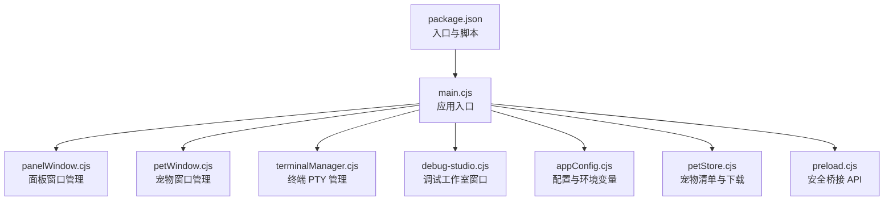
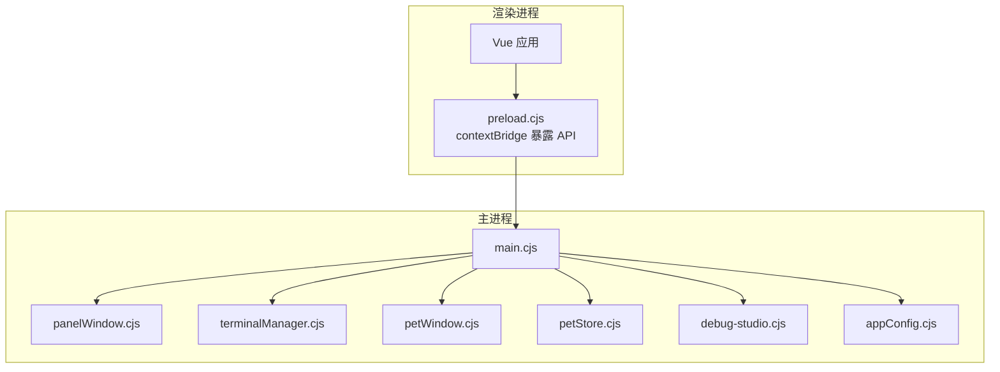
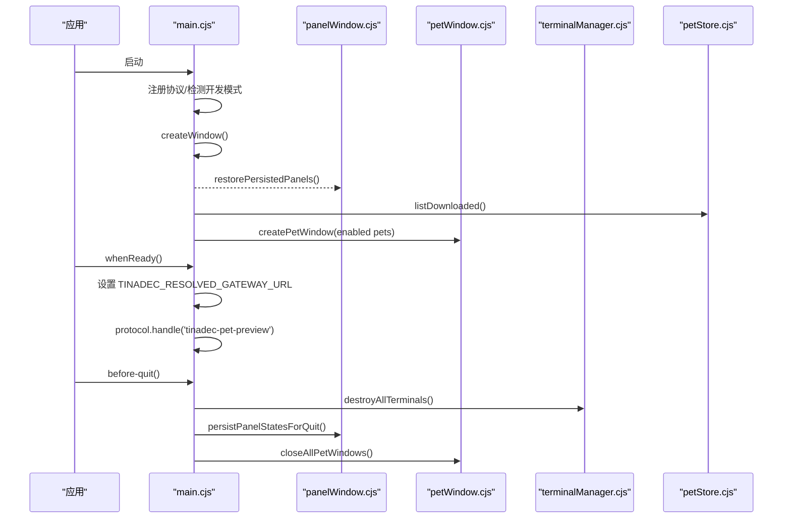
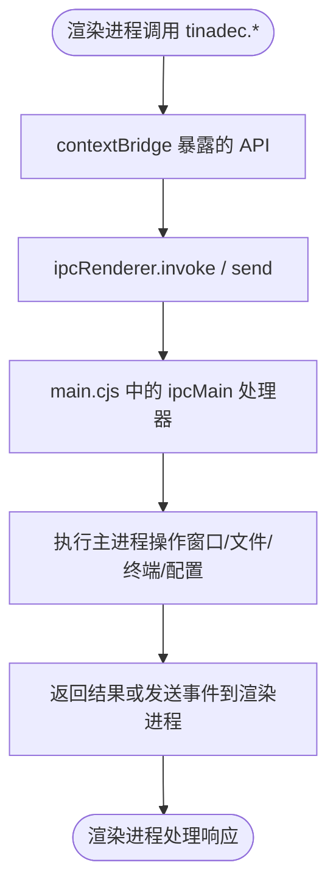
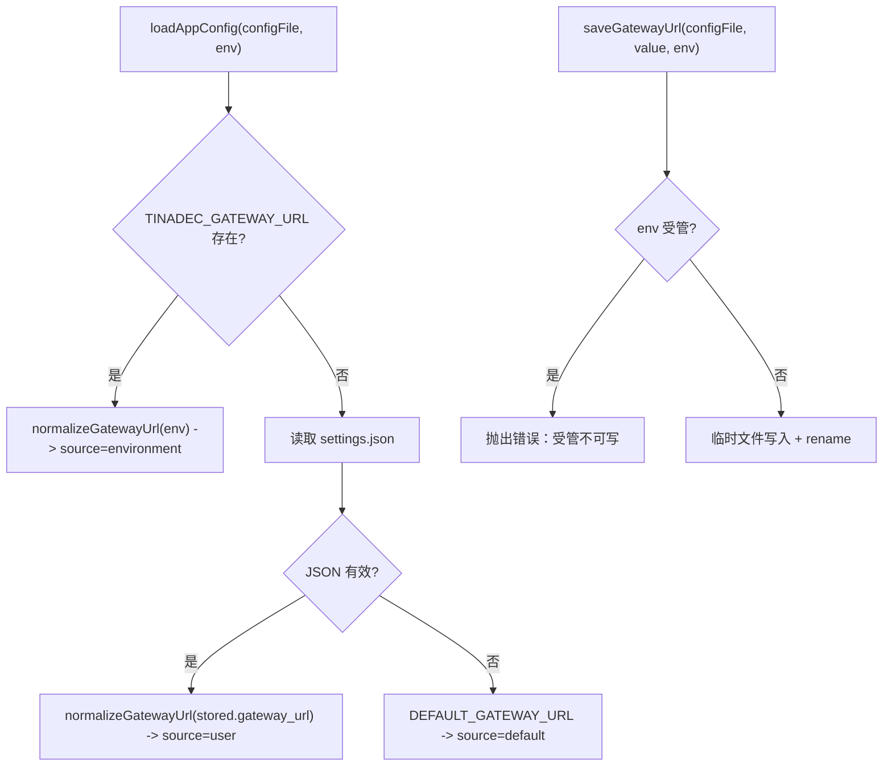
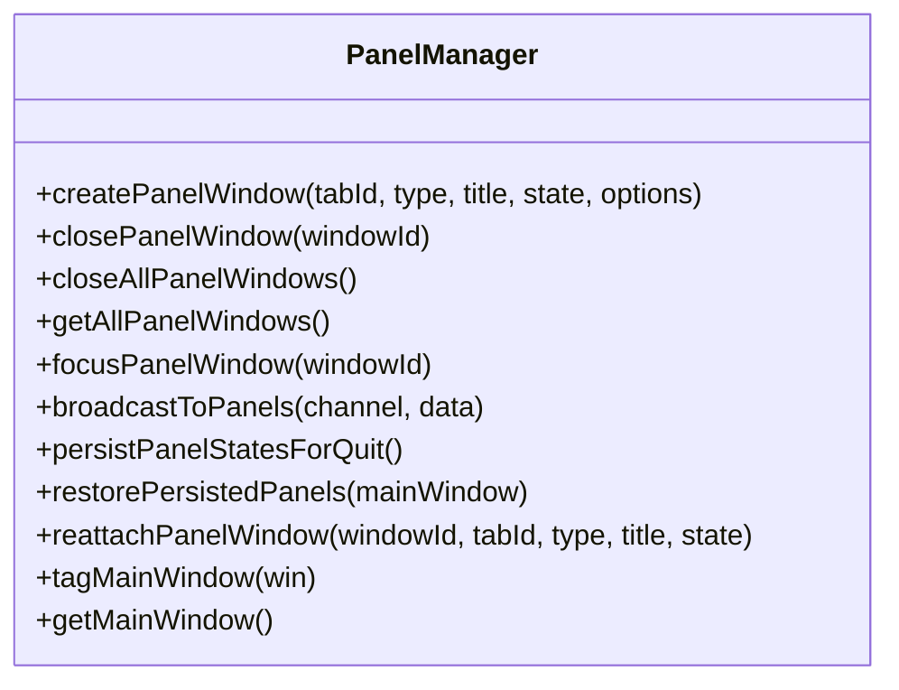
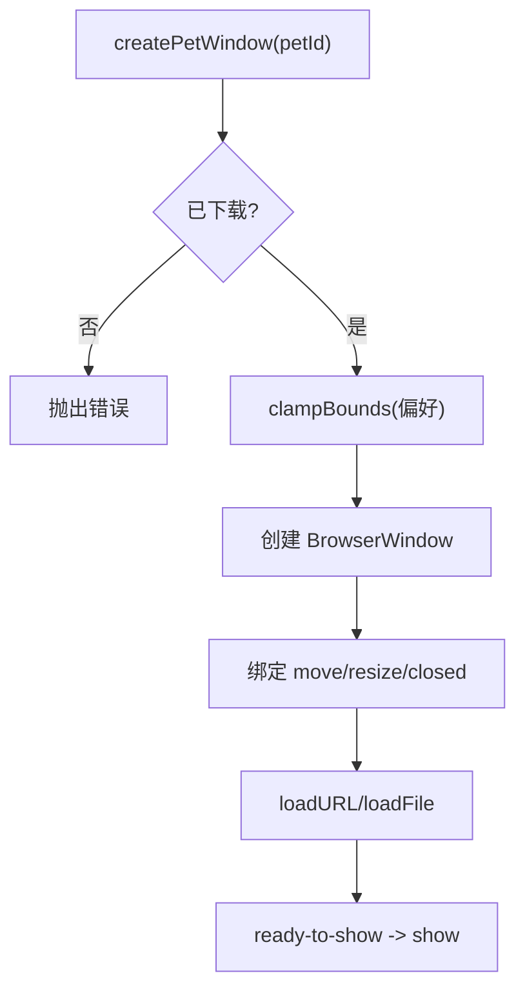
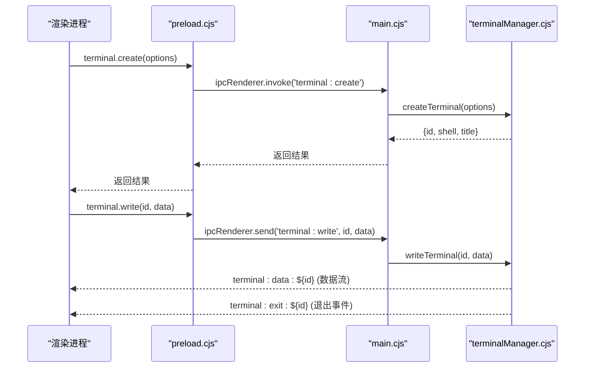
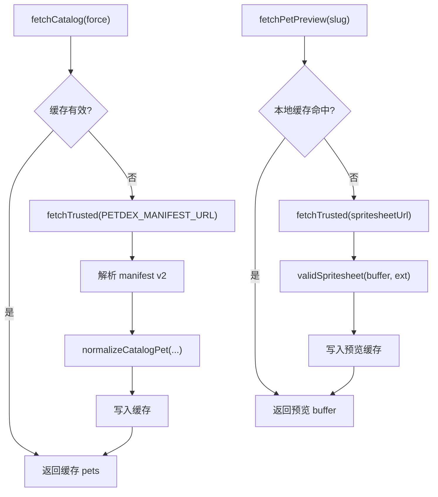
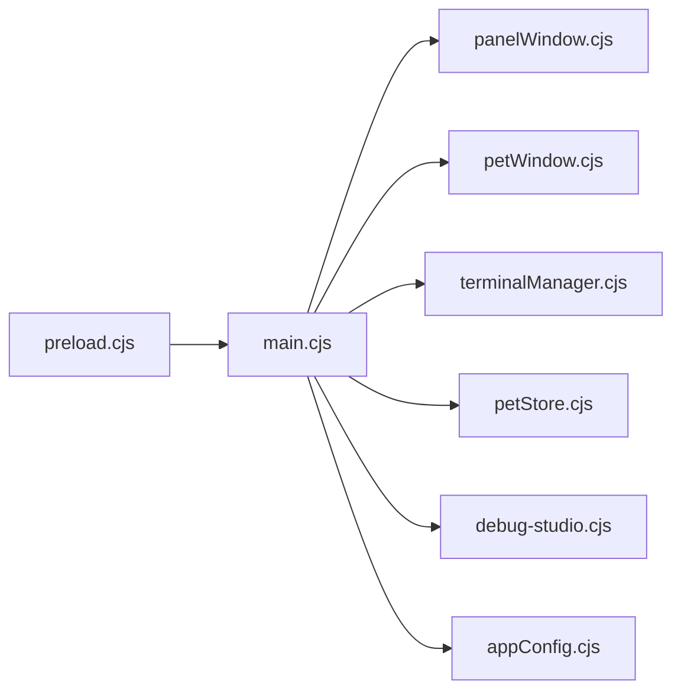

# Electron 主进程

<cite>
**本文引用的文件**   
- [apps/desktop/electron/main.cjs](file://apps/desktop/electron/main.cjs)
- [apps/desktop/electron/preload.cjs](file://apps/desktop/electron/preload.cjs)
- [apps/desktop/electron/appConfig.cjs](file://apps/desktop/electron/appConfig.cjs)
- [apps/desktop/electron/panelWindow.cjs](file://apps/desktop/electron/panelWindow.cjs)
- [apps/desktop/electron/petWindow.cjs](file://apps/desktop/electron/petWindow.cjs)
- [apps/desktop/electron/terminalManager.cjs](file://apps/desktop/electron/terminalManager.cjs)
- [apps/desktop/electron/petStore.cjs](file://apps/desktop/electron/petStore.cjs)
- [apps/desktop/electron/debug-studio.cjs](file://apps/desktop/electron/debug-studio.cjs)
- [apps/desktop/package.json](file://apps/desktop/package.json)
</cite>

## 目录
1. [简介](#简介)
2. [项目结构](#项目结构)
3. [核心组件](#核心组件)
4. [架构总览](#架构总览)
5. [详细组件分析](#详细组件分析)
6. [依赖关系分析](#依赖关系分析)
7. [性能考量](#性能考量)
8. [故障排查指南](#故障排查指南)
9. [结论](#结论)
10. [附录：扩展与最佳实践](#附录扩展与最佳实践)

## 简介
本文件面向初学者与有经验的开发者，系统性梳理 Electron 主进程的实现与最佳实践。重点覆盖：
- main.cjs 中的应用生命周期、窗口创建与配置、IPC 通信处理机制
- preload.cjs 的安全隔离实现（contextBridge API 暴露、Node.js 权限控制、渲染进程与主进程的通信协议）
- appConfig.cjs 的配置管理、环境变量处理、开发/生产环境切换逻辑
- 扩展主进程功能、处理系统事件、管理应用状态的具体示例与路径指引

## 项目结构
Electron 桌面端位于 apps/desktop 目录，主入口为 electron/main.cjs，通过 package.json 的 main 字段指定。preload.cjs 作为安全桥接层，向渲染进程暴露最小化 API。其他模块按职责拆分：面板窗口、宠物窗口、终端管理、配置管理、调试工作室等。

图表来源
- [apps/desktop/electron/main.cjs:1-43](file://apps/desktop/electron/main.cjs#L1-L43)
- [apps/desktop/package.json:1-15](file://apps/desktop/package.json#L1-L15)

章节来源
- [apps/desktop/package.json:1-15](file://apps/desktop/package.json#L1-L15)
- [apps/desktop/electron/main.cjs:1-43](file://apps/desktop/electron/main.cjs#L1-L43)

## 核心组件
- 应用入口与生命周期：main.cjs 负责初始化、注册自定义协议、创建主窗口、监听应用事件、集中处理 IPC。
- 预加载脚本：preload.cjs 使用 contextBridge.exposeInMainWorld 暴露受限 API，禁用 Node 集成并启用沙箱。
- 配置管理：appConfig.cjs 提供网关 URL 的规范化、持久化、环境变量优先策略。
- 面板窗口：panelWindow.cjs 管理独立浮动面板的创建、恢复、广播、持久化布局。
- 宠物窗口：petWindow.cjs 管理“宠物”小窗口的实例、位置、透明度、点击穿透等。
- 终端管理：terminalManager.cjs 基于 node-pty 或 child_process.spawn 提供 PTY/伪终端能力。
- 宠物商店：petStore.cjs 管理清单缓存、下载、预览、本地注册表与偏好。
- 调试工作室：debug-studio.cjs 维护独立的调试窗口实例。

章节来源
- [apps/desktop/electron/main.cjs:44-105](file://apps/desktop/electron/main.cjs#L44-L105)
- [apps/desktop/electron/preload.cjs:1-112](file://apps/desktop/electron/preload.cjs#L1-L112)
- [apps/desktop/electron/appConfig.cjs:1-74](file://apps/desktop/electron/appConfig.cjs#L1-L74)
- [apps/desktop/electron/panelWindow.cjs:1-120](file://apps/desktop/electron/panelWindow.cjs#L1-L120)
- [apps/desktop/electron/petWindow.cjs:1-60](file://apps/desktop/electron/petWindow.cjs#L1-L60)
- [apps/desktop/electron/terminalManager.cjs:1-60](file://apps/desktop/electron/terminalManager.cjs#L1-L60)
- [apps/desktop/electron/petStore.cjs:1-45](file://apps/desktop/electron/petStore.cjs#L1-L45)
- [apps/desktop/electron/debug-studio.cjs:1-40](file://apps/desktop/electron/debug-studio.cjs#L1-L40)

## 架构总览
下图展示主进程各模块的职责与交互关系，以及渲染进程通过 preload 暴露的 API 进行通信的路径。

图表来源
- [apps/desktop/electron/main.cjs:1-43](file://apps/desktop/electron/main.cjs#L1-L43)
- [apps/desktop/electron/preload.cjs:1-20](file://apps/desktop/electron/preload.cjs#L1-L20)

章节来源
- [apps/desktop/electron/main.cjs:1-43](file://apps/desktop/electron/main.cjs#L1-L43)
- [apps/desktop/electron/preload.cjs:1-20](file://apps/desktop/electron/preload.cjs#L1-L20)

## 详细组件分析

### 应用入口与生命周期（main.cjs）
- 启动流程
  - 设置平台标识（Windows 下 AppUserModelId）。
  - 注册自定义协议 tinadec-pet-preview，用于宠物预览资源访问。
  - 判断开发模式（VITE_DEV_SERVER_URL），决定加载 dev server 或 dist/index.html。
  - 创建主窗口，设置 webPreferences（contextIsolation=true, nodeIntegration=false, sandbox=true, webSecurity=false），并标记为主窗口。
  - 在 ready-to-show 时显示窗口，并在开发模式下打开 DevTools。
  - 延迟恢复已保存的面板窗口布局。
- IPC 处理
  - 项目选择、应用配置读写、网关 URL 保存/重置、重启应用。
  - 窗口控制：最小化、最大化、关闭。
  - 调试工作室窗口打开。
  - 宠物窗口相关：创建、关闭、列表、当前窗口信息、窗口边界与点击穿透、目录打开、移除、启用/禁用。
  - 背景文件选择对话框。
  - 面板窗口：分离、重新附着、关闭、聚焦、获取列表、光标位置、主窗口边界、主题广播、状态通知广播。
  - 终端 IPC：由 terminalManager.cjs 统一注册。
- 应用事件
  - before-quit：销毁所有终端、持久化面板布局、关闭所有宠物窗口。
  - whenReady：设置解析后的网关 URL、注册自定义协议处理器、创建主窗口、根据已下载的宠物自动创建窗口。
  - activate：无窗口时重建主窗口。
  - window-all-closed：关闭面板与宠物窗口，非 macOS 退出应用。

图表来源
- [apps/desktop/electron/main.cjs:44-105](file://apps/desktop/electron/main.cjs#L44-L105)
- [apps/desktop/electron/main.cjs:329-374](file://apps/desktop/electron/main.cjs#L329-L374)
- [apps/desktop/electron/panelWindow.cjs:73-96](file://apps/desktop/electron/panelWindow.cjs#L73-L96)
- [apps/desktop/electron/petWindow.cjs:126-131](file://apps/desktop/electron/petWindow.cjs#L126-L131)
- [apps/desktop/electron/terminalManager.cjs:391-395](file://apps/desktop/electron/terminalManager.cjs#L391-L395)
- [apps/desktop/electron/petStore.cjs:206-218](file://apps/desktop/electron/petStore.cjs#L206-L218)

章节来源
- [apps/desktop/electron/main.cjs:44-105](file://apps/desktop/electron/main.cjs#L44-L105)
- [apps/desktop/electron/main.cjs:107-126](file://apps/desktop/electron/main.cjs#L107-L126)
- [apps/desktop/electron/main.cjs:128-144](file://apps/desktop/electron/main.cjs#L128-L144)
- [apps/desktop/electron/main.cjs:147-196](file://apps/desktop/electron/main.cjs#L147-L196)
- [apps/desktop/electron/main.cjs:198-235](file://apps/desktop/electron/main.cjs#L198-L235)
- [apps/desktop/electron/main.cjs:237-323](file://apps/desktop/electron/main.cjs#L237-L323)
- [apps/desktop/electron/main.cjs:329-374](file://apps/desktop/electron/main.cjs#L329-L374)

### 预加载脚本与安全隔离（preload.cjs）
- 安全策略
  - 使用 contextBridge.exposeInMainWorld 仅暴露必要 API，避免直接暴露全局对象。
  - 渲染进程禁止直接访问 Node.js API（nodeIntegration=false），通过 ipcRenderer.invoke/send 与主进程通信。
  - 启用 contextIsolation 和 sandbox，限制渲染进程对主进程资源的访问。
- 暴露的 API 分类
  - 应用配置：获取配置、保存/重置网关 URL、重启应用、打开项目对话框。
  - 窗口控制：最小化、最大化、关闭。
  - 调试工作室：打开调试窗口。
  - 宠物窗口：创建、关闭、列表、当前窗口信息、边界与点击穿透、目录打开、移除、启用/禁用、变更事件订阅。
  - 背景文件选择：类型过滤的文件选择器。
  - 终端：创建、写入、调整大小、销毁、列出终端、数据与退出事件订阅。
  - 面板窗口：分离、重新附着、关闭、聚焦、获取列表、光标位置、主窗口边界、主题广播、状态通知广播与订阅。
  - 事件订阅：返回清理函数以移除监听器，防止内存泄漏。

图表来源
- [apps/desktop/electron/preload.cjs:1-112](file://apps/desktop/electron/preload.cjs#L1-L112)
- [apps/desktop/electron/main.cjs:107-323](file://apps/desktop/electron/main.cjs#L107-L323)

章节来源
- [apps/desktop/electron/preload.cjs:1-112](file://apps/desktop/electron/preload.cjs#L1-L112)

### 配置管理（appConfig.cjs）
- 优先级与来源
  - 环境变量 TINADEC_GATEWAY_URL 优先（source=environment, managed=true）。
  - 否则读取用户配置文件 settings.json（source=user, managed=false）。
  - 若均不存在则回退默认值 DEFAULT_GATEWAY_URL（source=default, managed=false）。
- 规范化与校验
  - normalizeGatewayUrl 强制 HTTP/HTTPS、去除末尾斜杠、拒绝包含凭据/查询/片段。
- 持久化
  - saveGatewayUrl 原子写入（临时文件 + rename），确保崩溃不损坏配置。
  - resetGatewayUrl 删除配置文件并重新加载。
- 测试覆盖
  - 单元测试验证 URL 规范化、环境变量优先、受管模式不可写、重置行为。

图表来源
- [apps/desktop/electron/appConfig.cjs:28-40](file://apps/desktop/electron/appConfig.cjs#L28-L40)
- [apps/desktop/electron/appConfig.cjs:42-57](file://apps/desktop/electron/appConfig.cjs#L42-L57)
- [apps/desktop/electron/appConfig.cjs:59-65](file://apps/desktop/electron/appConfig.cjs#L59-L65)

章节来源
- [apps/desktop/electron/appConfig.cjs:1-74](file://apps/desktop/electron/appConfig.cjs#L1-L74)
- [apps/desktop/electron/appConfig.test.cjs:1-34](file://apps/desktop/electron/appConfig.test.cjs#L1-L34)

### 面板窗口管理（panelWindow.cjs）
- 窗口生命周期
  - createPanelWindow：计算可见屏幕区域、创建 BrowserWindow、注册 ready-to-show、处理加载失败与超时兜底、构建 hash 路由参数、加载页面。
  - 移动/调整大小时防抖持久化布局；关闭时清理并通知主窗口。
  - reattachPanelWindow：标记重附着标志，通知主窗口重新添加标签页，关闭窗口并更新布局。
- 布局持久化
  - 存储于 .tinadec-panel-layout.json，包含 panels 数组与 savedAt 时间戳。
  - restorePersistedPanels 在主窗口就绪后恢复。
- 广播与事件
  - broadcastToPanels 向所有面板窗口发送主题变化等事件。
  - 与主窗口通过 panel:detached、panel:reattach、panel:closed 等事件同步状态。

图表来源
- [apps/desktop/electron/panelWindow.cjs:145-303](file://apps/desktop/electron/panelWindow.cjs#L145-L303)
- [apps/desktop/electron/panelWindow.cjs:315-336](file://apps/desktop/electron/panelWindow.cjs#L315-L336)
- [apps/desktop/electron/panelWindow.cjs:397-403](file://apps/desktop/electron/panelWindow.cjs#L397-L403)

章节来源
- [apps/desktop/electron/panelWindow.cjs:1-120](file://apps/desktop/electron/panelWindow.cjs#L1-L120)
- [apps/desktop/electron/panelWindow.cjs:145-303](file://apps/desktop/electron/panelWindow.cjs#L145-L303)
- [apps/desktop/electron/panelWindow.cjs:315-336](file://apps/desktop/electron/panelWindow.cjs#L315-L336)
- [apps/desktop/electron/panelWindow.cjs:397-403](file://apps/desktop/electron/panelWindow.cjs#L397-L403)

### 宠物窗口管理（petWindow.cjs）
- 窗口特性
  - 无边框、透明、始终置顶、跳过任务栏、不可调整大小/最大化/最小化。
  - 支持点击穿透（setIgnoreMouseEvents）与缩放（scale）。
- 实例管理
  - 同一 petId 只允许一个实例，重复创建会聚焦现有窗口。
  - 记录窗口边界与 scale 到本地注册表，移动/调整大小时防抖保存。
- 生命周期
  - createPetWindow：校验下载状态、计算初始 bounds、绑定事件、加载页面。
  - close/closeAll/closeCurrent：关闭并清理。
  - getCurrent/getWindowPet：根据 sender 或 instanceId 获取宠物信息。

图表来源
- [apps/desktop/electron/petWindow.cjs:41-110](file://apps/desktop/electron/petWindow.cjs#L41-L110)
- [apps/desktop/electron/petWindow.cjs:159-172](file://apps/desktop/electron/petWindow.cjs#L159-L172)

章节来源
- [apps/desktop/electron/petWindow.cjs:1-60](file://apps/desktop/electron/petWindow.cjs#L1-L60)
- [apps/desktop/electron/petWindow.cjs:41-110](file://apps/desktop/electron/petWindow.cjs#L41-L110)
- [apps/desktop/electron/petWindow.cjs:159-172](file://apps/desktop/electron/petWindow.cjs#L159-L172)

### 终端管理（terminalManager.cjs）
- PTY 后端选择
  - 优先使用 node-pty（真实 PTY），失败回退到 child_process.spawn。
- 终端生命周期
  - createTerminal：生成唯一 ID、选择 shell、构建环境、启动进程、绑定数据/退出事件。
  - writeTerminal/resizeTerminal/destroyTerminal：输入、尺寸、销毁。
  - destroyAllTerminals：应用退出时清理。
- IPC 注册
  - terminal:create、terminal:write、terminal:resize、terminal:destroy、terminal:get-shells、terminal:list。
  - 数据与退出事件通过 scoped channel 广播至所有窗口（支持面板窗口）。

图表来源
- [apps/desktop/electron/terminalManager.cjs:184-248](file://apps/desktop/electron/terminalManager.cjs#L184-L248)
- [apps/desktop/electron/terminalManager.cjs:476-506](file://apps/desktop/electron/terminalManager.cjs#L476-L506)
- [apps/desktop/electron/preload.cjs:42-61](file://apps/desktop/electron/preload.cjs#L42-L61)

章节来源
- [apps/desktop/electron/terminalManager.cjs:1-60](file://apps/desktop/electron/terminalManager.cjs#L1-L60)
- [apps/desktop/electron/terminalManager.cjs:184-248](file://apps/desktop/electron/terminalManager.cjs#L184-L248)
- [apps/desktop/electron/terminalManager.cjs:476-506](file://apps/desktop/electron/terminalManager.cjs#L476-L506)

### 宠物商店（petStore.cjs）
- 清单与缓存
  - fetchCatalog 从远程清单拉取并缓存（过期时间控制）。
  - fetchPetPreview 拉取精灵图并缓存，限制最大字节数与重定向次数。
- 下载与注册
  - downloadPet 并行下载 pet.json 与 spritesheet，校验格式，原子写入 registry.json。
  - setEnabled/removePet/openPetFolder 管理本地注册表与文件系统。
- 偏好与窗口数据
  - getPetPreferences/savePetPreferences 保存 scale 与窗口边界。
  - getPetForWindow 返回带 base64 图片数据的公开记录。

图表来源
- [apps/desktop/electron/petStore.cjs:115-129](file://apps/desktop/electron/petStore.cjs#L115-L129)
- [apps/desktop/electron/petStore.cjs:151-174](file://apps/desktop/electron/petStore.cjs#L151-L174)
- [apps/desktop/electron/petStore.cjs:229-277](file://apps/desktop/electron/petStore.cjs#L229-L277)

章节来源
- [apps/desktop/electron/petStore.cjs:1-45](file://apps/desktop/electron/petStore.cjs#L1-L45)
- [apps/desktop/electron/petStore.cjs:115-129](file://apps/desktop/electron/petStore.cjs#L115-L129)
- [apps/desktop/electron/petStore.cjs:151-174](file://apps/desktop/electron/petStore.cjs#L151-L174)
- [apps/desktop/electron/petStore.cjs:229-277](file://apps/desktop/electron/petStore.cjs#L229-L277)

### 调试工作室（debug-studio.cjs）
- 单例窗口管理：若已存在则聚焦/恢复，否则新建窗口并加载调试页面。
- 错误处理：render-process-gone、did-fail-load 时销毁窗口。
- 开发模式自动打开 DevTools。

章节来源
- [apps/desktop/electron/debug-studio.cjs:1-96](file://apps/desktop/electron/debug-studio.cjs#L1-L96)

## 依赖关系分析
- main.cjs 依赖多个子模块：panelWindow、petWindow、terminalManager、petStore、debug-studio、appConfig。
- preload.cjs 仅依赖 electron 的 contextBridge 与 ipcRenderer，不直接访问 Node 模块。
- panelWindow/petWindow 依赖 screen、path、fs 等 Node 模块。
- terminalManager 依赖 node-pty（可选）与 child_process。
- petStore 依赖 fs/promises、path、electron.app。

图表来源
- [apps/desktop/electron/main.cjs:1-43](file://apps/desktop/electron/main.cjs#L1-L43)
- [apps/desktop/electron/preload.cjs:1-10](file://apps/desktop/electron/preload.cjs#L1-L10)

章节来源
- [apps/desktop/electron/main.cjs:1-43](file://apps/desktop/electron/main.cjs#L1-L43)
- [apps/desktop/electron/preload.cjs:1-10](file://apps/desktop/electron/preload.cjs#L1-L10)

## 性能考量
- 窗口创建与显示
  - 在 ready-to-show 之前注册事件，避免错过显示时机；加载失败与超时兜底保证窗口可见性。
- 布局持久化
  - 使用防抖保存面板与宠物窗口布局，减少频繁磁盘 IO。
- 终端 I/O
  - node-pty 优先，提供更完整的 PTY 能力；spawn 回退模式仅支持基础 I/O。
- 网络请求
  - 清单与预览缓存、请求超时与重定向限制、内容长度校验，避免内存与带宽滥用。
- 资源释放
  - before-quit 清理终端、面板与宠物窗口，防止资源泄漏。

[本节为通用指导，不直接分析具体文件]

## 故障排查指南
- 窗口未显示
  - 检查 ready-to-show 是否被正确注册；确认 did-fail-load 与超时兜底逻辑。
- 面板布局丢失
  - 查看 .tinadec-panel-layout.json 是否存在且格式正确；确认 persistPanelStatesForQuit 是否被调用。
- 终端无法启动
  - 检查 node-pty 是否可用；查看 spawn 回退模式的错误日志；确认 shell 路径与参数。
- 宠物下载失败
  - 检查清单与精灵图 URL 是否可信；确认内容长度与格式校验；查看本地 registry.json 是否损坏。
- 配置写入失败
  - 确认环境变量是否受管；检查临时文件与原子写入流程；查看异常堆栈。

章节来源
- [apps/desktop/electron/panelWindow.cjs:217-233](file://apps/desktop/electron/panelWindow.cjs#L217-L233)
- [apps/desktop/electron/terminalManager.cjs:237-244](file://apps/desktop/electron/terminalManager.cjs#L237-L244)
- [apps/desktop/electron/petStore.cjs:45-87](file://apps/desktop/electron/petStore.cjs#L45-L87)
- [apps/desktop/electron/appConfig.cjs:42-57](file://apps/desktop/electron/appConfig.cjs#L42-L57)

## 结论
本项目的主进程实现了清晰的分层与职责划分：入口负责生命周期与 IPC 调度，预加载脚本提供最小化安全 API，子模块分别管理面板、宠物、终端、配置与调试窗口。通过严格的上下文隔离、沙箱与白名单 API 暴露，保障了渲染进程的安全性。同时，完善的错误处理、持久化与缓存机制提升了用户体验与稳定性。

[本节为总结，不直接分析具体文件]

## 附录：扩展与最佳实践

### 如何扩展主进程功能
- 新增 IPC 通道
  - 在 main.cjs 中注册 ipcMain.handle/on 处理器，定义清晰的 channel 名称与参数。
  - 在 preload.cjs 中通过 ipcRenderer.invoke/send 暴露对应方法，保持最小暴露原则。
- 示例路径
  - 新增“导出报告”功能：main.cjs 中增加 tinadec:export-report 处理器；preload.cjs 暴露 exportReport()。
  - 参考现有“打开项目对话框”与“背景文件选择”的实现方式。

章节来源
- [apps/desktop/electron/main.cjs:107-126](file://apps/desktop/electron/main.cjs#L107-L126)
- [apps/desktop/electron/main.cjs:198-235](file://apps/desktop/electron/main.cjs#L198-L235)
- [apps/desktop/electron/preload.cjs:5-13](file://apps/desktop/electron/preload.cjs#L5-L13)

### 如何处理系统事件
- 应用级事件
  - before-quit：清理资源、持久化状态。
  - whenReady：初始化协议、加载主窗口、恢复面板与宠物。
  - activate/window-all-closed：跨平台窗口管理与退出逻辑。
- 窗口级事件
  - ready-to-show：显示窗口与 DevTools。
  - did-fail-load/render-process-gone：错误处理与窗口销毁。
- 示例路径
  - 参考 main.cjs 的事件监听与处理逻辑。

章节来源
- [apps/desktop/electron/main.cjs:329-374](file://apps/desktop/electron/main.cjs#L329-L374)
- [apps/desktop/electron/debug-studio.cjs:54-80](file://apps/desktop/electron/debug-studio.cjs#L54-L80)

### 如何管理应用状态
- 配置状态
  - 使用 appConfig.cjs 管理网关 URL，遵循环境变量优先、原子写入、重置策略。
- 窗口状态
  - panelWindow.cjs 持久化面板布局；petWindow.cjs 持久化宠物窗口边界与缩放。
- 示例路径
  - loadAppConfig/saveGatewayUrl/resetGatewayUrl；persistPanelStatesForQuit/restorePersistedPanels；savePetPreferences。

章节来源
- [apps/desktop/electron/appConfig.cjs:28-65](file://apps/desktop/electron/appConfig.cjs#L28-L65)
- [apps/desktop/electron/panelWindow.cjs:73-96](file://apps/desktop/electron/panelWindow.cjs#L73-L96)
- [apps/desktop/electron/petWindow.cjs:318-337](file://apps/desktop/electron/petWindow.cjs#L318-L337)

### 安全最佳实践
- 严格上下文隔离与沙箱
  - contextIsolation=true、nodeIntegration=false、sandbox=true。
- 最小化 API 暴露
  - 仅通过 contextBridge.exposeInMainWorld 暴露必要方法，避免泄露敏感能力。
- 输入校验与白名单
  - appConfig.cjs 对 URL 进行严格校验；petStore.cjs 对 URL 与内容进行长度与格式校验。
- 资源限制
  - 网络请求超时、重定向限制、内容长度上限；预览缓存大小限制。

章节来源
- [apps/desktop/electron/main.cjs:71-78](file://apps/desktop/electron/main.cjs#L71-L78)
- [apps/desktop/electron/preload.cjs:1-10](file://apps/desktop/electron/preload.cjs#L1-L10)
- [apps/desktop/electron/appConfig.cjs:6-26](file://apps/desktop/electron/appConfig.cjs#L6-L26)
- [apps/desktop/electron/petStore.cjs:45-87](file://apps/desktop/electron/petStore.cjs#L45-L87)

### 性能优化建议
- 懒加载与按需创建
  - 面板与宠物窗口按需创建，避免一次性创建过多窗口。
- 防抖与批量持久化
  - 窗口移动/调整大小时防抖保存布局，减少磁盘 IO。
- 缓存策略
  - 清单与预览缓存、请求去重、过期时间控制。
- 资源回收
  - 及时清理终端与窗口事件监听，避免内存泄漏。

[本节为通用指导，不直接分析具体文件]