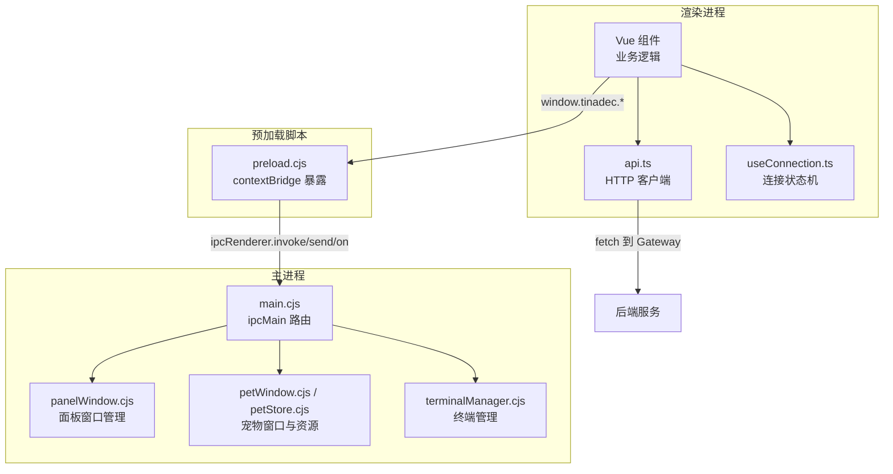
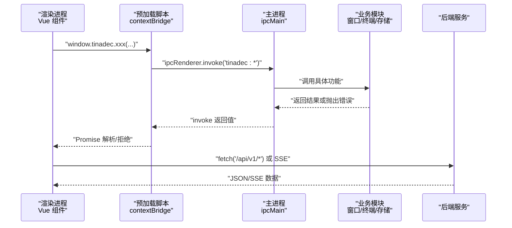
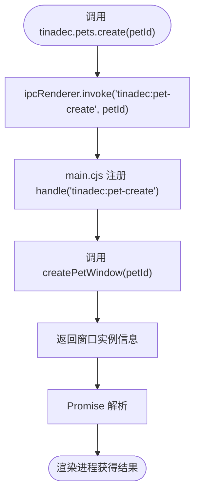
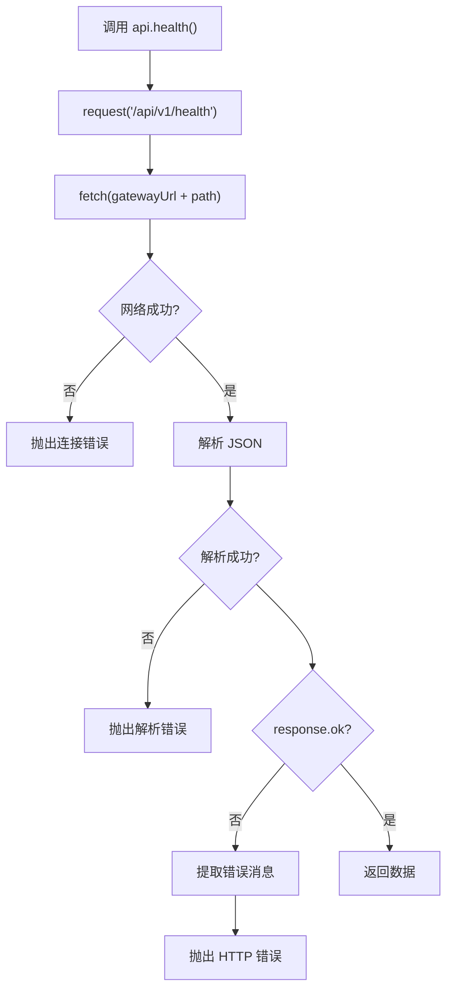
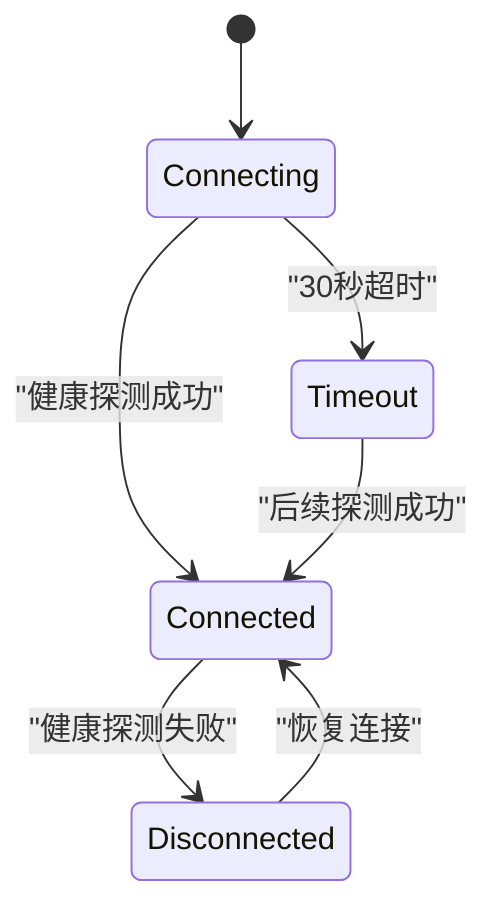
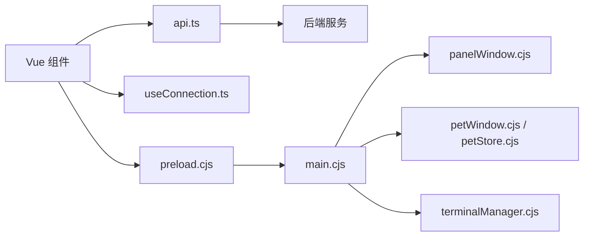

# IPC 通信机制

<cite>
**本文引用的文件**   
- [apps/desktop/electron/preload.cjs](file://apps/desktop/electron/preload.cjs)
- [apps/desktop/src/api.ts](file://apps/desktop/src/api.ts)
- [apps/desktop/src/composables/useConnection.ts](file://apps/desktop/src/composables/useConnection.ts)
- [apps/desktop/electron/main.cjs](file://apps/desktop/electron/main.cjs)
</cite>

## 目录
1. [简介](#简介)
2. [项目结构](#项目结构)
3. [核心组件](#核心组件)
4. [架构总览](#架构总览)
5. [详细组件分析](#详细组件分析)
6. [依赖关系分析](#依赖关系分析)
7. [性能考量](#性能考量)
8. [故障排查指南](#故障排查指南)
9. [结论](#结论)
10. [附录：最佳实践与示例](#附录最佳实践与示例)

## 简介
本文件面向初学者与有经验的开发者，系统性阐述 Electron 桌面应用中的 IPC（进程间通信）机制。重点覆盖以下方面：
- preload.cjs 中通过 contextBridge 安全暴露 API、命令封装与错误处理策略
- api.ts 的 HTTP API 客户端实现、请求拦截器、响应处理器与 SSE/流式调用
- useConnection.ts 的连接状态机、重连机制与健康监控
- 自定义 IPC 命令的实现方式、异步操作处理、错误重试模式
- IPC 安全最佳实践、数据传输格式、版本兼容性处理
- 高性能通信模式与调试技巧

## 项目结构
本项目采用“主进程 + 渲染进程”的经典 Electron 架构：
- 主进程（main.cjs）负责窗口管理、系统能力访问、IPC 路由分发
- 预加载脚本（preload.cjs）通过 contextBridge 向渲染进程安全暴露有限 API
- 渲染进程（src/api.ts、composables/useConnection.ts）通过 window.tinadec 调用 IPC，并通过 fetch 访问后端服务

**图表来源** 
- [apps/desktop/electron/preload.cjs:1-112](file://apps/desktop/electron/preload.cjs#L1-L112)
- [apps/desktop/src/api.ts:943-1330](file://apps/desktop/src/api.ts#L943-L1330)
- [apps/desktop/src/composables/useConnection.ts:1-138](file://apps/desktop/src/composables/useConnection.ts#L1-L138)
- [apps/desktop/electron/main.cjs:107-374](file://apps/desktop/electron/main.cjs#L107-L374)

**章节来源**
- [apps/desktop/electron/preload.cjs:1-112](file://apps/desktop/electron/preload.cjs#L1-L112)
- [apps/desktop/src/api.ts:943-1330](file://apps/desktop/src/api.ts#L943-L1330)
- [apps/desktop/src/composables/useConnection.ts:1-138](file://apps/desktop/src/composables/useConnection.ts#L1-L138)
- [apps/desktop/electron/main.cjs:107-374](file://apps/desktop/electron/main.cjs#L107-L374)

## 核心组件
- 预加载脚本（preload.cjs）
  - 使用 contextBridge.exposeInMainWorld 将 tinadec 对象暴露给渲染进程
  - 提供窗口控制、项目选择、主题广播、宠物窗口、终端、面板窗口等 API
  - 对事件监听提供订阅/取消订阅方法，避免内存泄漏
- API 客户端（api.ts）
  - 统一的 request<T>() 函数作为请求拦截器与响应处理器
  - 定义大量 DTO 类型，保证前后端数据结构一致性
  - 提供健康检查、SSE 流式调用、事件订阅等能力
- 连接管理（useConnection.ts）
  - 基于 ref 的状态机，支持 connecting/connected/timeout/disconnected 四种状态
  - 启动时立即探测，失败则轮询；超时后进入 timeout 但仍保持后台健康监控
  - 提供 retryConnection() 手动重试与 start() 幂等启动

**章节来源**
- [apps/desktop/electron/preload.cjs:1-112](file://apps/desktop/electron/preload.cjs#L1-L112)
- [apps/desktop/src/api.ts:943-1330](file://apps/desktop/src/api.ts#L943-L1330)
- [apps/desktop/src/composables/useConnection.ts:1-138](file://apps/desktop/src/composables/useConnection.ts#L1-L138)

## 架构总览
下图展示了从渲染进程发起 IPC 到主进程处理并返回结果的完整流程，以及 HTTP 请求与 SSE 事件流的路径。

**图表来源** 
- [apps/desktop/electron/preload.cjs:3-88](file://apps/desktop/electron/preload.cjs#L3-L88)
- [apps/desktop/electron/main.cjs:107-326](file://apps/desktop/electron/main.cjs#L107-L326)
- [apps/desktop/src/api.ts:943-1330](file://apps/desktop/src/api.ts#L943-L1330)

## 详细组件分析

### 预加载脚本（preload.cjs）的安全暴露与命令封装
- 安全暴露
  - 仅通过 contextBridge.exposeInMainWorld 暴露最小必要 API，避免直接暴露 ipcRenderer 或 Node 能力
  - 所有方法均封装为 Promise 形式（invoke）或回调订阅（on），统一接口风格
- 命令封装
  - 窗口控制：最小化、最大化、关闭
  - 项目与配置：打开项目对话框、获取/保存/重置网关地址
  - 宠物窗口：创建、关闭、列表、当前实例、下载、启用/禁用、文件夹操作
  - 终端：创建、写入、调整大小、销毁、获取 shell、数据/退出事件
  - 面板窗口：分离/重新附着、关闭/聚焦、获取窗口列表、主题广播
  - 状态通知：广播与订阅
- 错误处理
  - invoke 自动传播主进程抛出的错误至渲染进程
  - on 订阅返回清理函数，确保移除监听器，防止内存泄漏
- 事件通道命名规范
  - 使用带前缀的命名空间，如 tinadec:*、terminal:*、panel:*，降低冲突风险

**图表来源** 
- [apps/desktop/electron/preload.cjs:16-21](file://apps/desktop/electron/preload.cjs#L16-L21)
- [apps/desktop/electron/main.cjs:152-153](file://apps/desktop/electron/main.cjs#L152-L153)

**章节来源**
- [apps/desktop/electron/preload.cjs:1-112](file://apps/desktop/electron/preload.cjs#L1-L112)
- [apps/desktop/electron/main.cjs:107-326](file://apps/desktop/electron/main.cjs#L107-L326)

### API 客户端（api.ts）的请求拦截器与响应处理器
- 请求拦截器
  - 统一设置 accept 与 content-type 头
  - 网络异常捕获并包装为明确错误消息
- 响应处理器
  - 读取文本体并尝试 JSON 解析，失败时保留原始片段便于调试
  - 非 2xx 状态码时提取错误消息（优先 message，其次 error.message）
- 流式调用与事件订阅
  - invokeStream：基于 ReadableStream 的 SSE 分块处理，支持中止控制器
  - connectEvents：EventSource 订阅多种事件类型，统一回调
- 数据类型
  - 大量 DTO 类型定义，确保前后端契约稳定

**图表来源** 
- [apps/desktop/src/api.ts:945-995](file://apps/desktop/src/api.ts#L945-L995)

**章节来源**
- [apps/desktop/src/api.ts:943-1330](file://apps/desktop/src/api.ts#L943-L1330)

### 连接管理（useConnection.ts）的状态机与重连机制
- 状态机
  - connecting：初始状态，显示启动屏，轮询后端健康
  - connected：后端可达，隐藏启动屏，开启后台健康监控
  - timeout：超过 30s 未连通，仍允许进入主界面，后台继续监控
  - disconnected：已连接后再次探测失败
- 重连策略
  - 首次探测失败后按固定间隔轮询
  - 超时后停止轮询但保留后台健康监控（每 6s 一次）
  - 提供 retryConnection() 手动触发探测
- 幂等性
  - start() 内部使用 started 标志，避免重复启动定时器

**图表来源** 
- [apps/desktop/src/composables/useConnection.ts:11-14](file://apps/desktop/src/composables/useConnection.ts#L11-L14)
- [apps/desktop/src/composables/useConnection.ts:48-94](file://apps/desktop/src/composables/useConnection.ts#L48-L94)

**章节来源**
- [apps/desktop/src/composables/useConnection.ts:1-138](file://apps/desktop/src/composables/useConnection.ts#L1-L138)

## 依赖关系分析
- 渲染进程依赖
  - Vue 组件依赖 api.ts 与 useConnection.ts
  - api.ts 依赖 window.tinadec.gatewayUrl 获取后端地址
- 预加载脚本依赖
  - 依赖 electron 的 contextBridge 与 ipcRenderer
- 主进程依赖
  - main.cjs 依赖 panelWindow.cjs、petWindow.cjs、terminalManager.cjs 等模块
  - 通过 ipcMain.handle/on 注册命令处理器

**图表来源** 
- [apps/desktop/src/api.ts:943-944](file://apps/desktop/src/api.ts#L943-L944)
- [apps/desktop/electron/preload.cjs:1-112](file://apps/desktop/electron/preload.cjs#L1-L112)
- [apps/desktop/electron/main.cjs:1-43](file://apps/desktop/electron/main.cjs#L1-L43)

**章节来源**
- [apps/desktop/src/api.ts:943-944](file://apps/desktop/src/api.ts#L943-L944)
- [apps/desktop/electron/preload.cjs:1-112](file://apps/desktop/electron/preload.cjs#L1-L112)
- [apps/desktop/electron/main.cjs:1-43](file://apps/desktop/electron/main.cjs#L1-L43)

## 性能考量
- 减少不必要的 IPC 调用
  - 批量操作尽量合并为单次 invoke，避免频繁跨进程通信
- 事件订阅生命周期管理
  - 始终返回清理函数并在组件卸载时调用，防止内存泄漏
- 流式数据处理
  - 使用 SSE 分块传输大响应，避免阻塞 UI
- 连接轮询间隔调优
  - 根据后端负载与用户体验平衡轮询频率（默认 1.5s 轮询，6s 后台监控）

[本节为通用指导，不直接分析具体文件]

## 故障排查指南
- 网络连接失败
  - 检查 gatewayUrl 是否正确，确认后端服务是否运行
  - 查看 api.ts 的错误提取逻辑，定位具体错误原因
- IPC 命令未生效
  - 确认 preload.cjs 是否暴露了对应方法
  - 检查 main.cjs 是否注册了相应的 ipcMain.handle/on
- 事件未触发或内存泄漏
  - 确认 on* 方法的清理函数是否被调用
  - 在 DevTools 中检查监听器数量
- 连接状态异常
  - 使用 useConnection.test.ts 的思路模拟健康探测失败场景
  - 检查 start() 是否被多次调用导致定时器叠加

**章节来源**
- [apps/desktop/src/api.ts:945-995](file://apps/desktop/src/api.ts#L945-L995)
- [apps/desktop/src/composables/useConnection.test.ts:1-84](file://apps/desktop/src/composables/useConnection.test.ts#L1-L84)

## 结论
本项目通过严格的上下文隔离与最小化 API 暴露，构建了安全的 IPC 通信体系。api.ts 提供了健壮的 HTTP 客户端与流式处理能力，useConnection.ts 实现了可靠的连接状态管理与重连机制。结合主进程的模块化设计，整体架构清晰、可维护性强，适合扩展更多 IPC 命令与服务集成。

[本节为总结性内容，不直接分析具体文件]

## 附录：最佳实践与示例

### 自定义 IPC 命令实现步骤
- 在 preload.cjs 中通过 contextBridge.exposeInMainWorld 暴露新方法
- 在 main.cjs 中注册对应的 ipcMain.handle/on 处理器
- 在渲染进程中通过 window.tinadec.newMethod(...) 调用

示例路径参考：
- 暴露方法：[apps/desktop/electron/preload.cjs:3-88](file://apps/desktop/electron/preload.cjs#L3-L88)
- 注册处理器：[apps/desktop/electron/main.cjs:107-326](file://apps/desktop/electron/main.cjs#L107-L326)

### 处理异步操作与错误重试
- 使用 Promise 封装 IPC 调用，统一错误处理
- 在 api.ts 中实现通用重试逻辑（指数退避、最大重试次数）
- 在 useConnection.ts 中体现重试思想（轮询、超时、后台监控）

示例路径参考：
- 异步封装：[apps/desktop/src/api.ts:945-995](file://apps/desktop/src/api.ts#L945-L995)
- 重试机制：[apps/desktop/src/composables/useConnection.ts:96-103](file://apps/desktop/src/composables/useConnection.ts#L96-L103)

### IPC 安全最佳实践
- 仅暴露必要 API，避免直接暴露 ipcRenderer 或 Node 能力
- 严格验证输入参数，防止注入攻击
- 使用命名空间化的频道名称，避免冲突
- 及时清理事件监听器，防止内存泄漏

示例路径参考：
- 安全暴露：[apps/desktop/electron/preload.cjs:1-112](file://apps/desktop/electron/preload.cjs#L1-L112)
- 参数验证：[apps/desktop/electron/main.cjs:294-323](file://apps/desktop/electron/main.cjs#L294-L323)

### 数据传输格式与版本兼容
- 使用 TypeScript 接口定义 DTO，确保前后端契约一致
- 在 API 响应中包含版本号或能力标识，支持渐进升级
- 对可选字段进行向后兼容处理

示例路径参考：
- DTO 定义：[apps/desktop/src/api.ts:1-942](file://apps/desktop/src/api.ts#L1-L942)
- 版本处理：[apps/desktop/src/api.ts:1257-1328](file://apps/desktop/src/api.ts#L1257-L1328)

### 调试技巧
- 使用 Electron DevTools 查看 IPC 调用栈
- 在 main.cjs 中添加日志输出，追踪命令执行流程
- 使用 useConnection.test.ts 的模式模拟各种连接状态

示例路径参考：
- DevTools 启用：[apps/desktop/electron/main.cjs:86-91](file://apps/desktop/electron/main.cjs#L86-L91)
- 测试模式：[apps/desktop/src/composables/useConnection.test.ts:1-84](file://apps/desktop/src/composables/useConnection.test.ts#L1-L84)

**章节来源**
- [apps/desktop/electron/preload.cjs:1-112](file://apps/desktop/electron/preload.cjs#L1-L112)
- [apps/desktop/electron/main.cjs:86-91](file://apps/desktop/electron/main.cjs#L86-L91)
- [apps/desktop/src/api.ts:1-942](file://apps/desktop/src/api.ts#L1-L942)
- [apps/desktop/src/composables/useConnection.test.ts:1-84](file://apps/desktop/src/composables/useConnection.test.ts#L1-L84)