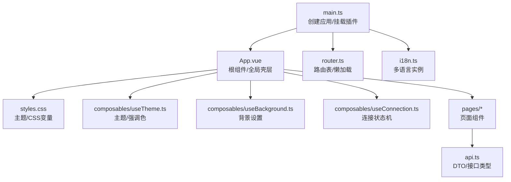
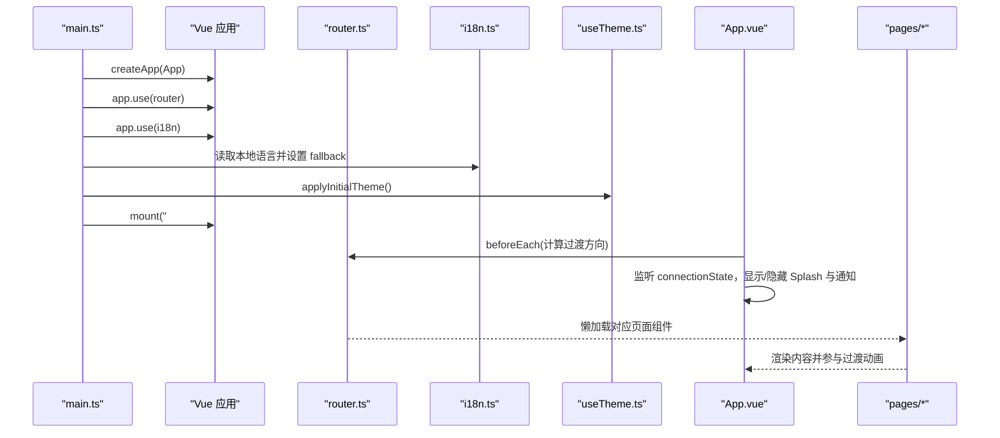
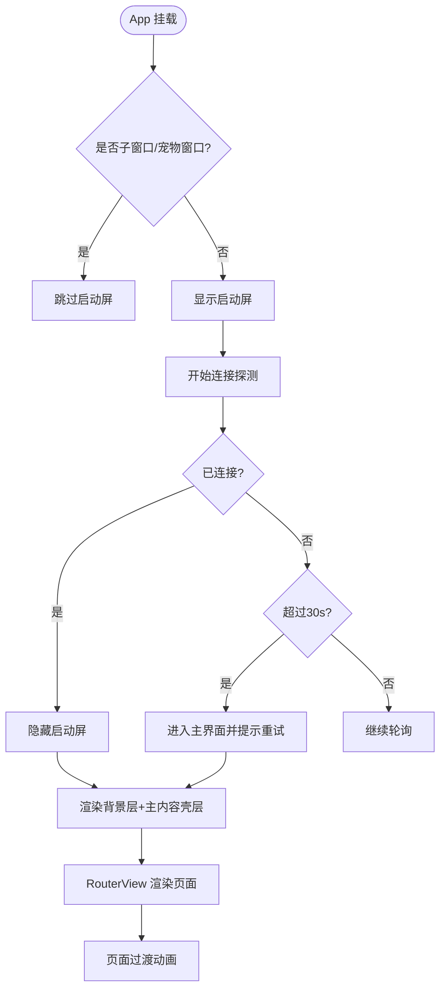
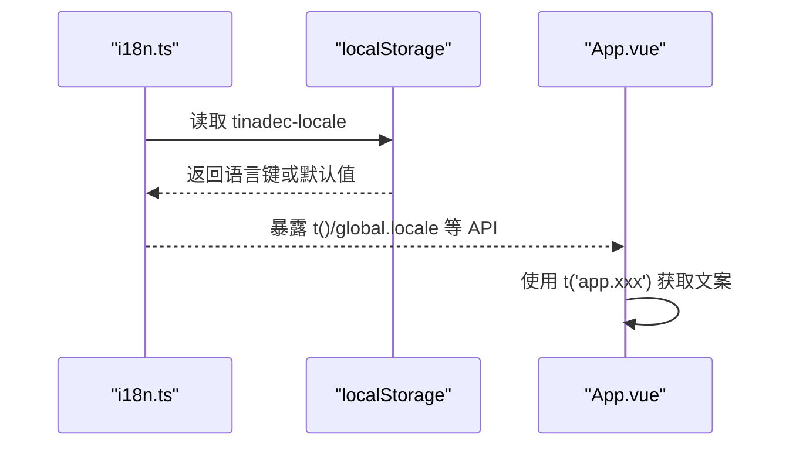
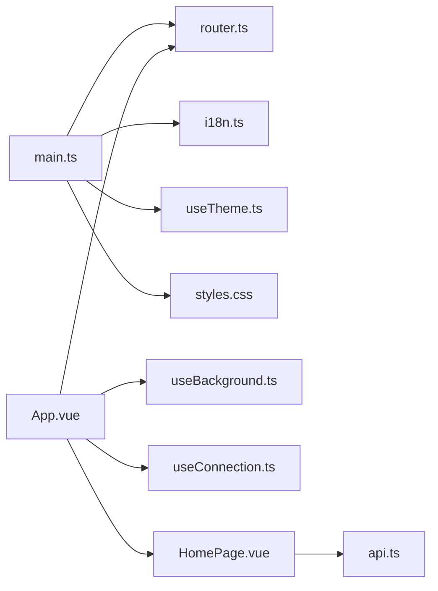

# Vue 渲染进程

<cite>
**本文引用的文件**   
- [apps/desktop/src/main.ts](file://apps/desktop/src/main.ts)
- [apps/desktop/src/App.vue](file://apps/desktop/src/App.vue)
- [apps/desktop/src/router.ts](file://apps/desktop/src/router.ts)
- [apps/desktop/src/i18n.ts](file://apps/desktop/src/i18n.ts)
- [apps/desktop/src/styles.css](file://apps/desktop/src/styles.css)
- [apps/desktop/src/composables/useTheme.ts](file://apps/desktop/src/composables/useTheme.ts)
- [apps/desktop/src/composables/useBackground.ts](file://apps/desktop/src/composables/useBackground.ts)
- [apps/desktop/src/composables/useConnection.ts](file://apps/desktop/src/composables/useConnection.ts)
- [apps/desktop/src/pages/HomePage.vue](file://apps/desktop/src/pages/HomePage.vue)
- [apps/desktop/src/api.ts](file://apps/desktop/src/api.ts)
</cite>

## 目录
1. [简介](#简介)
2. [项目结构](#项目结构)
3. [核心组件](#核心组件)
4. [架构总览](#架构总览)
5. [详细组件分析](#详细组件分析)
6. [依赖关系分析](#依赖关系分析)
7. [性能考量](#性能考量)
8. [故障排查指南](#故障排查指南)
9. [结论](#结论)
10. [附录](#附录)

## 简介
本文件面向 TinadecOffice 桌面应用的 Vue 渲染进程，系统性阐述应用初始化流程、Vue 实例配置与插件注册顺序；根组件 App.vue 的页面壳层、全局样式注入与主题系统初始化；路由 router.ts 的配置、导航守卫与参数处理；国际化 i18n.ts 的语言包加载与动态切换。同时提供添加新页面、配置路由守卫、实现国际化的实操示例，并解释 Vue 3 Composition API 的使用模式、响应式数据管理与组件间通信机制，既适合初学者入门，也为有经验的开发者提供架构设计与性能优化建议。

## 项目结构
渲染进程位于 apps/desktop/src 下，关键入口与模块如下：
- main.ts：创建 Vue 应用、挂载插件、初始化主题与通知文案、挂载到 DOM
- App.vue：根组件，负责背景层、启动屏、路由过渡、连接状态门控、通知中心
- router.ts：基于 Hash 历史的路由表定义与懒加载
- i18n.ts：vue-i18n 实例化、语言包导入与默认语言读取
- styles.css：Tailwind + CSS 变量主题体系（暗/亮色）、滚动条、面板材质等
- composables：useTheme（主题与强调色）、useBackground（背景设置与持久化）、useConnection（后端连接状态机）
- pages：各页面组件（HomePage、SettingsPage、MarketPage、DebugStudioPage、CodePage、DetachedPanelPage、DesktopPetPage）
- api.ts：前后端 DTO 类型定义与 API 调用封装

图表来源
- [apps/desktop/src/main.ts:1-24](file://apps/desktop/src/main.ts#L1-L24)
- [apps/desktop/src/App.vue:1-182](file://apps/desktop/src/App.vue#L1-L182)
- [apps/desktop/src/router.ts:1-45](file://apps/desktop/src/router.ts#L1-L45)
- [apps/desktop/src/i18n.ts:1-24](file://apps/desktop/src/i18n.ts#L1-L24)
- [apps/desktop/src/styles.css:1-800](file://apps/desktop/src/styles.css#L1-L800)
- [apps/desktop/src/composables/useTheme.ts:1-258](file://apps/desktop/src/composables/useTheme.ts#L1-L258)
- [apps/desktop/src/composables/useBackground.ts:1-230](file://apps/desktop/src/composables/useBackground.ts#L1-L230)
- [apps/desktop/src/composables/useConnection.ts:1-138](file://apps/desktop/src/composables/useConnection.ts#L1-L138)
- [apps/desktop/src/pages/HomePage.vue:1-200](file://apps/desktop/src/pages/HomePage.vue#L1-L200)
- [apps/desktop/src/api.ts:1-200](file://apps/desktop/src/api.ts#L1-L200)

章节来源
- [apps/desktop/src/main.ts:1-24](file://apps/desktop/src/main.ts#L1-L24)
- [apps/desktop/src/App.vue:1-182](file://apps/desktop/src/App.vue#L1-L182)
- [apps/desktop/src/router.ts:1-45](file://apps/desktop/src/router.ts#L1-L45)
- [apps/desktop/src/i18n.ts:1-24](file://apps/desktop/src/i18n.ts#L1-L24)
- [apps/desktop/src/styles.css:1-800](file://apps/desktop/src/styles.css#L1-L800)

## 核心组件
- main.ts：创建 Vue 应用，按顺序注册 router、i18n，注入通知文案，初始化主题后挂载到 #app
- App.vue：统一渲染背景层、Splash 启动屏、RouterView 页面容器、通知岛与详情弹窗；通过 beforeEach 计算页面过渡方向；监听连接状态并给出重试提示
- router.ts：使用 createWebHashHistory，所有页面按需 import 懒加载
- i18n.ts：创建 vue-i18n 实例，从 localStorage 读取上次语言，fallback 为 en
- useTheme.ts：管理 theme（dark/light/system）与 accent color，写入 data-theme 属性，监听系统偏好变化
- useBackground.ts：管理背景类型（none/image/video/html），持久化到 localStorage，自动转换 Windows 路径为 file:// URL
- useConnection.ts：连接状态机 connecting/connected/timeout/disconnected，定时探测后端健康，超时进入主界面但保留重试能力
- HomePage.vue：首页聚合侧边栏、聊天区、上下文面板，展示项目/会话/消息/审批/事件/诊断/就绪信息，使用组合式 API 组织逻辑

章节来源
- [apps/desktop/src/main.ts:1-24](file://apps/desktop/src/main.ts#L1-L24)
- [apps/desktop/src/App.vue:1-182](file://apps/desktop/src/App.vue#L1-L182)
- [apps/desktop/src/router.ts:1-45](file://apps/desktop/src/router.ts#L1-L45)
- [apps/desktop/src/i18n.ts:1-24](file://apps/desktop/src/i18n.ts#L1-L24)
- [apps/desktop/src/composables/useTheme.ts:1-258](file://apps/desktop/src/composables/useTheme.ts#L1-L258)
- [apps/desktop/src/composables/useBackground.ts:1-230](file://apps/desktop/src/composables/useBackground.ts#L1-L230)
- [apps/desktop/src/composables/useConnection.ts:1-138](file://apps/desktop/src/composables/useConnection.ts#L1-L138)
- [apps/desktop/src/pages/HomePage.vue:1-200](file://apps/desktop/src/pages/HomePage.vue#L1-L200)

## 架构总览
渲染进程采用“壳层 + 页面”的布局：App.vue 作为壳层承载全局背景、启动屏、通知系统与路由过渡；router.ts 以 Hash 模式驱动页面切换；i18n.ts 提供多语言；useTheme/useBackground/useConnection 等 composable 提供跨组件共享的状态与行为。

图表来源
- [apps/desktop/src/main.ts:1-24](file://apps/desktop/src/main.ts#L1-L24)
- [apps/desktop/src/App.vue:1-182](file://apps/desktop/src/App.vue#L1-L182)
- [apps/desktop/src/router.ts:1-45](file://apps/desktop/src/router.ts#L1-L45)
- [apps/desktop/src/i18n.ts:1-24](file://apps/desktop/src/i18n.ts#L1-L24)
- [apps/desktop/src/composables/useTheme.ts:1-258](file://apps/desktop/src/composables/useTheme.ts#L1-L258)

## 详细组件分析

### main.ts：应用初始化与插件注册
- 创建 Vue 应用实例并挂载根组件 App
- 按顺序注册 router 与 i18n，确保在挂载前可用
- 通过 i18n.global.t('app.unknownError') 设置通知兜底文案，使未知错误遵循当前语言
- 调用 useTheme().applyInitialTheme() 在挂载前应用主题，避免闪烁
- 最后挂载到 #app

章节来源
- [apps/desktop/src/main.ts:1-24](file://apps/desktop/src/main.ts#L1-L24)
- [apps/desktop/src/composables/useTheme.ts:1-258](file://apps/desktop/src/composables/useTheme.ts#L1-L258)

### App.vue：根组件结构与全局样式注入
- 背景层：始终渲染在最底层，不受页面过渡影响，支持图片/视频/HTML 三种背景类型，透明度与模糊可配置
- 启动屏：根据连接状态控制显示，子窗口或宠物窗口跳过首次启动序列
- 连接门控：监听连接状态，超时或断开时弹出带重试动作的通知；连接成功后清除通知
- 路由过渡：beforeEach 中根据页面顺序决定 slide-left/slide-right 过渡名称
- 通知系统：NotificationIslandHost 与 NotificationDetailDialog 常驻渲染

图表来源
- [apps/desktop/src/App.vue:1-182](file://apps/desktop/src/App.vue#L1-L182)
- [apps/desktop/src/composables/useConnection.ts:1-138](file://apps/desktop/src/composables/useConnection.ts#L1-L138)

章节来源
- [apps/desktop/src/App.vue:1-182](file://apps/desktop/src/App.vue#L1-L182)

### router.ts：路由配置与懒加载
- 使用 createWebHashHistory，适配 Electron 渲染进程环境
- 所有页面组件通过 () => import(...) 懒加载，减少首屏体积
- 路由命名与 App.vue 中的 navOrder 映射一致，用于计算过渡方向

章节来源
- [apps/desktop/src/router.ts:1-45](file://apps/desktop/src/router.ts#L1-L45)
- [apps/desktop/src/App.vue:82-103](file://apps/desktop/src/App.vue#L82-L103)

### i18n.ts：多语言支持与动态切换
- 创建 vue-i18n 实例，legacy=false（Composition API 模式）
- 从 localStorage 读取 tinadec-locale，默认 zh-CN，fallbackLocale=en
- 语言包分别来自 locales/zh-CN.ts 与 locales/en.ts

图表来源
- [apps/desktop/src/i18n.ts:1-24](file://apps/desktop/src/i18n.ts#L1-L24)
- [apps/desktop/src/App.vue:38-69](file://apps/desktop/src/App.vue#L38-L69)

章节来源
- [apps/desktop/src/i18n.ts:1-24](file://apps/desktop/src/i18n.ts#L1-L24)

### useTheme.ts：主题系统与强调色
- 支持 dark/light/system 三种主题，system 模式跟随系统偏好
- 强调色 ACCENT_COLORS 包含多套颜色方案，按主题分别应用
- 通过 document.documentElement.setAttribute('data-theme', ...) 切换主题
- 监听系统偏好变化，自动更新 system 模式下的主题

章节来源
- [apps/desktop/src/composables/useTheme.ts:1-258](file://apps/desktop/src/composables/useTheme.ts#L1-L258)
- [apps/desktop/src/styles.css:30-75](file://apps/desktop/src/styles.css#L30-L75)

### useBackground.ts：背景系统
- 支持 none/image/video/html 四种背景类型
- 自动将 Windows 路径转换为 file:// URL，保证 CSS url() 正确解析
- 通过 data-bg-type 属性标记当前背景类型，便于 CSS 定位
- 提供选择文件、重置、更新不透明度/模糊/尺寸/位置/重复等 API

章节来源
- [apps/desktop/src/composables/useBackground.ts:1-230](file://apps/desktop/src/composables/useBackground.ts#L1-L230)
- [apps/desktop/src/App.vue:122-165](file://apps/desktop/src/App.vue#L122-L165)

### useConnection.ts：连接状态机
- 状态：connecting/connected/timeout/disconnected
- 启动时立即探测一次，失败则每 1.5s 轮询，30s 超时进入主界面
- 连接成功后开启健康检查，断线时切换为 disconnected
- 提供 retryConnection 供用户手动重试

章节来源
- [apps/desktop/src/composables/useConnection.ts:1-138](file://apps/desktop/src/composables/useConnection.ts#L1-L138)
- [apps/desktop/src/App.vue:44-69](file://apps/desktop/src/App.vue#L44-L69)

### HomePage.vue：首页聚合与数据流
- 使用组合式 API 组织项目、会话、消息、审批、事件、诊断、就绪等数据
- 并行请求多个接口，提升加载性能
- 使用 useAgentActivity、useBackground、usePanelStyles、useNotifications 等 composable 共享状态
- 子窗口模式跳过入场动画，复用主窗口连接

章节来源
- [apps/desktop/src/pages/HomePage.vue:1-200](file://apps/desktop/src/pages/HomePage.vue#L1-L200)
- [apps/desktop/src/api.ts:1-200](file://apps/desktop/src/api.ts#L1-L200)

## 依赖关系分析
- main.ts 依赖 router、i18n、useTheme、useNotifications、styles.css
- App.vue 依赖 router、useBackground、useConnection、useNotifications、各页面组件
- router.ts 依赖 vue-router 与页面组件懒加载
- i18n.ts 依赖 vue-i18n 与语言包
- useTheme.ts 依赖 @vueuse/core 的 useStorage 与 Vue 响应式
- useBackground.ts 依赖 @vueuse/core 的 useStorage 与 Electron 文件对话框（可选）
- useConnection.ts 依赖 api.health() 进行后端健康探测

图表来源
- [apps/desktop/src/main.ts:1-24](file://apps/desktop/src/main.ts#L1-L24)
- [apps/desktop/src/App.vue:1-182](file://apps/desktop/src/App.vue#L1-L182)
- [apps/desktop/src/router.ts:1-45](file://apps/desktop/src/router.ts#L1-L45)
- [apps/desktop/src/i18n.ts:1-24](file://apps/desktop/src/i18n.ts#L1-L24)
- [apps/desktop/src/composables/useTheme.ts:1-258](file://apps/desktop/src/composables/useTheme.ts#L1-L258)
- [apps/desktop/src/composables/useBackground.ts:1-230](file://apps/desktop/src/composables/useBackground.ts#L1-L230)
- [apps/desktop/src/composables/useConnection.ts:1-138](file://apps/desktop/src/composables/useConnection.ts#L1-L138)
- [apps/desktop/src/pages/HomePage.vue:1-200](file://apps/desktop/src/pages/HomePage.vue#L1-L200)
- [apps/desktop/src/api.ts:1-200](file://apps/desktop/src/api.ts#L1-L200)

章节来源
- [apps/desktop/src/main.ts:1-24](file://apps/desktop/src/main.ts#L1-L24)
- [apps/desktop/src/App.vue:1-182](file://apps/desktop/src/App.vue#L1-L182)
- [apps/desktop/src/router.ts:1-45](file://apps/desktop/src/router.ts#L1-L45)
- [apps/desktop/src/i18n.ts:1-24](file://apps/desktop/src/i18n.ts#L1-L24)
- [apps/desktop/src/composables/useTheme.ts:1-258](file://apps/desktop/src/composables/useTheme.ts#L1-L258)
- [apps/desktop/src/composables/useBackground.ts:1-230](file://apps/desktop/src/composables/useBackground.ts#L1-L230)
- [apps/desktop/src/composables/useConnection.ts:1-138](file://apps/desktop/src/composables/useConnection.ts#L1-L138)
- [apps/desktop/src/pages/HomePage.vue:1-200](file://apps/desktop/src/pages/HomePage.vue#L1-L200)
- [apps/desktop/src/api.ts:1-200](file://apps/desktop/src/api.ts#L1-L200)

## 性能考量
- 路由懒加载：所有页面组件通过 () => import(...) 按需加载，降低首屏体积
- 并行请求：HomePage 中使用 Promise.all 并发拉取项目、模型设置、诊断与就绪信息
- 背景渲染优化：背景层置于 RouterView 之外，避免过渡变换导致 fixed 定位退化；图片/视频背景支持模糊与透明度，注意复杂度对性能的影响
- 主题切换无闪烁：在挂载前应用主题，避免 FOUC
- 连接状态机：超时后直接进入主界面，保障用户体验；后台健康检查间隔合理，避免频繁请求

[本节为通用指导，无需特定文件引用]

## 故障排查指南
- 后端未连接/断开：App.vue 会显示带重试按钮的通知；可通过 useConnection.retryConnection() 手动重试
- 语言切换无效：确认 i18n.global.locale 已更新且 localStorage 中 tinadec-locale 已保存；检查语言包是否包含所需 key
- 背景文件无法加载：Windows 路径需转换为 file:// URL；useBackground.normalizeFileSource 已处理常见情况；检查 Electron 文件对话框可用性
- 主题未生效：确认 data-theme 属性是否正确设置；检查 CSS 变量覆盖优先级；系统主题变化监听是否正常注册

章节来源
- [apps/desktop/src/App.vue:44-69](file://apps/desktop/src/App.vue#L44-L69)
- [apps/desktop/src/composables/useConnection.ts:96-103](file://apps/desktop/src/composables/useConnection.ts#L96-L103)
- [apps/desktop/src/i18n.ts:6-11](file://apps/desktop/src/i18n.ts#L6-L11)
- [apps/desktop/src/composables/useBackground.ts:42-73](file://apps/desktop/src/composables/useBackground.ts#L42-L73)
- [apps/desktop/src/composables/useTheme.ts:194-215](file://apps/desktop/src/composables/useTheme.ts#L194-L215)

## 结论
该渲染进程以清晰的职责划分与组合式 API 为核心，实现了稳定的应用初始化、灵活的主题与背景系统、健壮的连接门控与多语言支持。通过路由懒加载与并行请求优化了性能，并通过 App.vue 的全局壳层保证了 UI 的一致性与可维护性。对于扩展新功能，推荐遵循现有 composable 模式与路由懒加载策略，保持代码的可读性与可扩展性。

[本节为总结性内容，无需特定文件引用]

## 附录

### 如何添加新页面
- 在 pages 目录下新建页面组件（例如 NewPage.vue）
- 在 router.ts 中添加路由项，使用懒加载引入组件
- 如需导航过渡，可在 App.vue 的 navOrder 中补充页面顺序

章节来源
- [apps/desktop/src/router.ts:5-41](file://apps/desktop/src/router.ts#L5-L41)
- [apps/desktop/src/App.vue:87-103](file://apps/desktop/src/App.vue#L87-L103)

### 如何配置路由守卫
- 在 router.ts 中通过 router.beforeEach 实现全局前置守卫
- 结合 App.vue 的 navOrder 计算过渡方向，保证动画一致性

章节来源
- [apps/desktop/src/App.vue:98-103](file://apps/desktop/src/App.vue#L98-L103)

### 如何实现国际化功能
- 在 i18n.ts 中导入新的语言包并注册到 messages
- 在组件内通过 useI18n().t('key') 获取文案
- 在设置页中更新 i18n.global.locale 并持久化到 localStorage

章节来源
- [apps/desktop/src/i18n.ts:13-21](file://apps/desktop/src/i18n.ts#L13-L21)
- [apps/desktop/src/App.vue:38-69](file://apps/desktop/src/App.vue#L38-L69)

### Vue 3 Composition API 使用模式
- 使用 <script setup lang="ts"> 语法组织组件逻辑
- 使用 ref/reactive 管理响应式数据，watch/watchEffect 监听变化
- 使用 onMounted/onBeforeUnmount 管理生命周期
- 通过 composables 共享状态与行为（如 useTheme、useBackground、useConnection）

章节来源
- [apps/desktop/src/pages/HomePage.vue:1-50](file://apps/desktop/src/pages/HomePage.vue#L1-L50)
- [apps/desktop/src/composables/useTheme.ts:217-258](file://apps/desktop/src/composables/useTheme.ts#L217-L258)
- [apps/desktop/src/composables/useBackground.ts:97-229](file://apps/desktop/src/composables/useBackground.ts#L97-L229)
- [apps/desktop/src/composables/useConnection.ts:105-129](file://apps/desktop/src/composables/useConnection.ts#L105-L129)

### 组件间通信机制
- 父子组件：props 与 emits
- 跨组件：composables 共享响应式状态（如 useBackground.settings）
- 全局状态：通过 i18n.global、router 实例、自定义事件总线（如有）

章节来源
- [apps/desktop/src/App.vue:29-31](file://apps/desktop/src/App.vue#L29-L31)
- [apps/desktop/src/pages/HomePage.vue:67-81](file://apps/desktop/src/pages/HomePage.vue#L67-L81)