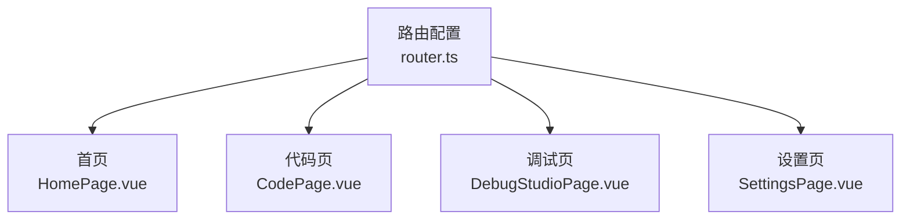
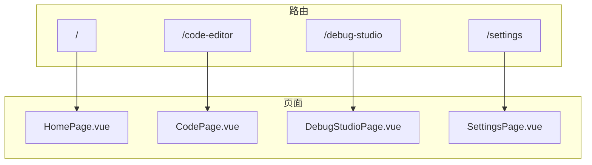
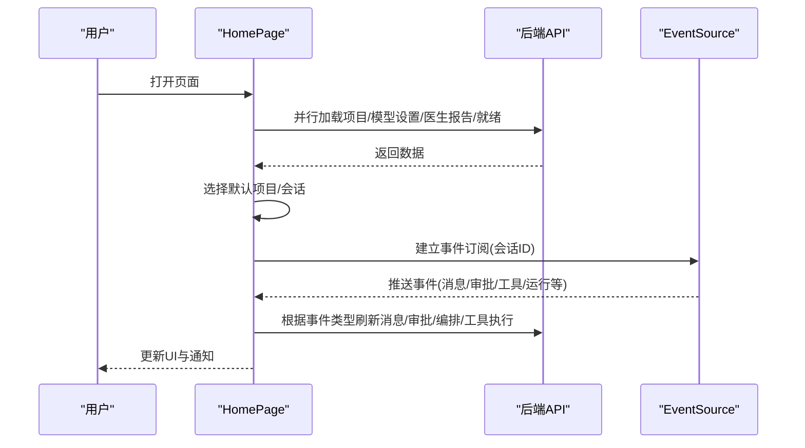
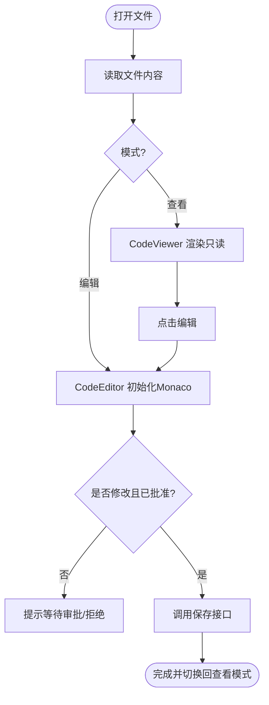
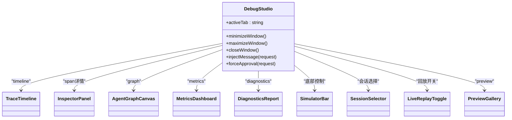
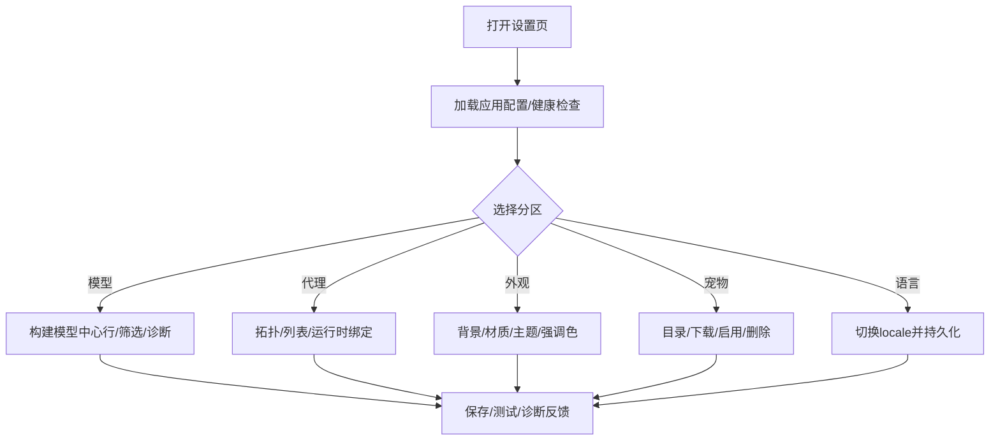
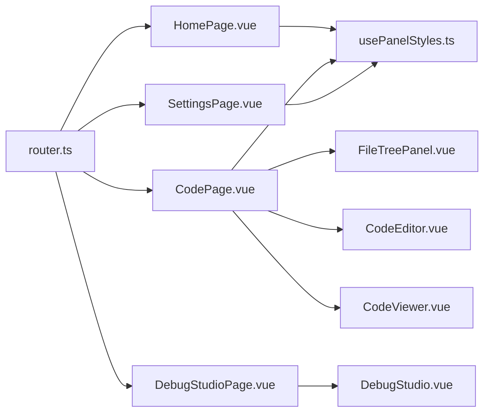

# 应用页面

<cite>
**本文引用的文件**   
- [router.ts](file://apps/desktop/src/router.ts)
- [HomePage.vue](file://apps/desktop/src/pages/HomePage.vue)
- [CodePage.vue](file://apps/desktop/src/pages/CodePage.vue)
- [DebugStudioPage.vue](file://apps/desktop/src/pages/DebugStudioPage.vue)
- [SettingsPage.vue](file://apps/desktop/src/pages/SettingsPage.vue)
- [DebugStudio.vue](file://apps/desktop/src/debug/DebugStudio.vue)
- [FileTreePanel.vue](file://apps/desktop/src/components/code/FileTreePanel.vue)
- [CodeEditor.vue](file://apps/desktop/src/components/code/CodeEditor.vue)
- [CodeViewer.vue](file://apps/desktop/src/components/code/CodeViewer.vue)
- [usePanelStyles.ts](file://apps/desktop/src/composables/usePanelStyles.ts)
</cite>

## 目录
1. [简介](#简介)
2. [项目结构](#项目结构)
3. [核心组件与页面职责](#核心组件与页面职责)
4. [架构总览](#架构总览)
5. [详细组件分析](#详细组件分析)
6. [依赖关系分析](#依赖关系分析)
7. [性能与缓存策略](#性能与缓存策略)
8. [故障排查指南](#故障排查指南)
9. [结论](#结论)
10. [附录：路由与交互示例路径](#附录路由与交互示例路径)

## 简介
本文件面向初学者与有经验的开发者，系统化梳理 TinadecOffice 桌面端应用的四个关键页面：HomePage（主界面）、CodePage（代码编辑）、DebugStudioPage（调试工具集）、SettingsPage（设置管理）。文档从页面布局、面板管理、用户引导流程、数据绑定、事件处理、状态管理与缓存策略等维度展开，并给出架构图、时序图与流程图，帮助读者快速理解复杂页面的设计与实现。

## 项目结构
- 路由配置位于 apps/desktop/src/router.ts，采用 Hash 模式，按需懒加载各页面组件。
- 页面组件集中在 apps/desktop/src/pages 下，每个页面负责自身布局与业务编排。
- 通用 UI 与功能通过 composables 与 components 提供，如 usePanelStyles 控制全局材质效果。

**图表来源** 
- [router.ts:1-45](file://apps/desktop/src/router.ts#L1-L45)

**章节来源**
- [router.ts:1-45](file://apps/desktop/src/router.ts#L1-L45)

## 核心组件与页面职责
- HomePage：主工作区，包含聊天面板、侧边栏、上下文面板；负责项目/会话选择、消息发送、事件订阅、模型设置展示与快捷操作。
- CodePage：代码编辑器工作区，包含文件树、搜索、标签页、查看器/编辑器、补丁预览；支持审批流保存与差异对比。
- DebugStudioPage：调试工具集入口，实际由 debug/DebugStudio.vue 承载，提供时间线、Agent 图、指标、诊断与预览等模块。
- SettingsPage：设置中心，涵盖网关配置、模型/代理/工具层、外观主题、语言、宠物生态、API 文档与关于信息。

**章节来源**
- [HomePage.vue:1-428](file://apps/desktop/src/pages/HomePage.vue#L1-L428)
- [CodePage.vue:1-471](file://apps/desktop/src/pages/CodePage.vue#L1-L471)
- [DebugStudioPage.vue:1-8](file://apps/desktop/src/pages/DebugStudioPage.vue#L1-L8)
- [SettingsPage.vue:1-800](file://apps/desktop/src/pages/SettingsPage.vue#L1-L800)

## 架构总览
页面级路由与组件关系如下：

**图表来源** 
- [router.ts:1-45](file://apps/desktop/src/router.ts#L1-L45)

**章节来源**
- [router.ts:1-45](file://apps/desktop/src/router.ts#L1-L45)

## 详细组件分析

### HomePage 主界面布局与面板管理
- 布局结构：顶部拖拽条 + AppHeader + 三栏工作区（ChatPanel、AppSidebar、ContextPanel），右侧面板可折叠与宽度调节。
- 状态管理：项目列表、会话列表、消息、审批、事件、医生报告、就绪状态、模型设置、编排快照、工具执行时间线等。
- 用户引导：首次进入加载初始数据，失败时显示横幅重试；子窗口跳过入场动画复用连接。
- 事件订阅：使用 EventSource 实时接收事件，按类型刷新消息与审批，限制最近 80 条事件。
- 面板样式：通过 usePanelStyles 统一注入 material 效果（不透明/半透明/毛玻璃）到所有面板。

**图表来源** 
- [HomePage.vue:125-154](file://apps/desktop/src/pages/HomePage.vue#L125-L154)
- [HomePage.vue:179-198](file://apps/desktop/src/pages/HomePage.vue#L179-L198)
- [HomePage.vue:298-317](file://apps/desktop/src/pages/HomePage.vue#L298-L317)

**章节来源**
- [HomePage.vue:1-428](file://apps/desktop/src/pages/HomePage.vue#L1-L428)

### CodePage 代码编辑界面、文件树导航与实时预览
- 布局结构：顶部工具栏（返回、项目选择、新建、刷新、搜索开关、补丁预览开关）+ 三栏内容（左侧文件树+搜索、中间标签页编辑器、右侧补丁预览）。
- 文件树：懒加载目录节点，支持隐藏项过滤、搜索匹配、右键菜单与删除审批。
- 编辑器：基于 Monaco，支持语法高亮、自动换行、撤销重做、格式化、保存审批流。
- 查看器：只读模式，显示文件大小与修改时间，一键切换编辑。
- 补丁预览：对比原始与修改内容，支持审批提交与取消。

**图表来源** 
- [CodePage.vue:97-132](file://apps/desktop/src/pages/CodePage.vue#L97-L132)
- [CodeEditor.vue:122-174](file://apps/desktop/src/components/code/CodeEditor.vue#L122-L174)
- [CodeViewer.vue:48-100](file://apps/desktop/src/components/code/CodeViewer.vue#L48-L100)

**章节来源**
- [CodePage.vue:1-471](file://apps/desktop/src/pages/CodePage.vue#L1-L471)
- [FileTreePanel.vue:1-200](file://apps/desktop/src/components/code/FileTreePanel.vue#L1-L200)
- [CodeEditor.vue:1-200](file://apps/desktop/src/components/code/CodeEditor.vue#L1-L200)
- [CodeViewer.vue:1-164](file://apps/desktop/src/components/code/CodeViewer.vue#L1-L164)

### DebugStudioPage 调试工具集、日志查看与断点调试
- 入口：DebugStudioPage 仅作为壳，实际由 debug/DebugStudio.vue 承载。
- 功能模块：时间线（TraceTimeline）、Agent 拓扑图（AgentGraphCanvas）、指标（MetricsDashboard）、诊断报告（DiagnosticsReport）、预览画廊（PreviewGallery）。
- 交互：底部模拟器栏支持步进、运行、暂停、重置、注入消息与强制审批决策。
- 连接：WebSocket 连接状态在标题栏显示，挂载时拉取追踪与诊断数据。

**图表来源** 
- [DebugStudio.vue:1-158](file://apps/desktop/src/debug/DebugStudio.vue#L1-L158)

**章节来源**
- [DebugStudioPage.vue:1-8](file://apps/desktop/src/pages/DebugStudioPage.vue#L1-L8)
- [DebugStudio.vue:1-303](file://apps/desktop/src/debug/DebugStudio.vue#L1-L303)

### SettingsPage 设置管理、配置验证与偏好保存
- 导航与分区：通用、模型、代理、代理演进、提示词上下文、提示词工程、工具层、外观、宠物、语言、API 文档、关于。
- 网关配置：URL 校验、连通性测试、保存/重置、重启提示。
- 模型中心：供应商、API 连接、模型、CLI、ACP 运行时，支持筛选与诊断。
- 代理中心：拓扑视图与列表视图，运行时绑定与能力编辑。
- 外观与主题：背景设置、面板材质效果、主题与强调色，广播至分离窗口。
- 宠物生态：目录浏览、下载、启用/禁用、删除、文件夹打开。
- 语言：本地化切换并持久化。

**图表来源** 
- [SettingsPage.vue:489-574](file://apps/desktop/src/pages/SettingsPage.vue#L489-L574)
- [SettingsPage.vue:583-757](file://apps/desktop/src/pages/SettingsPage.vue#L583-L757)
- [SettingsPage.vue:789-792](file://apps/desktop/src/pages/SettingsPage.vue#L789-L792)

**章节来源**
- [SettingsPage.vue:1-800](file://apps/desktop/src/pages/SettingsPage.vue#L1-L800)

## 依赖关系分析
- 页面与路由：router.ts 定义路由与懒加载组件映射。
- 页面与组件：HomePage 组合 ChatPanel、AppSidebar、ContextPanel；CodePage 组合 FileTreePanel、SearchPanel、CodeViewer、CodeEditor、PatchPreview；DebugStudioPage 组合多个调试模块；SettingsPage 组合大量设置模块与 UI 组件。
- 样式系统：usePanelStyles 为所有面板提供统一的材质效果，通过 CSS 自定义属性与 data-panel-effect 驱动。

**图表来源** 
- [router.ts:1-45](file://apps/desktop/src/router.ts#L1-L45)
- [usePanelStyles.ts:1-200](file://apps/desktop/src/composables/usePanelStyles.ts#L1-L200)
- [HomePage.vue:1-428](file://apps/desktop/src/pages/HomePage.vue#L1-L428)
- [CodePage.vue:1-471](file://apps/desktop/src/pages/CodePage.vue#L1-L471)
- [DebugStudioPage.vue:1-8](file://apps/desktop/src/pages/DebugStudioPage.vue#L1-L8)
- [SettingsPage.vue:1-800](file://apps/desktop/src/pages/SettingsPage.vue#L1-L800)

**章节来源**
- [router.ts:1-45](file://apps/desktop/src/router.ts#L1-L45)
- [usePanelStyles.ts:1-200](file://apps/desktop/src/composables/usePanelStyles.ts#L1-L200)

## 性能与缓存策略
- 懒加载与按需导入：路由使用动态 import，减少首屏体积。
- 并发请求：HomePage 初始化阶段并行加载项目、模型设置、医生报告与就绪状态，缩短等待时间。
- 事件限流：EventSource 仅保留最近 80 条事件，避免内存膨胀。
- 编辑器实例复用：CodeViewer/CodeEditor 在组件销毁时释放 Monaco 实例与 model，防止泄漏。
- 面板样式缓存：usePanelStyles 将材质设置持久化存储，避免重复计算与闪烁。
- 分页与懒加载：文件树节点按需展开，搜索与宠物目录支持增量加载与 IntersectionObserver。

[本节为通用指导，无需具体文件引用]

## 故障排查指南
- 首页加载失败：检查网络与后端可用性，使用横幅重试按钮重新加载。
- 事件订阅异常：确认会话 ID 有效，必要时重建 EventSource。
- 代码保存失败：确保存在会话且审批已通过，查看审批状态与错误提示。
- 调试工具离线：检查 WebSocket 连接状态，确认后端服务可用。
- 设置保存失败：校验 URL 格式与权限，查看通知与诊断信息。

**章节来源**
- [HomePage.vue:125-154](file://apps/desktop/src/pages/HomePage.vue#L125-L154)
- [CodeEditor.vue:122-174](file://apps/desktop/src/components/code/CodeEditor.vue#L122-L174)
- [DebugStudio.vue:60-64](file://apps/desktop/src/debug/DebugStudio.vue#L60-L64)
- [SettingsPage.vue:489-574](file://apps/desktop/src/pages/SettingsPage.vue#L489-L574)

## 结论
本项目以清晰的页面职责划分与模块化组件设计，实现了丰富的桌面端体验。HomePage 聚焦对话与工作流编排，CodePage 提供专业代码编辑与审批安全机制，DebugStudioPage 集成多维调试能力，SettingsPage 覆盖全面的配置与个性化选项。通过路由懒加载、并发请求、事件限流与样式缓存等策略，兼顾了性能与用户体验。建议后续持续优化大文件编辑性能、增强错误恢复与离线能力，并完善国际化与无障碍支持。

[本节为总结性内容，无需具体文件引用]

## 附录：路由与交互示例路径
- 路由配置示例：apps/desktop/src/router.ts
- 首页数据加载与事件订阅：apps/desktop/src/pages/HomePage.vue
- 代码编辑审批流与保存：apps/desktop/src/components/code/CodeEditor.vue
- 文件树懒加载与搜索：apps/desktop/src/components/code/FileTreePanel.vue
- 只读查看与切换编辑：apps/desktop/src/components/code/CodeViewer.vue
- 调试工具集入口与模块组织：apps/desktop/src/pages/DebugStudioPage.vue, apps/desktop/src/debug/DebugStudio.vue
- 设置中心与配置验证：apps/desktop/src/pages/SettingsPage.vue
- 面板材质效果与样式绑定：apps/desktop/src/composables/usePanelStyles.ts

**章节来源**
- [router.ts:1-45](file://apps/desktop/src/router.ts#L1-L45)
- [HomePage.vue:1-428](file://apps/desktop/src/pages/HomePage.vue#L1-L428)
- [CodeEditor.vue:1-200](file://apps/desktop/src/components/code/CodeEditor.vue#L1-L200)
- [FileTreePanel.vue:1-200](file://apps/desktop/src/components/code/FileTreePanel.vue#L1-L200)
- [CodeViewer.vue:1-164](file://apps/desktop/src/components/code/CodeViewer.vue#L1-L164)
- [DebugStudioPage.vue:1-8](file://apps/desktop/src/pages/DebugStudioPage.vue#L1-L8)
- [DebugStudio.vue:1-158](file://apps/desktop/src/debug/DebugStudio.vue#L1-L158)
- [SettingsPage.vue:1-800](file://apps/desktop/src/pages/SettingsPage.vue#L1-L800)
- [usePanelStyles.ts:1-200](file://apps/desktop/src/composables/usePanelStyles.ts#L1-L200)