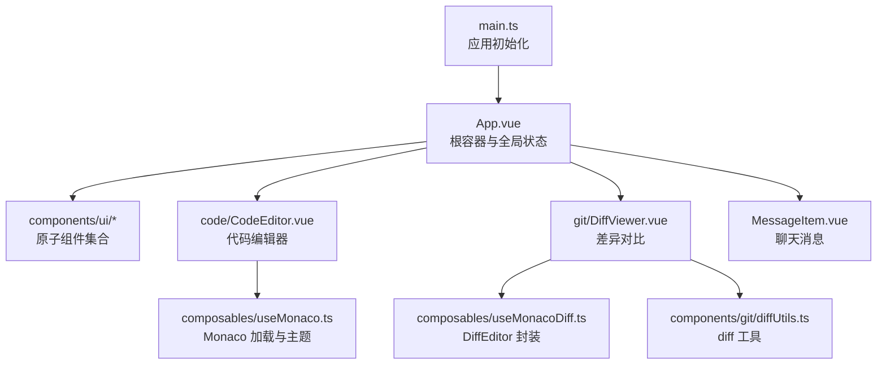
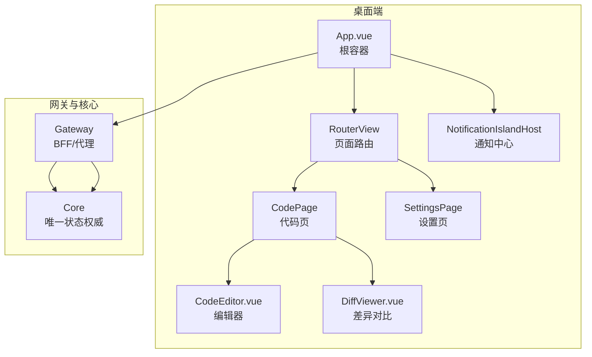
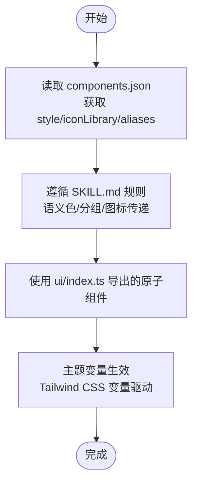
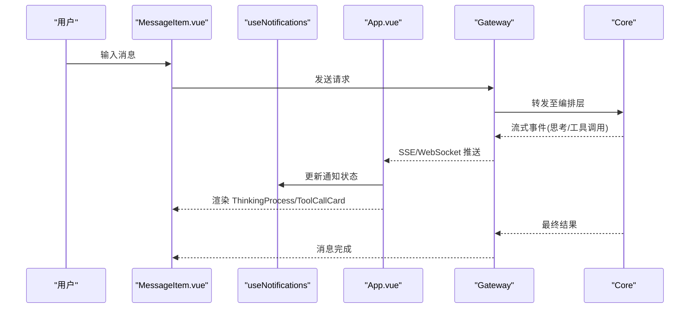
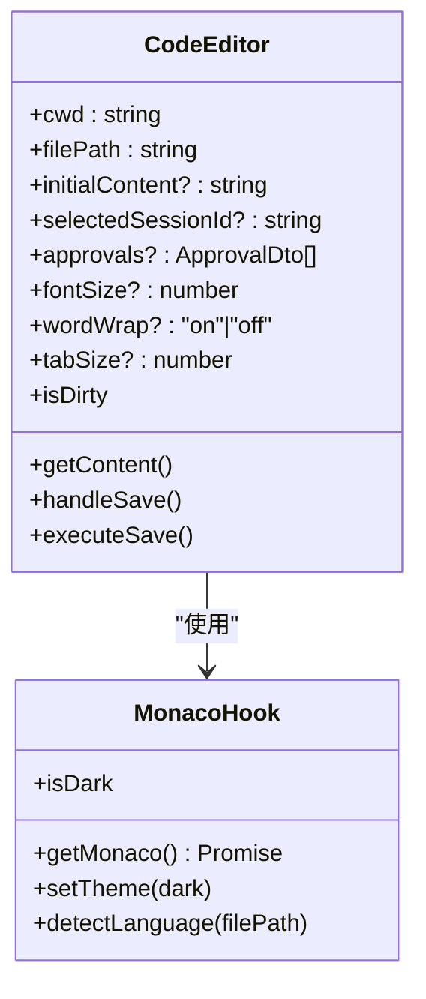
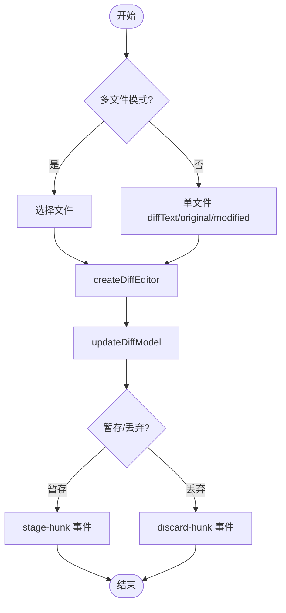
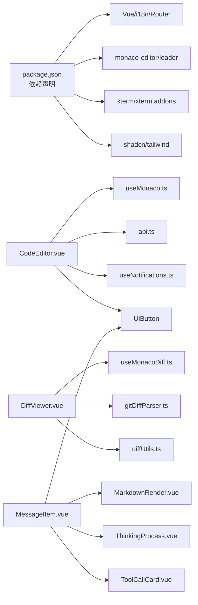

# 桌面组件库

<cite>
**本文引用的文件**   
- [README.md](file://README.md)
- [package.json](file://apps/desktop/package.json)
- [App.vue](file://apps/desktop/src/App.vue)
- [main.ts](file://apps/desktop/src/main.ts)
- [components.json](file://apps/desktop/components.json)
- [SKILL.md](file://.agents\skills\shadcn-vue\SKILL.md)
- [index.ts（UI 导出）](file://apps/desktop/src/components/ui/index.ts)
- [button.vue](file://apps/desktop/src/components/ui/button.vue)
- [CodeEditor.vue](file://apps/desktop/src/components/code/CodeEditor.vue)
- [useMonaco.ts](file://apps/desktop/src/composables/useMonaco.ts)
- [DiffViewer.vue](file://apps/desktop/src/components/git/DiffViewer.vue)
- [useMonacoDiff.ts](file://apps/desktop/src/composables/useMonacoDiff.ts)
- [diffUtils.ts](file://apps/desktop/src/components/git/diffUtils.ts)
- [MessageItem.vue](file://apps/desktop/src/components/MessageItem.vue)
</cite>

## 目录
1. [简介](#简介)
2. [项目结构](#项目结构)
3. [核心组件](#核心组件)
4. [架构总览](#架构总览)
5. [详细组件分析](#详细组件分析)
6. [依赖关系分析](#依赖关系分析)
7. [性能考量](#性能考量)
8. [故障排查指南](#故障排查指南)
9. [结论](#结论)
10. [附录](#附录)

## 简介
本仓库为面向 AI 智能体协作的桌面应用，前端采用 Electron + Vue 3 + Vite + Tailwind 构建。UI 层基于 shadcn-vue 进行组件化与主题定制，集成 Monaco 编辑器用于代码编辑与差异对比，提供 Git 版本控制界面、聊天消息渲染与流式响应处理等能力。后端通过 Gateway 代理 Core，Desktop 仅调用 Gateway，保证状态权威在 Core 中，写操作需经审批门控。

## 项目结构
- 前端入口与初始化：
  - main.ts 负责创建 Vue 应用、注册路由与国际化、注入通知文案、挂载前应用初始主题。
  - App.vue 作为根容器，管理背景层、连接状态、页面过渡动画、通知岛与详情弹窗。
- UI 基础与主题：
  - components.json 定义 shadcn-vue 的样式风格、别名、图标库等。
  - SKILL.md 给出 shadcn-vue 的使用规范、关键规则与 CLI 工作流。
  - components/ui/index.ts 统一导出 UI 原子组件；button.vue 展示基于 class-variance-authority 的变体与尺寸体系。
- 功能组件：
  - CodeEditor.vue 封装 Monaco 编辑器，支持语法高亮、自动布局、保存审批流。
  - DiffViewer.vue 封装 Monaco DiffEditor，支持单文件与多文件模式、行内/并排视图切换、暂存/丢弃操作。
  - MessageItem.vue 渲染聊天消息，包含用户/AI 两种形态、工具调用卡片、思考过程与复制/编辑交互。
- Composables：
  - useMonaco.ts / useMonacoDiff.ts 封装 Monaco 加载、主题同步、语言检测与模型更新。
  - diffUtils.ts 提供 unified diff 解析后的重建、统计与语言映射。

**图表来源** 
- [main.ts:1-24](file://apps/desktop/src/main.ts#L1-L24)
- [App.vue:1-182](file://apps/desktop/src/App.vue#L1-L182)
- [components.json:1-24](file://apps/desktop/components.json#L1-L24)
- [SKILL.md:1-232](file://.agents\skills\shadcn-vue\SKILL.md#L1-L232)
- [index.ts（UI 导出）:1-31](file://apps/desktop/src/components/ui/index.ts#L1-L31)
- [button.vue:1-66](file://apps/desktop/src/components/ui/button.vue#L1-L66)
- [CodeEditor.vue:1-287](file://apps/desktop/src/components/code/CodeEditor.vue#L1-L287)
- [useMonaco.ts:1-147](file://apps/desktop/src/composables/useMonaco.ts#L1-L147)
- [DiffViewer.vue:1-470](file://apps/desktop/src/components/git/DiffViewer.vue#L1-L470)
- [useMonacoDiff.ts:1-127](file://apps/desktop/src/composables/useMonacoDiff.ts#L1-L127)
- [diffUtils.ts:1-164](file://apps/desktop/src/components/git/diffUtils.ts#L1-L164)

**章节来源**
- [README.md:1-120](file://README.md#L1-L120)
- [package.json:1-69](file://apps/desktop/package.json#L1-L69)
- [main.ts:1-24](file://apps/desktop/src/main.ts#L1-L24)
- [App.vue:1-182](file://apps/desktop/src/App.vue#L1-L182)
- [components.json:1-24](file://apps/desktop/components.json#L1-L24)
- [SKILL.md:1-232](file://.agents\skills\shadcn-vue\SKILL.md#L1-L232)
- [index.ts（UI 导出）:1-31](file://apps/desktop/src/components/ui/index.ts#L1-L31)
- [button.vue:1-66](file://apps/desktop/src/components/ui/button.vue#L1-L66)

## 核心组件
- UI 原子组件与主题
  - 通过 components.json 配置 style、iconLibrary、aliases 等，确保一致的命名空间与样式变量。
  - button.vue 使用 cva 定义 variant/size 变体，结合 cn 组合类名，遵循 shadcn 语义色与无自定义 z-index 的规则。
- Monaco 编辑器集成
  - useMonaco.ts 负责按需加载 monaco-editor、设置主题、监听系统/手动主题变化，并提供 detectLanguage 映射。
  - CodeEditor.vue 封装编辑器实例生命周期、内容变更监听、快捷键保存、审批流触发与结果回调。
- 差异对比组件
  - useMonacoDiff.ts 封装 createDiffEditor/updateDiffModel/disposeDiffEditor，保持只读与最小化体验。
  - DiffViewer.vue 支持单文件与多文件模式，内置 diff 统计、二进制提示、截断提示、行内/并排切换与暂存/丢弃动作。
  - diffUtils.ts 提供从 hunks 重建 original/modified、统计汇总与语言识别。
- 聊天消息渲染
  - MessageItem.vue 区分用户/AI 消息，渲染 Markdown、工具调用卡片与思考过程，提供复制与编辑交互。

**章节来源**
- [components.json:1-24](file://apps/desktop/components.json#L1-L24)
- [SKILL.md:1-232](file://.agents\skills\shadcn-vue\SKILL.md#L1-L232)
- [button.vue:1-66](file://apps/desktop/src/components/ui/button.vue#L1-L66)
- [useMonaco.ts:1-147](file://apps/desktop/src/composables/useMonaco.ts#L1-L147)
- [CodeEditor.vue:1-287](file://apps/desktop/src/components/code/CodeEditor.vue#L1-L287)
- [useMonacoDiff.ts:1-127](file://apps/desktop/src/composables/useMonacoDiff.ts#L1-L127)
- [DiffViewer.vue:1-470](file://apps/desktop/src/components/git/DiffViewer.vue#L1-L470)
- [diffUtils.ts:1-164](file://apps/desktop/src/components/git/diffUtils.ts#L1-L164)
- [MessageItem.vue:1-138](file://apps/desktop/src/components/MessageItem.vue#L1-L138)

## 架构总览
- Desktop 通过 Gateway 访问 Core，所有业务状态由 Core 维护；写操作必须经过审批门。
- UI 层以 Vue 3 + shadcn-vue 为基础，Monaco 作为编辑器内核，DiffViewer 复用同一内核实现差异对比。
- 主题与国际化贯穿应用：main.ts 初始化主题与通知文案，App.vue 管理连接状态与通知岛。

**图表来源** 
- [App.vue:1-182](file://apps/desktop/src/App.vue#L1-L182)
- [CodeEditor.vue:1-287](file://apps/desktop/src/components/code/CodeEditor.vue#L1-L287)
- [DiffViewer.vue:1-470](file://apps/desktop/src/components/git/DiffViewer.vue#L1-L470)
- [README.md:1-120](file://README.md#L1-L120)

## 详细组件分析

### shadcn-vue 集成与主题定制机制
- 配置文件
  - components.json 指定 style、tailwind 配置路径、CSS 变量开关、图标库与别名映射，确保组件导入与样式一致。
- 使用规范
  - SKILL.md 强调优先使用现有组件、语义色、避免自定义 z-index、表单与分组结构的正确用法、图标传递方式等。
- 组件示例
  - button.vue 使用 cva 定义变体与尺寸，结合 cn 组合类名，体现“用 class 做布局而非样式”的原则。

**图表来源** 
- [components.json:1-24](file://apps/desktop/components.json#L1-L24)
- [SKILL.md:1-232](file://.agents\skills\shadcn-vue\SKILL.md#L1-L232)
- [index.ts（UI 导出）:1-31](file://apps/desktop/src/components/ui/index.ts#L1-L31)
- [button.vue:1-66](file://apps/desktop/src/components/ui/button.vue#L1-L66)

**章节来源**
- [components.json:1-24](file://apps/desktop/components.json#L1-L24)
- [SKILL.md:1-232](file://.agents\skills\shadcn-vue\SKILL.md#L1-L232)
- [index.ts（UI 导出）:1-31](file://apps/desktop/src/components/ui/index.ts#L1-L31)
- [button.vue:1-66](file://apps/desktop/src/components/ui/button.vue#L1-L66)

### 聊天组件：消息渲染与流式响应处理
- 消息渲染
  - MessageItem.vue 根据 role 区分用户与 AI 消息，AI 消息包含 Agent 标签、时间戳、思考过程与工具调用卡片，用户消息提供复制与编辑。
- 流式响应
  - 应用层通过 useConnection 与 useNotifications 管理连接状态与通知；App.vue 在连接超时或断开时显示重试操作。
- 交互流程
  - 用户输入 -> 发送请求 -> 接收流式事件 -> 渲染 ThinkingProcess/ToolCallCard -> 最终消息落盘。

**图表来源** 
- [MessageItem.vue:1-138](file://apps/desktop/src/components/MessageItem.vue#L1-L138)
- [App.vue:1-182](file://apps/desktop/src/App.vue#L1-L182)
- [README.md:1-120](file://README.md#L1-L120)

**章节来源**
- [MessageItem.vue:1-138](file://apps/desktop/src/components/MessageItem.vue#L1-L138)
- [App.vue:1-182](file://apps/desktop/src/App.vue#L1-L182)

### 代码编辑器：Monaco 集成、语法高亮与智能提示
- 初始化与主题
  - useMonaco.ts 按需加载 monaco-editor，设置 vs/vs-dark 主题，监听系统/手动主题变化。
- 编辑器实例
  - CodeEditor.vue 创建 editor/model，绑定 onDidChangeModelContent、Ctrl+S 保存、格式化、撤销/重做。
- 保存审批流
  - 保存前先创建 ApprovalDto，等待批准后再执行实际写入，失败则回滚并提示。

**图表来源** 
- [CodeEditor.vue:1-287](file://apps/desktop/src/components/code/CodeEditor.vue#L1-L287)
- [useMonaco.ts:1-147](file://apps/desktop/src/composables/useMonaco.ts#L1-L147)

**章节来源**
- [CodeEditor.vue:1-287](file://apps/desktop/src/components/code/CodeEditor.vue#L1-L287)
- [useMonaco.ts:1-147](file://apps/desktop/src/composables/useMonaco.ts#L1-L147)

### Git 组件：版本控制界面、差异对比与分支管理
- 差异对比
  - DiffViewer.vue 支持单文件与多文件模式，内置 diff 统计、二进制与截断提示，支持行内/并排切换。
  - useMonacoDiff.ts 封装 DiffEditor 的创建、更新与销毁，保持只读与最小化体验。
  - diffUtils.ts 提供从 hunks 重建 original/modified、统计汇总与语言识别。
- 分支管理与暂存
  - 通过 stage-hunk/discard-hunk 事件向上抛出，上层可对接 Git 命令或 API 实现暂存/丢弃。

**图表来源** 
- [DiffViewer.vue:1-470](file://apps/desktop/src/components/git/DiffViewer.vue#L1-L470)
- [useMonacoDiff.ts:1-127](file://apps/desktop/src/composables/useMonacoDiff.ts#L1-L127)
- [diffUtils.ts:1-164](file://apps/desktop/src/components/git/diffUtils.ts#L1-L164)

**章节来源**
- [DiffViewer.vue:1-470](file://apps/desktop/src/components/git/DiffViewer.vue#L1-L470)
- [useMonacoDiff.ts:1-127](file://apps/desktop/src/composables/useMonacoDiff.ts#L1-L127)
- [diffUtils.ts:1-164](file://apps/desktop/src/components/git/diffUtils.ts#L1-L164)

### 可复用组件与组件间通信
- 可复用性
  - UI 原子组件通过 index.ts 集中导出，便于跨模块引用；button.vue 展示变体与尺寸的标准化。
- 组件通信
  - CodeEditor.vue 通过 emits 暴露 saved/cancel/approval-requested 事件；DiffViewer.vue 通过 update:selectedFilePath/stage-hunk/discard-hunk 与父级通信；MessageItem.vue 通过 approve/reject 与父级交互。
- 用户交互
  - 复制、编辑、保存、格式化、撤销/重做、暂存/丢弃等操作均通过事件或回调向上冒泡，保持组件职责单一。

**章节来源**
- [index.ts（UI 导出）:1-31](file://apps/desktop/src/components/ui/index.ts#L1-L31)
- [button.vue:1-66](file://apps/desktop/src/components/ui/button.vue#L1-L66)
- [CodeEditor.vue:1-287](file://apps/desktop/src/components/code/CodeEditor.vue#L1-L287)
- [DiffViewer.vue:1-470](file://apps/desktop/src/components/git/DiffViewer.vue#L1-L470)
- [MessageItem.vue:1-138](file://apps/desktop/src/components/MessageItem.vue#L1-L138)

## 依赖关系分析
- 包依赖
  - package.json 声明了 Vue、Monaco、Xterm、Tailwind、shadcn、i18n 等依赖，以及 Electron/Vitest 等开发依赖。
- 组件依赖
  - CodeEditor.vue 依赖 useMonaco.ts、api、useNotifications、UiButton。
  - DiffViewer.vue 依赖 useMonacoDiff.ts、gitDiffParser、diffUtils、UiButton。
  - MessageItem.vue 依赖 MarkdownRender、ThinkingProcess、ToolCallCard、UiButton。

**图表来源** 
- [package.json:1-69](file://apps/desktop/package.json#L1-L69)
- [CodeEditor.vue:1-287](file://apps/desktop/src/components/code/CodeEditor.vue#L1-L287)
- [useMonaco.ts:1-147](file://apps/desktop/src/composables/useMonaco.ts#L1-L147)
- [DiffViewer.vue:1-470](file://apps/desktop/src/components/git/DiffViewer.vue#L1-L470)
- [useMonacoDiff.ts:1-127](file://apps/desktop/src/composables/useMonacoDiff.ts#L1-L127)
- [diffUtils.ts:1-164](file://apps/desktop/src/components/git/diffUtils.ts#L1-L164)
- [MessageItem.vue:1-138](file://apps/desktop/src/components/MessageItem.vue#L1-L138)

**章节来源**
- [package.json:1-69](file://apps/desktop/package.json#L1-L69)
- [CodeEditor.vue:1-287](file://apps/desktop/src/components/code/CodeEditor.vue#L1-L287)
- [DiffViewer.vue:1-470](file://apps/desktop/src/components/git/DiffViewer.vue#L1-L470)
- [MessageItem.vue:1-138](file://apps/desktop/src/components/MessageItem.vue#L1-L138)

## 性能考量
- Monaco 懒加载与缓存
  - useMonaco.ts/useMonacoDiff.ts 通过 loader.init 延迟加载，避免首屏阻塞；实例单例缓存减少重复初始化。
- 主题同步
  - 监听 isDark 变化动态 setTheme，避免全量重绘。
- 编辑器模型管理
  - CodeEditor.vue 在组件卸载时 dispose editor/model，防止内存泄漏。
- 差异对比优化
  - DiffViewer.vue 使用只读 DiffEditor，关闭 minimap/overviewRuler，降低渲染开销。
- 列表与虚拟滚动
  - 对于大量消息或文件列表，建议引入虚拟滚动（如 vue-virtual-scroller），减少 DOM 节点数量。

[本节为通用指导，不直接分析具体文件]

## 故障排查指南
- 连接问题
  - App.vue 在连接超时/断开时弹出通知并提供重试操作；检查 Gateway/Core 端口与网络连通性。
- 编辑器加载失败
  - useMonaco.ts 提供 CDN 回退路径；确认网络可达或本地 bundle 完整性。
- 审批流异常
  - CodeEditor.vue 保存前创建 ApprovalDto，若未获得 approved 状态不会执行写入；检查会话 ID 与后端审批服务。
- 差异对比为空
  - DiffViewer.vue 依赖 diffText/original/modified；确认上游数据格式与 parseUnifiedDiff 解析结果。

**章节来源**
- [App.vue:1-182](file://apps/desktop/src/App.vue#L1-L182)
- [useMonaco.ts:1-147](file://apps/desktop/src/composables/useMonaco.ts#L1-L147)
- [CodeEditor.vue:1-287](file://apps/desktop/src/components/code/CodeEditor.vue#L1-L287)
- [DiffViewer.vue:1-470](file://apps/desktop/src/components/git/DiffViewer.vue#L1-L470)

## 结论
该桌面组件库以 shadcn-vue 为基础，结合 Monaco 编辑器与 Vue 3 生态，构建了可复用的 UI 基础设施与丰富的业务组件。通过严格的组件规范与主题定制机制，保证了视觉一致性；通过事件驱动的组件通信与审批门控，实现了安全的用户交互。建议在大规模数据场景下引入虚拟滚动与更细粒度的懒加载策略，进一步提升性能与用户体验。

[本节为总结，不直接分析具体文件]

## 附录
- 快速开始与常用命令见 README.md。
- shadcn-vue 的 CLI 与工作流参考 SKILL.md。
- 组件导出与原子组件清单参见 components/ui/index.ts。

[本节为补充信息，不直接分析具体文件]