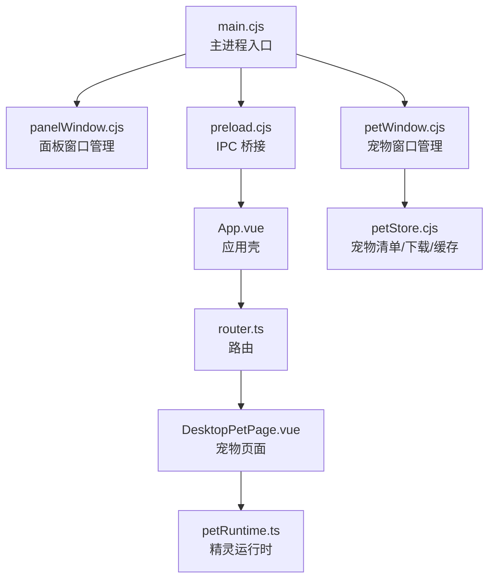
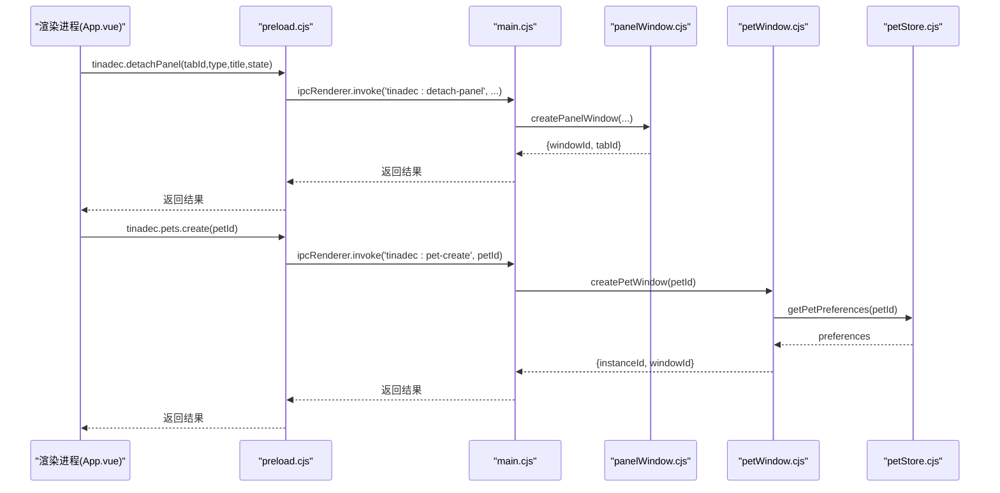
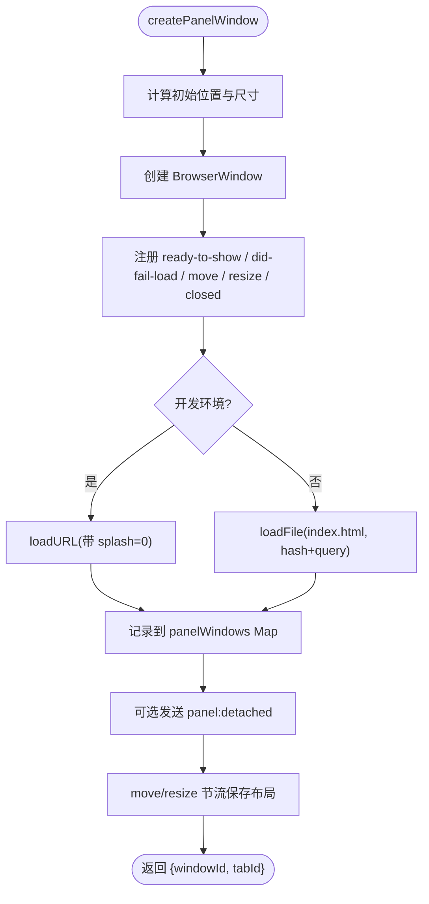
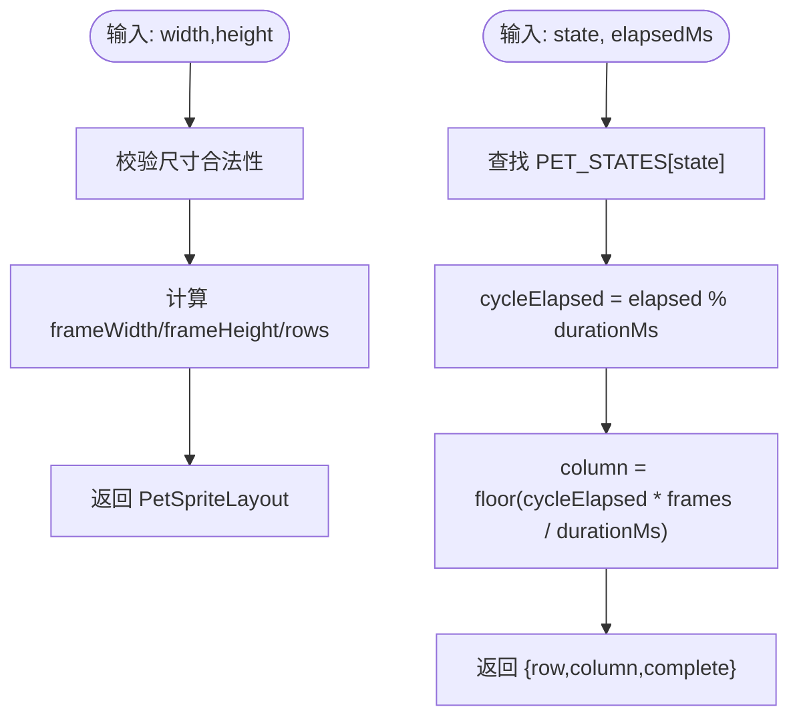
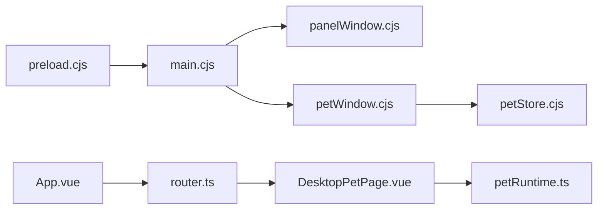

# 窗口管理系统

<cite>
**本文引用的文件**   
- [apps/desktop/electron/main.cjs](file://apps/desktop/electron/main.cjs)
- [apps/desktop/electron/panelWindow.cjs](file://apps/desktop/electron/panelWindow.cjs)
- [apps/desktop/electron/petWindow.cjs](file://apps/desktop/electron/petWindow.cjs)
- [apps/desktop/electron/preload.cjs](file://apps/desktop/electron/preload.cjs)
- [apps/desktop/src/router.ts](file://apps/desktop/src/router.ts)
- [apps/desktop/src/App.vue](file://apps/desktop/src/App.vue)
- [apps/desktop/src/pages/DesktopPetPage.vue](file://apps/desktop/src/pages/DesktopPetPage.vue)
- [apps/desktop/src/pets/petRuntime.ts](file://apps/desktop/src/pets/petRuntime.ts)
- [apps/desktop/electron/petStore.cjs](file://apps/desktop/electron/petStore.cjs)
</cite>

## 目录
1. [简介](#简介)
2. [项目结构](#项目结构)
3. [核心组件](#核心组件)
4. [架构总览](#架构总览)
5. [详细组件分析](#详细组件分析)
6. [依赖关系分析](#依赖关系分析)
7. [性能考虑](#性能考虑)
8. [故障排查指南](#故障排查指南)
9. [结论](#结论)
10. [附录：示例与最佳实践](#附录示例与最佳实践)

## 简介
本文件系统性地梳理并解释 TinadecOffice 桌面应用中的窗口管理机制，重点覆盖：
- 面板窗口（Panel Window）的创建、生命周期、持久化与主窗口通信
- 宠物窗口（Pet Window）的独立运行模式、状态同步与点击穿透
- 前端运行时 petRuntime.ts 的精灵帧计算与动画驱动
- IPC 消息传递与事件订阅发布模式
- 窗口持久化、内存管理与资源清理策略
- 面向初学者的 Electron 窗口概念说明，以及面向有经验开发者的多窗口协作与性能优化建议

## 项目结构
本项目采用“主进程 + 渲染进程”的经典 Electron 架构。关键入口与模块如下：
- 主进程入口 main.cjs：注册协议、创建主窗口、集中处理 IPC、协调面板与宠物窗口
- 面板窗口管理 panelWindow.cjs：负责浮动面板窗口的创建、布局持久化、关闭/重附着、广播通知
- 宠物窗口管理 petWindow.cjs：负责宠物实例窗口创建、位置/缩放持久化、点击穿透控制
- 预加载脚本 preload.cjs：向渲染进程暴露 tinadec API，封装 IPC 调用与事件订阅
- 路由 router.ts：定义 /panel 与 /pet 等子窗口路由
- 应用壳 App.vue：根据查询参数区分主窗口/子窗口/宠物窗口，决定是否启动连接与通知同步
- 宠物页面 DesktopPetPage.vue：Canvas 渲染精灵图，响应拖拽/缩放/双击跳跃等交互
- 宠物运行时 petRuntime.ts：精灵网格解析、帧计算、源矩形映射
- 宠物存储 petStore.cjs：清单缓存、下载、本地元数据与预览缓存



图表来源
- [apps/desktop/electron/main.cjs:1-374](file://apps/desktop/electron/main.cjs#L1-L374)
- [apps/desktop/electron/panelWindow.cjs:1-421](file://apps/desktop/electron/panelWindow.cjs#L1-L421)
- [apps/desktop/electron/petWindow.cjs:1-194](file://apps/desktop/electron/petWindow.cjs#L1-L194)
- [apps/desktop/electron/preload.cjs:1-112](file://apps/desktop/electron/preload.cjs#L1-L112)
- [apps/desktop/src/router.ts:1-45](file://apps/desktop/src/router.ts#L1-L45)
- [apps/desktop/src/App.vue:1-182](file://apps/desktop/src/App.vue#L1-L182)
- [apps/desktop/src/pages/DesktopPetPage.vue:1-200](file://apps/desktop/src/pages/DesktopPetPage.vue#L1-L200)
- [apps/desktop/src/pets/petRuntime.ts:1-63](file://apps/desktop/src/pets/petRuntime.ts#L1-L63)
- [apps/desktop/electron/petStore.cjs:1-361](file://apps/desktop/electron/petStore.cjs#L1-L361)

章节来源
- [apps/desktop/electron/main.cjs:1-374](file://apps/desktop/electron/main.cjs#L1-L374)
- [apps/desktop/electron/panelWindow.cjs:1-421](file://apps/desktop/electron/panelWindow.cjs#L1-L421)
- [apps/desktop/electron/petWindow.cjs:1-194](file://apps/desktop/electron/petWindow.cjs#L1-L194)
- [apps/desktop/electron/preload.cjs:1-112](file://apps/desktop/electron/preload.cjs#L1-L112)
- [apps/desktop/src/router.ts:1-45](file://apps/desktop/src/router.ts#L1-L45)
- [apps/desktop/src/App.vue:1-182](file://apps/desktop/src/App.vue#L1-L182)
- [apps/desktop/src/pages/DesktopPetPage.vue:1-200](file://apps/desktop/src/pages/DesktopPetPage.vue#L1-L200)
- [apps/desktop/src/pets/petRuntime.ts:1-63](file://apps/desktop/src/pets/petRuntime.ts#L1-L63)
- [apps/desktop/electron/petStore.cjs:1-361](file://apps/desktop/electron/petStore.cjs#L1-L361)

## 核心组件
- 面板窗口（panelWindow.cjs）
  - 功能：创建浮动面板、记录窗口 ID/类型/标题/状态、保存/恢复布局、关闭/重附着、主题广播、获取主窗口
  - 关键点：ready-to-show 时序、超时兜底显示、bounds 变更节流持久化、Map 跟踪所有面板
- 宠物窗口（petWindow.cjs）
  - 功能：按 petId 创建独立透明窗口、支持多实例、持久化 window/scale、点击穿透、关闭时禁用宠物
  - 关键点：屏幕工作区边界钳制、alwaysOnTop、skipTaskbar、sender 到 entry 的反查
- 预加载脚本（preload.cjs）
  - 功能：暴露 tinadec API（pets、panel、status notification、terminal、app config），封装 IPC 调用与事件订阅
- 应用壳（App.vue）
  - 功能：识别 isChildWindow/isPetWindow，决定是否启动连接与通知同步；为子窗口跳过首次启动序列
- 宠物运行时（petRuntime.ts）
  - 功能：解析 Petdex 精灵网格、计算当前帧、生成源矩形
- 宠物存储（petStore.cjs）
  - 功能：清单拉取与缓存、下载校验、本地 registry、预览缓存 LRU、启用/禁用/删除

章节来源
- [apps/desktop/electron/panelWindow.cjs:1-421](file://apps/desktop/electron/panelWindow.cjs#L1-L421)
- [apps/desktop/electron/petWindow.cjs:1-194](file://apps/desktop/electron/petWindow.cjs#L1-L194)
- [apps/desktop/electron/preload.cjs:1-112](file://apps/desktop/electron/preload.cjs#L1-L112)
- [apps/desktop/src/App.vue:1-182](file://apps/desktop/src/App.vue#L1-L182)
- [apps/desktop/src/pets/petRuntime.ts:1-63](file://apps/desktop/src/pets/petRuntime.ts#L1-L63)
- [apps/desktop/electron/petStore.cjs:1-361](file://apps/desktop/electron/petStore.cjs#L1-L361)

## 架构总览
下图展示主进程与各模块的交互关系，以及渲染进程通过 preload 访问 IPC 的路径。



图表来源
- [apps/desktop/electron/main.cjs:238-291](file://apps/desktop/electron/main.cjs#L238-L291)
- [apps/desktop/electron/panelWindow.cjs:145-303](file://apps/desktop/electron/panelWindow.cjs#L145-L303)
- [apps/desktop/electron/petWindow.cjs:41-110](file://apps/desktop/electron/petWindow.cjs#L41-L110)
- [apps/desktop/electron/petStore.cjs:307-337](file://apps/desktop/electron/petStore.cjs#L307-L337)
- [apps/desktop/electron/preload.cjs:63-88](file://apps/desktop/electron/preload.cjs#L63-L88)

章节来源
- [apps/desktop/electron/main.cjs:1-374](file://apps/desktop/electron/main.cjs#L1-L374)
- [apps/desktop/electron/preload.cjs:1-112](file://apps/desktop/electron/preload.cjs#L1-L112)

## 详细组件分析

### 面板窗口（panelWindow.cjs）
- 创建流程
  - 计算初始位置（光标附近）、限制在可见显示区内
  - 创建 BrowserWindow，设置无框、最小尺寸、背景色、安全选项
  - 在 loadURL/loadFile 之前注册 ready-to-show，确保窗口能显示；失败加载与超时兜底保证可见性
  - 将窗口信息写入 panelWindows Map，便于后续操作
- 生命周期与持久化
  - move/resize 节流保存布局到磁盘（JSON）
  - closed 事件清理 Map、保存剩余窗口布局、向主窗口发送 panel:closed（除非 skipNotify 或 reattach）
  - 应用退出前 persistPanelStatesForQuit 统一保存
- 窗口间通信
  - 创建后向主窗口发送 panel:detached
  - 提供 broadcastToPanels 向所有面板广播（如主题变化）
  - reattachPanelWindow 标记 _reattaching，避免重复触发 panel:closed，同时通知主窗口重新添加标签页
- 工具方法
  - getMainWindow/tagMainWindow：可靠定位主窗口
  - closeAllPanelWindows/focusPanelWindow/getAllPanelWindows：批量管理



图表来源
- [apps/desktop/electron/panelWindow.cjs:145-303](file://apps/desktop/electron/panelWindow.cjs#L145-L303)
- [apps/desktop/electron/panelWindow.cjs:23-46](file://apps/desktop/electron/panelWindow.cjs#L23-L46)
- [apps/desktop/electron/panelWindow.cjs:83-96](file://apps/desktop/electron/panelWindow.cjs#L83-L96)

章节来源
- [apps/desktop/electron/panelWindow.cjs:1-421](file://apps/desktop/electron/panelWindow.cjs#L1-L421)

### 宠物窗口（petWindow.cjs）
- 创建流程
  - 若同一 petId 已有实例则聚焦现有窗口；否则生成 instanceId
  - 读取偏好（scale/window），clampBounds 限制到屏幕工作区
  - 创建透明无边框窗口，alwaysOnTop、skipTaskbar，webPreferences 安全配置
  - move/resize 节流保存 window/scale 到 petStore
  - ready-to-show 显示窗口，加载 /pet?instanceId=...
- 状态同步与点击穿透
  - setCurrentPetWindowBounds：更新 scale/bounds，节流持久化
  - setCurrentPetWindowClickThrough：基于像素命中测试决定是否允许穿透
  - closeCurrentPetWindow：禁用宠物并关闭窗口，主进程广播 tinadec:pet-changed
- 列表与查询
  - listPetWindows：返回所有实例的 instanceId/petId/windowId/bounds
  - getCurrentPetWindowPet：根据 sender 反查 entry，返回 pet 信息

```mermaid
classDiagram
class PetWindowManager {
+createPetWindow(petId) Promise~{instanceId, windowId}~
+closePetWindow(instanceId) boolean
+closePetWindowForPet(petId) boolean
+closeAllPetWindows() void
+listPetWindows() Array
+setCurrentPetWindowBounds(sender, bounds) boolean
+setCurrentPetWindowClickThrough(sender, enabled) boolean
+closeCurrentPetWindow(sender) Promise~PetRecord?~
+getCurrentPetWindowPet(sender) Promise~PetRecord?~
+getPetWindowPet(instanceId) Promise~PetRecord?~
}
class PetStore {
+getPetPreferences(slug) Promise~{scale, window}?~
+savePetPreferences(slug, input) Promise~publicRecord~
+setEnabled(slug, enabled) Promise~publicRecord~
}
PetWindowManager --> PetStore : "读写偏好/启用状态"
```

图表来源
- [apps/desktop/electron/petWindow.cjs:41-110](file://apps/desktop/electron/petWindow.cjs#L41-L110)
- [apps/desktop/electron/petWindow.cjs:159-180](file://apps/desktop/electron/petWindow.cjs#L159-L180)
- [apps/desktop/electron/petStore.cjs:307-337](file://apps/desktop/electron/petStore.cjs#L307-L337)

章节来源
- [apps/desktop/electron/petWindow.cjs:1-194](file://apps/desktop/electron/petWindow.cjs#L1-L194)
- [apps/desktop/electron/petStore.cjs:1-361](file://apps/desktop/electron/petStore.cjs#L1-L361)

### 宠物运行时（petRuntime.ts）
- 精灵网格解析
  - parsePetSprite：校验宽高、计算 frameWidth/frameHeight/rows，要求 8 列网格
- 帧计算
  - PET_STATES：每种状态的行号、帧数、持续时间
  - petFrameAt：根据 elapsedMs 计算 column，循环播放，complete 标志用于状态切换
- 源矩形
  - petSourceRect：由 row/column 与 layout 计算 source rect



图表来源
- [apps/desktop/src/pets/petRuntime.ts:34-53](file://apps/desktop/src/pets/petRuntime.ts#L34-L53)

章节来源
- [apps/desktop/src/pets/petRuntime.ts:1-63](file://apps/desktop/src/pets/petRuntime.ts#L1-L63)

### 应用壳与路由（App.vue 与 router.ts）
- App.vue
  - 通过 URLSearchParams(splash=0) 判断子窗口，跳过首次启动连接
  - 通过 location.hash 判断宠物窗口，不启动连接与通知同步
  - 背景层始终渲染，避免被过渡动画影响
- router.ts
  - 定义 /panel 与 /pet 路由，分别对应 DetachedPanelPage 与 DesktopPetPage

章节来源
- [apps/desktop/src/App.vue:32-80](file://apps/desktop/src/App.vue#L32-L80)
- [apps/desktop/src/router.ts:1-45](file://apps/desktop/src/router.ts#L1-L45)

### 宠物页面（DesktopPetPage.vue）
- Canvas 渲染精灵图，使用 requestAnimationFrame 驱动
- 交互：拖拽移动、滚轮缩放、双击跳跃、鼠标命中测试决定点击穿透
- 通过 window.tinadec.pets.* 与主进程通信（bounds/click-through/close/current）

章节来源
- [apps/desktop/src/pages/DesktopPetPage.vue:1-200](file://apps/desktop/src/pages/DesktopPetPage.vue#L1-L200)

## 依赖关系分析
- main.cjs 作为中枢，集中处理 IPC，并委托给 panelWindow.cjs 与 petWindow.cjs
- panelWindow.cjs 依赖 screen/BrowserWindow/ipcMain，持久化到 APPDATA/HOME 下的 JSON
- petWindow.cjs 依赖 petStore.cjs 进行偏好与清单管理，使用 protocol 自定义 scheme 提供预览
- preload.cjs 暴露 tinadec API，屏蔽 IPC 细节，提供 onXxx 订阅能力
- App.vue 与 router.ts 协同决定渲染路径与行为差异（主/子/宠物窗口）



图表来源
- [apps/desktop/electron/main.cjs:1-374](file://apps/desktop/electron/main.cjs#L1-L374)
- [apps/desktop/electron/panelWindow.cjs:1-421](file://apps/desktop/electron/panelWindow.cjs#L1-L421)
- [apps/desktop/electron/petWindow.cjs:1-194](file://apps/desktop/electron/petWindow.cjs#L1-L194)
- [apps/desktop/electron/petStore.cjs:1-361](file://apps/desktop/electron/petStore.cjs#L1-L361)
- [apps/desktop/electron/preload.cjs:1-112](file://apps/desktop/electron/preload.cjs#L1-L112)
- [apps/desktop/src/App.vue:1-182](file://apps/desktop/src/App.vue#L1-L182)
- [apps/desktop/src/router.ts:1-45](file://apps/desktop/src/router.ts#L1-L45)
- [apps/desktop/src/pages/DesktopPetPage.vue:1-200](file://apps/desktop/src/pages/DesktopPetPage.vue#L1-L200)
- [apps/desktop/src/pets/petRuntime.ts:1-63](file://apps/desktop/src/pets/petRuntime.ts#L1-L63)

章节来源
- [apps/desktop/electron/main.cjs:1-374](file://apps/desktop/electron/main.cjs#L1-L374)
- [apps/desktop/electron/preload.cjs:1-112](file://apps/desktop/electron/preload.cjs#L1-L112)

## 性能考虑
- 面板窗口
  - 使用节流保存布局，避免频繁 IO
  - ready-to-show 与超时兜底减少不可见窗口概率
  - 主题广播仅遍历存活窗口，注意销毁检查
- 宠物窗口
  - 透明窗口与 alwaysOnTop 可能带来 GPU/CPU 开销，可通过环境变量禁用透明度
  - 像素级命中测试仅在必要时执行，避免每帧 getImageData
  - 预览缓存 LRU 控制内存上限，防止大图常驻
- 通用
  - 子窗口复用主窗口连接，避免重复握手
  - 使用 contextIsolation + sandbox，减少渲染进程负担与安全成本

[本节为通用指导，无需具体文件引用]

## 故障排查指南
- 面板窗口不显示
  - 检查 ready-to-show 是否注册在 loadURL/loadFile 之前
  - 查看 did-fail-load 错误码与描述
  - 确认超时兜底逻辑是否生效
- 面板布局未恢复
  - 检查 STATE_FILE 是否存在且格式正确
  - 确认 before-quit 是否调用 persistPanelStatesForQuit
- 宠物窗口无法拖动或缩放
  - 检查 setCurrentPetWindowBounds 的参数范围与 clampBounds 约束
  - 确认 click-through 状态是否正确切换
- 宠物预览失败
  - 校验 spritesheet 格式（PNG/WebP）与大小限制
  - 检查 manifest 字段与 trusted URL 白名单

章节来源
- [apps/desktop/electron/panelWindow.cjs:215-233](file://apps/desktop/electron/panelWindow.cjs#L215-L233)
- [apps/desktop/electron/panelWindow.cjs:73-96](file://apps/desktop/electron/panelWindow.cjs#L73-L96)
- [apps/desktop/electron/petWindow.cjs:14-33](file://apps/desktop/electron/petWindow.cjs#L14-L33)
- [apps/desktop/electron/petStore.cjs:224-227](file://apps/desktop/electron/petStore.cjs#L224-L227)

## 结论
本窗口管理系统以清晰的职责划分与稳健的生命周期管理为核心，结合 IPC 与事件订阅发布机制，实现了面板窗口与宠物窗口的灵活协作。通过持久化、缓存与节流策略，兼顾了用户体验与性能。对于初学者，理解 Electron 的主/渲染进程模型与 IPC 是关键；对于有经验的开发者，应关注多窗口状态同步、内存与渲染性能优化，以及跨窗口通信的安全性与可靠性。

[本节为总结，无需具体文件引用]

## 附录：示例与最佳实践

### 如何创建新窗口类型
- 在主进程中新增 IPC 处理器，委托到对应的窗口管理器
- 在 preload.cjs 中暴露 tinadec API，供渲染进程调用
- 在 router.ts 中添加路由，并在 App.vue 中处理特殊逻辑（如跳过 splash）

参考路径
- [apps/desktop/electron/main.cjs:238-291](file://apps/desktop/electron/main.cjs#L238-L291)
- [apps/desktop/electron/preload.cjs:63-88](file://apps/desktop/electron/preload.cjs#L63-L88)
- [apps/desktop/src/router.ts:32-40](file://apps/desktop/src/router.ts#L32-L40)
- [apps/desktop/src/App.vue:32-80](file://apps/desktop/src/App.vue#L32-L80)

### 如何管理窗口状态
- 使用 Map 跟踪窗口实例（panelWindows/petWindows）
- 在 move/resize 事件中节流保存状态
- 在 closed 事件中清理资源并广播事件

参考路径
- [apps/desktop/electron/panelWindow.cjs:52-76](file://apps/desktop/electron/panelWindow.cjs#L52-L76)
- [apps/desktop/electron/petWindow.cjs:88-99](file://apps/desktop/electron/petWindow.cjs#L88-L99)

### 如何实现窗口间数据共享
- 通过主进程广播（broadcastToPanels）或全局事件（tinadec:status-notification）
- 使用 preload 提供的 onXxx 订阅接口，避免直接监听底层 channel

参考路径
- [apps/desktop/electron/panelWindow.cjs:397-403](file://apps/desktop/electron/panelWindow.cjs#L397-L403)
- [apps/desktop/electron/preload.cjs:81-111](file://apps/desktop/electron/preload.cjs#L81-L111)

### 窗口持久化、内存管理与资源清理
- 面板布局持久化到 JSON，应用退出前统一保存
- 宠物偏好与清单持久化到 userData 目录，预览缓存 LRU 限流
- 关闭窗口时清理定时器、删除 Map 条目、释放事件监听

参考路径
- [apps/desktop/electron/panelWindow.cjs:23-46](file://apps/desktop/electron/panelWindow.cjs#L23-L46)
- [apps/desktop/electron/petStore.cjs:131-149](file://apps/desktop/electron/petStore.cjs#L131-L149)
- [apps/desktop/electron/petWindow.cjs:96-100](file://apps/desktop/electron/petWindow.cjs#L96-L100)

### 初学者入门：Electron 窗口概念
- 主进程：创建与管理 BrowserWindow，处理系统级事件与 IPC
- 渲染进程：运行 Web 内容，通过 preload 暴露安全 API
- 子窗口：独立 BrowserWindow，可复用主窗口连接，避免重复初始化
- 宠物窗口：透明、置顶、无边框，适合悬浮小部件

[本节为概念性介绍，无需具体文件引用]

### 经验者进阶：多窗口协作与性能优化
- 使用事件总线（主进程广播）解耦窗口通信
- 节流/防抖 IO 与渲染操作，避免阻塞主线程
- 合理设置 webPreferences（contextIsolation、sandbox、webSecurity）
- 监控窗口销毁与渲染进程崩溃，及时重建

参考路径
- [apps/desktop/electron/main.cjs:294-323](file://apps/desktop/electron/main.cjs#L294-L323)
- [apps/desktop/electron/panelWindow.cjs:215-233](file://apps/desktop/electron/panelWindow.cjs#L215-L233)