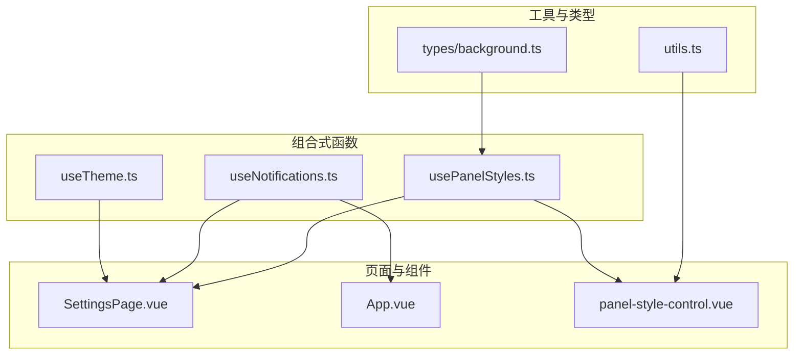
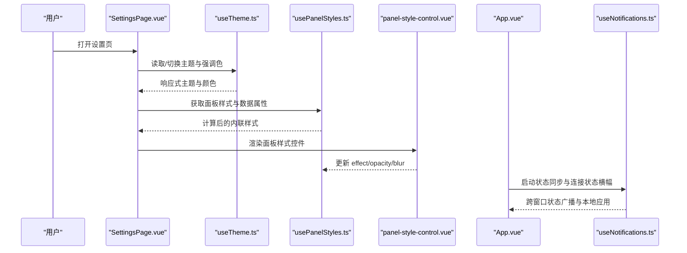
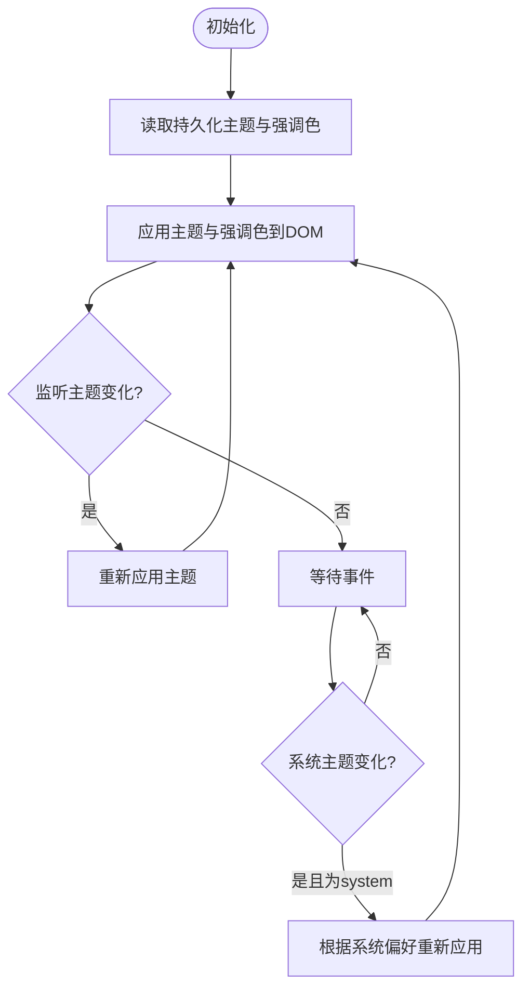
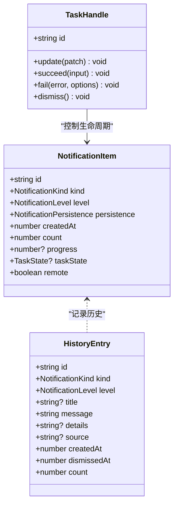
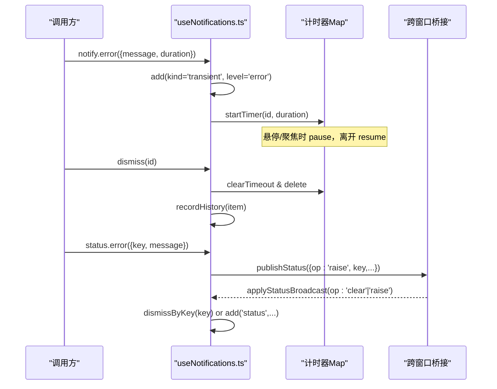
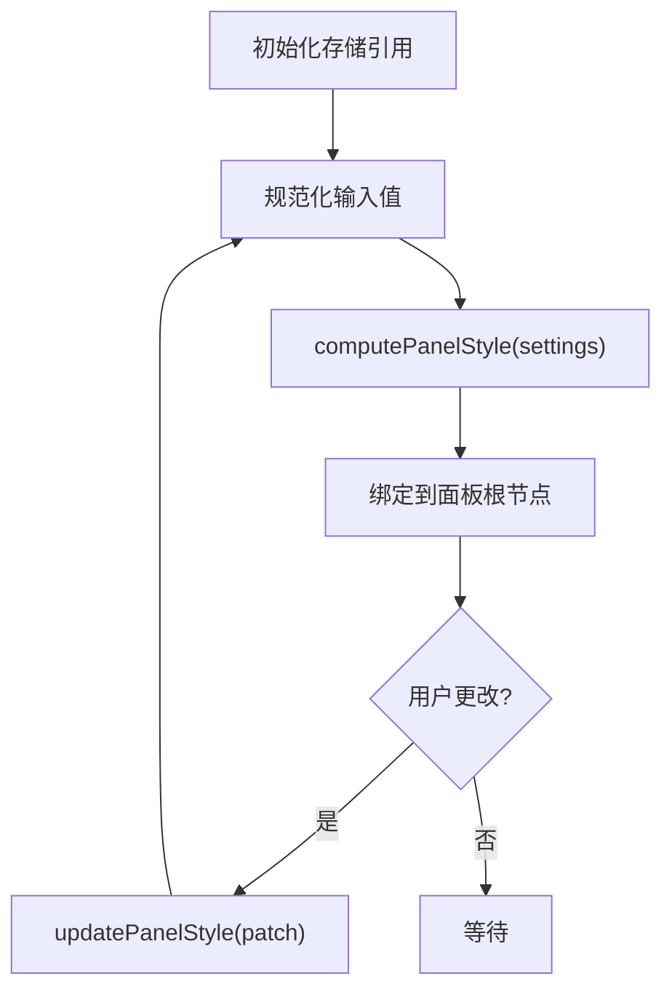
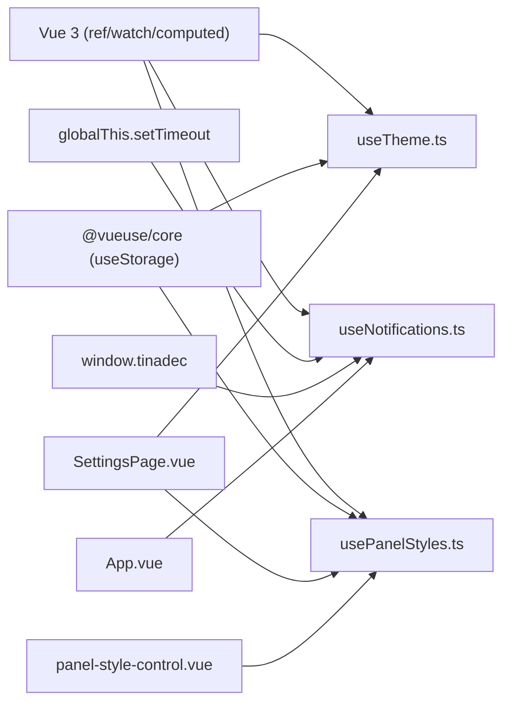

# 组合式函数与工具

<cite>
**本文引用的文件**   
- [useTheme.ts](file://apps/desktop/src/composables/useTheme.ts)
- [useNotifications.ts](file://apps/desktop/src/composables/useNotifications.ts)
- [usePanelStyles.ts](file://apps/desktop/src/composables/usePanelStyles.ts)
- [utils.ts](file://apps/desktop/src/lib/utils.ts)
- [background.ts](file://apps/desktop/src/types/background.ts)
- [SettingsPage.vue](file://apps/desktop/src/pages/SettingsPage.vue)
- [App.vue](file://apps/desktop/src/App.vue)
- [panel-style-control.vue](file://apps/desktop/src/components/ui/panel-style-control.vue)
- [useNotifications.test.ts](file://apps/desktop/src/composables/useNotifications.test.ts)
- [usePanelStyles.test.ts](file://apps/desktop/src/composables/usePanelStyles.test.ts)
</cite>

## 目录
1. [简介](#简介)
2. [项目结构](#项目结构)
3. [核心组件](#核心组件)
4. [架构总览](#架构总览)
5. [详细组件分析](#详细组件分析)
6. [依赖关系分析](#依赖关系分析)
7. [性能考量](#性能考量)
8. [故障排查指南](#故障排查指南)
9. [结论](#结论)
10. [附录](#附录)

## 简介
本文件面向初学者与有经验的开发者，系统化梳理 TinadecOffice 桌面端中四个关键的前端能力：主题管理、通知系统、面板样式管理与通用工具函数。通过深入解析 useTheme.ts、useNotifications.ts、usePanelStyles.ts 与 utils.ts 的实现细节，帮助读者理解如何在 Vue 3 Composition API 下构建可复用、可测试、可扩展的组合式函数，并掌握副作用处理、状态管理、跨窗口同步与错误处理等高级模式。

## 项目结构
- 组合式函数位于 apps/desktop/src/composables 目录，按功能域组织：
  - useTheme.ts：主题与强调色管理
  - useNotifications.ts：通知中心（消息队列、任务、状态横幅、确认框）
  - usePanelStyles.ts：全局面板材质效果（不透明/半透明/毛玻璃）
- 工具函数位于 apps/desktop/src/lib/utils.ts，提供类名合并能力
- 类型定义位于 apps/desktop/src/types/background.ts，统一背景与面板样式契约
- 使用示例与集成点：
  - SettingsPage.vue：集中展示主题、面板样式、通知的使用
  - App.vue：应用级启动、连接状态与跨窗口状态同步
  - panel-style-control.vue：面板样式控制面板组件

**图表来源** 
- [useTheme.ts:1-258](file://apps/desktop/src/composables/useTheme.ts#L1-L258)
- [useNotifications.ts:1-800](file://apps/desktop/src/composables/useNotifications.ts#L1-L800)
- [usePanelStyles.ts:1-203](file://apps/desktop/src/composables/usePanelStyles.ts#L1-L203)
- [utils.ts:1-9](file://apps/desktop/src/lib/utils.ts#L1-L9)
- [background.ts:1-57](file://apps/desktop/src/types/background.ts#L1-L57)
- [SettingsPage.vue:40-239](file://apps/desktop/src/pages/SettingsPage.vue#L40-L239)
- [App.vue:1-182](file://apps/desktop/src/App.vue#L1-L182)
- [panel-style-control.vue:1-293](file://apps/desktop/src/components/ui/panel-style-control.vue#L1-L293)

**章节来源**
- [useTheme.ts:1-258](file://apps/desktop/src/composables/useTheme.ts#L1-L258)
- [useNotifications.ts:1-800](file://apps/desktop/src/composables/useNotifications.ts#L1-L800)
- [usePanelStyles.ts:1-203](file://apps/desktop/src/composables/usePanelStyles.ts#L1-L203)
- [utils.ts:1-9](file://apps/desktop/src/lib/utils.ts#L1-L9)
- [background.ts:1-57](file://apps/desktop/src/types/background.ts#L1-L57)
- [SettingsPage.vue:40-239](file://apps/desktop/src/pages/SettingsPage.vue#L40-L239)
- [App.vue:1-182](file://apps/desktop/src/App.vue#L1-L182)
- [panel-style-control.vue:1-293](file://apps/desktop/src/components/ui/panel-style-control.vue#L1-L293)

## 核心组件
- useTheme.ts：提供主题（暗/亮/跟随系统）与强调色管理，基于 @vueuse/core 的 useStorage 持久化，监听系统主题变化，动态设置 CSS 变量
- useNotifications.ts：实现“通知岛”风格的消息队列，支持 transient（短暂）、status（状态）、task（任务）三类通知；具备去重、优先级排序、自动过期、暂停/恢复计时、折叠聚合、跨窗口状态广播、历史回溯与确认对话框队列
- usePanelStyles.ts：统一管理所有面板的材质效果（opaque/translucent/blur），计算内联样式并通过 data-panel-effect 暴露给 CSS 层，支持持久化与规范化校验
- utils.ts：封装 clsx + tailwind-merge 的类名合并工具，便于在模板中安全拼接样式

**章节来源**
- [useTheme.ts:1-258](file://apps/desktop/src/composables/useTheme.ts#L1-L258)
- [useNotifications.ts:1-800](file://apps/desktop/src/composables/useNotifications.ts#L1-L800)
- [usePanelStyles.ts:1-203](file://apps/desktop/src/composables/usePanelStyles.ts#L1-L203)
- [utils.ts:1-9](file://apps/desktop/src/lib/utils.ts#L1-L9)

## 架构总览
下图展示了主题、通知与面板样式的整体交互关系，以及它们在页面与组件中的使用方式。

**图表来源** 
- [SettingsPage.vue:40-239](file://apps/desktop/src/pages/SettingsPage.vue#L40-L239)
- [useTheme.ts:1-258](file://apps/desktop/src/composables/useTheme.ts#L1-L258)
- [usePanelStyles.ts:1-203](file://apps/desktop/src/composables/usePanelStyles.ts#L1-L203)
- [panel-style-control.vue:1-293](file://apps/desktop/src/components/ui/panel-style-control.vue#L1-L293)
- [App.vue:1-182](file://apps/desktop/src/App.vue#L1-L182)
- [useNotifications.ts:1-800](file://apps/desktop/src/composables/useNotifications.ts#L1-L800)

## 详细组件分析

### useTheme.ts：主题与强调色管理
- 设计要点
  - 延迟初始化存储引用，避免模块加载时访问 localStorage
  - 支持三种主题：dark/light/system，system 模式下监听 prefers-color-scheme 变化
  - 强调色集合 ACCENT_COLORS 包含多套明暗配色，运行时映射为 CSS 变量
  - 通过 watch 与事件监听实现即时响应式更新
- 关键流程
  - 初始化：立即应用当前主题与强调色
  - 变更：watch 主题或强调色，重新计算 CSS 变量
  - 系统主题：监听系统偏好变化，当主题为 system 时重新应用
- 复杂度与优化
  - 时间复杂度 O(1) 查找强调色（数组长度固定）
  - 避免重复 DOM 操作，仅设置必要 CSS 变量
- 错误处理
  - 默认回退到第一个强调色，确保健壮性
- 使用建议
  - 在根组件或页面中调用 useTheme()，将返回的 theme/setTheme/accentColor/setAccentColor 绑定到模板或逻辑
  - 跨窗口同步可在上层封装（如 SettingsPage.vue 中的 changeTheme/changeAccentColor）

**图表来源** 
- [useTheme.ts:172-258](file://apps/desktop/src/composables/useTheme.ts#L172-L258)

**章节来源**
- [useTheme.ts:1-258](file://apps/desktop/src/composables/useTheme.ts#L1-L258)

### useNotifications.ts：通知系统与消息队列
- 设计要点
  - 三类通知：transient（短暂反馈）、status（状态条件）、task（长任务）
  - 生命周期：auto/sticky/source，决定过期策略与关闭权限
  - 去重与聚合：相同指纹的通知合并，计数递增，保持槽位稳定
  - 优先级与分区：error > pending task > info；status 与 transient 独立分区
  - 计时器管理：支持暂停/恢复，悬停/聚焦时暂停，离开后继续
  - 容量上限：MAX_ITEMS=50，防止内存泄漏；history 保留最近 MAX_HISTORY=50 条
  - 跨窗口状态同步：通过 window.tinadec 广播 status 变更，避免回声循环
  - 确认对话框队列：FIFO 顺序，支持超时与取消
- 关键流程
  - add：创建或合并通知项，调度过期，强制容量上限，选择主项
  - update：原地补丁，任务结算后转为 auto 过期
  - dismiss/dismissByKey：清理计时器、历史记录、动作状态，必要时广播 clear
  - startTask：返回 TaskHandle，支持 update/succeed/fail/dismiss
  - isUserDismissible：统一的关闭权限判断
- 复杂度与优化
  - 排序 byRank：O(n log n)，但 n 受限于 MAX_ITEMS
  - 定时器 Map 管理，避免泄漏
  - 去重指纹 O(1) 查找
- 错误处理
  - normalizeError：兼容 Error、字符串、对象 DTO，避免字段泄露
  - 未知错误文本可通过 setNotificationFallbackText 注入 i18n 文案
- 使用建议
  - 在组件中引入 useNotifications()，使用 notify.status/error/info/task 等方法
  - 对跨窗口状态使用 key 去重，配合 dismissByKey 清理
  - 结合 confirm 实现用户确认流程

**图表来源** 
- [useNotifications.ts:89-136](file://apps/desktop/src/composables/useNotifications.ts#L89-L136)
- [useNotifications.ts:104-110](file://apps/desktop/src/composables/useNotifications.ts#L104-L110)
- [useNotifications.ts:125-136](file://apps/desktop/src/composables/useNotifications.ts#L125-L136)

**图表来源** 
- [useNotifications.ts:433-483](file://apps/desktop/src/composables/useNotifications.ts#L433-L483)
- [useNotifications.ts:557-585](file://apps/desktop/src/composables/useNotifications.ts#L557-L585)
- [useNotifications.ts:617-637](file://apps/desktop/src/composables/useNotifications.ts#L617-L637)

**章节来源**
- [useNotifications.ts:1-800](file://apps/desktop/src/composables/useNotifications.ts#L1-L800)
- [useNotifications.test.ts:1-694](file://apps/desktop/src/composables/useNotifications.test.ts#L1-L694)

### usePanelStyles.ts：面板样式管理
- 设计要点
  - 单一全局材质效果：opaque/translucent/blur
  - 通过 computePanelStyle 生成内联样式，getPanelDataAttributes 暴露 data-panel-effect
  - 使用 effectScope 隔离存储引用，避免组件销毁影响全局状态
  - 规范化输入：clamp 数值范围，无效值回退默认
- 关键流程
  - getStoredPanelStyle：惰性初始化，effectScope 包裹 useStorage
  - updatePanelStyle：部分合并 + 规范化
  - computePanelStyle：根据 effect 生成 backgroundColor/backdropFilter 等
- 复杂度与优化
  - 计算 O(1)，无 DOM 操作，纯函数式
  - 持久化同步写入，避免闪烁
- 使用建议
  - 在任意面板根节点绑定 :style="getPanelStyle()" 与 :data-panel-effect="getPanelDataAttributes()['data-panel-effect']"
  - 通过 panel-style-control.vue 提供可视化配置

**图表来源** 
- [usePanelStyles.ts:55-102](file://apps/desktop/src/composables/usePanelStyles.ts#L55-L102)
- [usePanelStyles.ts:111-141](file://apps/desktop/src/composables/usePanelStyles.ts#L111-L141)

**章节来源**
- [usePanelStyles.ts:1-203](file://apps/desktop/src/composables/usePanelStyles.ts#L1-L203)
- [usePanelStyles.test.ts:1-167](file://apps/desktop/src/composables/usePanelStyles.test.ts#L1-L167)
- [background.ts:1-57](file://apps/desktop/src/types/background.ts#L1-L57)

### utils.ts：工具函数集合
- 提供 cn(...inputs) 用于合并多个类名，内部使用 clsx 与 tailwind-merge
- 适用于模板中动态拼接 Tailwind 类名，避免冲突与冗余

**章节来源**
- [utils.ts:1-9](file://apps/desktop/src/lib/utils.ts#L1-L9)

## 依赖关系分析
- useTheme.ts 依赖 @vueuse/core 的 useStorage 与 Vue 的 ref/watch
- useNotifications.ts 依赖 Vue 的 computed/ref，全局 setTimeout，window.tinadec 桥接
- usePanelStyles.ts 依赖 @vueuse/core 的 useStorage 与 Vue 的 effectScope/ref
- 页面与组件通过 import 引入这些组合式函数，形成松耦合的依赖图

**图表来源** 
- [useTheme.ts:1-258](file://apps/desktop/src/composables/useTheme.ts#L1-L258)
- [useNotifications.ts:1-800](file://apps/desktop/src/composables/useNotifications.ts#L1-L800)
- [usePanelStyles.ts:1-203](file://apps/desktop/src/composables/usePanelStyles.ts#L1-L203)
- [SettingsPage.vue:40-239](file://apps/desktop/src/pages/SettingsPage.vue#L40-L239)
- [App.vue:1-182](file://apps/desktop/src/App.vue#L1-L182)
- [panel-style-control.vue:1-293](file://apps/desktop/src/components/ui/panel-style-control.vue#L1-L293)

**章节来源**
- [useTheme.ts:1-258](file://apps/desktop/src/composables/useTheme.ts#L1-L258)
- [useNotifications.ts:1-800](file://apps/desktop/src/composables/useNotifications.ts#L1-L800)
- [usePanelStyles.ts:1-203](file://apps/desktop/src/composables/usePanelStyles.ts#L1-L203)
- [SettingsPage.vue:40-239](file://apps/desktop/src/pages/SettingsPage.vue#L40-L239)
- [App.vue:1-182](file://apps/desktop/src/App.vue#L1-L182)
- [panel-style-control.vue:1-293](file://apps/desktop/src/components/ui/panel-style-control.vue#L1-L293)

## 性能考量
- 主题与强调色：CSS 变量更新开销极低，避免频繁 DOM 查询
- 通知系统：
  - 容量上限与历史限制防止内存增长
  - 定时器 Map 与 pause/resume 机制减少不必要的计时器重建
  - 去重指纹避免重复渲染
- 面板样式：
  - 计算函数为纯函数，无副作用
  - 使用 effectScope 隔离存储，避免组件销毁导致的状态丢失
- 建议：
  - 批量更新通知时尽量合并，减少 re-render
  - 对大量通知列表进行虚拟滚动（如需）

[本节为通用指导，无需特定文件来源]

## 故障排查指南
- 主题未生效
  - 检查 data-theme 是否设置，CSS 变量是否正确注入
  - 确认系统主题监听事件是否触发
- 通知未过期或被卡住
  - 检查是否被悬停/聚焦暂停，确认 resume 调用
  - 查看是否达到 MAX_ITEMS 被裁剪
  - 确认 cross-window broadcast 是否被抑制（echo suppression）
- 面板样式异常
  - 检查 normalizePanelStyle 是否回退默认值
  - 确认 computePanelStyle 生成的样式是否被覆盖
- 确认对话框未响应
  - 检查 FIFO 队列与 resolveConfirmation 调用是否匹配 id

**章节来源**
- [useNotifications.test.ts:1-694](file://apps/desktop/src/composables/useNotifications.test.ts#L1-L694)
- [usePanelStyles.test.ts:1-167](file://apps/desktop/src/composables/usePanelStyles.test.ts#L1-L167)

## 结论
通过 useTheme、useNotifications、usePanelStyles 与 utils 的组合式函数，TinadecOffice 实现了高内聚、低耦合的前端能力抽象。它们遵循 Vue 3 Composition API 的最佳实践，具备良好的可测试性与扩展性。对于初学者，可从基础用法入手；对于资深开发者，可借鉴其跨窗口同步、生命周期管理与错误处理模式，构建更复杂的业务场景。

[本节为总结，无需特定文件来源]

## 附录
- TypeScript 类型定义
  - background.ts 定义了 BackgroundSettings、PanelEffect、PanelStyleSettings、AppearanceSettings 等，确保样式配置的强类型约束
- 单元测试策略
  - useNotifications.test.ts 覆盖去重、过期、暂停/恢复、容量上限、历史、跨窗口广播、确认队列等
  - usePanelStyles.test.ts 覆盖持久化、规范化、样式计算与数据属性
- 最佳实践
  - 使用 Ref 延迟初始化避免早期访问存储
  - 使用 effectScope 隔离副作用
  - 通过指纹与 key 实现幂等与去重
  - 对外暴露最小 API，内部实现可替换

**章节来源**
- [background.ts:1-57](file://apps/desktop/src/types/background.ts#L1-L57)
- [useNotifications.test.ts:1-694](file://apps/desktop/src/composables/useNotifications.test.ts#L1-L694)
- [usePanelStyles.test.ts:1-167](file://apps/desktop/src/composables/usePanelStyles.test.ts#L1-L167)