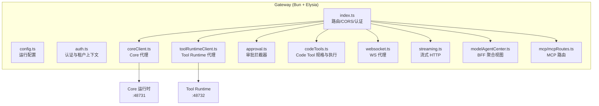
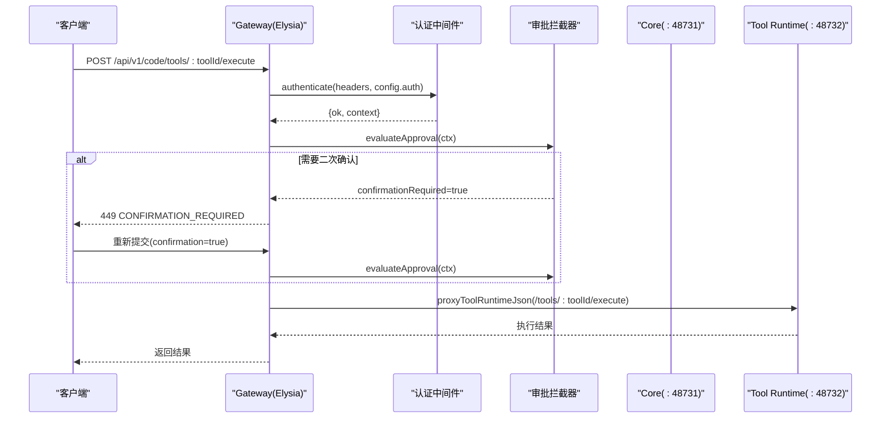
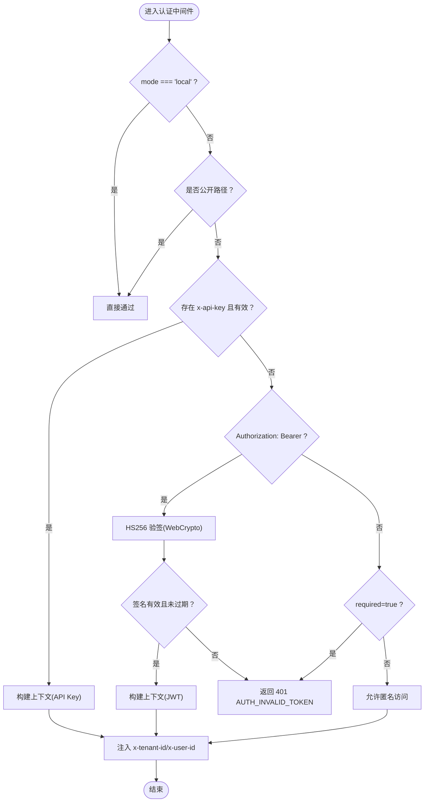
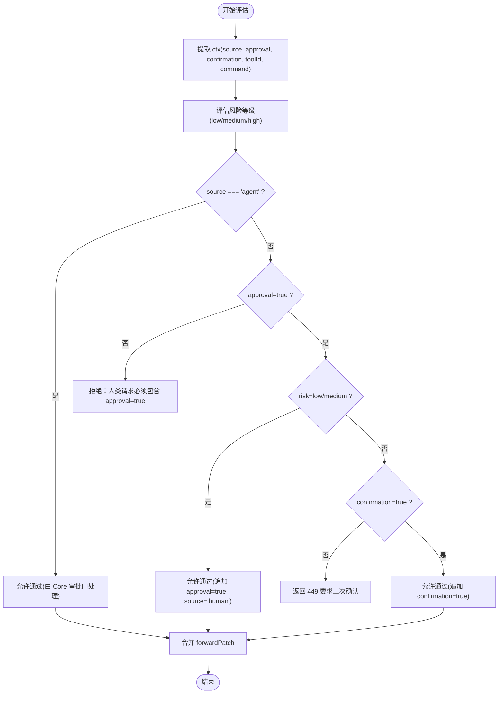
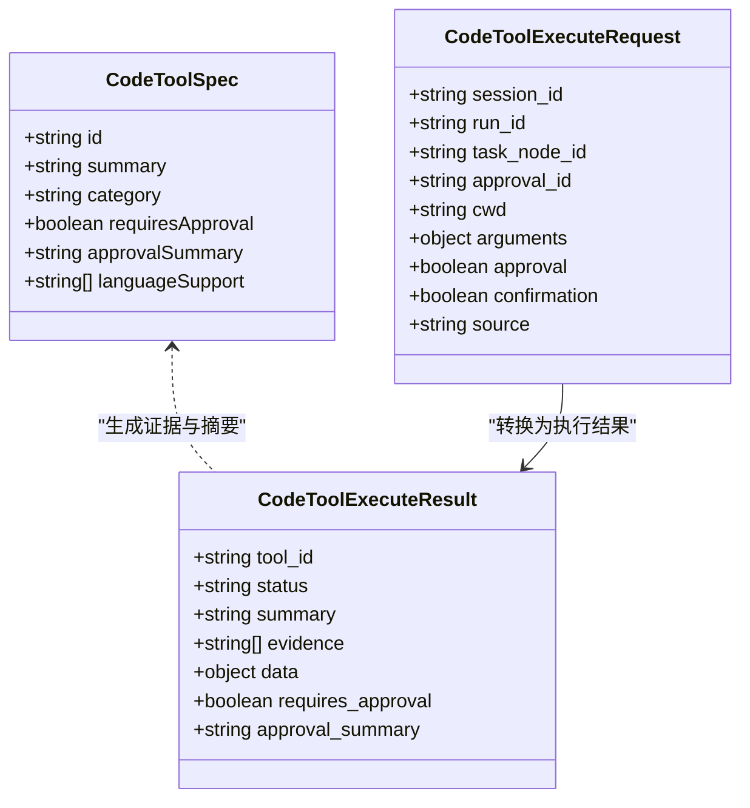
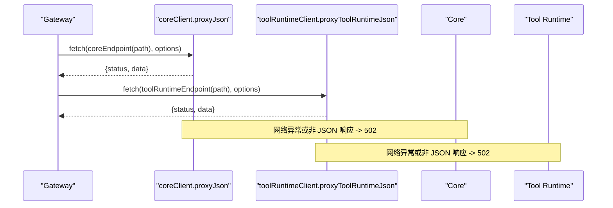
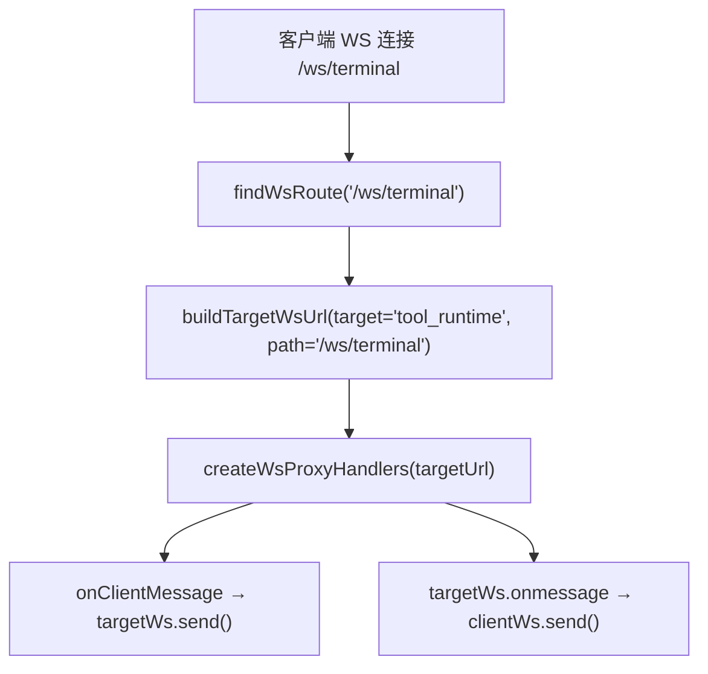
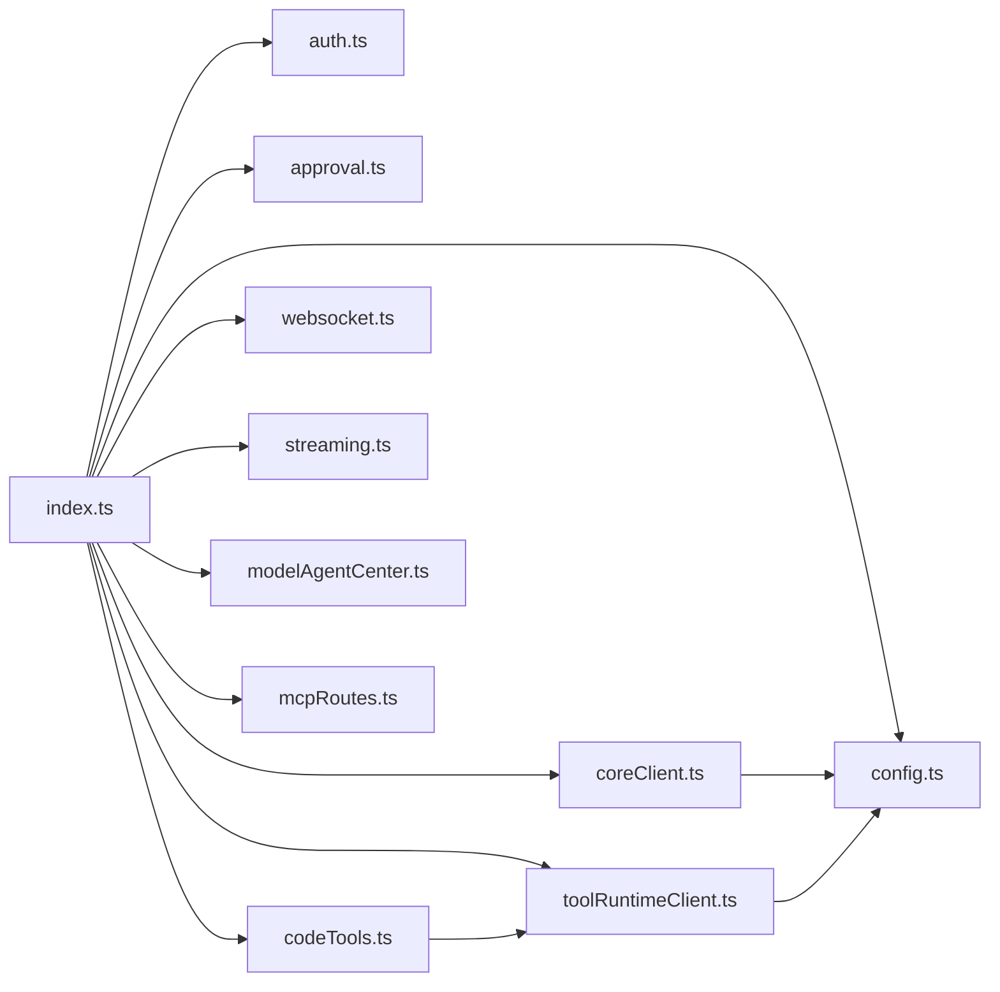

# Gateway 网关层

<cite>
**本文引用的文件**   
- [index.ts](file://TinadecGateway/src/index.ts)
- [config.ts](file://TinadecGateway/src/config.ts)
- [auth.ts](file://TinadecGateway/src/auth.ts)
- [coreClient.ts](file://TinadecGateway/src/coreClient.ts)
- [toolRuntimeClient.ts](file://TinadecGateway/src/toolRuntimeClient.ts)
- [approval.ts](file://TinadecGateway/src/approval.ts)
- [codeTools.ts](file://TinadecGateway/src/codeTools.ts)
- [websocket.ts](file://TinadecGateway/src/websocket.ts)
- [streaming.ts](file://TinadecGateway/src/streaming.ts)
- [modelAgentCenter.ts](file://TinadecGateway/src/modelAgentCenter.ts)
- [mcpRoutes.ts](file://TinadecGateway/src/mcp/mcpRoutes.ts)
- [package.json](file://TinadecGateway/package.json)
- [AGENTS.md](file://TinadecGateway/AGENTS.md)
</cite>

## 目录
1. [简介](#简介)
2. [项目结构](#项目结构)
3. [核心组件](#核心组件)
4. [架构总览](#架构总览)
5. [详细组件分析](#详细组件分析)
6. [依赖关系分析](#依赖关系分析)
7. [性能考量](#性能考量)
8. [故障排查指南](#故障排查指南)
9. [结论](#结论)
10. [附录](#附录)

## 简介
本文件为 TinadecOffice 的 Gateway 网关层提供系统化、可操作的文档。Gateway 基于 Elysia + TypeScript，采用 BFF（Backend for Frontend）模式，作为前端与 Core 运行时（端口 48731）、Tool Runtime（端口 48732）之间的统一入口。其职责包括：
- 鉴权与租户上下文注入（云端模式支持 API Key / JWT HS256）
- BFF 聚合视图（Model Center / Agent Center）
- 协议转换（HTTP/JSON、SSE、WebSocket、流式 HTTP）
- 审批拦截与高风险二次确认
- 对 Core 与 Tool Runtime 的 JSON/SSE/流式代理转发

面向初学者：理解 BFF 概念、Gateway 的职责边界与部署模式。  
面向有经验的开发者：路由组织、认证中间件、审批系统、Core/Tool Runtime 通信协议、OpenAPI 文档生成、SSE/WebSocket 处理、错误处理策略与性能优化建议。

## 项目结构
Gateway 是一个独立的 Bun 包，拥有独立的启动、构建与测试流程。核心文件与职责如下：
- index.ts：Elysia 应用主入口，注册 CORS、认证中间件、所有 /api/v1/* 路由、SSE 与 WebSocket 端点
- config.ts：运行配置（本地/云端模式、端口、Core/Tool Runtime URL、认证、CORS、超时、反向代理信任）
- auth.ts：认证与租户上下文中间件（API Key / JWT HS256 WebCrypto），构建转发头
- coreClient.ts：Core 客户端（JSON/SSE/流式代理）
- toolRuntimeClient.ts：Tool Runtime 客户端（JSON/SSE/流式代理）
- approval.ts：审批拦截器（人类操作 approval=true 透传；高风险二次确认）
- codeTools.ts：Code Tool 规格定义、Core 审批状态验证、Tool Runtime 代理执行
- websocket.ts：WebSocket 代理（终端、调试、协作）
- streaming.ts：流式 HTTP 代理（大文件/日志）
- modelAgentCenter.ts：无状态 Model/Agent Center 聚合视图
- mcp/mcpRoutes.ts：MCP 协调端点（纯代理到 Tool Runtime）

图表来源
- [index.ts:107-800](file://TinadecGateway/src/index.ts#L107-L800)
- [config.ts:65-115](file://TinadecGateway/src/config.ts#L65-L115)
- [auth.ts:46-112](file://TinadecGateway/src/auth.ts#L46-L112)
- [coreClient.ts:38-110](file://TinadecGateway/src/coreClient.ts#L38-L110)
- [toolRuntimeClient.ts:44-126](file://TinadecGateway/src/toolRuntimeClient.ts#L44-L126)
- [approval.ts:91-197](file://TinadecGateway/src/approval.ts#L91-L197)
- [codeTools.ts:439-462](file://TinadecGateway/src/codeTools.ts#L439-L462)
- [websocket.ts:51-74](file://TinadecGateway/src/websocket.ts#L51-L74)
- [streaming.ts:25-54](file://TinadecGateway/src/streaming.ts#L25-L54)
- [modelAgentCenter.ts:517-535](file://TinadecGateway/src/modelAgentCenter.ts#L517-L535)
- [mcpRoutes.ts:22-66](file://TinadecGateway/src/mcp/mcpRoutes.ts#L22-L66)

章节来源
- [AGENTS.md:1-144](file://TinadecGateway/AGENTS.md#L1-L144)
- [package.json:1-22](file://TinadecGateway/package.json#L1-L22)

## 核心组件
- 路由与协议分层：index.ts 集中定义 /api/v1/* 路由，涵盖健康检查、项目/会话、事件流、工具执行、Model/Agent Center、Market/Extensions、MCP、Agent Evolution、Prompt Engineering、Debug Studio 等。支持 HTTP/JSON、SSE、WebSocket、流式 HTTP。
- 认证中间件：auth.ts 实现 API Key 与 JWT HS256 验签（WebCrypto），提取 tenant_id/user_id，并注入到下游请求头。
- 审批拦截器：approval.ts 评估风险等级，要求高风险二次确认；将 human 请求标记 approval=true 透传到 Tool Runtime。
- Code Tools：codeTools.ts 暴露工具规格、校验 Core 审批状态、通过 Tool Runtime 执行。
- Core/Tool Runtime 代理：coreClient.ts 与 toolRuntimeClient.ts 提供 JSON/SSE/流式代理，统一错误码与不可达处理。
- BFF 聚合视图：modelAgentCenter.ts 聚合 Model/Agent 中心数据，剥离敏感字段，返回只读概览。
- WebSocket 代理：websocket.ts 维护路由表与目标 URL 构建，消息双向透传（当前 WS 路由在 index.ts 中为桩）。
- 流式 HTTP：streaming.ts 透传 body 流，用于大文件与日志。

章节来源
- [index.ts:107-800](file://TinadecGateway/src/index.ts#L107-L800)
- [auth.ts:46-112](file://TinadecGateway/src/auth.ts#L46-L112)
- [approval.ts:91-197](file://TinadecGateway/src/approval.ts#L91-L197)
- [codeTools.ts:439-462](file://TinadecGateway/src/codeTools.ts#L439-L462)
- [coreClient.ts:38-110](file://TinadecGateway/src/coreClient.ts#L38-L110)
- [toolRuntimeClient.ts:44-126](file://TinadecGateway/src/toolRuntimeClient.ts#L44-L126)
- [modelAgentCenter.ts:517-535](file://TinadecGateway/src/modelAgentCenter.ts#L517-L535)
- [websocket.ts:51-74](file://TinadecGateway/src/websocket.ts#L51-L74)
- [streaming.ts:25-54](file://TinadecGateway/src/streaming.ts#L25-L54)

## 架构总览
Gateway 作为薄代理 BFF，不执行业务逻辑，仅做协议转换、鉴权、审批拦截与下游服务代理。连接拓扑如下：
- Desktop/Electron/Web → Gateway（HTTP/SSE/WS）
- Gateway → Core（HTTP/SSE/WS）
- Gateway → Tool Runtime（HTTP/SSE/WS）
- Core ↔ Tool Runtime（内部通信）

图表来源
- [index.ts:351-400](file://TinadecGateway/src/index.ts#L351-L400)
- [auth.ts:46-112](file://TinadecGateway/src/auth.ts#L46-L112)
- [approval.ts:145-197](file://TinadecGateway/src/approval.ts#L145-L197)
- [toolRuntimeClient.ts:44-97](file://TinadecGateway/src/toolRuntimeClient.ts#L44-L97)

## 详细组件分析

### 认证与租户上下文（auth.ts）
- 支持 API Key 与 Bearer Token（HS256）两种认证方式
- Fail-closed：云端模式下未配置 jwtSecret 时拒绝 Bearer token
- 从 JWT claims 或自定义头提取 tenant_id/user_id，并注入到下游请求头
- 本地模式完全跳过认证

图表来源
- [auth.ts:46-112](file://TinadecGateway/src/auth.ts#L46-L112)
- [auth.ts:133-178](file://TinadecGateway/src/auth.ts#L133-L178)
- [auth.ts:227-254](file://TinadecGateway/src/auth.ts#L227-L254)

章节来源
- [auth.ts:1-273](file://TinadecGateway/src/auth.ts#L1-L273)

### 审批拦截器（approval.ts）
- 人类操作需携带 approval=true，Agent 请求由 Core 审批门处理
- 高风险命令返回 449 要求二次确认，确认后放行
- 将 forwardPatch 合并到请求体，确保下游收到正确的审批标志

图表来源
- [approval.ts:91-110](file://TinadecGateway/src/approval.ts#L91-L110)
- [approval.ts:115-133](file://TinadecGateway/src/approval.ts#L115-L133)
- [approval.ts:145-197](file://TinadecGateway/src/approval.ts#L145-L197)
- [approval.ts:203-224](file://TinadecGateway/src/approval.ts#L203-L224)
- [approval.ts:229-235](file://TinadecGateway/src/approval.ts#L229-L235)

章节来源
- [approval.ts:1-235](file://TinadecGateway/src/approval.ts#L1-L235)

### Code Tools 规格与执行（codeTools.ts）
- 暴露工具规格列表（id、summary、category、requires_approval、approval_summary、language_support）
- 校验 Core 审批快照（状态、kind、cwd、command 匹配）
- 通过 Tool Runtime 执行，统一错误码与证据链

图表来源
- [codeTools.ts:14-37](file://TinadecGateway/src/codeTools.ts#L14-L37)
- [codeTools.ts:41-48](file://TinadecGateway/src/codeTools.ts#L41-L48)
- [codeTools.ts:439-462](file://TinadecGateway/src/codeTools.ts#L439-L462)

章节来源
- [codeTools.ts:1-570](file://TinadecGateway/src/codeTools.ts#L1-L570)

### Core/Tool Runtime 代理（coreClient.ts, toolRuntimeClient.ts）
- JSON 代理：统一解析响应体，非 JSON 返回 502 错误
- SSE 代理：设置 accept=text/event-stream，返回原始 Response
- 流式代理：透传 ReadableStream，适用于大文件与日志

图表来源
- [coreClient.ts:38-87](file://TinadecGateway/src/coreClient.ts#L38-L87)
- [toolRuntimeClient.ts:44-97](file://TinadecGateway/src/toolRuntimeClient.ts#L44-L97)

章节来源
- [coreClient.ts:1-110](file://TinadecGateway/src/coreClient.ts#L1-L110)
- [toolRuntimeClient.ts:1-126](file://TinadecGateway/src/toolRuntimeClient.ts#L1-L126)

### WebSocket 代理（websocket.ts）
- 路由表映射 /ws/* 到 Core/Tool Runtime 的 WS 端点
- 创建双向透传处理器（客户端↔目标）
- 当前 index.ts 中的 WS 路由为桩，尚未启用真实代理

图表来源
- [websocket.ts:51-74](file://TinadecGateway/src/websocket.ts#L51-L74)
- [websocket.ts:93-139](file://TinadecGateway/src/websocket.ts#L93-L139)

章节来源
- [websocket.ts:1-140](file://TinadecGateway/src/websocket.ts#L1-L140)

### 流式 HTTP（streaming.ts）
- 透传请求与响应的 body 流，不做缓冲
- 设置必要的流式响应头（no-cache、keep-alive、x-accel-buffering=no）

章节来源
- [streaming.ts:1-54](file://TinadecGateway/src/streaming.ts#L1-L54)

### Model/Agent Center BFF（modelAgentCenter.ts）
- 聚合 Core 的 providers/routes/models/acp_adapters 等数据
- 剥离敏感字段（如 api_key、secret 等）
- 返回只读概览，不包含持久化或第二真相源

章节来源
- [modelAgentCenter.ts:517-535](file://TinadecGateway/src/modelAgentCenter.ts#L517-L535)
- [modelAgentCenter.ts:356-366](file://TinadecGateway/src/modelAgentCenter.ts#L356-L366)

### MCP 路由（mcp/mcpRoutes.ts）
- 纯代理模式：connect/disconnect/status/call 全部转发到 Tool Runtime
- Gateway 不管理 MCP 连接生命周期

章节来源
- [mcpRoutes.ts:1-66](file://TinadecGateway/src/mcp/mcpRoutes.ts#L1-L66)

## 依赖关系分析
Gateway 模块间依赖清晰，职责单一：
- index.ts 依赖 config、auth、coreClient、toolRuntimeClient、approval、codeTools、mcpRoutes、websocket、streaming、modelAgentCenter
- coreClient 与 toolRuntimeClient 依赖 config
- approval 与 codeTools 独立，codeTools 依赖 toolRuntimeClient
- websocket 与 streaming 为通用能力

图表来源
- [index.ts:23-57](file://TinadecGateway/src/index.ts#L23-L57)
- [coreClient.ts:7](file://TinadecGateway/src/coreClient.ts#L7-L7)
- [toolRuntimeClient.ts:13](file://TinadecGateway/src/toolRuntimeClient.ts#L13-L13)
- [codeTools.ts:12](file://TinadecGateway/src/codeTools.ts#L12-L12)

章节来源
- [index.ts:23-57](file://TinadecGateway/src/index.ts#L23-L57)

## 性能考量
- 使用 Bun 运行时与 Elysia 框架，具备高性能与低内存占用
- 流式代理避免缓冲，适合大文件与日志传输
- SSE 保持长连接，减少轮询开销
- 无状态设计便于横向扩展（云端模式）
- 建议：
  - 合理设置 requestTimeoutMs，避免长时间阻塞
  - 在反向代理后启用连接复用与缓存控制
  - 监控 Core/Tool Runtime 可达性与响应时间

## 故障排查指南
- 认证失败：检查 TINADEC_GATEWAY_JWT_SECRET 与 x-api-key；确认 alg=HS256；查看 401 错误码
- 下游不可达：检查 Core/Tool Runtime URL 与网络连通性；关注 502 错误码与 CORE_UNREACHABLE/TOOL_RUNTIME_UNREACHABLE
- 审批被拒：确认人类请求包含 approval=true；高风险操作需 confirmation=true；检查 Core 审批快照状态与 kind
- WS 未生效：当前 index.ts 中的 WS 路由为桩，需启用 websocket.ts 的 createWsProxyHandlers
- 流式中断：检查响应头与代理配置（no-cache、keep-alive、x-accel-buffering）

章节来源
- [auth.ts:133-178](file://TinadecGateway/src/auth.ts#L133-L178)
- [coreClient.ts:56-87](file://TinadecGateway/src/coreClient.ts#L56-L87)
- [toolRuntimeClient.ts:66-97](file://TinadecGateway/src/toolRuntimeClient.ts#L66-L97)
- [approval.ts:145-197](file://TinadecGateway/src/approval.ts#L145-L197)
- [AGENTS.md:110-114](file://TinadecGateway/AGENTS.md#L110-L114)

## 结论
Gateway 作为 BFF 网关，以薄代理为核心原则，聚焦于鉴权、审批拦截、协议转换与下游服务代理。通过清晰的模块划分与统一的错误处理策略，实现了高内聚、低耦合的架构。对于初学者，理解其职责边界与部署模式即可上手；对于资深开发者，可通过优化流式代理、SSE/WebSocket 与认证中间件进一步提升性能与安全性。

## 附录
- 环境变量与默认值参考 AGENTS.md
- 开发命令与测试脚本参考 package.json 与 AGENTS.md

章节来源
- [AGENTS.md:61-73](file://TinadecGateway/AGENTS.md#L61-L73)
- [package.json:7-12](file://TinadecGateway/package.json#L7-L12)