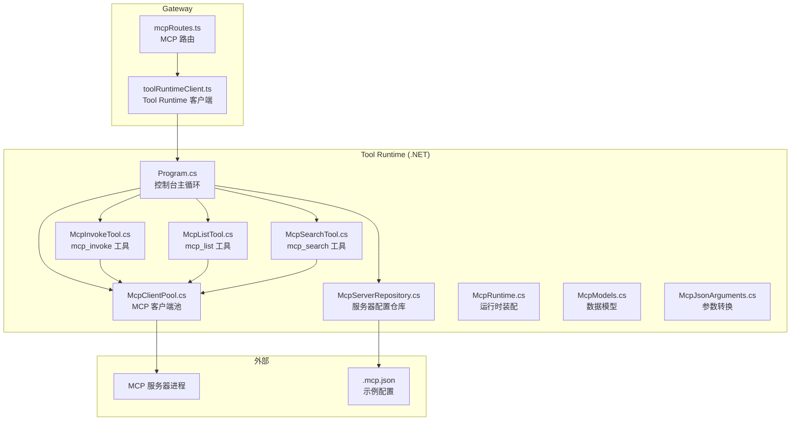
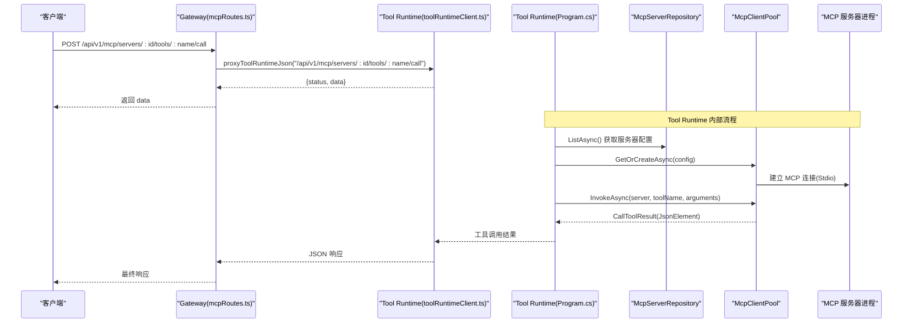
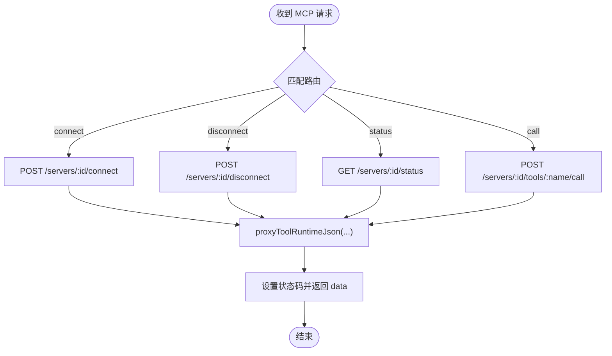
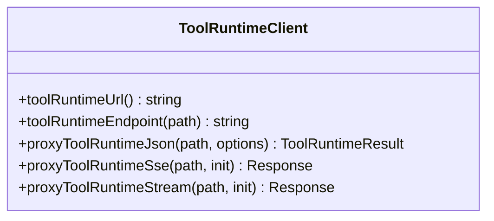
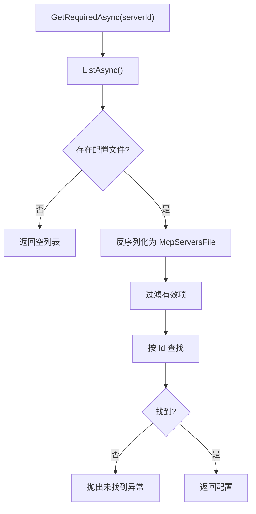
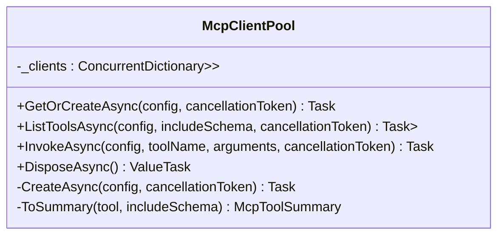
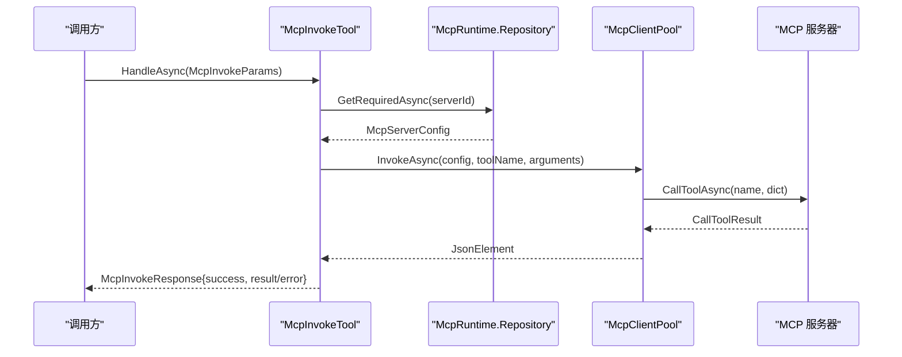
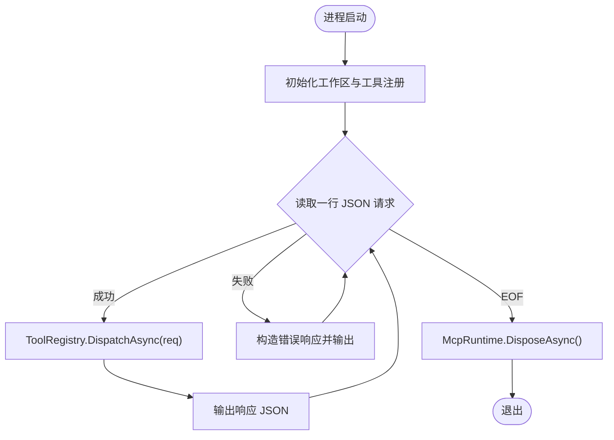
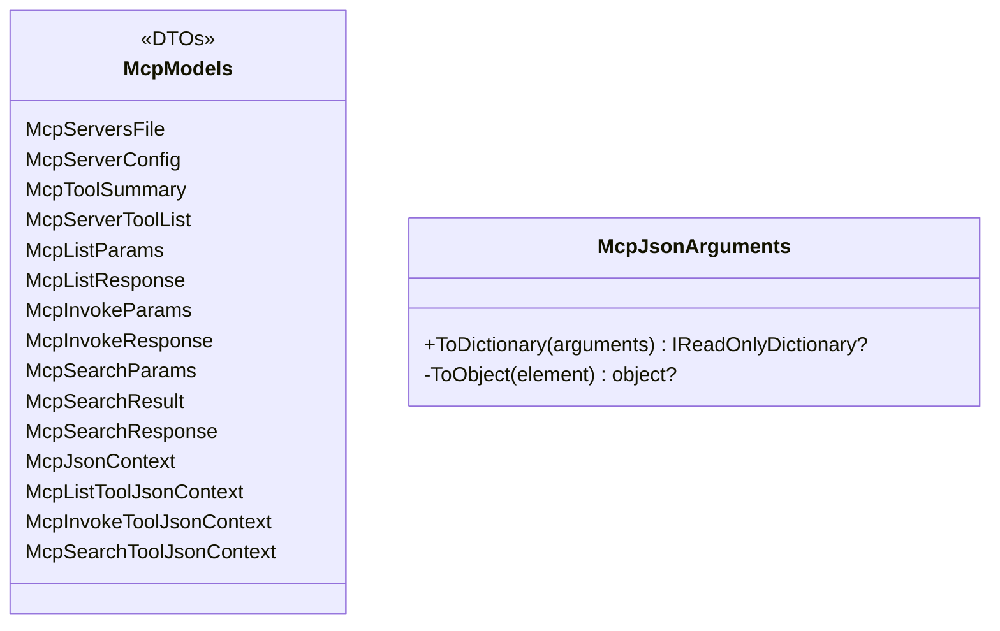
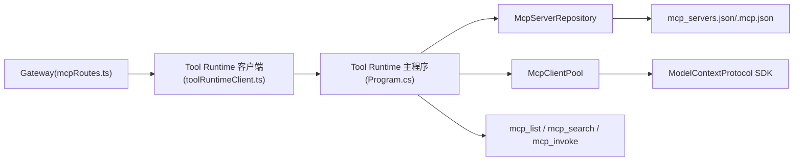

# MCP 集成

<cite>
**本文引用的文件**   
- [mcpRoutes.ts](file://TinadecGateway/src/mcp/mcpRoutes.ts)
- [toolRuntimeClient.ts](file://TinadecGateway/src/toolRuntimeClient.ts)
- [McpClientPool.cs](file://TinadecTools/Tools/Mcp/McpClientPool.cs)
- [McpInvokeTool.cs](file://TinadecTools/Tools/Mcp/McpInvokeTool.cs)
- [McpRuntime.cs](file://TinadecTools/Tools/Mcp/McpRuntime.cs)
- [McpServerRepository.cs](file://TinadecTools/Tools/Mcp/McpServerRepository.cs)
- [McpModels.cs](file://TinadecTools/Tools/Mcp/McpModels.cs)
- [McpJsonArguments.cs](file://TinadecTools/Tools/Mcp/McpJsonArguments.cs)
- [McpListTool.cs](file://TinadecTools/Tools/Mcp/McpListTool.cs)
- [McpSearchTool.cs](file://TinadecTools/Tools/Mcp/McpSearchTool.cs)
- [Program.cs](file://TinadecTools/Program.cs)
- [.mcp.json](file://.mcp.json)
</cite>

## 目录
1. [简介](#简介)
2. [项目结构](#项目结构)
3. [核心组件](#核心组件)
4. [架构总览](#架构总览)
5. [详细组件分析](#详细组件分析)
6. [依赖关系分析](#依赖关系分析)
7. [性能考量](#性能考量)
8. [故障排查指南](#故障排查指南)
9. [结论](#结论)
10. [附录](#附录)

## 简介
本文件面向 Gateway 网关的 MCP（Model Context Protocol）集成模块，系统性阐述协议实现原理、服务器发现机制、工具调用代理、生命周期管理、连接池维护与错误处理策略。同时覆盖工具元数据同步、参数验证、结果格式化，以及与 Core 服务和 Tool Runtime 的集成方式。文档既为初学者提供 MCP 概念说明，也为有经验的开发者提供实现细节与扩展指导。

## 项目结构
本项目将 MCP 能力拆分为两部分：
- Gateway 侧：纯 HTTP 代理路由，不持有 MCP 连接状态，仅转发请求到 Tool Runtime。
- Tool Runtime 侧：基于 .NET 的 MCP 客户端池、配置仓库、工具封装与执行入口。

图表来源 
- [mcpRoutes.ts:1-66](file://TinadecGateway/src/mcp/mcpRoutes.ts#L1-L66)
- [toolRuntimeClient.ts:1-126](file://TinadecGateway/src/toolRuntimeClient.ts#L1-L126)
- [Program.cs:1-68](file://TinadecTools/Program.cs#L1-L68)
- [McpServerRepository.cs:1-53](file://TinadecTools/Tools/Mcp/McpServerRepository.cs#L1-L53)
- [McpClientPool.cs:1-89](file://TinadecTools/Tools/Mcp/McpClientPool.cs#L1-L89)
- [McpInvokeTool.cs:1-39](file://TinadecTools/Tools/Mcp/McpInvokeTool.cs#L1-L39)
- [McpListTool.cs:1-42](file://TinadecTools/Tools/Mcp/McpListTool.cs#L1-L42)
- [McpSearchTool.cs:1-87](file://TinadecTools/Tools/Mcp/McpSearchTool.cs#L1-L87)
- [McpRuntime.cs:1-19](file://TinadecTools/Tools/Mcp/McpRuntime.cs#L1-L19)
- [McpModels.cs:1-115](file://TinadecTools/Tools/Mcp/McpModels.cs#L1-L115)
- [McpJsonArguments.cs:1-37](file://TinadecTools/Tools/Mcp/McpJsonArguments.cs#L1-L37)
- [.mcp.json:1-14](file://.mcp.json#L1-L14)

章节来源
- [mcpRoutes.ts:1-66](file://TinadecGateway/src/mcp/mcpRoutes.ts#L1-L66)
- [toolRuntimeClient.ts:1-126](file://TinadecGateway/src/toolRuntimeClient.ts#L1-L126)
- [Program.cs:1-68](file://TinadecTools/Program.cs#L1-L68)

## 核心组件
- Gateway MCP 路由：定义 /api/v1/mcp/servers/* 系列端点，统一转发至 Tool Runtime。
- Tool Runtime 客户端：封装 JSON/SSE/流式 HTTP 代理，处理网络异常与响应解析。
- MCP 服务器仓库：从配置文件读取并校验服务器列表，支持环境变量覆盖路径。
- MCP 客户端池：按 serverId 懒创建并复用 McpClient，负责工具列举与调用。
- MCP 工具封装：mcp_list、mcp_search、mcp_invoke 三个工具暴露给上层编排。
- 运行时装配：集中暴露 Repository 与 ClientPool，并提供测试注入与资源释放。
- 数据模型与序列化：统一的 DTO、JSON 上下文与参数转换器。

章节来源
- [mcpRoutes.ts:1-66](file://TinadecGateway/src/mcp/mcpRoutes.ts#L1-L66)
- [toolRuntimeClient.ts:1-126](file://TinadecGateway/src/toolRuntimeClient.ts#L1-L126)
- [McpServerRepository.cs:1-53](file://TinadecTools/Tools/Mcp/McpServerRepository.cs#L1-L53)
- [McpClientPool.cs:1-89](file://TinadecTools/Tools/Mcp/McpClientPool.cs#L1-L89)
- [McpInvokeTool.cs:1-39](file://TinadecTools/Tools/Mcp/McpInvokeTool.cs#L1-L39)
- [McpListTool.cs:1-42](file://TinadecTools/Tools/Mcp/McpListTool.cs#L1-L42)
- [McpSearchTool.cs:1-87](file://TinadecTools/Tools/Mcp/McpSearchTool.cs#L1-L87)
- [McpRuntime.cs:1-19](file://TinadecTools/Tools/Mcp/McpRuntime.cs#L1-L19)
- [McpModels.cs:1-115](file://TinadecTools/Tools/Mcp/McpModels.cs#L1-L115)
- [McpJsonArguments.cs:1-37](file://TinadecTools/Tools/Mcp/McpJsonArguments.cs#L1-L37)

## 架构总览
Gateway 采用“薄代理”模式，所有 MCP 操作均透传到 Tool Runtime。Tool Runtime 通过 Stdio 启动并管理 MCP 子进程，使用客户端池复用连接，对外暴露工具函数供上层编排调用。

图表来源 
- [mcpRoutes.ts:1-66](file://TinadecGateway/src/mcp/mcpRoutes.ts#L1-L66)
- [toolRuntimeClient.ts:1-126](file://TinadecGateway/src/toolRuntimeClient.ts#L1-L126)
- [Program.cs:1-68](file://TinadecTools/Program.cs#L1-L68)
- [McpServerRepository.cs:1-53](file://TinadecTools/Tools/Mcp/McpServerRepository.cs#L1-L53)
- [McpClientPool.cs:1-89](file://TinadecTools/Tools/Mcp/McpClientPool.cs#L1-L89)

## 详细组件分析

### Gateway MCP 路由（mcpRoutes.ts）
- 职责：定义 connect/disconnect/status/tools/:name/call 等端点，全部转发到 Tool Runtime。
- 特点：无状态代理；对 body 进行最小化校验（arguments 可选对象）。
- 错误处理：通过 proxyToolRuntimeJson 返回 502 及标准化错误体。

图表来源 
- [mcpRoutes.ts:1-66](file://TinadecGateway/src/mcp/mcpRoutes.ts#L1-L66)
- [toolRuntimeClient.ts:1-126](file://TinadecGateway/src/toolRuntimeClient.ts#L1-L126)

章节来源
- [mcpRoutes.ts:1-66](file://TinadecGateway/src/mcp/mcpRoutes.ts#L1-L66)

### Tool Runtime 客户端（toolRuntimeClient.ts）
- 职责：统一封装 JSON/SSE/流式 HTTP 代理，处理不可达与非 JSON 响应。
- 关键方法：
  - proxyToolRuntimeJson：返回 {status, data}，失败时返回 502 与错误码。
  - proxyToolRuntimeSse：透传 SSE 流。
  - proxyToolRuntimeStream：透传流式 HTTP 响应。

图表来源 
- [toolRuntimeClient.ts:1-126](file://TinadecGateway/src/toolRuntimeClient.ts#L1-L126)

章节来源
- [toolRuntimeClient.ts:1-126](file://TinadecGateway/src/toolRuntimeClient.ts#L1-L126)

### MCP 服务器仓库（McpServerRepository.cs）
- 职责：从配置文件加载服务器列表，支持环境变量覆盖路径，校验必填字段。
- 关键点：
  - 配置文件路径优先级：构造参数 > 环境变量 > 默认 mcp_servers.json。
  - 过滤无效条目（id/command 非空）。
  - 异步读取，支持并发共享读。

图表来源 
- [McpServerRepository.cs:1-53](file://TinadecTools/Tools/Mcp/McpServerRepository.cs#L1-L53)

章节来源
- [McpServerRepository.cs:1-53](file://TinadecTools/Tools/Mcp/McpServerRepository.cs#L1-L53)

### MCP 客户端池（McpClientPool.cs）
- 职责：按 serverId 懒创建并缓存 McpClient，提供工具列举与调用。
- 关键点：
  - 使用 ConcurrentDictionary + Lazy<Task<McpClient>> 保证线程安全与按需创建。
  - 创建失败自动移除缓存项，避免脏引用。
  - 通过 StdioClientTransport 启动 MCP 子进程，继承环境变量并可自定义 cwd/env。
  - DisposeAsync 尽力关闭所有已创建的客户端。

图表来源 
- [McpClientPool.cs:1-89](file://TinadecTools/Tools/Mcp/McpClientPool.cs#L1-L89)

章节来源
- [McpClientPool.cs:1-89](file://TinadecTools/Tools/Mcp/McpClientPool.cs#L1-L89)

### MCP 工具封装（mcp_list / mcp_search / mcp_invoke）
- mcp_list：遍历配置中的服务器，尝试连接并列举工具，记录状态与错误。
- mcp_search：跨服务器搜索工具，基于名称与描述加权打分，限制返回数量。
- mcp_invoke：根据 serverId 获取配置，调用对应工具，捕获异常并返回结构化结果。

图表来源 
- [McpInvokeTool.cs:1-39](file://TinadecTools/Tools/Mcp/McpInvokeTool.cs#L1-L39)
- [McpRuntime.cs:1-19](file://TinadecTools/Tools/Mcp/McpRuntime.cs#L1-L19)
- [McpClientPool.cs:1-89](file://TinadecTools/Tools/Mcp/McpClientPool.cs#L1-L89)

章节来源
- [McpListTool.cs:1-42](file://TinadecTools/Tools/Mcp/McpListTool.cs#L1-L42)
- [McpSearchTool.cs:1-87](file://TinadecTools/Tools/Mcp/McpSearchTool.cs#L1-L87)
- [McpInvokeTool.cs:1-39](file://TinadecTools/Tools/Mcp/McpInvokeTool.cs#L1-L39)

### 运行时装配与主循环（McpRuntime.cs / Program.cs）
- McpRuntime：集中暴露 Repository 与 ClientPool，提供测试注入与资源释放。
- Program.cs：控制台主循环，接收工具调用请求，分发到 ToolRegistry，并在退出时释放 MCP 资源。

图表来源 
- [Program.cs:1-68](file://TinadecTools/Program.cs#L1-L68)
- [McpRuntime.cs:1-19](file://TinadecTools/Tools/Mcp/McpRuntime.cs#L1-L19)

章节来源
- [Program.cs:1-68](file://TinadecTools/Program.cs#L1-L68)
- [McpRuntime.cs:1-19](file://TinadecTools/Tools/Mcp/McpRuntime.cs#L1-L19)

### 数据模型与参数转换（McpModels.cs / McpJsonArguments.cs）
- McpModels：定义服务器配置、工具摘要、列表/搜索/调用请求与响应的 DTO，以及多个 JsonSerializerContext。
- McpJsonArguments：将 JsonElement 转换为字典，严格校验类型与结构，支持嵌套对象与数组。

图表来源 
- [McpModels.cs:1-115](file://TinadecTools/Tools/Mcp/McpModels.cs#L1-L115)
- [McpJsonArguments.cs:1-37](file://TinadecTools/Tools/Mcp/McpJsonArguments.cs#L1-L37)

章节来源
- [McpModels.cs:1-115](file://TinadecTools/Tools/Mcp/McpModels.cs#L1-L115)
- [McpJsonArguments.cs:1-37](file://TinadecTools/Tools/Mcp/McpJsonArguments.cs#L1-L37)

## 依赖关系分析
- Gateway 仅依赖 Tool Runtime 的 HTTP API，不感知 MCP 协议细节。
- Tool Runtime 依赖 ModelContextProtocol SDK 与 System.Text.Json，通过 Stdio 与 MCP 服务器通信。
- 配置驱动：服务器列表由配置文件决定，支持环境变量覆盖路径。
- 工具层解耦：mcp_list/search/invoke 作为独立工具，便于编排与测试。

图表来源 
- [mcpRoutes.ts:1-66](file://TinadecGateway/src/mcp/mcpRoutes.ts#L1-L66)
- [toolRuntimeClient.ts:1-126](file://TinadecGateway/src/toolRuntimeClient.ts#L1-L126)
- [Program.cs:1-68](file://TinadecTools/Program.cs#L1-L68)
- [McpServerRepository.cs:1-53](file://TinadecTools/Tools/Mcp/McpServerRepository.cs#L1-L53)
- [McpClientPool.cs:1-89](file://TinadecTools/Tools/Mcp/McpClientPool.cs#L1-L89)

章节来源
- [mcpRoutes.ts:1-66](file://TinadecGateway/src/mcp/mcpRoutes.ts#L1-L66)
- [toolRuntimeClient.ts:1-126](file://TinadecGateway/src/toolRuntimeClient.ts#L1-L126)
- [Program.cs:1-68](file://TinadecTools/Program.cs#L1-L68)

## 性能考量
- 连接复用：McpClientPool 按 serverId 懒创建并缓存，减少重复启动与握手开销。
- 异步优先：全链路使用 async/await 与 ConfigureAwait(false)，降低阻塞风险。
- 轻量序列化：使用 System.Text.Json 源生成上下文，提升吞吐。
- 流式传输：Gateway 支持 SSE 与流式 HTTP，适合大结果或长耗时任务。
- 资源清理：进程退出时尽力释放客户端，避免句柄泄漏。

[本节为通用性能建议，不直接分析具体文件]

## 故障排查指南
- Gateway 无法到达 Tool Runtime：检查 toolRuntimeUrl 配置与网络连通性；错误码 TOOL_RUNTIME_UNREACHABLE。
- Tool Runtime 返回非 JSON：确认服务端响应头与内容；错误码 TOOL_RUNTIME_INVALID_RESPONSE。
- MCP 服务器未找到：检查配置文件路径与 id 是否匹配；仓库会抛出未找到异常。
- 工具调用失败：查看 mcp_invoke 的错误消息与日志；必要时启用更详细的调试日志。
- 连接异常：检查命令、参数、cwd 与环境变量是否正确；确保 MCP 服务器可被正确启动。

章节来源
- [toolRuntimeClient.ts:1-126](file://TinadecGateway/src/toolRuntimeClient.ts#L1-L126)
- [McpServerRepository.cs:1-53](file://TinadecTools/Tools/Mcp/McpServerRepository.cs#L1-L53)
- [McpInvokeTool.cs:1-39](file://TinadecTools/Tools/Mcp/McpInvokeTool.cs#L1-L39)

## 结论
Gateway 的 MCP 集成采用“薄代理 + Tool Runtime 托管”的架构，清晰分离了网关转发与 MCP 运行时管理。通过配置驱动的服务器发现、连接池化的客户端管理与健壮的错误处理，实现了稳定高效的工具调用通道。对于扩展开发，可在 Tool Runtime 中新增工具封装或在 Gateway 中扩展路由与校验逻辑。

[本节为总结性内容，不直接分析具体文件]

## 附录

### MCP 协议概念说明（面向初学者）
- MCP（Model Context Protocol）用于在 AI 应用与外部工具/服务之间建立标准化的工具发现与调用通道。
- 典型交互包括：列出可用工具、获取工具元数据（如输入 schema）、以指定参数调用工具并获取结果。
- 在本项目中，Tool Runtime 通过 Stdio 与 MCP 服务器进程通信，Gateway 仅负责 HTTP 转发。

[本节为概念性说明，不直接分析具体文件]

### MCP 服务器开发指南
- 选择传输方式：
  - Stdio：通过命令行启动，传入命令与参数，适合本地进程型 MCP 服务器。
  - SSE：通过 URL 暴露事件流，适合 Web 场景。
- 实现要点：
  - 暴露工具清单与元数据（名称、描述、输入 schema）。
  - 实现工具调用接口，处理参数校验与结果返回。
  - 处理连接生命周期（启动、健康检查、优雅关闭）。
- 参考示例：根级 .mcp.json 展示了两种接入方式（SSE 与 Stdio）。

章节来源
- [.mcp.json:1-14](file://.mcp.json#L1-L14)

### 集成配置示例
- Tool Runtime 配置路径：
  - 通过环境变量 TINADEC_TOOLS_MCP_CONFIG 指定 mcp_servers.json 路径。
  - 若未设置，则默认读取当前目录下的 mcp_servers.json。
- Gateway 配置：
  - 设置 toolRuntimeUrl 指向 Tool Runtime 服务地址。
- 示例 .mcp.json：
  - 包含 vue-mcp（SSE）与 shadcn（Stdio）两个服务器的示例配置。

章节来源
- [McpServerRepository.cs:1-53](file://TinadecTools/Tools/Mcp/McpServerRepository.cs#L1-L53)
- [toolRuntimeClient.ts:1-126](file://TinadecGateway/src/toolRuntimeClient.ts#L1-L126)
- [.mcp.json:1-14](file://.mcp.json#L1-L14)

### 调试方法
- 启用 NLog 日志：在 Tool Runtime 中查看工具调用与异常的详细信息。
- 观察 Gateway 返回的状态码与错误码：快速定位网络或服务端问题。
- 使用 mcp_list 与 mcp_search：验证服务器可达性与工具元数据同步情况。
- 逐步缩小范围：先确认 Tool Runtime 可被访问，再检查 MCP 服务器配置与启动命令。

章节来源
- [McpInvokeTool.cs:1-39](file://TinadecTools/Tools/Mcp/McpInvokeTool.cs#L1-L39)
- [McpListTool.cs:1-42](file://TinadecTools/Tools/Mcp/McpListTool.cs#L1-L42)
- [McpSearchTool.cs:1-87](file://TinadecTools/Tools/Mcp/McpSearchTool.cs#L1-L87)
- [toolRuntimeClient.ts:1-126](file://TinadecGateway/src/toolRuntimeClient.ts#L1-L126)