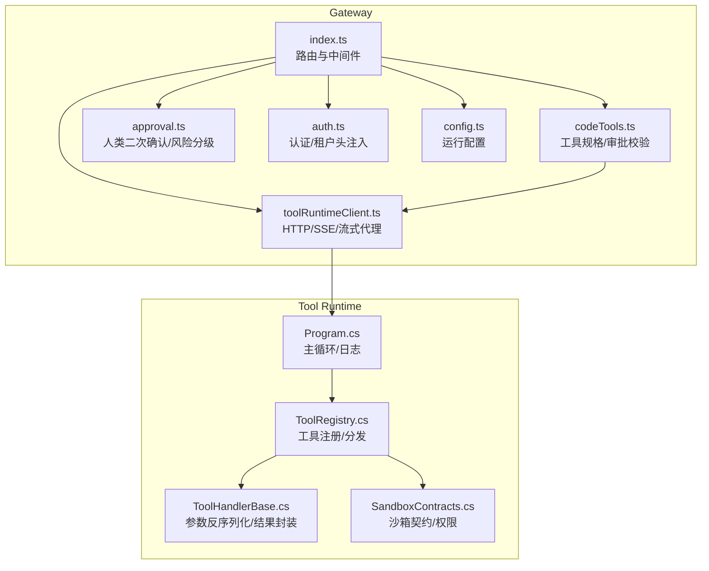
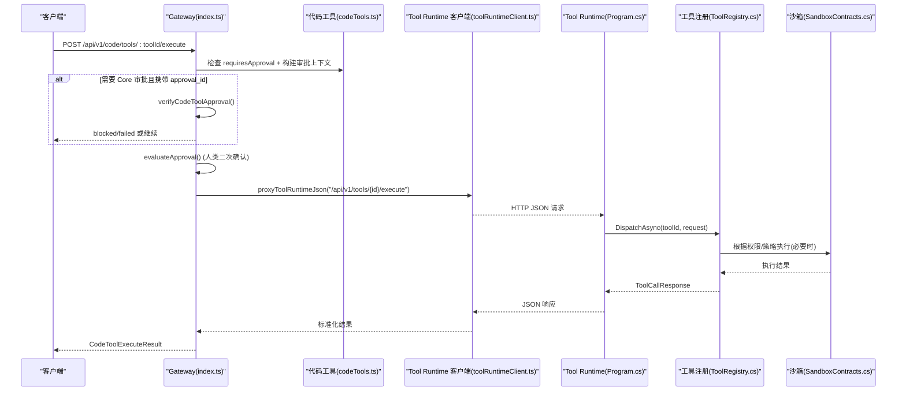
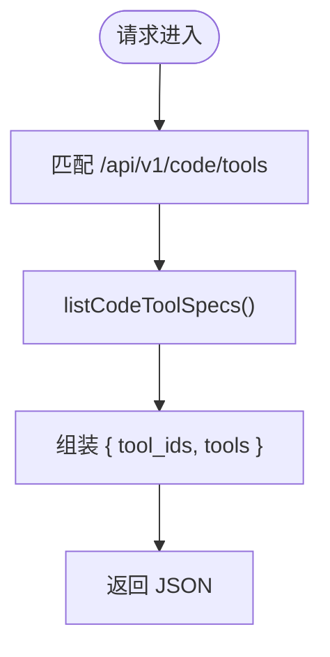
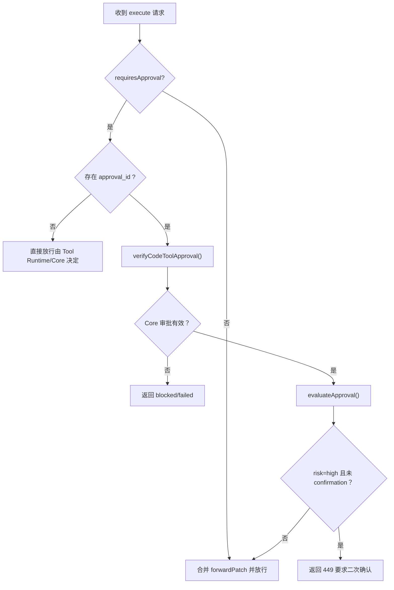
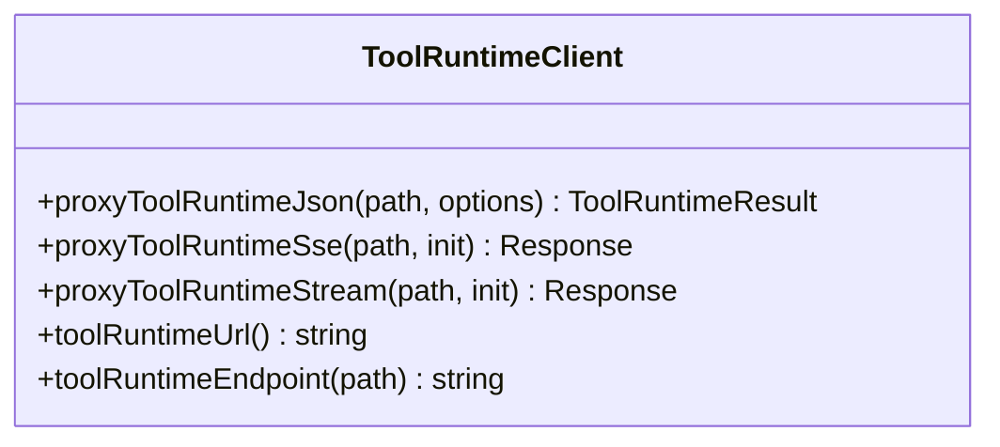
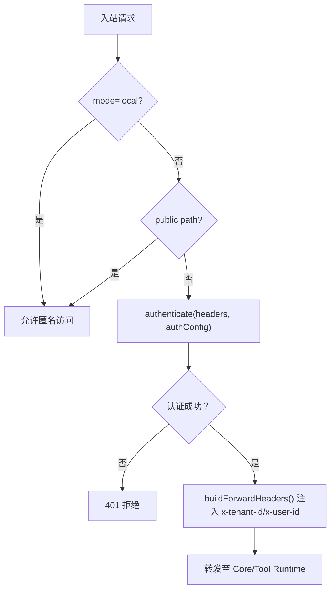
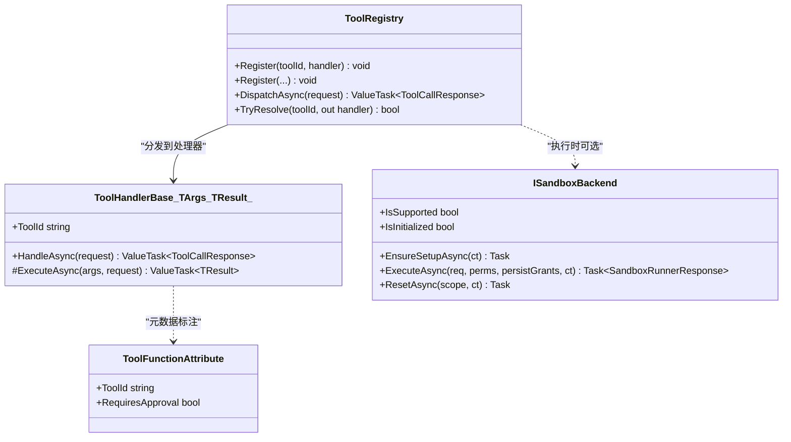
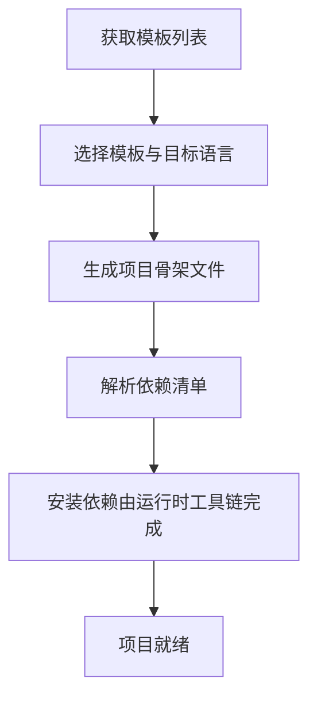
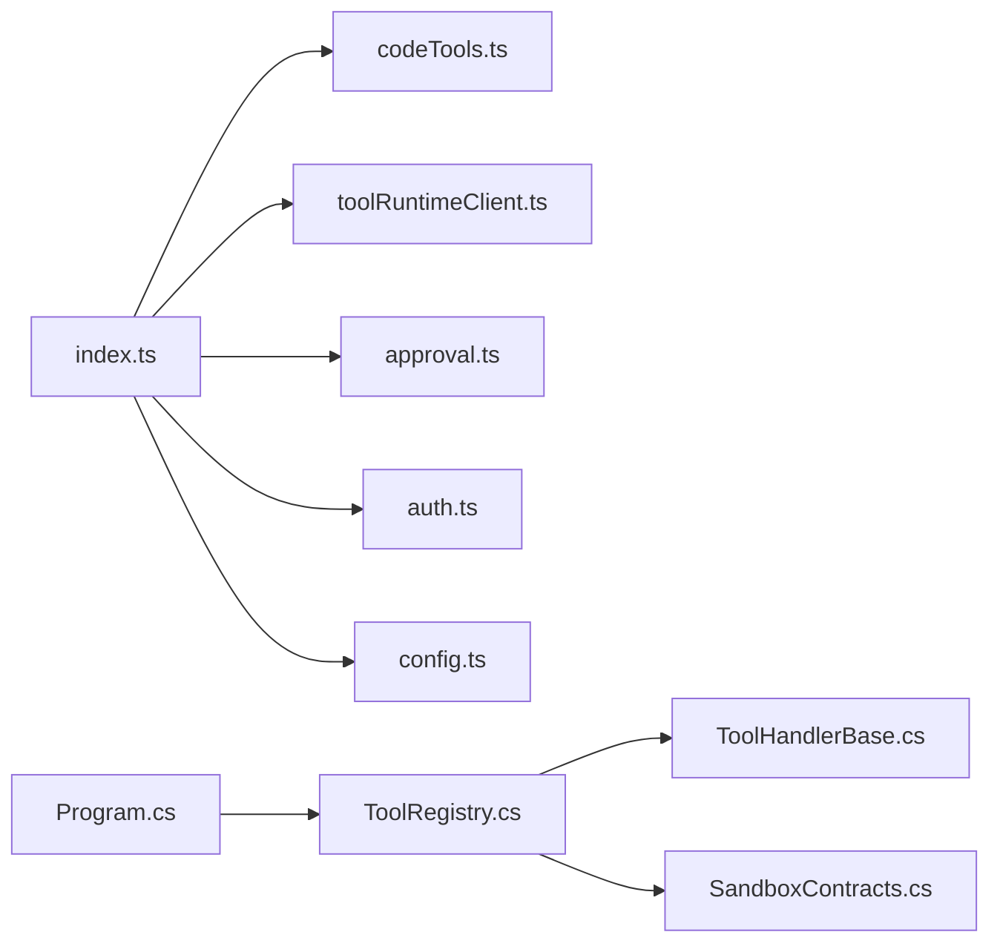

# 代码工具管理

<cite>
**本文引用的文件**   
- [index.ts](file://TinadecGateway/src/index.ts)
- [codeTools.ts](file://TinadecGateway/src/codeTools.ts)
- [toolRuntimeClient.ts](file://TinadecGateway/src/toolRuntimeClient.ts)
- [approval.ts](file://TinadecGateway/src/approval.ts)
- [auth.ts](file://TinadecGateway/src/auth.ts)
- [config.ts](file://TinadecGateway/src/config.ts)
- [ToolRegistry.cs](file://TinadecTools/Abstractions/ToolRegistry.cs)
- [ToolHandlerBase.cs](file://TinadecTools/Abstractions/ToolHandlerBase.cs)
- [ToolFunctionAttribute.cs](file://TinadecTools/Abstractions/ToolFunctionAttribute.cs)
- [SandboxContracts.cs](file://TinadecTools/Runtime/Sandbox/SandboxContracts.cs)
- [Program.cs](file://TinadecTools/Program.cs)
- [codeTools.test.ts](file://TinadecGateway/src/codeTools.test.ts)
</cite>

## 目录
1. [简介](#简介)
2. [项目结构](#项目结构)
3. [核心组件](#核心组件)
4. [架构总览](#架构总览)
5. [详细组件分析](#详细组件分析)
6. [依赖关系分析](#依赖关系分析)
7. [性能考量](#性能考量)
8. [故障排查指南](#故障排查指南)
9. [结论](#结论)
10. [附录](#附录)

## 简介
本文件面向 Gateway 网关的“代码工具管理”模块，系统性阐述以下主题：
- 工具规格发布与发现（/api/v1/code/tools）
- 工具执行链路（审批门、人类二次确认、Tool Runtime 代理）
- 安全沙箱与执行环境隔离
- 权限控制与租户上下文透传
- 版本管理与依赖解析（以内置模板与运行时探针为中心）
- 调用链监控、性能分析与错误追踪
- 开发规范、集成示例与部署配置

该文档既适合初学者理解“代码工具”的概念与流程，也为有经验的开发者提供实现细节与扩展指导。

## 项目结构
Gateway 侧负责协议转换、认证鉴权、审批拦截与 Tool Runtime 代理；Tool Runtime 侧负责具体工具的执行与沙箱隔离。关键文件分布如下：
- Gateway 入口与路由：index.ts
- 代码工具规格与审批校验：codeTools.ts
- Tool Runtime 客户端：toolRuntimeClient.ts
- 人类操作审批与高风险二次确认：approval.ts
- 认证与租户上下文：auth.ts
- 运行配置加载：config.ts
- Tool Runtime 注册与分发：ToolRegistry.cs、ToolHandlerBase.cs、ToolFunctionAttribute.cs
- 沙箱契约与后端接口：SandboxContracts.cs
- Tool Runtime 主循环：Program.cs

**图表来源** 
- [index.ts:107-400](file://TinadecGateway/src/index.ts#L107-L400)
- [codeTools.ts:204-333](file://TinadecGateway/src/codeTools.ts#L204-L333)
- [toolRuntimeClient.ts:44-97](file://TinadecGateway/src/toolRuntimeClient.ts#L44-L97)
- [approval.ts:145-197](file://TinadecGateway/src/approval.ts#L145-L197)
- [auth.ts:46-112](file://TinadecGateway/src/auth.ts#L46-L112)
- [config.ts:65-106](file://TinadecGateway/src/config.ts#L65-L106)
- [Program.cs:24-61](file://TinadecTools/Program.cs#L24-L61)
- [ToolRegistry.cs:76-84](file://TinadecTools/Abstractions/ToolRegistry.cs#L76-L84)
- [ToolHandlerBase.cs:23-41](file://TinadecTools/Abstractions/ToolHandlerBase.cs#L23-L41)
- [SandboxContracts.cs:52-63](file://TinadecTools/Runtime/Sandbox/SandboxContracts.cs#L52-L63)

**章节来源**
- [index.ts:107-400](file://TinadecGateway/src/index.ts#L107-L400)
- [codeTools.ts:204-333](file://TinadecGateway/src/codeTools.ts#L204-L333)
- [toolRuntimeClient.ts:44-97](file://TinadecGateway/src/toolRuntimeClient.ts#L44-L97)
- [approval.ts:145-197](file://TinadecGateway/src/approval.ts#L145-L197)
- [auth.ts:46-112](file://TinadecGateway/src/auth.ts#L46-L112)
- [config.ts:65-106](file://TinadecGateway/src/config.ts#L65-L106)
- [Program.cs:24-61](file://TinadecTools/Program.cs#L24-L61)
- [ToolRegistry.cs:76-84](file://TinadecTools/Abstractions/ToolRegistry.cs#L76-L84)
- [ToolHandlerBase.cs:23-41](file://TinadecTools/Abstractions/ToolHandlerBase.cs#L23-L41)
- [SandboxContracts.cs:52-63](file://TinadecTools/Runtime/Sandbox/SandboxContracts.cs#L52-L63)

## 核心组件
- 工具规格与发现
  - 通过 /api/v1/code/tools 暴露工具 ID 列表与规格（摘要、分类、是否需审批、语言支持等）。
  - 内置工具集合覆盖文件读写、搜索、Git、调试、编辑器、模板脚手架等。
- 审批门与人类二次确认
  - Agent 请求走 Core 审批门；人类请求 approval=true 可透传，高风险命令需 confirmation=true 二次确认。
- Tool Runtime 代理
  - Gateway 不直接执行任何工具，统一通过 toolRuntimeClient 转发到 Tool Runtime。
- 认证与租户上下文
  - 云端模式支持 API Key/JWT，提取 tenant_id/user_id 并注入下游请求头。
- 工具运行时与沙箱
  - Tool Runtime 使用标准输入输出协议接收调用，按注册表分发到具体处理器；支持沙箱权限与策略。

**章节来源**
- [codeTools.ts:335-348](file://TinadecGateway/src/codeTools.ts#L335-L348)
- [index.ts:324-400](file://TinadecGateway/src/index.ts#L324-L400)
- [approval.ts:145-197](file://TinadecGateway/src/approval.ts#L145-L197)
- [toolRuntimeClient.ts:44-97](file://TinadecGateway/src/toolRuntimeClient.ts#L44-L97)
- [auth.ts:46-112](file://TinadecGateway/src/auth.ts#L46-L112)
- [Program.cs:24-61](file://TinadecTools/Program.cs#L24-L61)
- [ToolRegistry.cs:76-84](file://TinadecTools/Abstractions/ToolRegistry.cs#L76-L84)

## 架构总览
下图展示一次“代码工具执行”的完整调用链路：从 Gateway 路由到审批门、人类二次确认、Core 审批状态校验，再到 Tool Runtime 执行与返回。

**图表来源** 
- [index.ts:351-400](file://TinadecGateway/src/index.ts#L351-L400)
- [codeTools.ts:354-420](file://TinadecGateway/src/codeTools.ts#L354-L420)
- [toolRuntimeClient.ts:44-97](file://TinadecGateway/src/toolRuntimeClient.ts#L44-L97)
- [Program.cs:24-61](file://TinadecTools/Program.cs#L24-L61)
- [ToolRegistry.cs:76-84](file://TinadecTools/Abstractions/ToolRegistry.cs#L76-L84)
- [SandboxContracts.cs:52-63](file://TinadecTools/Runtime/Sandbox/SandboxContracts.cs#L52-L63)

## 详细组件分析

### 工具规格发布与发现
- 端点：GET /api/v1/code/tools
- 行为：返回所有内置工具的 id、summary、category、requires_approval、approval_summary、language_support。
- 用途：BFF/前端用于渲染工具目录、过滤与提示。

**图表来源** 
- [index.ts:324-327](file://TinadecGateway/src/index.ts#L324-L327)
- [codeTools.ts:339-348](file://TinadecGateway/src/codeTools.ts#L339-L348)

**章节来源**
- [index.ts:324-327](file://TinadecGateway/src/index.ts#L324-L327)
- [codeTools.ts:339-348](file://TinadecGateway/src/codeTools.ts#L339-L348)
- [codeTools.test.ts:5-15](file://TinadecGateway/src/codeTools.test.ts#L5-L15)

### 工具执行审批门与人类二次确认
- 审批门（Core）：当工具 requiresApproval=true 且请求包含 approval_id 时，Gateway 会向 Core 拉取审批快照并校验状态、作用域（cwd）、命令匹配（如 Git 动作）。
- 人类二次确认：对高风险工具（如 sandbox_exec、git_push、apply_patch 等），若人类发起但未带 confirmation=true，则返回 449 要求 UI 二次确认。
- 规则要点：
  - Agent 请求不拦截，交由 Core 审批门处理。
  - 人类低风险/中风险直接透传 approval=true。
  - 人类高风险必须 confirmation=true 才能放行。

**图表来源** 
- [index.ts:351-400](file://TinadecGateway/src/index.ts#L351-L400)
- [codeTools.ts:354-420](file://TinadecGateway/src/codeTools.ts#L354-L420)
- [approval.ts:145-197](file://TinadecGateway/src/approval.ts#L145-L197)

**章节来源**
- [index.ts:351-400](file://TinadecGateway/src/index.ts#L351-L400)
- [codeTools.ts:354-420](file://TinadecGateway/src/codeTools.ts#L354-L420)
- [approval.ts:145-197](file://TinadecGateway/src/approval.ts#L145-L197)

### Tool Runtime 代理与协议
- JSON 代理：普通命令与查询，返回结构化 JSON。
- SSE 代理：事件流（如工具执行进度）。
- 流式 HTTP：大文件传输与日志。
- 错误处理：网络不可达或非 JSON 响应统一包装为 502 错误码与诊断信息。

**图表来源** 
- [toolRuntimeClient.ts:29-36](file://TinadecGateway/src/toolRuntimeClient.ts#L29-L36)
- [toolRuntimeClient.ts:44-97](file://TinadecGateway/src/toolRuntimeClient.ts#L44-L97)
- [toolRuntimeClient.ts:103-114](file://TinadecGateway/src/toolRuntimeClient.ts#L103-L114)
- [toolRuntimeClient.ts:120-125](file://TinadecGateway/src/toolRuntimeClient.ts#L120-L125)

**章节来源**
- [toolRuntimeClient.ts:44-97](file://TinadecGateway/src/toolRuntimeClient.ts#L44-L97)
- [toolRuntimeClient.ts:103-114](file://TinadecGateway/src/toolRuntimeClient.ts#L103-L114)
- [toolRuntimeClient.ts:120-125](file://TinadecGateway/src/toolRuntimeClient.ts#L120-L125)

### 认证与租户上下文
- 本地模式：跳过认证，不注入租户上下文。
- 云端模式：
  - 支持 API Key 与 Bearer JWT（HS256）。
  - 从 claims 或自定义头提取 tenant_id、user_id，并注入下游请求头。
  - 公共路径（健康检查、文档）无需认证。

**图表来源** 
- [auth.ts:46-112](file://TinadecGateway/src/auth.ts#L46-L112)
- [auth.ts:227-254](file://TinadecGateway/src/auth.ts#L227-L254)
- [index.ts:141-154](file://TinadecGateway/src/index.ts#L141-L154)

**章节来源**
- [auth.ts:46-112](file://TinadecGateway/src/auth.ts#L46-L112)
- [auth.ts:227-254](file://TinadecGateway/src/auth.ts#L227-L254)
- [index.ts:141-154](file://TinadecGateway/src/index.ts#L141-L154)

### 工具运行时与沙箱隔离
- 主循环：从标准输入读取 JSON 调用请求，经 ToolRegistry 分发到处理器，输出结构化响应。
- 注册机制：
  - 静态注册：Register<TArgs,TResult>(...) 支持 requiresApproval 标记。
  - 非静态基类：ToolHandlerBase<TArgs,TResult> 统一参数反序列化与结果封装。
  - 属性驱动：ToolFunctionAttribute 标注工具 ID 与是否需要审批。
- 沙箱契约：
  - ISandboxBackend 定义 ExecuteAsync/Reset 等能力。
  - SandboxRunnerRequest/Response 定义进程执行协议。
  - SandboxPermissions/PolicyFile 定义读/写路径与环境变量白名单。

**图表来源** 
- [ToolRegistry.cs:14-27](file://TinadecTools/Abstractions/ToolRegistry.cs#L14-L27)
- [ToolRegistry.cs:29-69](file://TinadecTools/Abstractions/ToolRegistry.cs#L29-L69)
- [ToolRegistry.cs:76-84](file://TinadecTools/Abstractions/ToolRegistry.cs#L76-L84)
- [ToolHandlerBase.cs:9-41](file://TinadecTools/Abstractions/ToolHandlerBase.cs#L9-L41)
- [ToolFunctionAttribute.cs:4-14](file://TinadecTools/Abstractions/ToolFunctionAttribute.cs#L4-L14)
- [SandboxContracts.cs:52-63](file://TinadecTools/Runtime/Sandbox/SandboxContracts.cs#L52-L63)

**章节来源**
- [Program.cs:24-61](file://TinadecTools/Program.cs#L24-L61)
- [ToolRegistry.cs:14-27](file://TinadecTools/Abstractions/ToolRegistry.cs#L14-L27)
- [ToolRegistry.cs:29-69](file://TinadecTools/Abstractions/ToolRegistry.cs#L29-L69)
- [ToolRegistry.cs:76-84](file://TinadecTools/Abstractions/ToolRegistry.cs#L76-L84)
- [ToolHandlerBase.cs:9-41](file://TinadecTools/Abstractions/ToolHandlerBase.cs#L9-L41)
- [ToolFunctionAttribute.cs:4-14](file://TinadecTools/Abstractions/ToolFunctionAttribute.cs#L4-L14)
- [SandboxContracts.cs:52-63](file://TinadecTools/Runtime/Sandbox/SandboxContracts.cs#L52-L63)

### 版本管理与依赖解析
- 语言/运行时探针：language_runtime_probe 工具报告内置语言/运行时支持情况。
- 项目模板：project_templates 列出内置模板（Node.js、Bun、Go、Flutter、Python、Rust、Zig、Nim、C#、Java），project_template_scaffold 在批准的工作区生成项目骨架。
- 依赖解析：模板内声明包管理器与依赖（如 package.json、go.mod、pyproject.toml、Cargo.toml 等），由对应工具链在 Tool Runtime 环境中解析与安装。

**图表来源** 
- [codeTools.ts:84-202](file://TinadecGateway/src/codeTools.ts#L84-L202)
- [codeTools.ts:270-276](file://TinadecGateway/src/codeTools.ts#L270-L276)

**章节来源**
- [codeTools.ts:84-202](file://TinadecGateway/src/codeTools.ts#L84-L202)
- [codeTools.ts:270-276](file://TinadecGateway/src/codeTools.ts#L270-L276)

### 调用链监控、性能分析与错误追踪
- 健康与就绪：/api/v1/health、/api/v1/readiness、/api/v1/tool-layer-readiness 等。
- 调试与追踪：/api/v1/debug/traces、/spans、/metrics、/snapshot、/diagnostics。
- 事件流：/api/v1/events 与 session invoke-stream 提供统一事件通道。
- 错误追踪：Tool Runtime 客户端将网络异常与非 JSON 响应统一包装为 502，便于上层定位。

**章节来源**
- [index.ts:157-193](file://TinadecGateway/src/index.ts#L157-L193)
- [index.ts:729-775](file://TinadecGateway/src/index.ts#L729-L775)
- [toolRuntimeClient.ts:44-97](file://TinadecGateway/src/toolRuntimeClient.ts#L44-L97)

## 依赖关系分析
- Gateway 内部依赖：
  - index.ts 依赖 codeTools.ts、toolRuntimeClient.ts、approval.ts、auth.ts、config.ts。
- Tool Runtime 内部依赖：
  - Program.cs 依赖 ToolRegistry.cs、ToolHandlerBase.cs、SandboxContracts.cs。
- 外部依赖：
  - Core 服务（审批、会话、模型中心等）。
  - 操作系统沙箱能力（Windows 子进程/ACL/Job Object 等，见 Windows 相关实现）。

**图表来源** 
- [index.ts:23-51](file://TinadecGateway/src/index.ts#L23-L51)
- [Program.cs:1-10](file://TinadecTools/Program.cs#L1-L10)

**章节来源**
- [index.ts:23-51](file://TinadecGateway/src/index.ts#L23-L51)
- [Program.cs:1-10](file://TinadecTools/Program.cs#L1-L10)

## 性能考量
- 连接复用与超时：
  - 通过环境变量配置请求超时（requestTimeoutMs），避免长尾阻塞。
- 流式传输：
  - 大文件与日志采用流式 HTTP，减少内存占用与延迟。
- 事件流：
  - SSE 统一事件通道，降低轮询开销。
- 沙箱执行：
  - 限制超时、截断输出、最小化权限，避免资源滥用。

[本节为通用指导，不直接分析具体文件]

## 故障排查指南
- 常见错误码与场景：
  - 401 认证失败：检查 Authorization 头或 API Key，确认云端模式配置。
  - 449 需要二次确认：高风险操作未携带 confirmation=true。
  - 403 审批被拒：人类请求缺少 approval=true 或不符合风险策略。
  - 404 工具不存在：toolId 不在内置规格中。
  - 502 Tool Runtime 不可达：检查 toolRuntimeUrl、网络连通性与响应格式。
- 快速定位：
  - 查看健康与就绪端点确认服务状态。
  - 使用调试端点查看 traces/spans/metrics。
  - 核对审批快照与 cwd/command 匹配性。

**章节来源**
- [index.ts:157-193](file://TinadecGateway/src/index.ts#L157-L193)
- [index.ts:729-775](file://TinadecGateway/src/index.ts#L729-L775)
- [toolRuntimeClient.ts:44-97](file://TinadecGateway/src/toolRuntimeClient.ts#L44-L97)
- [approval.ts:203-224](file://TinadecGateway/src/approval.ts#L203-L224)

## 结论
Gateway 的代码工具管理模块通过“规格发布 + 审批门 + 人类二次确认 + Tool Runtime 代理”的分层设计，实现了安全、可控、可扩展的工具执行体系。配合沙箱隔离、认证与租户上下文、以及完善的监控与调试能力，既能满足初学者快速上手，也能为高级用户提供深度定制与扩展空间。

[本节为总结性内容，不直接分析具体文件]

## 附录

### 工具开发规范（建议）
- 工具命名与分类：
  - 使用明确的 toolId，合理归类（primitive/editor/git/environment/debug/project/runtime/review）。
- 参数与返回值：
  - 明确参数类型与必填项，返回结构化数据，附带证据与状态。
- 审批与安全：
  - 对写入/执行类工具设置 requiresApproval=true，并在描述中说明审批原因。
- 沙箱与权限：
  - 仅申请必要读/写路径与环境变量，避免越权访问。
- 可观测性：
  - 记录关键步骤与耗时，便于 traces/spans 采集。

[本节为通用指导，不直接分析具体文件]

### 集成示例（端到端）
- 前端/桌面端：
  - 调用 GET /api/v1/code/tools 获取工具目录。
  - 调用 POST /api/v1/code/tools/:toolId/execute 执行工具，携带 approval_id（Agent）或 approval=true（人类）。
  - 若返回 449，UI 弹出二次确认框，用户确认后重新提交。
- Tool Runtime：
  - 启动后从标准输入读取 JSON 调用，输出结构化响应。
  - 通过 ToolRegistry 注册处理器，必要时使用沙箱执行。

**章节来源**
- [index.ts:324-400](file://TinadecGateway/src/index.ts#L324-L400)
- [Program.cs:24-61](file://TinadecTools/Program.cs#L24-L61)

### 部署配置
- 环境变量（Gateway）：
  - TINADEC_GATEWAY_MODE：local/cloud
  - TINADEC_GATEWAY_PORT：监听端口
  - TINADEC_CORE_URL：Core 服务地址
  - TINADEC_TOOL_RUNTIME_URL：Tool Runtime 地址
  - TINADEC_GATEWAY_AUTH_REQUIRED：是否强制认证
  - TINADEC_GATEWAY_JWT_SECRET：JWT 密钥
  - TINADEC_GATEWAY_API_KEY：API Key（可选）
  - TINADEC_GATEWAY_CORS_ORIGINS：额外允许的源
  - TINADEC_GATEWAY_TIMEOUT_MS：请求超时毫秒
- 运行模式：
  - local：默认 127.0.0.1，无认证
  - cloud：0.0.0.0，支持认证、租户、反向代理

**章节来源**
- [config.ts:65-106](file://TinadecGateway/src/config.ts#L65-L106)