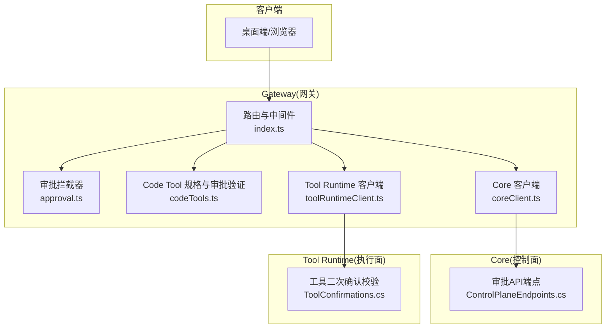
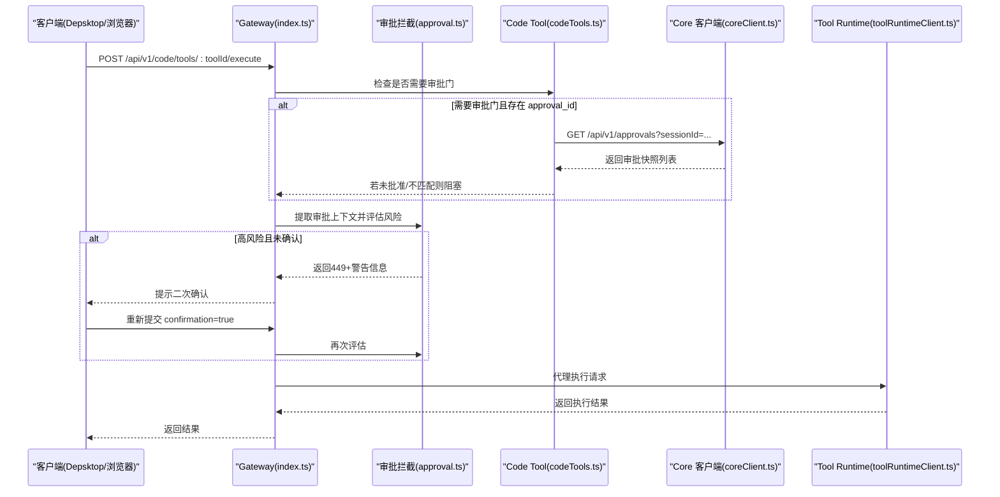
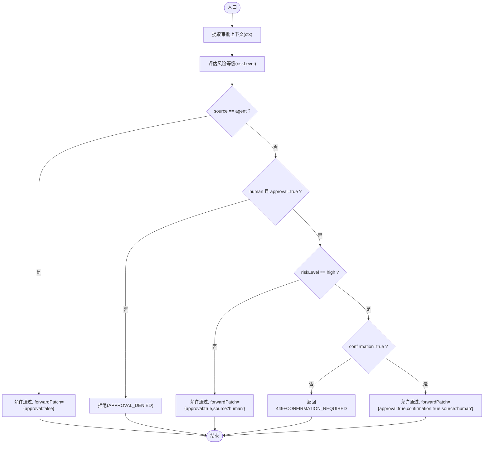
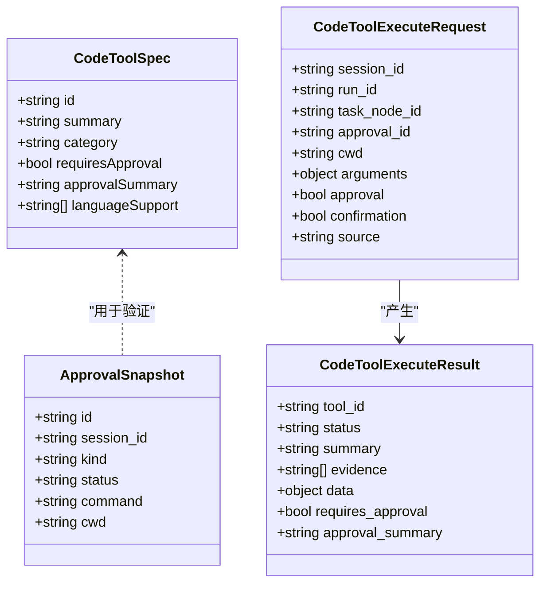
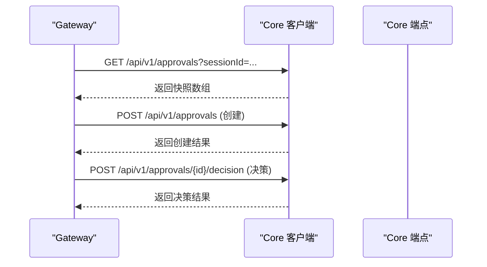
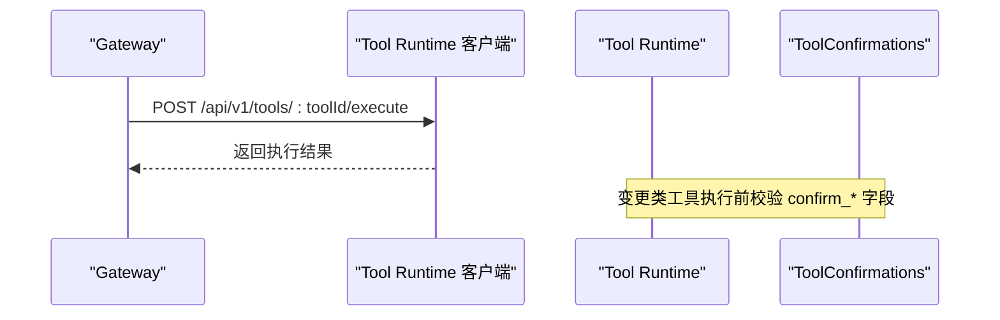
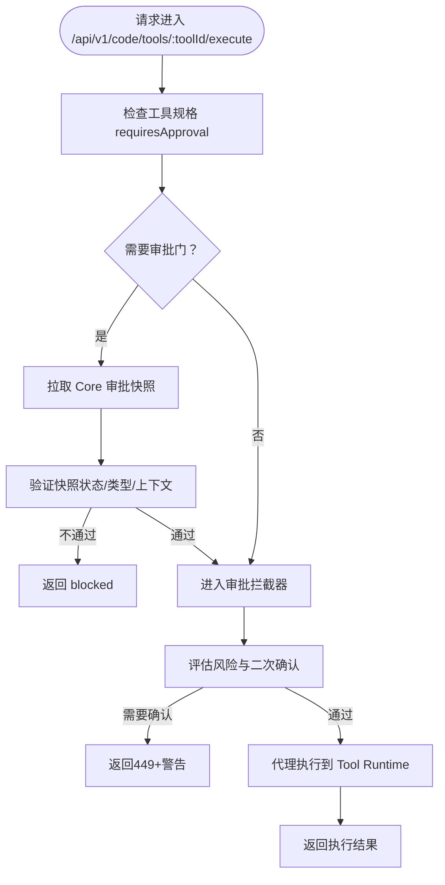
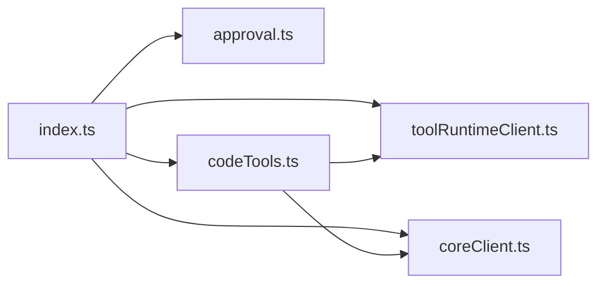

# 审批系统集成

<cite>
**本文引用的文件**   
- [TinadecGateway/src/approval.ts](file://TinadecGateway/src/approval.ts)
- [TinadecGateway/src/index.ts](file://TinadecGateway/src/index.ts)
- [TinadecGateway/src/codeTools.ts](file://TinadecGateway/src/codeTools.ts)
- [TinadecGateway/src/coreClient.ts](file://TinadecGateway/src/coreClient.ts)
- [TinadecGateway/src/toolRuntimeClient.ts](file://TinadecGateway/src/toolRuntimeClient.ts)
- [TinadecCore/Api/Endpoints/ControlPlaneEndpoints.cs](file://TinadecCore/Api/Endpoints/ControlPlaneEndpoints.cs)
- [TinadecTools/Tools/ToolConfirmations.cs](file://TinadecTools/Tools/ToolConfirmations.cs)
</cite>

## 目录
1. [简介](#简介)
2. [项目结构](#项目结构)
3. [核心组件](#核心组件)
4. [架构总览](#架构总览)
5. [详细组件分析](#详细组件分析)
6. [依赖关系分析](#依赖关系分析)
7. [性能考量](#性能考量)
8. [故障排查指南](#故障排查指南)
9. [结论](#结论)
10. [附录](#附录)

## 简介
本文件面向 Gateway 网关的“审批系统集成模块”，系统性阐述以下主题：
- 审批门控机制设计原理与拦截流程
- 审批上下文提取算法与风险评估策略
- 高风险操作的二次确认流程与决策引擎
- 审批状态同步机制、补丁合并与结果缓存
- 与 Core 服务的审批 API 集成、实时状态更新与历史记录管理
- 审批规则配置示例与自定义审批策略开发指南
- 面向初学者的概念说明，以及面向资深开发者的实现细节与扩展指导

## 项目结构
审批系统相关代码主要分布在 Gateway（BFF/API 层）与 Core（控制面）、Tools（执行层）三个部分：
- Gateway 侧负责请求鉴权、审批拦截、风险判定、二次确认、与 Core/Tool Runtime 的代理转发
- Core 侧提供审批资源的创建、查询与决策接口
- Tools 侧在工具执行时进行二次确认字段校验

**图表来源** 
- [TinadecGateway/src/index.ts](file://TinadecGateway/src/index.ts)
- [TinadecGateway/src/approval.ts](file://TinadecGateway/src/approval.ts)
- [TinadecGateway/src/codeTools.ts](file://TinadecGateway/src/codeTools.ts)
- [TinadecGateway/src/coreClient.ts](file://TinadecGateway/src/coreClient.ts)
- [TinadecGateway/src/toolRuntimeClient.ts](file://TinadecGateway/src/toolRuntimeClient.ts)
- [TinadecCore/Api/Endpoints/ControlPlaneEndpoints.cs](file://TinadecCore/Api/Endpoints/ControlPlaneEndpoints.cs)
- [TinadecTools/Tools/ToolConfirmations.cs](file://TinadecTools/Tools/ToolConfirmations.cs)

**章节来源**
- [TinadecGateway/src/index.ts](file://TinadecGateway/src/index.ts)
- [TinadecGateway/src/approval.ts](file://TinadecGateway/src/approval.ts)
- [TinadecGateway/src/codeTools.ts](file://TinadecGateway/src/codeTools.ts)
- [TinadecGateway/src/coreClient.ts](file://TinadecGateway/src/coreClient.ts)
- [TinadecGateway/src/toolRuntimeClient.ts](file://TinadecGateway/src/toolRuntimeClient.ts)
- [TinadecCore/Api/Endpoints/ControlPlaneEndpoints.cs](file://TinadecCore/Api/Endpoints/ControlPlaneEndpoints.cs)
- [TinadecTools/Tools/ToolConfirmations.cs](file://TinadecTools/Tools/ToolConfirmations.cs)

## 核心组件
- 审批拦截器（approval.ts）
  - 从请求体提取审批上下文（来源、人类操作标志、二次确认标志、工具ID、命令、工作目录）
  - 基于工具ID与命令文本评估风险等级（低/中/高）
  - 根据规则决定是否放行、是否需要二次确认或拒绝
  - 生成需要二次确认的响应体，并支持将审批补丁合并到请求体
- Code Tool 规格与审批验证（codeTools.ts）
  - 维护 Code Tool 规格清单（是否需审批、审批摘要等）
  - 通过 Core 审批快照验证 approval_id 的有效性、状态、类型与工作目录一致性
  - 将执行请求代理到 Tool Runtime
- Core 客户端（coreClient.ts）
  - 统一代理 JSON/SSE/流式 HTTP 到 Core 服务
- Tool Runtime 客户端（toolRuntimeClient.ts）
  - 统一代理 JSON/SSE/流式 HTTP 到 Tool Runtime 服务
- 认证与租户上下文（auth.ts）
  - 本地模式跳过认证；云端模式支持 API Key/JWT 认证，注入租户与用户头
- 路由与编排（index.ts）
  - 组装审批拦截、Code Tool 审批门、代理执行、SSE 事件流等

**章节来源**
- [TinadecGateway/src/approval.ts](file://TinadecGateway/src/approval.ts)
- [TinadecGateway/src/codeTools.ts](file://TinadecGateway/src/codeTools.ts)
- [TinadecGateway/src/coreClient.ts](file://TinadecGateway/src/coreClient.ts)
- [TinadecGateway/src/toolRuntimeClient.ts](file://TinadecGateway/src/toolRuntimeClient.ts)
- [TinadecGateway/src/auth.ts](file://TinadecGateway/src/auth.ts)
- [TinadecGateway/src/index.ts](file://TinadecGateway/src/index.ts)

## 架构总览
Gateway 作为 BFF/API 层，承担审批拦截与协议转换职责。Agent 发起的请求走 Core 审批门；人类直接操作通过 Desktop 发出并携带 approval=true，Gateway 对高风险操作触发二次确认。最终所有执行均交由 Tool Runtime 完成。

**图表来源** 
- [TinadecGateway/src/index.ts](file://TinadecGateway/src/index.ts)
- [TinadecGateway/src/approval.ts](file://TinadecGateway/src/approval.ts)
- [TinadecGateway/src/codeTools.ts](file://TinadecGateway/src/codeTools.ts)
- [TinadecGateway/src/coreClient.ts](file://TinadecGateway/src/coreClient.ts)
- [TinadecGateway/src/toolRuntimeClient.ts](file://TinadecGateway/src/toolRuntimeClient.ts)

## 详细组件分析

### 审批拦截器（approval.ts）
- 审批上下文提取
  - 从请求体解析 source、approval、confirmation、toolId、command、cwd
  - 兼容多种字段名变体（如 approved/confirmed）
- 风险评估策略
  - 无 toolId 时按命令文本关键词判断（如 rm -rf、git push/commit/merge 等）
  - 有 toolId 时依据内置的高/中风险集合判定
- 审批决策引擎
  - Agent 请求：不拦截，透传 approval=false
  - 人类请求但缺少 approval=true：拒绝
  - 人类低/中风险：直接放行并注入 forwardPatch
  - 人类高风险：若无 confirmation=true，返回需要二次确认
- 二次确认响应
  - 使用非标准状态码 449 表达“重试并带确认”
  - 返回 warning 标题、正文、风险等级等信息供 UI 展示
- 补丁合并
  - 将 forwardPatch 合并到原始请求体，确保下游收到必要标记

**图表来源** 
- [TinadecGateway/src/approval.ts](file://TinadecGateway/src/approval.ts)

**章节来源**
- [TinadecGateway/src/approval.ts](file://TinadecGateway/src/approval.ts)

### Code Tool 审批门与执行（codeTools.ts）
- 工具规格清单
  - 定义每个 Code Tool 的 id、摘要、分类、是否需要审批、审批摘要、语言支持等
- 审批快照验证
  - 当 requiresApproval=true 且请求包含 approval_id 时，调用 Core 获取快照
  - 校验：是否存在、状态是否为 approved、kind 是否允许、cwd 是否一致、Git 动作是否与审批命令匹配
  - 若不满足，返回 blocked 结果并附带证据链
- 执行代理
  - 通过 Tool Runtime 客户端代理执行请求，统一错误处理与状态映射

**图表来源** 
- [TinadecGateway/src/codeTools.ts](file://TinadecGateway/src/codeTools.ts)

**章节来源**
- [TinadecGateway/src/codeTools.ts](file://TinadecGateway/src/codeTools.ts)

### Core 审批 API 集成（coreClient.ts + ControlPlaneEndpoints.cs）
- Gateway 通过 coreClient.ts 以 JSON/SSE/流式方式代理到 Core
- Core 暴露审批资源端点：
  - GET /api/v1/approvals（支持按状态、会话过滤）
  - POST /api/v1/approvals（创建审批）
  - POST /api/v1/approvals/{id}/decision（提交决策）
- Gateway 在 Code Tool 执行前拉取审批快照，用于审批门验证

**图表来源** 
- [TinadecGateway/src/coreClient.ts](file://TinadecGateway/src/coreClient.ts)
- [TinadecCore/Api/Endpoints/ControlPlaneEndpoints.cs](file://TinadecCore/Api/Endpoints/ControlPlaneEndpoints.cs)

**章节来源**
- [TinadecGateway/src/coreClient.ts](file://TinadecGateway/src/coreClient.ts)
- [TinadecCore/Api/Endpoints/ControlPlaneEndpoints.cs](file://TinadecCore/Api/Endpoints/ControlPlaneEndpoints.cs)

### Tool Runtime 执行与二次确认（toolRuntimeClient.ts + ToolConfirmations.cs）
- Gateway 将所有工具执行请求代理至 Tool Runtime
- Tool Runtime 在执行变更类工具时要求 confirm_* 字段非空，否则抛出异常通知 Gateway

**图表来源** 
- [TinadecGateway/src/toolRuntimeClient.ts](file://TinadecGateway/src/toolRuntimeClient.ts)
- [TinadecTools/Tools/ToolConfirmations.cs](file://TinadecTools/Tools/ToolConfirmations.cs)

**章节来源**
- [TinadecGateway/src/toolRuntimeClient.ts](file://TinadecGateway/src/toolRuntimeClient.ts)
- [TinadecTools/Tools/ToolConfirmations.cs](file://TinadecTools/Tools/ToolConfirmations.cs)

### 路由与编排（index.ts）
- 健康检查、模型中心、Agent 中心等通用端点由 Gateway 代理到 Core
- Code Tool 执行端点：
  - 先检查是否需要审批门（requiresApproval）
  - 若需要且存在 approval_id，则拉取 Core 审批快照并验证
  - 再进入审批拦截器（approval.ts）进行人类操作二次确认
  - 最后代理执行到 Tool Runtime

**图表来源** 
- [TinadecGateway/src/index.ts](file://TinadecGateway/src/index.ts)
- [TinadecGateway/src/codeTools.ts](file://TinadecGateway/src/codeTools.ts)
- [TinadecGateway/src/approval.ts](file://TinadecGateway/src/approval.ts)

**章节来源**
- [TinadecGateway/src/index.ts](file://TinadecGateway/src/index.ts)

## 依赖关系分析
- 模块耦合
  - index.ts 依赖 approval.ts、codeTools.ts、coreClient.ts、toolRuntimeClient.ts
  - codeTools.ts 依赖 toolRuntimeClient.ts（执行代理）与 Core 审批 API（通过 coreClient.ts）
  - approval.ts 为纯逻辑模块，无外部依赖
- 外部依赖
  - Core 服务：提供审批资源 CRUD 与决策接口
  - Tool Runtime：执行具体工具，并在变更类操作中强制二次确认字段
- 潜在循环依赖
  - 当前未发现循环依赖；各模块职责清晰，单向依赖

**图表来源** 
- [TinadecGateway/src/index.ts](file://TinadecGateway/src/index.ts)
- [TinadecGateway/src/approval.ts](file://TinadecGateway/src/approval.ts)
- [TinadecGateway/src/codeTools.ts](file://TinadecGateway/src/codeTools.ts)
- [TinadecGateway/src/coreClient.ts](file://TinadecGateway/src/coreClient.ts)
- [TinadecGateway/src/toolRuntimeClient.ts](file://TinadecGateway/src/toolRuntimeClient.ts)

**章节来源**
- [TinadecGateway/src/index.ts](file://TinadecGateway/src/index.ts)
- [TinadecGateway/src/approval.ts](file://TinadecGateway/src/approval.ts)
- [TinadecGateway/src/codeTools.ts](file://TinadecGateway/src/codeTools.ts)
- [TinadecGateway/src/coreClient.ts](file://TinadecGateway/src/coreClient.ts)
- [TinadecGateway/src/toolRuntimeClient.ts](file://TinadecGateway/src/toolRuntimeClient.ts)

## 性能考量
- 网络开销
  - 每次 Code Tool 执行可能触发一次 Core 审批快照查询，建议在高并发场景下考虑本地缓存快照（注意一致性）
- 超时与重试
  - 合理设置 requestTimeoutMs，避免长尾请求阻塞
- 流式传输
  - 大文件与日志使用流式 HTTP/SSE，减少内存占用
- 鉴权开销
  - JWT 验签在云端模式下启用，建议复用密钥与最小化头部传递

[本节为通用指导，不直接分析具体文件]

## 故障排查指南
- 常见错误码与原因
  - 449 CONFIRMATION_REQUIRED：高风险操作未二次确认
  - 403 APPROVAL_DENIED：人类请求缺少 approval=true 或被拦截
  - 502 CORE_UNREACHABLE/CORE_INVALID_RESPONSE：Core 不可达或响应非 JSON
  - 502 TOOL_RUNTIME_UNREACHABLE/TOOL_RUNTIME_INVALID_RESPONSE：Tool Runtime 不可达或响应非 JSON
- 定位步骤
  - 检查请求体是否包含必要的 approval/confirmation/source 字段
  - 核对 toolId 是否在高风险集合中，命令文本是否命中高危关键词
  - 查看 Core 审批快照状态是否为 approved，kind 是否匹配，cwd 是否一致
  - 确认 Tool Runtime 是否返回了正确的 JSON 结构与状态码
- 日志与调试
  - 使用 /api/v1/debug/traces、/api/v1/debug/spans、/api/v1/debug/metrics 等调试端点辅助定位

**章节来源**
- [TinadecGateway/src/approval.ts](file://TinadecGateway/src/approval.ts)
- [TinadecGateway/src/coreClient.ts](file://TinadecGateway/src/coreClient.ts)
- [TinadecGateway/src/toolRuntimeClient.ts](file://TinadecGateway/src/toolRuntimeClient.ts)
- [TinadecGateway/src/index.ts](file://TinadecGateway/src/index.ts)

## 结论
本审批系统集成通过 Gateway 的审批拦截器与 Code Tool 审批门协同，实现了人类操作的高风险二次确认与 Agent 请求的 Core 审批门流程。结合 Core 审批 API 与 Tool Runtime 的执行约束，形成端到端的可控、可审计、可扩展的审批体系。建议在大规模部署中引入快照缓存、限流与熔断策略，进一步提升稳定性与性能。

[本节为总结性内容，不直接分析具体文件]

## 附录

### 审批规则配置示例
- 高风险工具 ID 集合（示例）
  - command_run、sandbox_exec、bash_environment、git_push、git_force_push、git_commit、git_merge、git_rebase、git_reset、git_clean、project_template_scaffold、write_file、delete_file、apply_patch
- 中等风险工具 ID 集合（示例）
  - git_stage、git_unstage、git_checkout、git_branch_create、git_branch_delete、git_branch_rename、git_fetch、git_pull、git_worktree_create、git_worktree_remove、git_conflict_resolve
- 命令文本高危关键词（示例）
  - rm -rf、format、del /f、git push、git commit、git merge

**章节来源**
- [TinadecGateway/src/approval.ts](file://TinadecGateway/src/approval.ts)

### 自定义审批策略开发指南
- 扩展风险评估
  - 在 assessRisk 中增加新的工具 ID 或命令关键词规则
- 扩展审批上下文
  - 在 extractApprovalContext 中新增字段解析与校验
- 扩展审批门验证
  - 在 codeToolApprovalBlockFor 中增加新的 kind 或 action 匹配逻辑
- 扩展二次确认提示
  - 在 buildConfirmationRequiredResponse 中定制 warning 文案与风险等级展示

**章节来源**
- [TinadecGateway/src/approval.ts](file://TinadecGateway/src/approval.ts)
- [TinadecGateway/src/codeTools.ts](file://TinadecGateway/src/codeTools.ts)

### 审批状态同步与历史记录管理
- 状态同步
  - 通过 GET /api/v1/approvals 拉取快照，确保执行前状态最新
- 历史记录
  - 通过 /api/v1/sessions/:sessionId/tool-executions、/api/v1/events 等端点获取执行与事件历史
- 实时状态更新
  - 使用 SSE 订阅 /api/v1/events 或 invoke-stream，实时接收审批与执行事件

**章节来源**
- [TinadecGateway/src/index.ts](file://TinadecGateway/src/index.ts)
- [TinadecCore/Api/Endpoints/ControlPlaneEndpoints.cs](file://TinadecCore/Api/Endpoints/ControlPlaneEndpoints.cs)