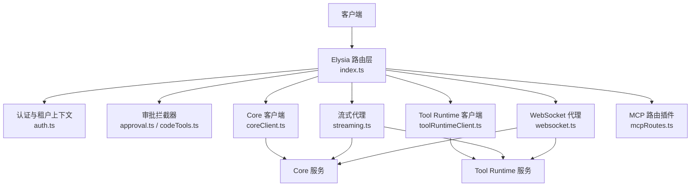
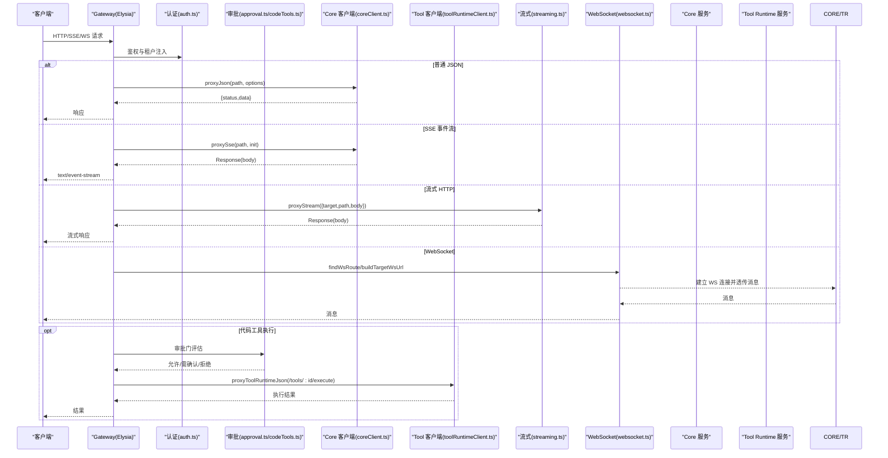
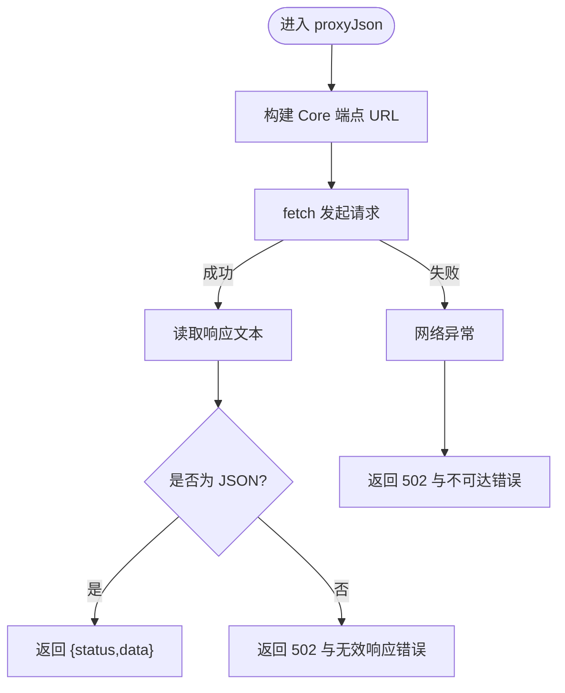
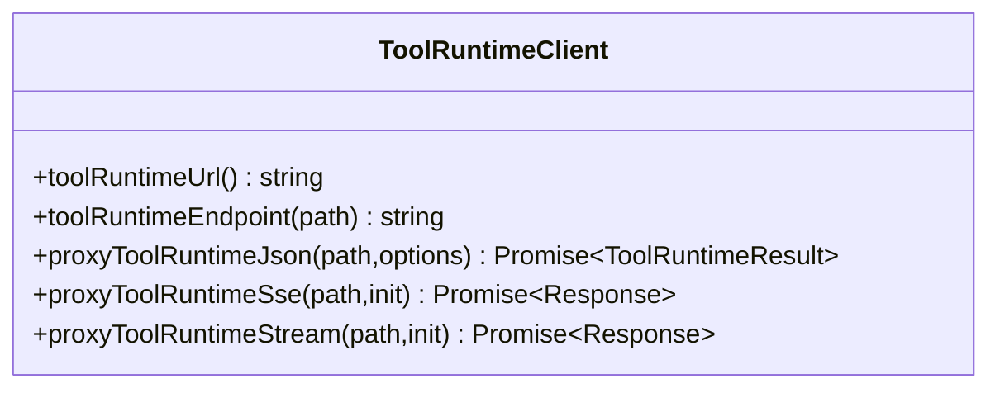
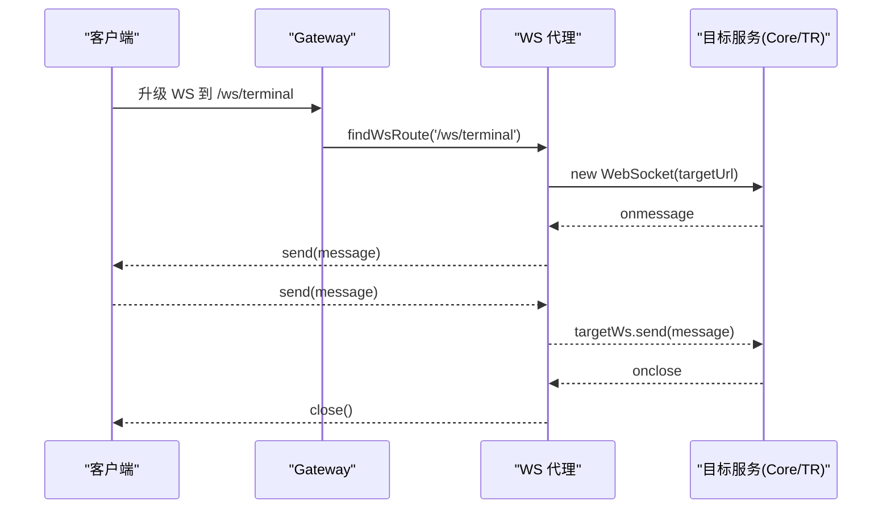
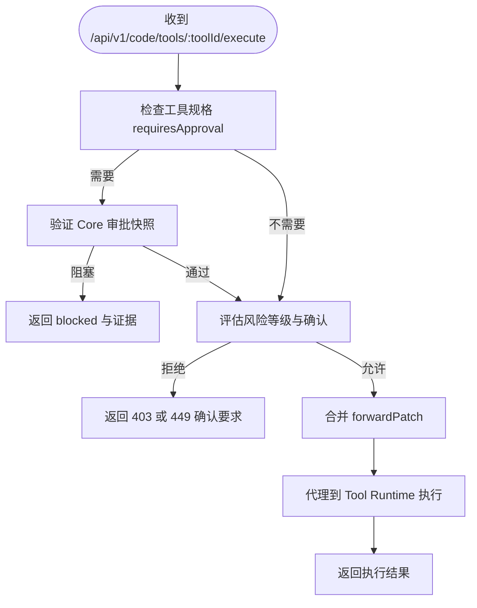
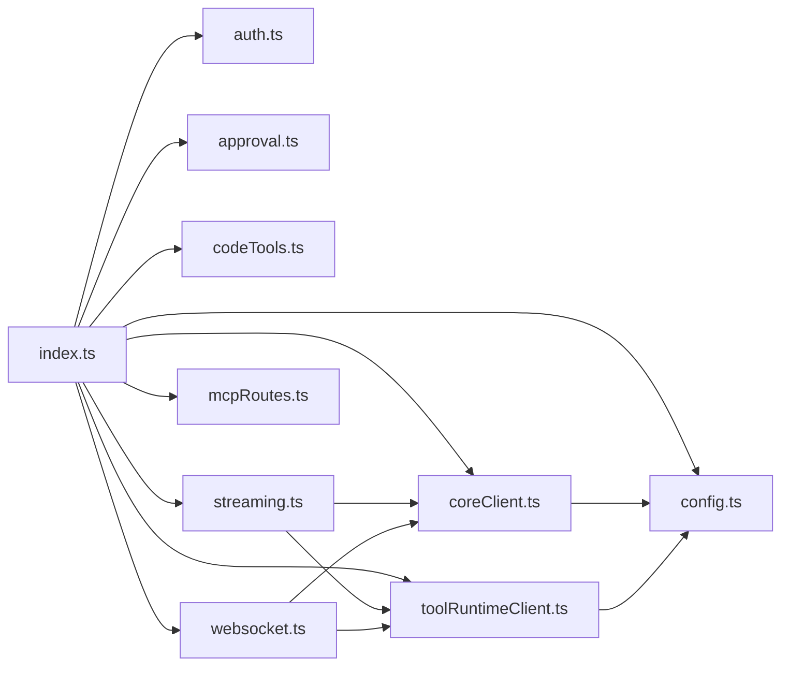

# 服务代理与通信

<cite>
**本文引用的文件**   
- [index.ts](file://TinadecGateway/src/index.ts)
- [coreClient.ts](file://TinadecGateway/src/coreClient.ts)
- [toolRuntimeClient.ts](file://TinadecGateway/src/toolRuntimeClient.ts)
- [streaming.ts](file://TinadecGateway/src/streaming.ts)
- [websocket.ts](file://TinadecGateway/src/websocket.ts)
- [config.ts](file://TinadecGateway/src/config.ts)
- [auth.ts](file://TinadecGateway/src/auth.ts)
- [approval.ts](file://TinadecGateway/src/approval.ts)
- [codeTools.ts](file://TinadecGateway/src/codeTools.ts)
- [modelAgentCenter.ts](file://TinadecGateway/src/modelAgentCenter.ts)
- [mcpRoutes.ts](file://TinadecGateway/src/mcp/mcpRoutes.ts)
- [package.json](file://TinadecGateway/package.json)
</cite>

## 目录
1. [简介](#简介)
2. [项目结构](#项目结构)
3. [核心组件](#核心组件)
4. [架构总览](#架构总览)
5. [详细组件分析](#详细组件分析)
6. [依赖关系分析](#依赖关系分析)
7. [性能考量](#性能考量)
8. [故障排查指南](#故障排查指南)
9. [结论](#结论)
10. [附录](#附录)

## 简介
本文件面向 Gateway 网关的服务代理与通信模块，系统性阐述 Core 服务代理机制、Tool Runtime 客户端实现、HTTP 请求转发策略，以及连接管理、超时控制、重试机制、负载均衡策略。同时覆盖 SSE 事件流代理、WebSocket 连接管理、流式数据传输优化；解释错误处理与故障转移、请求监控与性能统计、连接健康检查；并提供代理配置示例与自定义协议适配器开发指南。文档兼顾初学者理解与资深开发者深入实践需求。

## 项目结构
Gateway 采用“薄代理 + BFF 组合”的架构：Elysia 路由层负责鉴权、CORS、审批拦截、BFF 聚合与协议转换；Core/Tool Runtime 通过专用客户端进行 JSON/SSE/流式 HTTP 代理；WebSocket 作为反向代理透传终端与调试协作通道。

**图表来源** 
- [index.ts:107-155](file://TinadecGateway/src/index.ts#L107-L155)
- [coreClient.ts:22-30](file://TinadecGateway/src/coreClient.ts#L22-L30)
- [toolRuntimeClient.ts:28-36](file://TinadecGateway/src/toolRuntimeClient.ts#L28-L36)
- [streaming.ts:25-37](file://TinadecGateway/src/streaming.ts#L25-L37)
- [websocket.ts:51-67](file://TinadecGateway/src/websocket.ts#L51-L67)
- [mcpRoutes.ts:22-66](file://TinadecGateway/src/mcp/mcpRoutes.ts#L22-L66)

**章节来源**
- [index.ts:1-120](file://TinadecGateway/src/index.ts#L1-L120)
- [package.json:1-22](file://TinadecGateway/package.json#L1-L22)

## 核心组件
- 配置中心：统一加载部署模式、端口、主机名、Core/Tool Runtime URL、认证、CORS、超时、信任代理等。
- 认证与租户：云端模式支持 API Key/JWT，注入 x-tenant-id/x-user-id 到下游头。
- Core 客户端：JSON/SSE/流式 HTTP 代理，统一错误码（不可达/非 JSON）。
- Tool Runtime 客户端：同上，用于工具执行、SSE 事件、大文件/日志流。
- 流式代理：按目标选择 Core/Tool Runtime，透传 body 流，设置必要响应头。
- WebSocket 代理：基于 Bun WS 客户端建立双向透传，提供路由表与消息处理器。
- 审批拦截器：人类操作 approval=true 透传，高风险二次确认，Agent 请求走 Core 审批门。
- Code Tools：工具规格发布、Core 审批状态校验、代理执行到 Tool Runtime。
- Model/Agent Center：聚合 Core 能力视图，诊断与只写保护。
- MCP 路由：纯代理模式，连接/断开/状态/调用均透传到 Tool Runtime。

**章节来源**
- [config.ts:20-106](file://TinadecGateway/src/config.ts#L20-L106)
- [auth.ts:46-112](file://TinadecGateway/src/auth.ts#L46-L112)
- [coreClient.ts:38-87](file://TinadecGateway/src/coreClient.ts#L38-L87)
- [toolRuntimeClient.ts:44-97](file://TinadecGateway/src/toolRuntimeClient.ts#L44-L97)
- [streaming.ts:25-53](file://TinadecGateway/src/streaming.ts#L25-L53)
- [websocket.ts:72-139](file://TinadecGateway/src/websocket.ts#L72-L139)
- [approval.ts:145-197](file://TinadecGateway/src/approval.ts#L145-L197)
- [codeTools.ts:439-462](file://TinadecGateway/src/codeTools.ts#L439-L462)
- [modelAgentCenter.ts:517-535](file://TinadecGateway/src/modelAgentCenter.ts#L517-L535)
- [mcpRoutes.ts:22-66](file://TinadecGateway/src/mcp/mcpRoutes.ts#L22-L66)

## 架构总览
Gateway 作为统一入口，将不同协议与业务域路由至 Core 或 Tool Runtime，并在必要时进行数据聚合与权限控制。

**图表来源** 
- [index.ts:231-243](file://TinadecGateway/src/index.ts#L231-L243)
- [coreClient.ts:93-101](file://TinadecGateway/src/coreClient.ts#L93-L101)
- [toolRuntimeClient.ts:103-114](file://TinadecGateway/src/toolRuntimeClient.ts#L103-L114)
- [streaming.ts:25-37](file://TinadecGateway/src/streaming.ts#L25-L37)
- [websocket.ts:35-45](file://TinadecGateway/src/websocket.ts#L35-L45)
- [approval.ts:145-197](file://TinadecGateway/src/approval.ts#L145-L197)
- [codeTools.ts:439-462](file://TinadecGateway/src/codeTools.ts#L439-L462)

## 详细组件分析

### Core 服务代理机制
- 基础 URL 与端点构造：从配置读取 coreUrl，拼接路径生成完整 URL。
- JSON 代理：统一 accept/content-type，异常捕获返回 502 及标准化错误体；非 JSON 响应回退为错误。
- SSE 代理：设置 accept=text/event-stream，透传 Response.body 给上层。
- 流式 HTTP：直接透传 RequestInit，适合大文件与日志。

**图表来源** 
- [coreClient.ts:38-87](file://TinadecGateway/src/coreClient.ts#L38-L87)

**章节来源**
- [coreClient.ts:22-30](file://TinadecGateway/src/coreClient.ts#L22-L30)
- [coreClient.ts:38-87](file://TinadecGateway/src/coreClient.ts#L38-L87)
- [coreClient.ts:93-101](file://TinadecGateway/src/coreClient.ts#L93-L101)

### Tool Runtime 客户端实现
- 与 Core 客户端对称：JSON/SSE/流式 HTTP 三种模式。
- 错误处理：不可达与非 JSON 响应均返回 502 与标准化错误码。
- 典型用途：工具执行、SSE 事件流、大文件/日志传输。

**图表来源** 
- [toolRuntimeClient.ts:28-36](file://TinadecGateway/src/toolRuntimeClient.ts#L28-L36)
- [toolRuntimeClient.ts:44-97](file://TinadecGateway/src/toolRuntimeClient.ts#L44-L97)
- [toolRuntimeClient.ts:103-125](file://TinadecGateway/src/toolRuntimeClient.ts#L103-L125)

**章节来源**
- [toolRuntimeClient.ts:28-36](file://TinadecGateway/src/toolRuntimeClient.ts#L28-L36)
- [toolRuntimeClient.ts:44-97](file://TinadecGateway/src/toolRuntimeClient.ts#L44-L97)
- [toolRuntimeClient.ts:103-125](file://TinadecGateway/src/toolRuntimeClient.ts#L103-L125)

### HTTP 请求转发策略
- 头部处理：默认 accept=application/json，有 body 时设置 content-type；可合并外部 headers。
- 方法映射：GET/POST/PUT/DELETE 等由调用方传入 method。
- 错误归一化：网络异常与解析异常统一返回 502 与结构化错误体。
- 流式透传：对大文件/日志使用 duplex 半双工，避免缓冲。

**章节来源**
- [coreClient.ts:38-87](file://TinadecGateway/src/coreClient.ts#L38-L87)
- [toolRuntimeClient.ts:44-97](file://TinadecGateway/src/toolRuntimeClient.ts#L44-L97)
- [streaming.ts:25-37](file://TinadecGateway/src/streaming.ts#L25-L37)

### 连接池管理、超时控制、重试机制、负载均衡策略
- 连接池：当前未显式实现连接池，依赖运行时（Bun）底层连接复用。
- 超时控制：通过环境变量 TINADEC_GATEWAY_TIMEOUT_MS 配置全局超时（毫秒），在应用层可用于包装 fetch 或中间件。
- 重试机制：当前未内置重试；可在上游封装或使用幂等接口配合指数退避。
- 负载均衡：当前单实例直连 Core/Tool Runtime；多实例部署建议前置负载均衡器（如 Nginx/云 LB）做健康检查与流量分发。

[本节为通用指导，不直接分析具体文件]

### SSE 事件流代理
- 统一事件流：/api/v1/sessions/:sessionId/invoke-stream 与 /api/v1/events 均通过 proxySse 透传 Core SSE。
- 响应头：设置 text/event-stream、no-cache、keep-alive、x-accel-buffering=no 以适配反向代理。

**章节来源**
- [index.ts:231-243](file://TinadecGateway/src/index.ts#L231-L243)
- [index.ts:278-286](file://TinadecGateway/src/index.ts#L278-L286)
- [coreClient.ts:93-101](file://TinadecGateway/src/coreClient.ts#L93-L101)

### WebSocket 连接管理
- 路由表：/ws/terminal→Tool Runtime，/ws/debug→Core，/ws/collaboration→Core。
- 目标 URL 构建：http(s) 前缀替换为 ws(s)，追加查询参数。
- 消息透传：创建目标 WS 客户端，双向 onmessage/onclose/onerror 透传与清理。

**图表来源** 
- [websocket.ts:51-67](file://TinadecGateway/src/websocket.ts#L51-L67)
- [websocket.ts:35-45](file://TinadecGateway/src/websocket.ts#L35-L45)
- [websocket.ts:93-139](file://TinadecGateway/src/websocket.ts#L93-L139)

**章节来源**
- [websocket.ts:72-139](file://TinadecGateway/src/websocket.ts#L72-L139)

### 流式数据传输优化
- 目标选择：core 或 tool_runtime，根据 path 与目标决定 endpoint。
- 流式请求体：使用 duplex='half' 支持半双工流式上传。
- 响应头：复制源 contentType，禁用缓存与代理缓冲，保持 keep-alive。

**章节来源**
- [streaming.ts:25-53](file://TinadecGateway/src/streaming.ts#L25-L53)

### 错误处理与故障转移机制
- 不可达错误：Core/Tool Runtime 网络异常返回 502 与标准化错误码（CORE_UNREACHABLE/TOOL_RUNTIME_UNREACHABLE）。
- 非 JSON 响应：返回 502 与 INVALID_RESPONSE 错误体。
- 健康检查：/health、/doctor、/readiness、/model-readiness、/model-catalog-readiness、/tool-layer-readiness 均透传 Core 状态。
- 故障转移：当前无自动切换；可通过前置 LB 与健康检查实现。

**章节来源**
- [coreClient.ts:56-87](file://TinadecGateway/src/coreClient.ts#L56-L87)
- [toolRuntimeClient.ts:66-97](file://TinadecGateway/src/toolRuntimeClient.ts#L66-L97)
- [index.ts:157-193](file://TinadecGateway/src/index.ts#L157-L193)

### 请求监控与性能统计
- 诊断端点：/debug/traces、/debug/spans、/debug/metrics、/debug/diagnostics、/debug/processes、/debug/snapshot/:sessionId。
- 指标采集：通过 /debug/metrics 获取窗口化指标，便于监控与告警。
- 建议：在 Gateway 层增加请求耗时、错误率、QPS 等埋点，结合外部监控系统（Prometheus/Grafana）。

**章节来源**
- [index.ts:729-790](file://TinadecGateway/src/index.ts#L729-L790)

### 连接健康检查
- 健康检查路由：/api/v1/health 返回 gateway/core/tool_runtime 状态与运行模式。
- 就绪检查：/api/v1/readiness 与各 readiness 端点反映下游服务可用性。

**章节来源**
- [index.ts:157-193](file://TinadecGateway/src/index.ts#L157-L193)

### 审批拦截与 Code Tools 执行流程
- 人类操作：approval=true 透传，低风险直接通过，高风险需 confirmation=true 二次确认。
- Agent 操作：不拦截，交由 Core 审批门处理。
- Code Tools：规格发布、Core 审批快照校验、最终代理执行到 Tool Runtime。

**图表来源** 
- [index.ts:351-400](file://TinadecGateway/src/index.ts#L351-L400)
- [approval.ts:145-197](file://TinadecGateway/src/approval.ts#L145-L197)
- [codeTools.ts:439-462](file://TinadecGateway/src/codeTools.ts#L439-L462)

**章节来源**
- [index.ts:351-400](file://TinadecGateway/src/index.ts#L351-L400)
- [approval.ts:145-197](file://TinadecGateway/src/approval.ts#L145-L197)
- [codeTools.ts:350-420](file://TinadecGateway/src/codeTools.ts#L350-L420)

### Model/Agent Center 聚合与只写保护
- 聚合模型：模板、提供者、路由、就绪状态、ACP 适配器，输出统一概览。
- 只写保护：agent runtime binding 写入与 model discovery refresh 返回不支持（501）与能力声明。

**章节来源**
- [modelAgentCenter.ts:517-535](file://TinadecGateway/src/modelAgentCenter.ts#L517-L535)
- [modelAgentCenter.ts:206-269](file://TinadecGateway/src/modelAgentCenter.ts#L206-L269)

### MCP 路由（纯代理）
- 端点：connect/disconnect/status/tools/:toolName/call 全部透传到 Tool Runtime。
- 目的：Gateway 不持有 MCP 连接状态，保持薄代理。

**章节来源**
- [mcpRoutes.ts:22-66](file://TinadecGateway/src/mcp/mcpRoutes.ts#L22-L66)

## 依赖关系分析
Gateway 内部模块依赖清晰，职责单一，耦合度低。

**图表来源** 
- [index.ts:23-51](file://TinadecGateway/src/index.ts#L23-L51)
- [coreClient.ts:7-8](file://TinadecGateway/src/coreClient.ts#L7-L8)
- [toolRuntimeClient.ts:13-14](file://TinadecGateway/src/toolRuntimeClient.ts#L13-L14)
- [streaming.ts:8-9](file://TinadecGateway/src/streaming.ts#L8-L9)
- [websocket.ts:15-17](file://TinadecGateway/src/websocket.ts#L15-L17)

**章节来源**
- [index.ts:23-51](file://TinadecGateway/src/index.ts#L23-L51)

## 性能考量
- 流式优先：大文件与日志使用 streaming.ts 透传，避免内存峰值。
- 头部最小化：仅传递必要 headers，减少序列化开销。
- 连接复用：依赖 Bun 底层连接复用，避免频繁握手。
- 监控埋点：利用 /debug/metrics 与外部监控，关注延迟分布与错误率。
- 扩展性：多实例部署时前置 LB，结合健康检查与灰度发布。

[本节为通用指导，不直接分析具体文件]

## 故障排查指南
- 无法访问 Core/Tool Runtime：检查 TINADEC_CORE_URL/TINADEC_TOOL_RUNTIME_URL 与网络连通性；查看 502 错误码与消息。
- 非 JSON 响应：确认下游服务返回格式；检查 content-type 与响应体。
- 认证失败：云端模式检查 Authorization/Bearer 或 x-api-key；JWT 密钥是否配置。
- SSE 中断：检查 no-cache/keep-alive/x-accel-buffering 头；确认反向代理配置。
- WebSocket 断连：检查路由匹配与目标 URL 前缀（ws/ws+ssl）；观察 onclose/onerror。
- 审批被拒：确认 human 请求包含 approval=true；高风险操作需 confirmation=true。

**章节来源**
- [coreClient.ts:56-87](file://TinadecGateway/src/coreClient.ts#L56-L87)
- [toolRuntimeClient.ts:66-97](file://TinadecGateway/src/toolRuntimeClient.ts#L66-L97)
- [auth.ts:46-112](file://TinadecGateway/src/auth.ts#L46-L112)
- [index.ts:231-243](file://TinadecGateway/src/index.ts#L231-L243)
- [websocket.ts:93-139](file://TinadecGateway/src/websocket.ts#L93-L139)
- [approval.ts:145-197](file://TinadecGateway/src/approval.ts#L145-L197)

## 结论
Gateway 以薄代理为核心，通过模块化客户端与中间件实现统一的鉴权、审批、协议转换与流式传输。其架构简洁、职责清晰，易于扩展与横向扩展。建议在现有基础上补充连接池、重试与更完善的监控埋点，以提升稳定性与可观测性。

[本节为总结，不直接分析具体文件]

## 附录

### 代理配置示例（环境变量）
- 部署模式与监听：
  - TINADEC_GATEWAY_MODE=local|cloud
  - TINADEC_GATEWAY_PORT=48730
  - TINADEC_GATEWAY_HOSTNAME=127.0.0.1|0.0.0.0
- 下游服务地址：
  - TINADEC_CORE_URL=http://127.0.0.1:48731
  - TINADEC_TOOL_RUNTIME_URL=http://127.0.0.1:48732
- 认证（云端模式）：
  - TINADEC_GATEWAY_AUTH_REQUIRED=false|true
  - TINADEC_GATEWAY_JWT_SECRET=your-secret
  - TINADEC_GATEWAY_API_KEY=your-api-key
- CORS：
  - TINADEC_GATEWAY_CORS_ORIGINS=https://example.com,*.example.com
- 超时与代理信任：
  - TINADEC_GATEWAY_TIMEOUT_MS=120000
  - trustProxy 由 mode 决定（cloud 为 true）

**章节来源**
- [config.ts:65-106](file://TinadecGateway/src/config.ts#L65-L106)

### 自定义协议适配器开发指南
- 新增协议类型：在 streaming.ts 中扩展 StreamTarget 与路由映射。
- 客户端封装：参考 coreClient.ts/toolRuntimeClient.ts 实现新的 proxyXxx 函数，统一错误处理与头部设置。
- 路由集成：在 index.ts 中添加新端点，复用认证与审批中间件。
- 测试与监控：补充单元测试与 /debug/metrics 埋点，确保可观测性与回归稳定。

[本节为通用指导，不直接分析具体文件]