# 核心服务与路由

<cite>
**本文引用的文件**
- [index.ts](file://TinadecGateway/src/index.ts)
- [config.ts](file://TinadecGateway/src/config.ts)
- [auth.ts](file://TinadecGateway/src/auth.ts)
- [coreClient.ts](file://TinadecGateway/src/coreClient.ts)
- [toolRuntimeClient.ts](file://TinadecGateway/src/toolRuntimeClient.ts)
- [streaming.ts](file://TinadecGateway/src/streaming.ts)
- [websocket.ts](file://TinadecGateway/src/websocket.ts)
- [modelAgentCenter.ts](file://TinadecGateway/src/modelAgentCenter.ts)
- [codeTools.ts](file://TinadecGateway/src/codeTools.ts)
- [approval.ts](file://TinadecGateway/src/approval.ts)
- [package.json](file://TinadecGateway/package.json)
</cite>

## 目录
1. [简介](#简介)
2. [项目结构](#项目结构)
3. [核心组件](#核心组件)
4. [架构总览](#架构总览)
5. [详细组件分析](#详细组件分析)
6. [依赖关系分析](#依赖关系分析)
7. [性能考量](#性能考量)
8. [故障排查指南](#故障排查指南)
9. [结论](#结论)
10. [附录](#附录)

## 简介
本文件面向初学者与有经验的开发者，系统性阐述 Gateway 网关的核心服务与路由系统。内容涵盖：
- 基于 Elysia 框架的应用初始化、中间件管道配置、CORS 处理机制
- 健康检查端点（/api/v1/health）、诊断端点（/api/v1/doctor）、就绪状态检查的实现原理
- 配置管理系统（本地模式/云端模式动态切换）
- 请求生命周期管理、错误处理策略、日志记录机制
- BFF 层概念说明与实现细节、性能优化建议

## 项目结构
Gateway 采用“薄代理 + BFF 组合”的架构，使用 Bun + Elysia 提供 HTTP/SSE/WebSocket/流式传输能力，将请求转发到 Core 与 Tool Runtime 两个后端服务。关键入口与模块如下：
- 应用入口与路由定义：index.ts
- 配置加载与环境变量：config.ts
- 认证与租户上下文：auth.ts
- 到 Core 的 JSON/SSE/流式代理：coreClient.ts
- 到 Tool Runtime 的 JSON/SSE/流式代理：toolRuntimeClient.ts
- 流式响应头设置：streaming.ts
- WebSocket 反向代理：websocket.ts
- Model/Agent Center 聚合视图：modelAgentCenter.ts
- Code Tools 规格、审批门与执行代理：codeTools.ts
- 人类操作审批拦截器（高风险二次确认）：approval.ts

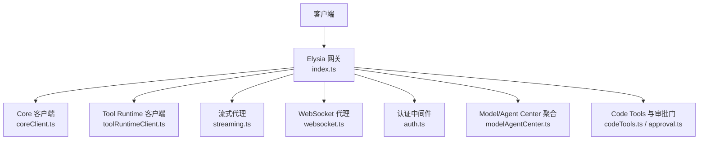

**图表来源**
- [index.ts:107-155](file://TinadecGateway/src/index.ts#L107-L155)
- [coreClient.ts:38-101](file://TinadecGateway/src/coreClient.ts#L38-L101)
- [toolRuntimeClient.ts:44-126](file://TinadecGateway/src/toolRuntimeClient.ts#L44-L126)
- [streaming.ts:25-54](file://TinadecGateway/src/streaming.ts#L25-L54)
- [websocket.ts:51-74](file://TinadecGateway/src/websocket.ts#L51-L74)
- [auth.ts:46-112](file://TinadecGateway/src/auth.ts#L46-L112)
- [modelAgentCenter.ts:517-535](file://TinadecGateway/src/modelAgentCenter.ts#L517-L535)
- [codeTools.ts:439-462](file://TinadecGateway/src/codeTools.ts#L439-L462)
- [approval.ts:145-197](file://TinadecGateway/src/approval.ts#L145-L197)

**章节来源**
- [index.ts:1-120](file://TinadecGateway/src/index.ts#L1-L120)
- [package.json:1-22](file://TinadecGateway/package.json#L1-L22)

## 核心组件
- Elysia 应用与中间件管道：在 index.ts 中通过 .onRequest 注册 CORS 与认证中间件，随后挂载 MCP 路由与健康/诊断/业务路由。
- 配置系统：config.ts 提供 loadConfig/getConfig，支持环境变量驱动本地/云端模式切换，默认端口、监听地址、超时、信任代理等。
- 认证与租户上下文：auth.ts 支持 API Key 与 JWT HS256 验证，注入 x-tenant-id/x-user-id 到下游请求头。
- 代理客户端：coreClient.ts 与 toolRuntimeClient.ts 统一封装 JSON/SSE/流式代理，返回标准结果对象并处理不可达与非 JSON 响应。
- 流式与 WebSocket：streaming.ts 透传 body 流；websocket.ts 维护 WS_ROUTES 映射，双向透传消息。
- BFF 聚合：modelAgentCenter.ts 聚合 Core 的多类资源（供应商、连接、模型、CLI/ACP 运行时），生成概览与诊断信息。
- Code Tools 与审批门：codeTools.ts 暴露工具规格与执行代理；approval.ts 对高风险命令进行二次确认拦截。

**章节来源**
- [index.ts:107-188](file://TinadecGateway/src/index.ts#L107-L188)
- [config.ts:65-115](file://TinadecGateway/src/config.ts#L65-L115)
- [auth.ts:46-112](file://TinadecGateway/src/auth.ts#L46-L112)
- [coreClient.ts:38-101](file://TinadecGateway/src/coreClient.ts#L38-L101)
- [toolRuntimeClient.ts:44-126](file://TinadecGateway/src/toolRuntimeClient.ts#L44-L126)
- [streaming.ts:25-54](file://TinadecGateway/src/streaming.ts#L25-L54)
- [websocket.ts:51-74](file://TinadecGateway/src/websocket.ts#L51-L74)
- [modelAgentCenter.ts:517-535](file://TinadecGateway/src/modelAgentCenter.ts#L517-L535)
- [codeTools.ts:335-348](file://TinadecGateway/src/codeTools.ts#L335-L348)
- [approval.ts:145-197](file://TinadecGateway/src/approval.ts#L145-L197)

## 架构总览
Gateway 作为 BFF/API 层，职责包括鉴权、协议转换、流式转发、BFF 组合与路由分发。它不直接执行文件/Git/Shell/PTY/MCP 操作，所有执行均通过 Tool Runtime 完成。

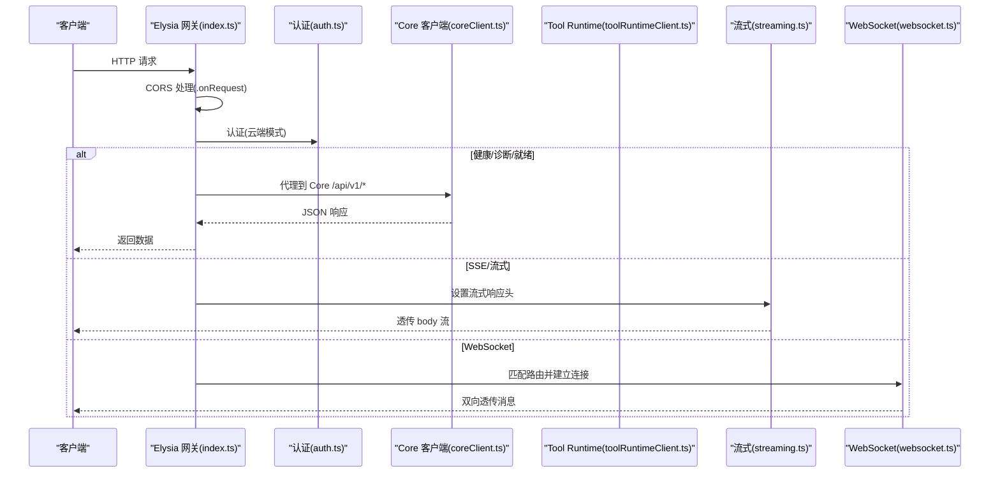

**图表来源**
- [index.ts:107-188](file://TinadecGateway/src/index.ts#L107-L188)
- [auth.ts:46-112](file://TinadecGateway/src/auth.ts#L46-L112)
- [coreClient.ts:38-101](file://TinadecGateway/src/coreClient.ts#L38-L101)
- [toolRuntimeClient.ts:44-126](file://TinadecGateway/src/toolRuntimeClient.ts#L44-L126)
- [streaming.ts:25-54](file://TinadecGateway/src/streaming.ts#L25-L54)
- [websocket.ts:51-74](file://TinadecGateway/src/websocket.ts#L51-L74)

## 详细组件分析

### Elysia 应用初始化与中间件管道
- 应用实例化与中间件顺序：先注册 CORS 再注册认证，最后挂载各路由。
- CORS：根据 Origin 白名单（含通配符域名）动态设置允许源、凭据、方法与头部，OPTIONS 预检直接返回 204。
- 认证：云端模式下对非公开路径调用 authenticate，失败返回 401 与错误码。
- 健康/诊断/就绪：/api/v1/health、/api/v1/doctor、/api/v1/readiness 以及多个 readiness 端点均代理到 Core，保持状态码一致并附加网关元信息。

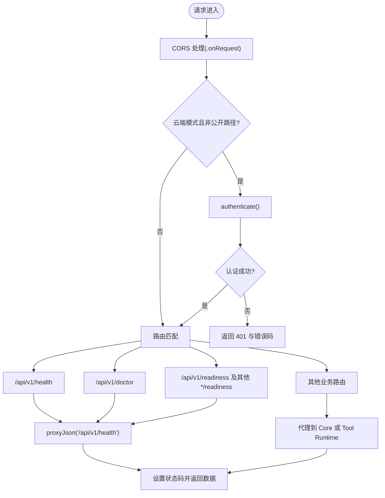

**图表来源**
- [index.ts:107-188](file://TinadecGateway/src/index.ts#L107-L188)
- [auth.ts:46-112](file://TinadecGateway/src/auth.ts#L46-L112)
- [coreClient.ts:38-101](file://TinadecGateway/src/coreClient.ts#L38-L101)

**章节来源**
- [index.ts:107-188](file://TinadecGateway/src/index.ts#L107-L188)
- [auth.ts:29-39](file://TinadecGateway/src/auth.ts#L29-L39)

### 健康检查、诊断与就绪状态检查
- /api/v1/health：代理到 Core 的健康端点，合并网关状态（gateway: ok, mode, core_url, tool_runtime_url）。
- /api/v1/doctor：直接透传 Core 的诊断数据。
- /api/v1/readiness 与多个 *readiness：分别代理 Core 的不同就绪检查，用于编排与调度。

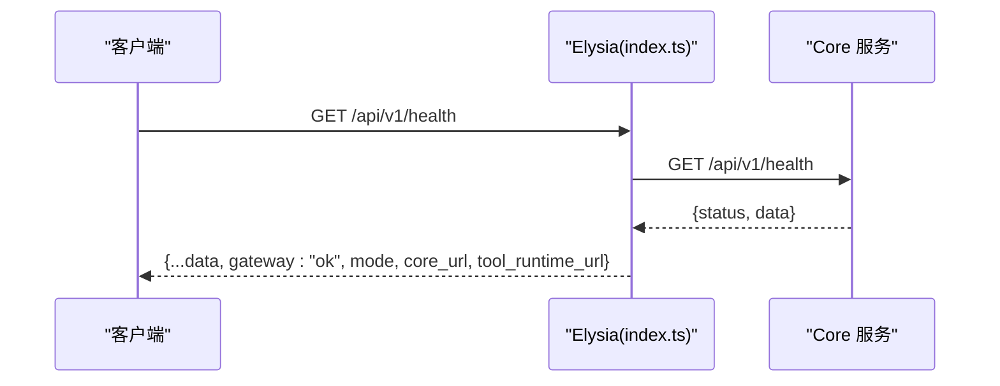

**图表来源**
- [index.ts:157-188](file://TinadecGateway/src/index.ts#L157-L188)
- [coreClient.ts:38-101](file://TinadecGateway/src/coreClient.ts#L38-L101)

**章节来源**
- [index.ts:157-188](file://TinadecGateway/src/index.ts#L157-L188)

### 配置管理系统（本地/云端模式）
- 环境变量：TINADEC_GATEWAY_MODE、TINADEC_GATEWAY_PORT、TINADEC_CORE_URL、TINADEC_TOOL_RUNTIME_URL、TINADEC_GATEWAY_AUTH_REQUIRED、TINADEC_GATEWAY_JWT_SECRET、TINADEC_GATEWAY_API_KEY、TINADEC_GATEWAY_CORS_ORIGINS、TINADEC_GATEWAY_TIMEOUT_MS。
- 本地模式：监听 127.0.0.1，无认证，无租户上下文，单实例。
- 云端模式：监听 0.0.0.0，支持 API Key/JWT 认证、租户上下文、反向代理头信任、横向扩展。

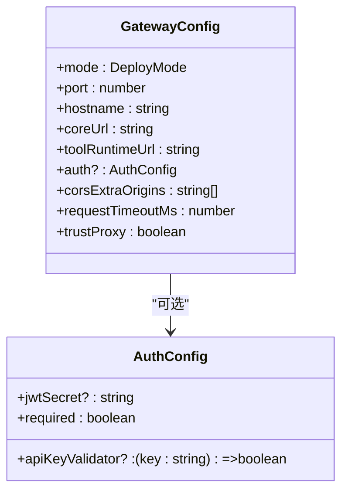

**图表来源**
- [config.ts:20-48](file://TinadecGateway/src/config.ts#L20-L48)
- [config.ts:65-115](file://TinadecGateway/src/config.ts#L65-L115)

**章节来源**
- [config.ts:65-115](file://TinadecGateway/src/config.ts#L65-L115)

### 认证与租户上下文
- 支持 API Key（x-api-key）与 Bearer Token（JWT HS256）。
- 云端模式可强制认证；非必须时允许匿名访问但注入租户 ID。
- 认证成功后将 tenant_id/user_id 注入下游请求头（buildForwardHeaders）。

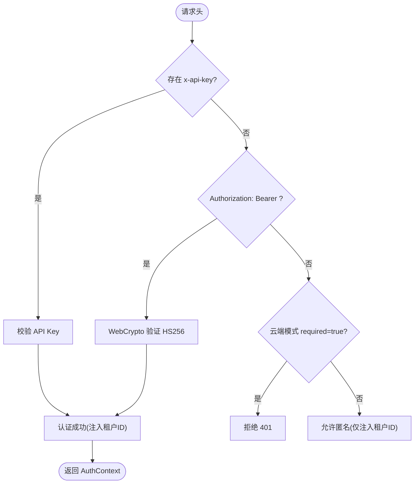

**图表来源**
- [auth.ts:46-112](file://TinadecGateway/src/auth.ts#L46-L112)
- [auth.ts:227-254](file://TinadecGateway/src/auth.ts#L227-L254)

**章节来源**
- [auth.ts:46-112](file://TinadecGateway/src/auth.ts#L46-L112)
- [auth.ts:227-254](file://TinadecGateway/src/auth.ts#L227-L254)

### 请求生命周期与错误处理
- 生命周期：CORS → 认证 → 路由匹配 → 代理到 Core/Tool Runtime → 设置状态码与响应头 → 返回。
- 错误处理：
  - Core/Tool Runtime 不可达或非 JSON 响应：返回 502 与标准化错误码（CORE_UNREACHABLE/CORE_INVALID_RESPONSE、TOOL_RUNTIME_UNREACHABLE/TOOL_RUNTIME_INVALID_RESPONSE）。
  - 认证失败：返回 401 与错误码（AUTH_INVALID_API_KEY/AUTH_INVALID_TOKEN/AUTH_REQUIRED）。
  - 代码工具未找到：返回 404 与 CODE_TOOL_NOT_FOUND。
  - 审批拒绝：返回 403 与 APPROVAL_DENIED。
  - 高风险操作需二次确认：返回 449 与 CONFIRMATION_REQUIRED。

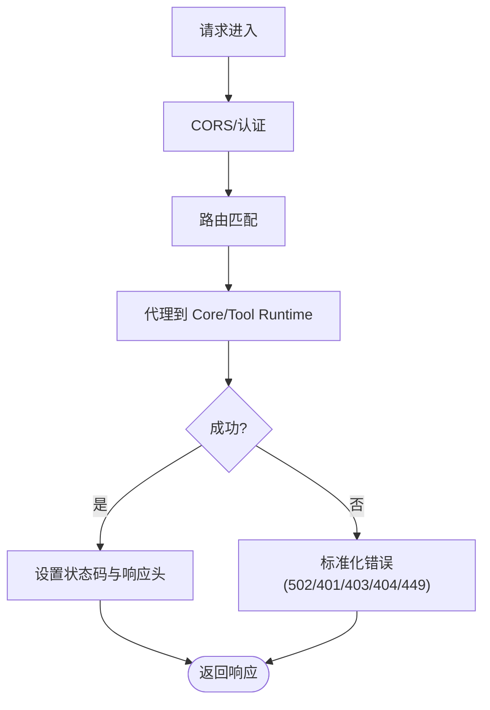

**图表来源**
- [coreClient.ts:38-87](file://TinadecGateway/src/coreClient.ts#L38-L87)
- [toolRuntimeClient.ts:44-97](file://TinadecGateway/src/toolRuntimeClient.ts#L44-L97)
- [index.ts:141-154](file://TinadecGateway/src/index.ts#L141-L154)
- [index.ts:351-400](file://TinadecGateway/src/index.ts#L351-L400)
- [approval.ts:203-224](file://TinadecGateway/src/approval.ts#L203-L224)

**章节来源**
- [coreClient.ts:38-87](file://TinadecGateway/src/coreClient.ts#L38-L87)
- [toolRuntimeClient.ts:44-97](file://TinadecGateway/src/toolRuntimeClient.ts#L44-L97)
- [index.ts:141-154](file://TinadecGateway/src/index.ts#L141-L154)
- [index.ts:351-400](file://TinadecGateway/src/index.ts#L351-L400)
- [approval.ts:203-224](file://TinadecGateway/src/approval.ts#L203-L224)

### 流式与 WebSocket 代理
- 流式：proxyStream 透传 body 流，setStreamHeaders 设置 no-cache、keep-alive、禁用加速缓冲。
- WebSocket：WS_ROUTES 定义映射（终端 PTY→Tool Runtime，调试/协作→Core），createWsProxyHandlers 双向透传消息。

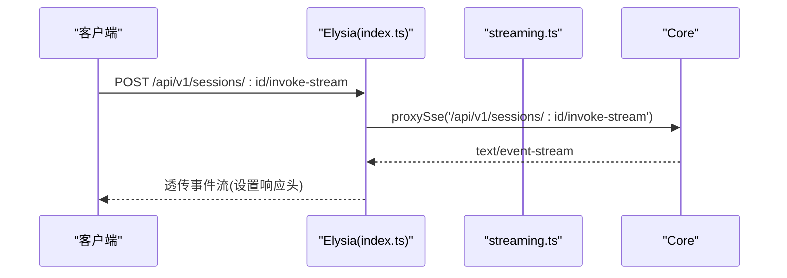

**图表来源**
- [index.ts:232-243](file://TinadecGateway/src/index.ts#L232-L243)
- [coreClient.ts:93-101](file://TinadecGateway/src/coreClient.ts#L93-L101)
- [streaming.ts:25-54](file://TinadecGateway/src/streaming.ts#L25-L54)

**章节来源**
- [streaming.ts:25-54](file://TinadecGateway/src/streaming.ts#L25-L54)
- [websocket.ts:51-74](file://TinadecGateway/src/websocket.ts#L51-L74)

### BFF 层：Model/Agent Center 聚合
- 聚合 Core 的模板、提供者、路由、就绪状态与 ACP 适配器，输出统一的概览与诊断信息。
- 支持 Agent 运行时绑定写入（当前返回不支持提示）与模型发现刷新（当前返回不支持提示）。

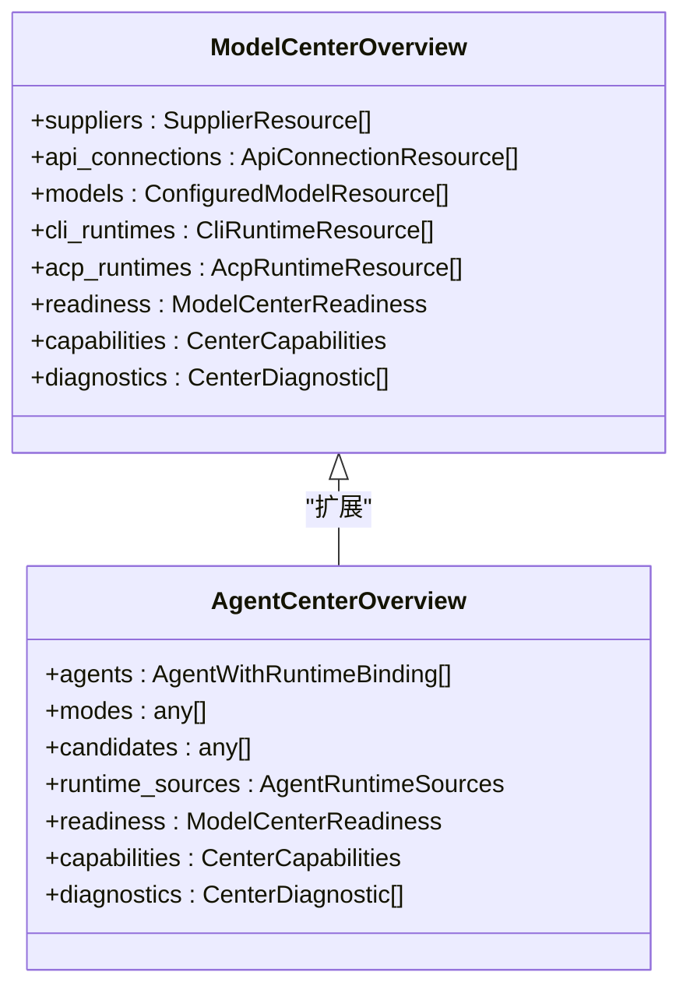

**图表来源**
- [modelAgentCenter.ts:129-138](file://TinadecGateway/src/modelAgentCenter.ts#L129-L138)
- [modelAgentCenter.ts:185-193](file://TinadecGateway/src/modelAgentCenter.ts#L185-L193)

**章节来源**
- [modelAgentCenter.ts:517-535](file://TinadecGateway/src/modelAgentCenter.ts#L517-L535)

### Code Tools 与审批门
- 工具规格：listCodeToolIds/listCodeToolSpecs 暴露工具元数据与是否需审批。
- 审批门：verifyCodeToolApproval 从 Core 获取审批快照并校验状态、类型与工作目录一致性。
- 人类操作拦截：approval.ts 评估风险等级，高风险需 confirmation=true，否则返回 449 要求二次确认。
- 执行代理：executeCodeToolViaRuntime 将请求转发到 Tool Runtime 的 /api/v1/tools/:toolId/execute。

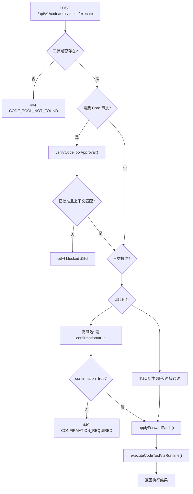

**图表来源**
- [index.ts:351-400](file://TinadecGateway/src/index.ts#L351-L400)
- [codeTools.ts:350-420](file://TinadecGateway/src/codeTools.ts#L350-L420)
- [approval.ts:145-197](file://TinadecGateway/src/approval.ts#L145-L197)
- [approval.ts:203-224](file://TinadecGateway/src/approval.ts#L203-L224)
- [codeTools.ts:439-462](file://TinadecGateway/src/codeTools.ts#L439-L462)

**章节来源**
- [codeTools.ts:335-348](file://TinadecGateway/src/codeTools.ts#L335-L348)
- [codeTools.ts:350-420](file://TinadecGateway/src/codeTools.ts#L350-L420)
- [approval.ts:145-197](file://TinadecGateway/src/approval.ts#L145-L197)
- [approval.ts:203-224](file://TinadecGateway/src/approval.ts#L203-L224)
- [codeTools.ts:439-462](file://TinadecGateway/src/codeTools.ts#L439-L462)

## 依赖关系分析
- index.ts 依赖 config.ts、auth.ts、coreClient.ts、toolRuntimeClient.ts、streaming.ts、websocket.ts、modelAgentCenter.ts、codeTools.ts、approval.ts。
- coreClient.ts 与 toolRuntimeClient.ts 依赖 config.ts。
- streaming.ts 依赖 coreClient.ts 与 toolRuntimeClient.ts。
- websocket.ts 依赖 config.ts、coreClient.ts、toolRuntimeClient.ts。
- modelAgentCenter.ts 依赖 coreClient.ts。
- codeTools.ts 依赖 toolRuntimeClient.ts。
- approval.ts 独立逻辑，被 index.ts 与 codeTools.ts 使用。

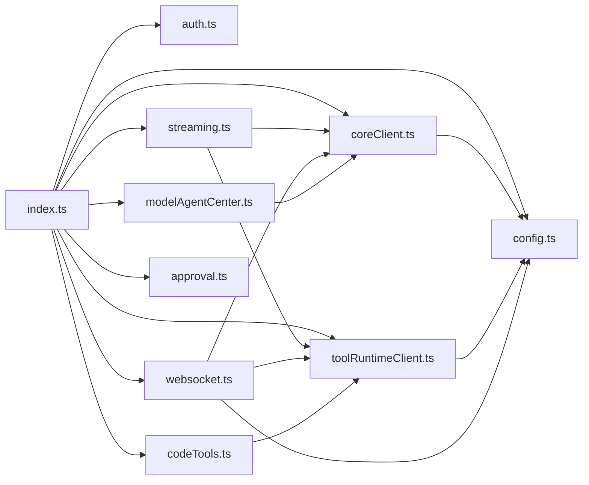

**图表来源**
- [index.ts:23-58](file://TinadecGateway/src/index.ts#L23-L58)
- [coreClient.ts:7](file://TinadecGateway/src/coreClient.ts#L7)
- [toolRuntimeClient.ts:13](file://TinadecGateway/src/toolRuntimeClient.ts#L13)
- [streaming.ts:8-9](file://TinadecGateway/src/streaming.ts#L8-L9)
- [websocket.ts:15-17](file://TinadecGateway/src/websocket.ts#L15-L17)
- [modelAgentCenter.ts:1](file://TinadecGateway/src/modelAgentCenter.ts#L1)
- [codeTools.ts:12](file://TinadecGateway/src/codeTools.ts#L12)

**章节来源**
- [index.ts:23-58](file://TinadecGateway/src/index.ts#L23-L58)

## 性能考量
- 流式传输：避免缓冲，直接透传 body 流，减少内存占用与延迟。
- 连接复用：keep-alive 与 no-cache 确保长连接与实时性。
- 代理错误快速失败：网络异常与非 JSON 响应立即返回 502，避免长时间等待。
- 认证开销最小化：本地模式跳过认证；云端模式仅在必要时解析 JWT。
- 路由匹配与中间件顺序：CORS 与认证前置，减少无效请求处理。
- 环境超时：可通过 TINADEC_GATEWAY_TIMEOUT_MS 调整，平衡稳定性与用户体验。

[本节为通用指导，无需具体文件引用]

## 故障排查指南
- 健康检查失败：
  - 检查 Core URL 可达性与响应格式（JSON）。
  - 查看 502 错误码 CORE_UNREACHABLE/CORE_INVALID_RESPONSE。
- 认证失败：
  - 检查 Authorization 头与 x-api-key 是否正确。
  - 云端模式 required=true 时，缺失认证将返回 AUTH_REQUIRED。
- 代码工具执行失败：
  - 确认工具 ID 存在（CODE_TOOL_NOT_FOUND）。
  - 若需审批，检查 Core 审批快照与上下文匹配（blocked/unverified/wrong-kind）。
  - 高风险操作需二次确认（CONFIRMATION_REQUIRED）。
- 流式与 WebSocket：
  - 检查响应头 content-type、cache-control、connection、x-accel-buffering。
  - 确认 WS_ROUTES 映射正确，目标服务可用。

**章节来源**
- [coreClient.ts:56-87](file://TinadecGateway/src/coreClient.ts#L56-L87)
- [toolRuntimeClient.ts:66-97](file://TinadecGateway/src/toolRuntimeClient.ts#L66-L97)
- [index.ts:141-154](file://TinadecGateway/src/index.ts#L141-L154)
- [index.ts:351-400](file://TinadecGateway/src/index.ts#L351-L400)
- [approval.ts:203-224](file://TinadecGateway/src/approval.ts#L203-L224)

## 结论
Gateway 以 Elysia 为核心，构建了健壮的 BFF 层：统一的认证与 CORS、灵活的配置模式、完善的健康/诊断/就绪检查、高效的流式与 WebSocket 代理、严格的审批门与错误处理。该设计既满足本地开发便捷性，又具备云端部署的可扩展性与安全性。对于初学者，理解 BFF 的概念与中间件管道是关键；对于有经验者，关注流式代理、认证开销与错误快速失败等性能优化点。

[本节为总结，无需具体文件引用]

## 附录
- 环境变量参考：
  - TINADEC_GATEWAY_MODE：local/cloud
  - TINADEC_GATEWAY_PORT：端口号
  - TINADEC_CORE_URL：Core 服务地址
  - TINADEC_TOOL_RUNTIME_URL：Tool Runtime 服务地址
  - TINADEC_GATEWAY_AUTH_REQUIRED：是否强制认证
  - TINADEC_GATEWAY_JWT_SECRET：JWT 密钥
  - TINADEC_GATEWAY_API_KEY：API Key
  - TINADEC_GATEWAY_CORS_ORIGINS：额外允许的源
  - TINADEC_GATEWAY_TIMEOUT_MS：请求超时毫秒数

[本节为补充信息，无需具体文件引用]