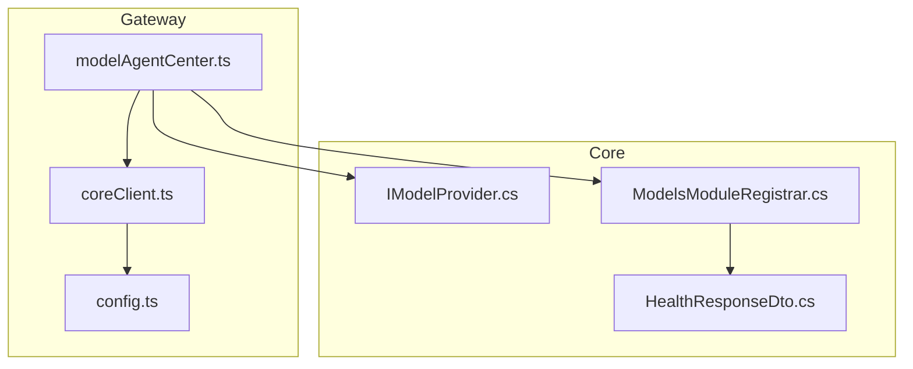
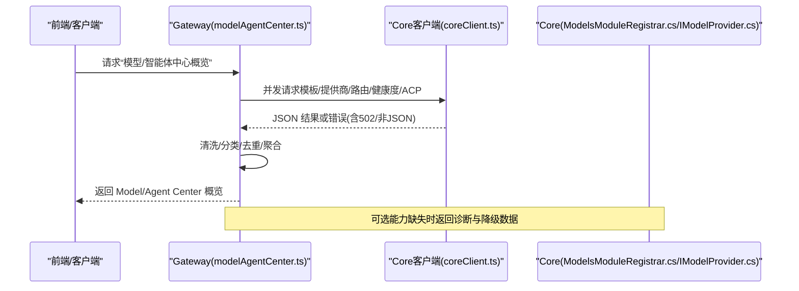
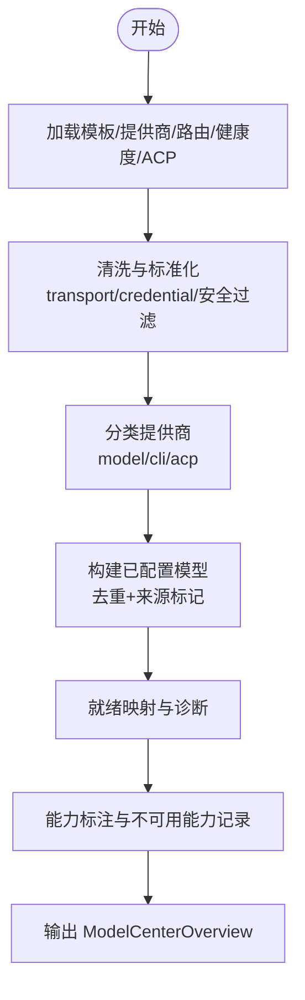
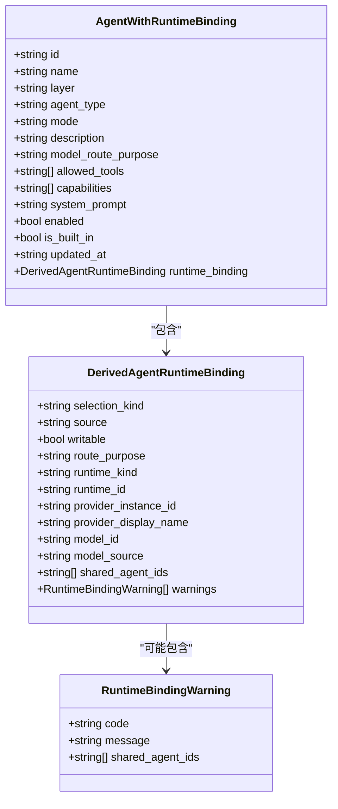
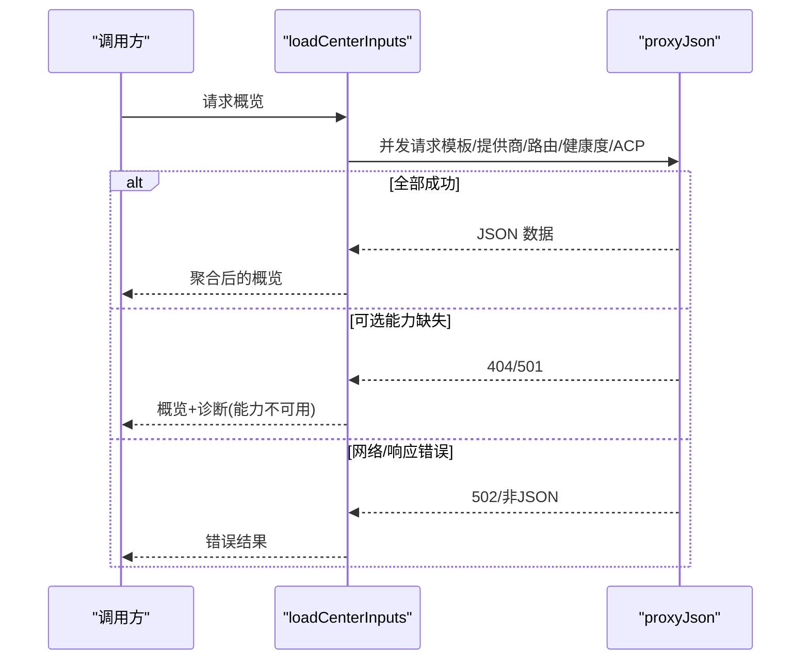
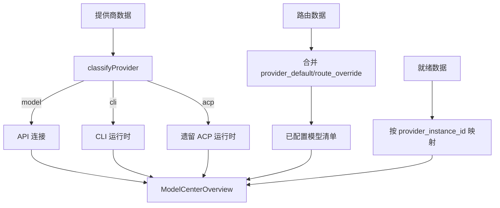
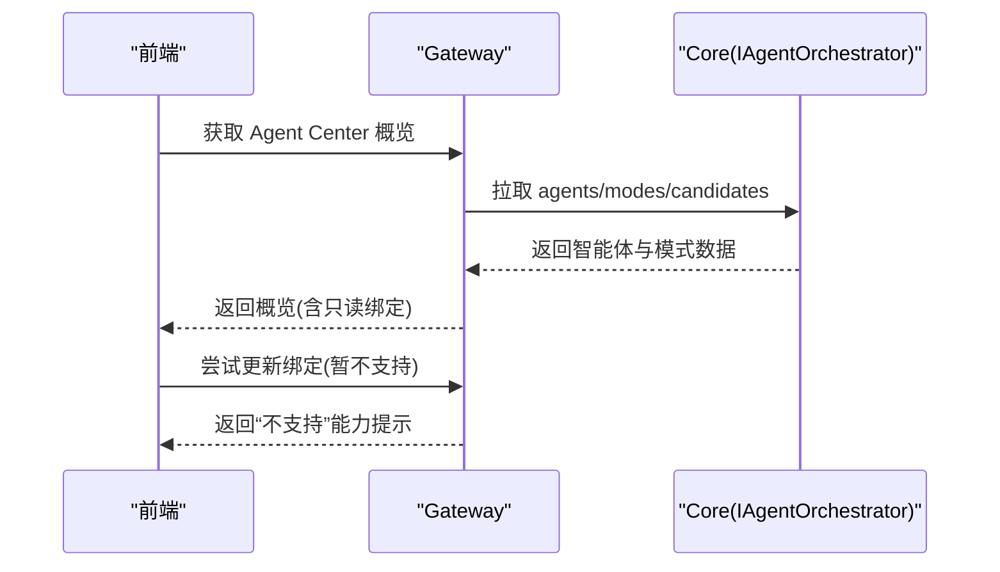
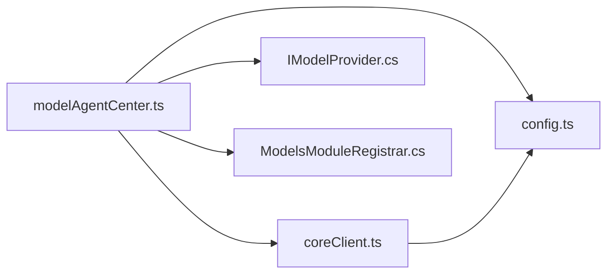

# 模型与智能体中心

<cite>
**本文引用的文件**   
- [modelAgentCenter.ts](file://TinadecGateway/src/modelAgentCenter.ts)
- [coreClient.ts](file://TinadecGateway/src/coreClient.ts)
- [config.ts](file://TinadecGateway/src/config.ts)
- [IModelProvider.cs](file://TinadecCore/Abstractions/Ports/IModelProvider.cs)
- [ModelsModuleRegistrar.cs](file://TinadecCore/Models/ModelsModuleRegistrar.cs)
- [HealthResponseDto.cs](file://TinadecCore/Contracts/Dtos/HealthResponseDto.cs)
- [modelAgentCenter.test.ts](file://TinadecGateway/src/modelAgentCenter.test.ts)
</cite>

## 目录
1. [简介](#简介)
2. [项目结构](#项目结构)
3. [核心组件](#核心组件)
4. [架构总览](#架构总览)
5. [详细组件分析](#详细组件分析)
6. [依赖关系分析](#依赖关系分析)
7. [性能考虑](#性能考虑)
8. [故障排查指南](#故障排查指南)
9. [结论](#结论)
10. [附录](#附录)

## 简介
本文件面向 Gateway 网关的“模型与智能体中心”模块，系统性阐述 Model Center（模型中心）与 Agent Center（智能体中心）的聚合视图设计、数据缓存策略、实时更新机制；深入说明模型提供商管理、路由配置、负载均衡；解释智能体生命周期管理、模式切换、运行时绑定；并给出中心概览数据的聚合计算、性能指标收集与健康状态监控的实现要点。文档同时提供配置管理示例与自定义提供商开发指南，既适合初学者理解中心化管理概念，也满足有经验的开发者对实现细节与扩展开发的需求。

## 项目结构
- Gateway 侧（TypeScript）：
  - modelAgentCenter.ts：负责从 Core 拉取模板、提供商、路由、健康度、ACP 适配器等数据，进行清洗、分类、去重与聚合，输出 Model Center 与 Agent Center 的概览视图。
  - coreClient.ts：封装到 Core 的 HTTP/SSE/流式代理能力，统一错误码与响应格式。
  - config.ts：Gateway 运行配置（本地/云端模式、端口、认证、CORS、超时等）。
- Core 侧（C#）：
  - IModelProvider.cs：模型提供商抽象接口，定义获取 ChatClient 与就绪检查能力。
  - ModelsModuleRegistrar.cs：模型模块注册器，包含骨架 Provider 与 EmbeddingProvider 实现，展示路由解析、密钥读取、OpenAI 兼容调用流程。
  - HealthResponseDto.cs：健康检查 DTO，用于服务级健康探测。

**图表来源** 
- [modelAgentCenter.ts:1-120](file://TinadecGateway/src/modelAgentCenter.ts#L1-L120)
- [coreClient.ts:1-110](file://TinadecGateway/src/coreClient.ts#L1-L110)
- [config.ts:1-115](file://TinadecGateway/src/config.ts#L1-L115)
- [IModelProvider.cs:1-51](file://TinadecCore/Abstractions/Ports/IModelProvider.cs#L1-L51)
- [ModelsModuleRegistrar.cs:1-168](file://TinadecCore/Models/ModelsModuleRegistrar.cs#L1-L168)
- [HealthResponseDto.cs:1-13](file://TinadecCore/Contracts/Dtos/HealthResponseDto.cs#L1-L13)

**章节来源**
- [modelAgentCenter.ts:1-120](file://TinadecGateway/src/modelAgentCenter.ts#L1-L120)
- [coreClient.ts:1-110](file://TinadecGateway/src/coreClient.ts#L1-L110)
- [config.ts:1-115](file://TinadecGateway/src/config.ts#L1-L115)
- [IModelProvider.cs:1-51](file://TinadecCore/Abstractions/Ports/IModelProvider.cs#L1-L51)
- [ModelsModuleRegistrar.cs:1-168](file://TinadecCore/Models/ModelsModuleRegistrar.cs#L1-L168)
- [HealthResponseDto.cs:1-13](file://TinadecCore/Contracts/Dtos/HealthResponseDto.cs#L1-L13)

## 核心组件
- 聚合入口与视图
  - aggregateModelCenter / loadModelCenterOverview：生成 Model Center 概览（供应商、API 连接、已配置模型、CLI/ACP 运行时、就绪状态、能力、诊断）。
  - aggregateAgentCenter / loadAgentCenterOverview：在 Model Center 基础上叠加智能体列表、模式、候选项，并推导只读继承绑定。
- 数据加载与容错
  - loadCenterInputs：并发拉取模板、提供商、路由、可选的健康度与 ACP 适配器；对 404/501 等可选能力缺失进行降级处理，返回诊断信息。
- 数据清洗与安全
  - sanitizeRecord/sanitizeUnknown：过滤敏感键（如 api_key、secret 等），避免泄露。
  - normalizeTransportKind/normalizeCredentialKind：标准化传输类型与凭据类型。
- 分类与映射
  - classifyProvider：根据 capabilities/connection_kind 将提供商归类为 model/cli/acp。
  - buildConfiguredModels：基于 provider_default 与 route_override 去重合并，生成“已配置模型”清单。
- 智能体绑定推导
  - 基于 model_route_purpose 与 routes 推导 runtime_binding，标记共享路由警告与只读继承。

**章节来源**
- [modelAgentCenter.ts:368-459](file://TinadecGateway/src/modelAgentCenter.ts#L368-L459)
- [modelAgentCenter.ts:517-535](file://TinadecGateway/src/modelAgentCenter.ts#L517-L535)
- [modelAgentCenter.ts:807-880](file://TinadecGateway/src/modelAgentCenter.ts#L807-L880)
- [modelAgentCenter.ts:1008-1028](file://TinadecGateway/src/modelAgentCenter.ts#L1008-L1028)
- [modelAgentCenter.ts:752-757](file://TinadecGateway/src/modelAgentCenter.ts#L752-L757)
- [modelAgentCenter.ts:690-750](file://TinadecGateway/src/modelAgentCenter.ts#L690-L750)

## 架构总览
Gateway 通过 coreClient 向 Core 发起多路并行请求，获取模板、提供商、路由、健康度、ACP 适配器等数据，并在内存中完成清洗、分类、去重与聚合，最终输出 Model Center 与 Agent Center 的只读概览。Core 侧暴露 IModelProvider 抽象，当前模块以骨架 Provider 与 EmbeddingProvider 演示路由解析、密钥读取与 OpenAI 兼容调用。

**图表来源** 
- [modelAgentCenter.ts:807-880](file://TinadecGateway/src/modelAgentCenter.ts#L807-L880)
- [coreClient.ts:38-87](file://TinadecGateway/src/coreClient.ts#L38-L87)
- [ModelsModuleRegistrar.cs:43-62](file://TinadecCore/Models/ModelsModuleRegistrar.cs#L43-L62)
- [IModelProvider.cs:10-18](file://TinadecCore/Abstractions/Ports/IModelProvider.cs#L10-L18)

## 详细组件分析

### Model Center 聚合视图
- 输入：模板、提供商、路由、可选的健康度与 ACP 适配器、不可用能力列表。
- 处理：
  - 模板→供应商资源（标准化 transport/credential 类型）。
  - 提供商→API 连接/CLI 运行时/遗留 ACP 运行时（按 classifyProvider 分类）。
  - 路由→用途集合与模型覆盖来源（provider_default/route_override）。
  - 健康度→按 provider_instance_id 建立就绪映射。
  - 能力→标注 model_catalog_mode、discovery_refresh、agent_runtime_binding_write 等。
- 输出：ModelCenterOverview（供应商、API 连接、已配置模型、CLI/ACP 运行时、就绪、能力、诊断）。

**图表来源** 
- [modelAgentCenter.ts:537-688](file://TinadecGateway/src/modelAgentCenter.ts#L537-L688)
- [modelAgentCenter.ts:690-750](file://TinadecGateway/src/modelAgentCenter.ts#L690-L750)
- [modelAgentCenter.ts:882-890](file://TinadecGateway/src/modelAgentCenter.ts#L882-L890)

**章节来源**
- [modelAgentCenter.ts:537-688](file://TinadecGateway/src/modelAgentCenter.ts#L537-L688)
- [modelAgentCenter.ts:690-750](file://TinadecGateway/src/modelAgentCenter.ts#L690-L750)
- [modelAgentCenter.ts:882-890](file://TinadecGateway/src/modelAgentCenter.ts#L882-L890)

### Agent Center 聚合视图与绑定推导
- 输入：Model Center 输入 + agents/modes/candidates。
- 处理：
  - 将 agents 映射为带 runtime_binding 的结构，依据 model_route_purpose 查找对应 route/provider。
  - 若同一 purpose 被多个 agent 共享，则标记只读继承与警告。
  - 合并 runtime_sources（providers/models/cli_runtimes/acp_runtimes）。
- 输出：AgentCenterOverview（agents、modes、candidates、runtime_sources、就绪、能力、诊断）。

**图表来源** 
- [modelAgentCenter.ts:146-193](file://TinadecGateway/src/modelAgentCenter.ts#L146-L193)
- [modelAgentCenter.ts:399-459](file://TinadecGateway/src/modelAgentCenter.ts#L399-L459)

**章节来源**
- [modelAgentCenter.ts:372-459](file://TinadecGateway/src/modelAgentCenter.ts#L372-L459)
- [modelAgentCenter.ts:146-193](file://TinadecGateway/src/modelAgentCenter.ts#L146-L193)

### 数据加载与实时性
- 并发拉取：loadCenterInputs 使用 Promise.all 并发请求，提升吞吐。
- 可选能力降级：对 404/501 等状态码视为可选能力不可用，记录诊断并继续聚合剩余数据。
- 错误处理：Core 不可达或非 JSON 响应统一返回 502 与明确错误码。
- 实时性建议：前端可按需轮询或基于 SSE 订阅变更事件（当前实现为按需加载）。

**图表来源** 
- [modelAgentCenter.ts:807-880](file://TinadecGateway/src/modelAgentCenter.ts#L807-L880)
- [coreClient.ts:38-87](file://TinadecGateway/src/coreClient.ts#L38-L87)

**章节来源**
- [modelAgentCenter.ts:807-880](file://TinadecGateway/src/modelAgentCenter.ts#L807-L880)
- [coreClient.ts:38-87](file://TinadecGateway/src/coreClient.ts#L38-L87)

### 模型提供商管理与路由配置
- 提供商分类：classifyProvider 依据 capabilities/connection_kind 判定 model/cli/acp。
- 路由覆盖：buildConfiguredModels 合并 provider_default 与 route_override，去重并记录 route_purposes。
- 健康度：readinessProviders 将 model_readiness.providers 映射为 provider_instance_id → 就绪信息。
- 能力标注：capabilities 字段反映 model_catalog_mode、discovery_refresh、agent_runtime_binding_write 等。

**图表来源** 
- [modelAgentCenter.ts:752-757](file://TinadecGateway/src/modelAgentCenter.ts#L752-L757)
- [modelAgentCenter.ts:690-750](file://TinadecGateway/src/modelAgentCenter.ts#L690-L750)
- [modelAgentCenter.ts:892-900](file://TinadecGateway/src/modelAgentCenter.ts#L892-L900)

**章节来源**
- [modelAgentCenter.ts:752-757](file://TinadecGateway/src/modelAgentCenter.ts#L752-L757)
- [modelAgentCenter.ts:690-750](file://TinadecGateway/src/modelAgentCenter.ts#L690-L750)
- [modelAgentCenter.ts:892-900](file://TinadecGateway/src/modelAgentCenter.ts#L892-L900)

### 智能体生命周期与模式切换
- 生命周期：由 Core 的 IAgentOrchestrator 抽象定义编排能力（规划层与执行层），Gateway 侧通过概览视图呈现智能体元数据与绑定。
- 模式切换：Agent Center 输出 modes/candidates，供前端渲染选择；当前绑定推导为只读继承（legacy_route），未来可扩展为可写绑定。
- 运行时绑定：validateAgentRuntimeBindingInput 校验 selection_kind 与必填字段，当前写入能力未启用（agent_runtime_binding_write=false）。

**图表来源** 
- [modelAgentCenter.ts:206-243](file://TinadecGateway/src/modelAgentCenter.ts#L206-L243)
- [modelAgentCenter.ts:372-459](file://TinadecGateway/src/modelAgentCenter.ts#L372-L459)
- [IAgentOrchestrator.cs:9-24](file://TinadecCore/Abstractions/Ports/IAgentOrchestrator.cs#L9-L24)

**章节来源**
- [modelAgentCenter.ts:206-243](file://TinadecGateway/src/modelAgentCenter.ts#L206-L243)
- [modelAgentCenter.ts:372-459](file://TinadecGateway/src/modelAgentCenter.ts#L372-L459)
- [IAgentOrchestrator.cs:9-24](file://TinadecCore/Abstractions/Ports/IAgentOrchestrator.cs#L9-L24)

### 健康状态监控与性能指标
- 健康检查：Core 暴露 HealthResponseDto，Gateway 可通过 coreClient 访问健康端点（当前概览聚焦模型/智能体就绪）。
- 就绪检查：IModelProvider.CheckReadinessAsync 返回 IsReady/StatusMessage/Warnings；Gateway 汇总至 overview.readiness。
- 性能指标：当前实现未内置指标采集，可在 coreClient 层增加耗时统计与错误率计数，便于 Prometheus/Grafana 集成。

**章节来源**
- [HealthResponseDto.cs:1-13](file://TinadecCore/Contracts/Dtos/HealthResponseDto.cs#L1-L13)
- [IModelProvider.cs:16-18](file://TinadecCore/Abstractions/Ports/IModelProvider.cs#L16-L18)
- [modelAgentCenter.ts:537-688](file://TinadecGateway/src/modelAgentCenter.ts#L537-L688)

## 依赖关系分析
- Gateway 依赖 Core 的 REST/SSE 接口；coreClient 统一封装请求与错误处理。
- modelAgentCenter 依赖 coreClient 与 config（coreUrl、超时等）。
- Core 的 ModelsModuleRegistrar 注册 IModelProvider/IEmbeddingProvider，并提供骨架实现与嵌入生成流程。

**图表来源** 
- [modelAgentCenter.ts:1-120](file://TinadecGateway/src/modelAgentCenter.ts#L1-L120)
- [coreClient.ts:1-110](file://TinadecGateway/src/coreClient.ts#L1-L110)
- [config.ts:1-115](file://TinadecGateway/src/config.ts#L1-L115)
- [IModelProvider.cs:1-51](file://TinadecCore/Abstractions/Ports/IModelProvider.cs#L1-L51)
- [ModelsModuleRegistrar.cs:1-168](file://TinadecCore/Models/ModelsModuleRegistrar.cs#L1-L168)

**章节来源**
- [modelAgentCenter.ts:1-120](file://TinadecGateway/src/modelAgentCenter.ts#L1-L120)
- [coreClient.ts:1-110](file://TinadecGateway/src/coreClient.ts#L1-L110)
- [config.ts:1-115](file://TinadecGateway/src/config.ts#L1-L115)
- [IModelProvider.cs:1-51](file://TinadecCore/Abstractions/Ports/IModelProvider.cs#L1-L51)
- [ModelsModuleRegistrar.cs:1-168](file://TinadecCore/Models/ModelsModuleRegistrar.cs#L1-L168)

## 性能考虑
- 并发请求：loadCenterInputs 使用 Promise.all 并行拉取，降低端到端延迟。
- 数据清洗：sanitizeRecord/sanitizeUnknown 在内存中进行，避免序列化开销；建议在高频路径上复用中间对象。
- 错误快速失败：对 502/非 JSON 立即返回，避免无效聚合。
- 缓存策略：当前为按需加载；可引入短期内存缓存（TTL）与 ETag/Last-Modified 协商，减少重复请求。
- 指标采集：建议在 coreClient 层增加请求耗时、成功率、重试次数等指标，便于观测与告警。

[本节为通用指导，不直接分析具体文件]

## 故障排查指南
- Core 不可达或非 JSON 响应：coreClient 返回 502 与明确错误码，检查 Core 服务地址与网络连通性。
- 可选能力不可用：loadCenterInputs 对 404/501 做降级，查看 diagnostics 中的 CORE_CAPABILITY_UNAVAILABLE 诊断。
- 敏感信息泄露：sanitizeRecord 会过滤敏感键；若仍出现，检查上游数据是否包含非常规敏感字段名。
- 绑定校验失败：validateAgentRuntimeBindingInput 返回 errors；核对 selection_kind 与必填字段。
- 健康检查失败：检查 Core 健康端点与 IModelProvider.CheckReadinessAsync 返回的 StatusMessage/Warnings。

**章节来源**
- [coreClient.ts:38-87](file://TinadecGateway/src/coreClient.ts#L38-L87)
- [modelAgentCenter.ts:882-890](file://TinadecGateway/src/modelAgentCenter.ts#L882-L890)
- [modelAgentCenter.ts:1008-1028](file://TinadecGateway/src/modelAgentCenter.ts#L1008-L1028)
- [modelAgentCenter.ts:461-515](file://TinadecGateway/src/modelAgentCenter.ts#L461-L515)
- [IModelProvider.cs:16-18](file://TinadecCore/Abstractions/Ports/IModelProvider.cs#L16-L18)

## 结论
Model Center 与 Agent Center 通过 Gateway 的聚合视图实现了跨 Core 能力的统一呈现与只读概览。其并发加载、清洗标准化、分类去重与诊断记录构成了稳健的数据管道。当前绑定与发现能力为只读与骨架态，后续可扩展为可写绑定与动态发现。建议在网关层补充缓存与指标采集，以提升性能与可观测性。

[本节为总结，不直接分析具体文件]

## 附录

### 配置管理示例
- 环境变量（Gateway）：
  - TINADEC_GATEWAY_MODE：local/cloud
  - TINADEC_GATEWAY_PORT：监听端口
  - TINADEC_CORE_URL：Core 服务地址
  - TINADEC_TOOL_RUNTIME_URL：工具运行时地址
  - TINADEC_GATEWAY_AUTH_REQUIRED：是否强制认证
  - TINADEC_GATEWAY_JWT_SECRET：JWT 密钥
  - TINADEC_GATEWAY_API_KEY：API Key
  - TINADEC_GATEWAY_CORS_ORIGINS：额外允许的 CORS 来源
  - TINADEC_GATEWAY_TIMEOUT_MS：请求超时毫秒数

**章节来源**
- [config.ts:65-106](file://TinadecGateway/src/config.ts#L65-L106)

### 自定义提供商开发指南（Core 侧）
- 实现 IModelProvider：
  - GetChatClientAsync：根据 routeId 解析路由与提供商配置，返回 IChatClient。
  - CheckReadinessAsync：检查提供商可用性并返回就绪信息。
- 参考 EmbeddingProvider：
  - 解析 embedding 路由与版本，读取内容存储与密钥存储，构造 OpenAI 兼容客户端并调用嵌入接口。
- 注册模块：
  - 在 ModelsModuleRegistrar 中注册 IModelProvider/IEmbeddingProvider，声明能力与依赖。

**章节来源**
- [IModelProvider.cs:10-18](file://TinadecCore/Abstractions/Ports/IModelProvider.cs#L10-L18)
- [ModelsModuleRegistrar.cs:43-62](file://TinadecCore/Models/ModelsModuleRegistrar.cs#L43-L62)
- [ModelsModuleRegistrar.cs:70-159](file://TinadecCore/Models/ModelsModuleRegistrar.cs#L70-L159)

### 测试用例参考
- modelAgentCenter.test.ts 提供了模板/提供商/路由/ACP 适配器的完整样例，验证分类、去重、能力标注与诊断输出。

**章节来源**
- [modelAgentCenter.test.ts:1-200](file://TinadecGateway/src/modelAgentCenter.test.ts#L1-L200)