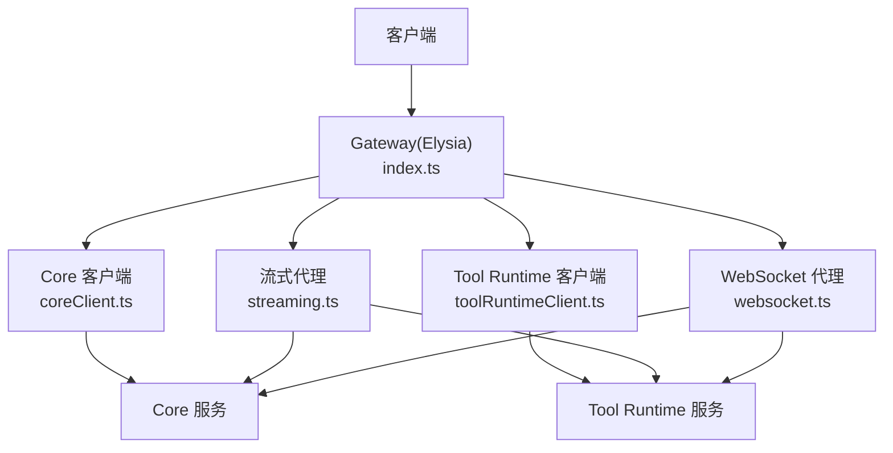
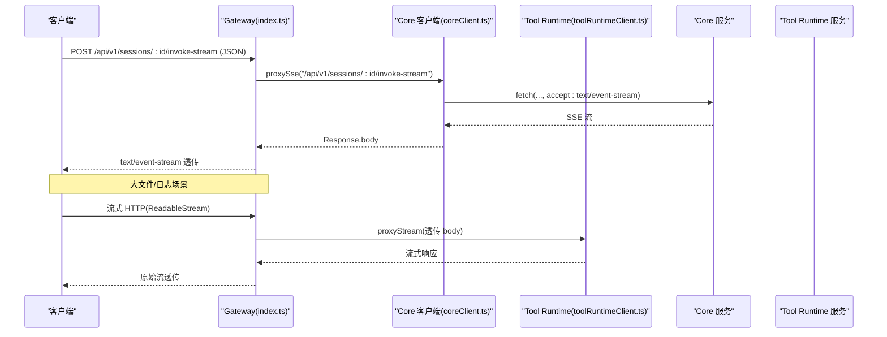
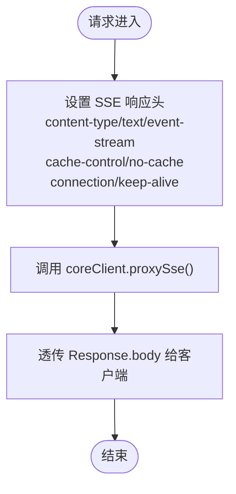
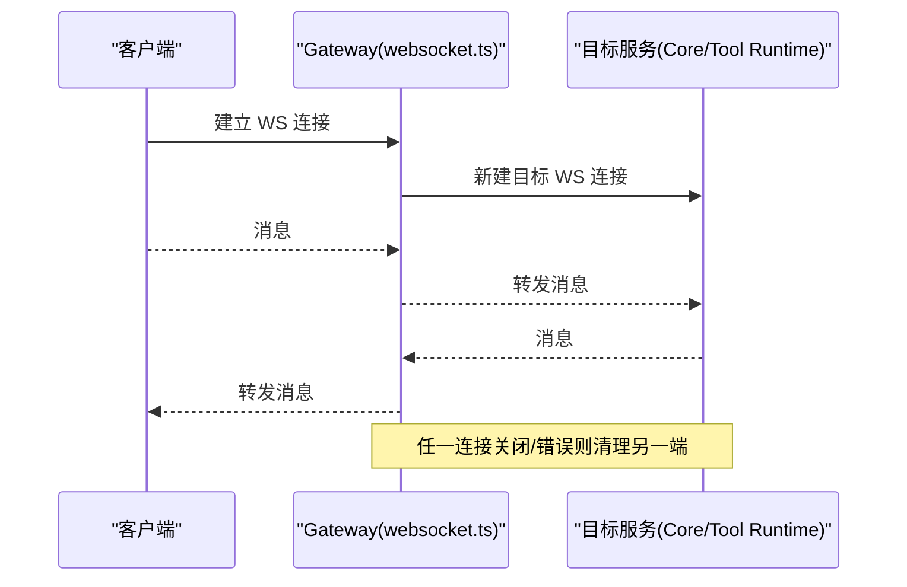
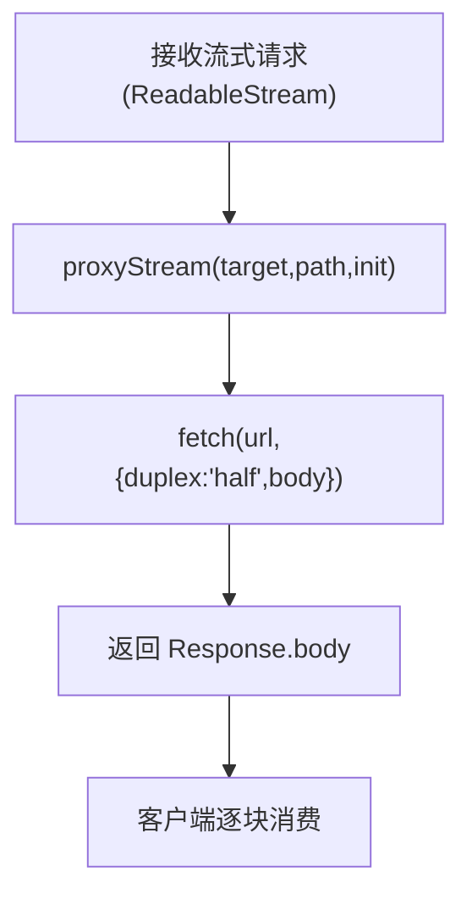
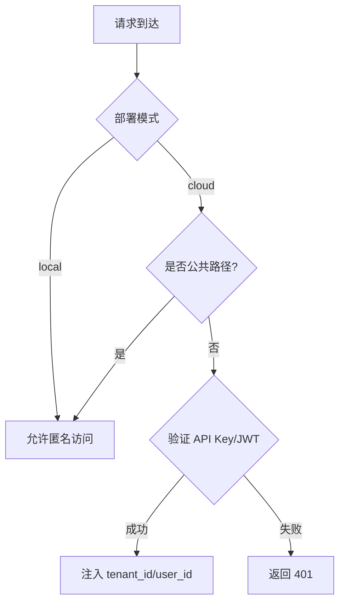
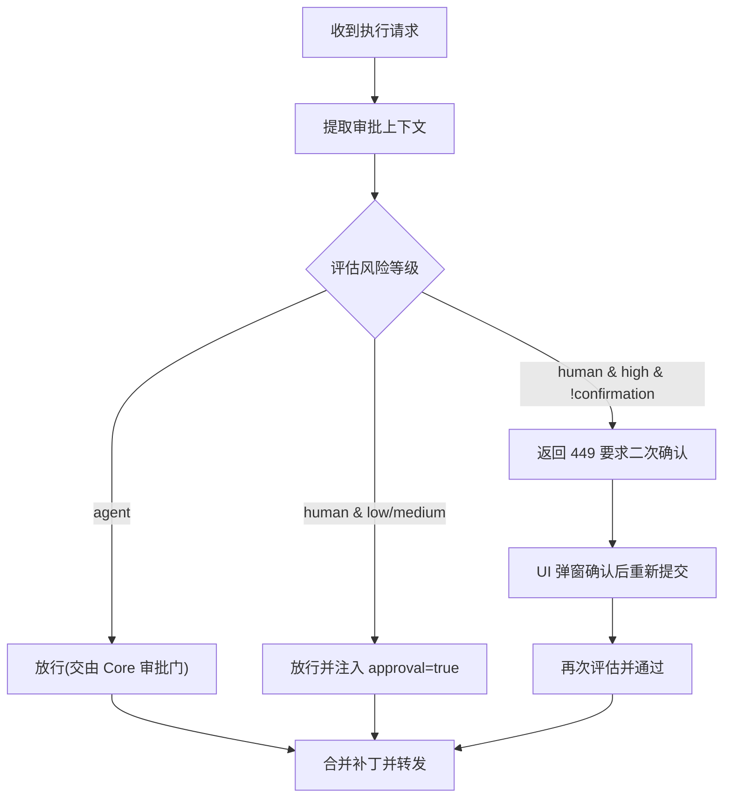
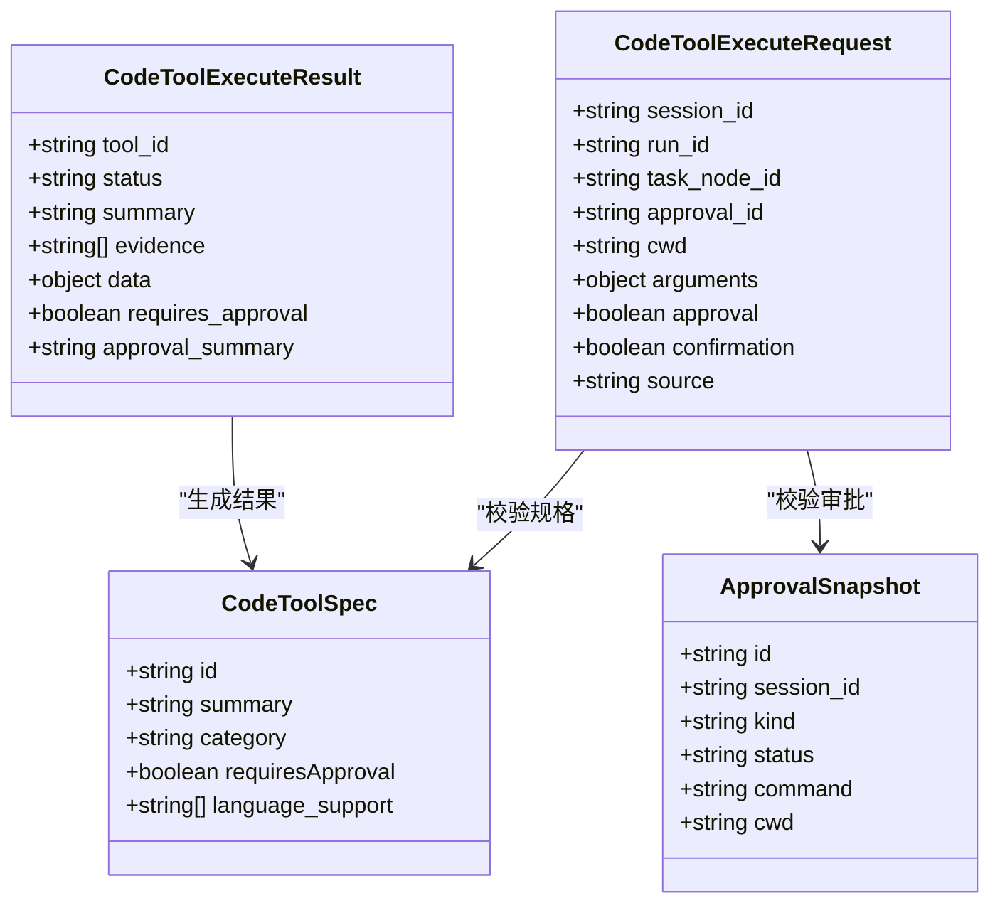
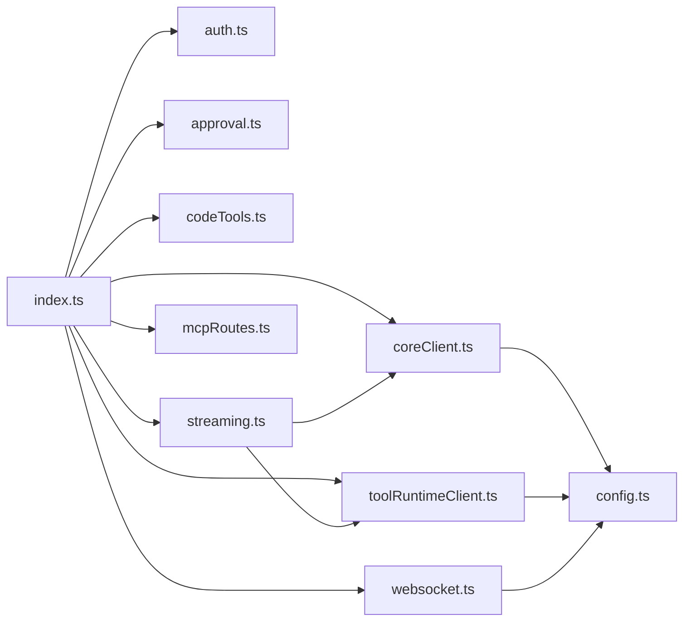

# 流式处理与实时通信

<cite>
**本文引用的文件**
- [index.ts](file://TinadecGateway/src/index.ts)
- [coreClient.ts](file://TinadecGateway/src/coreClient.ts)
- [toolRuntimeClient.ts](file://TinadecGateway/src/toolRuntimeClient.ts)
- [streaming.ts](file://TinadecGateway/src/streaming.ts)
- [websocket.ts](file://TinadecGateway/src/websocket.ts)
- [config.ts](file://TinadecGateway/src/config.ts)
- [auth.ts](file://TinadecGateway/src/auth.ts)
- [approval.ts](file://TinadecGateway/src/approval.ts)
- [codeTools.ts](file://TinadecGateway/src/codeTools.ts)
- [mcpRoutes.ts](file://TinadecGateway/src/mcp/mcpRoutes.ts)
- [package.json](file://TinadecGateway/package.json)
</cite>

## 目录
1. [简介](#简介)
2. [项目结构](#项目结构)
3. [核心组件](#核心组件)
4. [架构总览](#架构总览)
5. [详细组件分析](#详细组件分析)
6. [依赖关系分析](#依赖关系分析)
7. [性能考量](#性能考量)
8. [故障排查指南](#故障排查指南)
9. [结论](#结论)
10. [附录](#附录)

## 简介
本文件聚焦 Gateway 网关的流式处理与实时通信模块，系统性阐述 SSE（Server-Sent Events）实现原理、WebSocket 连接管理、流式数据转发机制。内容覆盖事件流的建立与维护、消息格式转换、背压处理策略，以及大文件传输优化、断线重连机制、消息队列管理。同时解释实时调试支持、终端模拟功能、协作编辑的数据同步，并提供流式 API 使用示例与自定义事件处理器开发指南。面向初学者提供概念说明，为有经验的开发者提供实现细节与性能调优建议。

## 项目结构
Gateway 基于 Elysia（Bun 运行时），采用薄代理模式：鉴权、路由、协议转换、流式转发均集中在入口与客户端封装中，业务执行下沉到 Core 与 Tool Runtime。关键文件职责如下：
- index.ts：Elysia 应用入口，统一路由、SSE/HTTP/WS 协议处理、认证中间件、健康检查等。
- coreClient.ts / toolRuntimeClient.ts：分别封装对 Core 和 Tool Runtime 的 JSON/SSE/流式 HTTP 请求。
- streaming.ts：通用流式 HTTP 代理与响应头设置。
- websocket.ts：WebSocket 反向代理路由与透传处理器。
- config.ts：运行配置（本地/云端）、端口、目标服务地址、认证参数、CORS、超时等。
- auth.ts：认证与租户上下文注入。
- approval.ts：人类操作审批拦截与高风险二次确认。
- codeTools.ts：Code 工具规格、审批校验与 Tool Runtime 代理执行。
- mcpRoutes.ts：MCP 协调端点（纯代理）。

图表来源
- [index.ts:107-243](file://TinadecGateway/src/index.ts#L107-L243)
- [coreClient.ts:38-110](file://TinadecGateway/src/coreClient.ts#L38-L110)
- [toolRuntimeClient.ts:44-126](file://TinadecGateway/src/toolRuntimeClient.ts#L44-L126)
- [streaming.ts:25-54](file://TinadecGateway/src/streaming.ts#L25-L54)
- [websocket.ts:51-140](file://TinadecGateway/src/websocket.ts#L51-L140)

章节来源
- [index.ts:1-800](file://TinadecGateway/src/index.ts#L1-L800)
- [package.json:1-22](file://TinadecGateway/package.json#L1-L22)

## 核心组件
- 流式 HTTP 代理：用于大文件上传/下载与日志流，Gateway 透传请求与响应的 body 流，不做缓冲。
- SSE 代理：将 Core/Tool Runtime 的事件流以 text/event-stream 返回给客户端，保持 keep-alive 与 no-cache。
- WebSocket 代理：将客户端 WS 连接透传到 Core/Tool Runtime，用于终端 PTY、调试器通信、实时协作。
- 认证与租户上下文：云端模式支持 JWT/API Key，注入 x-tenant-id/x-user-id 到下游请求头。
- 审批拦截：人类操作需 approval=true；高风险命令触发二次确认（449 状态码提示 UI 弹窗）。
- Code 工具规范与执行：Gateway 不执行工具，仅做规格发布、审批校验与 Tool Runtime 代理执行。

章节来源
- [streaming.ts:1-54](file://TinadecGateway/src/streaming.ts#L1-L54)
- [coreClient.ts:1-110](file://TinadecGateway/src/coreClient.ts#L1-L110)
- [toolRuntimeClient.ts:1-126](file://TinadecGateway/src/toolRuntimeClient.ts#L1-L126)
- [websocket.ts:1-140](file://TinadecGateway/src/websocket.ts#L1-L140)
- [auth.ts:1-273](file://TinadecGateway/src/auth.ts#L1-L273)
- [approval.ts:1-235](file://TinadecGateway/src/approval.ts#L1-L235)
- [codeTools.ts:1-570](file://TinadecGateway/src/codeTools.ts#L1-L570)

## 架构总览
Gateway 作为 BFF/API 层，承担协议转换与轻量编排，所有实际执行由 Core 与 Tool Runtime 完成。SSE 与 WS 通过 Elysia 路由暴露，JSON 请求通过 client 封装转发，流式 HTTP 直接透传 body。

图表来源
- [index.ts:232-243](file://TinadecGateway/src/index.ts#L232-L243)
- [coreClient.ts:93-110](file://TinadecGateway/src/coreClient.ts#L93-L110)
- [streaming.ts:25-54](file://TinadecGateway/src/streaming.ts#L25-L54)

章节来源
- [index.ts:107-243](file://TinadecGateway/src/index.ts#L107-L243)
- [coreClient.ts:38-110](file://TinadecGateway/src/coreClient.ts#L38-L110)
- [streaming.ts:1-54](file://TinadecGateway/src/streaming.ts#L1-L54)

## 详细组件分析

### SSE 统一事件流
- 入口路由：POST /api/v1/sessions/:sessionId/invoke-stream 与 GET /api/v1/events。
- 行为：设置 content-type=text/event-stream、cache-control=no-cache、connection=keep-alive，并透传后端 SSE body。
- 客户端：浏览器或桌面端以 EventSource 或 fetch + ReadableStream 订阅。

图表来源
- [index.ts:232-243](file://TinadecGateway/src/index.ts#L232-L243)
- [index.ts:279-286](file://TinadecGateway/src/index.ts#L279-L286)
- [coreClient.ts:93-101](file://TinadecGateway/src/coreClient.ts#L93-L101)

章节来源
- [index.ts:232-286](file://TinadecGateway/src/index.ts#L232-L286)
- [coreClient.ts:93-101](file://TinadecGateway/src/coreClient.ts#L93-L101)

### WebSocket 代理（终端、调试、协作）
- 路由映射：/ws/terminal → Tool Runtime；/ws/debug → Core；/ws/collaboration → Core。
- 行为：创建目标 WS 连接，双向透传消息；客户端关闭或错误时清理目标连接。
- 适用场景：PTY 终端、调试器通信、实时协作。

图表来源
- [websocket.ts:51-74](file://TinadecGateway/src/websocket.ts#L51-L74)
- [websocket.ts:93-139](file://TinadecGateway/src/websocket.ts#L93-L139)

章节来源
- [websocket.ts:1-140](file://TinadecGateway/src/websocket.ts#L1-L140)

### 流式 HTTP 代理（大文件与日志）
- 用途：大文件上传/下载、长日志流。
- 行为：使用 duplex half 发送可读流体，透传响应体，设置 x-accel-buffering=no 避免反向代理缓冲。
- 注意：确保上游服务支持流式响应，客户端需按流消费。

图表来源
- [streaming.ts:25-37](file://TinadecGateway/src/streaming.ts#L25-L37)
- [streaming.ts:42-54](file://TinadecGateway/src/streaming.ts#L42-L54)

章节来源
- [streaming.ts:1-54](file://TinadecGateway/src/streaming.ts#L1-L54)

### 认证与租户上下文
- 本地模式：跳过认证。
- 云端模式：支持 API Key 与 JWT（HS256），从 claims 提取用户与租户 ID，注入 x-tenant-id/x-user-id。
- 公共路径：health、docs 等无需认证。

图表来源
- [auth.ts:30-39](file://TinadecGateway/src/auth.ts#L30-L39)
- [auth.ts:46-112](file://TinadecGateway/src/auth.ts#L46-L112)
- [auth.ts:227-254](file://TinadecGateway/src/auth.ts#L227-L254)

章节来源
- [auth.ts:1-273](file://TinadecGateway/src/auth.ts#L1-L273)
- [index.ts:141-154](file://TinadecGateway/src/index.ts#L141-L154)

### 审批拦截与高风险二次确认
- 人类操作需 approval=true；高风险工具或命令需要 confirmation=true。
- 未满足条件返回 449 状态码，携带 warning 信息供 UI 弹窗。
- 通过后合并 forwardPatch 到请求体再转发至 Tool Runtime。

图表来源
- [approval.ts:91-197](file://TinadecGateway/src/approval.ts#L91-L197)
- [approval.ts:203-224](file://TinadecGateway/src/approval.ts#L203-L224)
- [approval.ts:229-235](file://TinadecGateway/src/approval.ts#L229-L235)

章节来源
- [approval.ts:1-235](file://TinadecGateway/src/approval.ts#L1-L235)
- [index.ts:351-400](file://TinadecGateway/src/index.ts#L351-L400)

### Code 工具规格与执行代理
- 规格发布：/api/v1/code/tools 返回工具列表与元数据。
- 执行流程：校验 requiresApproval、Core 审批快照、高风险二次确认，最终代理到 Tool Runtime 执行。
- 结果：包含 status、summary、evidence、data 等字段，便于前端展示与审计。

图表来源
- [codeTools.ts:14-57](file://TinadecGateway/src/codeTools.ts#L14-L57)
- [codeTools.ts:335-348](file://TinadecGateway/src/codeTools.ts#L335-L348)
- [codeTools.ts:439-462](file://TinadecGateway/src/codeTools.ts#L439-L462)

章节来源
- [codeTools.ts:1-570](file://TinadecGateway/src/codeTools.ts#L1-L570)
- [index.ts:324-400](file://TinadecGateway/src/index.ts#L324-L400)

### MCP 协调端点（纯代理）
- 端点：connect/disconnect/status/call 全部代理到 Tool Runtime。
- Gateway 不维护 MCP 连接状态，保持无状态薄代理。

章节来源
- [mcpRoutes.ts:1-66](file://TinadecGateway/src/mcp/mcpRoutes.ts#L1-L66)

## 依赖关系分析
- index.ts 依赖 coreClient.ts、toolRuntimeClient.ts、auth.ts、approval.ts、codeTools.ts、websocket.ts、streaming.ts、mcpRoutes.ts。
- coreClient.ts 与 toolRuntimeClient.ts 依赖 config.ts。
- websocket.ts 依赖 config.ts 与 URL 构建逻辑。
- streaming.ts 依赖 coreClient.ts 与 toolRuntimeClient.ts。

图表来源
- [index.ts:23-58](file://TinadecGateway/src/index.ts#L23-L58)
- [coreClient.ts:7](file://TinadecGateway/src/coreClient.ts#L7)
- [toolRuntimeClient.ts:13](file://TinadecGateway/src/toolRuntimeClient.ts#L13)
- [websocket.ts:15-17](file://TinadecGateway/src/websocket.ts#L15-L17)
- [streaming.ts:8-9](file://TinadecGateway/src/streaming.ts#L8-L9)

章节来源
- [index.ts:1-800](file://TinadecGateway/src/index.ts#L1-L800)
- [config.ts:1-115](file://TinadecGateway/src/config.ts#L1-L115)

## 性能考量
- 流式透传：避免在 Gateway 层缓冲 body，降低内存占用与延迟。
- SSE 头部：no-cache、keep-alive、x-accel-buffering=no 确保实时性与不被反向代理缓存。
- 连接复用：Bun 原生 WebSocket 与 HTTP/1.1 keep-alive 提升吞吐。
- 超时控制：通过 requestTimeoutMs 限制长耗时请求。
- 背压策略：
  - 客户端侧：使用流式读取（EventSource/ReadableStream）逐步消费，避免堆积。
  - 服务端侧：上游服务应支持背压（如 Node/Bun 流），必要时在 Gateway 层增加限速或队列。
- 大文件传输：优先使用流式 HTTP，分块上传/下载，避免一次性加载到内存。
- 断线重连：
  - SSE：客户端实现指数退避重连，保留 last-event-id。
  - WebSocket：自动重连与心跳检测，异常时清理并重试。
- 消息队列：如需解耦，可在 Gateway 与上游之间引入轻量队列（如 Redis Streams），但当前设计为直连代理，按需扩展。

[本节为通用指导，不直接分析具体文件]

## 故障排查指南
- 网络不可达：Core/Tool Runtime 不可达时返回 502，包含错误码与消息。
- 非 JSON 响应：解析失败返回 502，附带响应片段以便定位。
- 认证失败：JWT 无效或过期、API Key 不正确，返回 401。
- 审批拦截：高风险操作未确认返回 449，检查 UI 弹窗与 confirmation 标志。
- 流式中断：检查 SSE 头部、反向代理配置（如 Nginx/Apache）是否启用缓冲或超时。
- WebSocket 断开：检查目标服务 WS 端点可达性、防火墙与负载均衡配置。

章节来源
- [coreClient.ts:38-87](file://TinadecGateway/src/coreClient.ts#L38-L87)
- [toolRuntimeClient.ts:44-97](file://TinadecGateway/src/toolRuntimeClient.ts#L44-L97)
- [auth.ts:46-112](file://TinadecGateway/src/auth.ts#L46-L112)
- [approval.ts:203-224](file://TinadecGateway/src/approval.ts#L203-L224)

## 结论
Gateway 的流式与实时通信模块以薄代理为核心，结合 SSE、WebSocket 与流式 HTTP，实现了高效、可扩展的实时数据传输与交互。通过认证、租户上下文、审批拦截与 Code 工具规范，保障了安全性与可审计性。在生产环境中，建议关注背压、超时、反向代理配置与客户端重连策略，以获得稳定与高性能的实时体验。

[本节为总结，不直接分析具体文件]

## 附录

### 流式 API 使用示例（概念性）
- SSE 订阅：
  - 客户端发起 POST /api/v1/sessions/:sessionId/invoke-stream，设置 content-type=application/json。
  - 服务端返回 text/event-stream，客户端以 EventSource 或 fetch+ReadableStream 消费事件。
- 流式 HTTP：
  - 客户端发送 ReadableStream 作为请求体，服务端透传给上游，客户端逐块消费响应流。
- WebSocket：
  - 客户端连接 /ws/terminal、/ws/debug、/ws/collaboration，双向透传消息。

[本节为概念说明，不直接分析具体文件]

### 自定义事件处理器开发指南（概念性）
- 定义事件类型与载荷结构，确保序列化一致。
- 在 SSE 路由中按事件类型分发处理逻辑。
- 实现背压与错误重试，保证稳定性。
- 记录事件追踪 ID 与时间戳，便于问题定位。

[本节为概念说明，不直接分析具体文件]