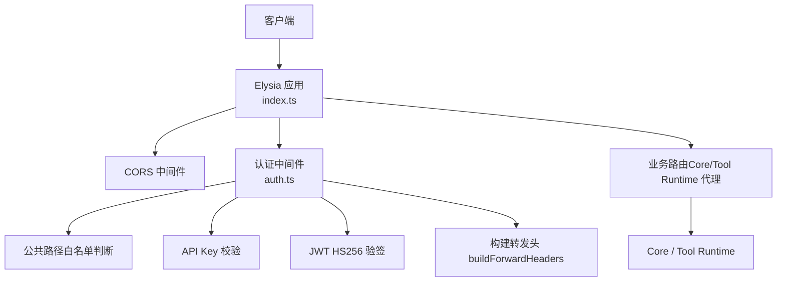
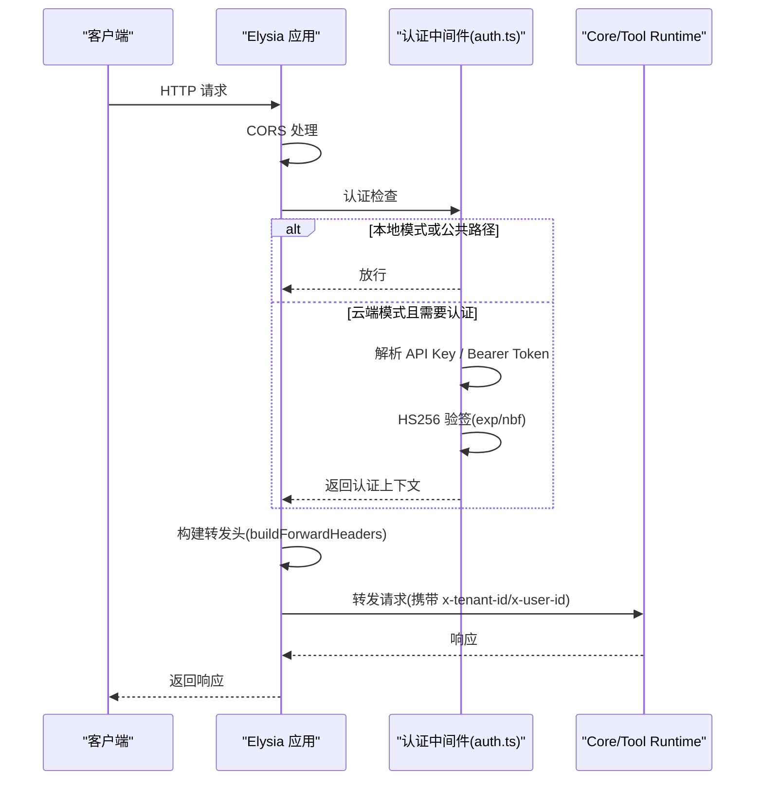
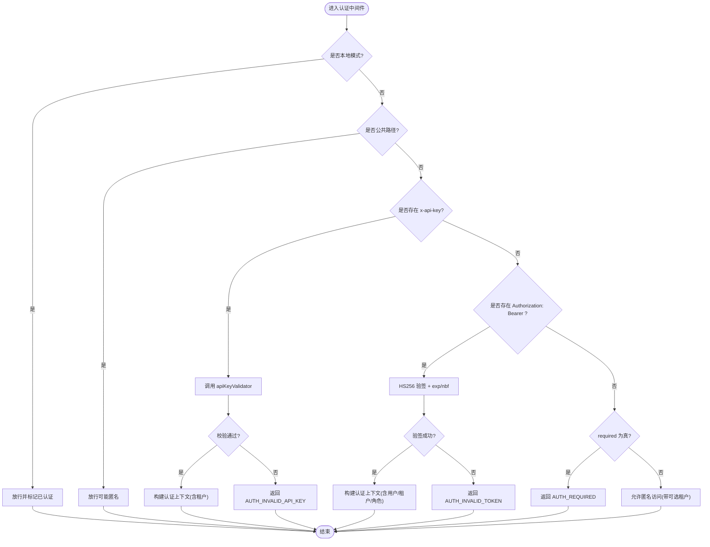
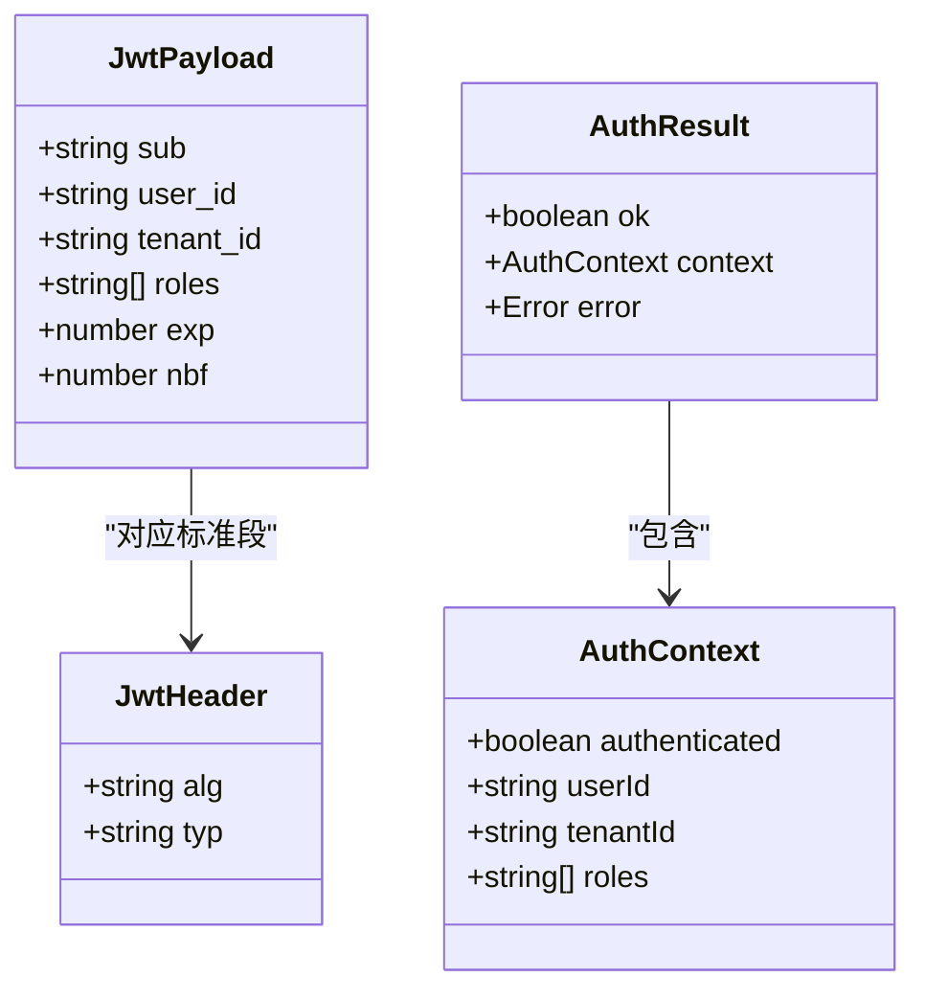
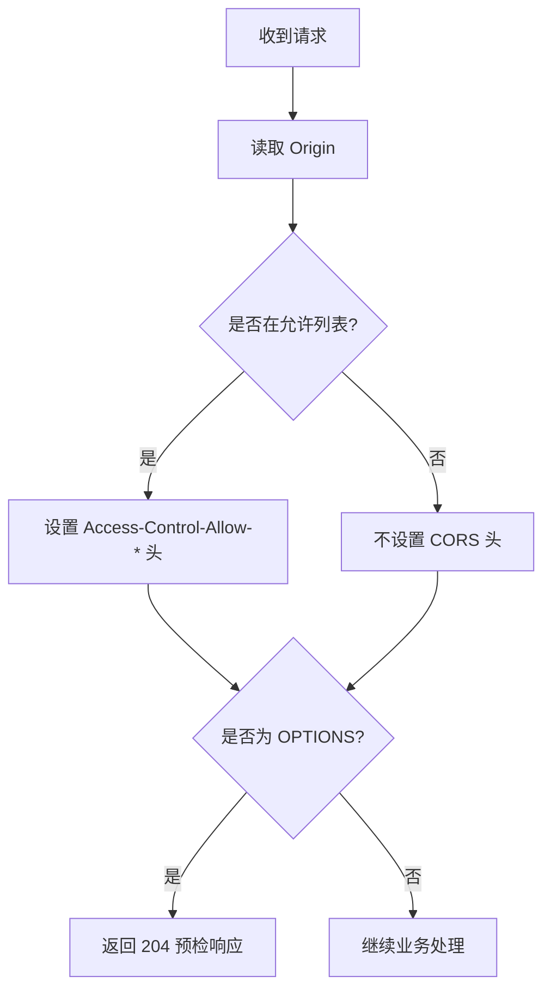
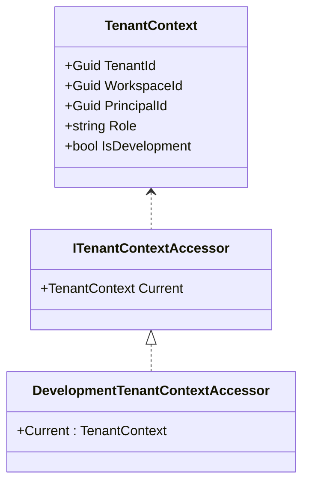
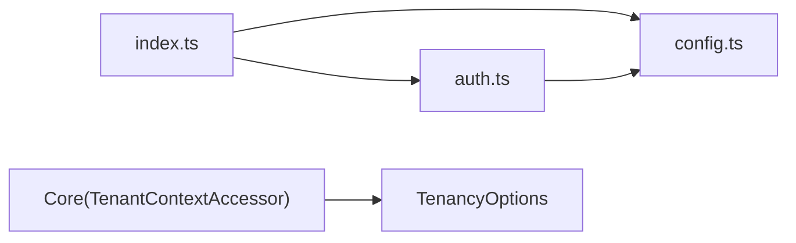

# 认证与安全

<cite>
**本文引用的文件**   
- [TinadecGateway/src/auth.ts](file://TinadecGateway/src/auth.ts)
- [TinadecGateway/src/config.ts](file://TinadecGateway/src/config.ts)
- [TinadecGateway/src/index.ts](file://TinadecGateway/src/index.ts)
- [TinadecGateway/src/auth.test.ts](file://TinadecGateway/src/auth.test.ts)
- [TinadecCore/Abstractions/Ports/ITenantContextAccessor.cs](file://TinadecCore/Abstractions/Ports/ITenantContextAccessor.cs)
- [TinadecCore/Tenancy/DevelopmentTenantContextAccessor.cs](file://TinadecCore/Tenancy/DevelopmentTenantContextAccessor.cs)
- [TinadecCore/Tenancy/TenancyOptions.cs](file://TinadecCore/Tenancy/TenancyOptions.cs)
- [docs/security.md](file://docs/security.md)
</cite>

## 目录
1. [简介](#简介)
2. [项目结构](#项目结构)
3. [核心组件](#核心组件)
4. [架构总览](#架构总览)
5. [详细组件分析](#详细组件分析)
6. [依赖关系分析](#依赖关系分析)
7. [性能考量](#性能考量)
8. [故障排查指南](#故障排查指南)
9. [结论](#结论)
10. [附录](#附录)

## 简介
本文件聚焦于 Gateway 网关的认证与安全模块，系统性阐述多模式认证机制（API Key、JWT、租户上下文）的实现原理与执行流程，覆盖认证中间件、令牌验证逻辑、权限检查、公共路径白名单、CORS 安全策略、请求头过滤与安全增强。同时解释云端模式下的身份验证流程、会话管理、租户隔离机制，并提供配置示例、错误处理策略与安全最佳实践，既适合初学者理解概念，也为有经验的开发者提供实现细节与加固建议。

## 项目结构
Gateway 使用 Elysia 作为 HTTP 框架，认证与安全能力集中在以下文件：
- 认证与租户上下文中间件：auth.ts
- 运行配置（本地/云端模式、认证开关、CORS、代理信任等）：config.ts
- 应用入口与中间件装配（CORS、认证、路由）：index.ts
- 单元测试（JWT 签名/验签、认证分支、头部注入）：auth.test.ts
- Core 侧租户上下文抽象与开发模式实现：ITenantContextAccessor.cs、DevelopmentTenantContextAccessor.cs、TenancyOptions.cs
- 整体安全策略说明（Electron、沙箱、审批优先等）：docs/security.md

**图表来源** 
- [TinadecGateway/src/index.ts:107-154](file://TinadecGateway/src/index.ts#L107-L154)
- [TinadecGateway/src/auth.ts:29-112](file://TinadecGateway/src/auth.ts#L29-L112)
- [TinadecGateway/src/auth.ts:227-254](file://TinadecGateway/src/auth.ts#L227-L254)

**章节来源**
- [TinadecGateway/src/index.ts:107-154](file://TinadecGateway/src/index.ts#L107-L154)
- [TinadecGateway/src/auth.ts:29-112](file://TinadecGateway/src/auth.ts#L29-L112)
- [TinadecGateway/src/config.ts:65-106](file://TinadecGateway/src/config.ts#L65-L106)

## 核心组件
- 认证上下文与结果类型：定义 authenticated、userId、tenantId、roles 等字段，以及 ok/context/error 的统一返回结构。
- 公共路径白名单：health、docs 相关路径无需认证。
- 认证主流程 authenticate：支持本地模式直接放行；云端模式优先 API Key，其次 Bearer JWT，最后根据 required 决定是否允许匿名。
- JWT 验证 verifyJwt：仅接受 HS256，校验 exp/nbf，无密钥 fail-closed，使用 WebCrypto HMAC-SHA256 验签。
- 转发头构建 buildForwardHeaders：将 tenant_id、user_id 注入到下游 Core/Tool Runtime 的请求头中。
- 客户端 IP 获取 getClientIp：在 trustProxy 模式下从 X-Forwarded-For/X-Real-IP 提取真实 IP。
- 配置加载 loadConfig：区分 local/cloud 模式，设置端口、监听地址、后端服务 URL、认证开关、CORS 额外来源、超时与反向代理信任。

**章节来源**
- [TinadecGateway/src/auth.ts:16-27](file://TinadecGateway/src/auth.ts#L16-L27)
- [TinadecGateway/src/auth.ts:29-39](file://TinadecGateway/src/auth.ts#L29-L39)
- [TinadecGateway/src/auth.ts:46-112](file://TinadecGateway/src/auth.ts#L46-L112)
- [TinadecGateway/src/auth.ts:133-178](file://TinadecGateway/src/auth.ts#L133-L178)
- [TinadecGateway/src/auth.ts:227-254](file://TinadecGateway/src/auth.ts#L227-L254)
- [TinadecGateway/src/auth.ts:259-269](file://TinadecGateway/src/auth.ts#L259-L269)
- [TinadecGateway/src/config.ts:65-106](file://TinadecGateway/src/config.ts#L65-L106)

## 架构总览
Gateway 在请求进入时先经过 CORS 中间件，再进入认证中间件。认证中间件依据部署模式与路径白名单决定是否需要鉴权。云端模式下，若存在 x-api-key 则调用 apiKeyValidator；否则解析 Authorization: Bearer 并使用 WebCrypto 进行 HS256 验签。认证成功后，通过 buildForwardHeaders 将租户与用户信息注入下游请求头，随后由具体路由转发到 Core 或 Tool Runtime。

**图表来源** 
- [TinadecGateway/src/index.ts:107-154](file://TinadecGateway/src/index.ts#L107-L154)
- [TinadecGateway/src/auth.ts:46-112](file://TinadecGateway/src/auth.ts#L46-L112)
- [TinadecGateway/src/auth.ts:227-254](file://TinadecGateway/src/auth.ts#L227-L254)

## 详细组件分析

### 认证中间件与多模式认证
- 本地模式：跳过认证，直接放行，便于开发与调试。
- 云端模式：
  - API Key：通过 x-api-key 头传递，由 apiKeyValidator 函数校验。
  - JWT：Authorization: Bearer <token>，仅支持 HS256，校验过期时间（exp）、生效时间（nbf），无密钥时拒绝（fail-closed）。
  - 租户上下文：优先从 JWT claims 中的 tenant_id 提取，回退到 x-tenant-id 头。
  - 用户上下文：从 sub 或 user_id 提取 userId。
  - 角色上下文：从 roles 提取（用于后续权限控制扩展）。
  - required 标志：当 required=true 且未提供有效认证时返回 AUTH_REQUIRED。

**图表来源** 
- [TinadecGateway/src/auth.ts:46-112](file://TinadecGateway/src/auth.ts#L46-L112)
- [TinadecGateway/src/auth.ts:29-39](file://TinadecGateway/src/auth.ts#L29-L39)

**章节来源**
- [TinadecGateway/src/auth.ts:46-112](file://TinadecGateway/src/auth.ts#L46-L112)
- [TinadecGateway/src/auth.ts:29-39](file://TinadecGateway/src/auth.ts#L29-L39)

### JWT 验证与 Base64url 解码
- 算法限制：仅接受 alg=HS256，拒绝 none 与其他算法。
- 声明校验：检查 exp（过期时间）与 nbf（生效时间），确保当前时间在有效期内。
- 密钥要求：无 jwtSecret 时拒绝 Bearer token（云端模式 fail-closed）。
- 验签实现：使用 WebCrypto 的 subtle.importKey/importKey('raw', { name: 'HMAC', hash: 'SHA-256' }) 与 verify 完成签名验证。
- Base64url 解码：补齐 padding，转换 URL-safe 字符为标准 base64，再用 atob 解码为字节数组，避免 Latin-1 问题。

**图表来源** 
- [TinadecGateway/src/auth.ts:114-126](file://TinadecGateway/src/auth.ts#L114-L126)
- [TinadecGateway/src/auth.ts:16-27](file://TinadecGateway/src/auth.ts#L16-L27)

**章节来源**
- [TinadecGateway/src/auth.ts:133-178](file://TinadecGateway/src/auth.ts#L133-L178)
- [TinadecGateway/src/auth.ts:194-221](file://TinadecGateway/src/auth.ts#L194-L221)

### 公共路径白名单与 CORS 安全策略
- 公共路径：/api/v1/health、/docs、/docs/、/docs/json 等无需认证。
- CORS：
  - 默认允许本地开发来源（127.0.0.1、localhost、file://、tauri://localhost、https://tauri.localhost）。
  - 支持通过 corsExtraOrigins 动态添加额外来源，支持通配符域名（*.*）转换为正则匹配。
  - 预检请求 OPTIONS：返回允许的 methods、headers、max-age。
  - 非预检请求：根据 origin 动态设置 allow-origin、allow-credentials、vary。

**图表来源** 
- [TinadecGateway/src/index.ts:66-87](file://TinadecGateway/src/index.ts#L66-L87)
- [TinadecGateway/src/index.ts:109-139](file://TinadecGateway/src/index.ts#L109-L139)

**章节来源**
- [TinadecGateway/src/auth.ts:29-39](file://TinadecGateway/src/auth.ts#L29-L39)
- [TinadecGateway/src/index.ts:66-87](file://TinadecGateway/src/index.ts#L66-L87)
- [TinadecGateway/src/index.ts:109-139](file://TinadecGateway/src/index.ts#L109-L139)

### 请求头过滤与安全增强
- 认证后注入：buildForwardHeaders 将 x-tenant-id、x-user-id 注入下游请求头，保证 Core/Tool Runtime 可识别租户与用户。
- 合并已有头：支持传入 HeadersInit（对象或数组或 Headers），合并后返回新对象，避免覆盖关键内容。
- 客户端 IP：trustProxy 模式下从 X-Forwarded-For/X-Real-IP 提取真实 IP，便于审计与限流。

**章节来源**
- [TinadecGateway/src/auth.ts:227-254](file://TinadecGateway/src/auth.ts#L227-L254)
- [TinadecGateway/src/auth.ts:259-269](file://TinadecGateway/src/auth.ts#L259-L269)

### 云端模式下的身份验证、会话管理与租户隔离
- 身份验证：云端模式默认启用认证（可通过环境变量关闭 required），支持 API Key 与 JWT 双通道。
- 会话管理：Gateway 本身无状态，会话数据由 Core/Tool Runtime 维护；Gateway 仅透传认证上下文与租户标识。
- 租户隔离：通过 x-tenant-id 头传递租户 ID，Core 侧通过 ITenantContextAccessor 暴露 TenantContext（包含 TenantId、WorkspaceId、PrincipalId、Role、IsDevelopment），实现资源与数据的租户级隔离。

**图表来源** 
- [TinadecCore/Abstractions/Ports/ITenantContextAccessor.cs:4-14](file://TinadecCore/Abstractions/Ports/ITenantContextAccessor.cs#L4-L14)
- [TinadecCore/Tenancy/DevelopmentTenantContextAccessor.cs:6-18](file://TinadecCore/Tenancy/DevelopmentTenantContextAccessor.cs#L6-L18)

**章节来源**
- [TinadecCore/Abstractions/Ports/ITenantContextAccessor.cs:4-14](file://TinadecCore/Abstractions/Ports/ITenantContextAccessor.cs#L4-L14)
- [TinadecCore/Tenancy/DevelopmentTenantContextAccessor.cs:6-18](file://TinadecCore/Tenancy/DevelopmentTenantContextAccessor.cs#L6-L18)

### 认证配置与环境变量
- 部署模式：TINADEC_GATEWAY_MODE（local/cloud）
- 监听端口：TINADEC_GATEWAY_PORT（默认 48730）
- 后端服务：TINADEC_CORE_URL、TINADEC_TOOL_RUNTIME_URL
- 认证开关：TINADEC_GATEWAY_AUTH_REQUIRED（云端默认 true）
- JWT 密钥：TINADEC_GATEWAY_JWT_SECRET
- API Key：TINADEC_GATEWAY_API_KEY（静态校验）
- CORS 额外来源：TINADEC_GATEWAY_CORS_ORIGINS（逗号分隔，支持 * 前缀）
- 超时：TINADEC_GATEWAY_TIMEOUT_MS（默认 120000）
- 反向代理信任：云端模式默认开启 trustProxy

**章节来源**
- [TinadecGateway/src/config.ts:65-106](file://TinadecGateway/src/config.ts#L65-L106)

### 错误处理策略
- AUTH_INVALID_API_KEY：API Key 无效。
- AUTH_INVALID_TOKEN：JWT 无效或过期。
- AUTH_REQUIRED：云端模式要求认证但未提供有效凭据。
- 其他通用错误：统一 code/message 结构返回，便于前端处理。

**章节来源**
- [TinadecGateway/src/auth.ts:46-112](file://TinadecGateway/src/auth.ts#L46-L112)
- [TinadecGateway/src/index.ts:141-154](file://TinadecGateway/src/index.ts#L141-L154)

### 安全最佳实践
- 强制使用 HTTPS 与严格 CORS 白名单，避免跨站脚本与 CSRF 风险。
- 生产环境必须配置 TINADEC_GATEWAY_JWT_SECRET，禁止留空。
- 最小化公共路径白名单，仅开放健康检查与文档。
- 使用短生命周期 JWT，配合 nbf/exp 控制有效期。
- 对敏感操作启用审批门（approval-first），结合沙箱与 ACL 限制。
- 记录审计日志（用户、租户、IP、操作），便于追踪与合规。

**章节来源**
- [docs/security.md:1-18](file://docs/security.md#L1-L18)

## 依赖关系分析
- index.ts 依赖 config.ts 获取运行配置，依赖 auth.ts 进行认证与头注入。
- auth.ts 依赖 config.ts 的 AuthConfig（apiKeyValidator、jwtSecret、required）。
- Core 侧通过 ITenantContextAccessor 暴露租户上下文，DevelopmentTenantContextAccessor 提供开发模式默认值。

**图表来源** 
- [TinadecGateway/src/index.ts:23-32](file://TinadecGateway/src/index.ts#L23-L32)
- [TinadecGateway/src/auth.ts:14](file://TinadecGateway/src/auth.ts#L14)
- [TinadecCore/Tenancy/TenancyOptions.cs:3-11](file://TinadecCore/Tenancy/TenancyOptions.cs#L3-L11)

**章节来源**
- [TinadecGateway/src/index.ts:23-32](file://TinadecGateway/src/index.ts#L23-L32)
- [TinadecGateway/src/auth.ts:14](file://TinadecGateway/src/auth.ts#L14)
- [TinadecCore/Tenancy/TenancyOptions.cs:3-11](file://TinadecCore/Tenancy/TenancyOptions.cs#L3-L11)

## 性能考量
- 认证中间件轻量：仅解析头部与一次 WebCrypto 验签，开销可控。
- 无状态设计：Gateway 横向扩展友好，无需共享会话。
- 流式转发：SSE/流式 HTTP 减少内存占用，提升大响应吞吐。
- CORS 预检缓存：max-age 设置为一天，降低重复预检开销。

[本节为通用指导，不直接分析具体文件]

## 故障排查指南
- 认证失败（AUTH_INVALID_TOKEN/AUTH_INVALID_API_KEY）：检查 JWT 密钥配置、API Key 是否正确、token 是否过期或尚未生效。
- 公共路径仍被拦截：确认路径是否在白名单内，注意大小写与尾部斜杠。
- CORS 报错：检查 Origin 是否在允许列表，必要时添加 corsExtraOrigins。
- 下游缺少租户/用户头：确认认证成功并调用 buildForwardHeaders 注入。
- 开发模式租户上下文不可用：确认 EnableDevelopmentIdentity 配置正确。

**章节来源**
- [TinadecGateway/src/auth.ts:46-112](file://TinadecGateway/src/auth.ts#L46-L112)
- [TinadecGateway/src/index.ts:141-154](file://TinadecGateway/src/index.ts#L141-L154)
- [TinadecCore/Tenancy/DevelopmentTenantContextAccessor.cs:15-18](file://TinadecCore/Tenancy/DevelopmentTenantContextAccessor.cs#L15-L18)

## 结论
Gateway 的认证与安全模块以简洁、可扩展的设计实现了本地与云端两种模式的无缝切换，支持 API Key 与 JWT 双通道认证，并通过租户上下文实现资源隔离。CORS、公共路径白名单、请求头注入与错误处理共同构成完整的安全边界。结合 Core 侧的租户上下文抽象与开发模式实现，可在保障安全的同时兼顾开发效率与运维弹性。

[本节为总结性内容，不直接分析具体文件]

## 附录
- 测试用例参考：auth.test.ts 覆盖了 JWT 签名/验签、算法限制、过期/未生效、fail-closed、API Key 校验、头部注入等场景，可作为集成与回归测试模板。

**章节来源**
- [TinadecGateway/src/auth.test.ts:43-124](file://TinadecGateway/src/auth.test.ts#L43-L124)
- [TinadecGateway/src/auth.test.ts:126-177](file://TinadecGateway/src/auth.test.ts#L126-L177)
- [TinadecGateway/src/auth.test.ts:179-221](file://TinadecGateway/src/auth.test.ts#L179-L221)