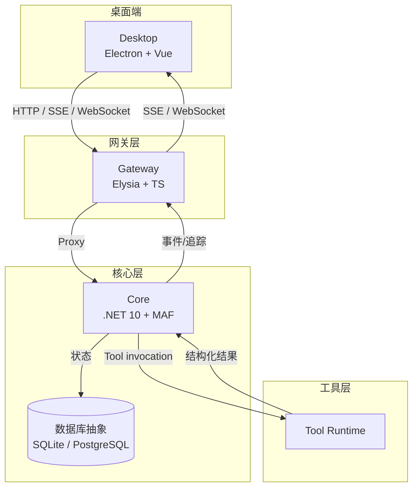
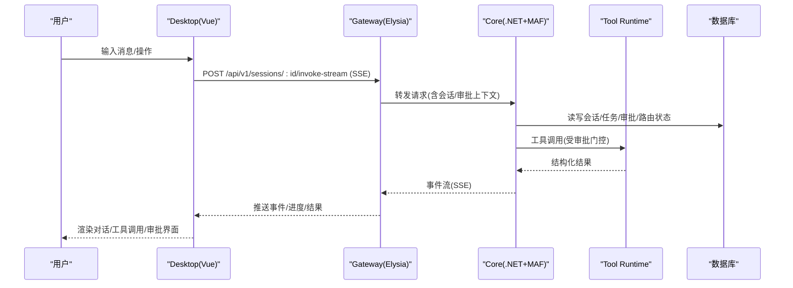
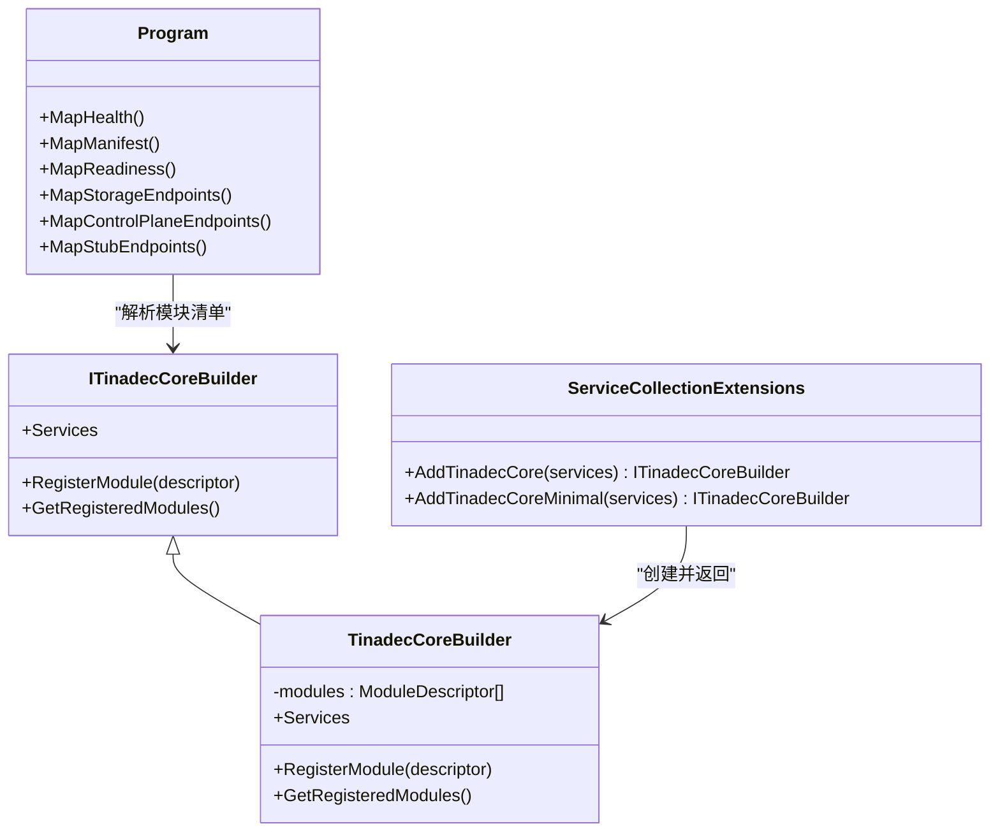
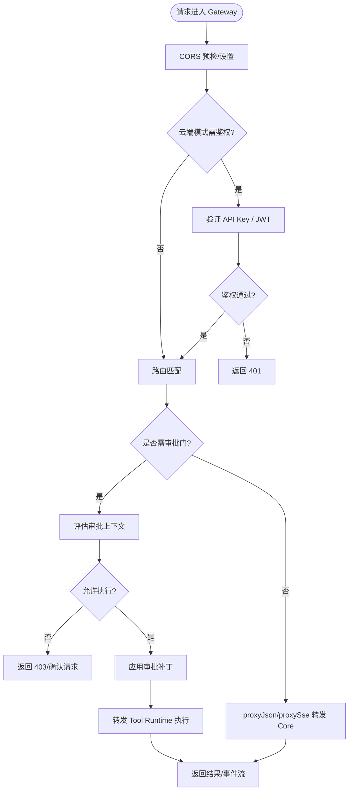
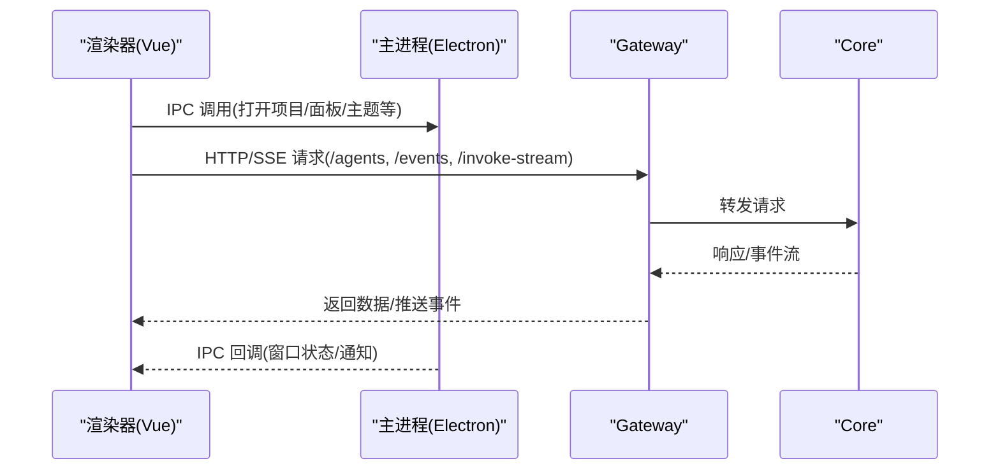
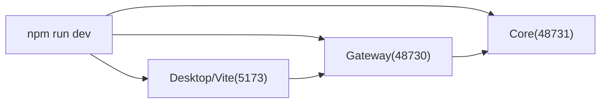

# 三层架构设计

<cite>
**本文引用的文件**   
- [README.md](file://README.md)
- [architecture.md](file://docs/architecture.md)
- [startup.md](file://docs/startup.md)
- [Program.cs](file://TinadecCore\Api\Program.cs)
- [TinadecCoreBuilder.cs](file://TinadecCore\Runtime\TinadecCoreBuilder.cs)
- [TinadecCoreServiceCollectionExtensions.cs](file://TinadecCore\Runtime\TinadecCoreServiceCollectionExtensions.cs)
- [index.ts](file://TinadecGateway\src\index.ts)
- [coreClient.ts](file://TinadecGateway\src\coreClient.ts)
- [config.ts](file://TinadecGateway\src\config.ts)
- [main.cjs](file://apps\desktop\electron\main.cjs)
- [api.ts](file://apps\desktop\src\api.ts)
- [package.json](file://package.json)
</cite>

## 目录
1. [简介](#简介)
2. [项目结构](#项目结构)
3. [核心组件](#核心组件)
4. [架构总览](#架构总览)
5. [详细组件分析](#详细组件分析)
6. [依赖关系分析](#依赖关系分析)
7. [性能考量](#性能考量)
8. [故障排查指南](#故障排查指南)
9. [结论](#结论)
10. [附录](#附录)

## 简介
本文件系统化阐述 TinadecOffice 的三层架构：Desktop（Electron + Vue 3）、Gateway（Elysia + TypeScript）、Core（.NET 10 + MAF）。重点说明 Core 作为“唯一状态权威”的设计理念，涵盖会话状态、审批决策、模型路由状态、工具策略状态与提供商生命周期状态的管理原则；并解释各层之间的通信协议、数据流向与依赖关系。同时给出端口分配（48730、48731、5173）与服务启动顺序，既面向初学者提供概念性理解，也为有经验的开发者提供技术实现细节。

## 项目结构
- Desktop（apps/desktop）：Electron 主进程与 Vue 渲染器，负责 UI 呈现、面板窗口管理、IPC 与本地能力（终端、宠物窗口等），通过 HTTP/SSE/WebSocket 调用 Gateway。
- Gateway（TinadecGateway）：基于 Elysia 的薄 BFF/代理层，统一鉴权、CORS、协议转换（HTTP/JSON、SSE、WebSocket、流式 HTTP），聚合 Model/Agent Center 视图，并将写操作经审批门转发至 Tool Runtime/Core。
- Core（TinadecCore）：基于 .NET 10 + ASP.NET Core + Microsoft Agent Framework（MAF）的模块化单体，拥有所有业务状态与编排逻辑，暴露健康检查、就绪回执、工具清单、事件流等 API。

图表来源 
- [README.md](file://README.md)
- [architecture.md](file://docs/architecture.md)

章节来源
- [README.md](file://README.md)
- [architecture.md](file://docs/architecture.md)

## 核心组件
- Core（状态权威）
  - 模块注册与装配：通过 ITinadecCoreBuilder 收集模块描述，按依赖顺序注册多模块（租户、向量存储、生命周期、模型、上下文、提示词、内存、技能、循环防护、DmaEA 等）。
  - 运行时入口：Program.cs 配置 JSON 序列化（snake_case）、持久化、模块装配、迁移与就绪检查，并挂载控制面、存储与桩端点。
  - 就绪与健康：/health、/readiness、/harness/manifest 等端点对外输出框架与模块状态。
- Gateway（BFF/代理）
  - 配置加载：从环境变量读取部署模式、端口、主机名、Core URL、Tool Runtime URL、认证与 CORS 等。
  - 协议与代理：统一处理 CORS、鉴权（云端模式）、SSE/流式转发、JSON 代理到 Core，以及 Code Tools 审批门与 Tool Runtime 执行。
  - 中心视图：Model/Agent Center 聚合 Core 资源，提供无状态视图给 Desktop。
- Desktop（UI/交互）
  - Electron 主进程：窗口管理、IPC、面板分离、主题广播、调试工作室窗口等。
  - 渲染器：Vue 3 + Vite，通过 api.ts 类型定义与 Gateway 交互，不直接访问 Core。

章节来源
- [TinadecCoreServiceCollectionExtensions.cs](file://TinadecCore\Runtime\TinadecCoreServiceCollectionExtensions.cs)
- [TinadecCoreBuilder.cs](file://TinadecCore\Runtime\TinadecCoreBuilder.cs)
- [Program.cs](file://TinadecCore\Api\Program.cs)
- [config.ts](file://TinadecGateway\src\config.ts)
- [index.ts](file://TinadecGateway\src\index.ts)
- [main.cjs](file://apps\desktop\electron\main.cjs)
- [api.ts](file://apps\desktop\src\api.ts)

## 架构总览
- 职责边界
  - Core 是唯一状态权威：会话、运行、任务、审批、事件、追踪、模型路由、扩展、代理、任务图、上下文包、监督发现等均由 Core 持有与管理。
  - Gateway 是薄代理/BFF：不保存业务状态，仅做协议转换、鉴权、聚合视图与转发。
  - Desktop 只负责展示与交互：通过 Gateway 提供的 API 获取数据，不直接调用 Core。
- 通信协议
  - HTTP/JSON：普通查询与命令。
  - SSE：统一事件流（如 /events、invoke-stream）。
  - WebSocket：终端、调试、协作通道。
  - 流式 HTTP：大文件与日志传输。
- 端口分配
  - Gateway API 与文档：http://127.0.0.1:48730
  - Core 运行时：http://127.0.0.1:48731
  - Vite 渲染器（开发）：http://127.0.0.1:5173

图表来源 
- [index.ts](file://TinadecGateway\src\index.ts)
- [coreClient.ts](file://TinadecGateway\src\coreClient.ts)
- [Program.cs](file://TinadecCore\Api\Program.cs)

章节来源
- [architecture.md](file://docs/architecture.md)
- [startup.md](file://docs/startup.md)

## 详细组件分析

### Core 层（.NET 10 + MAF）
- 模块装配与依赖注入
  - AddTinadecCore() 按依赖顺序注册多个模块，支持最小化装配（AddTinadecCoreMinimal）。
  - ITinadecCoreBuilder 维护已注册模块列表，供 /harness/manifest 与就绪检查使用。
- 运行时与端点
  - Program.cs 配置 snake_case JSON 序列化、持久化、迁移、生命周期协调，并挂载控制面、存储与桩端点。
  - /health、/readiness、/harness/manifest 等端点用于健康检查、就绪回执与能力清单。
- 状态权威原则
  - 会话、运行、任务、审批、事件、追踪、模型路由、扩展、代理、任务图、上下文包、监督发现等全部由 Core 持有。
  - 工具策略与提供商生命周期状态由 Core 统一管理，Gateway/Desktop 不得缓存或改写。

图表来源 
- [TinadecCoreBuilder.cs](file://TinadecCore\Runtime\TinadecCoreBuilder.cs)
- [TinadecCoreServiceCollectionExtensions.cs](file://TinadecCore\Runtime\TinadecCoreServiceCollectionExtensions.cs)
- [Program.cs](file://TinadecCore\Api\Program.cs)

章节来源
- [TinadecCoreServiceCollectionExtensions.cs](file://TinadecCore\Runtime\TinadecCoreServiceCollectionExtensions.cs)
- [TinadecCoreBuilder.cs](file://TinadecCore\Runtime\TinadecCoreBuilder.cs)
- [Program.cs](file://TinadecCore\Api\Program.cs)

### Gateway 层（Elysia + TypeScript）
- 配置与部署模式
  - 本地模式：监听 127.0.0.1，无认证；云端模式：监听 0.0.0.0，支持 API Key/JWT、租户、反向代理头、横向扩展。
  - 关键环境变量：TINADEC_GATEWAY_MODE、TINADEC_GATEWAY_PORT、TINADEC_CORE_URL、TINADEC_TOOL_RUNTIME_URL、TINADEC_GATEWAY_AUTH_REQUIRED、TINADEC_GATEWAY_JWT_SECRET、TINADEC_GATEWAY_API_KEY、TINADEC_GATEWAY_CORS_ORIGINS、TINADEC_GATEWAY_TIMEOUT_MS。
- 协议与代理
  - 统一 CORS 中间件与鉴权中间件（云端模式）。
  - proxyJson/proxySse/proxyStream 将请求转发到 Core，保持状态码与错误语义。
  - SSE 事件流转发（/events、/sessions/:id/invoke-stream）。
- 审批门与工具执行
  - Code Tools 执行前进行审批门校验，必要时二次确认；通过后合并审批补丁并转发至 Tool Runtime。
  - 读接口（如 /tools/search、/harness/manifest）透传 Core 响应，不做风险重算。
- 中心视图（无状态）
  - Model/Agent Center 聚合 Core 资源，剥离敏感字段，降级可选 404/501 为诊断信息。

图表来源 
- [index.ts](file://TinadecGateway\src\index.ts)
- [coreClient.ts](file://TinadecGateway\src\coreClient.ts)
- [config.ts](file://TinadecGateway\src\config.ts)

章节来源
- [config.ts](file://TinadecGateway\src\config.ts)
- [index.ts](file://TinadecGateway\src\index.ts)
- [coreClient.ts](file://TinadecGateway\src\coreClient.ts)

### Desktop 层（Electron + Vue 3）
- 主进程职责
  - 窗口生命周期管理、面板分离/重附着、主题广播、调试工作室窗口、终端 IPC、宠物窗口管理等。
  - 通过 IPC 暴露能力给渲染器（如打开项目、保存 Gateway URL、重启应用等）。
- 渲染器职责
  - 通过 api.ts 的类型定义与 Gateway 交互，消费事件流（SSE）与 REST API。
  - 不直接调用 Core，避免绕过审批门与状态一致性约束。

图表来源 
- [main.cjs](file://apps\desktop\electron\main.cjs)
- [api.ts](file://apps\desktop\src\api.ts)
- [index.ts](file://TinadecGateway\src\index.ts)

章节来源
- [main.cjs](file://apps\desktop\electron\main.cjs)
- [api.ts](file://apps\desktop\src\api.ts)

## 依赖关系分析
- 服务间依赖
  - Desktop → Gateway：HTTP/SSE/WebSocket，遵循统一契约（snake_case、事件信封、就绪回执）。
  - Gateway → Core：JSON/SSE/流式 HTTP，严格代理，不缓存业务状态。
  - Core → 数据库：抽象层（SQLite/PostgreSQL），迁移与就绪检查在启动时执行。
- 启动顺序
  - 推荐先启动 Core（48731），再启动 Gateway（48730），最后启动 Desktop/Vite（5173）。
  - 根脚本 npm run dev 会并发启动三者，但建议保证 Core 优先就绪。

图表来源 
- [package.json](file://package.json)
- [startup.md](file://docs/startup.md)

章节来源
- [package.json](file://package.json)
- [startup.md](file://docs/startup.md)

## 性能考量
- 流式传输
  - 使用 SSE 与流式 HTTP 降低首屏延迟与大对象传输开销。
- 无状态网关
  - Gateway 无状态便于水平扩展；会话与状态始终在 Core。
- 序列化优化
  - Core 全局启用 snake_case 与忽略 null，减少无效负载。
- 连接与超时
  - Gateway 可配置请求超时与信任反向代理头，适配云端部署。

## 故障排查指南
- 端口占用与连通性
  - 使用 netstat 或 PowerShell 检查 48730、48731、5173 端口占用情况。
  - 依次验证 /api/v1/health（Gateway）与 /api/v1/health（Core）。
- 常见症状
  - Settings > Agents 为空：检查 Gateway 可达性与代理是否正常；若 /api/v1/agents 返回 404，重启 Gateway。
  - Gateway health 返回 500：Core 未启动或仍在构建，启动/重启 Core。
  - 旧名称出现：重启 Core 以触发内置种子规范化。
- 构建问题
  - dotnet build 报 NETSDK1018：清除环境变量 Version/Ice-Version 后重试。
  - 无法复制 TinadecCore.dll：停止锁定输出的旧进程或使用隔离输出目录。

章节来源
- [startup.md](file://docs/startup.md)

## 结论
TinadecOffice 采用清晰的三层架构：Core 作为唯一状态权威，Gateway 作为薄代理与 BFF，Desktop 专注 UI 与交互。通过统一的通信协议（HTTP/JSON、SSE、WebSocket、流式 HTTP）与严格的审批门控，确保状态一致性与安全性。端口与启动顺序标准化，便于开发与排障。该设计既满足初学者快速上手，也为高级开发者提供了可扩展、可观测、可运维的技术基础。

## 附录
- 常用命令
  - npm run dev：同时启动 Core、Gateway、Desktop。
  - npm run dev:core / dev:gateway / dev:desktop：分别启动单一服务。
- 参考文档
  - 产品模型、架构、安全、启动手册详见 docs 目录。