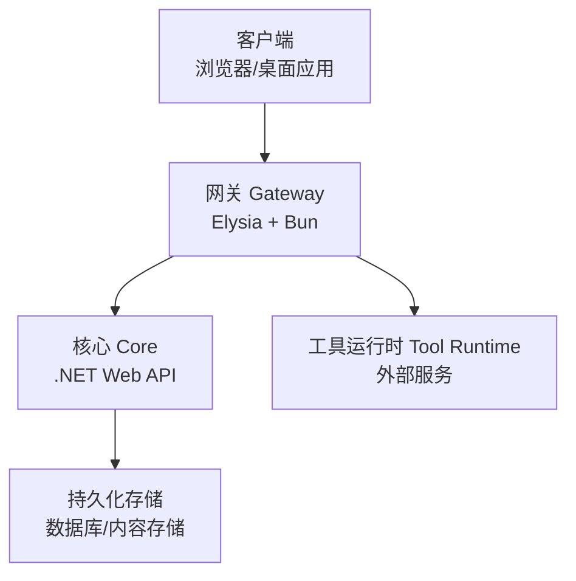
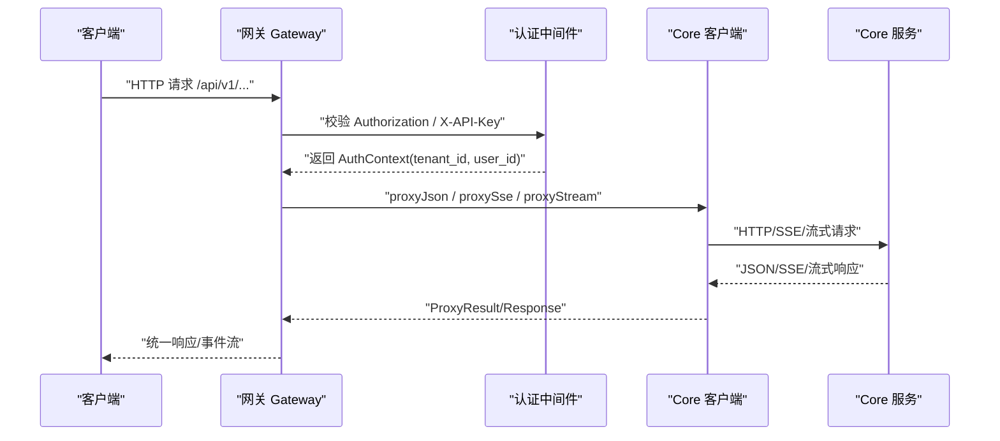
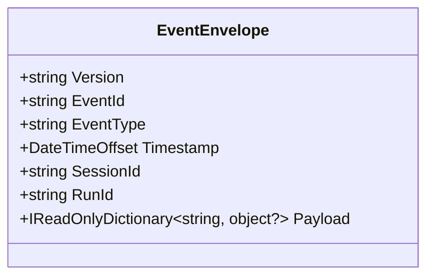
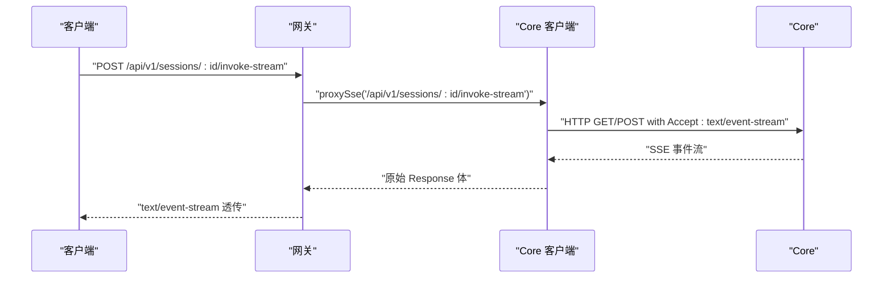
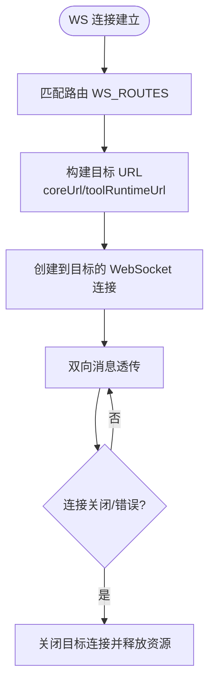
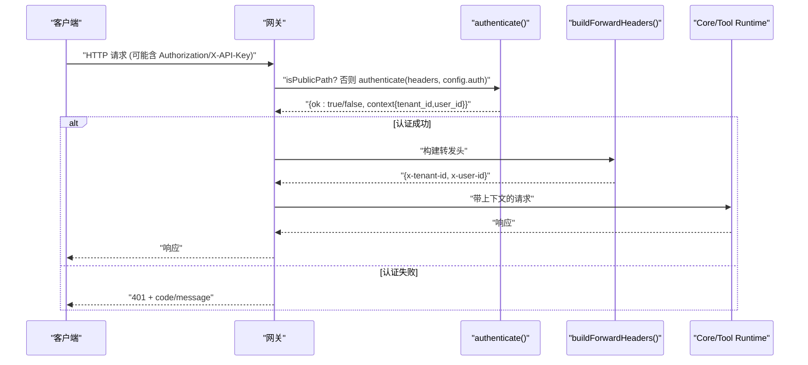
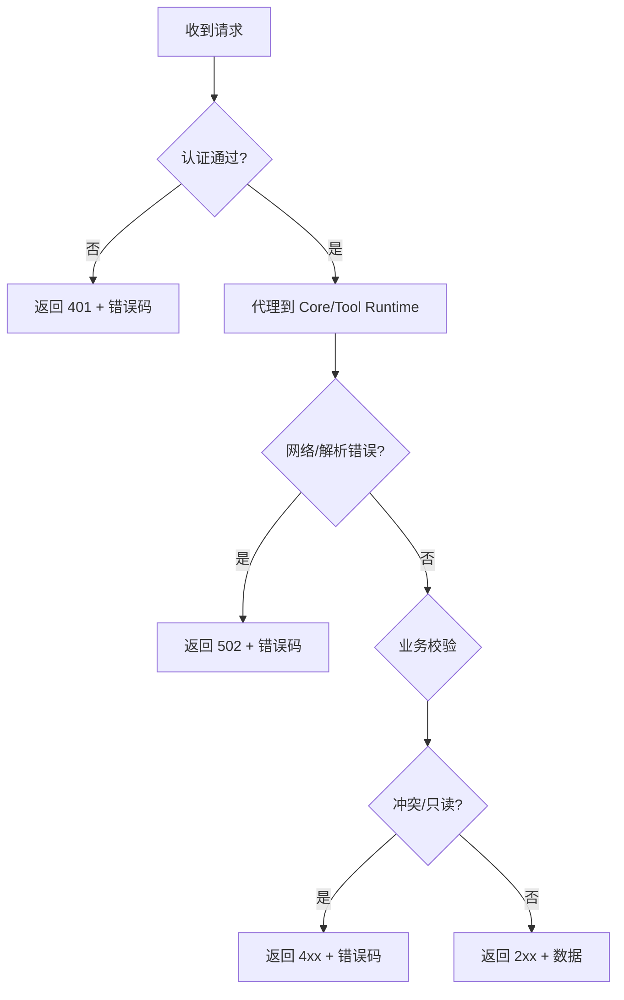
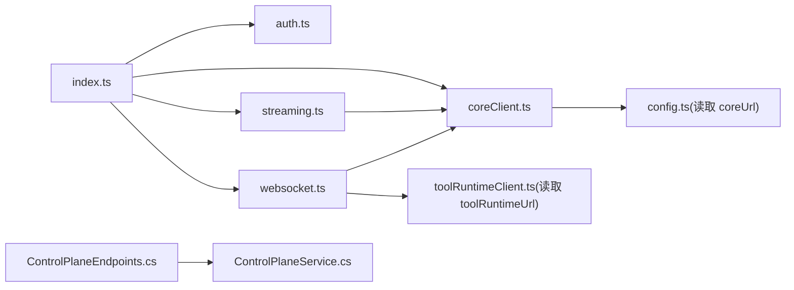

# 层间通信机制

<cite>
**本文引用的文件**   
- [TinadecGateway/src/index.ts](file://TinadecGateway/src/index.ts)
- [TinadecGateway/src/auth.ts](file://TinadecGateway/src/auth.ts)
- [TinadecGateway/src/coreClient.ts](file://TinadecGateway/src/coreClient.ts)
- [TinadecGateway/src/streaming.ts](file://TinadecGateway/src/streaming.ts)
- [TinadecGateway/src/websocket.ts](file://TinadecGateway/src/websocket.ts)
- [TinadecCore/Api/Endpoints/ControlPlaneEndpoints.cs](file://TinadecCore/Api/Endpoints/ControlPlaneEndpoints.cs)
- [TinadecCore/Runtime/ControlPlaneService.cs](file://TinadecCore/Runtime/ControlPlaneService.cs)
- [TinadecCore/Contracts/Events/EventEnvelope.cs](file://TinadecCore/Contracts/Events/EventEnvelope.cs)
</cite>

## 目录
1. [简介](#简介)
2. [项目结构](#项目结构)
3. [核心组件](#核心组件)
4. [架构总览](#架构总览)
5. [详细组件分析](#详细组件分析)
6. [依赖关系分析](#依赖关系分析)
7. [性能与可扩展性](#性能与可扩展性)
8. [故障排查指南](#故障排查指南)
9. [结论](#结论)
10. [附录：端口与服务发现、负载均衡建议](#附录端口与服务发现负载均衡建议)

## 简介
本文件系统化阐述 TinadecOffice 的层间通信机制，覆盖三层架构（前端/桌面客户端、网关 Gateway、核心 Core）之间的协议设计、数据格式与错误处理策略。重点包括：
- RESTful API 规范与统一事件信封 EventEnvelope
- SSE 事件流与 WebSocket 实时通信
- 认证授权流程（本地模式与云端模式）
- 请求响应模式、错误码与重试策略
- 端口分配（48730、48731、5173）、服务发现与负载均衡考虑

面向初学者提供分布式系统通信概念，同时为有经验的开发者提供具体实现路径与调试技巧。

## 项目结构
- 网关层（TinadecGateway）：基于 Elysia/Bun 的轻量 BFF/API 网关，负责鉴权、路由转发、协议转换（HTTP/SSE/WebSocket/流式 HTTP），以及审批门与工具执行编排。
- 核心层（TinadecCore）：.NET 控制面与业务逻辑，暴露 REST 端点，管理模型提供者、提示词片段、Agent 配置、审批流等。
- 契约层（Contracts）：定义跨进程/服务边界的数据结构，如统一事件信封 EventEnvelope。

**图示来源** 
- [TinadecGateway/src/index.ts](file://TinadecGateway/src/index.ts)
- [TinadecCore/Api/Endpoints/ControlPlaneEndpoints.cs](file://TinadecCore/Api/Endpoints/ControlPlaneEndpoints.cs)

**章节来源**
- [TinadecGateway/src/index.ts](file://TinadecGateway/src/index.ts)
- [TinadecCore/Api/Endpoints/ControlPlaneEndpoints.cs](file://TinadecCore/Api/Endpoints/ControlPlaneEndpoints.cs)

## 核心组件
- 网关入口与路由：集中定义 REST、SSE、WebSocket 与流式代理，统一鉴权与 CORS。
- 认证与租户上下文：支持本地模式跳过认证；云端模式支持 JWT HS256 与 API Key，注入 X-Tenant-Id/X-User-Id 头。
- Core 客户端：JSON 代理与 SSE 代理，封装网络异常与无效响应。
- 流式代理：大文件与日志流的半双工透传。
- WebSocket 代理：终端 PTY、调试器、协作通道到 Core/Tool Runtime 的双向透传。
- 控制面服务：模型提供者、路由、提示词片段、Agent 配置、审批请求与决策。

**章节来源**
- [TinadecGateway/src/index.ts](file://TinadecGateway/src/index.ts)
- [TinadecGateway/src/auth.ts](file://TinadecGateway/src/auth.ts)
- [TinadecGateway/src/coreClient.ts](file://TinadecGateway/src/coreClient.ts)
- [TinadecGateway/src/streaming.ts](file://TinadecGateway/src/streaming.ts)
- [TinadecGateway/src/websocket.ts](file://TinadecGateway/src/websocket.ts)
- [TinadecCore/Runtime/ControlPlaneService.cs](file://TinadecCore/Runtime/ControlPlaneService.cs)

## 架构总览
网关作为统一的对外入口，将不同协议请求分发至 Core 或 Tool Runtime，并保证安全与一致性。

**图示来源** 
- [TinadecGateway/src/index.ts](file://TinadecGateway/src/index.ts)
- [TinadecGateway/src/auth.ts](file://TinadecGateway/src/auth.ts)
- [TinadecGateway/src/coreClient.ts](file://TinadecGateway/src/coreClient.ts)

**章节来源**
- [TinadecGateway/src/index.ts](file://TinadecGateway/src/index.ts)
- [TinadecGateway/src/auth.ts](file://TinadecGateway/src/auth.ts)
- [TinadecGateway/src/coreClient.ts](file://TinadecGateway/src/coreClient.ts)

## 详细组件分析

### RESTful API 规范与统一事件信封
- 网关暴露 /api/v1/* 系列端点，透明代理到 Core。
- Core 控制面端点涵盖模型提供者、路由、提示词片段、Agent 配置、审批流等。
- 统一事件信封 EventEnvelope 用于跨层事件传输，字段采用 snake_case，包含版本、事件 ID、类型、时间戳、会话/运行标识与 payload。

**图示来源** 
- [TinadecCore/Contracts/Events/EventEnvelope.cs](file://TinadecCore/Contracts/Events/EventEnvelope.cs)

**章节来源**
- [TinadecCore/Contracts/Events/EventEnvelope.cs](file://TinadecCore/Contracts/Events/EventEnvelope.cs)
- [TinadecCore/Api/Endpoints/ControlPlaneEndpoints.cs](file://TinadecCore/Api/Endpoints/ControlPlaneEndpoints.cs)

### SSE 事件流格式与调用链
- 网关通过 /api/v1/sessions/:sessionId/invoke-stream 与 /api/v1/events 暴露 SSE。
- 使用 coreClient.proxySse 将请求转发到 Core，设置 text/event-stream 与缓存控制头。
- 典型调用链：客户端 POST 触发会话调用 → 网关代理 SSE → Core 推送事件流 → 网关透传到客户端。

**图示来源** 
- [TinadecGateway/src/index.ts](file://TinadecGateway/src/index.ts)
- [TinadecGateway/src/coreClient.ts](file://TinadecGateway/src/coreClient.ts)

**章节来源**
- [TinadecGateway/src/index.ts](file://TinadecGateway/src/index.ts)
- [TinadecGateway/src/coreClient.ts](file://TinadecGateway/src/coreClient.ts)

### WebSocket 实时通信
- 网关维护 WS_ROUTES 映射，将 /ws/terminal、/ws/debug、/ws/collaboration 分别转发到 Tool Runtime 或 Core。
- 使用 createWsProxyHandlers 建立双向消息透传，关闭与错误时清理连接。

**图示来源** 
- [TinadecGateway/src/websocket.ts](file://TinadecGateway/src/websocket.ts)

**章节来源**
- [TinadecGateway/src/websocket.ts](file://TinadecGateway/src/websocket.ts)

### 认证与授权流程
- 本地模式：跳过认证，不提取租户上下文。
- 云端模式：
  - 支持 Authorization: Bearer <JWT> 或 X-API-Key。
  - JWT 使用 HS256 验证签名与过期时间，失败则拒绝。
  - 从 claims 或自定义头提取 tenant_id/user_id，并通过 buildForwardHeaders 注入下游请求头。
- 公共路径（health、docs）无需认证。

**图示来源** 
- [TinadecGateway/src/auth.ts](file://TinadecGateway/src/auth.ts)
- [TinadecGateway/src/index.ts](file://TinadecGateway/src/index.ts)

**章节来源**
- [TinadecGateway/src/auth.ts](file://TinadecGateway/src/auth.ts)
- [TinadecGateway/src/index.ts](file://TinadecGateway/src/index.ts)

### 错误处理策略
- 网关层：
  - 认证失败返回 401，code 如 AUTH_INVALID_TOKEN/AUTH_INVALID_API_KEY/AUTH_REQUIRED。
  - Core 不可达或响应非 JSON 返回 502，code 如 CORE_UNREACHABLE/CORE_INVALID_RESPONSE。
  - 工具未找到返回 404，审批拒绝返回 403。
- Core 层：
  - 并发更新冲突返回 412（If-Match 校验）。
  - 内置资源只读返回 409。
  - 参数错误返回 400，资源不存在返回 404。

**图示来源** 
- [TinadecGateway/src/auth.ts](file://TinadecGateway/src/auth.ts)
- [TinadecGateway/src/coreClient.ts](file://TinadecGateway/src/coreClient.ts)
- [TinadecCore/Runtime/ControlPlaneService.cs](file://TinadecCore/Runtime/ControlPlaneService.cs)

**章节来源**
- [TinadecGateway/src/auth.ts](file://TinadecGateway/src/auth.ts)
- [TinadecGateway/src/coreClient.ts](file://TinadecGateway/src/coreClient.ts)
- [TinadecCore/Runtime/ControlPlaneService.cs](file://TinadecCore/Runtime/ControlPlaneService.cs)

### 数据序列化格式
- REST 请求/响应：application/json，字段名遵循 snake_case（如 event_id、event_type、session_id、run_id）。
- SSE：text/event-stream，逐条事件流，网关透传响应体。
- WebSocket：二进制/文本消息透传，由上层协议约定。
- 事件信封：EventEnvelope 统一包装事件元数据与 payload。

**章节来源**
- [TinadecCore/Contracts/Events/EventEnvelope.cs](file://TinadecCore/Contracts/Events/EventEnvelope.cs)
- [TinadecGateway/src/coreClient.ts](file://TinadecGateway/src/coreClient.ts)

### 请求响应模式与示例端点
- 健康检查：/api/v1/health、/api/v1/readiness、/api/v1/model-readiness、/api/v1/tool-layer-readiness。
- 会话与消息：/api/v1/sessions、/api/v1/sessions/:sessionId/messages。
- SSE 调用：/api/v1/sessions/:sessionId/invoke-stream。
- 事件订阅：/api/v1/events?session_id=...。
- 模型与路由：/api/v1/model-providers、/api/v1/model-routes、/api/v1/model-settings。
- 提示词片段：/api/v1/prompt-fragments/*。
- Agent 中心：/api/v1/agents、/api/v1/agent-modes。
- 审批流：/api/v1/approvals、/api/v1/approvals/:id/decision。
- 调试：/api/v1/debug/traces、/api/v1/debug/spans、/api/v1/debug/metrics、/api/v1/debug/snapshot/:sessionId。

**章节来源**
- [TinadecGateway/src/index.ts](file://TinadecGateway/src/index.ts)
- [TinadecCore/Api/Endpoints/ControlPlaneEndpoints.cs](file://TinadecCore/Api/Endpoints/ControlPlaneEndpoints.cs)

## 依赖关系分析
- 网关依赖：
  - Elysia（HTTP 框架）、Bun（运行时）、WebCrypto（JWT HS256）。
  - coreClient.ts、streaming.ts、websocket.ts 模块。
  - auth.ts 认证与租户上下文。
- Core 依赖：
  - ASP.NET Core Web API、Entity Framework、内容存储与密钥存储抽象。
  - ControlPlaneService 聚合多 DbContext 与存储接口。

**图示来源** 
- [TinadecGateway/src/index.ts](file://TinadecGateway/src/index.ts)
- [TinadecGateway/src/coreClient.ts](file://TinadecGateway/src/coreClient.ts)
- [TinadecGateway/src/streaming.ts](file://TinadecGateway/src/streaming.ts)
- [TinadecGateway/src/websocket.ts](file://TinadecGateway/src/websocket.ts)
- [TinadecCore/Api/Endpoints/ControlPlaneEndpoints.cs](file://TinadecCore/Api/Endpoints/ControlPlaneEndpoints.cs)
- [TinadecCore/Runtime/ControlPlaneService.cs](file://TinadecCore/Runtime/ControlPlaneService.cs)

**章节来源**
- [TinadecGateway/src/index.ts](file://TinadecGateway/src/index.ts)
- [TinadecCore/Api/Endpoints/ControlPlaneEndpoints.cs](file://TinadecCore/Api/Endpoints/ControlPlaneEndpoints.cs)

## 性能与可扩展性
- 流式传输：SSE 与流式 HTTP 避免全量缓冲，适合大文件与长任务进度。
- 连接复用：keep-alive、no-cache、禁用加速缓冲（x-accel-buffering=no）保障低延迟。
- 横向扩展：
  - 网关无状态，可多实例部署于反向代理之后（Nginx/Envoy/Kong）。
  - Core 与 Tool Runtime 通过服务注册/发现（DNS、Consul、K8s Service）动态定位。
- 负载均衡：
  - 基于会话的粘性会话（如 session_id）确保 SSE/WebSocket 正确路由。
  - 对幂等 GET/HEAD 请求启用负载均衡；对写操作结合一致性策略（如 If-Match 乐观锁）。

[本节为通用指导，不直接分析具体文件]

## 故障排查指南
- 认证问题：
  - 检查 Authorization 头格式（Bearer <token>）或 X-API-Key 是否有效。
  - 确认 JWT 算法为 HS256，且未过期；云端模式需配置 jwtSecret。
- 网络连通性：
  - 确认 coreUrl/toolRuntimeUrl 可达；查看 502 错误码与消息。
  - 检查代理服务器（Nginx/CDN）是否拦截了 SSE/WebSocket。
- 事件流：
  - 确认 Content-Type 为 text/event-stream，Cache-Control 为 no-cache。
  - 观察服务端事件是否按预期推送，必要时抓包分析。
- 并发冲突：
  - 使用 If-Match 版本号避免覆盖更新；遇到 412 需重新获取最新资源。
- 调试工具：
  - 使用 /api/v1/debug/traces、/spans、/metrics 与 /snapshot/:sessionId 定位问题。

**章节来源**
- [TinadecGateway/src/auth.ts](file://TinadecGateway/src/auth.ts)
- [TinadecGateway/src/coreClient.ts](file://TinadecGateway/src/coreClient.ts)
- [TinadecGateway/src/index.ts](file://TinadecGateway/src/index.ts)

## 结论
TinadecOffice 的层间通信以网关为中心，统一鉴权、路由与协议转换，REST/SSE/WebSocket/流式 HTTP 协同工作，配合统一事件信封与严格的错误处理策略，形成高内聚、低耦合的分布式通信体系。通过合理的端口规划、服务发现与负载均衡策略，可在本地与云端模式下稳定运行。

[本节为总结，不直接分析具体文件]

## 附录：端口与服务发现、负载均衡建议
- 端口分配（常见实践）：
  - 48730：Core 服务监听端口（REST/SSE/WebSocket）。
  - 48731：Tool Runtime 服务监听端口（REST/SSE/WebSocket）。
  - 5173：开发环境 Vite 前端热重载端口（本地调试）。
- 服务发现：
  - 本地开发：通过环境变量 coreUrl/toolRuntimeUrl 指向 localhost:端口。
  - 生产环境：使用 K8s Service/DNS、Consul/Nacos 进行服务注册与发现。
- 负载均衡：
  - 网关前置 Nginx/Envoy，按路径或域名分流。
  - 对 SSE/WebSocket 启用会话粘性，避免连接漂移。
  - 对幂等查询启用快速失败与重试退避。

[本节为通用指导，不直接分析具体文件]