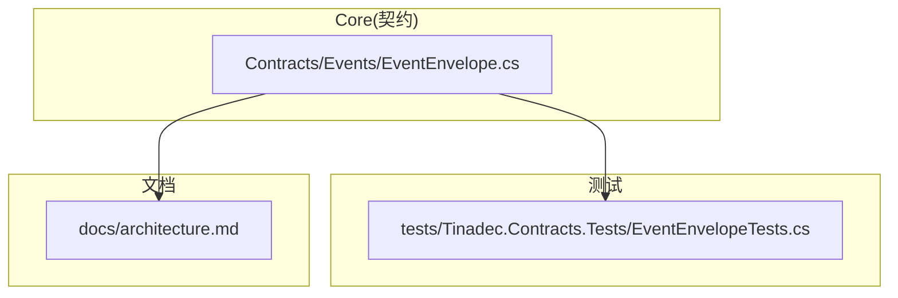
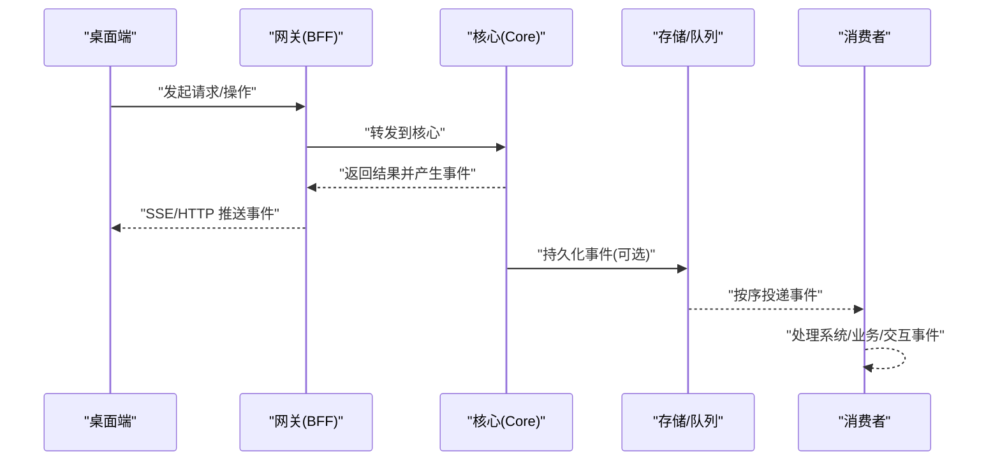
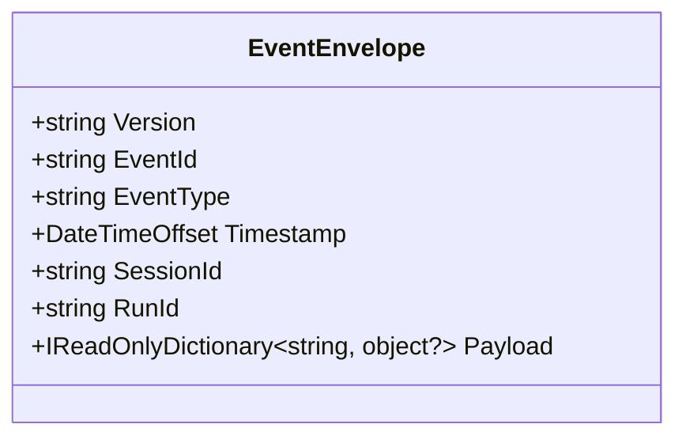
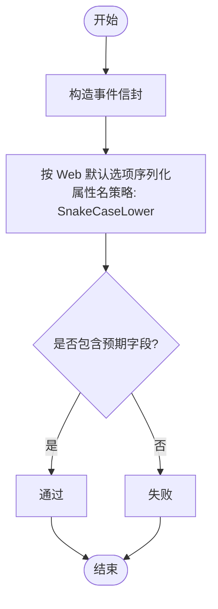
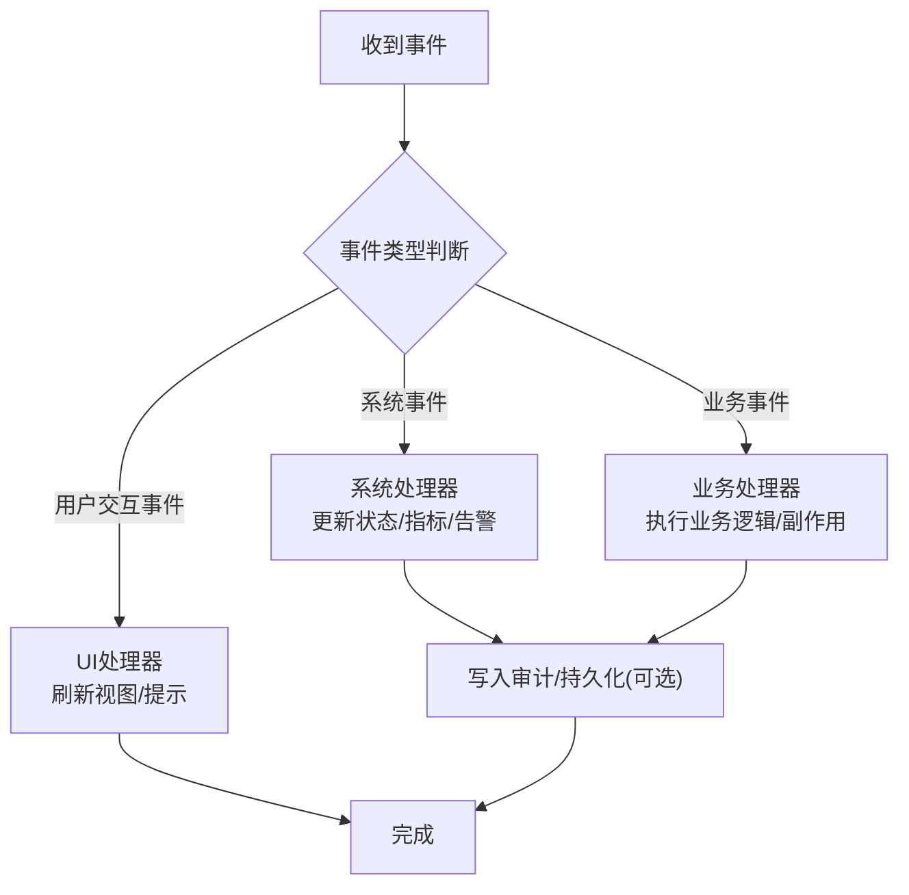
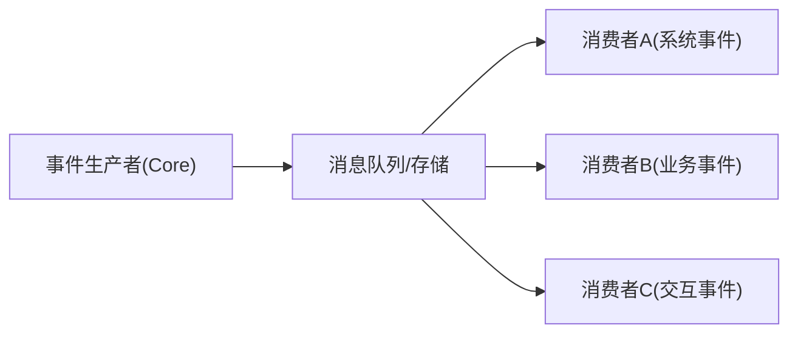
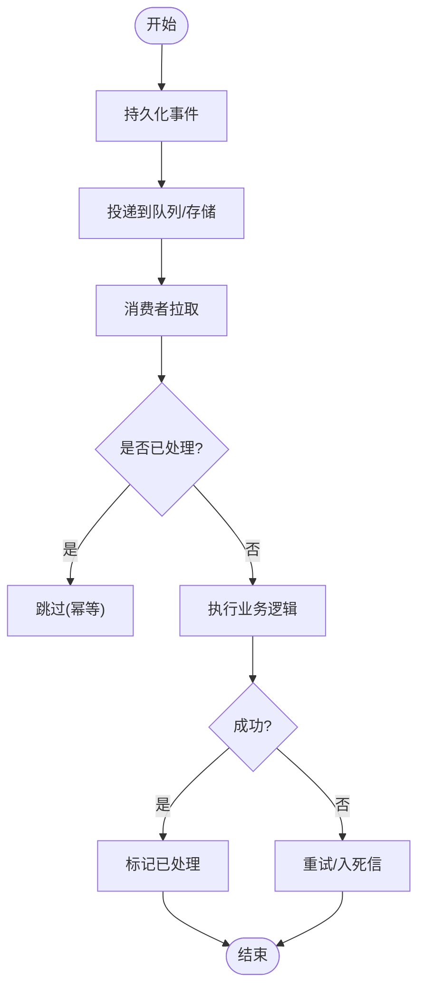
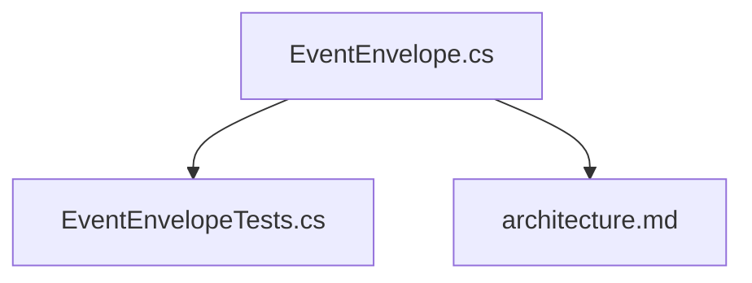

# 事件驱动架构

<cite>
**本文引用的文件**   
- [EventEnvelope.cs](file://TinadecCore/Contracts/Events/EventEnvelope.cs)
- [EventEnvelopeTests.cs](file://tests/Tinadec.Contracts.Tests/EventEnvelopeTests.cs)
- [architecture.md](file://docs/architecture.md)
</cite>

## 目录
1. [简介](#简介)
2. [项目结构](#项目结构)
3. [核心组件](#核心组件)
4. [架构总览](#架构总览)
5. [详细组件分析](#详细组件分析)
6. [依赖关系分析](#依赖关系分析)
7. [性能考量](#性能考量)
8. [故障排查指南](#故障排查指南)
9. [结论](#结论)
10. [附录](#附录)

## 简介
本文件面向 TinadecOffice 的事件驱动架构，聚焦以下目标：
- 解释 EventEnvelope 事件格式的设计要点（版本控制、事件类型与负载结构）。
- 说明发布订阅模式在系统中的角色分工（生产者、消费者、消息队列）及实现思路。
- 分类阐述系统事件、业务事件、用户交互事件的处理流程。
- 给出事件持久化、重放机制与故障恢复策略建议。
- 提供创建、发送、消费事件的示例路径与调试监控方法（追踪、日志、性能分析）。

## 项目结构
当前仓库中，事件契约定义位于 Core 的 Contracts 层，测试位于 tests 目录，架构文档对事件信封有高层描述。

图表来源
- [EventEnvelope.cs:1-33](file://TinadecCore/Contracts/Events/EventEnvelope.cs#L1-L33)
- [EventEnvelopeTests.cs:1-31](file://tests/Tinadec.Contracts.Tests/EventEnvelopeTests.cs#L1-L31)
- [architecture.md:51-68](file://docs/architecture.md#L51-L68)

章节来源
- [EventEnvelope.cs:1-33](file://TinadecCore/Contracts/Events/EventEnvelope.cs#L1-L33)
- [EventEnvelopeTests.cs:1-31](file://tests/Tinadec.Contracts.Tests/EventEnvelopeTests.cs#L1-L31)
- [architecture.md:51-68](file://docs/architecture.md#L51-L68)

## 核心组件
- EventEnvelope：统一的事件信封，包含版本、事件标识、事件类型、时间戳、会话/运行上下文以及负载字典。采用 snake_case 序列化约定，便于跨语言边界传输。
- 测试用例：验证事件信封序列化为 snake_case 字段，确保 API 边界一致性。

章节来源
- [EventEnvelope.cs:1-33](file://TinadecCore/Contracts/Events/EventEnvelope.cs#L1-L33)
- [EventEnvelopeTests.cs:1-31](file://tests/Tinadec.Contracts.Tests/EventEnvelopeTests.cs#L1-L31)

## 架构总览
从架构文档可知，所有运行时事件使用统一信封格式，并在 Gateway/Desktop/Core 之间通过 HTTP/SSE 等通道进行传递。事件作为“唯一状态权威”的辅助手段，用于可观测性与回放能力。

图表来源
- [architecture.md:51-68](file://docs/architecture.md#L51-L68)

章节来源
- [architecture.md:51-68](file://docs/architecture.md#L51-L68)

## 详细组件分析

### 事件信封 EventEnvelope
- 版本控制：固定 SchemaVersion，默认 Version 字段使用该常量，便于未来演进兼容。
- 事件标识：event_id 全局唯一，便于追踪与去重。
- 事件类型：event_type 区分不同语义（系统、业务、交互）。
- 时间戳：timestamp 记录 UTC 时间，保证时序一致。
- 上下文：session_id/run_id 关联会话与运行实例，便于聚合与定位。
- 负载：payload 为键值字典，承载具体业务数据；API 边界使用 snake_case 序列化。

图表来源
- [EventEnvelope.cs:1-33](file://TinadecCore/Contracts/Events/EventEnvelope.cs#L1-L33)

章节来源
- [EventEnvelope.cs:1-33](file://TinadecCore/Contracts/Events/EventEnvelope.cs#L1-L33)

### 事件序列化与命名约定
- 测试覆盖：验证 JSON 序列化时字段名遵循 snake_case 约定，包括 payload 中的键也遵循该策略。
- 影响：确保前后端或跨服务间对事件字段的解析一致，避免歧义。

图表来源
- [EventEnvelopeTests.cs:1-31](file://tests/Tinadec.Contracts.Tests/EventEnvelopeTests.cs#L1-L31)

章节来源
- [EventEnvelopeTests.cs:1-31](file://tests/Tinadec.Contracts.Tests/EventEnvelopeTests.cs#L1-L31)

### 事件类型与处理流程
根据架构文档，事件信封包含 type 字段，可用于区分事件类别。结合系统设计，常见分类如下：
- 系统事件：生命周期、健康检查、资源变更等。
- 业务事件：工具执行、模型调用、审批决策等。
- 用户交互事件：界面操作、面板状态、用户输入等。

图表来源
- [architecture.md:51-68](file://docs/architecture.md#L51-L68)

章节来源
- [architecture.md:51-68](file://docs/architecture.md#L51-L68)

### 发布订阅模式与消息队列
- 生产者：Core 在服务编排过程中产生事件，封装为 EventEnvelope 后投递。
- 消费者：各子系统订阅感兴趣的事件类型，按序处理并更新本地状态或触发副作用。
- 消息队列：可采用内存队列、文件队列或外部消息中间件；需支持至少一次投递与顺序性保障。

[此图为概念示意，不直接映射具体代码文件]

### 事件持久化、重放与故障恢复
- 持久化：建议在事件落库或写入不可变日志流，保留 event_id、timestamp、session_id/run_id、payload 等关键字段。
- 重放：基于持久化事件源，按 timestamp/event_id 排序重放，用于重建状态或回溯问题。
- 故障恢复：
  - 幂等处理：消费者依据 event_id 去重，避免重复处理。
  - 重试与死信：失败事件进入重试队列，超过阈值转入死信队列人工干预。
  - 补偿：对已发生但失败的副作用进行补偿操作。

[此图为概念示意，不直接映射具体代码文件]

### 事件监控与调试
- 追踪：利用 OpenTelemetry 收集 span，导出 NDJSON 并通过 Debug API 查询。
- 日志：对事件生产、投递、消费全链路打点，记录关键上下文（session_id/run_id/trace_id）。
- 性能：统计事件吞吐、延迟、积压量，设置告警阈值。
- 前端：Debug Studio 提供实时事件流、时间线与指标看板。

章节来源
- [architecture.md:140-172](file://docs/architecture.md#L140-L172)

## 依赖关系分析
- EventEnvelope 被测试用例引用，确保序列化行为稳定。
- 架构文档定义了事件信封的通用结构与用途，指导上层集成。

图表来源
- [EventEnvelope.cs:1-33](file://TinadecCore/Contracts/Events/EventEnvelope.cs#L1-L33)
- [EventEnvelopeTests.cs:1-31](file://tests/Tinadec.Contracts.Tests/EventEnvelopeTests.cs#L1-L31)
- [architecture.md:51-68](file://docs/architecture.md#L51-L68)

章节来源
- [EventEnvelope.cs:1-33](file://TinadecCore/Contracts/Events/EventEnvelope.cs#L1-L33)
- [EventEnvelopeTests.cs:1-31](file://tests/Tinadec.Contracts.Tests/EventEnvelopeTests.cs#L1-L31)
- [architecture.md:51-68](file://docs/architecture.md#L51-L68)

## 性能考量
- 序列化开销：payload 字典应避免过大对象，必要时拆分事件或异步落盘。
- 投递顺序：在高并发下保持顺序性需要分区或分片策略。
- 背压与限流：消费者应实现背压，防止积压导致内存膨胀。
- 监控指标：关注事件延迟、吞吐、错误率与队列长度。

[本节为通用指导，不直接分析具体文件]

## 故障排查指南
- 常见问题：
  - 事件丢失：检查持久化与队列可用性，确认消费者是否成功提交偏移。
  - 重复处理：确认消费者幂等性，核对 event_id 去重逻辑。
  - 乱序：检查分区键与顺序策略，确保同一会话/运行的事件在同一分区。
- 诊断步骤：
  - 通过 Debug API 查询 trace/metrics，定位异常 span。
  - 查看事件日志与持久化记录，比对时间戳与事件类型。
  - 复现问题并回放相关事件，验证修复效果。

章节来源
- [architecture.md:140-172](file://docs/architecture.md#L140-L172)

## 结论
EventEnvelope 提供了统一、可扩展且跨语言友好的事件契约，配合发布订阅与持久化重放，可实现高内聚、低耦合的事件驱动架构。建议在后续迭代中完善消息队列、消费者幂等与监控告警，以支撑大规模事件流转与可靠处理。

[本节为总结，不直接分析具体文件]

## 附录
- 事件创建示例路径：参考测试中对事件构造与序列化的用法。
- 事件发送示例路径：参考 Core 中产生事件并投递至队列/存储的位置。
- 事件消费示例路径：参考各消费者订阅事件类型并处理的实现位置。

章节来源
- [EventEnvelopeTests.cs:1-31](file://tests/Tinadec.Contracts.Tests/EventEnvelopeTests.cs#L1-L31)
- [architecture.md:51-68](file://docs/architecture.md#L51-L68)