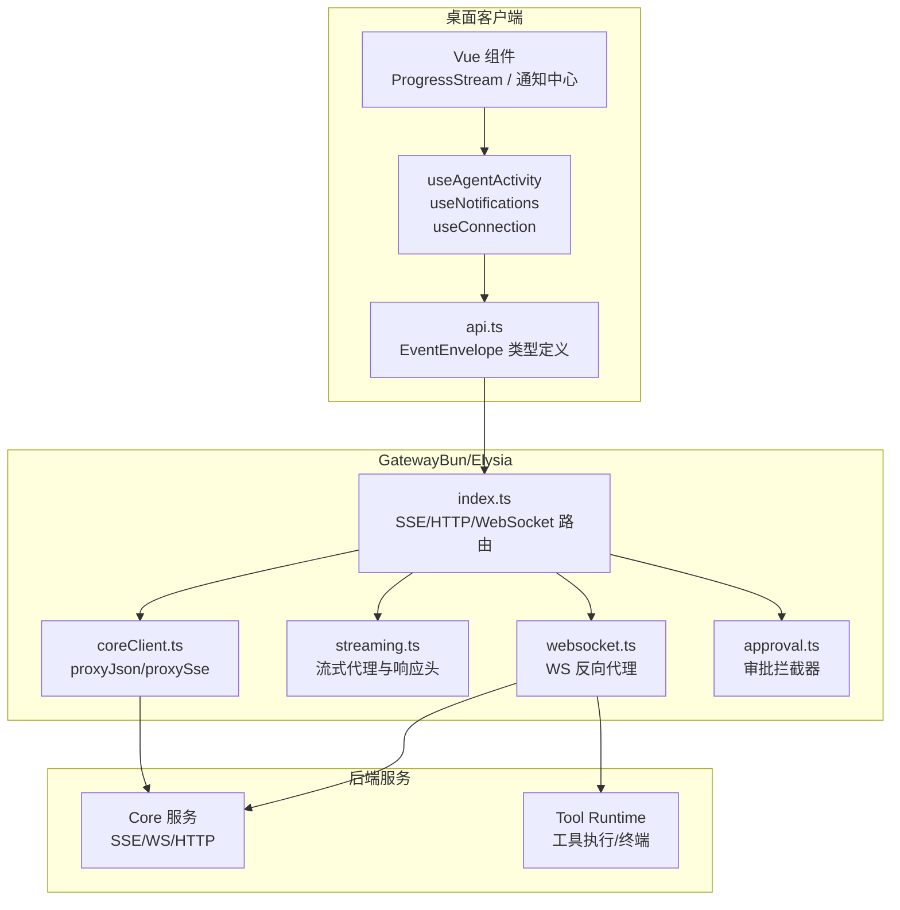
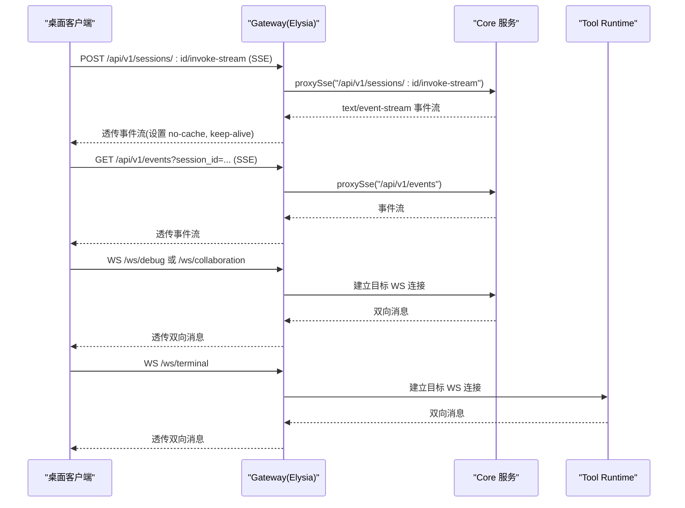
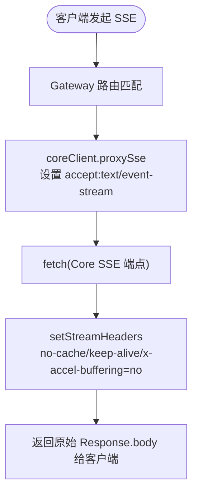
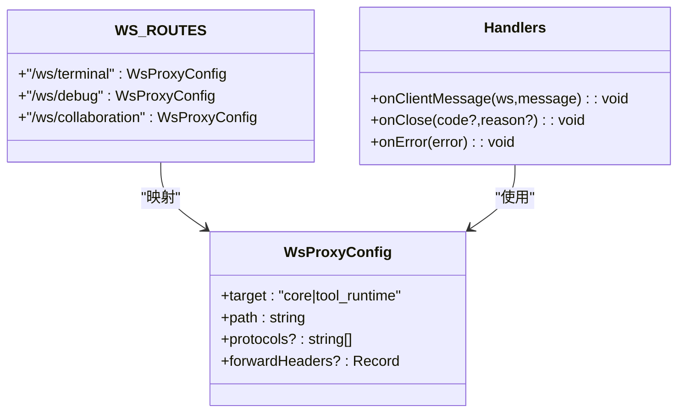
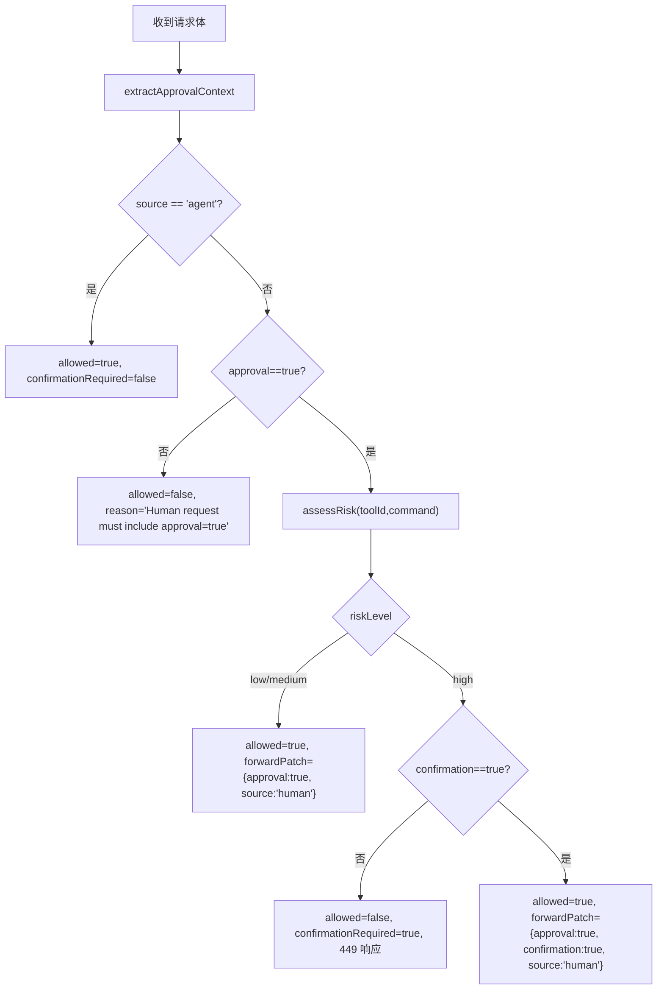
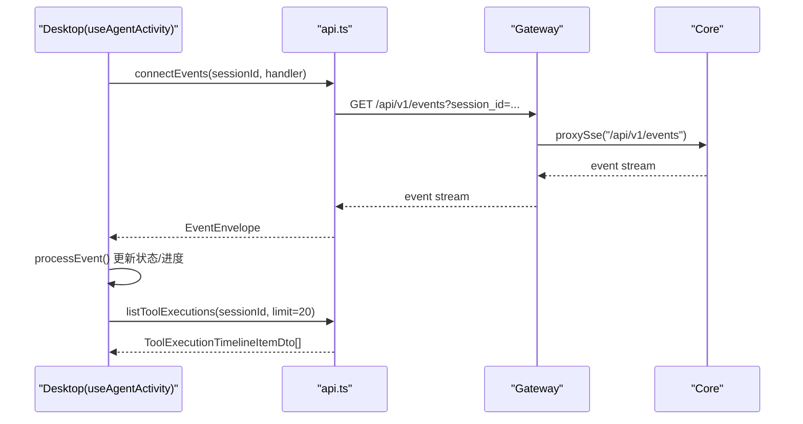
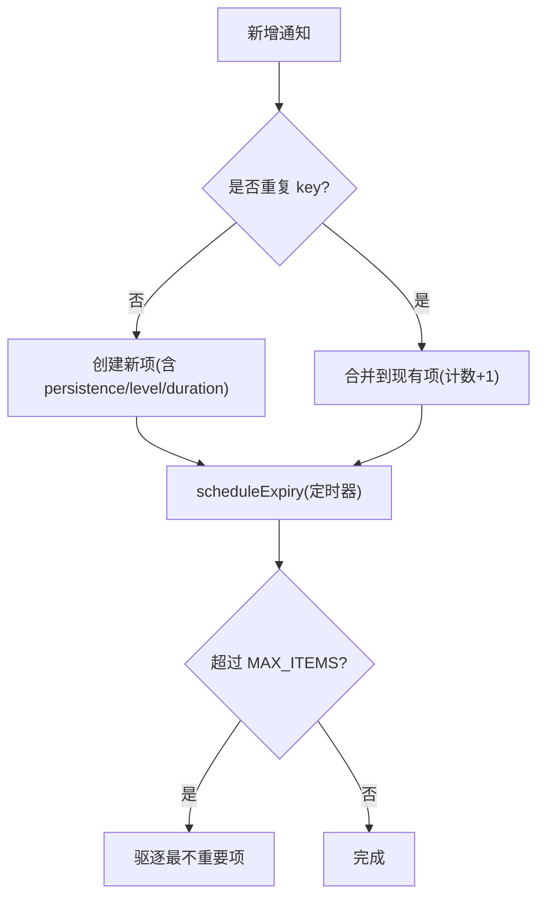
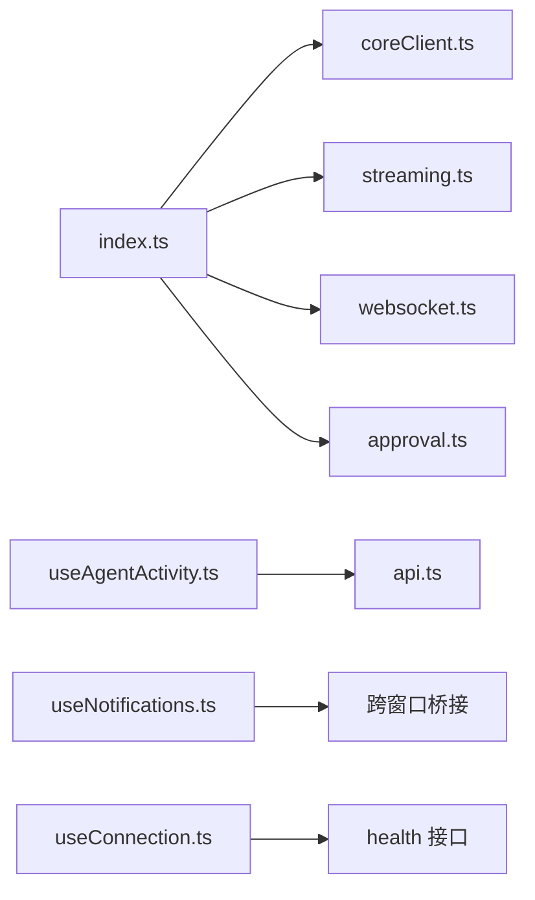

# 实时通信机制

<cite>
**本文引用的文件**   
- [TinadecGateway/src/index.ts](file://TinadecGateway/src/index.ts)
- [TinadecGateway/src/coreClient.ts](file://TinadecGateway/src/coreClient.ts)
- [TinadecGateway/src/streaming.ts](file://TinadecGateway/src/streaming.ts)
- [TinadecGateway/src/websocket.ts](file://TinadecGateway/src/websocket.ts)
- [TinadecGateway/src/approval.ts](file://TinadecGateway/src/approval.ts)
- [apps/desktop/src/api.ts](file://apps/desktop/src/api.ts)
- [apps/desktop/src/composables/useAgentActivity.ts](file://apps/desktop/src/composables/useAgentActivity.ts)
- [apps/desktop/src/components/chat/ProgressStream.vue](file://apps/desktop/src/components/chat/ProgressStream.vue)
- [apps/desktop/src/composables/useNotifications.ts](file://apps/desktop/src/composables/useNotifications.ts)
- [apps/desktop/src/composables/useConnection.ts](file://apps/desktop/src/composables/useConnection.ts)
</cite>

## 目录
1. [简介](#简介)
2. [项目结构](#项目结构)
3. [核心组件](#核心组件)
4. [架构总览](#架构总览)
5. [详细组件分析](#详细组件分析)
6. [依赖关系分析](#依赖关系分析)
7. [性能与优化](#性能与优化)
8. [故障排查指南](#故障排查指南)
9. [结论](#结论)
10. [附录：客户端与服务端实现要点](#附录客户端与服务端实现要点)

## 简介
本文件系统性阐述 TinadecOffice 的实时通信机制，覆盖以下方面：
- SSE（Server-Sent Events）与 WebSocket 的使用场景、路由与代理实现
- 调试事件流的建立与维护：连接管理、心跳检测、断线重连
- 工具执行进度的实时更新：进度通知、状态变更、结果推送
- 审批通知的实时传递：审批请求、决策反馈、状态同步
- 连接优化策略：连接池管理、消息压缩、带宽控制

## 项目结构
实时通信相关代码主要分布在两个位置：
- Gateway（Bun/Elysia）：统一协议入口，负责 HTTP/SSE/WebSocket/流式转发、鉴权、审批拦截
- Desktop（Electron/Vue）：SSE 客户端、事件处理、UI 展示、通知系统、连接健康检查

**图表来源** 
- [TinadecGateway/src/index.ts:231-286](file://TinadecGateway/src/index.ts#L231-L286)
- [TinadecGateway/src/coreClient.ts:38-101](file://TinadecGateway/src/coreClient.ts#L38-L101)
- [TinadecGateway/src/streaming.ts:25-53](file://TinadecGateway/src/streaming.ts#L25-L53)
- [TinadecGateway/src/websocket.ts:51-67](file://TinadecGateway/src/websocket.ts#L51-L67)
- [apps/desktop/src/api.ts:274-285](file://apps/desktop/src/api.ts#L274-L285)

**章节来源**
- [TinadecGateway/src/index.ts:1-120](file://TinadecGateway/src/index.ts#L1-L120)
- [apps/desktop/src/api.ts:274-285](file://apps/desktop/src/api.ts#L274-L285)

## 核心组件
- Gateway 路由与协议转换：统一暴露 SSE、WebSocket、HTTP 接口，并转发到 Core/Tool Runtime
- SSE 代理：将 Core 的事件流透传到客户端，设置合适的响应头以禁用缓冲
- WebSocket 代理：为终端、调试、协作提供双向通道
- 审批拦截器：对高风险命令进行二次确认，保证人类操作安全
- 客户端事件处理：解析 EventEnvelope，更新活动状态、工具调用时间线、思考步骤与进度事件
- 通知系统：跨窗口状态广播、任务生命周期、自动过期与去重
- 连接健康检查：轮询后端健康，超时与断开状态管理

**章节来源**
- [TinadecGateway/src/index.ts:231-286](file://TinadecGateway/src/index.ts#L231-L286)
- [TinadecGateway/src/streaming.ts:42-53](file://TinadecGateway/src/streaming.ts#L42-L53)
- [TinadecGateway/src/websocket.ts:51-67](file://TinadecGateway/src/websocket.ts#L51-L67)
- [TinadecGateway/src/approval.ts:145-197](file://TinadecGateway/src/approval.ts#L145-L197)
- [apps/desktop/src/composables/useAgentActivity.ts:640-654](file://apps/desktop/src/composables/useAgentActivity.ts#L640-L654)
- [apps/desktop/src/composables/useNotifications.ts:557-592](file://apps/desktop/src/composables/useNotifications.ts#L557-L592)
- [apps/desktop/src/composables/useConnection.ts:96-128](file://apps/desktop/src/composables/useConnection.ts#L96-L128)

## 架构总览
Gateway 作为 BFF/API 层，承担认证、协议转换、流式转发与审批拦截。客户端通过 SSE 订阅事件流，通过 WebSocket 进行交互式通信（终端、调试、协作）。

**图表来源** 
- [TinadecGateway/src/index.ts:231-286](file://TinadecGateway/src/index.ts#L231-L286)
- [TinadecGateway/src/coreClient.ts:93-101](file://TinadecGateway/src/coreClient.ts#L93-L101)
- [TinadecGateway/src/websocket.ts:51-67](file://TinadecGateway/src/websocket.ts#L51-L67)

## 详细组件分析

### SSE 事件流与代理
- 服务端路由：
  - 会话级 invoke-stream：POST /api/v1/sessions/:sessionId/invoke-stream，返回 SSE
  - 全局事件流：GET /api/v1/events?session_id=...，返回 SSE
- 代理实现：
  - coreClient.proxySse：设置 accept=text/event-stream，透传 fetch 响应体
  - streaming.setStreamHeaders：设置 no-cache、keep-alive、x-accel-buffering=no，避免中间层缓冲

**图表来源** 
- [TinadecGateway/src/index.ts:231-286](file://TinadecGateway/src/index.ts#L231-L286)
- [TinadecGateway/src/coreClient.ts:93-101](file://TinadecGateway/src/coreClient.ts#L93-L101)
- [TinadecGateway/src/streaming.ts:42-53](file://TinadecGateway/src/streaming.ts#L42-L53)

**章节来源**
- [TinadecGateway/src/index.ts:231-286](file://TinadecGateway/src/index.ts#L231-L286)
- [TinadecGateway/src/coreClient.ts:93-101](file://TinadecGateway/src/coreClient.ts#L93-L101)
- [TinadecGateway/src/streaming.ts:42-53](file://TinadecGateway/src/streaming.ts#L42-L53)

### WebSocket 代理（终端、调试、协作）
- 路由映射：
  - /ws/terminal → Tool Runtime
  - /ws/debug → Core Debug Studio
  - /ws/collaboration → Core
- 代理逻辑：
  - buildTargetWsUrl：根据 target(core/tool_runtime) 构建 ws/wss URL
  - createWsProxyHandlers：在客户端与目标之间双向透传消息，关闭/错误时清理连接

**图表来源** 
- [TinadecGateway/src/websocket.ts:21-30](file://TinadecGateway/src/websocket.ts#L21-L30)
- [TinadecGateway/src/websocket.ts:51-67](file://TinadecGateway/src/websocket.ts#L51-L67)
- [TinadecGateway/src/websocket.ts:93-139](file://TinadecGateway/src/websocket.ts#L93-L139)

**章节来源**
- [TinadecGateway/src/websocket.ts:51-67](file://TinadecGateway/src/websocket.ts#L51-L67)
- [TinadecGateway/src/websocket.ts:93-139](file://TinadecGateway/src/websocket.ts#L93-L139)

### 审批拦截器（高风险命令二次确认）
- 流程：
  - 提取审批上下文（source、approval、confirmation、toolId/command/cwd）
  - 评估风险等级（high/medium/low），基于工具 ID 与命令文本
  - Agent 请求不拦截；人类低风险/中风险直接通过；高风险需 confirmation=true
  - 需要确认时返回 449 响应，包含警告信息供 UI 弹窗
  - 通过后合并 forwardPatch（approval=true/confirmation=true/source='human'）再转发

**图表来源** 
- [TinadecGateway/src/approval.ts:91-110](file://TinadecGateway/src/approval.ts#L91-L110)
- [TinadecGateway/src/approval.ts:115-133](file://TinadecGateway/src/approval.ts#L115-L133)
- [TinadecGateway/src/approval.ts:145-197](file://TinadecGateway/src/approval.ts#L145-L197)
- [TinadecGateway/src/approval.ts:203-224](file://TinadecGateway/src/approval.ts#L203-L224)

**章节来源**
- [TinadecGateway/src/approval.ts:145-197](file://TinadecGateway/src/approval.ts#L145-L197)
- [TinadecGateway/src/index.ts:351-400](file://TinadecGateway/src/index.ts#L351-L400)

### 客户端事件处理与进度更新
- useAgentActivity：
  - 通过 api.connectEvents(sessionId, handler) 建立 SSE 连接
  - 解析 EventEnvelope，更新 activity、toolCalls、thinkingSteps、progressEvents
  - 当事件类型为 tool.*、approval.*、step.*、task.* 时，触发 refreshToolExecutions 拉取最新执行记录
- ProgressStream.vue：
  - 渲染最近 5 条或全部 progressEvents，支持展开/收起
  - 显示图标、消息、时间戳，按 seq 排序

**图表来源** 
- [apps/desktop/src/composables/useAgentActivity.ts:640-654](file://apps/desktop/src/composables/useAgentActivity.ts#L640-L654)
- [apps/desktop/src/composables/useAgentActivity.ts:540-565](file://apps/desktop/src/composables/useAgentActivity.ts#L540-L565)
- [apps/desktop/src/components/chat/ProgressStream.vue:39-46](file://apps/desktop/src/components/chat/ProgressStream.vue#L39-L46)

**章节来源**
- [apps/desktop/src/composables/useAgentActivity.ts:640-654](file://apps/desktop/src/composables/useAgentActivity.ts#L640-L654)
- [apps/desktop/src/components/chat/ProgressStream.vue:39-46](file://apps/desktop/src/components/chat/ProgressStream.vue#L39-L46)

### 通知系统与跨窗口状态同步
- Notification 系统：
  - 支持 transient/status/task 三类通知，具备自动过期、用户可关闭、持久化等特性
  - 通过 StatusBroadcast 在多个渲染窗口间同步 status 类通知
- 连接健康检查：
  - useConnection 周期性轮询 health 接口，维护 connecting/connected/timeout/disconnected 状态机

**图表来源** 
- [apps/desktop/src/composables/useNotifications.ts:433-483](file://apps/desktop/src/composables/useNotifications.ts#L433-L483)
- [apps/desktop/src/composables/useNotifications.ts:557-592](file://apps/desktop/src/composables/useNotifications.ts#L557-L592)
- [apps/desktop/src/composables/useConnection.ts:96-128](file://apps/desktop/src/composables/useConnection.ts#L96-L128)

**章节来源**
- [apps/desktop/src/composables/useNotifications.ts:433-483](file://apps/desktop/src/composables/useNotifications.ts#L433-L483)
- [apps/desktop/src/composables/useNotifications.ts:557-592](file://apps/desktop/src/composables/useNotifications.ts#L557-L592)
- [apps/desktop/src/composables/useConnection.ts:96-128](file://apps/desktop/src/composables/useConnection.ts#L96-L128)

## 依赖关系分析
- Gateway 依赖 coreClient 进行 JSON/SSE/流式代理
- Gateway 依赖 streaming 设置响应头与流式转发
- Gateway 依赖 websocket 进行 WS 反向代理
- Gateway 依赖 approval 进行审批拦截
- 客户端依赖 api.ts 的类型定义与 SSE 连接方法
- 客户端 useAgentActivity 依赖 api.connectEvents 与 listToolExecutions
- 客户端 useNotifications 提供跨窗口状态同步
- 客户端 useConnection 提供健康检查与状态机

**图表来源** 
- [TinadecGateway/src/index.ts:23-51](file://TinadecGateway/src/index.ts#L23-L51)
- [TinadecGateway/src/coreClient.ts:1-110](file://TinadecGateway/src/coreClient.ts#L1-L110)
- [TinadecGateway/src/streaming.ts:1-54](file://TinadecGateway/src/streaming.ts#L1-L54)
- [TinadecGateway/src/websocket.ts:1-140](file://TinadecGateway/src/websocket.ts#L1-L140)
- [TinadecGateway/src/approval.ts:1-235](file://TinadecGateway/src/approval.ts#L1-L235)
- [apps/desktop/src/composables/useAgentActivity.ts:1-697](file://apps/desktop/src/composables/useAgentActivity.ts#L1-L697)
- [apps/desktop/src/api.ts:274-285](file://apps/desktop/src/api.ts#L274-L285)
- [apps/desktop/src/composables/useNotifications.ts:557-592](file://apps/desktop/src/composables/useNotifications.ts#L557-L592)
- [apps/desktop/src/composables/useConnection.ts:96-128](file://apps/desktop/src/composables/useConnection.ts#L96-L128)

**章节来源**
- [TinadecGateway/src/index.ts:23-51](file://TinadecGateway/src/index.ts#L23-L51)
- [apps/desktop/src/composables/useAgentActivity.ts:640-654](file://apps/desktop/src/composables/useAgentActivity.ts#L640-L654)

## 性能与优化
- 连接池管理
  - Gateway 侧：WS 代理为每个客户端连接创建独立的目标连接，建议结合进程内连接池复用（如 Bun WebSocket 客户端池）
  - 客户端侧：SSE 单连接，避免多实例重复连接；useConnection 使用单一轮询实例
- 消息压缩
  - 在 Gateway 层启用 gzip/br 压缩（Elysia 中间件或上游代理配置）
  - SSE 事件体尽量精简，仅携带必要字段（type、seq、ts、payload 摘要）
- 带宽控制
  - 限制事件流速率：服务端侧对高频事件做节流（如合并 step.result.created）
  - 客户端侧对列表数据分页加载（listToolExecutions limit=20）
  - 使用 no-cache、keep-alive、x-accel-buffering=no 避免中间缓存与缓冲
- 心跳与重连
  - 客户端 useConnection 定期轮询 health 接口，超时进入 timeout 状态后继续轮询
  - SSE 断线重连：建议在客户端捕获 onerror/onclose，指数退避重连
  - WS 断线重连：在 createWsProxyHandlers 中增加重试逻辑与最大重试次数

[本节为通用指导，无需具体文件引用]

## 故障排查指南
- SSE 无法接收事件
  - 检查 Gateway 是否正确设置 content-type=text/event-stream 与 no-cache
  - 确认 Core 端点可达，proxySse 返回非空 body
- WS 连接失败
  - 检查 WS_ROUTES 映射是否正确
  - 确认目标服务 wsUrl 构建正确（http→ws）
- 审批拦截误判
  - 检查 approvalCtx 提取是否正确（source/approval/confirmation/toolId/command）
  - 高风险工具集合是否包含目标工具 ID
- 事件丢失或重复
  - 客户端侧对 progressEvents 使用 id 去重（seq-type）
  - 通知系统使用 key 去重与合并计数

**章节来源**
- [TinadecGateway/src/index.ts:231-286](file://TinadecGateway/src/index.ts#L231-L286)
- [TinadecGateway/src/websocket.ts:51-67](file://TinadecGateway/src/websocket.ts#L51-L67)
- [TinadecGateway/src/approval.ts:91-110](file://TinadecGateway/src/approval.ts#L91-L110)
- [apps/desktop/src/composables/useAgentActivity.ts:178-190](file://apps/desktop/src/composables/useAgentActivity.ts#L178-L190)

## 结论
TinadecOffice 的实时通信机制以 Gateway 为核心，统一承载 SSE 与 WebSocket 的代理与协议转换，配合客户端的事件处理与通知系统，实现了高效的工具执行进度更新与审批通知传递。通过合理的连接管理、压缩与带宽控制，以及健壮的心跳与重连策略，系统在稳定性与性能上具备良好表现。

[本节为总结性内容，无需具体文件引用]

## 附录：客户端与服务端实现要点
- 服务端（Gateway）
  - SSE：使用 proxySse 透传 Core 事件流，设置必要的响应头
  - WS：通过 WS_ROUTES 映射到 Core/Tool Runtime，createWsProxyHandlers 实现双向透传
  - 审批拦截：extractApprovalContext + evaluateApproval + applyForwardPatch
- 客户端（Desktop）
  - SSE：api.connectEvents 建立连接，useAgentActivity 解析 EventEnvelope 并更新状态
  - 进度展示：ProgressStream.vue 渲染最近事件，支持展开查看历史
  - 通知系统：useNotifications 提供跨窗口状态同步与任务生命周期管理
  - 连接健康：useConnection 轮询 health，维护连接状态机

**章节来源**
- [TinadecGateway/src/index.ts:231-286](file://TinadecGateway/src/index.ts#L231-L286)
- [TinadecGateway/src/coreClient.ts:93-101](file://TinadecGateway/src/coreClient.ts#L93-L101)
- [TinadecGateway/src/websocket.ts:51-67](file://TinadecGateway/src/websocket.ts#L51-L67)
- [TinadecGateway/src/approval.ts:145-197](file://TinadecGateway/src/approval.ts#L145-L197)
- [apps/desktop/src/composables/useAgentActivity.ts:640-654](file://apps/desktop/src/composables/useAgentActivity.ts#L640-L654)
- [apps/desktop/src/components/chat/ProgressStream.vue:39-46](file://apps/desktop/src/components/chat/ProgressStream.vue#L39-L46)
- [apps/desktop/src/composables/useNotifications.ts:557-592](file://apps/desktop/src/composables/useNotifications.ts#L557-L592)
- [apps/desktop/src/composables/useConnection.ts:96-128](file://apps/desktop/src/composables/useConnection.ts#L96-L128)