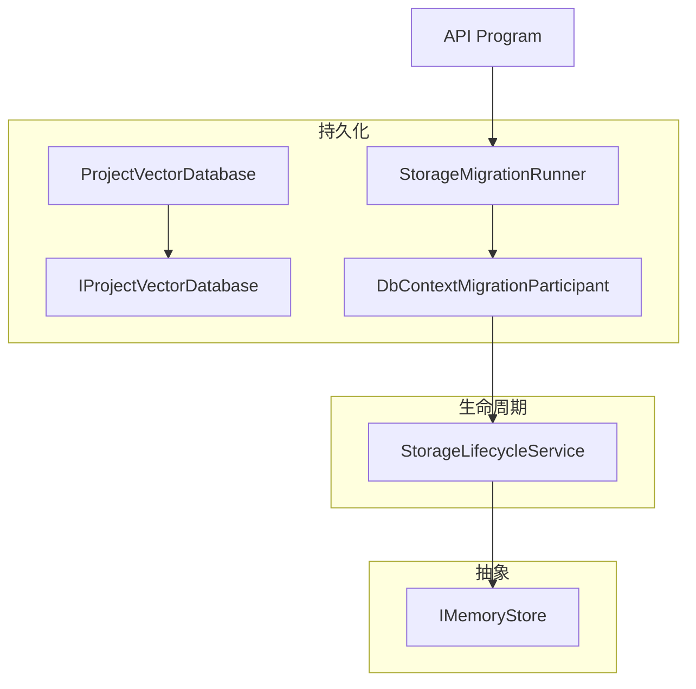
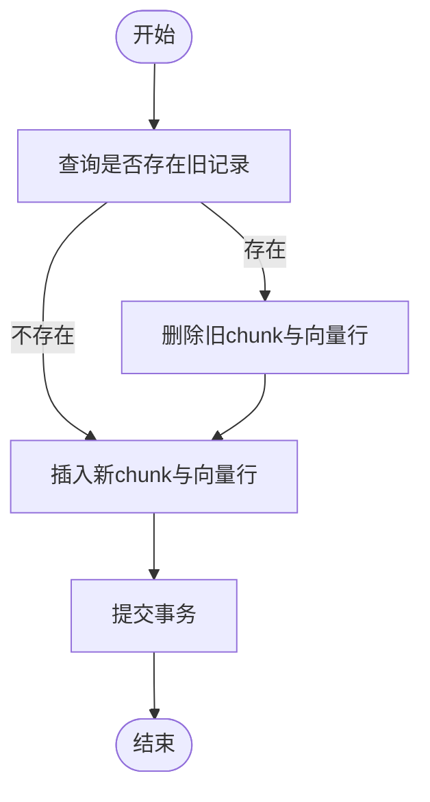
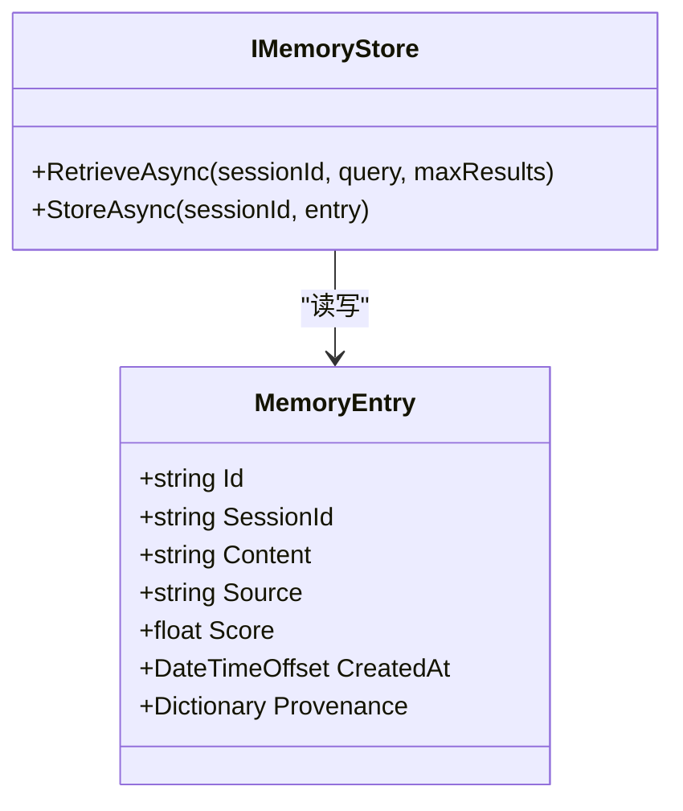
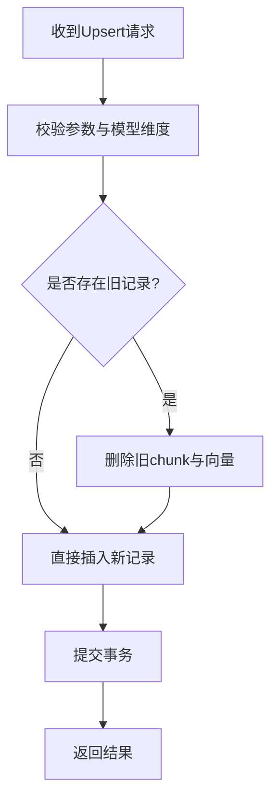
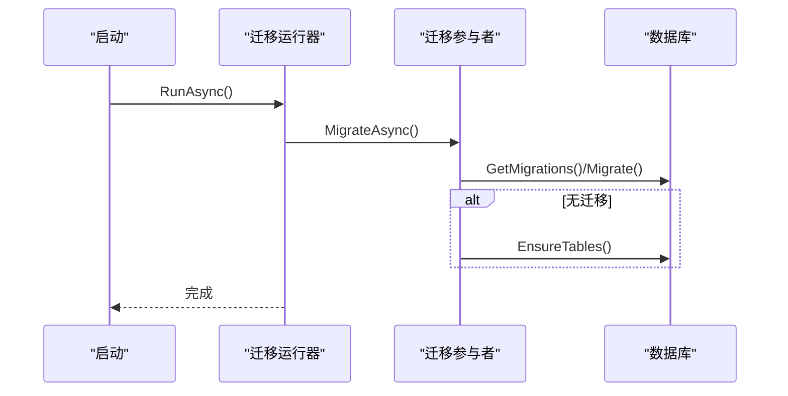
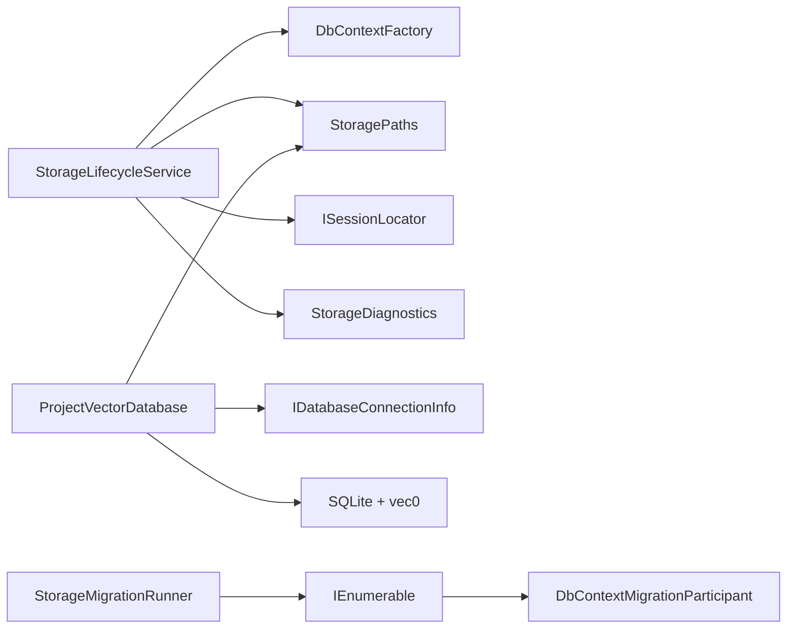

# 数据一致性保证

<cite>
**本文引用的文件**   
- [StorageMigration.cs](file://TinadecCore\Persistence\StorageMigration.cs)
- [ProjectVectorDatabase.cs](file://TinadecCore\Persistence\ProjectVectorDatabase.cs)
- [IProjectVectorDatabase.cs](file://TinadecCore\Persistence\IProjectVectorDatabase.cs)
- [DbContextMigrationParticipant.cs](file://TinadecCore\Persistence\DbContextMigrationParticipant.cs)
- [StorageLifecycleService.cs](file://TinadecCore\Lifecycle\StorageLifecycleService.cs)
- [IMemoryStore.cs](file://TinadecCore\Abstractions\Ports\IMemoryStore.cs)
- [Program.cs](file://TinadecCore\Api\Program.cs)
- [StorageEndpoints.cs](file://TinadecCore\Api\Endpoints\StorageEndpoints.cs)
</cite>

## 目录
1. [简介](#简介)
2. [项目结构](#项目结构)
3. [核心组件](#核心组件)
4. [架构总览](#架构总览)
5. [详细组件分析](#详细组件分析)
6. [依赖关系分析](#依赖关系分析)
7. [性能考量](#性能考量)
8. [故障排查指南](#故障排查指南)
9. [结论](#结论)
10. [附录](#附录)

## 简介
本文件聚焦 TinadecOffice 的数据一致性保障机制，围绕事务管理（数据库事务、分布式/补偿事务）、缓存策略（本地/分布式与失效策略）、冲突解决（乐观锁/悲观锁/冲突检测）、数据迁移与版本管理（向后兼容、数据转换、回滚），以及监控与诊断（事务跟踪、缓存命中率、冲突统计）进行系统化说明。文档同时提供代码级图示与路径引用，帮助读者快速定位实现细节。

## 项目结构
与数据一致性相关的关键模块集中在 Persistence、Lifecycle、Abstractions.Ports 等命名空间下：
- 持久化层：向量数据库、迁移参与者、存储配置
- 生命周期层：运行记录、事件追加与回放、索引重建
- 抽象接口：内存存储、会话定位等



图表来源
- [ProjectVectorDatabase.cs:1-174](file://TinadecCore\Persistence\ProjectVectorDatabase.cs#L1-L174)
- [IProjectVectorDatabase.cs:1-57](file://TinadecCore\Persistence\IProjectVectorDatabase.cs#L1-L57)
- [DbContextMigrationParticipant.cs:1-37](file://TinadecCore\Persistence\DbContextMigrationParticipant.cs#L1-L37)
- [StorageMigration.cs:1-41](file://TinadecCore\Persistence\StorageMigration.cs#L1-L41)
- [StorageLifecycleService.cs:1-291](file://TinadecCore\Lifecycle\StorageLifecycleService.cs#L1-L291)
- [IMemoryStore.cs:1-31](file://TinadecCore\Abstractions\Ports\IMemoryStore.cs#L1-L31)
- [Program.cs:36-50](file://TinadecCore\Api\Program.cs#L36-L50)

章节来源
- [Program.cs:36-50](file://TinadecCore\Api\Program.cs#L36-L50)
- [StorageMigration.cs:1-41](file://TinadecCore\Persistence\StorageMigration.cs#L1-L41)

## 核心组件
- 存储迁移协调器：统一触发各业务模块的迁移，支持按提供者开关与启动时应用策略。
- 向量数据库实现：基于 SQLite + vec0 扩展，提供 Upsert/Search/Delete 原子操作与集合维度校验。
- 生命周期服务：维护 Run 状态、追加事件到 JSONL 并更新索引，支持回放与重建。
- 内存存储抽象：定义会话内记忆存取接口，便于后续接入本地或分布式缓存。

章节来源
- [StorageMigration.cs:14-41](file://TinadecCore\Persistence\StorageMigration.cs#L14-L41)
- [ProjectVectorDatabase.cs:20-60](file://TinadecCore\Persistence\ProjectVectorDatabase.cs#L20-L60)
- [StorageLifecycleService.cs:78-144](file://TinadecCore\Lifecycle\StorageLifecycleService.cs#L78-L144)
- [IMemoryStore.cs:7-19](file://TinadecCore\Abstractions\Ports\IMemoryStore.cs#L7-L19)

## 架构总览
下图展示从 API 启动到迁移执行、再到运行时事件写入与向量索引更新的整体流程。

```mermaid
sequenceDiagram
participant App as "应用程序"
participant Runner as "迁移运行器"
participant Participant as "迁移参与者(各DbContext)"
participant DB as "数据库"
participant Lc as "生命周期服务"
participant VDB as "向量数据库"
App->>Runner : 启动时调用 RunAsync()
Runner->>Participant : 依次 MigrateAsync()
Participant->>DB : 执行迁移/确保表结构
Note over DB : 迁移完成
App->>Lc : StartRun / AppendEvent / CompleteRun
Lc->>DB : 事务内更新索引与Run状态
Lc-->>App : 返回事件索引/运行结果
App->>VDB : Upsert/Search/Delete
VDB->>DB : SQLite事务内写chunk与向量表
VDB-->>App : 返回结果
```

图表来源
- [Program.cs:36-50](file://TinadecCore\Api\Program.cs#L36-L50)
- [StorageMigration.cs:27-39](file://TinadecCore\Persistence\StorageMigration.cs#L27-L39)
- [DbContextMigrationParticipant.cs:12-23](file://TinadecCore\Persistence\DbContextMigrationParticipant.cs#L12-L23)
- [StorageLifecycleService.cs:33-50](file://TinadecCore\Lifecycle\StorageLifecycleService.cs#L33-L50)
- [ProjectVectorDatabase.cs:20-60](file://TinadecCore\Persistence\ProjectVectorDatabase.cs#L20-L60)

## 详细组件分析

### 事务管理机制
- 数据库事务
  - 向量数据库 Upsert：在单个 SQLite 事务中先查旧记录、删除旧 chunk 与向量行，再插入新 chunk 与向量，最后 Commit，保证“先删后插”的原子性。
  - 生命周期事件追加：将事件写入 JSONL 文件后，在 EF Core 事务中更新 EventIndex、Run.LastEventSequence/UpdatedAt，确保索引与元数据一致。
- 分布式/补偿事务
  - 当前仓库未实现跨进程/跨服务的分布式事务；通过“幂等事件+JSONL顺序号+索引重建”实现最终一致性。
  - Reconcile 过程扫描 JSONL 补齐缺失索引，作为补偿手段恢复一致性。
- 补偿事务
  - 任务快照采用临时文件+原子替换，避免部分写入导致的不一致。
  - 向量库删除源数据时，在同一事务内删除向量表与 chunk 表记录，防止碎片残留。



图表来源
- [ProjectVectorDatabase.cs:25-59](file://TinadecCore\Persistence\ProjectVectorDatabase.cs#L25-L59)
- [StorageLifecycleService.cs:134-141](file://TinadecCore\Lifecycle\StorageLifecycleService.cs#L134-L141)

章节来源
- [ProjectVectorDatabase.cs:20-60](file://TinadecCore\Persistence\ProjectVectorDatabase.cs#L20-L60)
- [ProjectVectorDatabase.cs:91-107](file://TinadecCore\Persistence\ProjectVectorDatabase.cs#L91-L107)
- [StorageLifecycleService.cs:134-141](file://TinadecCore\Lifecycle\StorageLifecycleService.cs#L134-L141)
- [StorageLifecycleService.cs:181-217](file://TinadecCore\Lifecycle\StorageLifecycleService.cs#L181-L217)
- [StorageLifecycleService.cs:240-256](file://TinadecCore\Lifecycle\StorageLifecycleService.cs#L240-L256)

### 缓存策略
- 本地缓存
  - IMemoryStore 定义了会话维度的检索与存储接口，适合接入进程内字典或轻量级嵌入式存储。
  - 向量数据库使用 SQLite 文件作为本地持久化，结合 vec0 虚拟表进行相似度检索。
- 分布式缓存
  - 当前代码未集成 Redis/Memcached 等分布式缓存；可通过实现 IMemoryStore 对接外部缓存。
- 缓存失效策略
  - 向量库以 SourceRevision + ChunkIndex + ContentHash 作为唯一键，内容变化时 Upsert 会覆盖旧数据，实现“按版本/内容哈希”的失效。
  - 删除源数据时，按 Namespace/SourceType/SourceId 批量清理，避免脏读。



图表来源
- [IMemoryStore.cs:7-30](file://TinadecCore\Abstractions\Ports\IMemoryStore.cs#L7-L30)

章节来源
- [IMemoryStore.cs:7-30](file://TinadecCore\Abstractions\Ports\IMemoryStore.cs#L7-L30)
- [IProjectVectorDatabase.cs:25-44](file://TinadecCore\Persistence\IProjectVectorDatabase.cs#L25-L44)
- [ProjectVectorDatabase.cs:91-107](file://TinadecCore\Persistence\ProjectVectorDatabase.cs#L91-L107)

### 冲突解决机制
- 乐观锁
  - 向量库通过 SourceRevision、ChunkIndex、ContentHash 组合唯一约束，重复 Upsert 会先删后插，避免并发写入产生重复或丢失。
- 悲观锁
  - 事件追加对同一 RunId 使用 SemaphoreSlim 串行化，避免并发追加导致的序列错乱。
- 冲突检测算法
  - 向量相似度检索通过 vec0 的 MATCH 算子计算距离，过滤最低分数阈值与来源类型白名单。
  - 内容变更通过 ContentHash 判断是否需要更新，减少不必要写入。



图表来源
- [ProjectVectorDatabase.cs:20-60](file://TinadecCore\Persistence\ProjectVectorDatabase.cs#L20-L60)
- [ProjectVectorDatabase.cs:124-141](file://TinadecCore\Persistence\ProjectVectorDatabase.cs#L124-L141)
- [StorageLifecycleService.cs:94-144](file://TinadecCore\Lifecycle\StorageLifecycleService.cs#L94-L144)

章节来源
- [ProjectVectorDatabase.cs:20-60](file://TinadecCore\Persistence\ProjectVectorDatabase.cs#L20-L60)
- [ProjectVectorDatabase.cs:124-141](file://TinadecCore\Persistence\ProjectVectorDatabase.cs#L124-L141)
- [StorageLifecycleService.cs:94-144](file://TinadecCore\Lifecycle\StorageLifecycleService.cs#L94-L144)

### 数据迁移与版本管理
- 迁移协调
  - StorageMigrationRunner 根据配置决定是否启用迁移，PostgreSQL 需显式开启启动时应用。
  - DbContextMigrationParticipant 为每个 DbContext 提供迁移或“确保表结构”能力。
- 向后兼容
  - 事件信封包含 SchemaVersion，回放时可按版本解析。
  - 向量库按 model_id 与 dimension 隔离集合，维度不一致时报错，避免混用。
- 数据转换与回滚
  - 当前未实现反向迁移；建议配合外部工具生成脚本并在 CI 中验证。
  - 任务快照使用原子替换，失败可重试；事件索引可通过 Reconcile 重建。



图表来源
- [StorageMigration.cs:27-39](file://TinadecCore\Persistence\StorageMigration.cs#L27-L39)
- [DbContextMigrationParticipant.cs:12-23](file://TinadecCore\Persistence\DbContextMigrationParticipant.cs#L12-L23)

章节来源
- [StorageMigration.cs:14-41](file://TinadecCore\Persistence\StorageMigration.cs#L14-L41)
- [DbContextMigrationParticipant.cs:12-23](file://TinadecCore\Persistence\DbContextMigrationParticipant.cs#L12-L23)
- [StorageLifecycleService.cs:219-224](file://TinadecCore\Lifecycle\StorageLifecycleService.cs#L219-L224)
- [IProjectVectorDatabase.cs:11-16](file://TinadecCore\Persistence\IProjectVectorDatabase.cs#L11-L16)

### 代码示例路径（不展示具体代码）
- 事务处理
  - 向量库 Upsert 事务：[ProjectVectorDatabase.cs:20-60](file://TinadecCore\Persistence\ProjectVectorDatabase.cs#L20-L60)
  - 事件追加事务：[StorageLifecycleService.cs:134-141](file://TinadecCore\Lifecycle\StorageLifecycleService.cs#L134-L141)
- 缓存操作
  - 内存存储接口：[IMemoryStore.cs:7-19](file://TinadecCore\Abstractions\Ports\IMemoryStore.cs#L7-L19)
  - 向量库搜索：[ProjectVectorDatabase.cs:62-89](file://TinadecCore\Persistence\ProjectVectorDatabase.cs#L62-L89)
- 冲突解决
  - 版本与哈希去重：[ProjectVectorDatabase.cs:25-51](file://TinadecCore\Persistence\ProjectVectorDatabase.cs#L25-L51)
  - 并发控制（SemaphoreSlim）：[StorageLifecycleService.cs:94-144](file://TinadecCore\Lifecycle\StorageLifecycleService.cs#L94-L144)

## 依赖关系分析
- 组件耦合
  - StorageLifecycleService 依赖 ISessionLocator、StoragePaths、StorageDiagnostics 与 EF Core DbContextFactory。
  - ProjectVectorDatabase 依赖 IDatabaseConnectionInfo、StoragePaths 与 SQLite 扩展。
  - 迁移参与者通过 IStorageMigrationParticipant 被统一编排。
- 外部依赖
  - EF Core 用于关系型数据迁移与事务。
  - SQLite + vec0 用于向量检索。
  - 文件系统用于 JSONL 事件日志与任务快照。



图表来源
- [StorageLifecycleService.cs:21-31](file://TinadecCore\Lifecycle\StorageLifecycleService.cs#L21-L31)
- [ProjectVectorDatabase.cs:14-18](file://TinadecCore\Persistence\ProjectVectorDatabase.cs#L14-L18)
- [StorageMigration.cs:19-25](file://TinadecCore\Persistence\StorageMigration.cs#L19-L25)
- [DbContextMigrationParticipant.cs:8-10](file://TinadecCore\Persistence\DbContextMigrationParticipant.cs#L8-L10)

章节来源
- [StorageLifecycleService.cs:21-31](file://TinadecCore\Lifecycle\StorageLifecycleService.cs#L21-L31)
- [ProjectVectorDatabase.cs:14-18](file://TinadecCore\Persistence\ProjectVectorDatabase.cs#L14-L18)
- [StorageMigration.cs:19-25](file://TinadecCore\Persistence\StorageMigration.cs#L19-L25)

## 性能考量
- 向量检索
  - 限制 k 值上限（如 200）避免过大开销；最小分数阈值过滤减少无效结果。
- 事件写入
  - JSONL 追加采用 WriteThrough 与 flushToDisk，确保落盘顺序与幂等；索引更新在事务内完成。
- 迁移
  - PostgreSQL 默认不在启动时自动应用迁移，避免冷启动阻塞；按需启用。
- 缓存
  - 建议在 IMemoryStore 上层引入 TTL 与 LRU 淘汰策略，降低内存占用。

## 故障排查指南
- 事务异常
  - 检查 SQLite 事务是否成功 Commit；确认 Upsert 的“先删后插”逻辑未被中断。
  - 事件追加事务失败时，查看 LastEventSequence 与 EventIndex 是否一致。
- 事件不一致
  - 运行 Reconcile 重建索引；检查 JSONL 尾部是否完整。
- 向量维度错误
  - 当 model_id 维度变化时会抛出异常，需重新构建索引或切换集合。
- 缓存未命中
  - 若实现 IMemoryStore，检查 TTL、Key 生成规则与序列化一致性。

章节来源
- [StorageLifecycleService.cs:181-217](file://TinadecCore\Lifecycle\StorageLifecycleService.cs#L181-L217)
- [ProjectVectorDatabase.cs:124-141](file://TinadecCore\Persistence\ProjectVectorDatabase.cs#L124-L141)

## 结论
TinadecOffice 通过“SQLite 事务 + JSONL 事件流 + 索引重建”的组合，实现了高可靠的数据一致性与可观测性。向量库以版本与内容哈希驱动更新，避免冗余与冲突；生命周期服务以串行化与事务保障事件顺序与索引一致性。未来可在 IMemoryStore 上扩展分布式缓存与更丰富的失效策略，并通过外部工具完善迁移回滚能力。

## 附录
- 监控与诊断建议
  - 事务跟踪：在关键方法入口/出口记录耗时与事务状态，聚合到指标系统。
  - 缓存命中率：在 IMemoryStore 实现中统计 Hit/Miss 比率，暴露为健康检查端点。
  - 冲突统计：统计 Upsert 中的“旧记录存在率”与“维度冲突次数”，辅助容量规划。
  - 事件回放延迟：记录 ReplayEventsAsync 的读取字节数与耗时，评估 IO 瓶颈。