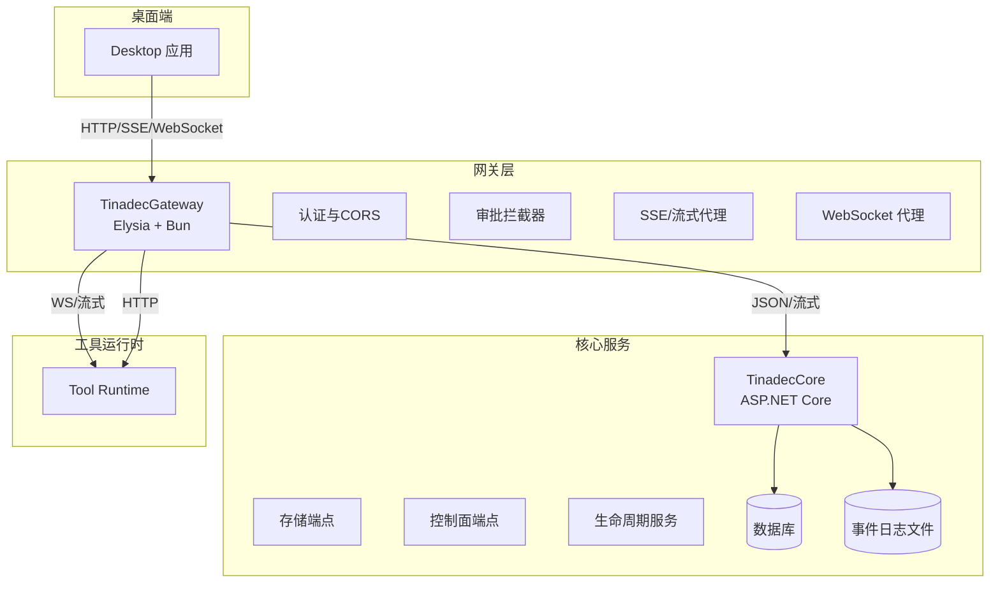
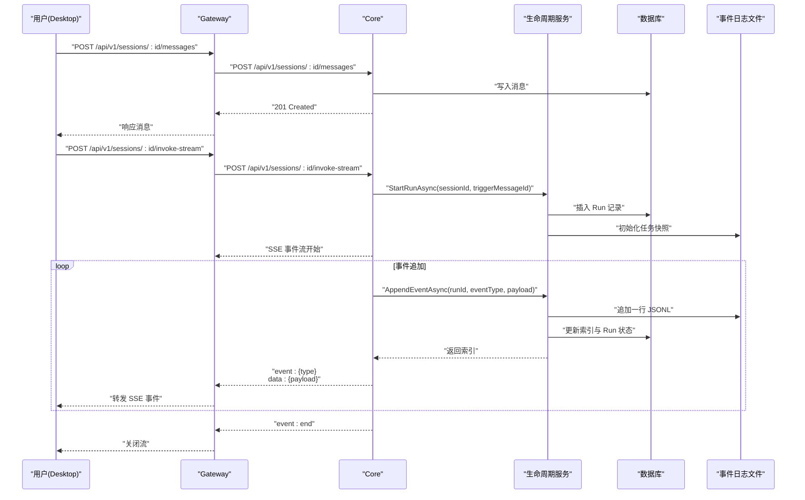
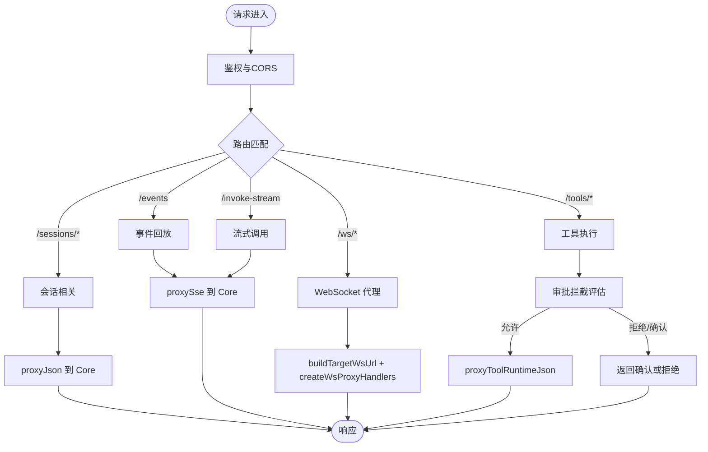
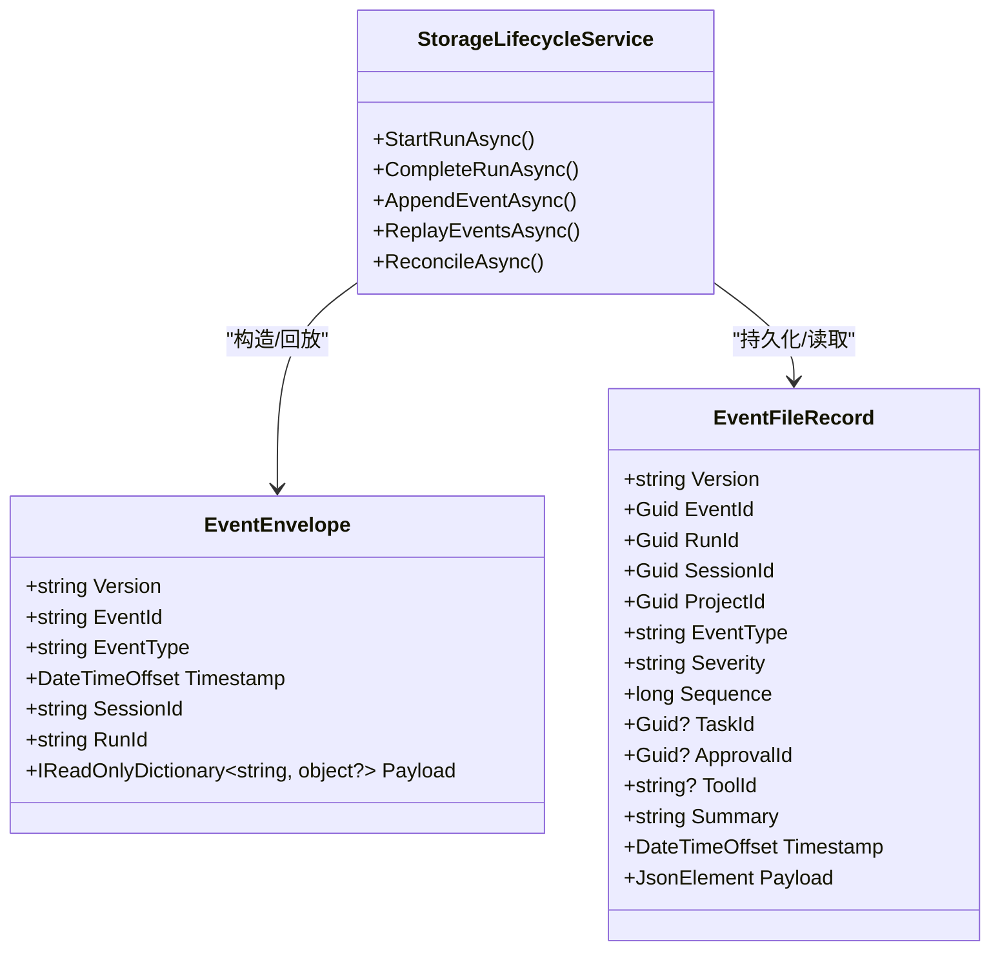
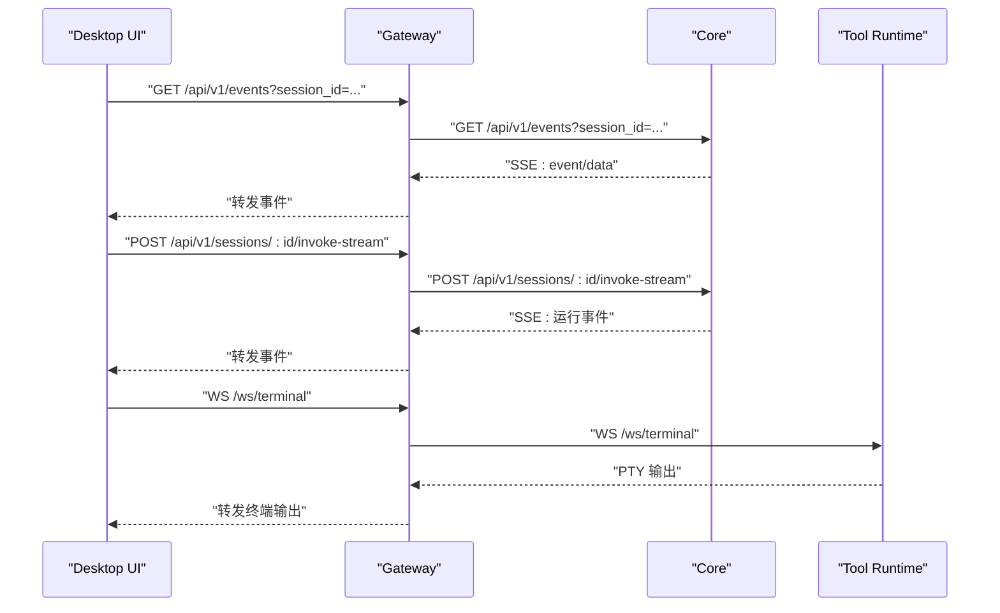
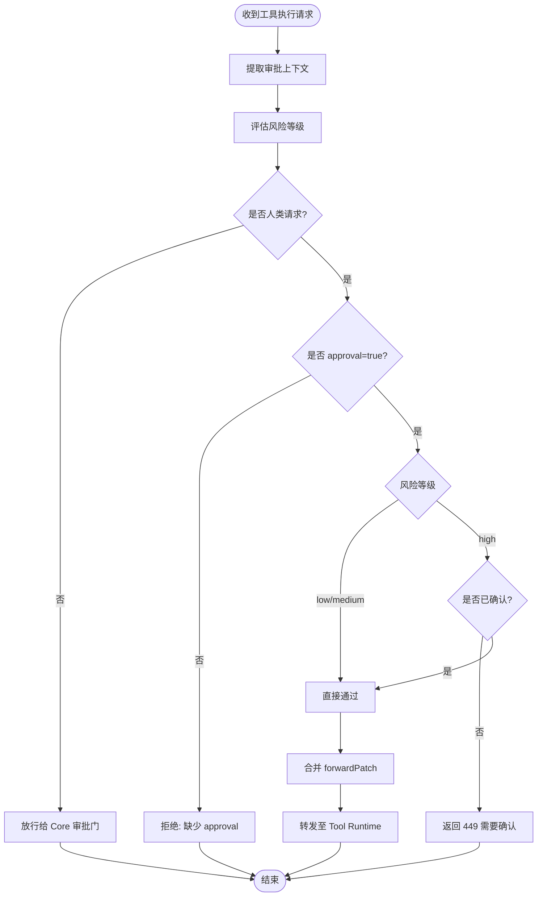
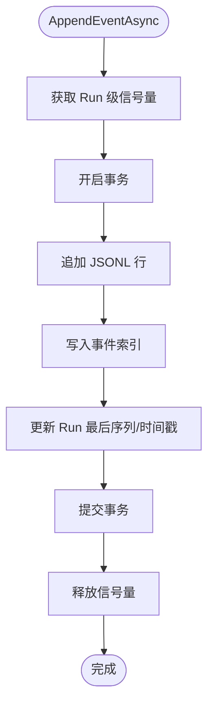
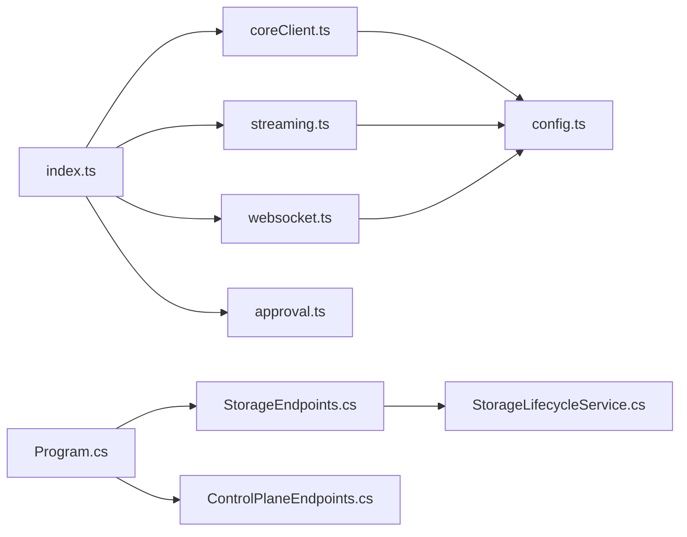

# 数据流模式

<cite>
**本文引用的文件**   
- [index.ts](file://TinadecGateway/src/index.ts)
- [coreClient.ts](file://TinadecGateway/src/coreClient.ts)
- [streaming.ts](file://TinadecGateway/src/streaming.ts)
- [websocket.ts](file://TinadecGateway/src/websocket.ts)
- [config.ts](file://TinadecGateway/src/config.ts)
- [approval.ts](file://TinadecGateway/src/approval.ts)
- [Program.cs](file://TinadecCore/Api/Program.cs)
- [StorageEndpoints.cs](file://TinadecCore/Api/Endpoints/StorageEndpoints.cs)
- [ControlPlaneEndpoints.cs](file://TinadecCore/Api/Endpoints/ControlPlaneEndpoints.cs)
- [EventEnvelope.cs](file://TinadecCore/Contracts/Events/EventEnvelope.cs)
- [StorageLifecycleService.cs](file://TinadecCore/Lifecycle/StorageLifecycleService.cs)
</cite>

## 目录
1. [简介](#简介)
2. [项目结构](#项目结构)
3. [核心组件](#核心组件)
4. [架构总览](#架构总览)
5. [详细组件分析](#详细组件分析)
6. [依赖关系分析](#依赖关系分析)
7. [性能考量](#性能考量)
8. [故障排查指南](#故障排查指南)
9. [结论](#结论)
10. [附录](#附录)

## 简介
本文件系统化阐述 TinadecOffice 的数据流模式，覆盖从桌面端发起请求到 Gateway 代理、Core 处理与返回响应的完整链路；深入解释事件驱动架构（EventEnvelope、事件类型与回放）、SSE 与 WebSocket 的使用场景（调试事件流、工具执行进度、审批通知）；并给出数据一致性保证（事务、缓存策略、冲突解决）、错误恢复（网络中断、超时、重试）、以及性能优化建议（批处理、连接池、内存管理）。

## 项目结构
- 前端入口：Desktop（Electron/Vue）通过 HTTP/SSE/WebSocket 与 Gateway 通信。
- 网关层：TinadecGateway（Bun/Elysia），负责鉴权、协议转换、路由转发、SSE/WebSocket 透传、审批门拦截。
- 核心服务：TinadecCore（ASP.NET Core），提供存储、生命周期、事件回放、控制面等能力。
- 工具运行时：TinadecTools（独立进程），由 Gateway 代理执行具体工具命令。

**图示来源** 
- [index.ts:107-155](file://TinadecGateway/src/index.ts#L107-L155)
- [coreClient.ts:23-30](file://TinadecGateway/src/coreClient.ts#L23-L30)
- [streaming.ts:25-37](file://TinadecGateway/src/streaming.ts#L25-L37)
- [websocket.ts:51-67](file://TinadecGateway/src/websocket.ts#L51-L67)
- [Program.cs:27-39](file://TinadecCore/Api/Program.cs#L27-L39)
- [StorageEndpoints.cs:77-90](file://TinadecCore/Api/Endpoints/StorageEndpoints.cs#L77-L90)

**章节来源**
- [index.ts:1-120](file://TinadecGateway/src/index.ts#L1-L120)
- [Program.cs:10-40](file://TinadecCore/Api/Program.cs#L10-L40)

## 核心组件
- 网关（Gateway）
  - 统一鉴权与CORS、健康检查、路由分发、SSE/WebSocket 透传、审批门拦截、代码工具执行编排。
- 核心（Core）
  - 存储与生命周期管理、事件追加与回放、控制面（模型提供者、提示词片段、Agent 配置、审批记录）。
- 事件系统
  - EventEnvelope 作为标准化事件信封；事件以 JSONL 持久化，索引入库，支持按会话回放。
- 工具运行时（Tool Runtime）
  - 沙箱执行、终端 PTY、MCP 调用等，由 Gateway 代理访问。

**章节来源**
- [index.ts:156-800](file://TinadecGateway/src/index.ts#L156-L800)
- [StorageEndpoints.cs:11-93](file://TinadecCore/Api/Endpoints/StorageEndpoints.cs#L11-L93)
- [ControlPlaneEndpoints.cs:8-44](file://TinadecCore/Api/Endpoints/ControlPlaneEndpoints.cs#L8-L44)
- [EventEnvelope.cs:9-32](file://TinadecCore/Contracts/Events/EventEnvelope.cs#L9-L32)

## 架构总览
下图展示一次“会话消息触发”的端到端数据流：桌面端 POST 消息 → Gateway 鉴权与路由 → Core 创建运行并追加事件 → SSE 推送事件 → Desktop 实时渲染。

**图示来源** 
- [index.ts:232-243](file://TinadecGateway/src/index.ts#L232-L243)
- [StorageEndpoints.cs:77-90](file://TinadecCore/Api/Endpoints/StorageEndpoints.cs#L77-L90)
- [StorageLifecycleService.cs:33-50](file://TinadecCore/Lifecycle/StorageLifecycleService.cs#L33-L50)
- [StorageLifecycleService.cs:78-144](file://TinadecCore/Lifecycle/StorageLifecycleService.cs#L78-L144)

## 详细组件分析

### 请求处理流程（Desktop → Gateway → Core → Tool Runtime）
- 普通 HTTP 请求
  - Gateway 对路径进行鉴权与CORS处理，随后使用 coreClient.proxyJson 或 toolRuntimeClient 转发。
- 流式 HTTP
  - 大文件/日志通过 streaming.proxyStream 直接透传 body 流，避免缓冲。
- SSE 事件流
  - invoke-stream 与 /events 均通过 proxySse 转发至 Core，保持 text/event-stream。
- WebSocket
  - 终端 PTY、调试、协作通过 websocket.findWsRoute 映射到目标服务，createWsProxyHandlers 双向透传。

**图示来源** 
- [index.ts:107-155](file://TinadecGateway/src/index.ts#L107-L155)
- [index.ts:232-243](file://TinadecGateway/src/index.ts#L232-L243)
- [index.ts:279-286](file://TinadecGateway/src/index.ts#L279-L286)
- [index.ts:351-400](file://TinadecGateway/src/index.ts#L351-L400)
- [coreClient.ts:38-87](file://TinadecGateway/src/coreClient.ts#L38-L87)
- [coreClient.ts:93-101](file://TinadecGateway/src/coreClient.ts#L93-L101)
- [streaming.ts:25-37](file://TinadecGateway/src/streaming.ts#L25-L37)
- [websocket.ts:35-45](file://TinadecGateway/src/websocket.ts#L35-L45)
- [websocket.ts:93-139](file://TinadecGateway/src/websocket.ts#L93-L139)

**章节来源**
- [index.ts:156-800](file://TinadecGateway/src/index.ts#L156-L800)
- [coreClient.ts:1-110](file://TinadecGateway/src/coreClient.ts#L1-L110)
- [streaming.ts:1-54](file://TinadecGateway/src/streaming.ts#L1-L54)
- [websocket.ts:1-140](file://TinadecGateway/src/websocket.ts#L1-L140)

### 事件驱动架构（EventEnvelope、事件类型与回放）
- EventEnvelope
  - 版本化信封，包含 event_id、event_type、timestamp、session_id、run_id、payload。
- 事件追加
  - StorageLifecycleService.AppendEventAsync 将事件写入 JSONL 文件，并在事务中更新索引与 Run 元信息。
- 事件回放
  - StorageEndpoints 暴露 /api/v1/events，按 after_seq 增量回放，逐条写入 SSE。
- 事件类型
  - 由业务定义（如 run_start、tool_call、tool_result、approval_decision 等），在 payload 中携带上下文。

**图示来源** 
- [EventEnvelope.cs:9-32](file://TinadecCore/Contracts/Events/EventEnvelope.cs#L9-L32)
- [StorageLifecycleService.cs:259-275](file://TinadecCore/Lifecycle/StorageLifecycleService.cs#L259-L275)
- [StorageLifecycleService.cs:78-144](file://TinadecCore/Lifecycle/StorageLifecycleService.cs#L78-L144)
- [StorageEndpoints.cs:77-90](file://TinadecCore/Api/Endpoints/StorageEndpoints.cs#L77-L90)

**章节来源**
- [EventEnvelope.cs:1-33](file://TinadecCore/Contracts/Events/EventEnvelope.cs#L1-L33)
- [StorageLifecycleService.cs:78-179](file://TinadecCore/Lifecycle/StorageLifecycleService.cs#L78-L179)
- [StorageEndpoints.cs:77-90](file://TinadecCore/Api/Endpoints/StorageEndpoints.cs#L77-L90)

### SSE 与 WebSocket 的使用场景
- SSE
  - 调试事件流：/api/v1/events 回放历史事件。
  - 工具执行进度：/api/v1/sessions/:sessionId/invoke-stream 实时推送运行事件。
- WebSocket
  - 终端 PTY：/ws/terminal → Tool Runtime。
  - 调试器通信：/ws/debug → Core Debug Studio。
  - 协作：/ws/collaboration → Core。

**图示来源** 
- [index.ts:279-286](file://TinadecGateway/src/index.ts#L279-L286)
- [index.ts:232-243](file://TinadecGateway/src/index.ts#L232-L243)
- [websocket.ts:51-67](file://TinadecGateway/src/websocket.ts#L51-L67)
- [websocket.ts:93-139](file://TinadecGateway/src/websocket.ts#L93-L139)

**章节来源**
- [index.ts:232-286](file://TinadecGateway/src/index.ts#L232-L286)
- [websocket.ts:1-140](file://TinadecGateway/src/websocket.ts#L1-L140)

### 审批门与人类操作保护
- 规则
  - Agent 请求不拦截，交由 Core 审批门。
  - 人类低风险/中风险直接通过；高风险需二次确认（449 响应提示 UI）。
- 实现
  - approval.ts 提取上下文、评估风险、生成 forwardPatch。
  - index.ts 在 code tools 执行前校验并合并补丁后转发至 Tool Runtime。

**图示来源** 
- [approval.ts:91-110](file://TinadecGateway/src/approval.ts#L91-L110)
- [approval.ts:145-197](file://TinadecGateway/src/approval.ts#L145-L197)
- [approval.ts:203-224](file://TinadecGateway/src/approval.ts#L203-L224)
- [index.ts:351-400](file://TinadecGateway/src/index.ts#L351-L400)

**章节来源**
- [approval.ts:1-235](file://TinadecGateway/src/approval.ts#L1-L235)
- [index.ts:351-400](file://TinadecGateway/src/index.ts#L351-L400)

### 数据一致性保证
- 事务管理
  - AppendEventAsync 在事务内更新索引与 Run 元信息，确保事件与索引一致。
- 持久化策略
  - 事件以 JSONL 追加写，配合字节偏移与长度索引，支持高效回放与断点续读。
- 冲突解决
  - 每个 Run 级别 SemaphoreSlim 串行追加事件，避免并发写入导致序列错乱。
- 启动重建
  - ReconcileAsync 扫描已有事件文件，重建缺失索引，保障数据完整性。

**图示来源** 
- [StorageLifecycleService.cs:78-144](file://TinadecCore/Lifecycle/StorageLifecycleService.cs#L78-L144)
- [StorageLifecycleService.cs:181-217](file://TinadecCore/Lifecycle/StorageLifecycleService.cs#L181-L217)

**章节来源**
- [StorageLifecycleService.cs:78-217](file://TinadecCore/Lifecycle/StorageLifecycleService.cs#L78-L217)

### 错误处理与恢复
- 网络不可达
  - proxyJson 捕获异常返回 502 与明确错误码（CORE_UNREACHABLE/CORE_INVALID_RESPONSE）。
- 超时与重试
  - Gateway 支持 requestTimeoutMs 配置；客户端应实现指数退避重试。
- 流式传输
  - streaming.setStreamHeaders 设置 no-cache、keep-alive，避免中间件缓冲。
- WebSocket
  - 目标连接失败时清理资源并通知客户端。

**章节来源**
- [coreClient.ts:38-87](file://TinadecGateway/src/coreClient.ts#L38-L87)
- [streaming.ts:42-53](file://TinadecGateway/src/streaming.ts#L42-L53)
- [websocket.ts:93-139](file://TinadecGateway/src/websocket.ts#L93-L139)
- [config.ts:65-106](file://TinadecGateway/src/config.ts#L65-L106)

## 依赖关系分析
- Gateway 依赖
  - config.ts（运行配置）、coreClient.ts（Core 代理）、streaming.ts（流式代理）、websocket.ts（WS 代理）、approval.ts（审批门）。
- Core 依赖
  - Program.cs（应用启动与迁移）、StorageEndpoints.cs（存储与事件回放）、ControlPlaneEndpoints.cs（控制面）、StorageLifecycleService.cs（事件与运行生命周期）。

**图示来源** 
- [index.ts:1-120](file://TinadecGateway/src/index.ts#L1-L120)
- [coreClient.ts:1-30](file://TinadecGateway/src/coreClient.ts#L1-L30)
- [streaming.ts:1-20](file://TinadecGateway/src/streaming.ts#L1-L20)
- [websocket.ts:1-31](file://TinadecGateway/src/websocket.ts#L1-L31)
- [Program.cs:27-39](file://TinadecCore/Api/Program.cs#L27-L39)
- [StorageEndpoints.cs:11-20](file://TinadecCore/Api/Endpoints/StorageEndpoints.cs#L11-L20)

**章节来源**
- [index.ts:1-120](file://TinadecGateway/src/index.ts#L1-L120)
- [Program.cs:27-39](file://TinadecCore/Api/Program.cs#L27-L39)

## 性能考量
- 批处理
  - 事件批量追加：可考虑在内存中聚合多条事件后再一次性写入 JSONL，减少 I/O 次数。
  - 索引批量写入：将多个事件索引合并为单次事务提交。
- 连接池
  - HTTP 连接复用：利用 fetch 默认连接复用；在高并发下可限制最大并发数。
  - WebSocket 连接池：对频繁短连接的调试通道建立连接池，降低握手开销。
- 内存管理
  - 流式处理：SSE/流式 HTTP 避免全量缓冲，使用 ReadableStream 逐块转发。
  - 事件回放：按 after_seq 分页回放，避免一次性加载大量事件。
- 缓存策略
  - 只读查询（如 model-providers、agents）可加短期缓存，减少后端压力。
  - 注意缓存失效与一致性，尤其是变更类接口。

[本节为通用指导，不直接分析具体文件]

## 故障排查指南
- 常见问题
  - Core 不可达：检查 TINADEC_CORE_URL 与网络连通性，查看 502 错误码。
  - SSE 未刷新：确认响应头 content-type=text/event-stream、cache-control=no-cache。
  - WebSocket 断开：检查 WS_ROUTES 映射是否正确，目标服务是否在线。
  - 事件丢失：核对 ReconcileAsync 是否成功重建索引，检查 JSONL 文件完整性。
- 诊断端点
  - /api/v1/health、/api/v1/readiness、/api/v1/model-readiness、/api/v1/tool-layer-readiness。
  - /api/v1/debug/diagnostics、/api/v1/debug/processes。

**章节来源**
- [coreClient.ts:38-87](file://TinadecGateway/src/coreClient.ts#L38-L87)
- [index.ts:156-193](file://TinadecGateway/src/index.ts#L156-L193)
- [StorageEndpoints.cs:77-90](file://TinadecCore/Api/Endpoints/StorageEndpoints.cs#L77-L90)
- [StorageLifecycleService.cs:181-217](file://TinadecCore/Lifecycle/StorageLifecycleService.cs#L181-L217)

## 结论
TinadecOffice 采用“桌面端—网关—核心—工具运行时”的分层架构，结合事件驱动与流式通信，实现了高可靠、可扩展、可观测的数据流体系。通过严格的审批门、事务化的事件追加与回放机制，保障了安全性与一致性。建议在后续迭代中引入批处理、连接池与缓存策略，进一步提升吞吐与稳定性。

## 附录
- 关键环境变量（Gateway）
  - TINADEC_GATEWAY_MODE、TINADEC_GATEWAY_PORT、TINADEC_CORE_URL、TINADEC_TOOL_RUNTIME_URL、TINADEC_GATEWAY_AUTH_REQUIRED、TINADEC_GATEWAY_JWT_SECRET、TINADEC_GATEWAY_API_KEY、TINADEC_GATEWAY_CORS_ORIGINS、TINADEC_GATEWAY_TIMEOUT_MS。
- 典型 API
  - 会话与消息：/api/v1/sessions、/api/v1/sessions/:sessionId/messages
  - 事件回放：/api/v1/events
  - 流式调用：/api/v1/sessions/:sessionId/invoke-stream
  - 工具执行：/api/v1/code/tools/:toolId/execute
  - 控制面：/api/v1/model-providers、/api/v1/prompt-fragments、/api/v1/agents、/api/v1/approvals

**章节来源**
- [config.ts:65-106](file://TinadecGateway/src/config.ts#L65-L106)
- [index.ts:194-450](file://TinadecGateway/src/index.ts#L194-L450)
- [ControlPlaneEndpoints.cs:8-44](file://TinadecCore/Api/Endpoints/ControlPlaneEndpoints.cs#L8-L44)