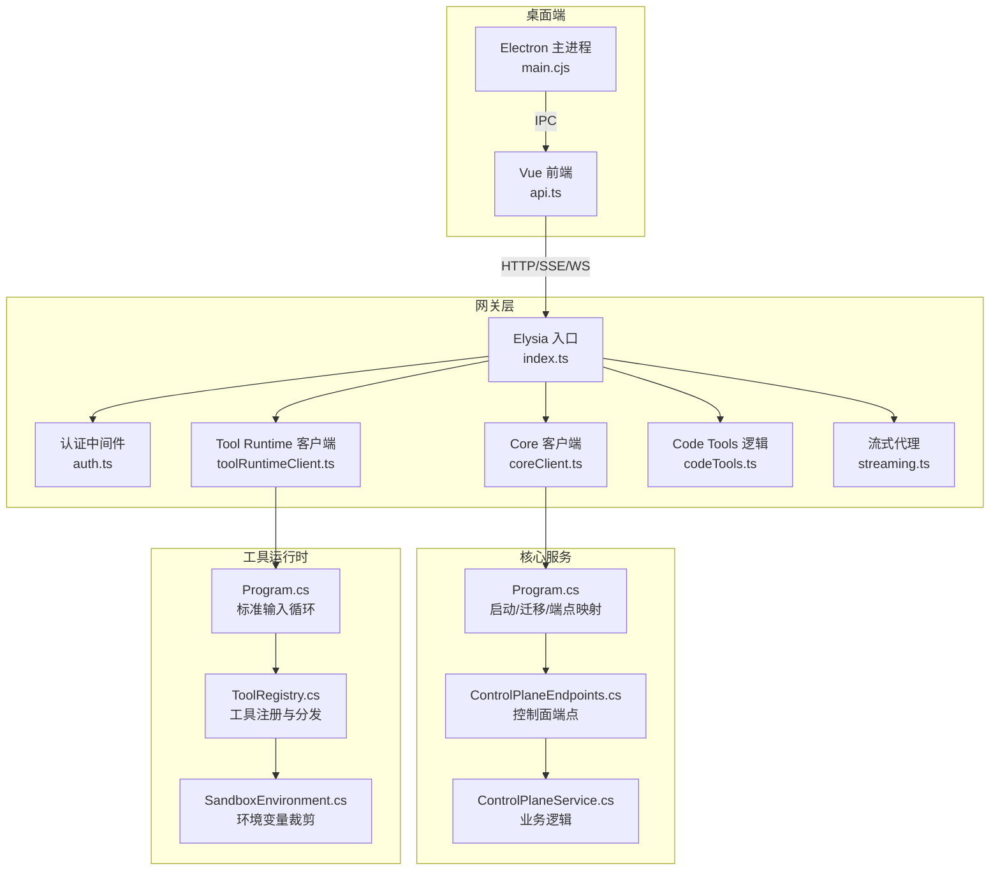
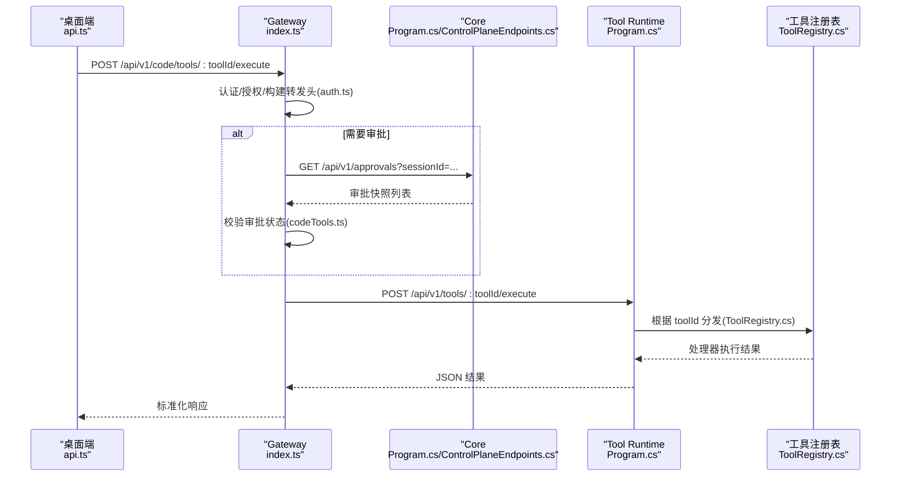
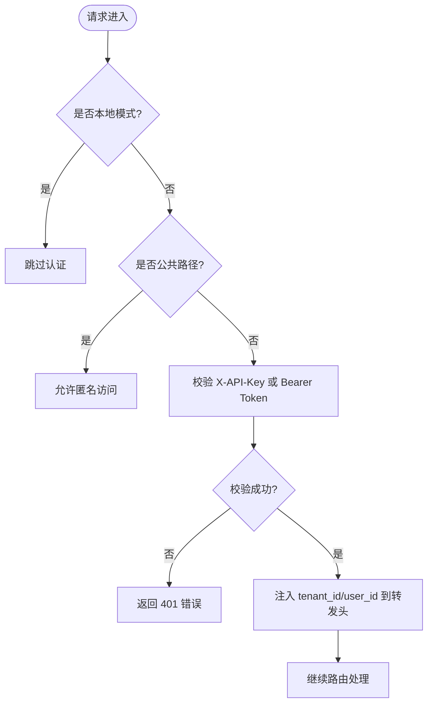
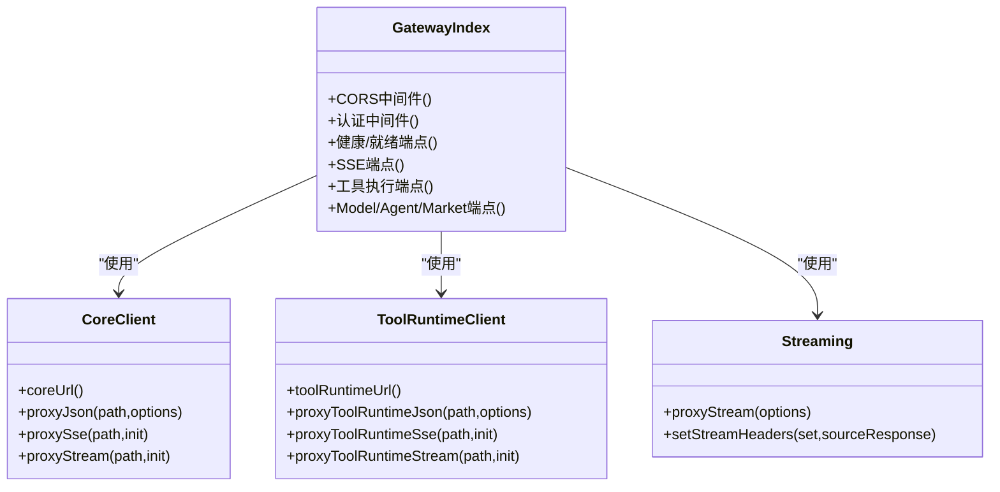
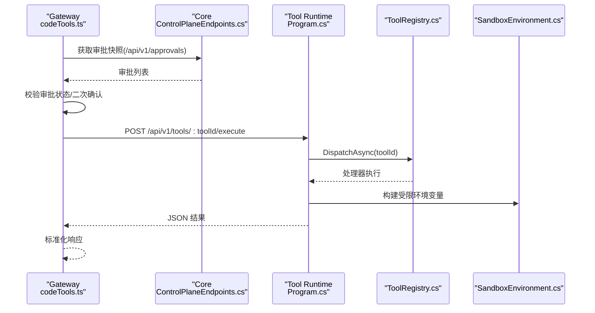
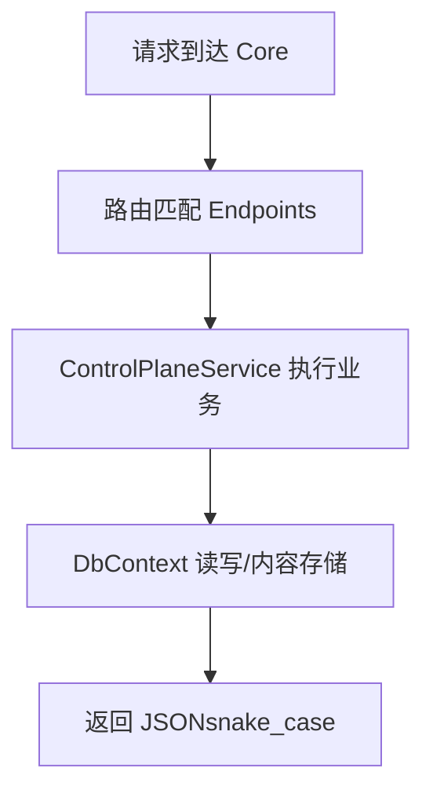
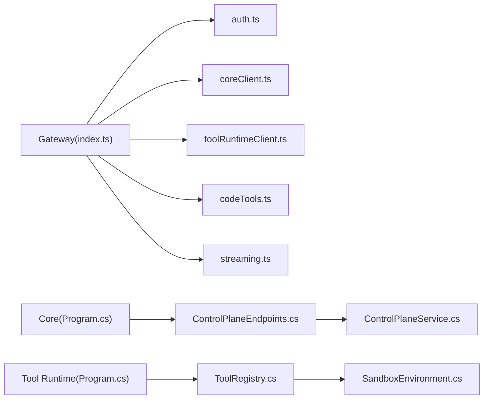

# 请求响应流程

<cite>
**本文引用的文件**   
- [TinadecGateway/src/index.ts](file://TinadecGateway/src/index.ts)
- [TinadecGateway/src/auth.ts](file://TinadecGateway/src/auth.ts)
- [TinadecGateway/src/coreClient.ts](file://TinadecGateway/src/coreClient.ts)
- [TinadecGateway/src/toolRuntimeClient.ts](file://TinadecGateway/src/toolRuntimeClient.ts)
- [TinadecGateway/src/codeTools.ts](file://TinadecGateway/src/codeTools.ts)
- [TinadecGateway/src/streaming.ts](file://TinadecGateway/src/streaming.ts)
- [TinadecCore/Api/Program.cs](file://TinadecCore/Api/Program.cs)
- [TinadecCore/Api/Endpoints/ControlPlaneEndpoints.cs](file://TinadecCore/Api/Endpoints/ControlPlaneEndpoints.cs)
- [TinadecCore/Runtime/ControlPlaneService.cs](file://TinadecCore/Runtime/ControlPlaneService.cs)
- [TinadecTools/Program.cs](file://TinadecTools/Program.cs)
- [TinadecTools/Abstractions/ToolRegistry.cs](file://TinadecTools/Abstractions/ToolRegistry.cs)
- [TinadecTools/Runtime/Sandbox/SandboxEnvironment.cs](file://TinadecTools/Runtime/Sandbox/SandboxEnvironment.cs)
- [apps/desktop/electron/main.cjs](file://apps/desktop/electron/main.cjs)
- [apps/desktop/src/api.ts](file://apps/desktop/src/api.ts)
</cite>

## 目录
1. [简介](#简介)
2. [项目结构](#项目结构)
3. [核心组件](#核心组件)
4. [架构总览](#架构总览)
5. [详细组件分析](#详细组件分析)
6. [依赖关系分析](#依赖关系分析)
7. [性能考虑](#性能考虑)
8. [故障排查指南](#故障排查指南)
9. [结论](#结论)
10. [附录](#附录)

## 简介
本文面向 TinadecOffice 的请求响应链路，系统阐述从 Desktop 应用发起 HTTP 请求，经 Gateway 网关鉴权、路由与协议转换，再到 Core 服务处理与 Tool Runtime 执行工具的全流程。重点覆盖认证授权、路由机制、工具调用（含沙箱环境准备、权限检查）、错误处理策略、并发与资源管理，以及连接池、批处理与缓存等性能优化建议。

## 项目结构
- Desktop（Electron + Vue）：用户界面与 IPC 入口，负责发起 HTTP 请求到 Gateway，并渲染事件流与结果。
- Gateway（Bun/Elysia）：薄代理 BFF，承担鉴权、CORS、SSE/WS/流式转发、审批门与 Code Tools 规格发布、向 Core 和 Tool Runtime 转发。
- Core（ASP.NET Core）：状态权威中心，提供健康、就绪、模型/Agent 控制面、会话/编排、审批等 API。
- Tool Runtime（.NET 控制台进程）：通过标准输入输出接收工具调用请求，按注册表分发执行，支持沙箱隔离与环境裁剪。

**图表来源** 
- [TinadecGateway/src/index.ts](file://TinadecGateway/src/index.ts)
- [TinadecGateway/src/auth.ts](file://TinadecGateway/src/auth.ts)
- [TinadecGateway/src/coreClient.ts](file://TinadecGateway/src/coreClient.ts)
- [TinadecGateway/src/toolRuntimeClient.ts](file://TinadecGateway/src/toolRuntimeClient.ts)
- [TinadecGateway/src/codeTools.ts](file://TinadecGateway/src/codeTools.ts)
- [TinadecGateway/src/streaming.ts](file://TinadecGateway/src/streaming.ts)
- [TinadecCore/Api/Program.cs](file://TinadecCore/Api/Program.cs)
- [TinadecCore/Api/Endpoints/ControlPlaneEndpoints.cs](file://TinadecCore/Api/Endpoints/ControlPlaneEndpoints.cs)
- [TinadecCore/Runtime/ControlPlaneService.cs](file://TinadecCore/Runtime/ControlPlaneService.cs)
- [TinadecTools/Program.cs](file://TinadecTools/Program.cs)
- [TinadecTools/Abstractions/ToolRegistry.cs](file://TinadecTools/Abstractions/ToolRegistry.cs)
- [TinadecTools/Runtime/Sandbox/SandboxEnvironment.cs](file://TinadecTools/Runtime/Sandbox/SandboxEnvironment.cs)
- [apps/desktop/electron/main.cjs](file://apps/desktop/electron/main.cjs)
- [apps/desktop/src/api.ts](file://apps/desktop/src/api.ts)

**章节来源**
- [TinadecGateway/src/index.ts](file://TinadecGateway/src/index.ts)
- [TinadecCore/Api/Program.cs](file://TinadecCore/Api/Program.cs)
- [apps/desktop/electron/main.cjs](file://apps/desktop/electron/main.cjs)

## 核心组件
- 认证与租户上下文：Gateway 在云端模式对 Authorization/X-API-Key 进行校验，解析 JWT 或验证 API Key，注入 tenant_id/user_id 到下游头。
- 路由与协议转换：Elysia 路由统一暴露 /api/v1/* 接口，支持 JSON、SSE、WebSocket、流式 HTTP；Gateway 将请求转发至 Core 或 Tool Runtime。
- 审批门与 Code Tools：对高风险工具执行前校验 Core 审批快照，必要时二次确认；不直接执行工具，仅做规格发布与代理。
- Core 控制面：提供模型提供者、路由、提示词片段、Agent 配置、审批管理等持久化能力，返回 snake_case JSON。
- Tool Runtime：基于标准输入/输出的进程内调度器，按工具 ID 分发给已注册的处理器，支持沙箱环境与最小化环境变量。

**章节来源**
- [TinadecGateway/src/auth.ts](file://TinadecGateway/src/auth.ts)
- [TinadecGateway/src/index.ts](file://TinadecGateway/src/index.ts)
- [TinadecGateway/src/codeTools.ts](file://TinadecGateway/src/codeTools.ts)
- [TinadecCore/Api/Program.cs](file://TinadecCore/Api/Program.cs)
- [TinadecCore/Api/Endpoints/ControlPlaneEndpoints.cs](file://TinadecCore/Api/Endpoints/ControlPlaneEndpoints.cs)
- [TinadecTools/Program.cs](file://TinadecTools/Program.cs)
- [TinadecTools/Abstractions/ToolRegistry.cs](file://TinadecTools/Abstractions/ToolRegistry.cs)

## 架构总览
下图展示一次典型“代码工具执行”的端到端序列：Desktop → Gateway → Core（审批校验）→ Tool Runtime（执行）→ 返回结果。

**图表来源** 
- [TinadecGateway/src/index.ts](file://TinadecGateway/src/index.ts)
- [TinadecGateway/src/auth.ts](file://TinadecGateway/src/auth.ts)
- [TinadecGateway/src/codeTools.ts](file://TinadecGateway/src/codeTools.ts)
- [TinadecCore/Api/Endpoints/ControlPlaneEndpoints.cs](file://TinadecCore/Api/Endpoints/ControlPlaneEndpoints.cs)
- [TinadecTools/Program.cs](file://TinadecTools/Program.cs)
- [TinadecTools/Abstractions/ToolRegistry.cs](file://TinadecTools/Abstractions/ToolRegistry.cs)

## 详细组件分析

### 认证与授权（Gateway）
- 本地模式：跳过认证，不提取租户上下文。
- 云端模式：
  - 支持 X-API-Key 与 Bearer Token（HS256 WebCrypto 验证）。
  - 从 JWT claims 或自定义头提取 tenant_id、user_id、roles。
  - 公共路径（如 /api/v1/health、/docs/*）免认证。
- 认证成功后，将 tenant_id、user_id 注入到转发给 Core/Tool Runtime 的请求头中。

**图表来源** 
- [TinadecGateway/src/auth.ts](file://TinadecGateway/src/auth.ts)
- [TinadecGateway/src/index.ts](file://TinadecGateway/src/index.ts)

**章节来源**
- [TinadecGateway/src/auth.ts](file://TinadecGateway/src/auth.ts)
- [TinadecGateway/src/index.ts](file://TinadecGateway/src/index.ts)

### 路由与协议转换（Gateway）
- Elysia 路由集中定义 /api/v1/*，涵盖健康检查、项目/会话、编排、调试、市场、扩展、MCP、Agent Center、Prompt Engineering 等。
- 支持：
  - JSON 代理：proxyJson 封装 fetch，统一返回 {status, data}。
  - SSE 代理：proxySse 透传 text/event-stream。
  - 流式 HTTP：proxyStream 用于大文件与日志。
- 设置 CORS、keep-alive、no-cache 等响应头，适配 Electron file:// 与 tauri:// 源。

**图表来源** 
- [TinadecGateway/src/index.ts](file://TinadecGateway/src/index.ts)
- [TinadecGateway/src/coreClient.ts](file://TinadecGateway/src/coreClient.ts)
- [TinadecGateway/src/toolRuntimeClient.ts](file://TinadecGateway/src/toolRuntimeClient.ts)
- [TinadecGateway/src/streaming.ts](file://TinadecGateway/src/streaming.ts)

**章节来源**
- [TinadecGateway/src/index.ts](file://TinadecGateway/src/index.ts)
- [TinadecGateway/src/coreClient.ts](file://TinadecGateway/src/coreClient.ts)
- [TinadecGateway/src/toolRuntimeClient.ts](file://TinadecGateway/src/toolRuntimeClient.ts)
- [TinadecGateway/src/streaming.ts](file://TinadecGateway/src/streaming.ts)

### 工具调用执行流程（Code Tools + Tool Runtime）
- Gateway 不直接执行工具，仅提供：
  - 工具规格发布（/api/v1/code/tools）
  - 审批门校验（Core 审批快照）
  - 代理执行（POST /api/v1/tools/:toolId/execute → Tool Runtime）
- Tool Runtime 通过标准输入读取 JSON 请求，按 ToolRegistry 分发到具体处理器，输出 JSON 响应。
- 沙箱环境：
  - 保留必要环境变量（PATH、TEMP、代理等），裁剪敏感变量。
  - 为不同账户/缓存目录注入专用路径。

**图表来源** 
- [TinadecGateway/src/codeTools.ts](file://TinadecGateway/src/codeTools.ts)
- [TinadecCore/Api/Endpoints/ControlPlaneEndpoints.cs](file://TinadecCore/Api/Endpoints/ControlPlaneEndpoints.cs)
- [TinadecTools/Program.cs](file://TinadecTools/Program.cs)
- [TinadecTools/Abstractions/ToolRegistry.cs](file://TinadecTools/Abstractions/ToolRegistry.cs)
- [TinadecTools/Runtime/Sandbox/SandboxEnvironment.cs](file://TinadecTools/Runtime/Sandbox/SandboxEnvironment.cs)

**章节来源**
- [TinadecGateway/src/codeTools.ts](file://TinadecGateway/src/codeTools.ts)
- [TinadecTools/Program.cs](file://TinadecTools/Program.cs)
- [TinadecTools/Abstractions/ToolRegistry.cs](file://TinadecTools/Abstractions/ToolRegistry.cs)
- [TinadecTools/Runtime/Sandbox/SandboxEnvironment.cs](file://TinadecTools/Runtime/Sandbox/SandboxEnvironment.cs)

### Core 服务处理与控制面
- Program.cs 完成：
  - JSON 序列化策略（snake_case、忽略 null）
  - 数据库迁移与生命周期协调
  - 健康/就绪/清单端点
  - 存储/控制面/存根端点映射
- ControlPlaneEndpoints.cs 暴露模型提供者、路由、提示词片段、Agent、审批等 CRUD。
- ControlPlaneService.cs 实现多 DbContext 读写、内容存储、版本控制、并发安全（If-Match 乐观锁）。

**图表来源** 
- [TinadecCore/Api/Program.cs](file://TinadecCore/Api/Program.cs)
- [TinadecCore/Api/Endpoints/ControlPlaneEndpoints.cs](file://TinadecCore/Api/Endpoints/ControlPlaneEndpoints.cs)
- [TinadecCore/Runtime/ControlPlaneService.cs](file://TinadecCore/Runtime/ControlPlaneService.cs)

**章节来源**
- [TinadecCore/Api/Program.cs](file://TinadecCore/Api/Program.cs)
- [TinadecCore/Api/Endpoints/ControlPlaneEndpoints.cs](file://TinadecCore/Api/Endpoints/ControlPlaneEndpoints.cs)
- [TinadecCore/Runtime/ControlPlaneService.cs](file://TinadecCore/Runtime/ControlPlaneService.cs)

### Desktop 集成与 IPC
- Electron main.cjs 负责窗口管理、IPC 通道、协议注册、面板/宠物窗口生命周期。
- api.ts 定义前后端交互的数据契约（Session、Message、Approval、Model/Agent 中心等）。
- 桌面端通过 HTTP/SSE/WS 与 Gateway 通信，并通过 IPC 与 Electron 主进程交互。

**章节来源**
- [apps/desktop/electron/main.cjs](file://apps/desktop/electron/main.cjs)
- [apps/desktop/src/api.ts](file://apps/desktop/src/api.ts)

## 依赖关系分析
- Gateway 依赖：
  - auth.ts：认证与租户上下文
  - coreClient.ts：Core 的 JSON/SSE/流式代理
  - toolRuntimeClient.ts：Tool Runtime 的 JSON/SSE/流式代理
  - codeTools.ts：工具规格与审批门
  - streaming.ts：流式代理与响应头设置
- Core 依赖：
  - Persistence（DbContext、迁移、内容存储）
  - Runtime（模块注册、生命周期）
  - Endpoints（控制面）
- Tool Runtime 依赖：
  - ToolRegistry：工具分发
  - SandboxEnvironment：环境变量裁剪

**图表来源** 
- [TinadecGateway/src/index.ts](file://TinadecGateway/src/index.ts)
- [TinadecGateway/src/auth.ts](file://TinadecGateway/src/auth.ts)
- [TinadecGateway/src/coreClient.ts](file://TinadecGateway/src/coreClient.ts)
- [TinadecGateway/src/toolRuntimeClient.ts](file://TinadecGateway/src/toolRuntimeClient.ts)
- [TinadecGateway/src/codeTools.ts](file://TinadecGateway/src/codeTools.ts)
- [TinadecGateway/src/streaming.ts](file://TinadecGateway/src/streaming.ts)
- [TinadecCore/Api/Program.cs](file://TinadecCore/Api/Program.cs)
- [TinadecCore/Api/Endpoints/ControlPlaneEndpoints.cs](file://TinadecCore/Api/Endpoints/ControlPlaneEndpoints.cs)
- [TinadecCore/Runtime/ControlPlaneService.cs](file://TinadecCore/Runtime/ControlPlaneService.cs)
- [TinadecTools/Program.cs](file://TinadecTools/Program.cs)
- [TinadecTools/Abstractions/ToolRegistry.cs](file://TinadecTools/Abstractions/ToolRegistry.cs)
- [TinadecTools/Runtime/Sandbox/SandboxEnvironment.cs](file://TinadecTools/Runtime/Sandbox/SandboxEnvironment.cs)

**章节来源**
- [TinadecGateway/src/index.ts](file://TinadecGateway/src/index.ts)
- [TinadecCore/Api/Program.cs](file://TinadecCore/Api/Program.cs)
- [TinadecTools/Program.cs](file://TinadecTools/Program.cs)

## 性能考虑
- 连接池与超时
  - 建议在 Gateway 侧使用可复用 HTTP 客户端（如 Bun 原生 fetch 默认行为或显式 Agent），配置连接池大小、空闲超时、最大重连次数。
  - 为 Core/Tool Runtime 的代理请求设置合理的超时（例如 30s-120s），避免长尾阻塞。
- 请求批处理
  - 对批量查询（如 approvals、sessions、tool-executions）可在 Gateway 层合并多次小请求，减少往返。
  - Tool Runtime 若支持批量执行，可在注册表中增加批处理器，降低进程间开销。
- 缓存策略
  - 只读数据（如 model-provider-templates、agent-modes、tool specs）可在 Gateway 层做短期内存缓存（TTL），减轻 Core 压力。
  - 对于频繁读取的配置（如 Code Tools 规格），可结合 ETag/Last-Modified 协商缓存。
- 流式传输
  - 大文件与日志使用 proxyStream 透传 body，避免 Gateway 缓冲；设置 no-cache、keep-alive、x-accel-buffering=no。
- 并发与背压
  - SSE/WS 场景下，确保上游 Core/Tool Runtime 的背压传递到客户端，防止内存膨胀。
  - 对高并发工具执行，可在 Tool Runtime 侧限制并发度，避免系统资源耗尽。

[本节为通用指导，不直接分析具体文件]

## 故障排查指南
- 网络异常与不可达
  - Core 不可达：proxyJson 返回 502 与 CORE_UNREACHABLE；检查 Core URL、防火墙、DNS。
  - Tool Runtime 不可达：proxyToolRuntimeJson 返回 502 与 TOOL_RUNTIME_UNREACHABLE；检查端口、进程存活。
- 非 JSON 响应
  - 当 Core/Tool Runtime 返回非 JSON，返回 CORE_INVALID_RESPONSE/TOOL_RUNTIME_INVALID_RESPONSE；检查服务端序列化配置。
- 认证失败
  - 云端模式缺少或无效 token/API Key，返回 401 与对应错误码；检查 Authorization/X-API-Key 与密钥配置。
- 审批未通过
  - 审批快照不存在/状态非 approved/cwd 不匹配/命令不匹配，返回 blocked 与证据链；核对 approval_id、kind、cwd、command。
- 工具未找到
  - toolId 不在规格列表中，返回 404；检查 codeTools.ts 中的 TOOL_SPECS 与路由参数。
- 并发与超时
  - 长时间无响应时，检查上游超时配置与后端负载；必要时启用重试与熔断。

**章节来源**
- [TinadecGateway/src/coreClient.ts](file://TinadecGateway/src/coreClient.ts)
- [TinadecGateway/src/toolRuntimeClient.ts](file://TinadecGateway/src/toolRuntimeClient.ts)
- [TinadecGateway/src/auth.ts](file://TinadecGateway/src/auth.ts)
- [TinadecGateway/src/codeTools.ts](file://TinadecGateway/src/codeTools.ts)

## 结论
TinadecOffice 采用“桌面端 → Gateway → Core/Tool Runtime”的分层架构，Gateway 作为薄代理与协议转换层，Core 作为状态权威与业务中枢，Tool Runtime 专注工具执行与沙箱隔离。该设计清晰分离关注点，便于扩展与安全治理。通过认证授权、审批门、流式传输与完善的错误处理，系统在可用性、安全性与可观测性方面具备良好基础。后续可进一步优化连接池、批处理与缓存策略以提升吞吐与延迟表现。

[本节为总结，不直接分析具体文件]

## 附录
- 关键端点参考（示例）
  - 健康/就绪：/api/v1/health、/api/v1/readiness、/api/v1/model-readiness、/api/v1/tool-layer-readiness
  - 会话与消息：/api/v1/sessions、/api/v1/sessions/:sessionId/messages
  - 事件流：/api/v1/events、/api/v1/sessions/:sessionId/invoke-stream
  - 审批：/api/v1/approvals、/api/v1/approvals/:approvalId/decision
  - 工具执行：/api/v1/tools/shell、/api/v1/runs/:runId/tools/:toolId/execute、/api/v1/code/tools/:toolId/execute
  - 模型/Agent 控制面：/api/v1/model-providers、/api/v1/model-routes、/api/v1/agents、/api/v1/prompt-fragments

**章节来源**
- [TinadecGateway/src/index.ts](file://TinadecGateway/src/index.ts)
- [TinadecCore/Api/Endpoints/ControlPlaneEndpoints.cs](file://TinadecCore/Api/Endpoints/ControlPlaneEndpoints.cs)