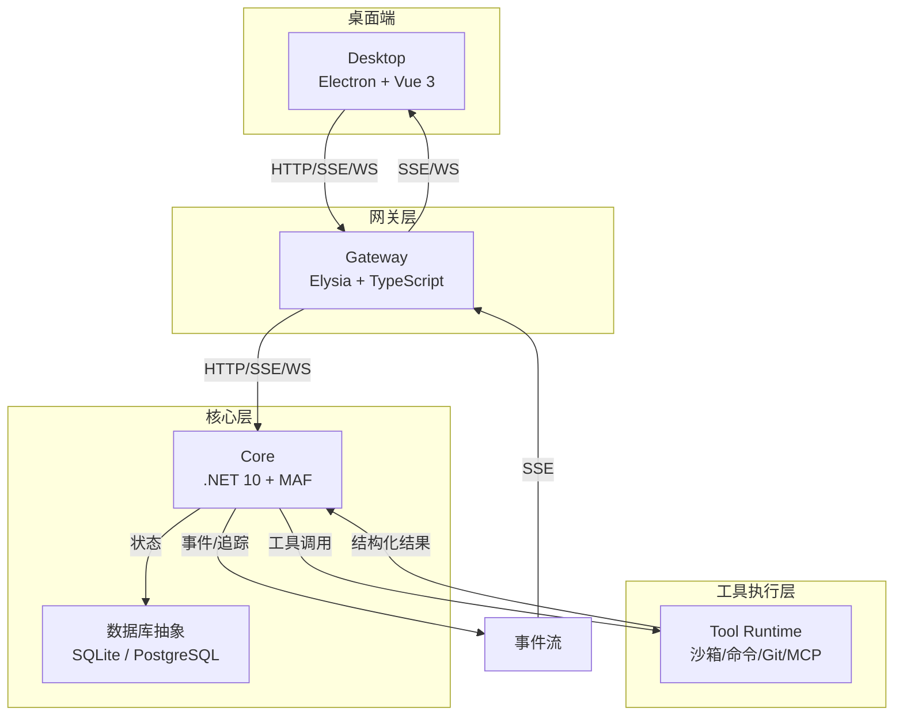
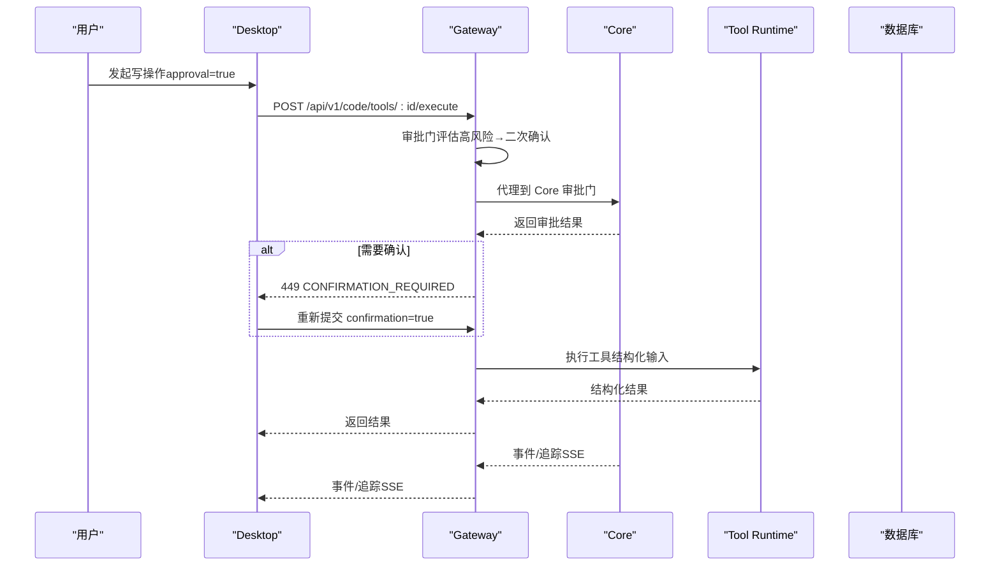
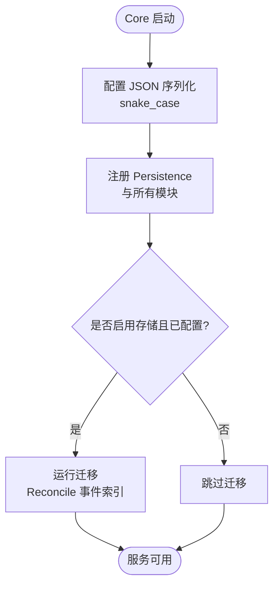
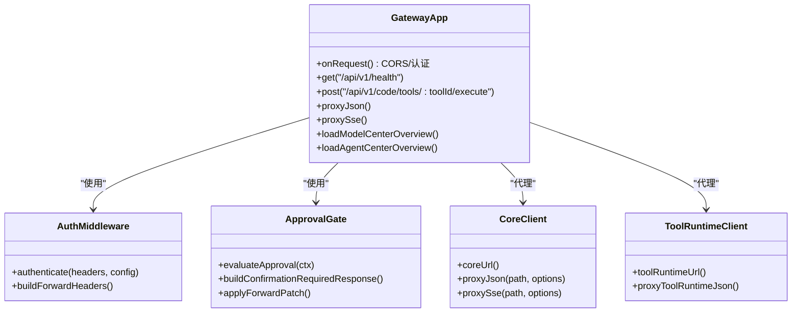
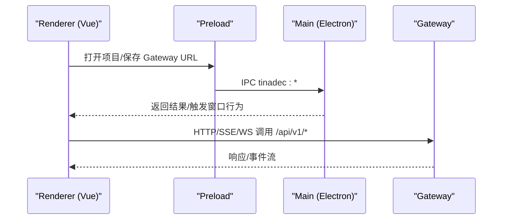
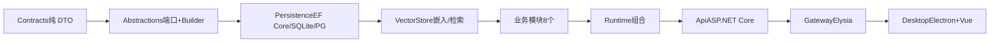

# 架构概览

<cite>
**本文引用的文件**   
- [README.md](file://README.md)
- [docs/architecture.md](file://docs/architecture.md)
- [docs/startup.md](file://docs/startup.md)
- [TinadecCore/AGENTS.md](file://TinadecCore/AGENTS.md)
- [TinadecGateway/AGENTS.md](file://TinadecGateway/AGENTS.md)
- [apps/desktop/AGENTS.md](file://apps/desktop/AGENTS.md)
- [TinadecCore/Api/Program.cs](file://TinadecCore/Api/Program.cs)
- [TinadecCore/Api/appsettings.json](file://TinadecCore/Api/appsettings.json)
- [TinadecGateway/src/index.ts](file://TinadecGateway/src/index.ts)
- [apps/desktop/electron/main.cjs](file://apps/desktop/electron/main.cjs)
- [package.json](file://package.json)
</cite>

## 目录
1. [简介](#简介)
2. [项目结构](#项目结构)
3. [核心组件](#核心组件)
4. [架构总览](#架构总览)
5. [详细组件分析](#详细组件分析)
6. [依赖关系分析](#依赖关系分析)
7. [性能与可扩展性](#性能与可扩展性)
8. [故障排查指南](#故障排查指南)
9. [结论](#结论)
10. [附录：端口与服务拓扑](#附录端口与服务拓扑)

## 简介
本概览面向初学者与有经验的开发者，系统性阐述 TinadecOffice 的三层架构设计、职责边界与交互模式。系统由 Desktop（Electron + Vue 3）、Gateway（Elysia + TypeScript）、Core（.NET 10 + MAF）组成，遵循“Core 是唯一状态权威”“写操作必须经过审批门控”“API 契约统一 snake_case”等设计原则。文档包含系统上下文图、组件关系图、部署拓扑、端口分配、服务依赖与数据流向说明，并给出关键流程的时序图与流程图。

## 项目结构
仓库采用多工作区组织，顶层 package.json 管理脚本与工作区；各层独立构建与运行：
- TinadecCore：.NET 10 模块化单体，基于 Microsoft Agent Framework（MAF），提供编排、工具策略、模型路由、持久化、就绪回执与调试追踪能力。
- TinadecGateway：Bun/Elysia 薄 BFF/代理层，负责鉴权、协议转换、流式转发与 Model/Agent Center 聚合视图。
- apps/desktop：Electron + Vue 3 桌面应用，仅通过 Gateway 访问后端，呈现聊天、任务图、审批、可分离面板与 Debug Studio。

图表来源
- [README.md:33-43](file://README.md#L33-L43)
- [docs/architecture.md:13-17](file://docs/architecture.md#L13-L17)

章节来源
- [README.md:1-120](file://README.md#L1-L120)
- [docs/architecture.md:1-172](file://docs/architecture.md#L1-L172)

## 核心组件
- Core（.NET 10 + MAF）
  - 唯一状态权威：会话、运行、任务、审批、事件、追踪、模型路由、工具策略、权限、能力发现、共享数据库抽象。
  - 暴露健康检查、清单、就绪状态、项目/会话/消息/事件等 API。
  - 支持 SQLite（默认）与 PostgreSQL（可选），迁移协调与就绪探针。
- Gateway（Elysia + TypeScript）
  - 薄代理/BFF：鉴权（云端模式 API Key/JWT）、CORS、协议转换（HTTP/SSE/WS/流式）、Model/Agent Center 聚合视图。
  - 审批门控拦截：人类操作 approval=true 透传，高风险二次确认；Code Tool 执行前校验 Core 审批状态。
  - 不持有业务状态，不直接执行文件/Git/Shell/PTY/MCP。
- Desktop（Electron + Vue 3）
  - 渲染层：Chat、任务图、审批、事件、上下文、Git、Marketplace、Debug Studio、可分离面板、终端。
  - 仅通过 Gateway 访问后端；本地 Pet 系统与窗口管理由 Electron 主进程托管。

章节来源
- [TinadecCore/AGENTS.md:15-96](file://TinadecCore/AGENTS.md#L15-L96)
- [TinadecGateway/AGENTS.md:1-144](file://TinadecGateway/AGENTS.md#L1-L144)
- [apps/desktop/AGENTS.md:1-106](file://apps/desktop/AGENTS.md#L1-L106)

## 架构总览
- 设计原则
  - Core 是唯一状态权威，Gateway 与 Desktop 不保存业务状态。
  - Desktop 只调用 Gateway，不直接调用 Core。
  - 写操作必须经过审批门（人类操作 approval=true，Agent 请求走 Core 审批门）。
  - API 契约统一 snake_case。
- 数据与控制流
  - Desktop → Gateway（HTTP/SSE/WS/流式）→ Core（HTTP/SSE/WS/流式）→ Tool Runtime（必要时）。
  - Core 将事件与追踪通过 SSE 推送至 Gateway，再转发给 Desktop。
  - 数据库抽象位于 Core，支持 SQLite/PostgreSQL。

图表来源
- [TinadecGateway/src/index.ts:350-400](file://TinadecGateway/src/index.ts#L350-L400)
- [TinadecCore/Api/Program.cs:122-164](file://TinadecCore/Api/Program.cs#L122-L164)

章节来源
- [docs/architecture.md:19-45](file://docs/architecture.md#L19-L45)
- [TinadecGateway/AGENTS.md:74-108](file://TinadecGateway/AGENTS.md#L74-L108)

## 详细组件分析

### Core（.NET 10 + MAF）
- 启动与配置
  - Program 中启用 snake_case JSON 序列化、注册 Persistence、模块与控制器。
  - 启动时执行存储迁移与生命周期事件对齐。
- 关键端点
  - /api/v1/health：兼容的健康检查。
  - /api/v1/harness/manifest：双智能体层、工具注册治理、框架信息、模块清单。
  - /api/v1/readiness：框架加载、存储就绪、模块状态汇总。
- 持久化
  - 默认 SQLite，可选 PostgreSQL；EF Core DbContext 按模块划分；迁移协调与就绪探针。
- 事件与追踪
  - EventEnvelope 统一事件格式；OpenTelemetry 追踪导出与调试接口。

图表来源
- [TinadecCore/Api/Program.cs:10-39](file://TinadecCore/Api/Program.cs#L10-L39)
- [TinadecCore/Api/appsettings.json:12-22](file://TinadecCore/Api/appsettings.json#L12-L22)

章节来源
- [TinadecCore/Api/Program.cs:1-181](file://TinadecCore/Api/Program.cs#L1-L181)
- [TinadecCore/Api/appsettings.json:1-31](file://TinadecCore/Api/appsettings.json#L1-L31)
- [TinadecCore/AGENTS.md:82-96](file://TinadecCore/AGENTS.md#L82-L96)

### Gateway（Elysia + TypeScript）
- 职责
  - 鉴权（云端模式 API Key/JWT HS256，Fail-closed）、CORS、协议转换、流式转发、Model/Agent Center 聚合视图。
  - 审批门控拦截：人类操作 approval=true 透传，高风险二次确认；Code Tool 执行前校验 Core 审批状态。
- 路由与代理
  - 统一 /api/v1/* 路由，JSON/SSE/WS/流式代理到 Core 与 Tool Runtime。
  - Code Tools 规格发布与执行入口集中，确保审批语义不被绕过。
- 无状态 BFF
  - Model/Agent Center 聚合视图剥离密钥字段，降级可选 404/501 为诊断信息。

图表来源
- [TinadecGateway/src/index.ts:107-154](file://TinadecGateway/src/index.ts#L107-L154)
- [TinadecGateway/src/index.ts:350-400](file://TinadecGateway/src/index.ts#L350-L400)

章节来源
- [TinadecGateway/AGENTS.md:1-144](file://TinadecGateway/AGENTS.md#L1-L144)
- [TinadecGateway/src/index.ts:1-800](file://TinadecGateway/src/index.ts#L1-L800)

### Desktop（Electron + Vue 3）
- 职责
  - 渲染 UI：聊天、任务图、审批、事件、上下文、Git、Marketplace、Debug Studio、可分离面板、终端。
  - 仅通过 Gateway 访问后端；本地 Pet 系统与窗口管理由 Electron 主进程托管。
- 窗口与 IPC
  - 主进程创建窗口、管理面板窗口、终端 PTY、通知广播、主题同步。
  - Renderer 通过 window.tinadec.* preload API 与主进程通信。
- 连接与设置
  - Gateway URL 优先级：环境变量 > settings.json > 默认地址；Vite 开发服务器固定 5173。

图表来源
- [apps/desktop/electron/main.cjs:107-126](file://apps/desktop/electron/main.cjs#L107-L126)
- [apps/desktop/electron/main.cjs:237-275](file://apps/desktop/electron/main.cjs#L237-L275)

章节来源
- [apps/desktop/AGENTS.md:1-106](file://apps/desktop/AGENTS.md#L1-L106)
- [apps/desktop/electron/main.cjs:1-374](file://apps/desktop/electron/main.cjs#L1-L374)

## 依赖关系分析
- 组件耦合与内聚
  - Core 模块间通过 Abstractions 端口协作，禁止直接互相引用；Persistence 为共享基础设施。
  - Gateway 无状态，仅依赖 Core/Tool Runtime 的 HTTP/SSE/WS 契约。
  - Desktop 仅依赖 Gateway 的 API 契约，不直连 Core。
- 外部依赖
  - .NET 10 + MAF 1.13.0；EF Core（SQLite/PostgreSQL）；Elysia（Bun）；Electron/Vue 3。
- 潜在循环依赖
  - 通过分层与端口隔离避免循环；测试包含架构边界验证。

图表来源
- [TinadecCore/AGENTS.md:56-75](file://TinadecCore/AGENTS.md#L56-L75)

章节来源
- [TinadecCore/AGENTS.md:56-96](file://TinadecCore/AGENTS.md#L56-L96)

## 性能与可扩展性
- Core
  - 模块化注册与最小化组合（AddTinadecCoreMinimal）利于裁剪与测试。
  - 存储迁移与就绪探针在启动阶段完成，避免运行时阻塞。
  - 事件与追踪采用 NDJSON/OTLP 导出，便于离线分析与实时观测。
- Gateway
  - 无状态代理，横向扩展简单；WebSocket 代理需完善当前桩实现。
  - 流式转发与 SSE 降低大对象传输开销。
- Desktop
  - 渲染层轻量，复杂逻辑下沉至 Gateway/Core；面板与终端按需创建销毁。
- 建议
  - 对高并发场景引入 Gateway 水平扩展与反向代理（X-Forwarded-*）。
  - 逐步补齐 WS 代理与 Tool Runtime 连接管理，提升实时能力。

[本节为通用指导，无需特定文件引用]

## 故障排查指南
- 端口与服务可用性
  - 检查 48730（Gateway）、48731（Core）、5173（Vite）是否监听。
  - 访问 /api/v1/health 验证服务健康。
- 常见错误
  - Settings > Agents 为空：确认 Gateway 可达且能代理 /api/v1/agents；若 404，重启 Gateway。
  - Core 未就绪：确认存储迁移成功与 readiness 状态。
  - .NET 版本解析失败：清理 Version/Ice-Version 环境变量后重试。
- 日志与追踪
  - Core 输出日志与追踪文件路径；Gateway 云端模式需配置 JWT 密钥与 CORS。

章节来源
- [docs/startup.md:93-162](file://docs/startup.md#L93-L162)
- [TinadecCore/Api/Program.cs:122-164](file://TinadecCore/Api/Program.cs#L122-L164)
- [TinadecGateway/AGENTS.md:100-113](file://TinadecGateway/AGENTS.md#L100-L113)

## 结论
TinadecOffice 以 Core 为唯一状态权威，Gateway 作为薄代理与 BFF，Desktop 专注渲染与交互，形成清晰的分层与职责边界。通过统一的 API 契约、审批门控机制与事件驱动的数据流，系统在安全性、可维护性与可扩展性上具备良好基础。后续应完善 WebSocket 代理、Tool Runtime 连接管理与向量存储等能力，进一步提升实时性与生态集成。

[本节为总结，无需特定文件引用]

## 附录：端口与服务拓扑
- 端口分配
  - Desktop（Vite）：http://127.0.0.1:5173
  - Gateway API/Docs：http://127.0.0.1:48730/docs
  - Core：http://127.0.0.1:48731
- 服务依赖
  - Desktop → Gateway（HTTP/SSE/WS/流式）
  - Gateway → Core（HTTP/SSE/WS/流式）
  - Core ↔ Tool Runtime（HTTP/SSE/WS）
  - Core → 数据库抽象（SQLite/PostgreSQL）

章节来源
- [README.md:21-24](file://README.md#L21-L24)
- [docs/architecture.md:13-17](file://docs/architecture.md#L13-L17)
- [package.json:11-14](file://package.json#L11-L14)