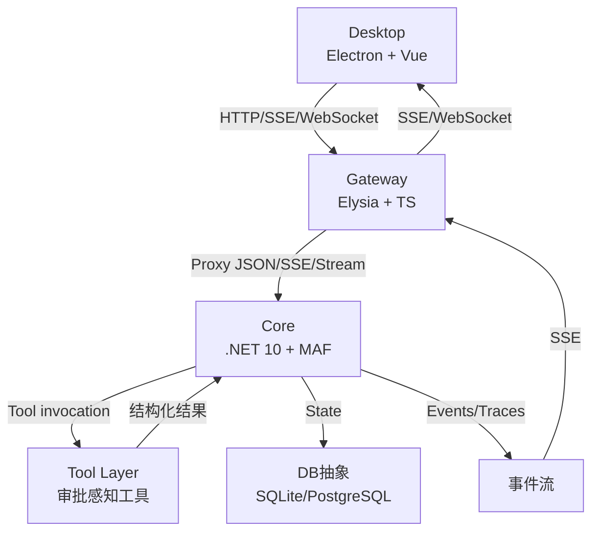
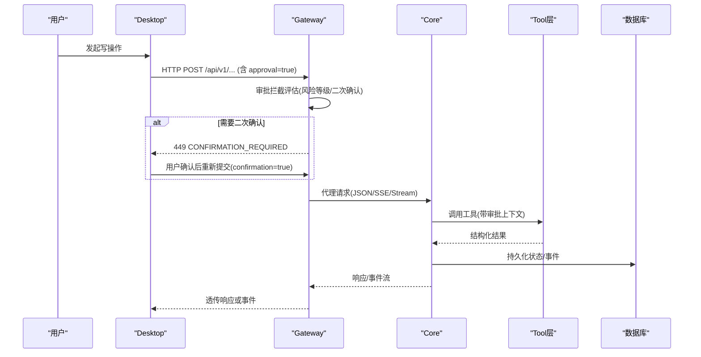
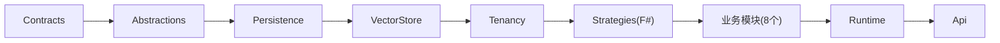

# 核心设计原则

<cite>
**本文引用的文件**   
- [README.md](file://README.md)
- [architecture.md](file://docs/architecture.md)
- [security.md](file://docs/security.md)
- [AGENTS.md](file://TinadecCore/AGENTS.md)
- [EventEnvelope.cs](file://TinadecCore/Contracts/Events/EventEnvelope.cs)
- [ControlPlaneEndpoints.cs](file://TinadecCore/Api/Endpoints/ControlPlaneEndpoints.cs)
- [approval.ts](file://TinadecGateway/src/approval.ts)
- [coreClient.ts](file://TinadecGateway/src/coreClient.ts)
- [api.ts](file://apps/desktop/src/api.ts)
</cite>

## 目录
1. [引言](#引言)
2. [项目结构](#项目结构)
3. [核心组件](#核心组件)
4. [架构总览](#架构总览)
5. [详细组件分析](#详细组件分析)
6. [依赖关系分析](#依赖关系分析)
7. [性能考量](#性能考量)
8. [故障排查指南](#故障排查指南)
9. [结论](#结论)
10. [附录](#附录)

## 引言
本文件系统化阐述 TinadecOffice 的核心设计原则，围绕以下主题展开：
- Core 作为唯一状态权威的设计哲学与边界约束
- Gateway 与 Desktop 必须保持无状态的强制要求
- 审批门控机制的安全设计理念与决策流程
- API 契约规范（版本管理、错误处理、向后兼容）
- 事件驱动架构的优势（异步、解耦、可扩展）
- 结合具体代码路径展示原则落地，并给出违反原则的风险与修复建议

## 项目结构
TinadecOffice 由三层构成：
- Core（.NET 模块化单体）：唯一状态权威，提供编排、策略、模型路由、持久化、就绪回执等能力
- Gateway（Elysia + TypeScript）：薄 BFF/代理，统一对外暴露 /api/v1/*，不持有业务状态
- Desktop（Electron + Vue 3）：UI 呈现层，仅通过 Gateway 访问 Core，不直连 Core

图表来源 
- [README.md:17-43](file://README.md#L17-L43)
- [architecture.md:1-21](file://docs/architecture.md#L1-L21)

章节来源
- [README.md:17-43](file://README.md#L17-L43)
- [architecture.md:1-21](file://docs/architecture.md#L1-L21)

## 核心组件
- Core 模块注册与构建器：以显式方式注册模块，避免反射扫描，保证可维护性与可裁剪性
- 控制面端点：模型提供者、路由、提示片段、Agent、审批等 CRUD；未实现能力返回结构化 501
- 事件信封：统一的版本化事件格式，snake_case 命名，禁止在载荷中暴露框架类型
- Gateway 客户端：JSON/SSE/Stream 三种代理模式，统一错误码与不可达处理
- 审批拦截器：人类操作二次确认、高风险命令分级、Agent 请求走 Core 审批门

章节来源
- [AGENTS.md:105-111](file://TinadecCore/AGENTS.md#L105-L111)
- [ControlPlaneEndpoints.cs:1-46](file://TinadecCore/Api/Endpoints/ControlPlaneEndpoints.cs#L1-L46)
- [EventEnvelope.cs:1-33](file://TinadecCore/Contracts/Events/EventEnvelope.cs#L1-L33)
- [coreClient.ts:1-110](file://TinadecGateway/src/coreClient.ts#L1-L110)
- [approval.ts:1-235](file://TinadecGateway/src/approval.ts#L1-L235)

## 架构总览
- 唯一状态权威：Core 拥有会话、运行、任务、审批、事件、追踪、模型路由、工具策略等全部状态
- 无状态网关与桌面：Gateway 与 Desktop 不得保存任何业务状态，仅做转发与渲染
- 事件驱动：运行时事件通过 SSE 推送，Gateway 透传至 Desktop，形成异步、解耦的链路
- 安全边界：默认“先审批后执行”，敏感凭据由 Core 保护，日志与响应不泄露密钥

图表来源 
- [approval.ts:145-197](file://TinadecGateway/src/approval.ts#L145-L197)
- [coreClient.ts:38-101](file://TinadecGateway/src/coreClient.ts#L38-L101)
- [ControlPlaneEndpoints.cs:40-43](file://TinadecCore/Api/Endpoints/ControlPlaneEndpoints.cs#L40-L43)

## 详细组件分析

### 一、Core 作为唯一状态权威
- 设计要点
  - 所有持久化与状态变更集中在 Core，Gateway/Desktop 不缓存业务数据
  - 通过 EF Core 抽象支持 SQLite/PostgreSQL，模块间通过 Abstractions 端口协作
  - 启动时进行迁移协调与健康探测，readiness 包含存储状态
- 关键实现位置
  - 模块注册与构建器：显式 AddTinadecCore()/AddTinadecCoreMinimal()
  - 控制面端点：模型提供者/路由/提示片段/Agent/审批等
  - 事件信封：统一 schema 版本与 snake_case 字段
- 违反该原则的典型问题
  - Gateway 缓存 Provider 列表导致不一致
  - Desktop 本地保存审批决定造成多实例冲突
- 修复建议
  - 移除 Gateway/Desktop 中的业务缓存，改为每次从 Core 拉取最新状态
  - 使用 If-Match 版本号与幂等键确保并发安全

章节来源
- [AGENTS.md:105-111](file://TinadecCore/AGENTS.md#L105-L111)
- [AGENTS.md:113-143](file://TinadecCore/AGENTS.md#L113-L143)
- [EventEnvelope.cs:1-33](file://TinadecCore/Contracts/Events/EventEnvelope.cs#L1-L33)

### 二、Gateway 与 Desktop 的无状态约束
- 设计要点
  - Gateway 只做协议适配与代理（JSON/SSE/Stream），不持有会话、审批、路由等状态
  - Desktop 仅渲染 UI，通过 preload 暴露最小 API，不直接访问 Core
- 关键实现位置
  - coreClient.ts：统一 coreUrl/coreEndpoint，proxyJson/proxySse/proxyStream
  - architecture.md：明确“Core 是唯一状态权威，Gateway 和 Desktop 不得保存状态”
- 违反该原则的典型问题
  - Gateway 本地缓存 Agent 绑定导致视图与 Core 不一致
  - Desktop 本地保存消息历史导致多窗口不同步
- 修复建议
  - 将状态读写全部委托给 Core，Gateway 不做业务级缓存
  - Desktop 通过事件流增量更新，避免全量轮询

章节来源
- [coreClient.ts:1-110](file://TinadecGateway/src/coreClient.ts#L1-L110)
- [architecture.md:1-11](file://docs/architecture.md#L1-L11)

### 三、审批门控机制与安全理念
- 设计要点
  - 所有写操作需用户明确批准；Agent 请求走 Core 审批门，人类请求经 Gateway 风险评估与二次确认
  - 高风险工具集合与中等风险集合定义清晰，命令文本启发式检测补充
  - Tool 层在 Windows 上通过沙箱账户执行，权限按进程生命周期授予与回收
- 关键实现位置
  - approval.ts：风险评估、二次确认、补丁合并、449 响应
  - security.md：沙箱账户、ACL 管理、超时与输出限制
  - ControlPlaneEndpoints.cs：审批记录创建与决策接口
- 违反该原则的典型问题
  - 绕过二次确认直接执行高危命令
  - 日志/响应泄露 API Key
- 修复建议
  - 严格校验 approval/confirmation 标志，拒绝非法请求
  - 对敏感字段脱敏，仅暴露 has_api_key 等布尔标记

章节来源
- [approval.ts:54-86](file://TinadecGateway/src/approval.ts#L54-L86)
- [approval.ts:145-197](file://TinadecGateway/src/approval.ts#L145-L197)
- [approval.ts:203-224](file://TinadecGateway/src/approval.ts#L203-L224)
- [security.md:1-18](file://docs/security.md#L1-L18)
- [ControlPlaneEndpoints.cs:40-43](file://TinadecCore/Api/Endpoints/ControlPlaneEndpoints.cs#L40-L43)

### 四、API 契约规范（版本管理、错误处理、向后兼容）
- 版本管理
  - EventEnvelope 固定 SchemaVersion，payload 使用 snake_case，禁止暴露 MAF/F# 类型
  - 控制面端点遵循 snake_case JSON 命名约定
- 错误处理
  - Gateway 对 Core 不可达/非 JSON 响应返回 502，携带 code/message
  - Core 未实现能力返回结构化 501（capability_unavailable）
- 向后兼容
  - 新增字段采用可选且默认值稳定；旧客户端忽略未知字段
  - 读接口优先兼容，写接口通过 If-Match 与版本控制保障一致性
- 关键实现位置
  - EventEnvelope.cs：事件信封结构与命名约定
  - coreClient.ts：错误码与不可达处理
  - ControlPlaneEndpoints.cs：501 结构化响应
  - api.ts：前端 DTO 与事件类型定义

章节来源
- [EventEnvelope.cs:1-33](file://TinadecCore/Contracts/Events/EventEnvelope.cs#L1-L33)
- [coreClient.ts:38-87](file://TinadecGateway/src/coreClient.ts#L38-L87)
- [ControlPlaneEndpoints.cs:17-18](file://TinadecCore/Api/Endpoints/ControlPlaneEndpoints.cs#L17-L18)
- [api.ts:274-285](file://apps/desktop/src/api.ts#L274-L285)

### 五、事件驱动架构（异步、解耦、可扩展）
- 优势
  - 异步处理：SSE 推送事件，降低同步阻塞
  - 解耦设计：Core 发布事件，Gateway 透传，Desktop 消费，互不耦合
  - 可扩展性：新增消费者无需修改生产者，便于扩展调试与监控
- 关键实现位置
  - architecture.md：事件信封形态与 SSE 传输
  - coreClient.ts：proxySse 透传事件流
  - api.ts：EventEnvelope 前端类型
- 违反该原则的典型问题
  - 在事件处理器中执行长耗时同步 I/O
  - 事件载荷过大导致带宽与内存压力
- 修复建议
  - 事件仅承载必要元数据，大对象走内容存储并引用 ID
  - 增加背压与重试策略，保证稳定性

章节来源
- [architecture.md:51-68](file://docs/architecture.md#L51-L68)
- [coreClient.ts:93-101](file://TinadecGateway/src/coreClient.ts#L93-L101)
- [api.ts:274-285](file://apps/desktop/src/api.ts#L274-L285)

### 六、代码示例与最佳实践（以路径代替代码片段）
- 事件信封定义
  - 参考：[EventEnvelope.cs:1-33](file://TinadecCore/Contracts/Events/EventEnvelope.cs#L1-L33)
- 控制面审批端点
  - 参考：[ControlPlaneEndpoints.cs:40-43](file://TinadecCore/Api/Endpoints/ControlPlaneEndpoints.cs#L40-L43)
- Gateway 代理 JSON/SSE/Stream
  - 参考：[coreClient.ts:38-101](file://TinadecGateway/src/coreClient.ts#L38-L101)
- 审批拦截与二次确认
  - 参考：[approval.ts:145-197](file://TinadecGateway/src/approval.ts#L145-L197)
  - 参考：[approval.ts:203-224](file://TinadecGateway/src/approval.ts#L203-L224)
- 前端事件类型与 DTO
  - 参考：[api.ts:274-285](file://apps/desktop/src/api.ts#L274-L285)

章节来源
- [EventEnvelope.cs:1-33](file://TinadecCore/Contracts/Events/EventEnvelope.cs#L1-L33)
- [ControlPlaneEndpoints.cs:40-43](file://TinadecCore/Api/Endpoints/ControlPlaneEndpoints.cs#L40-L43)
- [coreClient.ts:38-101](file://TinadecGateway/src/coreClient.ts#L38-L101)
- [approval.ts:145-197](file://TinadecGateway/src/approval.ts#L145-L197)
- [approval.ts:203-224](file://TinadecGateway/src/approval.ts#L203-L224)
- [api.ts:274-285](file://apps/desktop/src/api.ts#L274-L285)

## 依赖关系分析
- 模块依赖
  - Contracts 无依赖；Abstractions 依赖 Contracts 与 MAF.Abstractions；Persistence 依赖 Abstractions；Strategies(F#) 被上层模块使用；Runtime 聚合所有模块；Api 依赖 Runtime
- 外部依赖
  - EF Core（SQLite/PostgreSQL）、MAF、OpenAPI（用于文档）
- 潜在循环依赖
  - 业务模块之间不直接引用，通过 Abstractions 端口协作，避免循环
- 集成点
  - Core 通过 ITenantContextAccessor 隔离租户；IContentStore/ISecretStore 提供内容与密钥引用

图表来源 
- [AGENTS.md:56-75](file://TinadecCore/AGENTS.md#L56-L75)

章节来源
- [AGENTS.md:56-75](file://TinadecCore/AGENTS.md#L56-L75)

## 性能考量
- 事件流优化
  - 使用 SSE 推送而非轮询，减少无效请求
  - 事件载荷精简，避免大对象序列化
- 数据库抽象
  - 使用 LINQ 查询，避免 N+1 与过度加载
  - 按需启用 PostgreSQL 迁移，避免不必要的启动开销
- 代理层
  - Gateway 透传流式响应，避免内存峰值
  - 对 Core 不可达快速失败，缩短超时时间

## 故障排查指南
- 常见问题
  - Core 不可达：检查端口与网络，查看 502 错误码与 message
  - 非 JSON 响应：检查 Core 中间件与异常处理
  - 审批被拒：确认 approval/confirmation 标志与风险等级
  - 事件丢失：检查 SSE 连接与重连逻辑
- 定位步骤
  - 查看 readiness 端点与 storage 状态
  - 检查控制面端点的 501 结构化响应
  - 审查 approval.ts 的风险评估与二次确认流程
  - 核对 EventEnvelope 的版本与字段命名

章节来源
- [coreClient.ts:38-87](file://TinadecGateway/src/coreClient.ts#L38-L87)
- [ControlPlaneEndpoints.cs:17-18](file://TinadecCore/Api/Endpoints/ControlPlaneEndpoints.cs#L17-L18)
- [approval.ts:145-197](file://TinadecGateway/src/approval.ts#L145-L197)
- [EventEnvelope.cs:1-33](file://TinadecCore/Contracts/Events/EventEnvelope.cs#L1-L33)

## 结论
- Core 作为唯一状态权威是系统一致性与安全性的基石
- Gateway 与 Desktop 的无状态设计保障了水平扩展与多实例一致性
- 审批门控机制确保写操作受控，降低误操作与安全风险
- 统一的 API 契约与事件驱动架构提升了可维护性与可扩展性
- 遵循上述原则可有效避免状态漂移、安全漏洞与性能瓶颈

## 附录
- 端口与地址
  - Desktop(Vite): 5173
  - Gateway(API/Docs): 48730
  - Core: 48731
- 常用命令
  - npm run dev：同时启动 Core + Gateway + Desktop
  - npm run dev:core/gateway/desktop：单独启动各服务

章节来源
- [README.md:45-59](file://README.md#L45-L59)