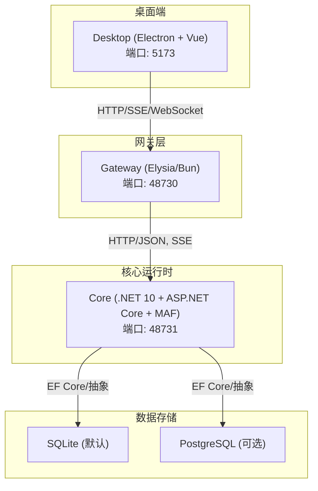
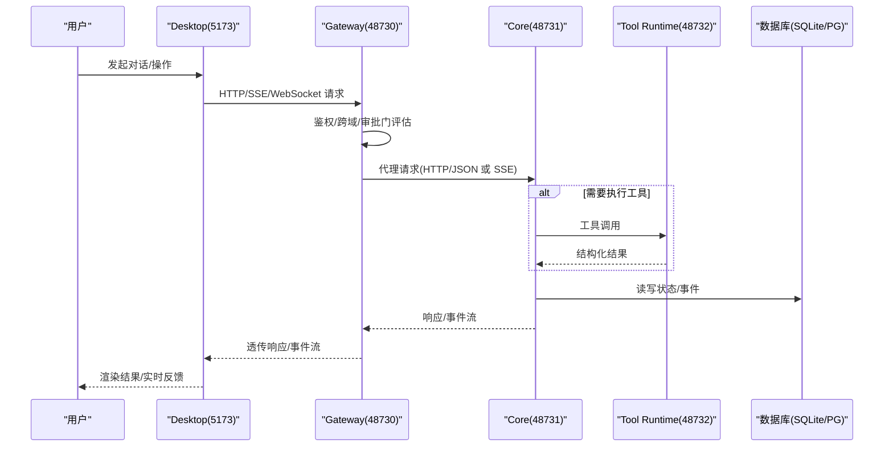
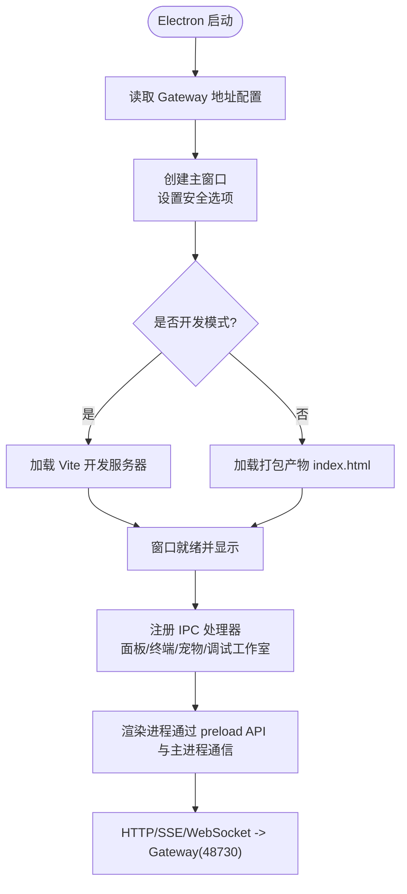
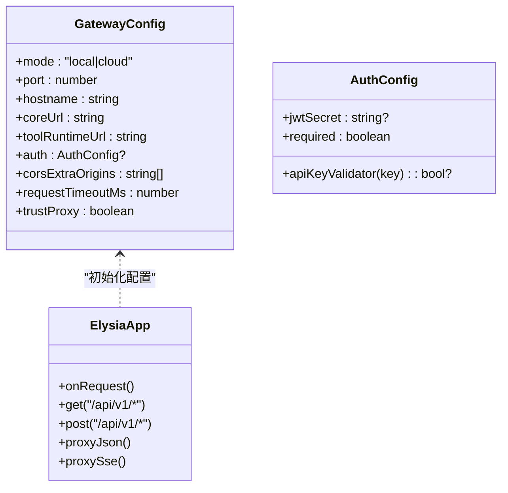
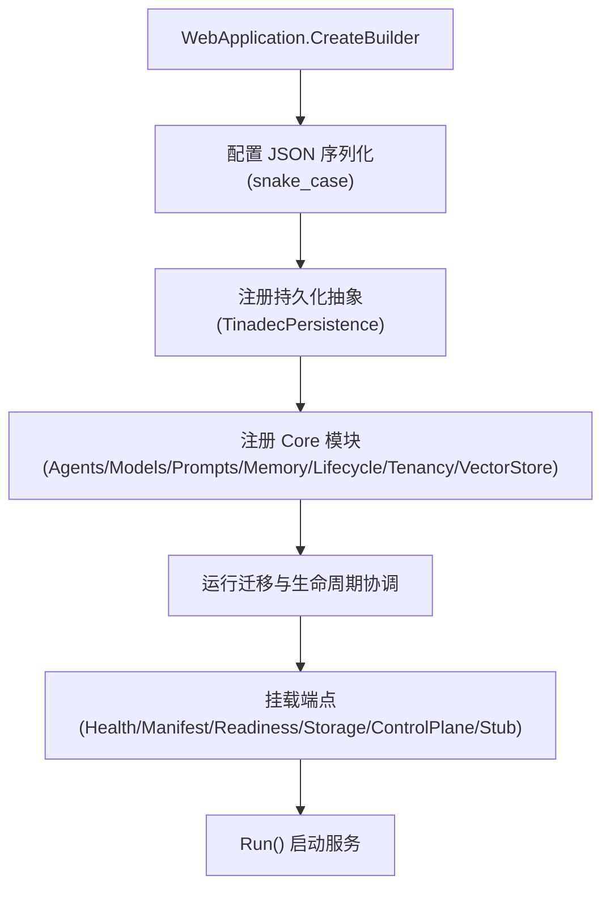
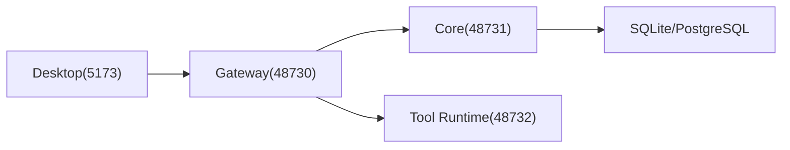
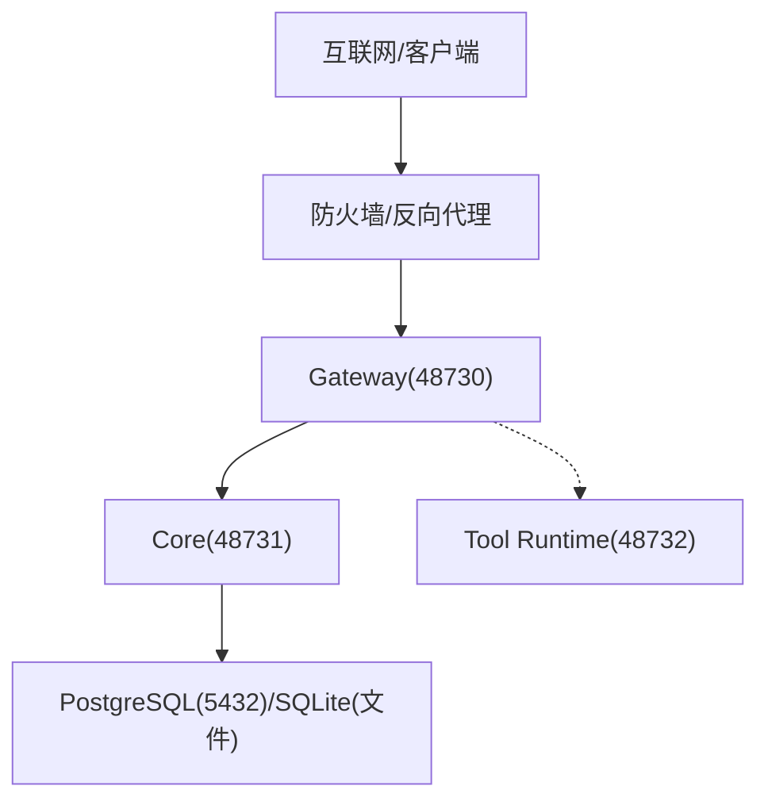

# 系统上下文图

<cite>
**本文引用的文件**   
- [README.md](file://README.md)
- [package.json](file://package.json)
- [apps/desktop/package.json](file://apps/desktop/package.json)
- [TinadecCore/Api/Program.cs](file://TinadecCore/Api/Program.cs)
- [TinadecCore/Api/appsettings.json](file://TinadecCore/Api/appsettings.json)
- [TinadecGateway/src/index.ts](file://TinadecGateway/src/index.ts)
- [TinadecGateway/src/config.ts](file://TinadecGateway/src/config.ts)
- [apps/desktop/electron/main.cjs](file://apps/desktop/electron/main.cjs)
- [docs/startup.md](file://docs/startup.md)
- [docs/architecture.md](file://docs/architecture.md)
</cite>

## 目录
1. [简介](#简介)
2. [项目结构](#项目结构)
3. [核心组件](#核心组件)
4. [架构总览](#架构总览)
5. [详细组件分析](#详细组件分析)
6. [依赖关系分析](#依赖关系分析)
7. [性能考虑](#性能考虑)
8. [故障排除指南](#故障排除指南)
9. [结论](#结论)
10. [附录](#附录)

## 简介
本文件为 TinadecOffice 的系统上下文与部署拓扑文档，面向开发者与运维人员，覆盖 Desktop 应用、Gateway 服务、Core 运行时、数据库存储与外部依赖之间的职责边界、通信协议与数据流向。同时给出网络拓扑（端口分配与防火墙建议）、本地与生产环境差异、容器化与负载均衡配置要点，以及常见连接问题与性能瓶颈的诊断方法。

## 项目结构
- 三层职责清晰：Desktop（Electron + Vue 渲染器）仅负责 UI 与交互；Gateway（Elysia/Bun）作为薄 BFF/代理；Core（.NET 10 + ASP.NET Core + MAF）是唯一状态权威，提供编排、工具策略、模型路由、持久化与就绪回执。
- 默认端口：
  - Desktop（Vite 开发）：5173
  - Gateway API：48730
  - Core 运行时：48731
- 启动命令统一由根 package.json 编排，支持一键启动或拆分启动。

**图表来源**
- [README.md:17-32](file://README.md#L17-L32)
- [docs/architecture.md:13-17](file://docs/architecture.md#L13-L17)
- [TinadecCore/Api/appsettings.json:9-22](file://TinadecCore/Api/appsettings.json#L9-L22)

**章节来源**
- [README.md:17-32](file://README.md#L17-L32)
- [package.json:9-16](file://package.json#L9-L16)
- [apps/desktop/package.json:8-15](file://apps/desktop/package.json#L8-L15)
- [docs/architecture.md:13-17](file://docs/architecture.md#L13-L17)

## 核心组件
- Desktop（Electron + Vite）
  - 职责：UI 呈现、会话交互、面板窗口管理、调试工作室窗口、通过 IPC 与 Electron 主进程通信，最终通过 HTTP/SSE/WebSocket 调用 Gateway。
  - 入口：main.cjs 创建主窗口、注册 IPC、加载 Vite 开发服务器或打包产物。
- Gateway（Elysia/Bun）
  - 职责：认证（云端模式）、BFF 聚合视图、协议转换（HTTP/JSON、SSE、WebSocket、流式）、代理到 Core 与 Tool Runtime、审批门控与高风险二次确认。
  - 入口：index.ts 定义路由与中间件；config.ts 提供本地/云端模式配置。
- Core（.NET 10 + ASP.NET Core + MAF）
  - 职责：唯一状态权威（项目、会话、消息、审批、模型路由、扩展、Agent、任务图、上下文包、监督发现等），暴露健康、就绪、清单、调试等 API，持久化至 SQLite/PostgreSQL。
  - 入口：Program.cs 构建 WebApplication、注册模块、迁移与就绪检查、挂载端点。

**章节来源**
- [apps/desktop/electron/main.cjs:1-105](file://apps/desktop/electron/main.cjs#L1-L105)
- [TinadecGateway/src/index.ts:1-21](file://TinadecGateway/src/index.ts#L1-L21)
- [TinadecGateway/src/config.ts:1-21](file://TinadecGateway/src/config.ts#L1-L21)
- [TinadecCore/Api/Program.cs:1-40](file://TinadecCore/Api/Program.cs#L1-L40)

## 架构总览
下图展示端到端请求路径、事件流与数据落库过程。Desktop 仅与 Gateway 通信；Gateway 将业务请求转发给 Core，必要时与 Tool Runtime 协作；Core 通过共享数据库抽象写入持久化层。

**图表来源**
- [TinadecGateway/src/index.ts:156-178](file://TinadecGateway/src/index.ts#L156-L178)
- [TinadecGateway/src/config.ts:65-106](file://TinadecGateway/src/config.ts#L65-L106)
- [TinadecCore/Api/Program.cs:44-175](file://TinadecCore/Api/Program.cs#L44-L175)
- [docs/architecture.md:51-68](file://docs/architecture.md#L51-L68)

## 详细组件分析

### Desktop（Electron + Vite）
- 主进程 main.cjs
  - 创建主窗口、DevTools、IPC 处理（项目打开、配置、重启、面板窗口、宠物窗口、终端等）。
  - 在开发模式下加载 Vite 开发服务器 URL，生产模式加载打包 index.html。
  - 维护面板窗口生命周期与主题广播。
- 前端与后端交互
  - 通过 window.tinadec.* preload API 与主进程通信，最终通过 HTTP/SSE/WebSocket 访问 Gateway。
  - 不直接访问 Core，避免绕过审批门与一致性约束。

**图表来源**
- [apps/desktop/electron/main.cjs:59-105](file://apps/desktop/electron/main.cjs#L59-L105)
- [apps/desktop/package.json:8-15](file://apps/desktop/package.json#L8-L15)

**章节来源**
- [apps/desktop/electron/main.cjs:1-105](file://apps/desktop/electron/main.cjs#L1-L105)
- [apps/desktop/package.json:8-15](file://apps/desktop/package.json#L8-L15)

### Gateway（Elysia/Bun）
- 路由与中间件
  - CORS、认证（云端模式）、健康/就绪探针、项目/会话/消息、SSE 事件流、审批门、代码工具执行、Model/Agent Center 聚合、Market/Extensions、MCP、ACP、Debug Studio 等。
- 代理与协议转换
  - proxyJson/proxySse 转发到 Core；对 Tool Runtime 的 JSON 代理；SSE/WebSocket 透传。
- 配置
  - 本地模式监听 127.0.0.1，无认证；云端模式监听 0.0.0.0，支持 JWT/API Key、租户、反向代理头信任、横向扩展。

**图表来源**
- [TinadecGateway/src/config.ts:20-49](file://TinadecGateway/src/config.ts#L20-L49)
- [TinadecGateway/src/index.ts:107-178](file://TinadecGateway/src/index.ts#L107-L178)

**章节来源**
- [TinadecGateway/src/index.ts:1-21](file://TinadecGateway/src/index.ts#L1-L21)
- [TinadecGateway/src/config.ts:1-21](file://TinadecGateway/src/config.ts#L1-L21)

### Core（.NET 10 + ASP.NET Core + MAF）
- 启动与模块
  - Program.cs 配置 JSON 序列化（snake_case）、注册持久化抽象与 Core 模块、运行迁移与生命周期协调。
- 关键端点
  - /api/v1/health、/api/v1/harness/manifest、/api/v1/readiness、存储/控制面/桩端点。
- 存储
  - appsettings.json 中默认 SQLite，可选 PostgreSQL；支持连接探测超时与开发身份。

**图表来源**
- [TinadecCore/Api/Program.cs:10-40](file://TinadecCore/Api/Program.cs#L10-L40)
- [TinadecCore/Api/appsettings.json:9-22](file://TinadecCore/Api/appsettings.json#L9-L22)

**章节来源**
- [TinadecCore/Api/Program.cs:1-40](file://TinadecCore/Api/Program.cs#L1-L40)
- [TinadecCore/Api/appsettings.json:9-22](file://TinadecCore/Api/appsettings.json#L9-L22)

## 依赖关系分析
- Desktop 依赖 Gateway（端口 48730），不直连 Core。
- Gateway 依赖 Core（端口 48731）与 Tool Runtime（端口 48732，按需），并在云端模式启用认证与租户上下文。
- Core 依赖数据库抽象（SQLite 默认，PostgreSQL 可选），通过 EF Core 进行迁移与读写。
- 事件流通过 SSE 从 Core 经 Gateway 推送到 Desktop。

**图表来源**
- [docs/architecture.md:13-17](file://docs/architecture.md#L13-L17)
- [TinadecGateway/src/config.ts:65-106](file://TinadecGateway/src/config.ts#L65-L106)
- [TinadecCore/Api/appsettings.json:9-22](file://TinadecCore/Api/appsettings.json#L9-L22)

**章节来源**
- [docs/architecture.md:13-17](file://docs/architecture.md#L13-L17)
- [TinadecGateway/src/config.ts:65-106](file://TinadecGateway/src/config.ts#L65-L106)

## 性能考虑
- 事件流与长连接
  - SSE 用于统一事件流，需确保 Gateway 与 Core 的 keep-alive 与缓冲配置正确（如 x-accel-buffering=no）。
- 并发与限流
  - Core 的执行层最大并行度可配置；Gateway 的请求超时可通过环境变量调整。
- 存储选择
  - 本地开发使用 SQLite 零配置；生产建议使用 PostgreSQL 以获得更好的并发与可靠性。
- 缓存与降级
  - Model/Agent Center 聚合视图应缓存必要元数据，Core 不可达时返回诊断信息而非错误堆栈。

[本节为通用指导，无需特定文件引用]

## 故障排除指南
- 端口占用与连通性
  - 验证 48730、48731、5173 是否被占用且服务正常监听。
  - 使用 health/readiness 端点快速定位问题：
    - Gateway: GET /api/v1/health
    - Core: GET /api/v1/health、GET /api/v1/readiness
- 常见问题
  - Settings > Agents 为空：先检查 Gateway 健康，再检查 Gateway 是否能代理 /api/v1/agents；若 404 则重启 Gateway；若 500 则 Core 未就绪或未启动。
  - .NET 构建失败（版本解析异常）：清理 Version/Ice-Version 环境变量后重试。
  - 旧名称残留：重启 Core 以触发内置种子规范化。
- 日志与调试
  - Windows 后台启动可将 stdout/stderr 重定向到 output/logs。
  - 使用 Debug Studio 查看 traces/spans/metrics，或通过 WS 订阅实时事件。

**章节来源**
- [docs/startup.md:93-161](file://docs/startup.md#L93-L161)
- [TinadecCore/Api/Program.cs:44-175](file://TinadecCore/Api/Program.cs#L44-L175)
- [TinadecGateway/src/index.ts:156-178](file://TinadecGateway/src/index.ts#L156-L178)

## 结论
TinadecOffice 采用“Desktop → Gateway → Core”的清晰分层，Core 作为唯一状态权威，Gateway 承担协议转换与 BFF 聚合，Desktop 专注交互体验。通过统一的端口规划、事件流与数据库抽象，系统在本地开发与生产部署间具备良好的一致性与可扩展性。配合完善的启动脚本、健康检查与调试能力，可有效支撑 Agent 工作空间的持续演进。

[本节为总结性内容，无需特定文件引用]

## 附录

### 网络拓扑与端口分配
- 端口
  - Desktop（Vite 开发）：5173
  - Gateway API：48730
  - Core 运行时：48731
  - Tool Runtime（按需）：48732
- 防火墙规则建议
  - 本地开发：允许 127.0.0.1 的 48730、48731、5173 入站/出站。
  - 生产环境：仅暴露 Gateway（48730）对外；Core 与 Tool Runtime 仅内网可达；数据库端口（SQLite 文件、PostgreSQL 5432）限制白名单。

**图表来源**
- [docs/architecture.md:13-17](file://docs/architecture.md#L13-L17)
- [TinadecCore/Api/appsettings.json:9-22](file://TinadecCore/Api/appsettings.json#L9-L22)

### 本地与生产环境差异
- 本地开发
  - 单实例、127.0.0.1 监听、无认证、SQLite 默认。
  - 一键启动：npm run dev（concurrently 启动 core/gateway/desktop）。
- 生产部署
  - 云端模式：0.0.0.0 监听、JWT/API Key 认证、租户上下文、信任反向代理头、无状态 Gateway 横向扩展。
  - 数据库：推荐 PostgreSQL；连接字符串与探针超时通过配置项控制。
  - 负载均衡：多实例 Gateway 前挂 Nginx/HAProxy，按路径或域名分发；Core 与 Tool Runtime 通过内部网络访问。

**章节来源**
- [TinadecGateway/src/config.ts:1-21](file://TinadecGateway/src/config.ts#L1-L21)
- [package.json:9-16](file://package.json#L9-L16)
- [docs/startup.md:15-31](file://docs/startup.md#L15-L31)

### 容器化部署选项
- 镜像建议
  - Core：基于 .NET 10 SDK/Runtime 的轻量镜像，暴露 48731。
  - Gateway：基于 Bun 镜像，暴露 48730，环境变量注入 mode/port/coreUrl/toolRuntimeUrl/auth。
  - Desktop：打包产物由 CI 生成，运行时由 Electron 宿主承载（桌面端）。
- 编排
  - Docker Compose/Kubernetes：定义 Service/Ingress，将 48730 暴露；Core/Tool Runtime/DB 使用 ClusterIP。
  - 健康检查：/api/v1/health 与 /api/v1/readiness 作为存活/就绪探针。

[本节为通用指导，无需特定文件引用]

### 负载均衡配置要点
- Gateway 无状态，适合水平扩展；注意会话级 WebSocket/SSE 粘性会话或集中式事件总线。
- Core 有状态（数据库），通过数据库实现一致性；避免在同一进程内持有跨请求状态。
- 反向代理需保留 SSE/WebSocket 头部与超时设置。

[本节为通用指导，无需特定文件引用]