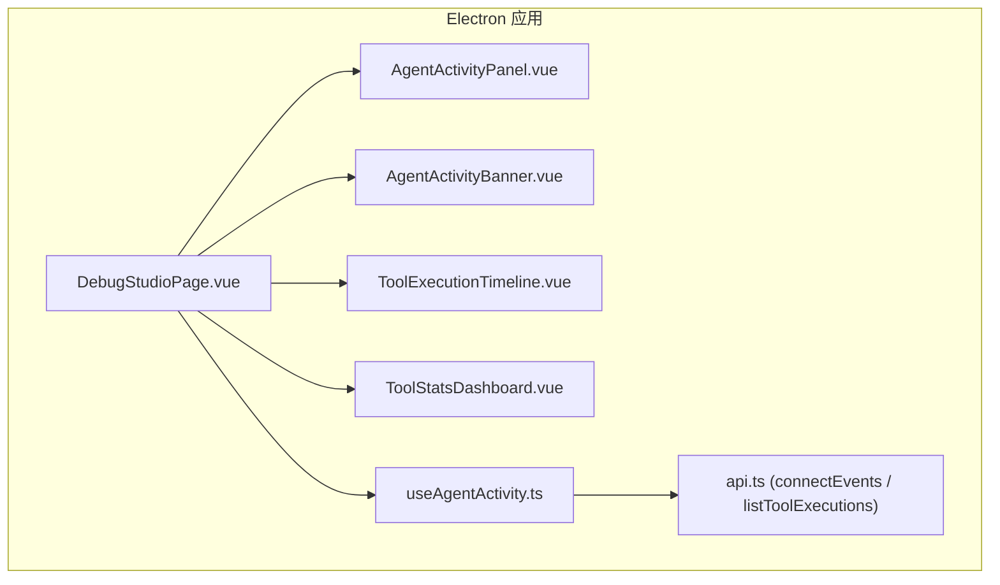
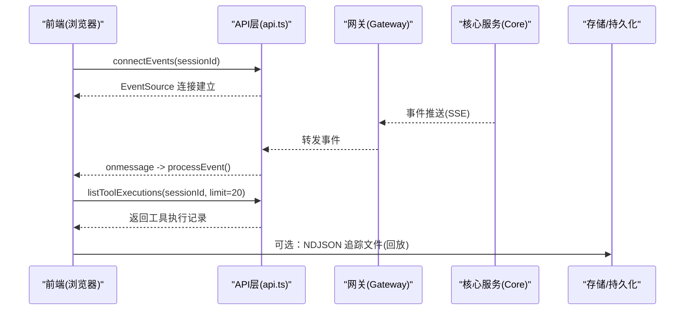
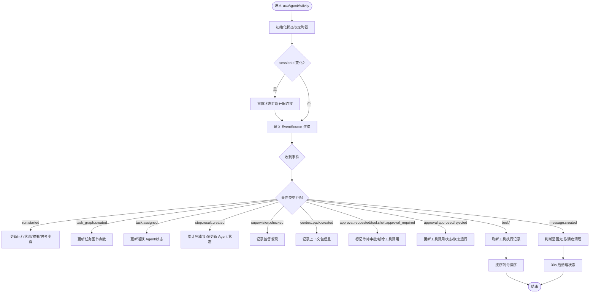
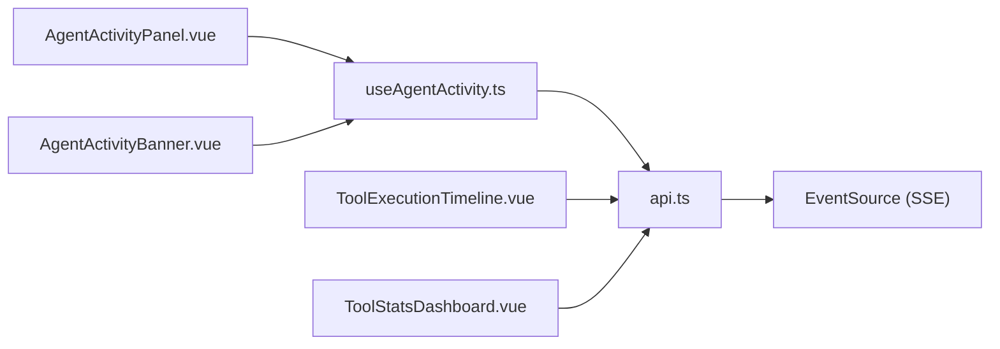

# Agent Debug Studio

<cite>
**本文引用的文件**   
- [DebugStudioPage.vue](file://apps/desktop/src/pages/DebugStudioPage.vue)
- [useAgentActivity.ts](file://apps/desktop/src/composables/useAgentActivity.ts)
- [AgentActivityPanel.vue](file://apps/desktop/src/components/AgentActivityPanel.vue)
- [AgentActivityBanner.vue](file://apps/desktop/src/components/chat/AgentActivityBanner.vue)
- [ToolExecutionTimeline.vue](file://apps/desktop/src/components/tools/ToolExecutionTimeline.vue)
- [ToolStatsDashboard.vue](file://apps/desktop/src/components/tools/ToolStatsDashboard.vue)
- [api.ts](file://apps/desktop/src/api.ts)
- [agent-debug-studio-plan.md](file://docs/agent-debug-studio-plan.md)
</cite>

## 目录
1. [简介](#简介)
2. [项目结构](#项目结构)
3. [核心组件](#核心组件)
4. [架构总览](#架构总览)
5. [详细组件分析](#详细组件分析)
6. [依赖关系分析](#依赖关系分析)
7. [性能考量](#性能考量)
8. [故障诊断指南](#故障诊断指南)
9. [结论](#结论)
10. [附录](#附录)

## 简介
本文件为 Agent Debug Studio 的完整技术文档，聚焦于实时追踪可视化系统的架构与实现。内容涵盖：
- Activity 数据收集、事件流订阅（SSE）与前端展示逻辑
- DebugStudioPage 页面与相关 UI 组件的职责划分
- useAgentActivity 组合式函数的使用方式与状态模型
- 工具执行时间线、统计看板等调试工具的功能说明
- 事件流订阅方式、性能监控指标与常见故障诊断技巧
- 完整的调试工作流与最佳实践建议

## 项目结构
Agent Debug Studio 的前端位于 Electron 桌面应用中，采用 Vue 3 + TypeScript 构建。关键目录与职责如下：
- pages：页面入口，如 DebugStudioPage.vue 作为调试页面的容器
- composables：组合式函数，如 useAgentActivity.ts 负责事件订阅、状态管理与数据刷新
- components：UI 组件，包括活动面板、横幅、工具执行时间线与统计看板
- api.ts：统一的 API 封装，包含 SSE 事件连接与 REST 调用

图表来源
- [DebugStudioPage.vue:1-8](file://apps/desktop/src/pages/DebugStudioPage.vue#L1-L8)
- [useAgentActivity.ts:151-697](file://apps/desktop/src/composables/useAgentActivity.ts#L151-L697)
- [AgentActivityPanel.vue:1-200](file://apps/desktop/src/components/AgentActivityPanel.vue#L1-L200)
- [AgentActivityBanner.vue:1-130](file://apps/desktop/src/components/chat/AgentActivityBanner.vue#L1-L130)
- [ToolExecutionTimeline.vue:1-164](file://apps/desktop/src/components/tools/ToolExecutionTimeline.vue#L1-L164)
- [ToolStatsDashboard.vue:1-142](file://apps/desktop/src/components/tools/ToolStatsDashboard.vue#L1-L142)
- [api.ts:1310-1328](file://apps/desktop/src/api.ts#L1310-L1328)

章节来源
- [DebugStudioPage.vue:1-8](file://apps/desktop/src/pages/DebugStudioPage.vue#L1-L8)
- [useAgentActivity.ts:151-697](file://apps/desktop/src/composables/useAgentActivity.ts#L151-L697)
- [api.ts:1310-1328](file://apps/desktop/src/api.ts#L1310-L1328)

## 核心组件
- DebugStudioPage：页面容器，直接渲染调试主组件
- useAgentActivity：组合式函数，负责：
  - 通过 SSE 订阅事件流（EventSource），处理编排运行、任务图、任务分配、步骤结果、监督、上下文包、审批请求/决策、消息创建等事件
  - 维护 Agent 运行状态、工具调用列表、思考步骤、Agent 状态映射与进度事件
  - 定时刷新工具执行记录，并基于编排快照补充状态
- AgentActivityPanel：活动面板，展示运行状态、任务图、思考步骤与实时进度事件
- AgentActivityBanner：顶部横幅，快速显示当前 Agent 的运行状态与进度
- ToolExecutionTimeline：工具执行时间线，支持筛选、排序、展开详情与重放
- ToolStatsDashboard：工具统计看板，汇总成功率、失败率、平均耗时、审批通过率与按来源分布

章节来源
- [DebugStudioPage.vue:1-8](file://apps/desktop/src/pages/DebugStudioPage.vue#L1-L8)
- [useAgentActivity.ts:151-697](file://apps/desktop/src/composables/useAgentActivity.ts#L151-L697)
- [AgentActivityPanel.vue:1-200](file://apps/desktop/src/components/AgentActivityPanel.vue#L1-L200)
- [AgentActivityBanner.vue:1-130](file://apps/desktop/src/components/chat/AgentActivityBanner.vue#L1-L130)
- [ToolExecutionTimeline.vue:1-164](file://apps/desktop/src/components/tools/ToolExecutionTimeline.vue#L1-L164)
- [ToolStatsDashboard.vue:1-142](file://apps/desktop/src/components/tools/ToolStatsDashboard.vue#L1-L142)

## 架构总览
整体数据流分为“实时模式”和“回放模式”。实时模式下，后端通过 EventSource（SSE）推送事件；前端在 useAgentActivity 中订阅并更新状态，同时按需拉取工具执行记录。回放模式可读取 NDJSON 追踪文件进行离线分析（计划文档中定义）。

图表来源
- [api.ts:1310-1328](file://apps/desktop/src/api.ts#L1310-L1328)
- [useAgentActivity.ts:640-654](file://apps/desktop/src/composables/useAgentActivity.ts#L640-L654)
- [agent-debug-studio-plan.md:168-184](file://docs/agent-debug-studio-plan.md#L168-L184)

## 详细组件分析

### 组合式函数 useAgentActivity
职责与行为：
- 初始化状态：运行状态、工具调用列表、思考步骤、Agent 状态映射、进度事件
- 事件处理：根据事件类型更新活动状态、任务图节点计数、Agent 状态、审批流程与消息生成
- 数据同步：监听 sessionId 变化自动重连；监听编排快照增量更新；完成后定时清理
- 工具执行刷新：对工具类或审批类事件触发拉取最新执行记录，并按序列号排序

关键数据结构：
- AgentActivity：运行状态、runId、开始时间、摘要、活跃 Agent 名称与角色、完成/总数节点、最后更新时间
- ToolCall：工具调用 ID、名称、状态、起止时间、耗时、参数摘要、结果摘要、是否需要审批、证据、序列号、风险等级
- ThinkingStep：思考步骤类型（运行启动、任务图、Agent 分配、监督、上下文包、步骤结果）、标题、描述、时间戳、耗时、严重级别、分类、详情
- AgentState：Agent 标识、名称、层级、类型、状态、最后活跃时间、当前任务
- ProgressEvent：进度事件 ID、序列号、类型、图标、消息、时间戳

图表来源
- [useAgentActivity.ts:151-697](file://apps/desktop/src/composables/useAgentActivity.ts#L151-L697)

章节来源
- [useAgentActivity.ts:151-697](file://apps/desktop/src/composables/useAgentActivity.ts#L151-L697)

### 活动面板 AgentActivityPanel
功能要点：
- 展示运行状态（思考/工作中/等待审批/已完成/错误），带图标动画与进度条
- 展示任务图（按优先级排序），显示每个任务的完成状态与分配 Agent
- 展示思考步骤（运行启动、任务图、Agent 分配、监督、上下文包、步骤结果），含时间戳与耗时
- 展示实时进度事件（最近 15 条），支持图标映射与时间格式化

交互细节：
- 各区块可折叠/展开
- 计算已耗时与百分比进度
- 区分规划层与执行层 Agent，分组展示

章节来源
- [AgentActivityPanel.vue:1-200](file://apps/desktop/src/components/AgentActivityPanel.vue#L1-L200)

### 横幅 AgentActivityBanner
功能要点：
- 顶部横幅快速呈现当前 Agent 的运行状态、角色、摘要、开始时间与已耗时
- 展开后可查看规划层与执行层 Agent 的状态卡片
- 进度条与完成节点计数实时更新

章节来源
- [AgentActivityBanner.vue:1-130](file://apps/desktop/src/components/chat/AgentActivityBanner.vue#L1-L130)

### 工具执行时间线 ToolExecutionTimeline
功能要点：
- 支持按状态筛选（全部/成功/失败/审批/运行）与按时间排序（新/旧）
- 每条记录展示工具图标、来源、状态、时间、耗时、风险等级、审批标记与证据标签
- 展开后可查看工具调用详情（ToolInvocationCard），支持重放与查看详情

章节来源
- [ToolExecutionTimeline.vue:1-164](file://apps/desktop/src/components/tools/ToolExecutionTimeline.vue#L1-L164)

### 工具统计看板 ToolStatsDashboard
功能要点：
- 概览：总调用数、成功数、失败数、等待审批数、平均耗时、审批通过率
- 状态分布：成功/失败/运行/待处理/审批/阻塞的占比条形图
- Top 工具：调用次数最多的前 5 个工具及其平均耗时
- 来源分布：按 source 字段统计调用量与占比

章节来源
- [ToolStatsDashboard.vue:1-142](file://apps/desktop/src/components/tools/ToolStatsDashboard.vue#L1-L142)

### 页面入口 DebugStudioPage
功能要点：
- 作为调试页面的容器，直接渲染调试主组件（DebugStudio.vue）
- 保持页面简洁，将业务逻辑下沉至组合式函数与子组件

章节来源
- [DebugStudioPage.vue:1-8](file://apps/desktop/src/pages/DebugStudioPage.vue#L1-L8)

## 依赖关系分析
- 组件依赖：
  - AgentActivityPanel 与 AgentActivityBanner 依赖 useAgentActivity 提供的状态与事件
  - ToolExecutionTimeline 与 ToolStatsDashboard 依赖工具执行记录（来自 API）
- API 依赖：
  - useAgentActivity 通过 api.connectEvents 建立 SSE 连接，接收事件并处理
  - 工具执行记录通过 api.listToolExecutions 获取
- 外部依赖：
  - EventSource（SSE）用于实时事件推送
  - Lucide 图标库用于 UI 图标

图表来源
- [useAgentActivity.ts:640-654](file://apps/desktop/src/composables/useAgentActivity.ts#L640-L654)
- [api.ts:1310-1328](file://apps/desktop/src/api.ts#L1310-L1328)

章节来源
- [useAgentActivity.ts:640-654](file://apps/desktop/src/composables/useAgentActivity.ts#L640-L654)
- [api.ts:1310-1328](file://apps/desktop/src/api.ts#L1310-L1328)

## 性能考量
- 事件处理优化：
  - 去重机制：进度事件按 id 去重，避免重复渲染
  - 限制长度：进度事件仅保留最近 15 条，减少 DOM 压力
- 数据刷新策略：
  - 仅在工具类或审批类事件触发时刷新工具执行记录，降低频繁拉取开销
  - 工具执行记录按序列号排序，保证时序一致性
- 内存管理：
  - 组件卸载时断开 EventSource 并清理定时器，防止内存泄漏
- 渲染优化：
  - 使用 computed 派生状态，减少不必要的重新计算
  - 折叠/展开控制减少初始渲染复杂度

章节来源
- [useAgentActivity.ts:178-190](file://apps/desktop/src/composables/useAgentActivity.ts#L178-L190)
- [useAgentActivity.ts:682-685](file://apps/desktop/src/composables/useAgentActivity.ts#L682-L685)

## 故障诊断指南
常见问题与排查步骤：
- 事件流未连接：
  - 检查 sessionId 是否正确传递
  - 确认 api.connectEvents 是否成功建立 EventSource
  - 查看浏览器控制台是否有网络错误或跨域问题
- 工具执行记录为空：
  - 确认 session 是否存在且活跃
  - 检查 api.listToolExecutions 是否返回数据
  - 验证事件类型是否触发刷新逻辑（tool.* / approval.* / step.* / task*）
- 状态不同步：
  - 检查编排快照是否更新，确保 enrichFromOrchestration 被调用
  - 确认事件处理分支是否正确映射到状态更新
- 性能问题：
  - 观察进度事件数量是否过多，必要时调整限制
  - 检查工具执行记录刷新频率，避免过于频繁

章节来源
- [useAgentActivity.ts:640-654](file://apps/desktop/src/composables/useAgentActivity.ts#L640-L654)
- [useAgentActivity.ts:540-565](file://apps/desktop/src/composables/useAgentActivity.ts#L540-L565)
- [useAgentActivity.ts:585-638](file://apps/desktop/src/composables/useAgentActivity.ts#L585-L638)

## 结论
Agent Debug Studio 通过组合式函数与组件化架构，实现了高效的实时追踪与可视化。useAgentActivity 作为核心数据管道，结合 SSE 事件流与 REST API，提供了完整的调试能力。UI 组件清晰分离职责，便于扩展与维护。未来可进一步集成回放模式与模拟控制，提升调试效率与问题定位能力。

## 附录
- 参考文档：agent-debug-studio-plan.md 定义了完整的实施计划、API 契约与架构图，可作为后续扩展的指导
- 最佳实践：
  - 合理设置事件过滤与刷新策略，避免过度渲染
  - 使用结构化日志与追踪，便于问题回溯与分析
  - 提供用户友好的错误提示与重试机制

章节来源
- [agent-debug-studio-plan.md:1-1130](file://docs/agent-debug-studio-plan.md#L1-L1130)