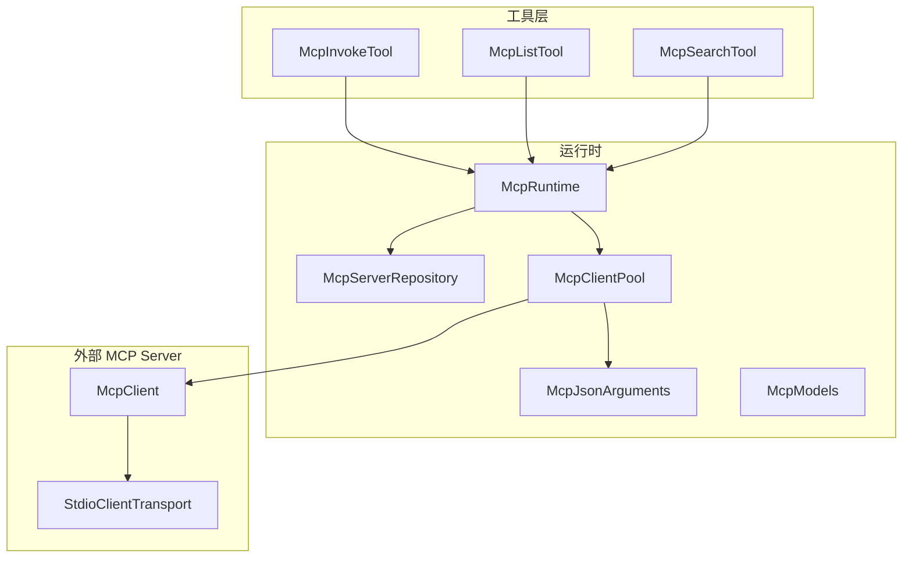
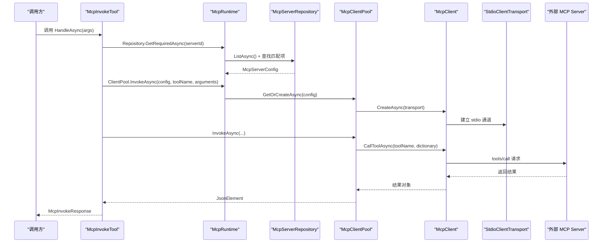
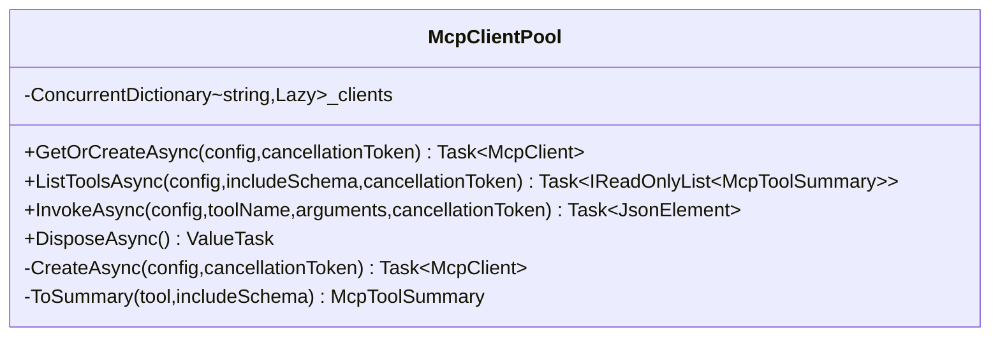
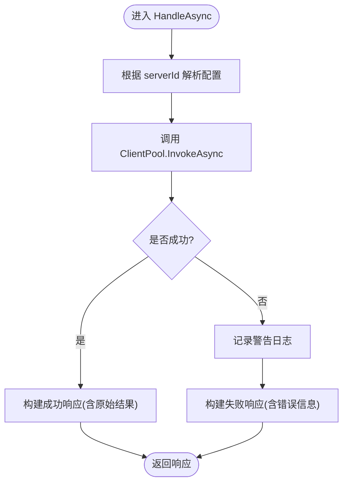
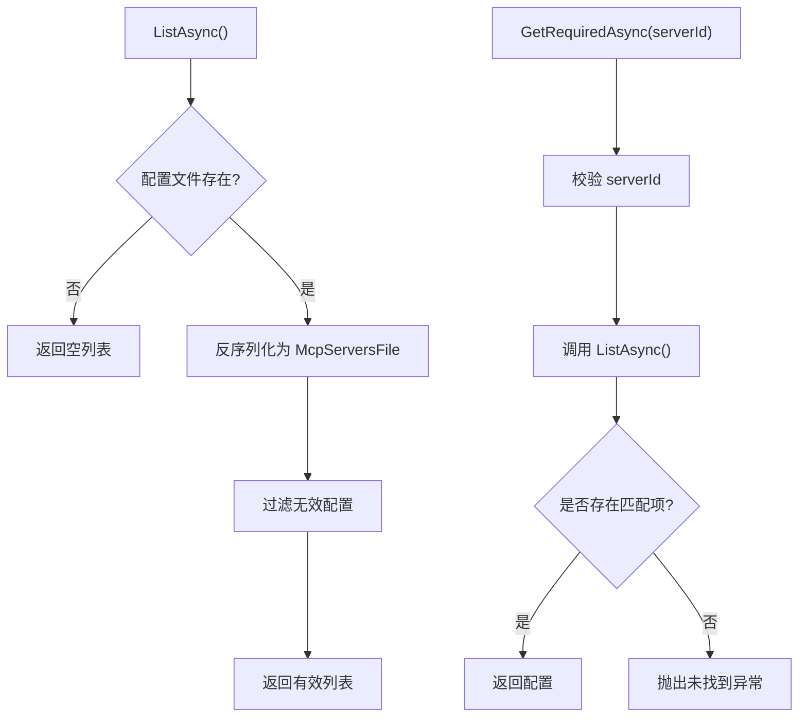
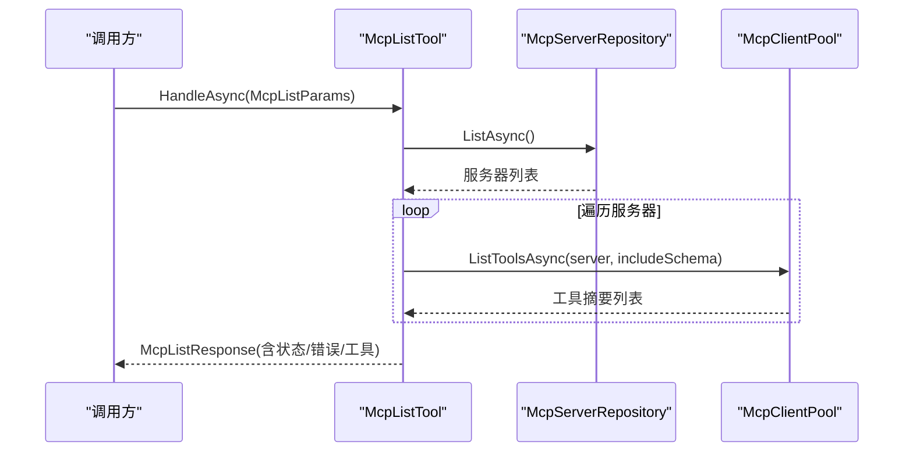
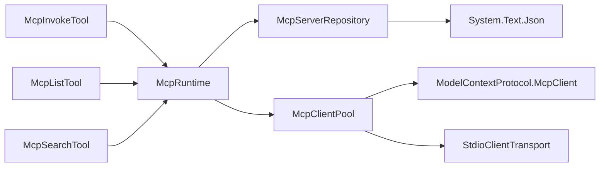

# MCP 透传

<cite>
**本文引用的文件**   
- [McpClientPool.cs](file://TinadecTools/Tools/Mcp/McpClientPool.cs)
- [McpInvokeTool.cs](file://TinadecTools/Tools/Mcp/McpInvokeTool.cs)
- [McpServerRepository.cs](file://TinadecTools/Tools/Mcp/McpServerRepository.cs)
- [McpRuntime.cs](file://TinadecTools/Tools/Mcp/McpRuntime.cs)
- [McpModels.cs](file://TinadecTools/Tools/Mcp/McpModels.cs)
- [McpJsonArguments.cs](file://TinadecTools/Tools/Mcp/McpJsonArguments.cs)
- [McpListTool.cs](file://TinadecTools/Tools/Mcp/McpListTool.cs)
- [McpSearchTool.cs](file://TinadecTools/Tools/Mcp/McpSearchTool.cs)
- [McpPassThroughTests.cs](file://tests/TinadecTools.Tests/McpPassThroughTests.cs)
- [mcp-mock-server.js](file://tests/TinadecTools.Tests/fixtures/mcp-mock-server.js)
- [.mcp.json](file://.mcp.json)
</cite>

## 目录
1. [简介](#简介)
2. [项目结构](#项目结构)
3. [核心组件](#核心组件)
4. [架构总览](#架构总览)
5. [详细组件分析](#详细组件分析)
6. [依赖关系分析](#依赖关系分析)
7. [性能与连接管理](#性能与连接管理)
8. [配置与集成示例](#配置与集成示例)
9. [故障排除指南](#故障排除指南)
10. [结论](#结论)

## 简介
本文件面向“通过 Tool 层接入外部 MCP server”的透传能力，系统性说明以下要点：
- 如何通过 McpInvokeTool、McpListTool、McpSearchTool 暴露统一的工具入口；
- McpClientPool 的连接池管理与生命周期；
- McpServerRepository 的服务发现机制（基于 JSON 配置文件）；
- MCP 协议的适配层设计、消息格式转换与错误处理策略；
- 外部 MCP 服务器的配置方法、连接管理与性能优化建议；
- 完整的集成示例与故障排除。

## 项目结构
MCP 透传功能位于 TinadecTools 的 Tools/Mcp 目录下，围绕运行时、配置、连接池与工具封装展开：
- 运行时与装配：McpRuntime
- 服务发现与配置：McpServerRepository
- 连接池与协议调用：McpClientPool
- 参数与模型：McpModels、McpJsonArguments
- 对外工具：McpInvokeTool、McpListTool、McpSearchTool
- 测试与示例：McpPassThroughTests、mcp-mock-server.js
- 其他参考配置：.mcp.json（用于其他场景的 MCP 配置样例）

图表来源
- [McpInvokeTool.cs](file://TinadecTools/Tools/Mcp/McpInvokeTool.cs)
- [McpListTool.cs](file://TinadecTools/Tools/Mcp/McpListTool.cs)
- [McpSearchTool.cs](file://TinadecTools/Tools/Mcp/McpSearchTool.cs)
- [McpRuntime.cs](file://TinadecTools/Tools/Mcp/McpRuntime.cs)
- [McpServerRepository.cs](file://TinadecTools/Tools/Mcp/McpServerRepository.cs)
- [McpClientPool.cs](file://TinadecTools/Tools/Mcp/McpClientPool.cs)
- [McpJsonArguments.cs](file://TinadecTools/Tools/Mcp/McpJsonArguments.cs)
- [McpModels.cs](file://TinadecTools/Tools/Mcp/McpModels.cs)

章节来源
- [McpRuntime.cs:1-19](file://TinadecTools/Tools/Mcp/McpRuntime.cs#L1-L19)
- [McpServerRepository.cs:1-53](file://TinadecTools/Tools/Mcp/McpServerRepository.cs#L1-L53)
- [McpClientPool.cs:1-89](file://TinadecTools/Tools/Mcp/McpClientPool.cs#L1-L89)
- [McpInvokeTool.cs:1-39](file://TinadecTools/Tools/Mcp/McpInvokeTool.cs#L1-L39)
- [McpListTool.cs:1-42](file://TinadecTools/Tools/Mcp/McpListTool.cs#L1-L42)
- [McpSearchTool.cs:1-87](file://TinadecTools/Tools/Mcp/McpSearchTool.cs#L1-L87)
- [McpModels.cs:1-115](file://TinadecTools/Tools/Mcp/McpModels.cs#L1-L115)
- [McpJsonArguments.cs:1-37](file://TinadecTools/Tools/Mcp/McpJsonArguments.cs#L1-L37)

## 核心组件
- McpRuntime：提供全局 Repository 与 ClientPool 的访问与测试注入点，并在进程退出时释放资源。
- McpServerRepository：从 JSON 配置文件加载并校验服务器列表，支持环境变量覆盖配置文件路径。
- McpClientPool：按服务器 ID 懒创建并缓存 McpClient，提供列出工具与调用工具的接口，负责 Stdio 传输与 JSON 序列化。
- McpInvokeTool / McpListTool / McpSearchTool：将 MCP 能力以 ToolFunction 的形式暴露给上层调用者，统一入参出参与错误包装。
- McpModels：定义所有请求/响应 DTO、JSON 源生成上下文以及 MCP 工具摘要等数据结构。
- McpJsonArguments：将 JsonElement 转换为字典，供底层 CallToolAsync 使用。

章节来源
- [McpRuntime.cs:1-19](file://TinadecTools/Tools/Mcp/McpRuntime.cs#L1-L19)
- [McpServerRepository.cs:1-53](file://TinadecTools/Tools/Mcp/McpServerRepository.cs#L1-L53)
- [McpClientPool.cs:1-89](file://TinadecTools/Tools/Mcp/McpClientPool.cs#L1-L89)
- [McpInvokeTool.cs:1-39](file://TinadecTools/Tools/Mcp/McpInvokeTool.cs#L1-L39)
- [McpListTool.cs:1-42](file://TinadecTools/Tools/Mcp/McpListTool.cs#L1-L42)
- [McpSearchTool.cs:1-87](file://TinadecTools/Tools/Mcp/McpSearchTool.cs#L1-L87)
- [McpModels.cs:1-115](file://TinadecTools/Tools/Mcp/McpModels.cs#L1-L115)
- [McpJsonArguments.cs:1-37](file://TinadecTools/Tools/Mcp/McpJsonArguments.cs#L1-L37)

## 架构总览
整体流程：上层通过 ToolFunction 调用 mcp_invoke/mcp_list/mcp_search，运行时解析配置、获取或复用客户端连接，最终通过 ModelContextProtocol 的 Stdio 通道与外部 MCP server 通信。

图表来源
- [McpInvokeTool.cs:1-39](file://TinadecTools/Tools/Mcp/McpInvokeTool.cs#L1-L39)
- [McpRuntime.cs:1-19](file://TinadecTools/Tools/Mcp/McpRuntime.cs#L1-L19)
- [McpServerRepository.cs:1-53](file://TinadecTools/Tools/Mcp/McpServerRepository.cs#L1-L53)
- [McpClientPool.cs:1-89](file://TinadecTools/Tools/Mcp/McpClientPool.cs#L1-L89)

## 详细组件分析

### McpClientPool 连接池
- 职责：按服务器配置懒创建并缓存 McpClient；提供 ListToolsAsync 与 InvokeAsync；在进程退出时释放连接。
- 关键点：
  - 使用 ConcurrentDictionary + Lazy<Task<McpClient>> 实现线程安全的懒加载与缓存。
  - 创建时使用 StdioClientTransport，支持命令、参数、工作目录与环境变量继承。
  - 调用前将 JsonElement 转为字典，再调用底层 CallToolAsync，并将结果序列化为 JsonElement。
  - 失败时移除对应条目，避免缓存失效连接。

图表来源
- [McpClientPool.cs:1-89](file://TinadecTools/Tools/Mcp/McpClientPool.cs#L1-L89)

章节来源
- [McpClientPool.cs:1-89](file://TinadecTools/Tools/Mcp/McpClientPool.cs#L1-L89)

### McpInvokeTool 调用封装
- 职责：将 mcp_invoke 暴露为 ToolFunction，完成参数校验、服务发现、调用与错误包装。
- 关键点：
  - 通过 McpRuntime.Repository 获取服务器配置。
  - 通过 McpRuntime.ClientPool.InvokeAsync 执行调用。
  - 成功返回包含原始 MCP 结果的响应；失败记录日志并返回结构化错误信息。

图表来源
- [McpInvokeTool.cs:1-39](file://TinadecTools/Tools/Mcp/McpInvokeTool.cs#L1-L39)

章节来源
- [McpInvokeTool.cs:1-39](file://TinadecTools/Tools/Mcp/McpInvokeTool.cs#L1-L39)

### McpServerRepository 服务发现
- 职责：从 JSON 配置文件读取并过滤有效服务器配置；支持环境变量覆盖配置文件路径。
- 关键点：
  - 配置文件路径优先级：构造参数 > 环境变量 > 默认路径。
  - 读取后仅保留 id 与 command 非空的服务器。
  - GetRequiredAsync 按 serverId 精确匹配，未找到抛出异常。

图表来源
- [McpServerRepository.cs:1-53](file://TinadecTools/Tools/Mcp/McpServerRepository.cs#L1-L53)

章节来源
- [McpServerRepository.cs:1-53](file://TinadecTools/Tools/Mcp/McpServerRepository.cs#L1-L53)

### McpListTool 与 McpSearchTool
- McpListTool：遍历已配置服务器，尝试连接并列出工具，汇总状态与错误信息。
- McpSearchTool：对多个服务器的工具进行模糊搜索，按名称与描述加权打分排序，限制返回数量。

图表来源
- [McpListTool.cs:1-42](file://TinadecTools/Tools/Mcp/McpListTool.cs#L1-L42)
- [McpServerRepository.cs:1-53](file://TinadecTools/Tools/Mcp/McpServerRepository.cs#L1-L53)
- [McpClientPool.cs:1-89](file://TinadecTools/Tools/Mcp/McpClientPool.cs#L1-L89)

章节来源
- [McpListTool.cs:1-42](file://TinadecTools/Tools/Mcp/McpListTool.cs#L1-L42)
- [McpSearchTool.cs:1-87](file://TinadecTools/Tools/Mcp/McpSearchTool.cs#L1-L87)

### 数据模型与 JSON 序列化
- McpModels 定义了所有请求/响应 DTO、工具摘要、搜索相关结构与 JSON 源生成上下文，确保高性能序列化。
- McpJsonArguments 将 JsonElement 安全地转换为字典，保证类型正确性与空值处理。

章节来源
- [McpModels.cs:1-115](file://TinadecTools/Tools/Mcp/McpModels.cs#L1-L115)
- [McpJsonArguments.cs:1-37](file://TinadecTools/Tools/Mcp/McpJsonArguments.cs#L1-L37)

### 运行时与测试注入
- McpRuntime 提供 Repository 与 ClientPool 的全局访问，并提供 ConfigureForTests 以便单元测试替换实例。
- 测试用例演示了如何创建临时配置文件、启动 mock 服务器并完成端到端验证。

章节来源
- [McpRuntime.cs:1-19](file://TinadecTools/Tools/Mcp/McpRuntime.cs#L1-L19)
- [McpPassThroughTests.cs:1-87](file://tests/TinadecTools.Tests/McpPassThroughTests.cs#L1-L87)
- [mcp-mock-server.js:1-75](file://tests/TinadecTools.Tests/fixtures/mcp-mock-server.js#L1-L75)

## 依赖关系分析
- McpInvokeTool 依赖 McpRuntime（进而依赖 Repository 与 ClientPool）。
- McpClientPool 依赖 ModelContextProtocol 的 McpClient 与 StdioClientTransport。
- McpServerRepository 依赖 System.Text.Json 进行反序列化。
- McpListTool/McpSearchTool 依赖 Repository 与 ClientPool 完成服务发现与工具检索。

图表来源
- [McpInvokeTool.cs:1-39](file://TinadecTools/Tools/Mcp/McpInvokeTool.cs#L1-L39)
- [McpListTool.cs:1-42](file://TinadecTools/Tools/Mcp/McpListTool.cs#L1-L42)
- [McpSearchTool.cs:1-87](file://TinadecTools/Tools/Mcp/McpSearchTool.cs#L1-L87)
- [McpRuntime.cs:1-19](file://TinadecTools/Tools/Mcp/McpRuntime.cs#L1-L19)
- [McpServerRepository.cs:1-53](file://TinadecTools/Tools/Mcp/McpServerRepository.cs#L1-L53)
- [McpClientPool.cs:1-89](file://TinadecTools/Tools/Mcp/McpClientPool.cs#L1-L89)

章节来源
- [McpInvokeTool.cs:1-39](file://TinadecTools/Tools/Mcp/McpInvokeTool.cs#L1-L39)
- [McpListTool.cs:1-42](file://TinadecTools/Tools/Mcp/McpListTool.cs#L1-L42)
- [McpSearchTool.cs:1-87](file://TinadecTools/Tools/Mcp/McpSearchTool.cs#L1-L87)
- [McpRuntime.cs:1-19](file://TinadecTools/Tools/Mcp/McpRuntime.cs#L1-L19)
- [McpServerRepository.cs:1-53](file://TinadecTools/Tools/Mcp/McpServerRepository.cs#L1-L53)
- [McpClientPool.cs:1-89](file://TinadecTools/Tools/Mcp/McpClientPool.cs#L1-L89)

## 性能与连接管理
- 连接池与懒加载：
  - 使用 ConcurrentDictionary + Lazy<Task<T>> 避免重复创建连接，提升并发下的吞吐。
  - 失败时自动剔除缓存，避免后续请求命中失效连接。
- 传输方式：
  - 采用 StdioClientTransport，适合本地子进程模式，减少网络开销。
- 序列化：
  - 使用 System.Text.Json 的源生成上下文，降低反射开销，提高序列化性能。
- 资源释放：
  - 实现 IAsyncDisposable，在进程退出时尽力释放所有客户端连接。
- 建议：
  - 合理设置超时与重试（由上层或底层库控制），避免长尾延迟。
  - 对高频调用的服务器优先预热连接（可通过后台任务触发 ListToolsAsync）。
  - 控制搜索 limit，避免过多跨服务器扫描。

章节来源
- [McpClientPool.cs:1-89](file://TinadecTools/Tools/Mcp/McpClientPool.cs#L1-L89)
- [McpModels.cs:1-115](file://TinadecTools/Tools/Mcp/McpModels.cs#L1-L115)
- [McpRuntime.cs:1-19](file://TinadecTools/Tools/Mcp/McpRuntime.cs#L1-L19)

## 配置与集成示例
- 配置文件位置与优先级：
  - 构造参数 > 环境变量 TINADEC_TOOLS_MCP_CONFIG > 默认 mcp_servers.json。
- 配置文件结构：
  - servers 数组，每项包含 id、name、command、args、env、cwd 等字段。
- 示例（测试夹具）：
  - 通过 node 启动一个本地 mock MCP server，暴露 echo 与 read_file 两个工具。
- 其他参考配置：
  - .mcp.json 展示了不同 transport 类型的配置样例（如 SSE），可用于理解外部 MCP 的配置多样性。

章节来源
- [McpServerRepository.cs:1-53](file://TinadecTools/Tools/Mcp/McpServerRepository.cs#L1-L53)
- [McpModels.cs:1-115](file://TinadecTools/Tools/Mcp/McpModels.cs#L1-L115)
- [mcp-mock-server.js:1-75](file://tests/TinadecTools.Tests/fixtures/mcp-mock-server.js#L1-L75)
- [.mcp.json:1-14](file://.mcp.json#L1-L14)

## 故障排除指南
- 常见问题定位：
  - 服务器未找到：检查配置文件路径与 serverId 拼写，确认 GetRequiredAsync 能匹配到配置。
  - 连接失败：确认命令、参数、工作目录与环境变量是否正确；检查子进程是否能正常启动。
  - 参数解析错误：确保 arguments 为 JSON object，且字段类型符合 MCP 工具 schema。
  - 工具不存在：确认工具名与 MCP server 暴露的名称一致。
- 日志与诊断：
  - McpInvokeTool 在失败时会记录警告日志，包含 serverId 与 toolName，便于快速定位。
  - McpListTool/McpSearchTool 在单个服务器失败时继续处理其他服务器，便于隔离问题。
- 测试与验证：
  - 使用 McpPassThroughTests 中的示例，快速验证 mcp_list、mcp_search、mcp_invoke 的端到端流程。

章节来源
- [McpInvokeTool.cs:1-39](file://TinadecTools/Tools/Mcp/McpInvokeTool.cs#L1-L39)
- [McpListTool.cs:1-42](file://TinadecTools/Tools/Mcp/McpListTool.cs#L1-L42)
- [McpSearchTool.cs:1-87](file://TinadecTools/Tools/Mcp/McpSearchTool.cs#L1-L87)
- [McpPassThroughTests.cs:1-87](file://tests/TinadecTools.Tests/McpPassThroughTests.cs#L1-L87)

## 结论
MCP 透传通过清晰的分层与模块化设计，实现了：
- 以 ToolFunction 形式统一暴露 MCP 能力；
- 基于 JSON 配置的灵活服务发现；
- 高效稳定的连接池与协议适配；
- 完善的错误处理与可观测性。
在实际使用中，建议结合性能优化与故障排除指南，确保系统在高并发与复杂环境下的稳定性与可维护性。