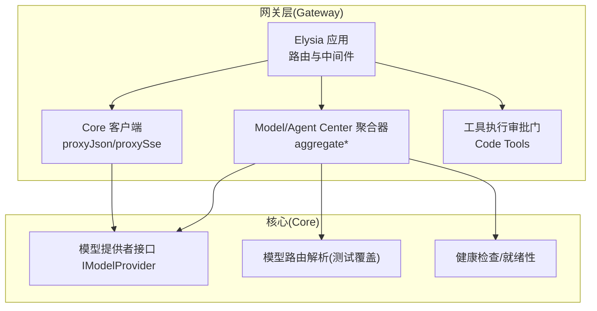
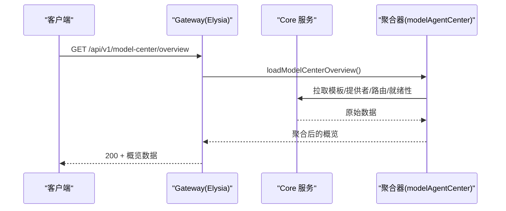
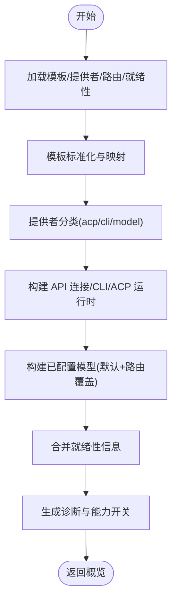
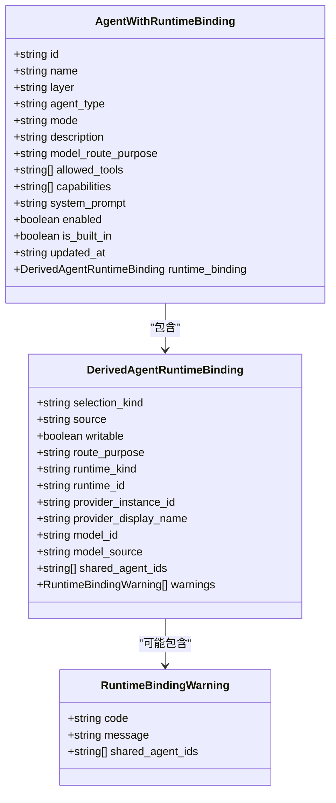
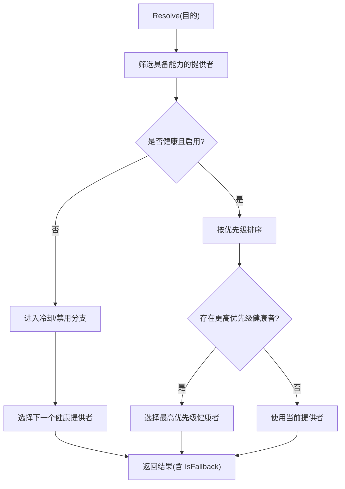
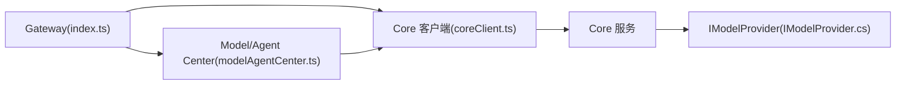

# Model / Agent Center

<cite>
**本文引用的文件**
- [index.ts](file://TinadecGateway/src/index.ts)
- [modelAgentCenter.ts](file://TinadecGateway/src/modelAgentCenter.ts)
- [coreClient.ts](file://TinadecGateway/src/coreClient.ts)
- [config.ts](file://TinadecGateway/src/config.ts)
- [HarnessManifestDto.cs](file://TinadecCore/Contracts/Dtos/HarnessManifestDto.cs)
- [IModelProvider.cs](file://TinadecCore/Abstractions/Ports/IModelProvider.cs)
- [ModelRouteResolverTests.cs](file://tests/TinadecCore.Tests/ModelRouteResolverTests.cs)
</cite>

## 目录
1. [简介](#简介)
2. [项目结构](#项目结构)
3. [核心组件](#核心组件)
4. [架构总览](#架构总览)
5. [详细组件分析](#详细组件分析)
6. [依赖关系分析](#依赖关系分析)
7. [性能考虑](#性能考虑)
8. [故障排查指南](#故障排查指南)
9. [结论](#结论)
10. [附录](#附录)

## 简介
本文件为 Model / Agent Center 的详细文档，聚焦于 Gateway 如何聚合 Core 资源，提供无状态的模型与代理管理中心视图。内容涵盖：
- HarnessManifestDto 的数据结构与用途
- 模型路由策略、负载均衡与故障转移机制
- 多模型提供商配置方法
- 代理生命周期管理与诊断
- API 调用示例与性能优化建议

## 项目结构
Gateway（Bun/Elysia）作为无状态 BFF/API 层，负责鉴权、协议转换、流式转发以及 Model/Agent Center 的聚合视图。Core（C#/.NET）提供模型与代理运行时、存储与编排能力。

图表来源
- [index.ts:107-170](file://TinadecGateway/src/index.ts#L107-L170)
- [coreClient.ts:38-87](file://TinadecGateway/src/coreClient.ts#L38-L87)
- [modelAgentCenter.ts:368-459](file://TinadecGateway/src/modelAgentCenter.ts#L368-L459)
- [IModelProvider.cs:10-18](file://TinadecCore/Abstractions/Ports/IModelProvider.cs#L10-L18)

章节来源
- [index.ts:1-120](file://TinadecGateway/src/index.ts#L1-L120)
- [config.ts:65-106](file://TinadecGateway/src/config.ts#L65-L106)

## 核心组件
- Gateway 入口与路由：统一暴露 /api/v1/* 端点，包含 Model Center 与 Agent Center 的概览接口。
- Core 客户端：封装 JSON/SSE/流式请求到 Core，处理不可达与非 JSON 响应。
- Model/Agent Center 聚合器：从 Core 拉取模板、提供者、路由、就绪性等数据，组装为无状态视图。
- 配置模块：读取部署模式、认证、超时、反向代理等运行参数。
- Core 抽象：IModelProvider 定义 Chat 客户端获取与健康检查能力。

章节来源
- [index.ts:451-612](file://TinadecGateway/src/index.ts#L451-L612)
- [coreClient.ts:22-110](file://TinadecGateway/src/coreClient.ts#L22-L110)
- [modelAgentCenter.ts:368-459](file://TinadecGateway/src/modelAgentCenter.ts#L368-L459)
- [config.ts:65-106](file://TinadecGateway/src/config.ts#L65-L106)
- [IModelProvider.cs:10-18](file://TinadecCore/Abstractions/Ports/IModelProvider.cs#L10-L18)

## 架构总览
Gateway 通过 HTTP/SSE/流式通道将请求转发至 Core，并在本地完成数据聚合与协议适配。Model/Agent Center 的概览接口由 Gateway 调用多个 Core 端点，合并后返回给前端或上层服务。

图表来源
- [index.ts:451-466](file://TinadecGateway/src/index.ts#L451-L466)
- [modelAgentCenter.ts:517-535](file://TinadecGateway/src/modelAgentCenter.ts#L517-L535)
- [coreClient.ts:38-87](file://TinadecGateway/src/coreClient.ts#L38-L87)

## 详细组件分析

### Model Center 聚合器
- 职责：聚合供应商模板、API 连接、CLI/ACP 运行时、已配置模型、就绪性与诊断信息。
- 关键流程：
  - 构建快照：模板映射、提供者分类、路由目的聚合、就绪性合并。
  - 生成模型清单：基于提供者默认模型与路由覆盖，去重并排序。
  - 诊断与能力：标记共享路由警告、能力开关（如动态发现、ACP 探测）。
- 数据结构要点：
  - SupplierResource：供应商模板元数据（驱动、传输类型、凭据类型、默认模型/超时、能力）。
  - ApiConnectionResource：API 提供者实例（启用状态、冷却时间、路由目的、就绪性）。
  - CliRuntimeResource/AcpRuntimeResource：CLI/ACP 运行时描述（二进制路径、启动参数、能力）。
  - ConfiguredModelResource：已配置模型（来源、是否默认、路由目的、状态）。
  - CenterCapabilities：功能开关（provider_crud、model_catalog_mode、live_model_discovery 等）。
  - CenterDiagnostic：诊断项（代码、严重级别、消息、来源、路由目的、关联 agent_ids）。

图表来源
- [modelAgentCenter.ts:537-688](file://TinadecGateway/src/modelAgentCenter.ts#L537-L688)

章节来源
- [modelAgentCenter.ts:29-138](file://TinadecGateway/src/modelAgentCenter.ts#L29-L138)
- [modelAgentCenter.ts:368-459](file://TinadecGateway/src/modelAgentCenter.ts#L368-L459)
- [modelAgentCenter.ts:537-688](file://TinadecGateway/src/modelAgentCenter.ts#L537-L688)

### Agent Center 聚合器
- 职责：在 Model Center 基础上，结合 Agent 列表与路由目的，推导每个 Agent 的运行时绑定（继承/固定模型/提供者自动/CLI/ACP），并输出只读绑定与共享路由警告。
- 关键逻辑：
  - 按 model_route_purpose 分组统计共享路由，生成 LEGACY_SHARED_ROUTE 诊断。
  - 根据路由与提供者推断 runtime_kind、model_source、model_id。
  - 输出 runtime_sources（providers/models/cli_runtimes/acp_runtimes）供 UI 展示。

图表来源
- [modelAgentCenter.ts:146-193](file://TinadecGateway/src/modelAgentCenter.ts#L146-L193)
- [modelAgentCenter.ts:399-459](file://TinadecGateway/src/modelAgentCenter.ts#L399-L459)

章节来源
- [modelAgentCenter.ts:372-459](file://TinadecGateway/src/modelAgentCenter.ts#L372-L459)

### 模型路由策略、负载均衡与故障转移
- 路由选择：基于“目的(purpose)”选择具备该能力的提供者；优先级高的健康提供者优先。
- 健康与冷却：失败记录触发冷却期（cooldown_until），期间视为不可用；成功恢复后清除冷却。
- 故障转移：主提供者不健康或被禁用时，回退到备份提供者。
- 测试覆盖：验证最低优先级健康提供者选择、冷却期排除、禁用排除、ID 平局打破、无可用提供者抛异常、健康状态持久化等。

图表来源
- [ModelRouteResolverTests.cs:18-121](file://tests/TinadecCore.Tests/ModelRouteResolverTests.cs#L18-L121)
- [ModelRouteResolverTests.cs:122-186](file://tests/TinadecCore.Tests/ModelRouteResolverTests.cs#L122-L186)
- [ModelRouteResolverTests.cs:219-251](file://tests/TinadecCore.Tests/ModelRouteResolverTests.cs#L219-L251)

章节来源
- [ModelRouteResolverTests.cs:18-121](file://tests/TinadecCore.Tests/ModelRouteResolverTests.cs#L18-L121)
- [ModelRouteResolverTests.cs:122-186](file://tests/TinadecCore.Tests/ModelRouteResolverTests.cs#L122-L186)
- [ModelRouteResolverTests.cs:219-251](file://tests/TinadecCore.Tests/ModelRouteResolverTests.cs#L219-L251)

### 多模型提供商配置方法
- 模板（SupplierResource）：定义驱动、传输类型、凭据类型、默认模型/超时、能力。
- 提供者实例（ApiConnectionResource/CliRuntimeResource/AcpRuntimeResource）：具体连接、启用状态、能力、冷却时间、路由目的。
- 路由（CoreRoute）：目的→提供者实例与模型覆盖。
- 配置来源：提供者默认模型与路由覆盖共同决定最终模型来源（provider_default/route_override/unset）。

章节来源
- [modelAgentCenter.ts:29-138](file://TinadecGateway/src/modelAgentCenter.ts#L29-L138)
- [modelAgentCenter.ts:690-750](file://TinadecGateway/src/modelAgentCenter.ts#L690-L750)

### 代理生命周期管理
- 生命周期维度：提供者实例启用/禁用、健康状态（healthy/cooldown）、冷却截止时间、失败计数。
- 诊断与就绪性：readiness 字段反映模型与目录服务的可用性；diagnostics 汇总不可用能力与共享路由警告。
- 写入限制：当前不支持 per-agent 持久化运行时绑定（agent_runtime_binding_write=false），写操作返回未支持提示。

章节来源
- [modelAgentCenter.ts:124-138](file://TinadecGateway/src/modelAgentCenter.ts#L124-L138)
- [modelAgentCenter.ts:206-243](file://TinadecGateway/src/modelAgentCenter.ts#L206-L243)

### HarnessManifestDto 数据结构
- 作用：描述 Harness 元数据，包括运行时、所有权模型、工具注册表、Agent 层、工具提供者、风险、工具清单、设计说明，以及 MAF 框架信息与模块描述。
- 关键字段：
  - Runtime：运行时标识（默认 tinadec-core-maf）
  - OwnershipModel：所有权模型（默认 core-authoritative）
  - ToolRegistry：工具注册摘要
  - AgentLayers：Agent 层清单
  - ToolProviders/ToolRisks/Tools：工具相关清单
  - DesignNotes：设计说明
  - Framework：MAF 框架元数据（名称、版本、原语）
  - Modules：模块描述（模块ID、版本、依赖、能力、语言、MAF 原语、注册状态）

章节来源
- [HarnessManifestDto.cs:7-53](file://TinadecCore/Contracts/Dtos/HarnessManifestDto.cs#L7-L53)

### API 调用示例
- 获取 Model Center 概览：GET /api/v1/model-center/overview
- 获取 Agent Center 概览：GET /api/v1/agent-center/overview
- 刷新模型发现（当前未支持）：POST /api/v1/model-center/provider-instances/{providerInstanceId}/models/refresh
- 列出模型提供者模板：GET /api/v1/model-provider-templates
- 列出/创建/更新/删除模型提供者：GET/POST/PUT/DELETE /api/v1/model-providers
- 列出/更新模型路由：GET/PUT /api/v1/model-routes/:purpose
- 列出/更新 Agent：GET/PUT /api/v1/agents/:agentId
- 设置 Agent 运行时绑定（当前未支持）：PUT /api/v1/agents/:agentId/runtime-binding

章节来源
- [index.ts:451-612](file://TinadecGateway/src/index.ts#L451-L612)

## 依赖关系分析
Gateway 对 Core 的依赖集中在 JSON/SSE/流式代理与 Model/Agent Center 聚合。Core 侧通过 IModelProvider 暴露 Chat 客户端与健康检查能力，路由解析与故障转移由 Core 内部实现并由测试覆盖。

图表来源
- [index.ts:107-170](file://TinadecGateway/src/index.ts#L107-L170)
- [coreClient.ts:38-87](file://TinadecGateway/src/coreClient.ts#L38-L87)
- [modelAgentCenter.ts:517-535](file://TinadecGateway/src/modelAgentCenter.ts#L517-L535)
- [IModelProvider.cs:10-18](file://TinadecCore/Abstractions/Ports/IModelProvider.cs#L10-L18)

章节来源
- [index.ts:107-170](file://TinadecGateway/src/index.ts#L107-L170)
- [coreClient.ts:38-87](file://TinadecGateway/src/coreClient.ts#L38-L87)
- [modelAgentCenter.ts:517-535](file://TinadecGateway/src/modelAgentCenter.ts#L517-L535)
- [IModelProvider.cs:10-18](file://TinadecCore/Abstractions/Ports/IModelProvider.cs#L10-L18)

## 性能考虑
- 无状态聚合：Gateway 仅做数据聚合与协议转换，避免本地状态，便于横向扩展。
- 流式与 SSE：对长耗时任务使用 SSE/流式转发，降低内存占用与延迟。
- 错误快速失败：Core 不可达或非 JSON 响应立即返回 502，减少等待。
- 缓存与就绪性：利用 readiness/diagnostics 减少无效请求与重试风暴。
- 超时控制：通过 requestTimeoutMs 控制上游超时，避免长时间阻塞。

[本节为通用指导，无需特定文件引用]

## 故障排查指南
- Core 不可达：检查 coreUrl 配置与网络连通性；确认 Gateway 的 proxyJson 返回 502 与 CORE_UNREACHABLE。
- 非 JSON 响应：Core 返回文本或 HTML 时，proxyJson 会解析失败并返回 CORE_INVALID_RESPONSE。
- 模型发现刷新未支持：POST refresh 返回 501 与 MODEL_DISCOVERY_UNSUPPORTED。
- Agent 运行时绑定未支持：PUT runtime-binding 返回 501 与 AGENT_RUNTIME_BINDING_UNSUPPORTED。
- 共享路由警告：当多个 Agent 共享同一路由目的时，UI 应显示 LEGACY_SHARED_ROUTE 警告。

章节来源
- [coreClient.ts:38-87](file://TinadecGateway/src/coreClient.ts#L38-L87)
- [modelAgentCenter.ts:245-269](file://TinadecGateway/src/modelAgentCenter.ts#L245-L269)
- [modelAgentCenter.ts:206-243](file://TinadecGateway/src/modelAgentCenter.ts#L206-L243)
- [modelAgentCenter.ts:386-398](file://TinadecGateway/src/modelAgentCenter.ts#L386-L398)

## 结论
Model / Agent Center 通过 Gateway 的无状态聚合与 Core 的健壮路由/健康机制，提供了统一的模型与代理管理视图。当前阶段以“仅配置”的模型目录与只读绑定为主，未来可扩展动态发现与持久化绑定。配合流式转发与就绪性诊断，可在高并发与多提供商场景下保持稳定与可观测性。

[本节为总结，无需特定文件引用]

## 附录
- 配置与环境变量：
  - TINADEC_GATEWAY_MODE：部署模式（local/cloud）
  - TINADEC_GATEWAY_PORT：监听端口
  - TINADEC_CORE_URL：Core 服务地址
  - TINADEC_TOOL_RUNTIME_URL：工具运行时地址
  - TINADEC_GATEWAY_AUTH_REQUIRED：是否强制认证
  - TINADEC_GATEWAY_JWT_SECRET：JWT 密钥
  - TINADEC_GATEWAY_API_KEY：API Key
  - TINADEC_GATEWAY_CORS_ORIGINS：额外允许的 CORS 来源
  - TINADEC_GATEWAY_TIMEOUT_MS：请求超时毫秒

章节来源
- [config.ts:65-106](file://TinadecGateway/src/config.ts#L65-L106)