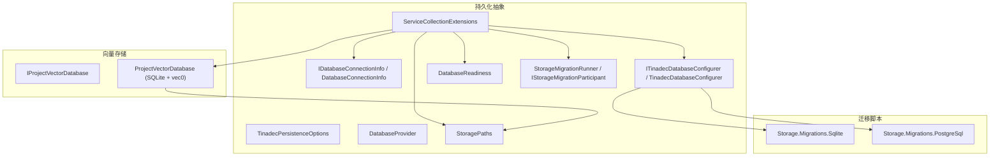
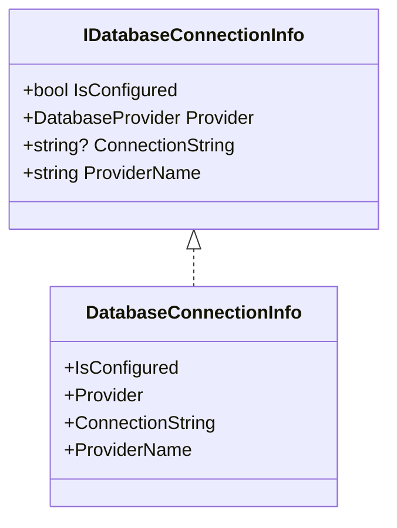
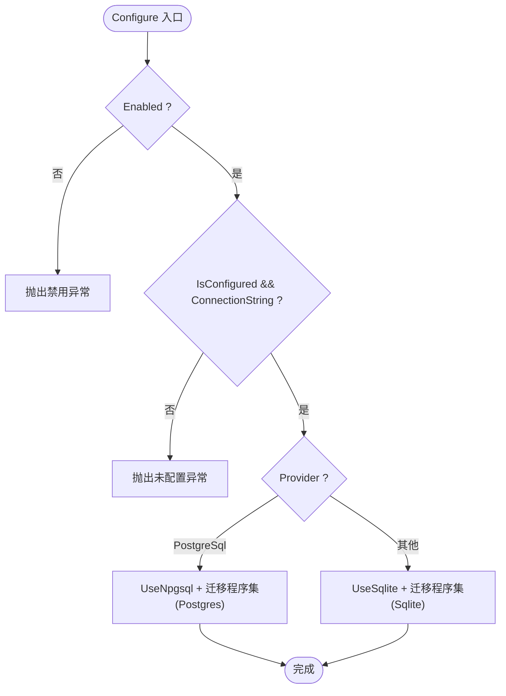
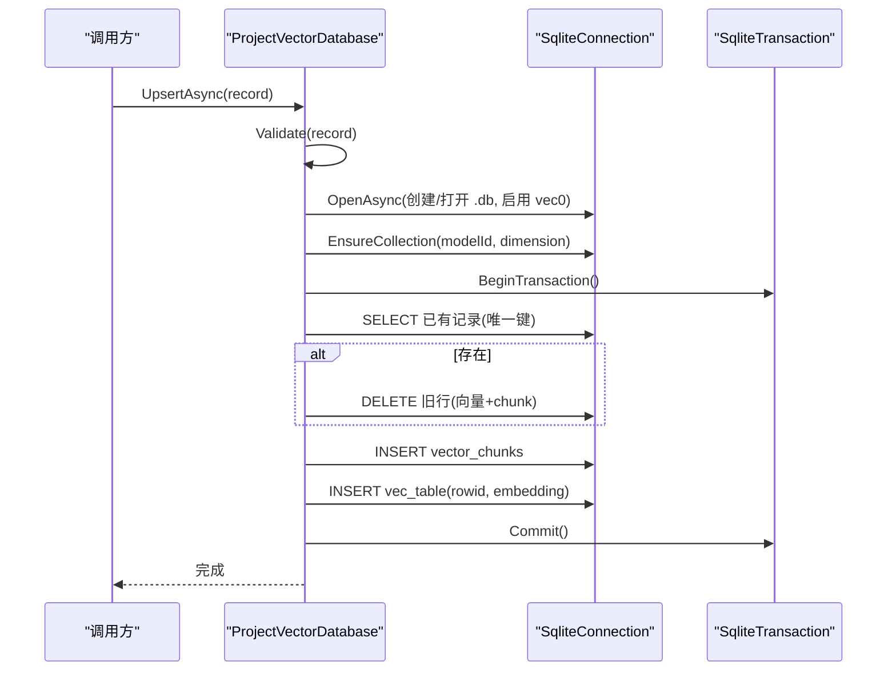
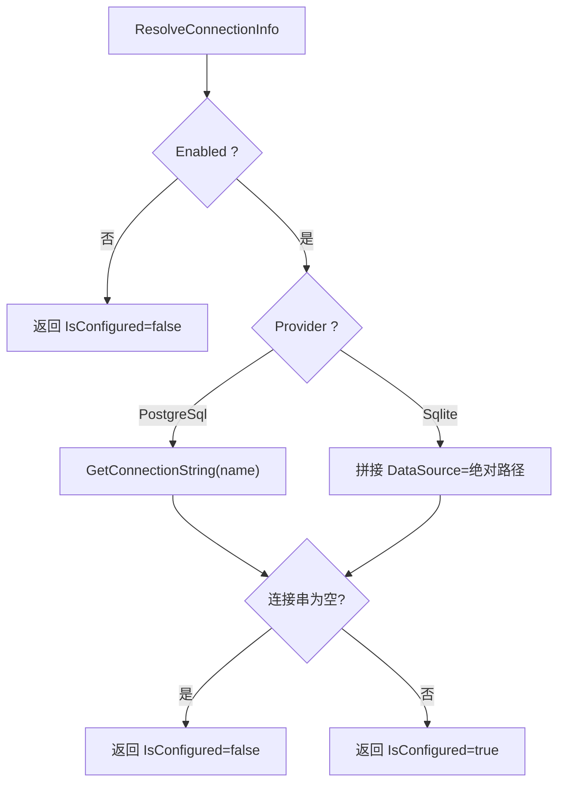
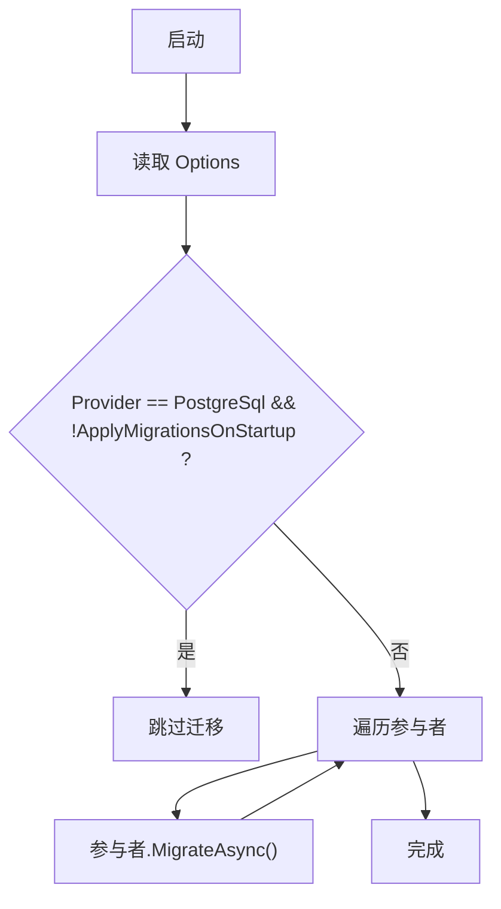
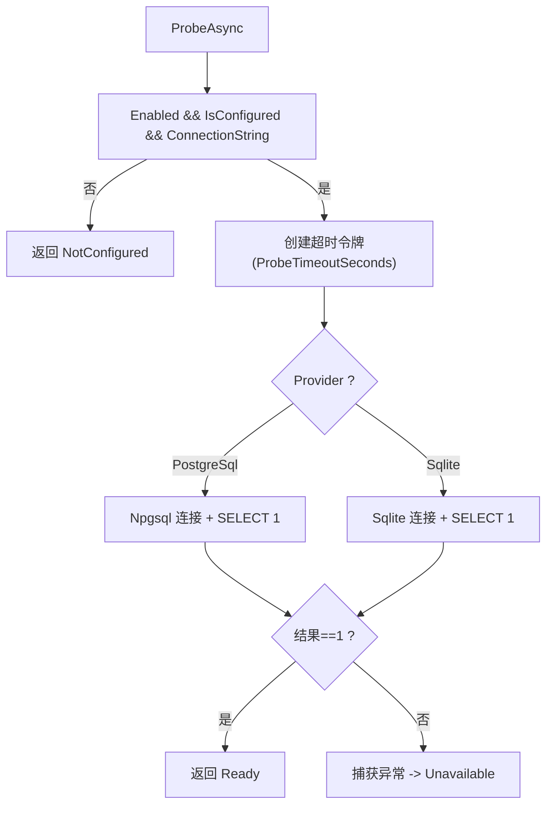
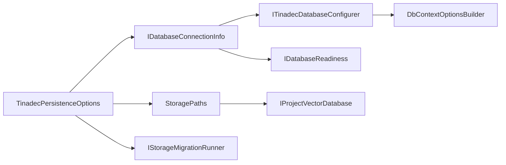

# 共享数据库抽象

<cite>
**本文引用的文件**   
- [IDatabaseConnectionInfo.cs](file://TinadecCore\Persistence\IDatabaseConnectionInfo.cs)
- [DatabaseConnectionInfo.cs](file://TinadecCore\Persistence\DatabaseConnectionInfo.cs)
- [DatabaseProvider.cs](file://TinadecCore\Persistence\DatabaseProvider.cs)
- [ITinadecDatabaseConfigurer.cs](file://TinadecCore\Persistence\ITinadecDatabaseConfigurer.cs)
- [TinadecDatabaseConfigurer.cs](file://TinadecCore\Persistence\TinadecDatabaseConfigurer.cs)
- [IProjectVectorDatabase.cs](file://TinadecCore\Persistence\IProjectVectorDatabase.cs)
- [ProjectVectorDatabase.cs](file://TinadecCore\Persistence\ProjectVectorDatabase.cs)
- [TinadecPersistenceOptions.cs](file://TinadecCore\Persistence\TinadecPersistenceOptions.cs)
- [ServiceCollectionExtensions.cs](file://TinadecCore\Persistence\ServiceCollectionExtensions.cs)
- [StoragePaths.cs](file://TinadecCore\Persistence\StoragePaths.cs)
- [DatabaseReadiness.cs](file://TinadecCore\Persistence\DatabaseReadiness.cs)
- [StorageMigration.cs](file://TinadecCore\Persistence\StorageMigration.cs)
- [InitialStorageMigrations.cs（SQLite）](file://TinadecCore\Storage.Migrations.Sqlite\InitialStorageMigrations.cs)
- [InitialStorageMigrations.cs（PostgreSQL）](file://TinadecCore\Storage.Migrations.PostgreSql\InitialStorageMigrations.cs)
</cite>

## 目录
1. [简介](#简介)
2. [项目结构](#项目结构)
3. [核心组件](#核心组件)
4. [架构总览](#架构总览)
5. [详细组件分析](#详细组件分析)
6. [依赖关系分析](#依赖关系分析)
7. [性能考虑](#性能考虑)
8. [故障排查指南](#故障排查指南)
9. [结论](#结论)
10. [附录：配置与迁移、备份策略](#附录配置与迁移备份策略)

## 简介
本文件面向“共享数据库抽象层”，系统性阐述以下要点：
- IDatabaseConnectionInfo 接口的设计目标与使用方式
- TinadecDatabaseConfigurer 的配置机制与 Provider 切换
- ProjectVectorDatabase 的向量索引实现细节（基于 SQLite + vec0）
- SQLite 与 PostgreSQL 的切换配置、连接池与事务处理
- 自定义数据库提供程序的扩展指南
- 迁移脚本管理与数据备份策略
- 完整配置示例与性能调优建议

该抽象层通过统一的选项模型、连接信息解析、EF Core 配置器与就绪探针，为上层业务模块屏蔽底层数据库差异，并提供项目级向量检索能力。

## 项目结构
共享数据库抽象位于 TinadecCore\Persistence 命名空间下，主要包含：
- 选项与枚举：TinadecPersistenceOptions、DatabaseProvider
- 连接信息：IDatabaseConnectionInfo、DatabaseConnectionInfo
- EF Core 配置器：ITinadecDatabaseConfigurer、TinadecDatabaseConfigurer
- 服务注册与解析：ServiceCollectionExtensions
- 路径与存储：StoragePaths
- 就绪探测：DatabaseReadiness
- 迁移编排：StorageMigration（参与者接口与运行器）
- 向量数据库：IProjectVectorDatabase、ProjectVectorDatabase
- 迁移脚本：Storage.Migrations.Sqlite、Storage.Migrations.PostgreSql



图表来源
- [ServiceCollectionExtensions.cs:15-49](file://TinadecCore\Persistence\ServiceCollectionExtensions.cs#L15-L49)
- [TinadecDatabaseConfigurer.cs:19-46](file://TinadecCore\Persistence\TinadecDatabaseConfigurer.cs#L19-L46)
- [StoragePaths.cs:25-26](file://TinadecCore\Persistence\StoragePaths.cs#L25-L26)
- [DatabaseReadiness.cs:24-73](file://TinadecCore\Persistence\DatabaseReadiness.cs#L24-L73)
- [StorageMigration.cs:27-39](file://TinadecCore\Persistence\StorageMigration.cs#L27-L39)
- [ProjectVectorDatabase.cs:109-122](file://TinadecCore\Persistence\ProjectVectorDatabase.cs#L109-L122)

章节来源
- [ServiceCollectionExtensions.cs:15-49](file://TinadecCore\Persistence\ServiceCollectionExtensions.cs#L15-L49)
- [TinadecPersistenceOptions.cs:7-32](file://TinadecCore\Persistence\TinadecPersistenceOptions.cs#L7-L32)

## 核心组件
- IDatabaseConnectionInfo：暴露当前活动提供程序、连接字符串与是否已配置等元信息，供健康检查、日志与诊断使用。
- DatabaseConnectionInfo：具体实现，根据 Provider 生成 ProviderName（sqlite/postgresql）。
- ITinadecDatabaseConfigurer/TinadecDatabaseConfigurer：将启用状态、Provider 与连接字符串注入到 DbContextOptionsBuilder，并选择对应迁移程序集。
- TinadecPersistenceOptions：统一配置入口，包括启用开关、Provider、各 Provider 子选项、DataRoot、迁移策略与就绪探针超时。
- ServiceCollectionExtensions：绑定配置、解析连接信息、注册单例服务（连接信息、配置器、就绪、路径、向量库、迁移运行器等），并提供 UseTinadecDatabase 扩展方法。
- StoragePaths：以 DataRoot 为基础，安全地解析会话、事件、工件与向量数据库文件路径，防止路径逃逸。
- DatabaseReadiness：按 Provider 执行轻量探测（SELECT 1），返回 NotConfigured/Ready/Unavailable 三种状态。
- StorageMigrationRunner：在启动时按策略执行各参与者的迁移；对 PostgreSQL 默认不自动迁移，需显式开启 ApplyMigrationsOnStartup。
- IProjectVectorDatabase/ProjectVectorDatabase：项目级向量索引，当前实现基于 SQLite 与 vec0 虚拟表，支持 Upsert/Search/DeleteSource。

章节来源
- [IDatabaseConnectionInfo.cs:6-17](file://TinadecCore\Persistence\IDatabaseConnectionInfo.cs#L6-L17)
- [DatabaseConnectionInfo.cs:3-22](file://TinadecCore\Persistence\DatabaseConnectionInfo.cs#L3-L22)
- [ITinadecDatabaseConfigurer.cs:9-16](file://TinadecCore\Persistence\ITinadecDatabaseConfigurer.cs#L9-L16)
- [TinadecDatabaseConfigurer.cs:19-46](file://TinadecCore\Persistence\TinadecDatabaseConfigurer.cs#L19-L46)
- [TinadecPersistenceOptions.cs:7-32](file://TinadecCore\Persistence\TinadecPersistenceOptions.cs#L7-L32)
- [ServiceCollectionExtensions.cs:15-49](file://TinadecCore\Persistence\ServiceCollectionExtensions.cs#L15-L49)
- [StoragePaths.cs:25-26](file://TinadecCore\Persistence\StoragePaths.cs#L25-L26)
- [DatabaseReadiness.cs:24-73](file://TinadecCore\Persistence\DatabaseReadiness.cs#L24-L73)
- [StorageMigration.cs:27-39](file://TinadecCore\Persistence\StorageMigration.cs#L27-L39)
- [IProjectVectorDatabase.cs:4-9](file://TinadecCore\Persistence\IProjectVectorDatabase.cs#L4-L9)
- [ProjectVectorDatabase.cs:20-89](file://TinadecCore\Persistence\ProjectVectorDatabase.cs#L20-L89)

## 架构总览
下图展示了从应用启动到数据库就绪与迁移执行的总体流程，以及向量库的初始化与查询路径。

```mermaid
sequenceDiagram
participant App as "应用"
participant DI as "服务容器"
participant Opt as "TinadecPersistenceOptions"
participant Conn as "IDatabaseConnectionInfo"
participant Cfg as "ITinadecDatabaseConfigurer"
participant DB as "DbContext(业务模块)"
participant Ready as "IDatabaseReadiness"
participant Mig as "IStorageMigrationRunner"
participant Vec as "IProjectVectorDatabase"
App->>DI : AddTinadecPersistence(configuration, contentRootPath)
DI-->>Opt : 绑定配置节
DI-->>Conn : ResolveConnectionInfo(Provider, ConnectionStrings/DataRoot)
DI-->>Cfg : 注册配置器
DI-->>Ready : 注册就绪探针
DI-->>Mig : 注册迁移运行器
DI-->>Vec : 注册向量库
App->>DB : 使用 UseTinadecDatabase(serviceProvider)
DB->>Cfg : Configure(options)
Cfg-->>DB : UseNpgsql/UseSqlite + 迁移程序集
App->>Ready : ProbeAsync()
Ready-->>App : NotConfigured/Ready/Unavailable
App->>Mig : RunAsync()
Mig-->>App : 依次调用参与者 MigrateAsync()
App->>Vec : UpsertAsync/SearchAsync/DeleteSourceAsync()
Vec-->>App : 基于 SQLite + vec0 的向量操作
```

图表来源
- [ServiceCollectionExtensions.cs:15-49](file://TinadecCore\Persistence\ServiceCollectionExtensions.cs#L15-L49)
- [TinadecDatabaseConfigurer.cs:19-46](file://TinadecCore\Persistence\TinadecDatabaseConfigurer.cs#L19-L46)
- [DatabaseReadiness.cs:24-73](file://TinadecCore\Persistence\DatabaseReadiness.cs#L24-L73)
- [StorageMigration.cs:27-39](file://TinadecCore\Persistence\StorageMigration.cs#L27-L39)
- [ProjectVectorDatabase.cs:109-122](file://TinadecCore\Persistence\ProjectVectorDatabase.cs#L109-L122)

## 详细组件分析

### IDatabaseConnectionInfo 与 DatabaseConnectionInfo
- 设计要点
  - IsConfigured：判断连接字符串是否有效，避免未配置导致运行时异常。
  - Provider：区分 Sqlite/PostgreSql，决定后续行为（如迁移策略、就绪探测）。
  - ConnectionString：EF 兼容的连接字符串；未配置时为 null。
  - ProviderName：对外可读名称（sqlite/postgresql），用于健康报告与日志。
- 实现要点
  - DatabaseConnectionInfo 根据 Provider 映射 ProviderName。
  - 连接字符串由 ServiceCollectionExtensions.ResolveConnectionInfo 生成或从配置读取。



图表来源
- [IDatabaseConnectionInfo.cs:6-17](file://TinadecCore\Persistence\IDatabaseConnectionInfo.cs#L6-L17)
- [DatabaseConnectionInfo.cs:3-22](file://TinadecCore\Persistence\DatabaseConnectionInfo.cs#L3-L22)

章节来源
- [IDatabaseConnectionInfo.cs:6-17](file://TinadecCore\Persistence\IDatabaseConnectionInfo.cs#L6-L17)
- [DatabaseConnectionInfo.cs:3-22](file://TinadecCore\Persistence\DatabaseConnectionInfo.cs#L3-L22)

### ITinadecDatabaseConfigurer 与 TinadecDatabaseConfigurer
- 职责
  - 校验启用状态与连接配置，抛出明确异常以便快速定位问题。
  - 根据 Provider 选择 UseNpgsql 或 UseSqlite，并指定对应的迁移程序集。
- 关键行为
  - 当 Enabled=false 或未配置连接字符串时，直接抛出 InvalidOperationException。
  - PostgreSQL 默认使用独立迁移程序集，便于部署期控制迁移时机。



图表来源
- [TinadecDatabaseConfigurer.cs:19-46](file://TinadecCore\Persistence\TinadecDatabaseConfigurer.cs#L19-L46)

章节来源
- [ITinadecDatabaseConfigurer.cs:9-16](file://TinadecCore\Persistence\ITinadecDatabaseConfigurer.cs#L9-L16)
- [TinadecDatabaseConfigurer.cs:19-46](file://TinadecCore\Persistence\TinadecDatabaseConfigurer.cs#L19-L46)

### ProjectVectorDatabase（项目级向量数据库）
- 功能概述
  - UpsertAsync：插入或更新向量片段，保证幂等（按唯一键去重后插入）。
  - SearchAsync：按 namespace/modelId/embedding 进行相似度搜索，支持最小分数过滤与源类型过滤。
  - DeleteSourceAsync：按 source_type/source_id 删除所有分片及其向量。
- 存储模型
  - vector_chunks：文本与元数据，含唯一索引（namespace, source_type, source_id, source_revision, chunk_index, model_id）。
  - 每类 embedding dimension 对应一个 vec0 虚拟表，表名由 model_id 哈希与维度组成，确保隔离与一致性。
- 事务与一致性
  - Upsert/Delete 均使用显式事务，先查后写，失败回滚。
- 限制与扩展
  - 当前仅支持 SQLite；若 Provider 非 SQLite，OpenAsync 会抛出 NotSupportedException。
  - 可扩展为 PostgreSQL 实现（例如 pgvector），复用相同接口。



图表来源
- [ProjectVectorDatabase.cs:20-60](file://TinadecCore\Persistence\ProjectVectorDatabase.cs#L20-L60)
- [ProjectVectorDatabase.cs:109-141](file://TinadecCore\Persistence\ProjectVectorDatabase.cs#L109-L141)

章节来源
- [IProjectVectorDatabase.cs:4-9](file://TinadecCore\Persistence\IProjectVectorDatabase.cs#L4-L9)
- [ProjectVectorDatabase.cs:20-89](file://TinadecCore\Persistence\ProjectVectorDatabase.cs#L20-L89)
- [ProjectVectorDatabase.cs:109-173](file://TinadecCore\Persistence\ProjectVectorDatabase.cs#L109-L173)

### 连接信息与 Provider 切换
- 解析逻辑
  - ServiceCollectionExtensions.ResolveConnectionInfo 根据 TinadecPersistenceOptions.Provider 决定 SQLite 或 PostgreSQL 的连接字符串构建方式。
  - SQLite：拼接绝对路径到 SqliteConnectionStringBuilder。
  - PostgreSQL：从 IConfiguration.GetConnectionString(name) 获取。
- 可用性判定
  - IDatabaseConnectionInfo.IsConfigured 由 ConnectionString 是否为空决定。
  - DatabaseReadiness.ProbeAsync 对未配置/不可用给出不同状态。



图表来源
- [ServiceCollectionExtensions.cs:64-120](file://TinadecCore\Persistence\ServiceCollectionExtensions.cs#L64-L120)
- [DatabaseConnectionInfo.cs:11-21](file://TinadecCore\Persistence\DatabaseConnectionInfo.cs#L11-L21)

章节来源
- [ServiceCollectionExtensions.cs:64-120](file://TinadecCore\Persistence\ServiceCollectionExtensions.cs#L64-L120)
- [DatabaseConnectionInfo.cs:11-21](file://TinadecCore\Persistence\DatabaseConnectionInfo.cs#L11-L21)

### 迁移脚本管理
- 参与者模式
  - IStorageMigrationParticipant 定义 MigrateAsync，业务模块实现以贡献自身迁移。
  - StorageMigrationRunner 在启动时按顺序调用参与者。
- 迁移策略
  - SQLite：默认在启动时应用迁移（ApplyMigrationsOnStartup=true）。
  - PostgreSQL：默认不自动迁移，需要显式开启以避免多实例竞争。
- 迁移程序集
  - TinadecDatabaseConfigurer 根据 Provider 选择不同迁移程序集，使 SQL 与 CLR 解耦。



图表来源
- [StorageMigration.cs:27-39](file://TinadecCore\Persistence\StorageMigration.cs#L27-L39)
- [TinadecDatabaseConfigurer.cs:37-46](file://TinadecCore\Persistence\TinadecDatabaseConfigurer.cs#L37-L46)

章节来源
- [StorageMigration.cs:1-41](file://TinadecCore\Persistence\StorageMigration.cs#L1-L41)
- [InitialStorageMigrations.cs（SQLite）:1-64](file://TinadecCore\Storage.Migrations.Sqlite\InitialStorageMigrations.cs#L1-L64)
- [InitialStorageMigrations.cs（PostgreSQL）:1-42](file://TinadecCore\Storage.Migrations.PostgreSql\InitialStorageMigrations.cs#L1-L42)

### 就绪探测与健康检查
- 行为
  - 未启用或未配置：NotConfigured
  - 成功 SELECT 1：Ready
  - 异常：Unavailable（附带错误消息）
- 超时控制
  - 使用 Options.ProbeTimeoutSeconds（1~30 秒）限制探测耗时。
- Provider 差异
  - SQLite：确保目录存在，打开连接执行 SELECT 1。
  - PostgreSQL：使用 Npgsql 连接并设置 CommandTimeout。



图表来源
- [DatabaseReadiness.cs:24-73](file://TinadecCore\Persistence\DatabaseReadiness.cs#L24-L73)
- [DatabaseReadiness.cs:75-122](file://TinadecCore\Persistence\DatabaseReadiness.cs#L75-L122)

章节来源
- [DatabaseReadiness.cs:24-73](file://TinadecCore\Persistence\DatabaseReadiness.cs#L24-L73)

## 依赖关系分析
- 低耦合高内聚
  - 选项与连接信息分离，配置器只依赖接口，便于替换与测试。
  - 向量库与 EF Core 解耦，通过 StoragePaths 管理文件位置。
- 外部依赖
  - Microsoft.Data.Sqlite、Npgsql、Microsoft.EntityFrameworkCore。
- 潜在循环依赖
  - 无直接循环；迁移参与者由业务模块实现，避免反向依赖。



图表来源
- [ServiceCollectionExtensions.cs:15-49](file://TinadecCore\Persistence\ServiceCollectionExtensions.cs#L15-L49)
- [TinadecPersistenceOptions.cs:7-32](file://TinadecCore\Persistence\TinadecPersistenceOptions.cs#L7-L32)

章节来源
- [ServiceCollectionExtensions.cs:15-49](file://TinadecCore\Persistence\ServiceCollectionExtensions.cs#L15-L49)

## 性能考虑
- SQLite
  - 向量检索依赖 vec0 虚拟表，适合单机/桌面场景；注意并发写入可能成为瓶颈。
  - 合理设置 DataRoot 到本地高速磁盘，减少 I/O 延迟。
  - 批量 Upsert 时尽量合并写入，减少事务开销。
- PostgreSQL
  - 生产环境建议使用连接池（Npgsql 默认启用），并根据负载调整 Max Pool Size。
  - 针对高频查询建立合适索引（如 namespace、model_id、source_type 等）。
  - 迁移仅在受控环境下执行，避免多实例竞争。
- 通用
  - 合理设置 ProbeTimeoutSeconds，避免就绪检查阻塞启动。
  - 向量搜索 Limit 与 MinimumScore 配合，减少不必要的数据传输与计算。

[本节为通用指导，不直接分析具体文件]

## 故障排查指南
- 常见异常与定位
  - “TinadecPersistence is disabled”：检查 TinadecPersistence:Enabled 配置。
  - “PostgreSQL is not configured”：确认 ConnectionStrings:TinadecCore 是否存在且有效。
  - “SQLite is not configured”：检查 TinadecPersistence:Sqlite:DatabasePath 是否指向有效路径。
  - “Embedding model changed dimension”：向量维度不一致，需重建集合或升级模型。
- 就绪探针失败
  - 查看 DatabaseReadiness 返回的 Detail 字段，结合网络/权限/路径进行检查。
- 迁移失败
  - 确认 ApplyMigrationsOnStartup 策略与迁移程序集是否正确加载。
  - 检查参与者实现的 MigrateAsync 是否抛出异常。

章节来源
- [TinadecDatabaseConfigurer.cs:23-35](file://TinadecCore\Persistence\TinadecDatabaseConfigurer.cs#L23-L35)
- [DatabaseReadiness.cs:24-73](file://TinadecCore\Persistence\DatabaseReadiness.cs#L24-L73)
- [ProjectVectorDatabase.cs:124-141](file://TinadecCore\Persistence\ProjectVectorDatabase.cs#L124-L141)

## 结论
该共享数据库抽象层通过清晰的接口与配置模型，实现了 SQLite/PostgreSQL 的统一接入、健壮的健康检查、可控的迁移策略与项目级向量检索能力。其模块化设计与可扩展性为后续引入更多数据库后端提供了坚实基础。

[本节为总结，不直接分析具体文件]

## 附录：配置与迁移、备份策略

### 配置示例（JSON）
- SQLite（默认）
  - 启用：TinadecPersistence:Enabled = true
  - Provider：TinadecPersistence:Provider = sqlite
  - 路径：TinadecPersistence:Sqlite:DatabasePath = data/tinadec.db
  - 迁移：TinadecPersistence:ApplyMigrationsOnStartup = true
  - 探针超时：TinadecPersistence:ProbeTimeoutSeconds = 3
- PostgreSQL
  - 启用：TinadecPersistence:Enabled = true
  - Provider：TinadecPersistence:Provider = postgresql
  - 连接串名称：TinadecPersistence:PostgreSql:ConnectionStringName = TinadecCore
  - 连接串：ConnectionStrings:TinadecCore = "Host=...;Database=...;Username=...;Password=..."
  - 迁移：TinadecPersistence:ApplyMigrationsOnStartup = false（推荐手动控制）
  - 探针超时：TinadecPersistence:ProbeTimeoutSeconds = 3

章节来源
- [TinadecPersistenceOptions.cs:7-32](file://TinadecCore\Persistence\TinadecPersistenceOptions.cs#L7-L32)
- [ServiceCollectionExtensions.cs:103-120](file://TinadecCore\Persistence\ServiceCollectionExtensions.cs#L103-L120)

### 自定义数据库提供程序实现指南
- 步骤
  1. 新增 Provider 枚举值（DatabaseProvider）。
  2. 在 ServiceCollectionExtensions.ResolveConnectionInfo 中增加分支，解析连接字符串。
  3. 在 TinadecDatabaseConfigurer.Configure 中增加 UseXxx(...) 分支与迁移程序集。
  4. 如需向量支持，实现 IProjectVectorDatabase（参考 ProjectVectorDatabase）。
  5. 在 DatabaseReadiness 中补充对应 Provider 的探针逻辑。
- 注意事项
  - 保持 IsConfigured 语义一致（连接字符串为空即未配置）。
  - 迁移程序集应独立，避免污染业务模块。
  - 向量库需保证幂等与事务一致性。

章节来源
- [DatabaseProvider.cs:6-10](file://TinadecCore\Persistence\DatabaseProvider.cs#L6-L10)
- [ServiceCollectionExtensions.cs:64-120](file://TinadecCore\Persistence\ServiceCollectionExtensions.cs#L64-L120)
- [TinadecDatabaseConfigurer.cs:37-46](file://TinadecCore\Persistence\TinadecDatabaseConfigurer.cs#L37-L46)
- [IProjectVectorDatabase.cs:4-9](file://TinadecCore\Persistence\IProjectVectorDatabase.cs#L4-L9)
- [DatabaseReadiness.cs:45-73](file://TinadecCore\Persistence\DatabaseReadiness.cs#L45-L73)

### 迁移脚本管理
- 组织方式
  - 每个 Provider 拥有独立的迁移程序集（Sqlite/PostgreSql），通过配置器选择。
  - 业务模块实现 IStorageMigrationParticipant，集中由 StorageMigrationRunner 调度。
- 最佳实践
  - 增量迁移，避免破坏性变更；Down 方法可留空但建议实现。
  - 对 PostgreSQL 采用 CI/CD 触发迁移，避免多实例竞争。

章节来源
- [StorageMigration.cs:14-41](file://TinadecCore\Persistence\StorageMigration.cs#L14-L41)
- [InitialStorageMigrations.cs（SQLite）:1-64](file://TinadecCore\Storage.Migrations.Sqlite\InitialStorageMigrations.cs#L1-L64)
- [InitialStorageMigrations.cs（PostgreSQL）:1-42](file://TinadecCore\Storage.Migrations.PostgreSql\InitialStorageMigrations.cs#L1-L42)

### 数据备份策略
- SQLite
  - 停止写入后复制 .db 文件；或使用 WAL 模式与定期快照。
  - 向量库按租户/工作区/项目拆分文件，便于选择性备份。
- PostgreSQL
  - 使用 pg_dump/pg_restore 或云厂商托管备份方案。
  - 结合 PITR（时间点恢复）与副本提升。
- 通用
  - 备份前执行一致性检查（如 PRAGMA integrity_check 或数据库自检命令）。
  - 保留版本化备份与恢复演练记录。

[本节为通用指导，不直接分析具体文件]