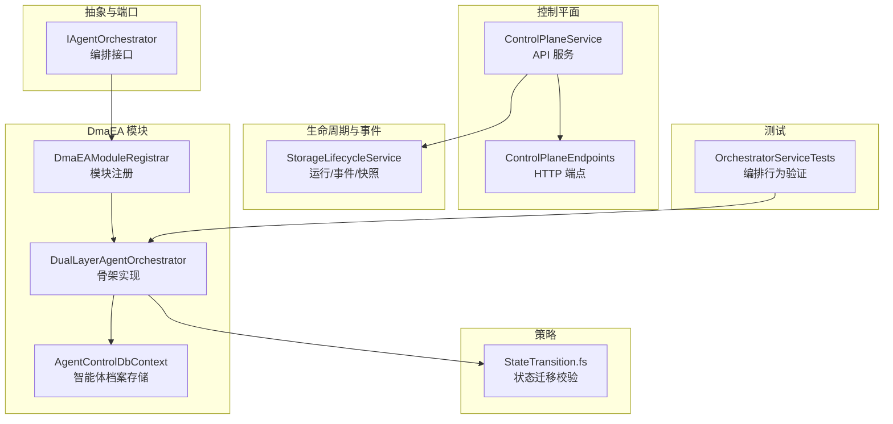
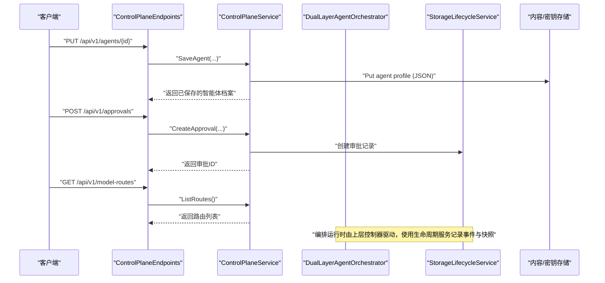
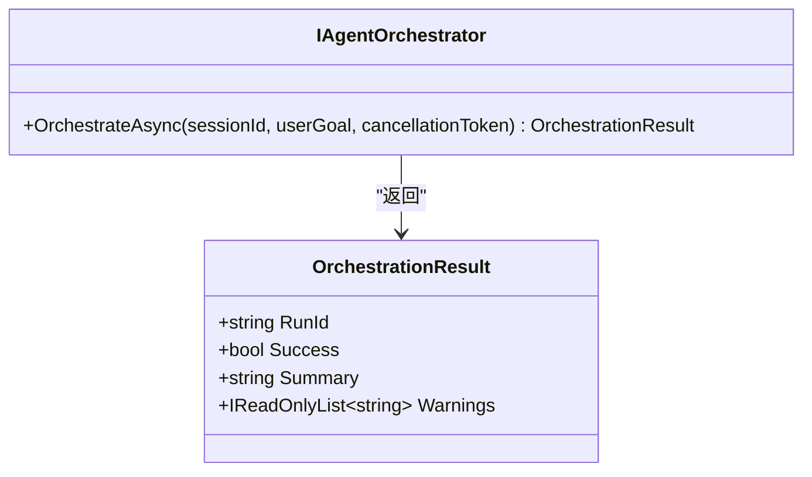
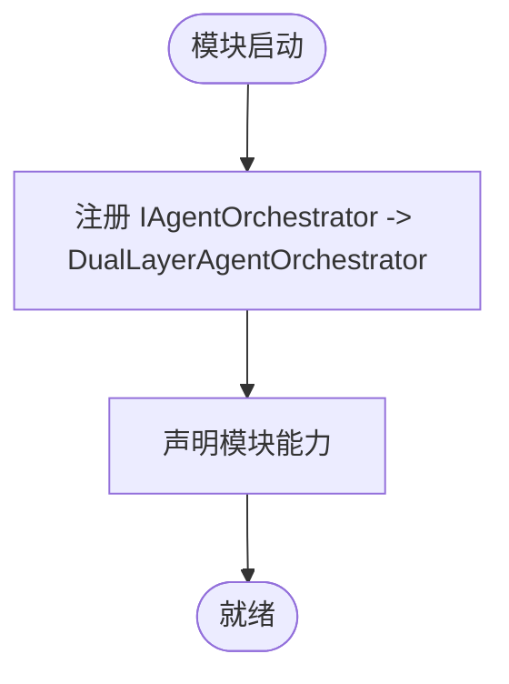
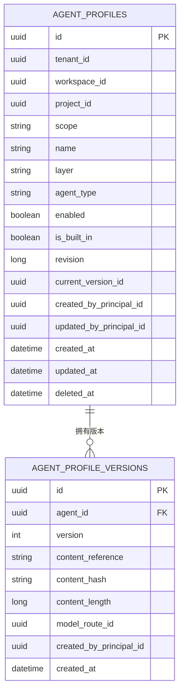
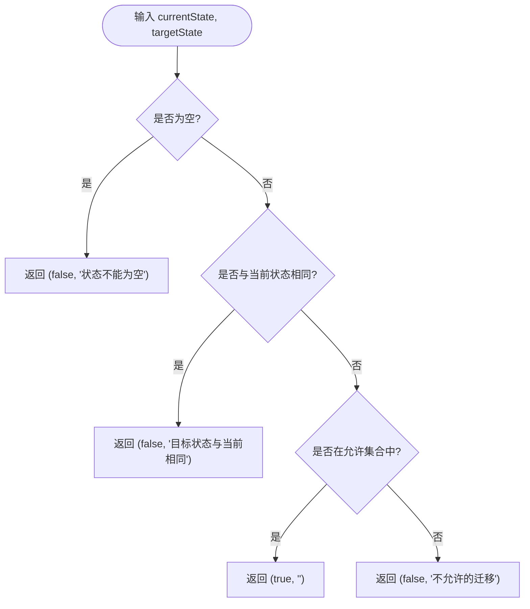
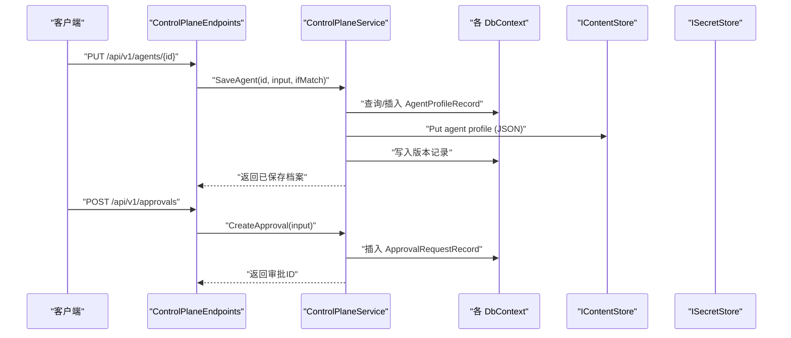
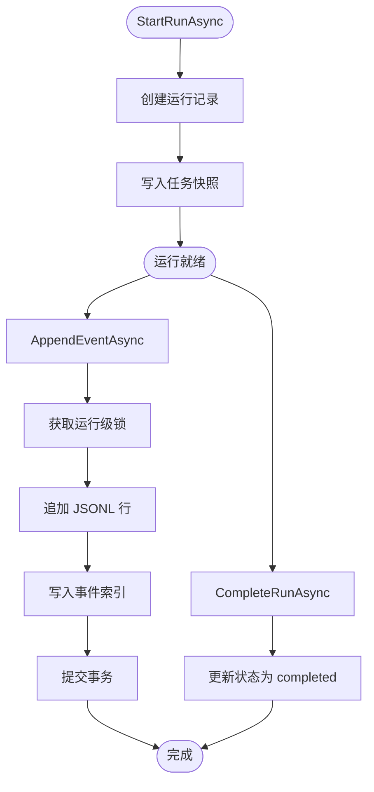
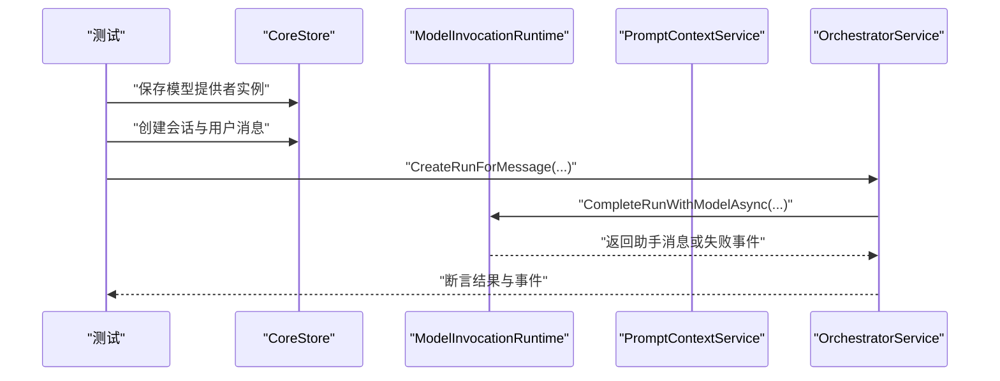
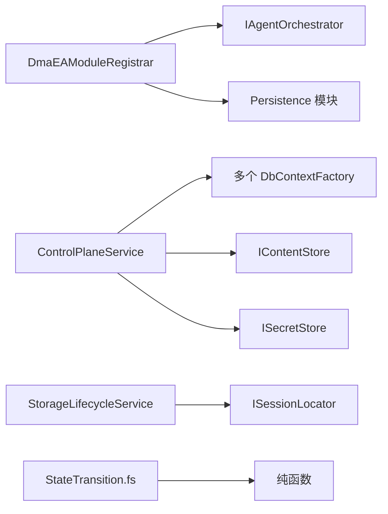

# 双层智能体编排

<cite>
**本文引用的文件**   
- [IAgentOrchestrator.cs](file://TinadecCore/Abstractions/Ports/IAgentOrchestrator.cs)
- [DmaEAModuleRegistrar.cs](file://TinadecCore/DmaEA/DmaEAModuleRegistrar.cs)
- [AgentControlDbContext.cs](file://TinadecCore/DmaEA/AgentControlDbContext.cs)
- [StateTransition.fs](file://TinadecCore/Strategies/StateTransition.fs)
- [ControlPlaneService.cs](file://TinadecCore/Runtime/ControlPlaneService.cs)
- [ControlPlaneEndpoints.cs](file://TinadecCore/Api/Endpoints/ControlPlaneEndpoints.cs)
- [StorageLifecycleService.cs](file://TinadecCore/Lifecycle/StorageLifecycleService.cs)
- [OrchestratorServiceTests.cs](file://tests/TinadecCore.Tests/OrchestratorServiceTests.cs)
- [TinadecCoreBuilder.cs](file://TinadecCore/Runtime/TinadecCoreBuilder.cs)
</cite>

## 目录
1. [简介](#简介)
2. [项目结构](#项目结构)
3. [核心组件](#核心组件)
4. [架构总览](#架构总览)
5. [详细组件分析](#详细组件分析)
6. [依赖关系分析](#依赖关系分析)
7. [性能考量](#性能考量)
8. [故障排查指南](#故障排查指南)
9. [结论](#结论)
10. [附录](#附录)

## 简介
本文件面向“双层智能体编排系统”的规划层（主动监督）与执行层（任务执行）协作机制，系统性阐述状态转换、上下文传递与错误处理。重点说明 IAgentOrchestrator 接口的设计与实现原理、StateTransition 策略的工作流程，以及 ControlPlaneService 如何协调两个层级。文档同时提供编排示例、配置选项与故障恢复机制，帮助不同经验水平的开发者从概念理解到高级定制。

## 项目结构
本项目采用模块化分层设计：
- 抽象端口定义编排契约（IAgentOrchestrator）
- DmaEA 模块注册并绑定具体编排器（DualLayerAgentOrchestrator）
- 控制平面服务暴露 API，管理模型提供者、路由、提示词片段、智能体档案与审批流
- 生命周期服务负责运行记录、事件日志与快照持久化
- 策略层以纯函数方式校验状态迁移合法性
- 测试覆盖编排主流程、失败回退与安全事件记录

图表来源 
- [IAgentOrchestrator.cs:1-24](file://TinadecCore/Abstractions/Ports/IAgentOrchestrator.cs#L1-L24)
- [DmaEAModuleRegistrar.cs:1-57](file://TinadecCore/DmaEA/DmaEAModuleRegistrar.cs#L1-L57)
- [AgentControlDbContext.cs:1-28](file://TinadecCore/DmaEA/AgentControlDbContext.cs#L1-L28)
- [ControlPlaneService.cs:1-71](file://TinadecCore/Runtime/ControlPlaneService.cs#L1-L71)
- [ControlPlaneEndpoints.cs:1-46](file://TinadecCore/Api/Endpoints/ControlPlaneEndpoints.cs#L1-L46)
- [StorageLifecycleService.cs:1-291](file://TinadecCore/Lifecycle/StorageLifecycleService.cs#L1-L291)
- [StateTransition.fs:1-26](file://TinadecCore/Strategies/StateTransition.fs#L1-L26)
- [OrchestratorServiceTests.cs:1-324](file://tests/TinadecCore.Tests/OrchestratorServiceTests.cs#L1-L324)

章节来源
- [DmaEAModuleRegistrar.cs:1-57](file://TinadecCore/DmaEA/DmaEAModuleRegistrar.cs#L1-L57)
- [ControlPlaneEndpoints.cs:1-46](file://TinadecCore/Api/Endpoints/ControlPlaneEndpoints.cs#L1-L46)

## 核心组件
- IAgentOrchestrator：定义双层编排入口 OrchestrateAsync，返回统一结果对象 OrchestrationResult（包含 RunId、Success、Summary、Warnings）。
- DualLayerAgentOrchestrator：当前为骨架实现，预留规划层与执行层的扩展点，用于后续接入实际调度逻辑。
- AgentControlDbContext：维护智能体档案与版本，支持按租户/工作区隔离与软删除。
- ControlPlaneService：聚合多数据源工厂，提供模型提供者、路由、提示词片段、智能体档案与审批请求的 CRUD 能力，并通过内容存储与密钥存储进行版本化与加密管理。
- StorageLifecycleService：负责运行生命周期、事件追加、回放、索引重建与快照持久化，保证事件顺序与幂等性。
- StateTransition.fs：纯函数校验状态迁移是否合法，避免非法跳转。

章节来源
- [IAgentOrchestrator.cs:1-24](file://TinadecCore/Abstractions/Ports/IAgentOrchestrator.cs#L1-L24)
- [DmaEAModuleRegistrar.cs:39-56](file://TinadecCore/DmaEA/DmaEAModuleRegistrar.cs#L39-L56)
- [AgentControlDbContext.cs:1-28](file://TinadecCore/DmaEA/AgentControlDbContext.cs#L1-L28)
- [ControlPlaneService.cs:1-71](file://TinadecCore/Runtime/ControlPlaneService.cs#L1-L71)
- [StorageLifecycleService.cs:1-291](file://TinadecCore/Lifecycle/StorageLifecycleService.cs#L1-L291)
- [StateTransition.fs:1-26](file://TinadecCore/Strategies/StateTransition.fs#L1-L26)

## 架构总览
双层编排的总体思路：
- 规划层（主动监督）：接收用户目标，生成计划、分配任务、监控进度，必要时触发审批或回退。
- 执行层（任务执行）：被动响应任务指令，调用工具或外部服务，上报事件与结果。
- 控制平面：通过 API 暴露配置与运行时管理能力，协调两层之间的上下文与资源。
- 生命周期与事件：所有运行与事件持久化，支持回放与审计。

图表来源 
- [ControlPlaneEndpoints.cs:1-46](file://TinadecCore/Api/Endpoints/ControlPlaneEndpoints.cs#L1-L46)
- [ControlPlaneService.cs:1-71](file://TinadecCore/Runtime/ControlPlaneService.cs#L1-L71)
- [StorageLifecycleService.cs:1-291](file://TinadecCore/Lifecycle/StorageLifecycleService.cs#L1-L291)

## 详细组件分析

### IAgentOrchestrator 接口与编排结果
- 接口方法 OrchestrateAsync 接受会话 ID、用户目标与取消令牌，返回 OrchestrationResult。
- OrchestrationResult 包含运行标识、成功标志、摘要与警告列表，便于上层统一处理。

图表来源 
- [IAgentOrchestrator.cs:1-24](file://TinadecCore/Abstractions/Ports/IAgentOrchestrator.cs#L1-L24)

章节来源
- [IAgentOrchestrator.cs:1-24](file://TinadecCore/Abstractions/Ports/IAgentOrchestrator.cs#L1-L24)

### DmaEAModuleRegistrar 与骨架编排器
- 模块注册器将 IAgentOrchestrator 绑定到 DualLayerAgentOrchestrator，声明模块能力（如双层级编排、任务分发、协作、调度、结果聚合）。
- 骨架编排器目前返回未配置的占位结果，便于后续集成真实调度逻辑。

图表来源 
- [DmaEAModuleRegistrar.cs:1-57](file://TinadecCore/DmaEA/DmaEAModuleRegistrar.cs#L1-L57)

章节来源
- [DmaEAModuleRegistrar.cs:1-57](file://TinadecCore/DmaEA/DmaEAModuleRegistrar.cs#L1-L57)

### 智能体档案存储模型
- AgentProfileRecord：智能体档案实体，包含名称、层级、类型、范围、启用状态、版本与审计字段。
- AgentProfileVersionRecord：版本化存储，包含内容引用、哈希与长度，确保不可变性与一致性。

图表来源 
- [AgentControlDbContext.cs:1-28](file://TinadecCore/DmaEA/AgentControlDbContext.cs#L1-L28)

章节来源
- [AgentControlDbContext.cs:1-28](file://TinadecCore/DmaEA/AgentControlDbContext.cs#L1-L28)

### StateTransition 状态迁移策略
- 纯函数 validateTransition(currentState, targetState) 返回是否允许及原因。
- 允许的迁移包括 pending→running、running→completed/failed/cancelled、pending→cancelled、failed→pending、cancelled→pending。
- 空值与相同状态均视为非法。

图表来源 
- [StateTransition.fs:1-26](file://TinadecCore/Strategies/StateTransition.fs#L1-L26)

章节来源
- [StateTransition.fs:1-26](file://TinadecCore/Strategies/StateTransition.fs#L1-L26)

### ControlPlaneService 控制平面协调
- 聚合多个 DbContextFactory 与存储接口，提供模型提供者、路由、提示词片段、智能体档案与审批请求的管理。
- 使用内容存储进行 JSON 版本的持久化，使用密钥存储管理敏感信息（如 API Key），并支持 If-Match 条件更新。
- 列出与保存操作均遵循租户与工作区隔离，并维护 Revision 与审计字段。

图表来源 
- [ControlPlaneService.cs:1-71](file://TinadecCore/Runtime/ControlPlaneService.cs#L1-L71)
- [ControlPlaneEndpoints.cs:1-46](file://TinadecCore/Api/Endpoints/ControlPlaneEndpoints.cs#L1-L46)

章节来源
- [ControlPlaneService.cs:1-71](file://TinadecCore/Runtime/ControlPlaneService.cs#L1-L71)
- [ControlPlaneEndpoints.cs:1-46](file://TinadecCore/Api/Endpoints/ControlPlaneEndpoints.cs#L1-L46)

### 生命周期与事件持久化
- StorageLifecycleService 负责运行开始、完成、事件追加、回放与索引重建。
- 事件追加使用并发锁与事务保证顺序与一致性，事件以 JSONL 形式落盘，索引记录偏移与长度以便快速读取。
- ReconcileAsync 扫描事件文件，补全缺失索引；MigrateAsync 执行数据库迁移与表初始化。

图表来源 
- [StorageLifecycleService.cs:1-291](file://TinadecCore/Lifecycle/StorageLifecycleService.cs#L1-L291)

章节来源
- [StorageLifecycleService.cs:1-291](file://TinadecCore/Lifecycle/StorageLifecycleService.cs#L1-L291)

### 编排示例与测试覆盖
- 测试用例展示了完整的编排流程：选择健康提供者、失败回退、安全事件记录、路由与错误类别记录等。
- 尽管当前骨架编排器未实现具体逻辑，但测试覆盖了更高层的 OrchestratorService 行为，可作为未来对接参考。

图表来源 
- [OrchestratorServiceTests.cs:1-324](file://tests/TinadecCore.Tests/OrchestratorServiceTests.cs#L1-L324)

章节来源
- [OrchestratorServiceTests.cs:1-324](file://tests/TinadecCore.Tests/OrchestratorServiceTests.cs#L1-L324)

## 依赖关系分析
- 模块注册器依赖抽象端口与持久化模块，注入 IAgentOrchestrator 实现。
- 控制平面服务依赖多个 DbContextFactory 与存储接口，形成松耦合的 API 层。
- 生命周期服务依赖会话定位器与路径配置，确保事件与快照的正确落盘。
- 策略层为纯函数，无副作用，便于单元测试与组合。

图表来源 
- [DmaEAModuleRegistrar.cs:1-57](file://TinadecCore/DmaEA/DmaEAModuleRegistrar.cs#L1-L57)
- [ControlPlaneService.cs:1-71](file://TinadecCore/Runtime/ControlPlaneService.cs#L1-L71)
- [StorageLifecycleService.cs:1-291](file://TinadecCore/Lifecycle/StorageLifecycleService.cs#L1-L291)
- [StateTransition.fs:1-26](file://TinadecCore/Strategies/StateTransition.fs#L1-L26)

章节来源
- [DmaEAModuleRegistrar.cs:1-57](file://TinadecCore/DmaEA/DmaEAModuleRegistrar.cs#L1-L57)
- [ControlPlaneService.cs:1-71](file://TinadecCore/Runtime/ControlPlaneService.cs#L1-L71)
- [StorageLifecycleService.cs:1-291](file://TinadecCore/Lifecycle/StorageLifecycleService.cs#L1-L291)
- [StateTransition.fs:1-26](file://TinadecCore/Strategies/StateTransition.fs#L1-L26)

## 性能考量
- 事件追加使用并发锁与事务，避免竞态条件，提升高并发下的稳定性。
- JSONL 追加模式减少数据库写入压力，索引仅记录元数据，提高回放效率。
- 内容存储与密钥存储分离，避免大对象频繁进入数据库，降低 IO 开销。
- 若未来在骨架编排器中引入并行任务调度，建议结合内存缓存与限流策略，防止过载。

[本节为通用指导，不直接分析具体文件]

## 故障排查指南
- 状态迁移异常：检查 StateTransition 的允许集合，确认当前状态与目标状态是否符合规则。
- 控制平面更新冲突：If-Match 头不匹配时返回 412，需重新获取最新版本后再提交。
- 审批过期或不可操作：DecideApproval 会拒绝非 pending 或过期的审批，需重新发起。
- 事件回放缺失：运行 ReconcileAsync 补全索引，检查 JSONL 文件完整性与权限。
- 提供者失败与回退：参考测试用例中的失败回退场景，确保路由优先级与健康检查正确配置。

章节来源
- [StateTransition.fs:1-26](file://TinadecCore/Strategies/StateTransition.fs#L1-L26)
- [ControlPlaneService.cs:44-70](file://TinadecCore/Runtime/ControlPlaneService.cs#L44-L70)
- [StorageLifecycleService.cs:181-217](file://TinadecCore/Lifecycle/StorageLifecycleService.cs#L181-L217)
- [OrchestratorServiceTests.cs:40-116](file://tests/TinadecCore.Tests/OrchestratorServiceTests.cs#L40-L116)

## 结论
本系统通过清晰的接口与模块化设计，为双层智能体编排提供了可扩展的基础设施。控制平面服务统一管理配置与运行时能力，生命周期服务保障事件与快照的可追溯性，状态迁移策略确保流程的严谨性。随着骨架编排器的完善，可逐步接入实际的规划与执行逻辑，实现端到端的智能体协作与调度。

[本节为总结，不直接分析具体文件]

## 附录
- 配置选项概览（基于 ControlPlaneService 的 API）：
  - 模型提供者：driver、display_name、connection_kind、base_url、model、capabilities、enabled、scope、revision、created_at、updated_at
  - 路由：purpose、provider_instance_id、model、revision、updated_at
  - 提示词片段：key、title、scope、category、priority、enabled、target_agent_id、content、is_builtin、revision、created_at、updated_at
  - 智能体档案：name、layer、agent_type、mode、description、model_route_purpose、allowed_tools、capabilities、system_prompt、enabled、is_built_in、revision、updated_at
  - 审批请求：session_id、kind、tool_id、summary、request_hash、status、expires_at、created_at、updated_at

- 编排示例步骤（概念性）：
  1. 通过 API 保存智能体档案与路由
  2. 创建审批请求并等待决策
  3. 调用 OrchestrateAsync 启动编排（待骨架实现）
  4. 监听事件与快照，监控运行状态
  5. 失败时根据策略回退或重试

[本节为概念性补充，不直接分析具体文件]