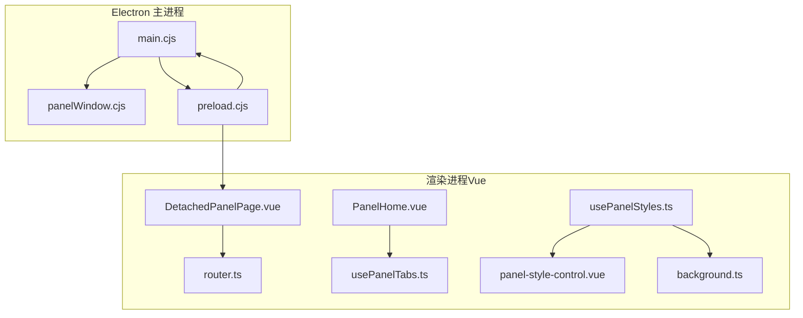
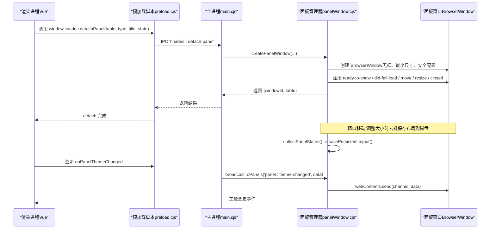
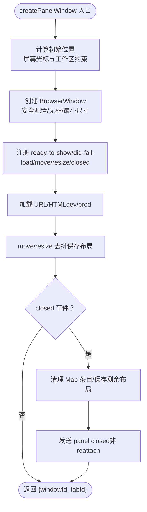
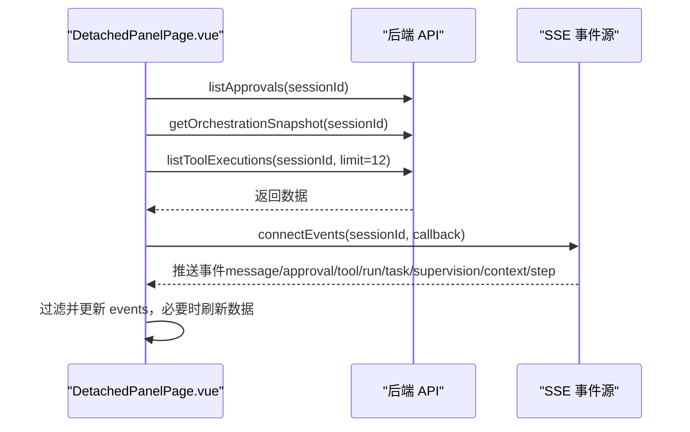
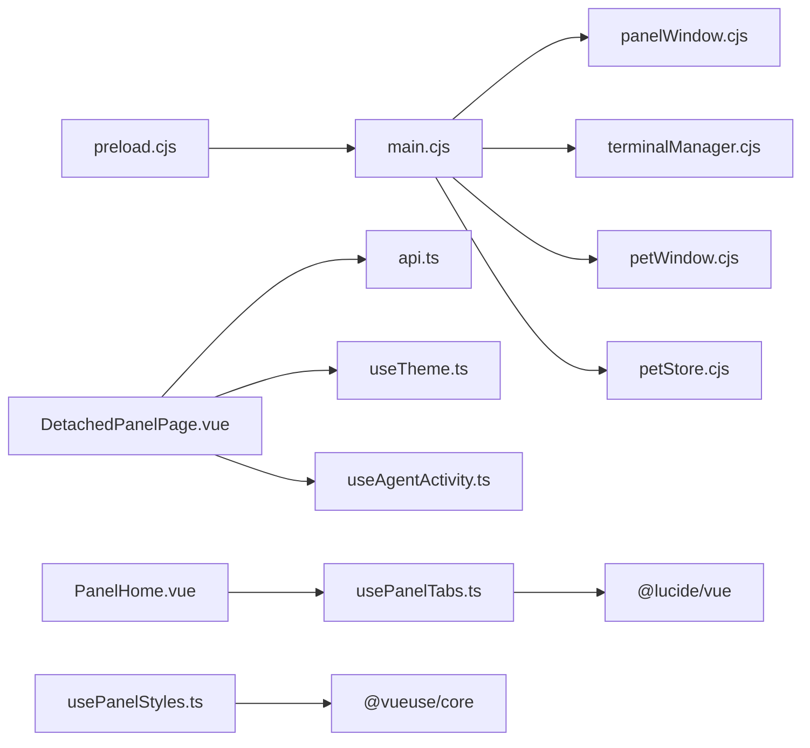

# 可分离面板窗口

<cite>
**本文引用的文件**   
- [panelWindow.cjs](file://apps/desktop/electron/panelWindow.cjs)
- [main.cjs](file://apps/desktop/electron/main.cjs)
- [preload.cjs](file://apps/desktop/electron/preload.cjs)
- [DetachedPanelPage.vue](file://apps/desktop/src/pages/DetachedPanelPage.vue)
- [PanelHome.vue](file://apps/desktop/src/components/PanelHome.vue)
- [usePanelTabs.ts](file://apps/desktop/src/composables/usePanelTabs.ts)
- [router.ts](file://apps/desktop/src/router.ts)
- [usePanelStyles.ts](file://apps/desktop/src/composables/usePanelStyles.ts)
- [panel-style-control.vue](file://apps/desktop/src/components/ui/panel-style-control.vue)
- [background.ts](file://apps/desktop/src/types/background.ts)
</cite>

## 目录
1. [简介](#简介)
2. [项目结构](#项目结构)
3. [核心组件](#核心组件)
4. [架构总览](#架构总览)
5. [详细组件分析](#详细组件分析)
6. [依赖关系分析](#依赖关系分析)
7. [性能考量](#性能考量)
8. [故障排查指南](#故障排查指南)
9. [结论](#结论)
10. [附录：开发示例与调试技巧](#附录开发示例与调试技巧)

## 简介
本文件为“可分离面板窗口系统”的完整技术文档，聚焦 Electron 主进程与渲染进程之间的窗口生命周期管理、面板数据同步机制、跨窗口通信协议以及用户交互体验。重点解析 panelWindow.cjs 的窗口创建、持久化、关闭与重附着流程，以及 PanelHome 组件的渲染与交互逻辑。同时提供自定义面板开发指南、样式定制方法与事件处理规范，并给出完整的开发示例和调试技巧。

## 项目结构
本项目在 apps/desktop 目录下包含 Electron 主进程脚本与 Vue 前端代码：
- 主进程入口与面板管理：electron/main.cjs、electron/panelWindow.cjs、electron/preload.cjs
- 面板页面与路由：src/pages/DetachedPanelPage.vue、src/router.ts
- 面板首页与类型定义：src/components/PanelHome.vue、src/composables/usePanelTabs.ts
- 面板样式与主题：src/composables/usePanelStyles.ts、src/components/ui/panel-style-control.vue、src/types/background.ts

**图表来源** 
- [main.cjs:1-120](file://apps/desktop/electron/main.cjs#L1-L120)
- [panelWindow.cjs:1-120](file://apps/desktop/electron/panelWindow.cjs#L1-L120)
- [preload.cjs:1-112](file://apps/desktop/electron/preload.cjs#L1-L112)
- [router.ts:1-45](file://apps/desktop/src/router.ts#L1-L45)
- [DetachedPanelPage.vue:1-120](file://apps/desktop/src/pages/DetachedPanelPage.vue#L1-L120)
- [PanelHome.vue:1-120](file://apps/desktop/src/components/PanelHome.vue#L1-L120)
- [usePanelTabs.ts:1-120](file://apps/desktop/src/composables/usePanelTabs.ts#L1-L120)
- [usePanelStyles.ts:1-120](file://apps/desktop/src/composables/usePanelStyles.ts#L1-L120)
- [panel-style-control.vue:1-120](file://apps/desktop/src/components/ui/panel-style-control.vue#L1-L120)
- [background.ts:1-57](file://apps/desktop/src/types/background.ts#L1-L57)

**章节来源**
- [main.cjs:1-120](file://apps/desktop/electron/main.cjs#L1-L120)
- [panelWindow.cjs:1-120](file://apps/desktop/electron/panelWindow.cjs#L1-L120)
- [preload.cjs:1-112](file://apps/desktop/electron/preload.cjs#L1-L112)
- [router.ts:1-45](file://apps/desktop/src/router.ts#L1-L45)
- [DetachedPanelPage.vue:1-120](file://apps/desktop/src/pages/DetachedPanelPage.vue#L1-L120)
- [PanelHome.vue:1-120](file://apps/desktop/src/components/PanelHome.vue#L1-L120)
- [usePanelTabs.ts:1-120](file://apps/desktop/src/composables/usePanelTabs.ts#L1-L120)
- [usePanelStyles.ts:1-120](file://apps/desktop/src/composables/usePanelStyles.ts#L1-L120)
- [panel-style-control.vue:1-120](file://apps/desktop/src/components/ui/panel-style-control.vue#L1-L120)
- [background.ts:1-57](file://apps/desktop/src/types/background.ts#L1-L57)

## 核心组件
- 面板窗口管理器（panelWindow.cjs）：负责面板窗口的创建、显示、位置计算、状态持久化、关闭与重附着、广播消息等。
- 主进程入口（main.cjs）：注册 IPC 通道，桥接渲染进程与面板窗口管理器，处理应用级事件（如 before-quit）。
- 预加载脚本（preload.cjs）：暴露 tinadec API 给渲染进程，封装 IPC 调用，订阅面板事件。
- 分离面板页面（DetachedPanelPage.vue）：根据路由参数渲染具体面板内容，独立主题初始化，SSE 数据流更新。
- 面板首页（PanelHome.vue）：展示功能卡片网格，触发打开面板或分离操作。
- 面板标签管理（usePanelTabs.ts）：维护主窗口内标签页与已分离标签的状态，提供分离与重附着能力。
- 面板样式（usePanelStyles.ts + panel-style-control.vue + background.ts）：全局材质效果（不透明/半透明/毛玻璃），滑块控制透明度与模糊强度。

**章节来源**
- [panelWindow.cjs:120-421](file://apps/desktop/electron/panelWindow.cjs#L120-L421)
- [main.cjs:237-333](file://apps/desktop/electron/main.cjs#L237-L333)
- [preload.cjs:63-111](file://apps/desktop/electron/preload.cjs#L63-L111)
- [DetachedPanelPage.vue:190-295](file://apps/desktop/src/pages/DetachedPanelPage.vue#L190-L295)
- [PanelHome.vue:28-92](file://apps/desktop/src/components/PanelHome.vue#L28-L92)
- [usePanelTabs.ts:140-222](file://apps/desktop/src/composables/usePanelTabs.ts#L140-L222)
- [usePanelStyles.ts:111-178](file://apps/desktop/src/composables/usePanelStyles.ts#L111-L178)
- [panel-style-control.vue:75-136](file://apps/desktop/src/components/ui/panel-style-control.vue#L75-L136)
- [background.ts:24-57](file://apps/desktop/src/types/background.ts#L24-L57)

## 架构总览
下图展示了主进程、预加载脚本与渲染进程之间的交互关系，以及面板窗口的生命周期与数据流。

**图表来源** 
- [main.cjs:237-291](file://apps/desktop/electron/main.cjs#L237-L291)
- [panelWindow.cjs:145-303](file://apps/desktop/electron/panelWindow.cjs#L145-L303)
- [panelWindow.cjs:263-292](file://apps/desktop/electron/panelWindow.cjs#L263-L292)
- [panelWindow.cjs:397-403](file://apps/desktop/electron/panelWindow.cjs#L397-L403)
- [preload.cjs:63-111](file://apps/desktop/electron/preload.cjs#L63-L111)

**章节来源**
- [main.cjs:237-333](file://apps/desktop/electron/main.cjs#L237-L333)
- [panelWindow.cjs:145-303](file://apps/desktop/electron/panelWindow.cjs#L145-L303)
- [panelWindow.cjs:263-292](file://apps/desktop/electron/panelWindow.cjs#L263-L292)
- [panelWindow.cjs:397-403](file://apps/desktop/electron/panelWindow.cjs#L397-L403)
- [preload.cjs:63-111](file://apps/desktop/electron/preload.cjs#L63-L111)

## 详细组件分析

### 面板窗口管理器（panelWindow.cjs）
- 窗口创建与显示
  - 使用 screen.getCursorScreenPoint 计算初始位置，并限制在可见工作区内。
  - 设置 BrowserWindow 选项：无边框、自动隐藏菜单栏、安全 webPreferences（contextIsolation、sandbox、webSecurity=false）。
  - 通过 once('ready-to-show') 确保窗口正确显示；did-fail-load 兜底显示；5s 超时强制显示。
- 状态持久化
  - 将面板窗口 bounds 与 tabId/type/title/state 序列化到 APPDATA/HOME 下的 .tinadec-panel-layout.json。
  - 在 move/resize 时去抖保存；before-quit 时统一持久化；启动后恢复面板。
- 生命周期与通信
  - closed 事件清理 Map 条目，发送 panel:closed 给主窗口（非 reattach 场景）。
  - detached 时发送 panel:detached 给主窗口。
  - reattachPanelWindow 标记 _reattaching，通知主窗口重新添加标签，然后关闭窗口。
  - broadcastToPanels 向所有面板窗口广播主题变更等事件。
- 辅助方法
  - getMainWindow：优先查找带 _isTinadecMain 标记的主窗口，否则回退到未跟踪的第一个窗口。
  - tagMainWindow：为主窗口打标记，避免与 Debug Studio 窗口混淆。

**图表来源** 
- [panelWindow.cjs:145-261](file://apps/desktop/electron/panelWindow.cjs#L145-L261)
- [panelWindow.cjs:263-292](file://apps/desktop/electron/panelWindow.cjs#L263-L292)
- [panelWindow.cjs:315-336](file://apps/desktop/electron/panelWindow.cjs#L315-L336)

**章节来源**
- [panelWindow.cjs:145-303](file://apps/desktop/electron/panelWindow.cjs#L145-L303)
- [panelWindow.cjs:263-292](file://apps/desktop/electron/panelWindow.cjs#L263-L292)
- [panelWindow.cjs:315-336](file://apps/desktop/electron/panelWindow.cjs#L315-L336)

### 主进程入口（main.cjs）
- IPC 通道注册
  - 面板相关：tinadec:detach-panel、tinadec:reattach-panel、tinadec:close-panel-window、tinadec:focus-panel-window、tinadec:get-panel-windows、tinadec:get-cursor-screen、tinadec:get-main-bounds。
  - 主题广播：tinadec:broadcast-theme 转发到所有面板窗口。
  - 状态通知广播：tinadec:broadcast-status-notification 转发到主窗口、Debug Studio 与所有面板窗口（排除发送者）。
- 应用生命周期
  - whenReady：初始化协议、创建主窗口、恢复面板、启动宠物窗口。
  - before-quit：销毁终端、持久化面板布局、关闭宠物窗口。
  - window-all-closed：关闭所有面板与宠物窗口，非 macOS 退出应用。

**章节来源**
- [main.cjs:237-333](file://apps/desktop/electron/main.cjs#L237-L333)
- [main.cjs:329-374](file://apps/desktop/electron/main.cjs#L329-L374)

### 预加载脚本（preload.cjs）
- 暴露 tinadec API：
  - 窗口控制：minimize/maximize/close。
  - 面板控制：detachPanel、reattachPanel、closePanelWindow、focusPanelWindow、getPanelWindows、getCursorScreen、getMainBounds、broadcastTheme。
  - 状态通知：broadcastStatusNotification、onStatusNotification。
  - 面板事件订阅：onPanelDetached、onPanelReattach、onPanelClosed、onPanelThemeChanged。
- 通过 contextBridge 安全暴露，IPC 通道与主进程一致。

**章节来源**
- [preload.cjs:10-111](file://apps/desktop/electron/preload.cjs#L10-L111)

### 分离面板页面（DetachedPanelPage.vue）
- 路由参数解析：tabId、type、title、state（JSON 字符串）。
- 主题初始化：独立窗口应用主题与强调色。
- 数据加载：根据 sessionId 并行拉取审批列表、编排快照、工具执行时间线。
- SSE 连接：实时事件流，过滤关键事件类型并刷新数据。
- 窗口控制：最小化、最大化、关闭；重附着到主窗口。
- 事件监听：接收主窗口广播的主题变更。

**图表来源** 
- [DetachedPanelPage.vue:62-116](file://apps/desktop/src/pages/DetachedPanelPage.vue#L62-L116)
- [DetachedPanelPage.vue:167-191](file://apps/desktop/src/pages/DetachedPanelPage.vue#L167-L191)

**章节来源**
- [DetachedPanelPage.vue:23-116](file://apps/desktop/src/pages/DetachedPanelPage.vue#L23-L116)
- [DetachedPanelPage.vue:167-191](file://apps/desktop/src/pages/DetachedPanelPage.vue#L167-L191)

### 面板首页（PanelHome.vue）
- 功能卡片网格：agent、terminal、git、approval、orchestration、preview、events、doctor。
- 点击卡片触发 open-panel 事件，携带 type、title、icon。
- 支持紧凑模式（单列、缩小间距与图标尺寸）。
- 徽章计数（如 approval 待审批数量）。

**章节来源**
- [PanelHome.vue:28-92](file://apps/desktop/src/components/PanelHome.vue#L28-L92)
- [PanelHome.vue:94-128](file://apps/desktop/src/components/PanelHome.vue#L94-L128)

### 面板标签管理（usePanelTabs.ts）
- 标签状态：tabs、activeTabId、detachedTabs。
- 打开面板：非 preview/terminal 类型复用现有标签。
- 分离标签：调用 window.tinadec.detachPanel，记录 detachedTabs，从主面板移除。
- 重附着：从 detachedTabs 移除并重新加入主面板。
- 关闭/选择/更新状态：标准标签行为。

**章节来源**
- [usePanelTabs.ts:51-102](file://apps/desktop/src/composables/usePanelTabs.ts#L51-L102)
- [usePanelTabs.ts:140-181](file://apps/desktop/src/composables/usePanelTabs.ts#L140-L181)
- [usePanelTabs.ts:187-222](file://apps/desktop/src/composables/usePanelTabs.ts#L187-L222)

### 面板样式与主题（usePanelStyles.ts + panel-style-control.vue + background.ts）
- 材质效果：opaque（纯色）、translucent（可调透明度）、blur（毛玻璃，可调透明度与模糊强度）。
- 存储键 tinadec-panel-style，默认值 DEFAULT_PANEL_STYLE_SETTINGS。
- computePanelStyle 生成 inline style（backgroundColor/backdropFilter/WebkitBackdropFilter 等）。
- panel-style-control.vue 提供效果选择器、透明度滑块、模糊滑块与预览。
- background.ts 定义类型与默认值。

**章节来源**
- [usePanelStyles.ts:111-178](file://apps/desktop/src/composables/usePanelStyles.ts#L111-L178)
- [panel-style-control.vue:75-136](file://apps/desktop/src/components/ui/panel-style-control.vue#L75-L136)
- [background.ts:24-57](file://apps/desktop/src/types/background.ts#L24-L57)

## 依赖关系分析
- 主进程依赖：
  - main.cjs 依赖 panelWindow.cjs（窗口管理）、terminalManager.cjs（终端）、petWindow.cjs/petStore.cjs（宠物窗口）。
  - preload.cjs 暴露 tinadec API，封装 IPC 调用。
- 渲染进程依赖：
  - DetachedPanelPage.vue 依赖 api、useTheme、useAgentActivity、各面板组件。
  - PanelHome.vue 依赖 usePanelTabs 的 panelIcons。
  - usePanelTabs.ts 依赖 @lucide/vue 图标库。
  - usePanelStyles.ts 依赖 @vueuse/core 的 useStorage。

**图表来源** 
- [main.cjs:1-43](file://apps/desktop/electron/main.cjs#L1-L43)
- [preload.cjs:1-12](file://apps/desktop/electron/preload.cjs#L1-L12)
- [DetachedPanelPage.vue:1-18](file://apps/desktop/src/pages/DetachedPanelPage.vue#L1-L18)
- [PanelHome.vue:1-7](file://apps/desktop/src/components/PanelHome.vue#L1-L7)
- [usePanelTabs.ts:1-12](file://apps/desktop/src/composables/usePanelTabs.ts#L1-L12)
- [usePanelStyles.ts:31-37](file://apps/desktop/src/composables/usePanelStyles.ts#L31-L37)

**章节来源**
- [main.cjs:1-43](file://apps/desktop/electron/main.cjs#L1-L43)
- [preload.cjs:1-12](file://apps/desktop/electron/preload.cjs#L1-L12)
- [DetachedPanelPage.vue:1-18](file://apps/desktop/src/pages/DetachedPanelPage.vue#L1-L18)
- [PanelHome.vue:1-7](file://apps/desktop/src/components/PanelHome.vue#L1-L7)
- [usePanelTabs.ts:1-12](file://apps/desktop/src/composables/usePanelTabs.ts#L1-L12)
- [usePanelStyles.ts:31-37](file://apps/desktop/src/composables/usePanelStyles.ts#L31-L37)

## 性能考量
- 窗口显示优化：
  - ready-to-show 前注册事件，避免错过显示时机；did-fail-load 兜底显示；5s 超时强制显示。
- 布局持久化：
  - move/resize 去抖保存，减少频繁 I/O。
- SSE 事件处理：
  - 仅对关键事件类型进行刷新，避免全量重绘。
- 主题广播：
  - 使用 IPC 广播而非轮询，降低 CPU 占用。

[本节为通用指导，无需特定文件引用]

## 故障排查指南
- 面板窗口不可见：
  - 检查 ready-to-show 是否触发；查看 did-fail-load 错误码；确认 5s 超时是否强制显示。
- 布局未恢复：
  - 检查 .tinadec-panel-layout.json 是否存在且格式正确；确认 restorePersistedPanels 被调用。
- 主题不同步：
  - 确认 main.cjs 中 tinadec:broadcast-theme 已触发；面板窗口是否订阅 panel:theme-changed。
- 重附着失败：
  - 检查 reattachPanelWindow 是否标记 _reattaching；确认主窗口收到 panel:reattach 并重新添加标签。

**章节来源**
- [panelWindow.cjs:199-233](file://apps/desktop/electron/panelWindow.cjs#L199-L233)
- [panelWindow.cjs:263-292](file://apps/desktop/electron/panelWindow.cjs#L263-L292)
- [panelWindow.cjs:315-336](file://apps/desktop/electron/panelWindow.cjs#L315-L336)
- [main.cjs:289-291](file://apps/desktop/electron/main.cjs#L289-L291)

## 结论
可分离面板窗口系统通过 panelWindow.cjs 实现了稳健的窗口生命周期管理与状态持久化，结合 main.cjs 的 IPC 桥接与 preload.cjs 的安全 API 暴露，为渲染进程提供了统一的窗口控制与事件订阅能力。DetachedPanelPage.vue 与 PanelHome.vue 分别承担面板内容与入口职责，usePanelTabs.ts 协调主窗口标签与分离状态，usePanelStyles.ts 提供一致的材质效果。整体架构清晰、扩展性强，便于新增面板类型与自定义样式。

[本节为总结性内容，无需特定文件引用]

## 附录：开发示例与调试技巧
- 自定义面板开发步骤
  - 在 router.ts 中添加新路由（如 /my-panel）。
  - 新建页面组件（如 MyPanel.vue），实现数据加载与渲染。
  - 在 usePanelTabs.ts 的 PanelType 中添加新类型，并在 PanelHome.vue 的功能卡片中注册。
  - 如需分离，调用 window.tinadec.detachPanel(tabId, type, title, state)。
- 样式定制
  - 使用 usePanelStyles.ts 的 setPanelEffect/updatePanelStyle 调整全局材质效果。
  - 在 panel-style-control.vue 中扩展滑块或新增效果选项。
- 事件处理
  - 订阅 onPanelDetached/onPanelReattach/onPanelClosed/onPanelThemeChanged 以响应面板状态变化。
  - 使用 broadcastStatusNotification 向其他窗口广播状态通知。
- 调试技巧
  - 开发模式下启用面板 DevTools：TINADEC_PANEL_DEVTOOLS=1。
  - 检查控制台日志：panelWindow 的错误与警告信息。
  - 验证 IPC 通道：在浏览器 DevTools 中观察事件流。

**章节来源**
- [router.ts:31-35](file://apps/desktop/src/router.ts#L31-L35)
- [PanelHome.vue:28-92](file://apps/desktop/src/components/PanelHome.vue#L28-L92)
- [usePanelTabs.ts:140-181](file://apps/desktop/src/composables/usePanelTabs.ts#L140-L181)
- [usePanelStyles.ts:150-178](file://apps/desktop/src/composables/usePanelStyles.ts#L150-L178)
- [panelWindow.cjs:210-213](file://apps/desktop/electron/panelWindow.cjs#L210-L213)