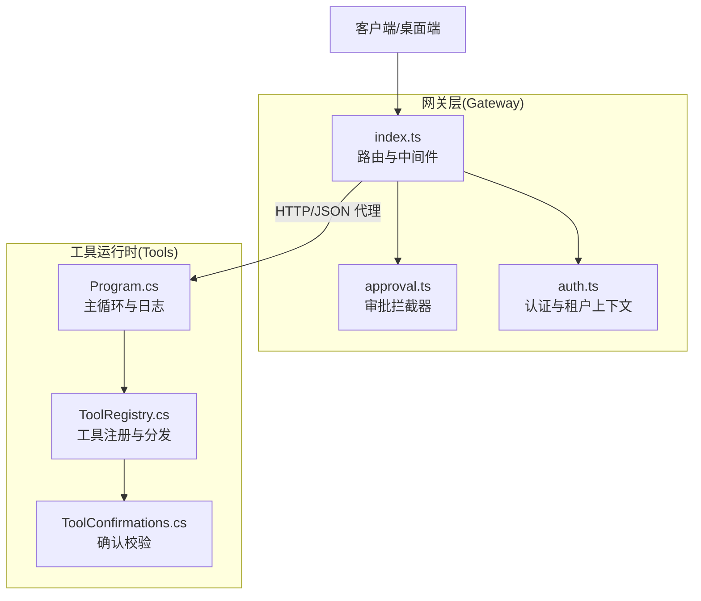
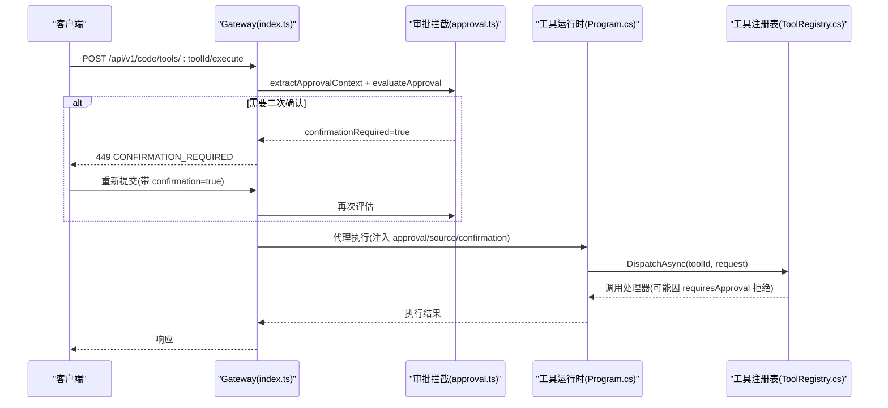
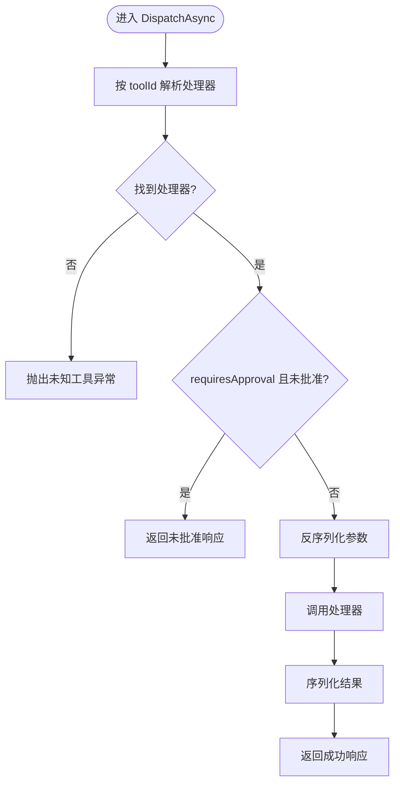
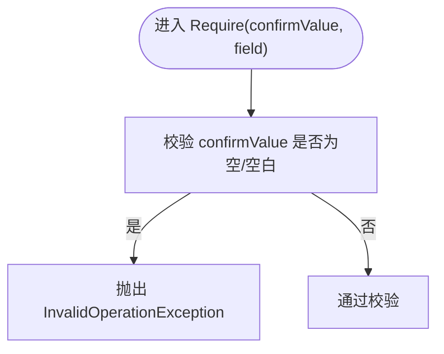
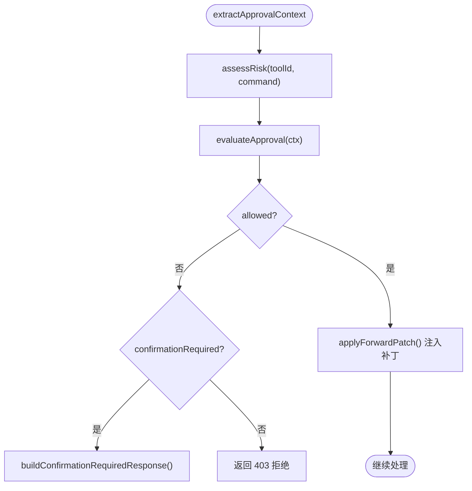
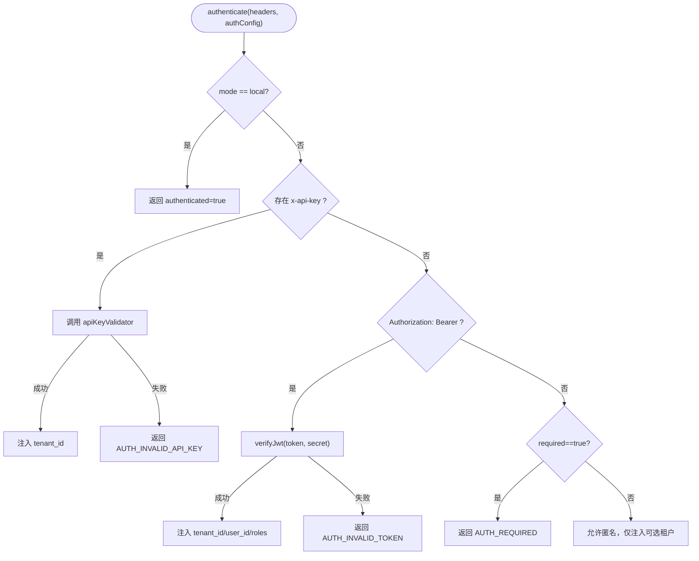
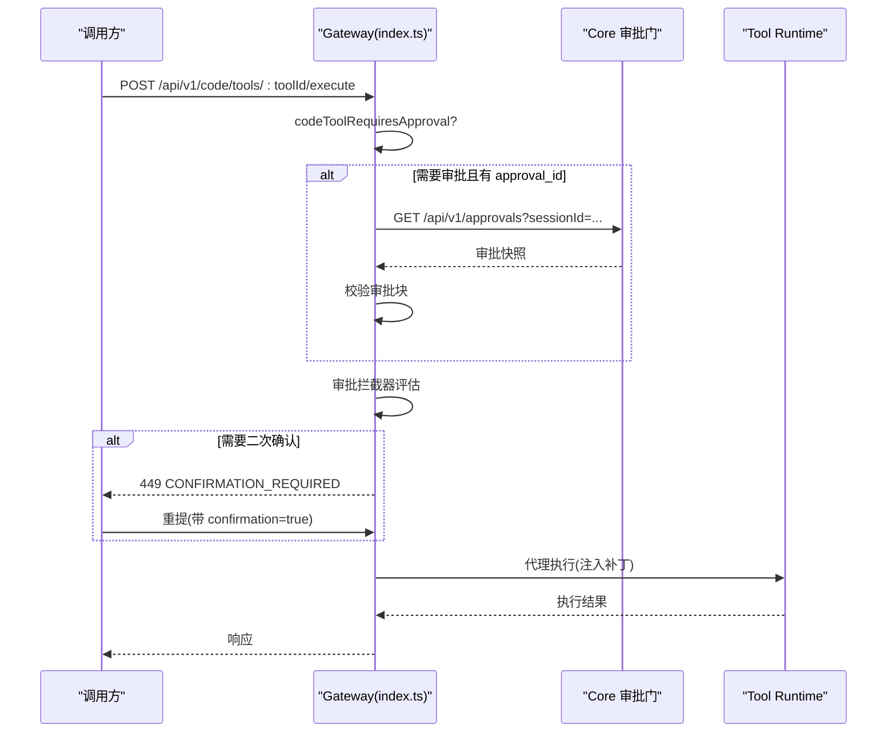
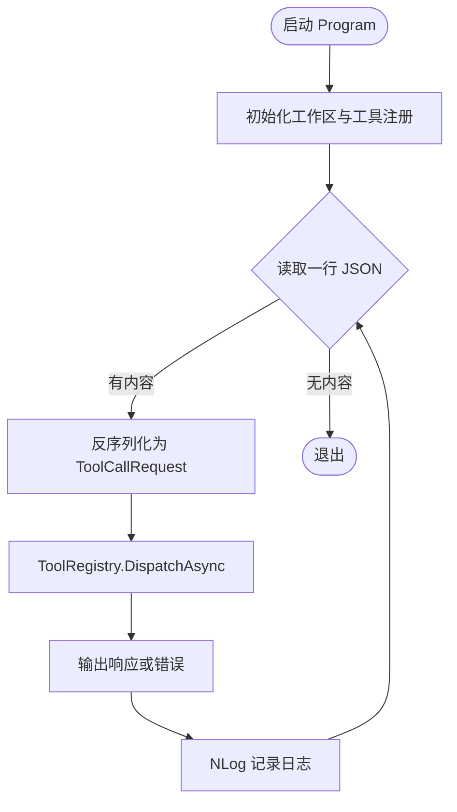
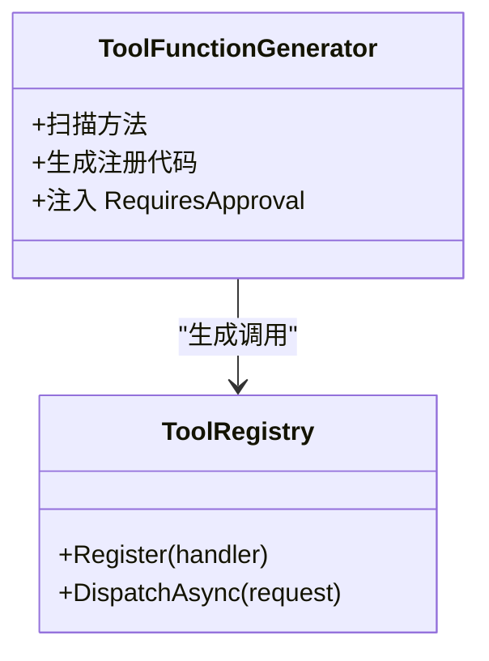
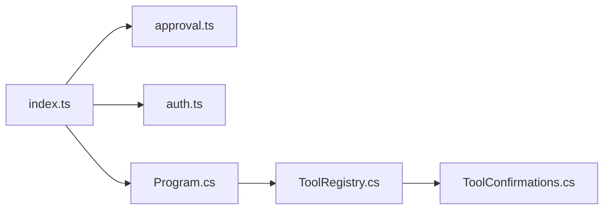

# 审批门控工具执行

<cite>
**本文引用的文件**   
- [TinadecTools/Abstractions/ToolRegistry.cs](file://TinadecTools/Abstractions/ToolRegistry.cs)
- [TinadecTools/Tools/ToolConfirmations.cs](file://TinadecTools/Tools/ToolConfirmations.cs)
- [TinadecGateway/src/approval.ts](file://TinadecGateway/src/approval.ts)
- [TinadecGateway/src/auth.ts](file://TinadecGateway/src/auth.ts)
- [TinadecGateway/src/index.ts](file://TinadecGateway/src/index.ts)
- [TinadecTools/Program.cs](file://TinadecTools/Program.cs)
- [TinadecTools.Generators/ToolFunctionGenerator.cs](file://TinadecTools.Generators/ToolFunctionGenerator.cs)
</cite>

## 目录
1. [简介](#简介)
2. [项目结构](#项目结构)
3. [核心组件](#核心组件)
4. [架构总览](#架构总览)
5. [详细组件分析](#详细组件分析)
6. [依赖关系分析](#依赖关系分析)
7. [性能考虑](#性能考虑)
8. [故障排查指南](#故障排查指南)
9. [结论](#结论)
10. [附录：最佳实践与示例路径](#附录最佳实践与示例路径)

## 简介
本文件面向“审批门控工具执行系统”，系统性阐述写操作的安全控制机制，覆盖以下关键方面：
- ToolRegistry 的工具注册流程与分发逻辑
- ToolConfirmations 的确认校验策略
- Gateway 层的审批中间件（风险评估、二次确认、透传补丁）
- 审批流程的状态管理、用户交互界面与权限验证
- 自定义工具的审批配置、安全策略设置与审计日志记录
- 完整代码级流程图与最佳实践指导

## 项目结构
本项目由三层组成：
- Gateway（BFF/API 层）：负责认证、CORS、路由、审批拦截、流式转发与代理。
- Tools（工具运行时）：以进程内方式接收 JSON 命令，通过 ToolRegistry 分发给具体工具处理器。
- Core（核心服务）：提供会话、编排、审批门等能力（由 Gateway 代理访问）。

**图表来源** 
- [TinadecGateway/src/index.ts:1-800](file://TinadecGateway/src/index.ts#L1-L800)
- [TinadecGateway/src/approval.ts:1-235](file://TinadecGateway/src/approval.ts#L1-L235)
- [TinadecGateway/src/auth.ts:1-273](file://TinadecGateway/src/auth.ts#L1-L273)
- [TinadecTools/Program.cs:1-68](file://TinadecTools/Program.cs#L1-L68)
- [TinadecTools/Abstractions/ToolRegistry.cs:1-86](file://TinadecTools/Abstractions/ToolRegistry.cs#L1-L86)
- [TinadecTools/Tools/ToolConfirmations.cs:1-12](file://TinadecTools/Tools/ToolConfirmations.cs#L1-L12)

**章节来源**
- [TinadecGateway/src/index.ts:1-800](file://TinadecGateway/src/index.ts#L1-L800)
- [TinadecGateway/src/approval.ts:1-235](file://TinadecGateway/src/approval.ts#L1-L235)
- [TinadecGateway/src/auth.ts:1-273](file://TinadecGateway/src/auth.ts#L1-L273)
- [TinadecTools/Program.cs:1-68](file://TinadecTools/Program.cs#L1-L68)
- [TinadecTools/Abstractions/ToolRegistry.cs:1-86](file://TinadecTools/Abstractions/ToolRegistry.cs#L1-L86)
- [TinadecTools/Tools/ToolConfirmations.cs:1-12](file://TinadecTools/Tools/ToolConfirmations.cs#L1-L12)

## 核心组件
- 工具注册与分发（ToolRegistry）
  - 支持泛型与非泛型注册；在注册时可通过 requiresApproval 标记是否需要审批。
  - 分发时根据 toolId 解析处理器并调用，若 requiresApproval=true 且请求未批准则直接拒绝。
- 确认校验（ToolConfirmations）
  - 对写操作强制要求 confirm_* 字段非空，缺失即抛出异常，用于通知上游（Gateway/Core）进行拦截或提示。
- 审批拦截器（approval.ts）
  - 评估风险等级（低/中/高），人类高风险操作需二次确认；通过后向下游注入 approval/confirmation/source 等补丁。
- 认证与租户上下文（auth.ts）
  - 本地模式跳过认证；云端模式支持 API Key/JWT HS256 验证，提取 tenant_id/user_id 并注入转发头。
- 网关路由与代理（index.ts）
  - 统一入口，串联认证、审批拦截、Code Tools 审批门校验、以及到 Tool Runtime/Core 的代理转发。
- 工具运行时主循环（Program.cs）
  - 从标准输入读取 JSON 命令，调用 ToolRegistry.DispatchAsync，输出结果或错误，并记录 NLog 日志。

**章节来源**
- [TinadecTools/Abstractions/ToolRegistry.cs:1-86](file://TinadecTools/Abstractions/ToolRegistry.cs#L1-L86)
- [TinadecTools/Tools/ToolConfirmations.cs:1-12](file://TinadecTools/Tools/ToolConfirmations.cs#L1-L12)
- [TinadecGateway/src/approval.ts:1-235](file://TinadecGateway/src/approval.ts#L1-L235)
- [TinadecGateway/src/auth.ts:1-273](file://TinadecGateway/src/auth.ts#L1-L273)
- [TinadecGateway/src/index.ts:1-800](file://TinadecGateway/src/index.ts#L1-L800)
- [TinadecTools/Program.cs:1-68](file://TinadecTools/Program.cs#L1-L68)

## 架构总览
下图展示一次“人类发起的高风险写操作”的端到端流程：客户端→Gateway 认证→审批拦截→二次确认→Tool Runtime 执行→返回结果。

**图表来源** 
- [TinadecGateway/src/index.ts:350-400](file://TinadecGateway/src/index.ts#L350-L400)
- [TinadecGateway/src/approval.ts:90-197](file://TinadecGateway/src/approval.ts#L90-L197)
- [TinadecTools/Program.cs:26-60](file://TinadecTools/Program.cs#L26-L60)
- [TinadecTools/Abstractions/ToolRegistry.cs:76-84](file://TinadecTools/Abstractions/ToolRegistry.cs#L76-L84)

## 详细组件分析

### ToolRegistry：工具注册与分发
- 注册接口
  - 支持按 toolId 直接注册委托，或基于泛型处理器注册，并在注册时声明 requiresApproval。
- 分发逻辑
  - 根据 toolId 解析处理器；若 requiresApproval=true 且请求未批准，直接返回“未批准”响应。
  - 参数校验与序列化使用 System.Text.Json 的类型信息，保证 AOT 友好。
- 复杂度
  - 查找 O(1)，分发 O(1)；序列化/反序列化取决于参数大小。

**图表来源** 
- [TinadecTools/Abstractions/ToolRegistry.cs:76-84](file://TinadecTools/Abstractions/ToolRegistry.cs#L76-L84)
- [TinadecTools/Abstractions/ToolRegistry.cs:29-69](file://TinadecTools/Abstractions/ToolRegistry.cs#L29-L69)

**章节来源**
- [TinadecTools/Abstractions/ToolRegistry.cs:1-86](file://TinadecTools/Abstractions/ToolRegistry.cs#L1-L86)

### ToolConfirmations：写操作确认校验
- 设计要点
  - 所有写操作必须在参数中包含 confirm_* 字段，且值非空；否则抛出异常，使上游（Gateway/Core）可据此拦截或提示。
- 适用场景
  - 文件写入、删除、Git 推送/合并/重置、沙箱执行等高风险操作。

**图表来源** 
- [TinadecTools/Tools/ToolConfirmations.cs:6-11](file://TinadecTools/Tools/ToolConfirmations.cs#L6-L11)

**章节来源**
- [TinadecTools/Tools/ToolConfirmations.cs:1-12](file://TinadecTools/Tools/ToolConfirmations.cs#L1-L12)

### Gateway 审批中间件：风险评估与二次确认
- 风险评估
  - 基于工具 ID 集合与命令文本关键字判断风险等级（低/中/高）。
- 审批决策
  - Agent 请求不拦截；人类低风险/中风险直接通过；人类高风险需 confirmation=true。
- 响应构建
  - 需要二次确认时返回 449 状态码与结构化数据，供桌面 UI 弹窗提示。
- 请求补丁
  - 通过后向请求体注入 approval/source/confirmation 等字段，确保下游正确识别来源与状态。

**图表来源** 
- [TinadecGateway/src/approval.ts:91-197](file://TinadecGateway/src/approval.ts#L91-L197)
- [TinadecGateway/src/approval.ts:203-234](file://TinadecGateway/src/approval.ts#L203-L234)

**章节来源**
- [TinadecGateway/src/approval.ts:1-235](file://TinadecGateway/src/approval.ts#L1-L235)

### 认证与租户上下文
- 认证方式
  - 本地模式：跳过认证。
  - 云端模式：API Key 或 Bearer JWT（HS256）；失败时 fail-closed。
- 上下文注入
  - 将 tenant_id、user_id 注入到转发头，供下游服务进行多租户隔离与审计。

**图表来源** 
- [TinadecGateway/src/auth.ts:46-112](file://TinadecGateway/src/auth.ts#L46-L112)
- [TinadecGateway/src/auth.ts:133-178](file://TinadecGateway/src/auth.ts#L133-L178)
- [TinadecGateway/src/auth.ts:227-254](file://TinadecGateway/src/auth.ts#L227-L254)

**章节来源**
- [TinadecGateway/src/auth.ts:1-273](file://TinadecGateway/src/auth.ts#L1-L273)

### 网关路由与 Code Tools 执行
- 路由职责
  - 健康检查、SSE/WS 代理、审批查询、Code Tools 列表与执行、MCP、Agent Center 等。
- Code Tools 执行流程
  - 先判断是否需要审批；若需要且携带 approval_id，则调用 Core 审批门校验。
  - 再经 Gateway 审批拦截器评估风险与二次确认。
  - 最后代理到 Tool Runtime 执行。

**图表来源** 
- [TinadecGateway/src/index.ts:350-400](file://TinadecGateway/src/index.ts#L350-L400)
- [TinadecGateway/src/index.ts:89-105](file://TinadecGateway/src/index.ts#L89-L105)

**章节来源**
- [TinadecGateway/src/index.ts:1-800](file://TinadecGateway/src/index.ts#L1-L800)

### 工具运行时主循环与日志
- 主循环
  - 从标准输入逐行读取 JSON 命令，反序列化为 ToolCallRequest。
  - 调用 ToolRegistry.DispatchAsync，输出 ToolCallResponse 或错误。
- 日志
  - 使用 NLog 记录调试与警告信息，便于问题定位与审计。

**图表来源** 
- [TinadecTools/Program.cs:22-60](file://TinadecTools/Program.cs#L22-L60)

**章节来源**
- [TinadecTools/Program.cs:1-68](file://TinadecTools/Program.cs#L1-L68)

### 自定义工具审批配置与生成器
- 生成器
  - ToolFunctionGenerator 在编译期扫描工具方法，生成注册代码，并传递 RequiresApproval 标志。
- 配置建议
  - 对写操作标注 RequiresApproval=true，确保 ToolRegistry 在分发时进行审批检查。
  - 在工具实现中调用 ToolConfirmations.Require 进行参数级确认校验。

**图表来源** 
- [TinadecTools.Generators/ToolFunctionGenerator.cs:66-80](file://TinadecTools.Generators/ToolFunctionGenerator.cs#L66-L80)
- [TinadecTools/Abstractions/ToolRegistry.cs:22-27](file://TinadecTools/Abstractions/ToolRegistry.cs#L22-L27)

**章节来源**
- [TinadecTools.Generators/ToolFunctionGenerator.cs:66-80](file://TinadecTools.Generators/ToolFunctionGenerator.cs#L66-L80)
- [TinadecTools/Abstractions/ToolRegistry.cs:22-27](file://TinadecTools/Abstractions/ToolRegistry.cs#L22-L27)

## 依赖关系分析
- 组件耦合
  - Gateway 依赖 approval.ts 与 auth.ts 作为中间件；index.ts 协调路由与代理。
  - Tools 运行时依赖 ToolRegistry 进行分发；ToolConfirmations 被写操作处理器调用。
- 外部依赖
  - System.Text.Json（序列化）、NLog（日志）、WebCrypto（JWT 验证）。
- 潜在循环
  - 当前分层清晰，未见循环依赖。

**图表来源** 
- [TinadecGateway/src/index.ts:1-800](file://TinadecGateway/src/index.ts#L1-L800)
- [TinadecGateway/src/approval.ts:1-235](file://TinadecGateway/src/approval.ts#L1-L235)
- [TinadecGateway/src/auth.ts:1-273](file://TinadecGateway/src/auth.ts#L1-L273)
- [TinadecTools/Program.cs:1-68](file://TinadecTools/Program.cs#L1-L68)
- [TinadecTools/Abstractions/ToolRegistry.cs:1-86](file://TinadecTools/Abstractions/ToolRegistry.cs#L1-L86)
- [TinadecTools/Tools/ToolConfirmations.cs:1-12](file://TinadecTools/Tools/ToolConfirmations.cs#L1-L12)

**章节来源**
- [TinadecGateway/src/index.ts:1-800](file://TinadecGateway/src/index.ts#L1-L800)
- [TinadecGateway/src/approval.ts:1-235](file://TinadecGateway/src/approval.ts#L1-L235)
- [TinadecGateway/src/auth.ts:1-273](file://TinadecGateway/src/auth.ts#L1-L273)
- [TinadecTools/Program.cs:1-68](file://TinadecTools/Program.cs#L1-L68)
- [TinadecTools/Abstractions/ToolRegistry.cs:1-86](file://TinadecTools/Abstractions/ToolRegistry.cs#L1-L86)
- [TinadecTools/Tools/ToolConfirmations.cs:1-12](file://TinadecTools/Tools/ToolConfirmations.cs#L1-L12)

## 性能考虑
- 序列化开销：System.Text.Json 类型信息预编译，减少反射成本。
- 网络代理：Gateway 采用轻量代理，避免重复业务逻辑。
- 日志级别：生产环境降低调试日志频率，避免 I/O 瓶颈。
- 并发模型：Bun/Elysia 事件循环适合高并发；工具运行时为单进程串行处理，避免竞争条件。

[本节为通用指导，不涉及具体文件分析]

## 故障排查指南
- 常见错误
  - 未知工具：检查 ToolRegistry 是否已注册对应 toolId。
  - 未批准：确认 requiresApproval 标志与请求是否包含 Approved/confirmation。
  - 缺少确认字段：检查工具实现是否调用 ToolConfirmations.Require。
  - 认证失败：检查 JWT 密钥、过期时间、API Key 配置。
- 定位手段
  - 查看 NLog 日志输出，关注工具调用与异常堆栈。
  - 使用 Gateway 健康/诊断接口确认运行状态。
  - 通过 449 响应码与 warning 字段定位二次确认需求。

**章节来源**
- [TinadecTools/Program.cs:44-59](file://TinadecTools/Program.cs#L44-L59)
- [TinadecGateway/src/approval.ts:203-224](file://TinadecGateway/src/approval.ts#L203-L224)
- [TinadecGateway/src/auth.ts:96-112](file://TinadecGateway/src/auth.ts#L96-L112)

## 结论
本系统通过“Gateway 审批拦截 + ToolRegistry 分发控制 + ToolConfirmations 参数校验”的多层门控机制，确保写操作的安全性。结合认证与租户上下文，可实现细粒度的权限控制与审计追踪。建议在自定义工具开发中严格遵循 RequiresApproval 与确认字段规范，配合完善的日志与监控，保障系统稳定与安全。

[本节为总结性内容，不涉及具体文件分析]

## 附录：最佳实践与示例路径
- 自定义工具审批配置
  - 在工具方法上标注 RequiresApproval=true，由生成器自动注入注册代码。
  - 参考路径：[TinadecTools.Generators/ToolFunctionGenerator.cs:66-80](file://TinadecTools.Generators/ToolFunctionGenerator.cs#L66-L80)
- 写操作确认校验
  - 在工具实现中调用 ToolConfirmations.Require，确保 confirm_* 字段有效。
  - 参考路径：[TinadecTools/Tools/ToolConfirmations.cs:6-11](file://TinadecTools/Tools/ToolConfirmations.cs#L6-L11)
- 审批拦截与二次确认
  - 在 Gateway 路由中集成 approval.ts 的评估与响应构建。
  - 参考路径：[TinadecGateway/src/approval.ts:91-197](file://TinadecGateway/src/approval.ts#L91-L197), [TinadecGateway/src/approval.ts:203-234](file://TinadecGateway/src/approval.ts#L203-L234)
- 认证与租户注入
  - 使用 auth.ts 的 authenticate 与 buildForwardHeaders 完成鉴权与上下文传播。
  - 参考路径：[TinadecGateway/src/auth.ts:46-112](file://TinadecGateway/src/auth.ts#L46-L112), [TinadecGateway/src/auth.ts:227-254](file://TinadecGateway/src/auth.ts#L227-L254)
- 工具运行时主循环与日志
  - 使用 NLog 记录关键事件，便于审计与排障。
  - 参考路径：[TinadecTools/Program.cs:22-60](file://TinadecTools/Program.cs#L22-L60)

**章节来源**
- [TinadecTools.Generators/ToolFunctionGenerator.cs:66-80](file://TinadecTools.Generators/ToolFunctionGenerator.cs#L66-L80)
- [TinadecTools/Tools/ToolConfirmations.cs:6-11](file://TinadecTools/Tools/ToolConfirmations.cs#L6-L11)
- [TinadecGateway/src/approval.ts:91-197](file://TinadecGateway/src/approval.ts#L91-L197)
- [TinadecGateway/src/approval.ts:203-234](file://TinadecGateway/src/approval.ts#L203-L234)
- [TinadecGateway/src/auth.ts:46-112](file://TinadecGateway/src/auth.ts#L46-L112)
- [TinadecGateway/src/auth.ts:227-254](file://TinadecGateway/src/auth.ts#L227-L254)
- [TinadecTools/Program.cs:22-60](file://TinadecTools/Program.cs#L22-L60)