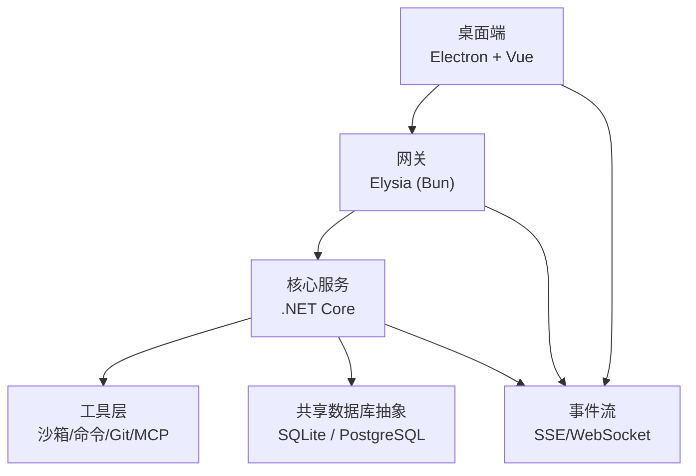
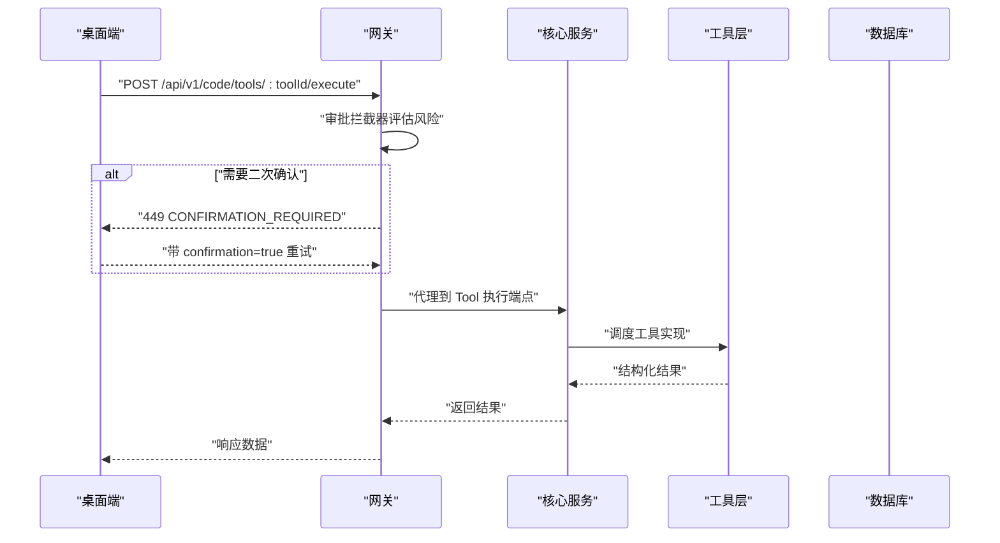
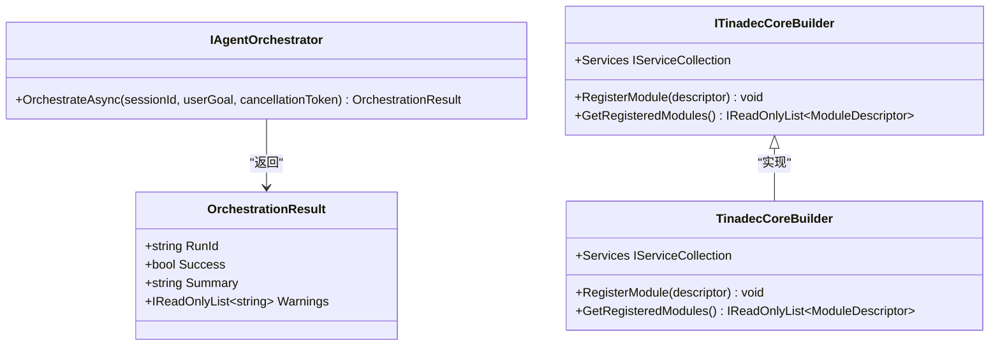
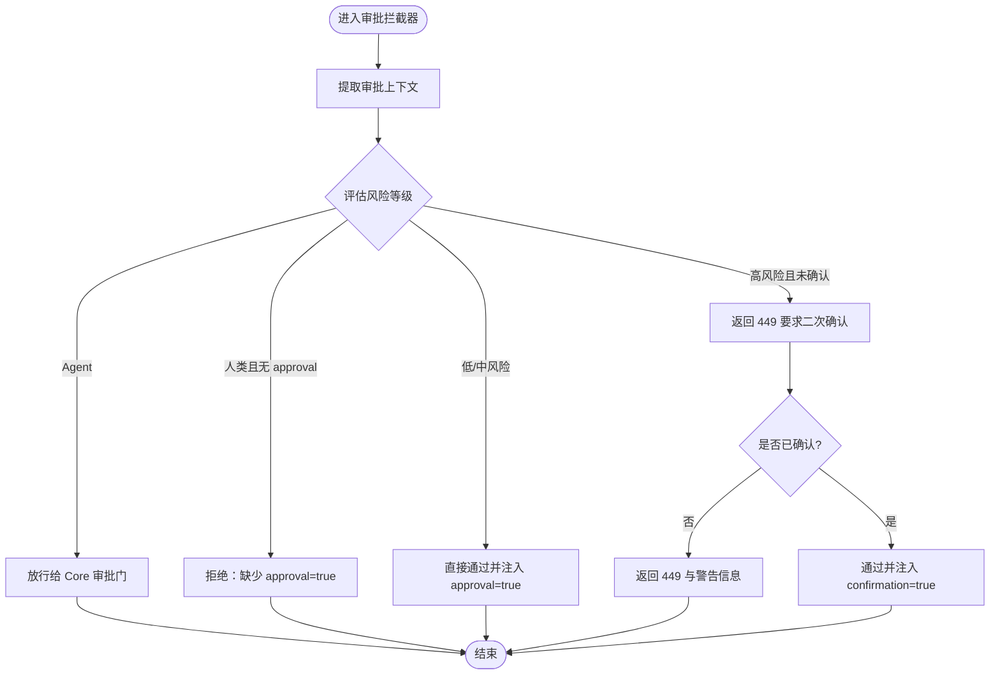
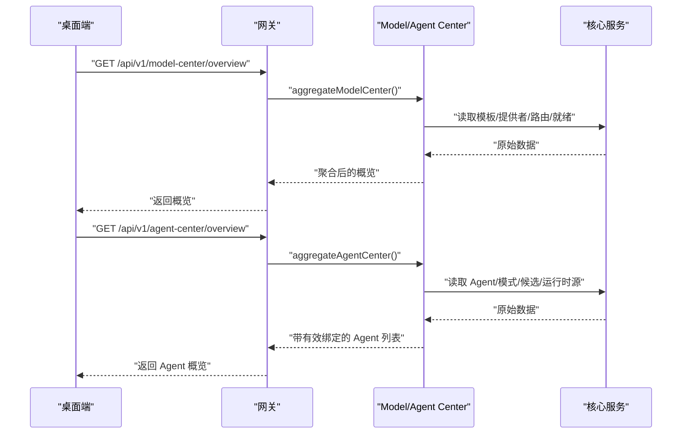
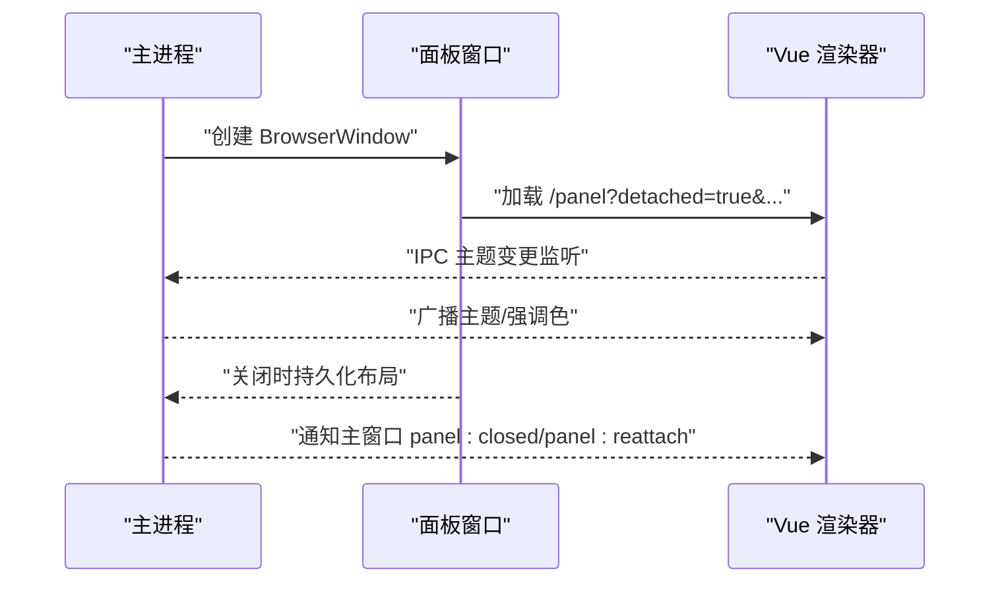
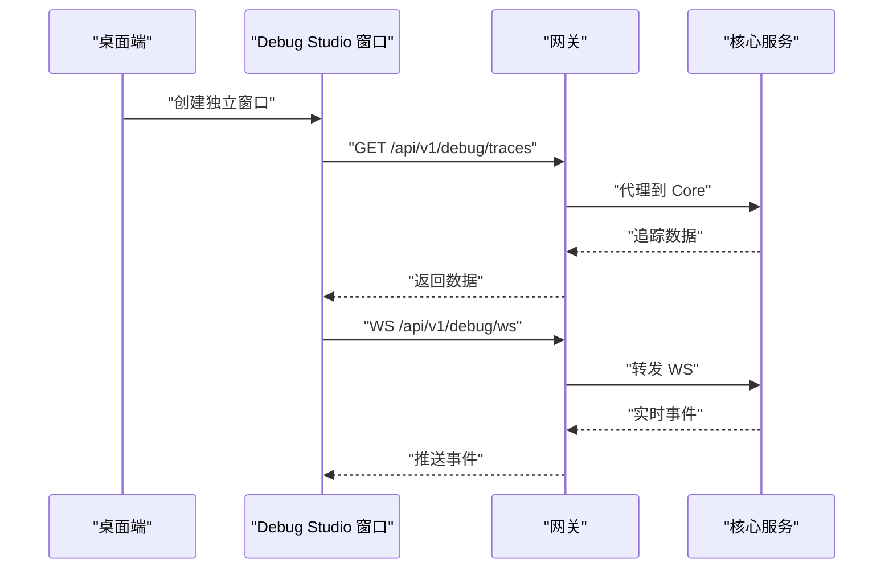
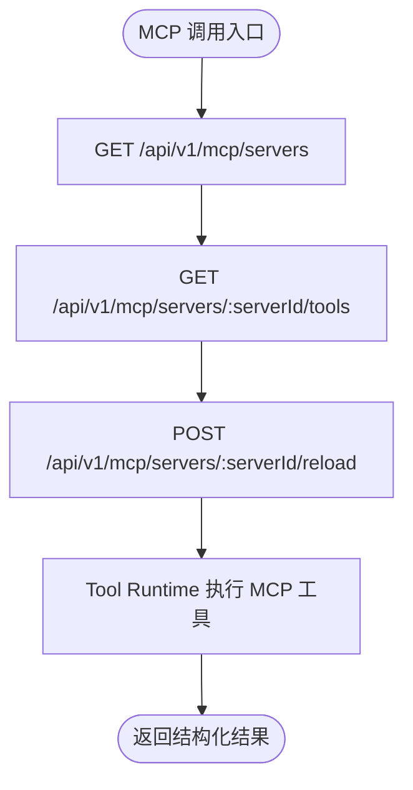
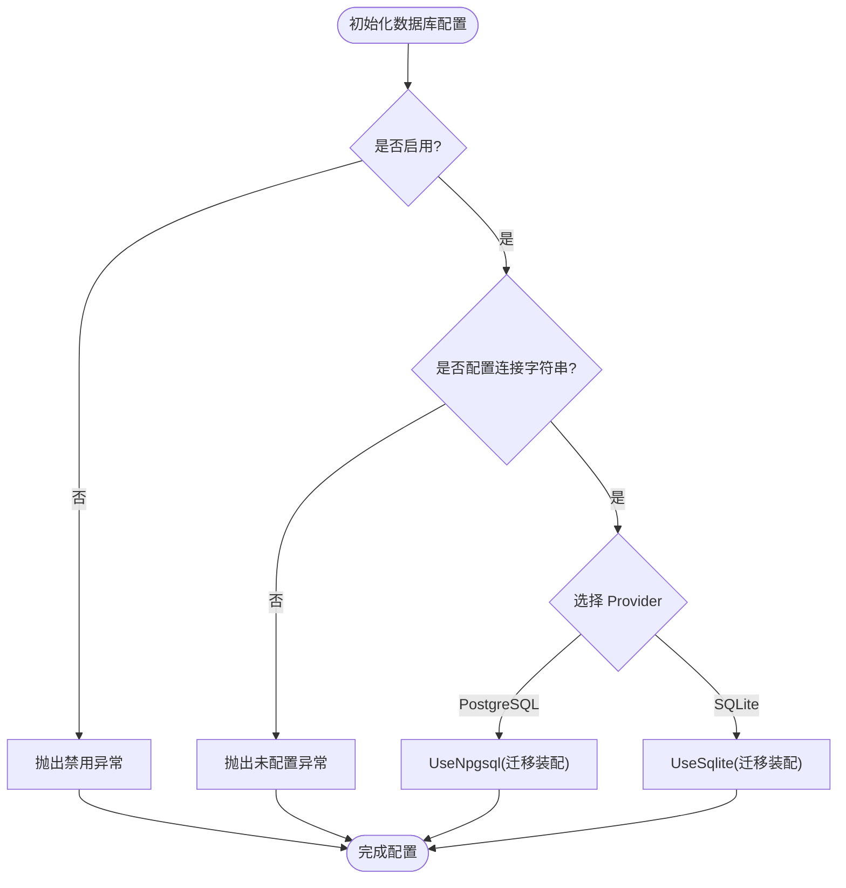
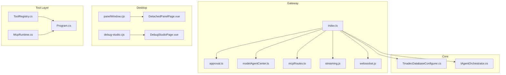

# 核心特性

<cite>
**本文引用的文件**   
- [README.md](file://README.md)
- [架构文档](file://docs/architecture.md)
- [IAgentOrchestrator.cs](file://TinadecCore/Abstractions/Ports/IAgentOrchestrator.cs)
- [TinadecCoreBuilder.cs](file://TinadecCore/Runtime/TinadecCoreBuilder.cs)
- [ITinadecCoreBuilder.cs](file://TinadecCore/Abstractions/ITinadecCoreBuilder.cs)
- [TinadecDatabaseConfigurer.cs](file://TinadecCore/Persistence/TinadecDatabaseConfigurer.cs)
- [index.ts](file://TinadecGateway/src/index.ts)
- [modelAgentCenter.ts](file://TinadecGateway/src/modelAgentCenter.ts)
- [approval.ts](file://TinadecGateway/src/approval.ts)
- [McpRuntime.cs](file://TinadecTools/Tools/Mcp/McpRuntime.cs)
- [ToolRegistry.cs](file://TinadecTools/Abstractions/ToolRegistry.cs)
- [Program.cs](file://TinadecTools/Program.cs)
- [debug-studio.cjs](file://apps/desktop/electron/debug-studio.cjs)
- [panelWindow.cjs](file://apps/desktop/electron/panelWindow.cjs)
- [DetachedPanelPage.vue](file://apps/desktop/src/pages/DetachedPanelPage.vue)
- [DebugStudioPage.vue](file://apps/desktop/src/pages/DebugStudioPage.vue)
</cite>

## 目录
1. [简介](#简介)
2. [项目结构](#项目结构)
3. [核心组件](#核心组件)
4. [架构总览](#架构总览)
5. [详细组件分析](#详细组件分析)
6. [依赖分析](#依赖分析)
7. [性能考虑](#性能考虑)
8. [故障排查指南](#故障排查指南)
9. [结论](#结论)
10. [附录](#附录)

## 简介
本文件面向不同经验水平的开发者，系统化阐述 TinadecOffice 的核心特性与协作方式：双层智能体编排、审批门控工具执行、Model/Agent Center、可分离面板窗口、Agent Debug Studio、MCP 透传、共享数据库抽象。每个特性均包含工作原理、配置要点、使用示例（以 API 调用路径与代码片段路径形式呈现），以及与其他特性的集成关系。

## 项目结构
TinadecOffice 由三层构成：
- Desktop（Electron + Vue）：用户界面、可分离面板、调试视图
- Gateway（Elysia/Bun）：BFF/代理、协议转换、中心聚合视图
- Core（.NET 10 + MAF）：唯一状态权威、编排、工具策略、模型路由、持久化、就绪回执

图表来源
- [README.md](file://README.md)
- [架构文档](file://docs/architecture.md)

章节来源
- [README.md](file://README.md)
- [架构文档](file://docs/architecture.md)

## 核心组件
- 双层智能体编排：规划层主动监督，执行层被动执行；通过 IAgentOrchestrator 暴露统一编排入口。
- 审批门控工具执行：Gateway 对高风险操作进行二次确认，人类请求需 approval=true，Agent 请求走 Core 审批门。
- Model/Agent Center：Gateway 聚合 Core 的供应商模板、提供者实例、路由、就绪信息，提供无状态中心视图。
- 可分离面板窗口：Electron 侧创建独立 BrowserWindow，支持布局持久化、主题广播、重新附着。
- Agent Debug Studio：独立调试窗口，通过 Core 的调试 API 获取追踪、指标、诊断与实时事件。
- MCP 透传：Tool 层维护 MCP 服务器仓库与客户端池，Gateway 透传 MCP 管理接口。
- 共享数据库抽象：EF Core 配置 SQLite/PostgreSQL，统一迁移装配与连接校验。

章节来源
- [IAgentOrchestrator.cs](file://TinadecCore/Abstractions/Ports/IAgentOrchestrator.cs)
- [index.ts](file://TinadecGateway/src/index.ts)
- [modelAgentCenter.ts](file://TinadecGateway/src/modelAgentCenter.ts)
- [approval.ts](file://TinadecGateway/src/approval.ts)
- [panelWindow.cjs](file://apps/desktop/electron/panelWindow.cjs)
- [debug-studio.cjs](file://apps/desktop/electron/debug-studio.cjs)
- [McpRuntime.cs](file://TinadecTools/Tools/Mcp/McpRuntime.cs)
- [TinadecDatabaseConfigurer.cs](file://TinadecCore/Persistence/TinadecDatabaseConfigurer.cs)

## 架构总览
- 职责边界：Core 是唯一状态权威；Gateway 仅做认证、组合、协议转换与代理；Desktop 不持有业务状态。
- 协议分层：HTTP/JSON、SSE、WebSocket、流式 HTTP。
- 端口约定：Gateway: 48730，Core: 48731，Vite 渲染器: 5173。

图表来源
- [index.ts](file://TinadecGateway/src/index.ts)
- [approval.ts](file://TinadecGateway/src/approval.ts)
- [ToolRegistry.cs](file://TinadecTools/Abstractions/ToolRegistry.cs)
- [Program.cs](file://TinadecTools/Program.cs)

章节来源
- [架构文档](file://docs/architecture.md)

## 详细组件分析

### 双层智能体编排
- 工作原理：IAgentOrchestrator 定义 OrchestrateAsync(sessionId, userGoal)，返回 RunId、Success、Summary、Warnings。规划层负责主动监督与任务分解，执行层负责具体任务落地。
- 配置选项：通过 ITinadecCoreBuilder 注册模块描述符，参与 harness manifest。
- 使用示例：
  - 编排入口：参考 IAgentOrchestrator 接口定义。
  - 模块注册：参考 ITinadecCoreBuilder.RegisterModule 与 TinadecCoreBuilder 的实现。

图表来源
- [IAgentOrchestrator.cs](file://TinadecCore/Abstractions/Ports/IAgentOrchestrator.cs)
- [ITinadecCoreBuilder.cs](file://TinadecCore/Abstractions/ITinadecCoreBuilder.cs)
- [TinadecCoreBuilder.cs](file://TinadecCore/Runtime/TinadecCoreBuilder.cs)

章节来源
- [IAgentOrchestrator.cs](file://TinadecCore/Abstractions/Ports/IAgentOrchestrator.cs)
- [ITinadecCoreBuilder.cs](file://TinadecCore/Abstractions/ITinadecCoreBuilder.cs)
- [TinadecCoreBuilder.cs](file://TinadecCore/Runtime/TinadecCoreBuilder.cs)

### 审批门控工具执行
- 工作原理：Gateway 提取 ApprovalContext（source、approval、confirmation、toolId、command、cwd），按风险等级评估：
  - Agent 请求：放行，交由 Core 审批门处理
  - 人类低风险/中风险：直接通过并注入 approval=true
  - 人类高风险：返回 449 要求二次确认，确认后放行
- 配置选项：高风险/中风险工具 ID 集合内置于 approval.ts；可通过扩展规则增强。
- 使用示例：
  - 执行 Code Tool：POST /api/v1/code/tools/:toolId/execute
  - 若需确认：收到 449 后携带 confirmation=true 重试

图表来源
- [approval.ts](file://TinadecGateway/src/approval.ts)
- [index.ts](file://TinadecGateway/src/index.ts)

章节来源
- [approval.ts](file://TinadecGateway/src/approval.ts)
- [index.ts](file://TinadecGateway/src/index.ts)

### Model/Agent Center
- 工作原理：Gateway 聚合 Core 的供应商模板、提供者实例、模型路由、就绪信息与 ACP 适配器，输出统一的 Model/Agent 中心视图。对不可用能力降级为诊断项，剥离敏感字段。
- 配置选项：当前模式为“仅配置的模型”，不支持实时发现；Agent 运行时绑定写入暂不支持（返回 501）。
- 使用示例：
  - 加载 Model Center 概览：GET /api/v1/model-center/overview
  - 加载 Agent Center 概览：GET /api/v1/agent-center/overview
  - 预留接口：PUT /api/v1/agents/:agentId/runtime-binding（当前返回 501）

图表来源
- [modelAgentCenter.ts](file://TinadecGateway/src/modelAgentCenter.ts)
- [index.ts](file://TinadecGateway/src/index.ts)

章节来源
- [modelAgentCenter.ts](file://TinadecGateway/src/modelAgentCenter.ts)
- [index.ts](file://TinadecGateway/src/index.ts)

### 可分离面板窗口
- 工作原理：Electron 主进程创建独立 BrowserWindow，记录窗口位置与尺寸，持久化到磁盘；支持最小化、最大化、关闭、重新附着到主窗口；主题变更通过 IPC 广播。
- 配置选项：面板样式效果（不透明/半透明/模糊）由前端样式系统控制；窗口默认尺寸与位置计算基于屏幕工作区。
- 使用示例：
  - 创建面板：createPanelWindow(tabId, type, title, state, options)
  - 重新附着：reattachPanelWindow(windowId, tabId, type, title, state)
  - 页面路由：/panel?detached=true&tabId=...&type=...

图表来源
- [panelWindow.cjs](file://apps/desktop/electron/panelWindow.cjs)
- [DetachedPanelPage.vue](file://apps/desktop/src/pages/DetachedPanelPage.vue)

章节来源
- [panelWindow.cjs](file://apps/desktop/electron/panelWindow.cjs)
- [DetachedPanelPage.vue](file://apps/desktop/src/pages/DetachedPanelPage.vue)

### Agent Debug Studio
- 工作原理：独立 Electron 窗口加载 Debug Studio 页面，通过 Core 的调试 API 查询追踪、指标、诊断，并通过 WebSocket 接收实时事件。
- 配置选项：调试端点在 Gateway 中代理至 Core；开发模式下自动打开 DevTools。
- 使用示例：
  - 打开窗口：createDebugStudioWindow()
  - 查询追踪：GET /api/v1/debug/traces
  - 实时事件：WS /api/v1/debug/ws（由 Core 提供）

图表来源
- [debug-studio.cjs](file://apps/desktop/electron/debug-studio.cjs)
- [DebugStudioPage.vue](file://apps/desktop/src/pages/DebugStudioPage.vue)
- [index.ts](file://TinadecGateway/src/index.ts)

章节来源
- [debug-studio.cjs](file://apps/desktop/electron/debug-studio.cjs)
- [DebugStudioPage.vue](file://apps/desktop/src/pages/DebugStudioPage.vue)
- [index.ts](file://TinadecGateway/src/index.ts)

### MCP 透传
- 工作原理：Tool 层维护 McpServerRepository 与 McpClientPool，Gateway 暴露 MCP 服务器管理与工具列表接口，执行时透传到 Tool Runtime。
- 配置选项：MCP 服务器配置由 Tool 层管理；测试场景可通过 ConfigureForTests 注入自定义 ClientPool。
- 使用示例：
  - 列出服务器：GET /api/v1/mcp/servers
  - 列出工具：GET /api/v1/mcp/servers/:serverId/tools
  - 重载服务器：POST /api/v1/mcp/servers/:serverId/reload

图表来源
- [McpRuntime.cs](file://TinadecTools/Tools/Mcp/McpRuntime.cs)
- [index.ts](file://TinadecGateway/src/index.ts)

章节来源
- [McpRuntime.cs](file://TinadecTools/Tools/Mcp/McpRuntime.cs)
- [index.ts](file://TinadecGateway/src/index.ts)

### 共享数据库抽象
- 工作原理：通过 EF Core 配置 SQLite 或 PostgreSQL，装配对应迁移程序集；未启用或未配置连接字符串将抛出异常。
- 配置选项：Provider 选择（SQLite/PostgreSQL）、连接字符串、迁移程序集名称。
- 使用示例：
  - 启用数据库：设置 TinadecPersistence:Enabled=true
  - 配置连接：ConnectionStrings:TinadecCore（PG）或 TinadecPersistence:Sqlite:DatabasePath（SQLite）

图表来源
- [TinadecDatabaseConfigurer.cs](file://TinadecCore/Persistence/TinadecDatabaseConfigurer.cs)

章节来源
- [TinadecDatabaseConfigurer.cs](file://TinadecCore/Persistence/TinadecDatabaseConfigurer.cs)

## 依赖分析
- 组件耦合：
  - Gateway 依赖 approval.ts、modelAgentCenter.ts、mcpRoutes.ts、streaming.ts、websocket.ts
  - Desktop 依赖 panelWindow.cjs、debug-studio.cjs、DetachedPanelPage.vue、DebugStudioPage.vue
  - Tool 层依赖 ToolRegistry.cs、McpRuntime.cs、Program.cs
- 外部依赖：
  - Core 依赖 EF Core（SQLite/PostgreSQL）
  - Gateway 依赖 Elysia（Bun）
  - Desktop 依赖 Electron + Vue

图表来源
- [index.ts](file://TinadecGateway/src/index.ts)
- [approval.ts](file://TinadecGateway/src/approval.ts)
- [modelAgentCenter.ts](file://TinadecGateway/src/modelAgentCenter.ts)
- [panelWindow.cjs](file://apps/desktop/electron/panelWindow.cjs)
- [debug-studio.cjs](file://apps/desktop/electron/debug-studio.cjs)
- [DetachedPanelPage.vue](file://apps/desktop/src/pages/DetachedPanelPage.vue)
- [DebugStudioPage.vue](file://apps/desktop/src/pages/DebugStudioPage.vue)
- [ToolRegistry.cs](file://TinadecTools/Abstractions/ToolRegistry.cs)
- [McpRuntime.cs](file://TinadecTools/Tools/Mcp/McpRuntime.cs)
- [Program.cs](file://TinadecTools/Program.cs)
- [TinadecDatabaseConfigurer.cs](file://TinadecCore/Persistence/TinadecDatabaseConfigurer.cs)
- [IAgentOrchestrator.cs](file://TinadecCore/Abstractions/Ports/IAgentOrchestrator.cs)

章节来源
- [index.ts](file://TinadecGateway/src/index.ts)
- [panelWindow.cjs](file://apps/desktop/electron/panelWindow.cjs)
- [debug-studio.cjs](file://apps/desktop/electron/debug-studio.cjs)
- [ToolRegistry.cs](file://TinadecTools/Abstractions/ToolRegistry.cs)
- [McpRuntime.cs](file://TinadecTools/Tools/Mcp/McpRuntime.cs)
- [Program.cs](file://TinadecTools/Program.cs)
- [TinadecDatabaseConfigurer.cs](file://TinadecCore/Persistence/TinadecDatabaseConfigurer.cs)
- [IAgentOrchestrator.cs](file://TinadecCore/Abstractions/Ports/IAgentOrchestrator.cs)

## 性能考虑
- 事件流：SSE/WebSocket 用于实时事件，避免频繁轮询。
- 聚合视图：Model/Agent Center 在 Gateway 层聚合，减少前端多次请求。
- 数据库：EF Core 迁移按需执行，连接池与超时参数建议根据部署环境调优。
- 窗口管理：面板窗口布局持久化采用防抖保存，降低 IO 压力。

[本节为通用指导，不直接分析具体文件]

## 故障排查指南
- 审批拦截失败：检查请求是否包含 approval=true；高风险操作需 confirmation=true。
- Model/Agent Center 不可用：查看 diagnostics 中的 unavailable_capabilities；确认 Core 就绪接口正常。
- 面板窗口不显示：检查 ready-to-show 事件与 loadURL/loadFile 顺序；确认 VITE_DEV_SERVER_URL 与 splash=0。
- MCP 工具不可用：确认 McpServerRepository 配置正确，ClientPool 可用。
- 数据库未启用：检查 TinadecPersistence:Enabled 与连接字符串配置。

章节来源
- [approval.ts](file://TinadecGateway/src/approval.ts)
- [modelAgentCenter.ts](file://TinadecGateway/src/modelAgentCenter.ts)
- [panelWindow.cjs](file://apps/desktop/electron/panelWindow.cjs)
- [McpRuntime.cs](file://TinadecTools/Tools/Mcp/McpRuntime.cs)
- [TinadecDatabaseConfigurer.cs](file://TinadecCore/Persistence/TinadecDatabaseConfigurer.cs)

## 结论
TinadecOffice 通过清晰的三层架构与模块化设计，实现了安全可控的智能体编排与工具执行。Gateway 作为无状态聚合层，Desktop 专注交互体验，Core 保持唯一状态权威。各特性之间通过标准化 API 与事件流协同，便于扩展与维护。

[本节为总结性内容，不直接分析具体文件]

## 附录
- 常用命令：npm run dev、npm run dev:core、npm run dev:gateway、npm run dev:desktop
- 端口说明：Gateway 48730、Core 48731、Vite 5173
- 文档参考：产品模型、架构、启动手册、安全

[本节为补充信息，不直接分析具体文件]