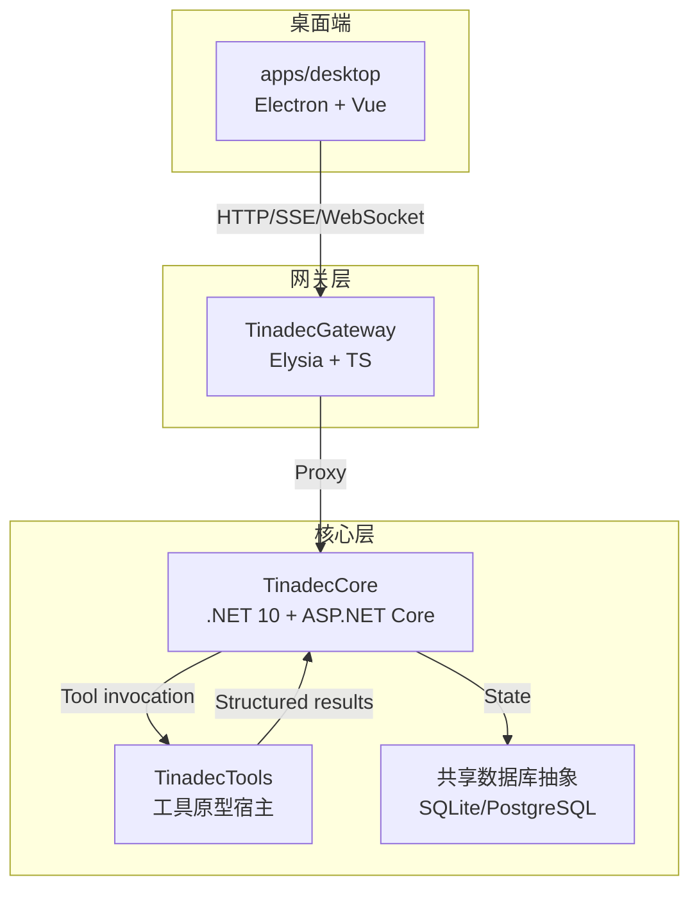
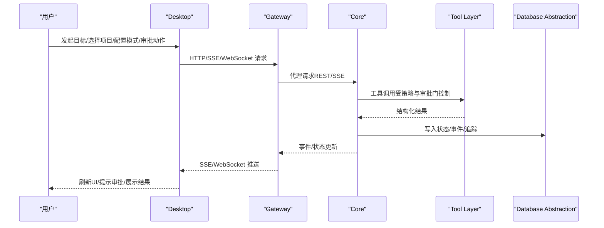
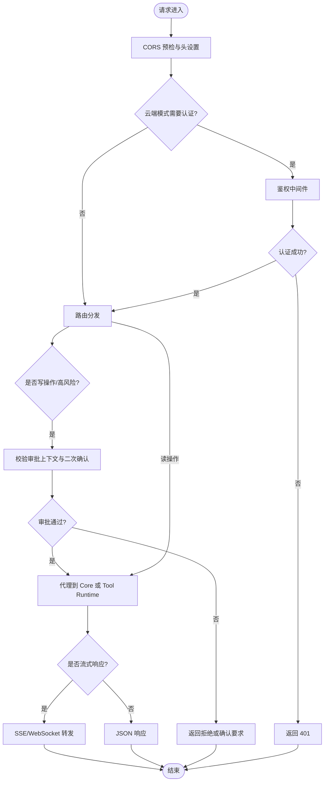
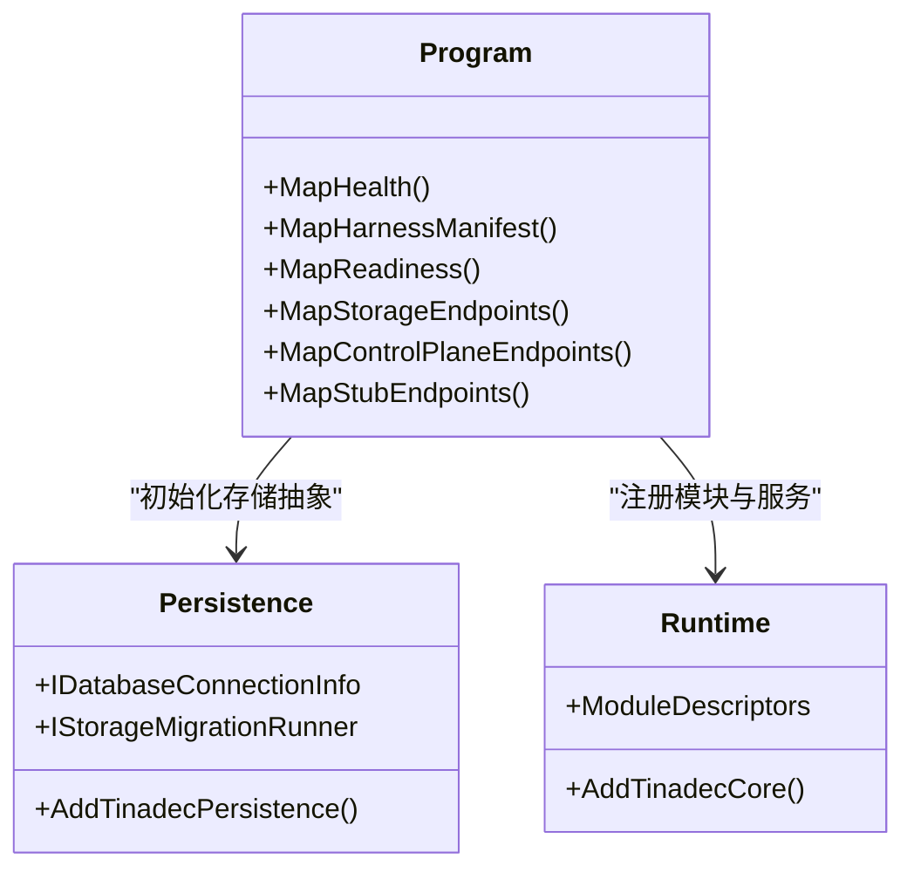
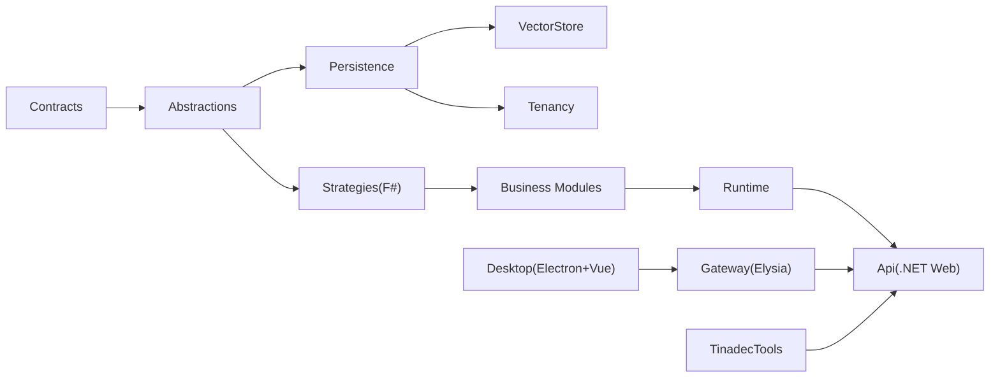
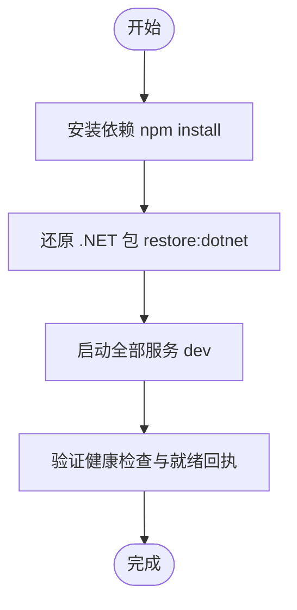

# 项目概览

<cite>
**本文引用的文件**   
- [README.md](file://README.md)
- [AGENTS.md](file://AGENTS.md)
- [architecture.md](file://docs/architecture.md)
- [startup.md](file://docs/startup.md)
- [index.ts](file://TinadecGateway/src/index.ts)
- [Program.cs](file://TinadecCore/Api/Program.cs)
- [package.json](file://package.json)
- [desktop package.json](file://apps/desktop/package.json)
</cite>

## 目录
1. [简介](#简介)
2. [项目结构](#项目结构)
3. [核心组件](#核心组件)
4. [架构总览](#架构总览)
5. [详细组件分析](#详细组件分析)
6. [依赖关系分析](#依赖关系分析)
7. [性能与可观测性](#性能与可观测性)
8. [快速开始与常用命令](#快速开始与常用命令)
9. [故障排查指南](#故障排查指南)
10. [结论](#结论)

## 简介
TinadecOffice 是一个面向 AI 智能体协作的 Agent 工作空间，采用“Desktop + Gateway + Core”三层架构：
- Desktop（桌面端）负责交互呈现、任务编排可视化、审批与事件流展示。
- Gateway（网关/BFF）作为薄代理与聚合视图层，统一对外暴露 REST/SSE/WebSocket 接口，并代理到 Core。
- Core（核心运行时）是唯一状态权威，提供双层智能体编排、工具策略与执行门控、模型路由、持久化与就绪回执等能力。

设计原则强调：
- Core 是唯一状态权威；Gateway 与 Desktop 不保存业务状态。
- Desktop 只调用 Gateway，不直接访问 Core。
- 写操作必须经过审批门。
- API 契约统一使用 snake_case。
- Code 是 Tool 层内置工具套件，不是与 Core/Desktop 并列的独立层。

**章节来源**
- [README.md:17-31](file://README.md#L17-L31)
- [AGENTS.md:34-119](file://AGENTS.md#L34-L119)

## 项目结构
仓库采用多包工作区组织，核心目录职责如下：
- TinadecCore：基于 .NET 10 + MAF 的模块化单体，包含 Contracts、Abstractions、Persistence、VectorStore、Tenancy、Strategies、DmaEA、Models、Context、Prompts、Memory、Skills、LoopGuard、Lifecycle、Runtime、Api 等子项目。
- TinadecGateway：Elysia TypeScript BFF/代理，提供 /api/v1/* 与 Swagger 文档。
- apps/desktop：Electron + Vue 3 + Vite + Tailwind 的桌面 UI，含 Debug Studio、可分离面板窗口、终端集成等。
- TinadecTools：审批感知的工具原型宿主（文件/命令/Git/MCP），以及用于静态注册的源生成器。
- tests：各层测试与遗留证据测试。
- docs：产品模型、架构、安全、启动手册等。

**图表来源**
- [README.md:33-43](file://README.md#L33-L43)
- [AGENTS.md:101-111](file://AGENTS.md#L101-L111)

**章节来源**
- [README.md:61-73](file://README.md#L61-L73)
- [AGENTS.md:159-189](file://AGENTS.md#L159-L189)

## 核心组件
- 双层智能体编排（Planning + Execution）：规划层主动监督与规划，执行层被动执行任务，二者通过 Core 协调。
- 审批门控机制：所有写操作需经用户明确批准，Gateway 在请求路径中校验审批上下文与二次确认。
- 工具执行环境：Tool 层提供文件、命令、Git、MCP 等能力，受 Core 策略与审批门控制。
- Model/Agent Center：Gateway 聚合 Core 资源，提供无状态中心视图，供 Desktop 渲染。
- 共享数据库抽象：默认 SQLite 本地文件，可选 PostgreSQL；模块通过 EF Core LINQ 访问，保持 provider 无关。
- 就绪回执与事件回放：Core 暴露 readiness/harness manifest 等回执，SSE 回放事件供前端实时刷新。

**章节来源**
- [AGENTS.md:70-78](file://AGENTS.md#L70-L78)
- [architecture.md:19-45](file://docs/architecture.md#L19-L45)

## 架构总览
整体数据流遵循“Desktop → Gateway → Core → Tool → DB”的路径，事件通过 SSE/WebSocket 回推至 Desktop。

**图表来源**
- [AGENTS.md:101-111](file://AGENTS.md#L101-L111)
- [index.ts:232-286](file://TinadecGateway/src/index.ts#L232-L286)

**章节来源**
- [README.md:33-43](file://README.md#L33-L43)
- [AGENTS.md:87-118](file://AGENTS.md#L87-L118)

## 详细组件分析

### Gateway（BFF/代理）
- 职责：鉴权（云端模式）、协议转换（HTTP/SSE/WebSocket/流式）、代理到 Core 与 Tool Runtime、Model/Agent Center 聚合视图。
- 关键实现：
  - 健康检查与就绪回执透传。
  - SSE 事件流转发（/events、invoke-stream）。
  - 审批门拦截与二次确认（code tools 执行路径）。
  - MCP 路由与 ACP 适配器代理。
  - 统一的 CORS 与公共路径放行。

**图表来源**
- [index.ts:107-155](file://TinadecGateway/src/index.ts#L107-L155)
- [index.ts:351-400](file://TinadecGateway/src/index.ts#L351-L400)

**章节来源**
- [index.ts:1-800](file://TinadecGateway/src/index.ts#L1-L800)

### Core（状态权威与编排）
- 职责：唯一状态权威，管理会话、运行、任务图、上下文包、监督发现、审批、模型路由、事件、追踪、权限、能力发现、共享数据库抽象。
- 当前实现要点：
  - 健康检查、harness manifest、readiness 回执已实现。
  - 项目/会话/消息 CRUD、会话运行列表、事件回放 SSE 已实现。
  - 部分运行时写入仍为 501 stub（invocation/scheduling/tool dispatch/approval 写入）。
  - 共享数据库抽象（EF Core）默认 SQLite，可选 PostgreSQL。

**图表来源**
- [Program.cs:10-39](file://TinadecCore/Api/Program.cs#L10-L39)
- [Program.cs:44-117](file://TinadecCore/Api/Program.cs#L44-L117)
- [Program.cs:122-164](file://TinadecCore/Api/Program.cs#L122-L164)

**章节来源**
- [Program.cs:1-181](file://TinadecCore/Api/Program.cs#L1-L181)
- [AGENTS.md:113-143](file://AGENTS.md#L113-L143)

### Desktop（UI 与调试）
- 职责：聊天界面、任务图、执行分派、上下文包、监督发现、审批与事件流展示；支持可分离面板窗口与 Agent Debug Studio。
- 技术栈：Electron + Vue 3 + Vite + Tailwind；Monaco Editor、Xterm.js、node-pty。
- 通信：仅通过 Gateway 的 HTTP/SSE/WebSocket 接口，不直接访问 Core。

**章节来源**
- [AGENTS.md:38-50](file://AGENTS.md#L38-L50)
- [desktop package.json:1-69](file://apps/desktop/package.json#L1-L69)

### TinadecTools（工具原型与审批门）
- 职责：提供文件读写、命令执行、Git 操作、MCP 透传等工具能力，受 Core 策略与审批门控制。
- 特点：
  - 静态工具通过 [ToolFunction] 与源生成器注册，支持 RequiresApproval。
  - 非静态工具继承 ToolHandlerBase 或通过 ToolRegistry 注册。
  - MCP pass-through 独立实现 list/search/invoke，配置文件从 mcp_servers.json 或环境变量读取。

**章节来源**
- [AGENTS.md:80-86](file://AGENTS.md#L80-L86)
- [AGENTS.md:225-248](file://AGENTS.md#L225-L248)

## 依赖关系分析
- Core 模块依赖清晰：Contracts → Abstractions → Persistence → VectorStore/Tenancy/Strategies → 业务模块 → Runtime → Api。
- Gateway 仅依赖 Elysia 与 Node 生态，保持薄代理。
- Desktop 依赖 Electron/Vue 生态，仅消费 Gateway 接口。
- Tools 与 Core 通过策略与审批门解耦，避免硬编码。

**图表来源**
- [AGENTS.md:56-75](file://AGENTS.md#L56-L75)

**章节来源**
- [AGENTS.md:56-75](file://AGENTS.md#L56-L75)

## 性能与可观测性
- 事件流：Core 通过 SSE 回放事件，Gateway 转发至 Desktop，减少轮询开销。
- 就绪回执：readiness/harness manifest 提供运行时与健康状态，便于前端降级与诊断。
- 追踪与调试：Agent Debug Studio 提供 trace/metrics/diagnostics 查询与实时 WebSocket 流。
- 数据库抽象：EF Core LINQ 保证 provider 无关，迁移协调与就绪探针提升稳定性。

**章节来源**
- [architecture.md:51-78](file://docs/architecture.md#L51-L78)
- [architecture.md:140-172](file://docs/architecture.md#L140-L172)

## 快速开始与常用命令
- 一键启动：npm run dev（同时启动 Core、Gateway、Desktop）。
- 单独服务：dev:core（48731）、dev:gateway（48730）、dev:desktop（5173）。
- 构建与测试：build、test、restore:dotnet。
- 端口说明：Gateway 48730、Core 48731、Vite 5173。

**图表来源**
- [README.md:45-58](file://README.md#L45-L58)
- [startup.md:15-31](file://docs/startup.md#L15-L31)

**章节来源**
- [README.md:85-95](file://README.md#L85-L95)
- [package.json:9-19](file://package.json#L9-L19)
- [startup.md:15-31](file://docs/startup.md#L15-L31)

## 故障排查指南
- 常见问题：
  - Settings > Agents 为空：检查 Gateway 健康与代理是否正常。
  - dotnet build 失败：清理 Version/Ice-Version 环境变量后重试。
  - 进程锁定：停止旧 Core 进程或构建到隔离输出目录。
- 验证步骤：
  - 检查端口占用与进程状态。
  - 调用 /api/v1/health 与 /api/v1/readiness 确认服务状态。
  - 通过 Gateway 获取 agents 列表验证端到端连通性。

**章节来源**
- [startup.md:143-161](file://docs/startup.md#L143-L161)
- [startup.md:93-120](file://docs/startup.md#L93-L120)

## 结论
TinadecOffice 以清晰的三层架构与严格的职责边界，实现了可扩展的智能体工作空间。Core 作为唯一状态权威，结合审批门控与工具策略，确保安全性与可控性；Gateway 提供薄代理与聚合视图，简化前端集成；Desktop 专注于用户体验与调试能力。随着双层智能体编排与工具执行环境的完善，系统将为开发者与企业用户提供强大而安全的 AI 协作平台。